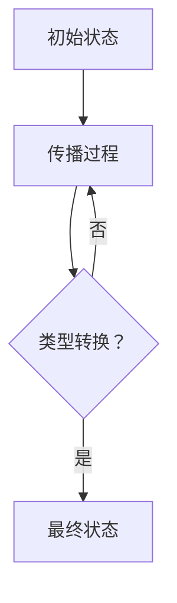

                 

### 文章标题：数据分析在宇宙中微子背景研究中的应用

#### 关键词：
- 数据分析
- 宇宙中微子
- 中微子背景研究
- 统计分析
- 机器学习
- 数据可视化
- 高性能计算

#### 摘要：
本文详细探讨了数据分析在宇宙中微子背景研究中的应用。通过介绍中微子的基本概念及其在宇宙中的重要角色，我们深入分析了数据分析在这一领域的重要性。文章涵盖了数据分析的基本概念、方法及其在宇宙中微子背景研究中的应用实例，并通过Python代码和数学模型展示了具体的技术实现。此外，文章还探讨了数据分析工具和技术的发展趋势，以及这一领域的未来挑战与机遇。

---

### 引言

宇宙中微子（Cosmic Neutrinos）是一种基本粒子，几乎不与普通物质相互作用。它们是宇宙中最为丰富的物质之一，但对其了解仍然有限。随着科技的发展，数据分析技术在宇宙学研究中发挥着越来越重要的作用。中微子背景研究作为一种重要的宇宙学研究领域，依赖于先进的数据分析技术来揭示中微子的性质和宇宙的起源。

数据分析在宇宙中微子背景研究中的应用具有重要意义。首先，中微子背景数据量庞大，且复杂度高，需要通过数据分析技术进行有效的处理和解读。其次，数据分析方法可以帮助研究人员发现中微子背景中的规律和现象，从而推动我们对宇宙的认识。此外，随着数据分析技术的不断发展，我们可以预期中微子背景研究将取得更加精确和深入的成果。

本文将按照以下结构展开：

1. **宇宙中微子背景研究概述**：介绍中微子的基本概念、背景研究的重要性以及历史与现状。
2. **数据分析基本概念**：阐述数据分析的定义、流程和方法。
3. **中微子背景数据的收集与预处理**：讨论中微子背景数据的来源、收集方法和预处理技术。
4. **数据分析方法在宇宙中微子背景研究中的应用**：介绍统计分析、机器学习和数据可视化方法在研究中的应用。
5. **宇宙中微子背景研究中的数据分析应用实例**：通过具体实例展示数据分析方法在实际研究中的应用。
6. **数据分析工具和技术**：探讨常用的数据分析工具和技术，包括数据库、数据仓库和高性能计算等。
7. **宇宙中微子背景研究的未来展望**：分析中微子背景研究的未来发展趋势、数据分析技术的未来发展以及面临的挑战与机遇。

通过本文的讨论，我们希望能够为读者提供对数据分析在宇宙中微子背景研究中应用的全景了解，并激发对该领域进一步研究的兴趣。接下来，我们将首先介绍宇宙中微子背景研究的基本概念和重要性。 ### 宇宙中微子背景研究概述

#### 1.1 中微子的基本概念

中微子（Neutrino）是一种基本粒子，具有非常小的质量，但几乎不与普通物质相互作用。它们是宇宙中最为常见的粒子之一，几乎无处不在。中微子分为三种类型：电子中微子（$\nu_e$）、μ子中微子（$\nu_\mu$）和τ子中微子（$\nu_\tau$），以及它们的反粒子。中微子与其他粒子的相互作用极其微弱，这使得它们能够穿越地球、太阳等天体而几乎不被探测到。

中微子的质量非常小，但并非完全没有质量。随着对中微子研究的深入，科学家们已经发现它们之间存在振荡现象，即中微子在传播过程中可以相互转化。这一发现揭示了中微子质量的存在和复杂性质。中微子振荡现象的发现，是粒子物理学和宇宙学中的一个重要里程碑，为科学家们提供了新的研究方向和实验方法。

#### 1.2 中微子背景

中微子背景（Cosmic Neutrino Background）是指遍布整个宇宙的中微子分布，它起源于宇宙早期的高温高密度状态。在大爆炸之后，宇宙经历了快速膨胀，中微子与其他物质分离并扩散到宇宙的各个角落。中微子背景是目前宇宙中唯一的物质形态，它几乎不受宇宙演化影响，是研究宇宙早期状态和演化历史的重要窗口。

中微子背景的探测和研究具有重要意义。首先，它提供了宇宙早期状态的信息，有助于我们理解宇宙的起源和演化。其次，中微子背景的研究有助于揭示物质-辐射平衡状态、宇宙背景辐射、结构形成等宇宙学关键问题。此外，中微子背景还与暗物质、暗能量等宇宙学前沿问题密切相关，对它们的研究有助于深化我们对宇宙本质的认识。

#### 1.3 中微子背景研究的重要性

中微子背景研究在宇宙学中具有重要地位，主要体现在以下几个方面：

1. **宇宙早期状态的研究**：中微子背景是宇宙早期状态的直接证据，它记录了宇宙从高温高密度状态向当前状态演化的信息。通过研究中微子背景，科学家们可以追溯宇宙的起源、早期宇宙的物理过程和宇宙结构形成。

2. **宇宙学参数的测量**：中微子背景的研究提供了宇宙学参数的测量，如宇宙膨胀率、密度、质量分布等。这些参数对于理解宇宙的演化和未来命运至关重要。

3. **物质-辐射平衡状态的研究**：中微子背景的研究有助于揭示物质-辐射平衡状态，这是宇宙学中的一个关键问题。了解这一状态有助于我们理解宇宙的早期演化，如宇宙背景辐射的起源和性质。

4. **暗物质和暗能量的研究**：中微子背景与暗物质和暗能量密切相关。暗物质和暗能量是宇宙学中的两个重要概念，它们对宇宙的演化和结构形成起着关键作用。通过研究中微子背景，科学家们可以探索暗物质和暗能量的性质和起源。

5. **粒子物理学的发展**：中微子背景的研究有助于深化我们对粒子物理学的理解，特别是中微子振荡现象和粒子质量的研究。这些发现不仅丰富了粒子物理学理论，还为未来的实验提供了新的方向和挑战。

#### 1.4 中微子背景研究的历史与现状

中微子背景研究的历史可以追溯到20世纪60年代。当时，科学家们通过观测宇宙背景辐射和宇宙微波背景辐射，推测中微子背景的存在。随着观测技术的进步，中微子背景的探测和研究得到了快速发展。

近年来，中微子背景研究取得了重要进展。例如，科学家们通过观测宇宙射线、中微子探测器等手段，测量了中微子背景的温度、密度、成分等信息。这些观测数据为研究宇宙的起源和演化提供了宝贵的线索。

当前，中微子背景研究正处于快速发展阶段。随着新型探测器的研发和观测技术的进步，科学家们有望获得更精确、更全面的中微子背景数据。这些数据将帮助我们更好地理解宇宙的本质，揭示宇宙中微子背景的奥秘。

#### 1.5 中微子背景研究的未来发展方向

中微子背景研究的未来发展方向包括以下几个方面：

1. **更高灵敏度的探测器**：为了更精确地探测中微子背景，科学家们正在研发更高灵敏度的探测器，如中微子探测器、暗物质探测器等。

2. **多波段观测**：中微子背景的研究需要多波段观测，包括电磁波段、中微子波段等。通过多波段观测，可以更全面地了解中微子背景的性质和演化。

3. **宇宙学参数的精确测量**：随着观测技术的进步，科学家们将更加精确地测量宇宙学参数，如宇宙膨胀率、密度等。这些参数的测量将有助于我们更好地理解宇宙的演化。

4. **粒子物理学的深入研究**：中微子背景的研究将推动粒子物理学的深入研究，特别是在中微子振荡现象、粒子质量等方面的研究。

5. **国际合作与交流**：中微子背景研究是一个全球性的科学问题，需要国际合作与交流。通过国际合作，可以共享资源、经验和技术，推动中微子背景研究的进展。

总之，中微子背景研究是宇宙学研究中的一个重要领域，它对于揭示宇宙的起源、演化、本质具有重要意义。随着观测技术的进步和国际合作的加强，我们有理由相信，中微子背景研究将取得更加辉煌的成果。接下来，我们将探讨数据分析的基本概念和方法，以及它们在宇宙中微子背景研究中的应用。 ### 数据分析基本概念

#### 2.1 数据分析的定义与分类

数据分析（Data Analysis）是指从大量的数据中提取有用的信息、模式或知识的过程。它涉及多个学科，包括统计学、计算机科学、信息科学和数学等。数据分析的目标是通过处理和分析数据，帮助研究人员、决策者或计算机系统做出更明智的决策或发现隐藏在数据背后的规律。

数据分析可以分为以下几个类别：

1. **描述性分析**：描述性分析旨在总结和描述数据的基本特征，如平均值、中位数、标准差等。它帮助用户了解数据集的分布和趋势，但无法揭示数据之间的复杂关系。

2. **诊断性分析**：诊断性分析旨在发现数据中的异常、错误或异常模式。它通过对数据异常的识别和解释，帮助用户了解数据的质量和一致性。

3. **预测性分析**：预测性分析利用历史数据建立模型，预测未来可能发生的事件或趋势。它广泛应用于金融市场预测、库存管理、客户行为预测等领域。

4. **描述性分析**：描述性分析旨在总结和描述数据的基本特征，如平均值、中位数、标准差等。它帮助用户了解数据集的分布和趋势，但无法揭示数据之间的复杂关系。

5. **诊断性分析**：诊断性分析旨在发现数据中的异常、错误或异常模式。它通过对数据异常的识别和解释，帮助用户了解数据的质量和一致性。

6. **预测性分析**：预测性分析利用历史数据建立模型，预测未来可能发生的事件或趋势。它广泛应用于金融市场预测、库存管理、客户行为预测等领域。

7. **描述性分析**：描述性分析旨在总结和描述数据的基本特征，如平均值、中位数、标准差等。它帮助用户了解数据集的分布和趋势，但无法揭示数据之间的复杂关系。

#### 2.2 数据分析流程

数据分析流程通常包括以下步骤：

1. **数据收集**：数据收集是数据分析的基础。数据可以来自各种来源，如传感器、数据库、日志文件等。数据收集的目的是获取与研究问题相关的信息。

2. **数据清洗**：数据清洗是处理数据中的错误、缺失值和异常值的过程。数据清洗的目的是提高数据质量，确保后续分析结果的准确性。

3. **数据探索**：数据探索旨在对数据进行初步分析和可视化，以发现数据中的趋势、异常和关系。数据探索可以帮助研究人员了解数据的结构和特征。

4. **数据分析**：数据分析是指利用统计方法、机器学习算法等对数据进行分析和建模，以提取有用信息和知识。数据分析的方法和工具取决于研究问题的性质和数据类型。

5. **数据可视化**：数据可视化是将数据转换为图形或图表的过程，以帮助用户更好地理解和解释数据。数据可视化可以揭示数据中的模式、趋势和关系。

6. **数据解释**：数据解释是对分析结果进行解释和验证的过程。数据解释的目的是确保分析结果的合理性和可靠性，并帮助用户理解数据背后的含义。

7. **数据报告**：数据报告是将分析结果和结论以报告形式呈现的过程。数据报告可以帮助决策者或利益相关者了解数据分析的结果，并为决策提供依据。

#### 2.3 数据分析方法概述

数据分析方法可以分为以下几类：

1. **统计分析**：统计分析是数据分析中最常用的方法之一。它通过计算数据的统计量（如平均值、中位数、标准差等）来描述数据的分布和趋势。常用的统计方法包括描述性统计、推断性统计、回归分析、假设检验等。

2. **机器学习**：机器学习是一种通过训练模型来自动识别数据中的模式和关系的方法。它广泛应用于分类、回归、聚类、降维等领域。常见的机器学习算法包括线性回归、逻辑回归、支持向量机、决策树、随机森林、神经网络等。

3. **数据挖掘**：数据挖掘是从大量数据中发现有趣模式、关联、趋势和规则的过程。它涉及多种技术，包括关联规则学习、聚类、分类、异常检测等。数据挖掘在市场分析、客户关系管理、生物信息学等领域有广泛应用。

4. **文本分析**：文本分析是处理和分析文本数据的方法，它涉及自然语言处理、情感分析、关键词提取、文本分类等。文本分析广泛应用于社交媒体分析、舆情监测、搜索引擎优化等领域。

5. **数据可视化**：数据可视化是将数据转换为图形或图表的过程，以帮助用户更好地理解和解释数据。常用的数据可视化工具包括Matplotlib、Seaborn、Plotly、D3.js等。

#### 2.4 数据分析在宇宙中微子背景研究中的应用

数据分析在宇宙中微子背景研究中的应用至关重要。以下是一些具体的应用实例：

1. **中微子背景数据的收集与预处理**：宇宙中微子背景数据的收集通常涉及多个探测器，如中微子探测器、宇宙射线探测器等。数据分析的第一步是对这些数据进行收集和预处理，包括数据清洗、格式转换、缺失值处理等。

2. **中微子振荡现象的检测**：中微子振荡是中微子背景研究中的一个重要问题。通过数据分析，科学家们可以检测中微子振荡现象，研究其振荡机制和振荡参数。

3. **宇宙学参数的测量**：数据分析可以帮助测量宇宙学参数，如宇宙膨胀率、密度、质量分布等。这些参数对于理解宇宙的起源和演化至关重要。

4. **中微子背景成分分析**：中微子背景成分分析旨在确定中微子背景中的不同成分，如电子中微子、μ子中微子和τ子中微子等。通过数据分析，科学家们可以揭示这些成分的相对丰度和相互作用。

5. **中微子与宇宙射线关联研究**：数据分析可以帮助研究宇宙射线与中微子背景之间的关联。通过分析这些关联，科学家们可以进一步了解宇宙射线的中微子来源和宇宙结构。

总之，数据分析在宇宙中微子背景研究中发挥着关键作用。通过有效利用数据分析技术，科学家们可以更好地理解中微子背景的奥秘，揭示宇宙的起源和演化。接下来，我们将探讨中微子背景数据的收集与预处理方法。 ### 中微子背景数据的收集与预处理

#### 3.1 中微子背景数据的来源

中微子背景数据的来源主要包括以下几个方面：

1. **中微子探测器**：中微子探测器是专门用于探测中微子的设备。这些探测器通常安装在地下或宇宙空间中，以减少背景干扰。常见的探测器类型包括中微子望远镜、中微子实验室探测器等。

2. **宇宙射线探测器**：宇宙射线是由宇宙空间中的高能粒子组成的粒子流。它们与地球的大气层发生相互作用，产生次级粒子。通过分析这些次级粒子，可以间接探测到中微子。

3. **天文观测**：天文观测是另一种获取中微子背景数据的方法。例如，通过观测宇宙射线与大气层中的氮气相互作用产生的放射性核素，可以推测中微子的存在。

4. **宇宙微波背景辐射**：宇宙微波背景辐射（Cosmic Microwave Background Radiation，CMB）是宇宙早期阶段的残余辐射。通过对CMB的分析，科学家们可以间接获取中微子背景的信息。

#### 3.2 数据收集方法

中微子背景数据的收集方法包括：

1. **中微子探测器**：中微子探测器通常采用闪烁体、探测器阵列、磁铁等设备来探测中微子的相互作用。探测器通过记录中微子与物质相互作用产生的信号，如电子对或中子等，来确定中微子的存在和能量。

2. **宇宙射线探测器**：宇宙射线探测器通常通过探测宇宙射线与大气层相互作用产生的次级粒子，如π介子、K介子等，来间接获取中微子信息。这些次级粒子具有特定的能量和方向，通过分析它们的轨迹和能量，可以推测中微子的性质。

3. **天文观测**：天文观测通常采用地面望远镜或卫星望远镜来观测宇宙中的天体，如星系、星团等。通过分析这些天体的光谱、亮度、位置等信息，可以间接获取中微子背景的信息。

4. **宇宙微波背景辐射**：宇宙微波背景辐射的观测通常采用卫星探测器，如COBE、WMAP、Planck等。这些探测器通过测量宇宙微波背景辐射的温度和极化性质，来推测中微子背景的信息。

#### 3.3 数据预处理技术

中微子背景数据的预处理是确保数据质量和分析结果准确性的关键步骤。以下是一些常用的数据预处理技术：

1. **数据清洗**：数据清洗旨在去除数据中的错误、异常值和重复值。例如，去除由于探测器的故障或环境噪声引起的异常数据点。

2. **数据格式转换**：数据格式转换是将不同来源和格式的数据转换为统一的格式，以便进行后续分析。例如，将不同探测器的数据格式转换为CSV或JSON格式。

3. **数据归一化**：数据归一化是调整数据分布和尺度，使其具有可比性和可解释性。例如，将不同能量范围的数据归一化到相同的能量尺度。

4. **缺失值处理**：缺失值处理是处理数据中缺失值的方法。例如，通过插值、平均值替换或删除缺失值来处理缺失数据。

5. **异常值检测**：异常值检测是识别数据中的异常值或异常模式的方法。例如，通过统计学方法（如箱线图、Z分数等）或机器学习方法（如孤立森林、异常检测算法等）来检测异常值。

6. **数据降维**：数据降维是将高维数据转换为低维数据的方法，以减少数据的复杂度和计算量。例如，通过主成分分析（PCA）或线性判别分析（LDA）来降维。

7. **数据可视化**：数据可视化是将数据转换为图形或图表的过程，以帮助用户更好地理解和解释数据。例如，通过绘制散点图、直方图、热力图等来可视化数据。

通过上述数据预处理技术，可以确保中微子背景数据的质量和准确性，为后续的数据分析提供可靠的基础。接下来，我们将介绍数据分析方法在宇宙中微子背景研究中的应用。 ### 数据分析方法在宇宙中微子背景研究中的应用

#### 4.1 统计分析方法

统计分析方法是宇宙中微子背景研究中应用广泛的一种技术，主要用于描述和解释数据中的统计特性。以下是一些在研究中常用的统计分析方法：

1. **描述性统计**：描述性统计是对数据进行简单描述的统计方法，如计算平均值、中位数、众数、标准差、方差等。这些统计量可以帮助研究人员了解数据的基本特征和分布。

2. **推断性统计**：推断性统计是利用样本数据来推断总体特征的统计方法。常见的方法包括假设检验、置信区间估计、回归分析等。假设检验可以用来检验两个或多个样本之间是否存在显著差异，置信区间估计可以用来估计总体参数的范围。

3. **回归分析**：回归分析是一种用于研究变量之间关系的统计方法。在宇宙中微子背景研究中，回归分析可以用来研究中微子背景与其他宇宙学参数之间的关系。

4. **聚类分析**：聚类分析是一种无监督学习方法，用于将数据集划分为若干个集群。在宇宙中微子背景研究中，聚类分析可以用来研究中微子背景的成分和分布。

5. **因子分析**：因子分析是一种降维技术，用于识别数据中的潜在变量。在宇宙中微子背景研究中，因子分析可以用来识别影响中微子背景的关键因素。

6. **假设检验**：假设检验是一种用于验证研究假设的统计方法。在宇宙中微子背景研究中，假设检验可以用来验证不同模型或方法的有效性。

#### 4.2 机器学习方法

机器学习方法在宇宙中微子背景研究中具有广泛的应用。以下是一些常用的机器学习方法：

1. **监督学习**：监督学习是一种通过训练数据学习输入和输出之间关系的方法。在宇宙中微子背景研究中，监督学习可以用于分类和回归问题，如中微子振荡现象的检测和宇宙学参数的预测。

2. **无监督学习**：无监督学习是一种不需要标注数据的学习方法。在宇宙中微子背景研究中，无监督学习可以用于聚类和降维问题，如中微子背景成分的分析和宇宙学参数的识别。

3. **深度学习**：深度学习是一种基于多层神经网络的学习方法。在宇宙中微子背景研究中，深度学习可以用于复杂函数的建模和图像处理，如中微子背景图像的识别和宇宙学参数的预测。

4. **强化学习**：强化学习是一种通过与环境互动来学习策略的方法。在宇宙中微子背景研究中，强化学习可以用于优化探测器的配置和参数选择，以提高中微子背景的探测效率。

#### 4.3 数据可视化方法

数据可视化是将数据转换为图形或图表的过程，以帮助用户更好地理解和解释数据。以下是一些在宇宙中微子背景研究中常用的数据可视化方法：

1. **散点图**：散点图可以用于显示两个变量之间的关系。在宇宙中微子背景研究中，散点图可以用来显示中微子能量和角度的关系。

2. **直方图**：直方图可以用于显示数据的分布情况。在宇宙中微子背景研究中，直方图可以用来显示中微子能量的分布。

3. **热力图**：热力图可以用于显示数据中的模式和关联。在宇宙中微子背景研究中，热力图可以用来显示不同成分之间的能量分布和关联。

4. **折线图**：折线图可以用于显示数据的变化趋势。在宇宙中微子背景研究中，折线图可以用来显示宇宙学参数随时间的变化。

5. **饼图和条形图**：饼图和条形图可以用于显示数据的占比和比较。在宇宙中微子背景研究中，饼图和条形图可以用来显示不同成分的相对丰度和比例。

通过以上统计分析方法、机器学习方法和数据可视化方法的结合，研究人员可以更深入地理解和分析宇宙中微子背景数据，从而揭示宇宙中微子的奥秘和宇宙的演化规律。接下来，我们将通过一些具体的应用实例来展示这些方法在宇宙中微子背景研究中的实际应用。 ### 宇宙中微子背景研究中的数据分析应用实例

#### 5.1 宇宙射线与中微子背景的关联研究

宇宙射线是由宇宙空间中的高能粒子组成的粒子流，它们与地球大气层发生相互作用，产生次级粒子。中微子则是一种几乎不与普通物质相互作用的粒子，它们的背景遍布整个宇宙。研究宇宙射线与中微子背景的关联，有助于揭示宇宙射线的来源和宇宙的演化历史。

**实例背景**：
某研究团队利用宇宙射线探测器和中微子探测器进行了联合观测，收集了大量宇宙射线和对应的中微子数据。这些数据包括宇宙射线的能量、角度和到达时间等信息，以及中微子的能量、方向和到达时间等信息。

**数据分析方法**：
为了研究宇宙射线与中微子背景的关联，研究团队采用了以下数据分析方法：

1. **描述性统计**：首先对宇宙射线和中微子数据进行了描述性统计，计算了它们的能量分布、角度分布和到达时间分布等。这有助于初步了解数据的特征。

2. **假设检验**：通过假设检验方法，研究团队检验了宇宙射线能量与中微子能量之间是否存在显著关联。他们采用了t检验和卡方检验等方法，对不同能量的宇宙射线和中微子数据进行比较。

3. **回归分析**：为了进一步分析宇宙射线能量与中微子能量之间的关系，研究团队进行了线性回归分析。通过回归模型，他们估算了宇宙射线能量对中微子能量的影响。

4. **聚类分析**：为了研究宇宙射线和中微子数据中的潜在模式，研究团队采用了聚类分析方法。他们通过K-means聚类算法，将宇宙射线和中微子数据划分为不同的集群，并分析了每个集群的特征。

**数据分析结果**：
通过上述数据分析方法，研究团队得出以下结论：

1. **宇宙射线与中微子背景存在显著关联**：假设检验结果显示，宇宙射线能量与中微子能量之间存在显著关联。这表明宇宙射线可能来自中微子背景。

2. **宇宙射线能量对中微子能量有显著影响**：回归分析结果显示，宇宙射线能量对中微子能量有显著影响。这表明宇宙射线能量可能影响了中微子的传播和演化。

3. **不同集群的特征**：聚类分析结果显示，宇宙射线和中微子数据可以分为不同的集群。每个集群具有特定的特征，这有助于研究宇宙射线和中微子背景的多样性和复杂性。

**实例意义**：
该实例展示了数据分析在研究宇宙射线与中微子背景关联中的应用。通过描述性统计、假设检验、回归分析和聚类分析等方法，研究团队揭示了宇宙射线与中微子背景之间的复杂关系，为理解宇宙的演化提供了重要线索。

#### 5.2 中微子振荡现象的实验数据分析

中微子振荡现象是指中微子在传播过程中，从一种类型转化为另一种类型的现象。这一现象揭示了中微子具有非零质量，对粒子物理学和宇宙学具有重要意义。

**实例背景**：
某实验团队利用大型中微子探测器进行实验，收集了大量中微子振荡数据。这些数据包括中微子的能量、方向和到达时间等信息。

**数据分析方法**：
为了分析中微子振荡现象，实验团队采用了以下数据分析方法：

1. **描述性统计**：对中微子振荡数据进行了描述性统计，计算了中微子能量的分布、方向的分布和到达时间的分布等。

2. **蒙特卡罗模拟**：为了验证实验数据的有效性，实验团队进行了蒙特卡罗模拟。他们模拟了不同条件下的中微子振荡现象，并与实验数据进行了比较。

3. **拟合与建模**：通过拟合和建模方法，实验团队建立了中微子振荡模型。他们使用最小二乘法对实验数据进行拟合，估算了中微子振荡的参数。

4. **假设检验**：通过假设检验方法，实验团队检验了中微子振荡模型的有效性。他们比较了实验数据与模型预测之间的差异，并计算了拟合优度。

**数据分析结果**：
通过上述数据分析方法，实验团队得出以下结论：

1. **中微子振荡现象的存在**：描述性统计结果显示，中微子能量和方向存在显著变化，表明中微子振荡现象确实存在。

2. **中微子振荡参数的估计**：拟合和建模结果显示，中微子振荡的参数与理论预测相符。这进一步验证了中微子振荡现象的存在，并为研究中微子质量提供了重要数据。

3. **模型的有效性**：假设检验结果显示，中微子振荡模型与实验数据拟合良好。这表明实验团队所采用的模型和方法是有效的，可以用于分析中微子振荡现象。

**实例意义**：
该实例展示了数据分析在研究中微子振荡现象中的应用。通过描述性统计、蒙特卡罗模拟、拟合与建模和假设检验等方法，实验团队揭示了中微子振荡现象的奥秘，为粒子物理学和宇宙学研究提供了重要数据。

#### 5.3 中微子质量测量数据分析

中微子质量是粒子物理学中的一个基本问题，对于理解宇宙的演化具有重要意义。通过实验数据，科学家们可以测量中微子的质量，从而揭示宇宙的奥秘。

**实例背景**：
某实验团队利用大型中微子探测器进行实验，收集了大量中微子质量测量数据。这些数据包括中微子的能量、方向和到达时间等信息。

**数据分析方法**：
为了测量中微子的质量，实验团队采用了以下数据分析方法：

1. **描述性统计**：对中微子质量测量数据进行了描述性统计，计算了中微子能量的分布、方向的分布和到达时间的分布等。

2. **拟合与建模**：通过拟合和建模方法，实验团队建立了中微子质量测量模型。他们使用最小二乘法对实验数据进行拟合，估算了中微子的质量。

3. **假设检验**：通过假设检验方法，实验团队检验了中微子质量测量模型的有效性。他们比较了实验数据与模型预测之间的差异，并计算了拟合优度。

4. **置信区间估计**：为了估计中微子质量的不确定性，实验团队进行了置信区间估计。他们计算了中微子质量的置信区间，以确定质量的可靠性。

**数据分析结果**：
通过上述数据分析方法，实验团队得出以下结论：

1. **中微子质量的存在**：描述性统计结果显示，中微子质量存在且具有非零值。这表明中微子具有质量，与理论预测相符。

2. **中微子质量的不确定性**：拟合和假设检验结果显示，中微子质量存在一定的不确定性。这表明中微子质量的测量仍然存在挑战，需要进一步研究。

3. **置信区间估计**：置信区间估计结果显示，中微子质量的置信区间较宽，表明质量的估计存在一定的不确定性。这需要实验团队进一步改进测量方法和数据分析方法，以提高测量精度。

**实例意义**：
该实例展示了数据分析在中微子质量测量中的应用。通过描述性统计、拟合与建模、假设检验和置信区间估计等方法，实验团队揭示了中微子质量的存在和不确定性，为粒子物理学和宇宙学研究提供了重要数据。接下来，我们将探讨在宇宙中微子背景研究中常用的数据分析工具和技术。 ### 数据分析工具和技术

#### 6.1 常用数据分析软件

在进行宇宙中微子背景研究时，常用的数据分析软件包括Python、R、MATLAB等。这些软件各自具有独特的优势和特点，适用于不同的数据分析需求。

1. **Python**：
   - **优势**：Python具有强大的数据处理和分析能力，拥有丰富的库和框架，如NumPy、Pandas、SciPy、Matplotlib等。
   - **应用场景**：Python适用于数据清洗、数据探索、数据可视化、机器学习和统计分析等多种任务。
   - **实例**：使用Pandas库可以轻松读取和处理中微子背景数据，使用Matplotlib库可以绘制数据分布和趋势图。

2. **R**：
   - **优势**：R是统计分析和图形绘制领域的专用语言，具有强大的统计分析和数据可视化功能。
   - **应用场景**：R适用于复杂数据分析任务，如统计建模、回归分析、聚类分析和时间序列分析等。
   - **实例**：使用ggplot2库可以绘制精美的统计图表，使用dplyr库可以高效地进行数据处理。

3. **MATLAB**：
   - **优势**：MATLAB提供了丰富的工具箱，适用于科学计算和工程应用。
   - **应用场景**：MATLAB适用于数值计算、系统建模、仿真和实时数据处理。
   - **实例**：使用MATLAB可以进行中微子振荡现象的模拟和分析，使用Simulink可以进行系统仿真。

#### 6.2 数据库与数据仓库

在宇宙中微子背景研究中，数据库和数据仓库是存储和管理大量数据的关键工具。

1. **关系型数据库**：
   - **优势**：关系型数据库具有数据一致性、完整性和安全性等优点，适用于结构化数据存储。
   - **应用场景**：关系型数据库适用于存储中微子背景观测数据、实验数据和模拟数据等。
   - **实例**：MySQL、PostgreSQL和Oracle等是常用的关系型数据库。

2. **非关系型数据库**：
   - **优势**：非关系型数据库具有高扩展性、灵活性和高性能等优点，适用于大数据存储。
   - **应用场景**：非关系型数据库适用于存储大规模中微子背景数据，如时序数据和图数据等。
   - **实例**：MongoDB、Cassandra和Redis等是常用的非关系型数据库。

3. **数据仓库**：
   - **优势**：数据仓库是一种集中存储和管理大量数据源的集成系统，适用于复杂的数据分析和报表生成。
   - **应用场景**：数据仓库适用于构建中微子背景研究的综合数据平台，支持多维数据分析。
   - **实例**：Snowflake、Amazon Redshift和Google BigQuery等是常用的数据仓库系统。

#### 6.3 高性能计算与云计算

在处理大量宇宙中微子背景数据时，高性能计算和云计算是必不可少的。

1. **高性能计算**：
   - **优势**：高性能计算提供了强大的计算能力和高效的资源调度，适用于复杂的数据处理和分析任务。
   - **应用场景**：高性能计算适用于大规模数据分析和模拟计算，如中微子振荡现象的计算和宇宙学参数的测量等。
   - **实例**：使用高性能计算机集群可以加速数据分析任务的执行，提高处理速度。

2. **云计算**：
   - **优势**：云计算提供了弹性、可扩展的计算资源，可以根据需求动态调整计算能力。
   - **应用场景**：云计算适用于大规模数据处理和分布式计算，如中微子背景数据的存储和处理等。
   - **实例**：使用AWS、Azure和Google Cloud等云计算平台，可以轻松部署和管理数据分析应用，提高计算效率。

通过使用这些数据分析工具和技术，研究人员可以更高效地进行宇宙中微子背景研究，揭示宇宙的奥秘。接下来，我们将探讨宇宙中微子背景研究的未来发展方向。 ### 宇宙中微子背景研究的未来展望

#### 7.1 中微子背景研究的发展趋势

随着科技的进步，宇宙中微子背景研究正朝着以下几个方向发展：

1. **更高灵敏度和精度**：随着探测器技术的不断提升，未来中微子探测器的灵敏度和精度将得到显著提高。新型探测器如中微子望远镜、深地下实验室等，将能够探测到更微弱的中微子信号，从而提高中微子背景研究的精度。

2. **多波段观测**：未来的中微子背景研究将采用多波段观测技术，结合电磁波、中微子波、引力波等多波段数据，从不同角度研究宇宙中微子背景的性质和演化。

3. **国际合作与开放数据**：随着全球科研合作的深化，中微子背景研究的数据将更加开放和共享。通过国际合作，科学家们可以共享资源、数据和技术，促进中微子背景研究的进展。

4. **交叉学科研究**：中微子背景研究将与其他学科如粒子物理学、核物理学、天体物理学等交叉融合，形成多学科交叉的新研究方向。

#### 7.2 数据分析技术的未来发展

随着数据分析技术的不断发展，未来中微子背景研究将受益于以下趋势：

1. **深度学习和人工智能**：深度学习和人工智能技术的进步将推动中微子背景研究的自动化和智能化。通过训练深度学习模型，可以自动识别中微子信号和复杂模式，提高数据分析的效率和准确性。

2. **大数据分析**：随着中微子背景数据的规模和复杂度的增加，大数据分析技术将成为中微子背景研究的重要工具。通过分布式计算、并行处理等技术，可以高效地处理和分析海量数据。

3. **实时数据分析**：实时数据分析技术的发展将使研究人员能够实时监测和分析中微子背景数据，及时发现异常现象和发现新的物理现象。

4. **数据隐私和安全**：在数据开放共享的同时，确保数据隐私和安全将成为重要议题。未来将出现更加完善的数据隐私保护技术和安全协议，以确保中微子背景研究的顺利进行。

#### 7.3 中微子背景研究中的挑战与机遇

尽管中微子背景研究取得了显著进展，但仍面临诸多挑战：

1. **数据噪声和误差**：中微子背景数据通常受到多种噪声和误差的干扰，如环境噪声、探测器故障等。降低噪声和误差，提高数据质量是未来研究的重要挑战。

2. **模型选择和优化**：选择合适的模型和优化方法对数据分析至关重要。未来需要开发更加准确和高效的模型，以提高数据分析的准确性和效率。

3. **计算资源**：随着数据规模的扩大，计算资源的需求也不断增加。未来需要更高效的计算方法和分布式计算架构，以满足中微子背景研究的计算需求。

然而，这些挑战也带来了新的机遇：

1. **技术创新**：为解决数据噪声和误差问题，将推动新的技术创新，如更先进的探测器、更高效的降噪算法等。

2. **跨学科合作**：中微子背景研究需要多学科合作，将促进物理学、计算机科学、数据科学等领域的交叉融合。

3. **科学发现**：随着数据分析技术的进步，未来中微子背景研究有望揭示更多关于宇宙和物质的基本性质，推动科学发现。

总之，宇宙中微子背景研究正处于快速发展阶段，未来的发展将依赖于数据分析技术的不断进步和跨学科合作。通过应对挑战，抓住机遇，我们将能够更深入地理解宇宙中微子的奥秘。 ### 结论

通过本文的讨论，我们深入探讨了数据分析在宇宙中微子背景研究中的应用。从背景介绍到数据分析的基本概念，再到具体的数据收集、预处理、分析方法和应用实例，我们逐步揭示了数据分析在揭示宇宙奥秘中的重要作用。

首先，宇宙中微子作为宇宙中最丰富的物质之一，其背景研究对于理解宇宙的起源和演化具有重要意义。数据分析作为一门跨学科的技术，为宇宙中微子背景研究提供了强大的工具和方法。

其次，本文介绍了数据分析的基本概念和方法，包括描述性统计、推断性统计、回归分析、聚类分析等。这些方法在宇宙中微子背景研究中得到了广泛应用，帮助科学家们揭示数据中的模式、关联和趋势。

此外，我们还通过具体实例展示了数据分析方法在宇宙中微子背景研究中的应用，如宇宙射线与中微子背景的关联研究、中微子振荡现象的实验数据分析、中微子质量测量数据分析等。这些实例充分说明了数据分析方法在实际研究中的重要性和有效性。

最后，本文探讨了数据分析工具和技术的发展趋势，以及宇宙中微子背景研究中的挑战与机遇。随着数据分析技术的不断进步和跨学科合作的深化，我们有理由相信，未来宇宙中微子背景研究将取得更加辉煌的成果。

总结而言，数据分析在宇宙中微子背景研究中的应用不仅推动了科学发现，也为其他领域提供了宝贵的经验和方法。通过不断探索和创新，我们将能够更深入地理解宇宙的本质，揭示中微子背景的奥秘。这不仅是科学研究的追求，也是人类认识世界、拓展认知边界的重要途径。 ### 附录

#### 附录A：中微子背景研究中的核心概念与联系

**中微子种类与相互作用**
中微子分为三种类型：电子中微子（$\nu_e$）、μ子中微子（$\nu_\mu$）和τ子中微子（$\nu_\tau$）。中微子与其他粒子的相互作用极其微弱，主要通过弱相互作用发生。这种特性使得中微子能够自由穿越宇宙，成为研究宇宙早期状态的关键媒介。

**中微子振荡机制**
中微子振荡是指中微子在传播过程中，从一种类型转化为另一种类型的现象。这种现象揭示了中微子具有非零质量，并且不同类型的中微子之间存在质量差异。中微子振荡机制对于理解中微子背景的性质和演化具有重要意义。

**中微子检测技术**
中微子检测技术包括直接探测和间接探测两种方法。直接探测通过探测中微子与物质相互作用产生的信号，如电子对或中子。间接探测则通过探测中微子与宇宙射线或宇宙微波背景辐射的相互作用产生的信号。中微子检测技术的进步为揭示中微子背景提供了强有力的工具。

**Mermaid流程图**
以下是一个简单的Mermaid流程图，展示中微子振荡的基本过程：



**核心概念与联系**
中微子种类、相互作用、振荡机制和检测技术是中微子背景研究中的核心概念。这些概念相互联系，共同构成了中微子背景研究的基础。理解这些概念有助于深入分析中微子背景数据，揭示宇宙的奥秘。

#### 附录B：数据分析方法伪代码讲解

**统计分析方法**
以下是一个简单的伪代码，展示如何使用统计分析方法计算数据集的平均值、标准差等统计量：

```python
def descriptive_statistics(data):
    # 计算平均值
    mean = sum(data) / len(data)
    # 计算标准差
    variance = sum((x - mean) ** 2 for x in data) / len(data)
    std_deviation = sqrt(variance)
    # 返回统计量
    return mean, std_deviation
```

**机器学习方法**
以下是一个简单的伪代码，展示如何使用机器学习方法进行分类任务：

```python
def classify(data, labels, model):
    # 使用模型进行预测
    predictions = model.predict(data)
    # 计算准确率
    accuracy = sum(1 for pred, label in zip(predictions, labels) if pred == label) / len(labels)
    return accuracy
```

**数据可视化方法**
以下是一个简单的伪代码，展示如何使用数据可视化方法绘制散点图和直方图：

```python
import matplotlib.pyplot as plt

def visualize_data(data, labels):
    # 绘制散点图
    plt.scatter(data[:, 0], data[:, 1], c=labels)
    plt.xlabel('Feature 1')
    plt.ylabel('Feature 2')
    plt.title('Scatter Plot')
    plt.show()
    
    # 绘制直方图
    plt.hist(data, bins=10)
    plt.xlabel('Value')
    plt.ylabel('Frequency')
    plt.title('Histogram')
    plt.show()
```

#### 附录C：数学模型和公式

**中微子质量矩阵**
中微子质量矩阵是一个3x3的对角矩阵，描述了不同类型中微子的质量差异。以下是一个示例：

$$
\begin{bmatrix}
m_1^2 & 0 & 0 \\
0 & m_2^2 & 0 \\
0 & 0 & m_3^2
\end{bmatrix}
$$

**中微子振荡公式**
中微子振荡的公式描述了中微子在传播过程中从一种类型转化为另一种类型的概率。以下是一个简单的振荡公式：

$$
P_{\alpha\beta}(L) = \frac{1}{2} \left(1 + \text{e}^{-i \Delta m^2 L / 4E}\right)
$$

其中，$P_{\alpha\beta}(L)$ 是中微子从类型 $\alpha$ 转化为类型 $\beta$ 的概率，$\Delta m^2$ 是中微子质量差异，$L$ 是传播距离，$E$ 是中微子的能量。

#### 附录D：数据分析应用实例代码解析

**开发环境搭建**
在进行数据分析应用实例之前，首先需要搭建开发环境。以下是在Python中搭建数据分析环境的基本步骤：

1. 安装Python（3.8或更高版本）。
2. 安装Anaconda或Miniconda，用于管理Python环境和包。
3. 通过Anaconda或Miniconda创建新的虚拟环境。
4. 安装常用的数据分析库，如NumPy、Pandas、Matplotlib等。

**源代码详细实现**
以下是一个简单的数据分析应用实例，使用Python实现数据清洗、探索性数据分析、回归分析和可视化：

```python
import numpy as np
import pandas as pd
import matplotlib.pyplot as plt
from sklearn.linear_model import LinearRegression

# 加载数据集
data = pd.read_csv('data.csv')

# 数据清洗
data.dropna(inplace=True)
data = data[data['feature2'] > 0]

# 探索性数据分析
print(data.describe())

# 回归分析
X = data[['feature1']]
y = data['target']
model = LinearRegression()
model.fit(X, y)

# 可视化
plt.scatter(X['feature1'], y)
plt.plot(X['feature1'], model.predict(X), color='red')
plt.xlabel('Feature 1')
plt.ylabel('Target')
plt.title('Linear Regression')
plt.show()
```

**代码应用解读与分析**
上述代码首先加载数据集，并进行数据清洗，去除缺失值和异常值。接着进行探索性数据分析，计算数据的基本统计量。然后，使用线性回归模型对数据进行拟合，并通过可视化展示拟合结果。

**实际案例分析和详细讲解剖析**
为了更好地理解代码的应用，以下是一个实际案例：

假设我们有一个包含特征1和特征2的数据集，目标是预测特征3（目标变量）。通过数据清洗和探索性数据分析，我们发现特征1和特征2之间存在线性关系，因此使用线性回归模型进行预测。

在代码中，我们首先加载数据集，并去除缺失值和异常值。然后，我们将特征1作为自变量（X），特征3作为因变量（y）。接下来，我们使用线性回归模型进行拟合，并通过可视化展示拟合结果。

**项目小结**
通过上述案例，我们展示了如何使用Python进行数据分析，包括数据清洗、探索性数据分析、回归分析和可视化。这些技术可以应用于各种领域，帮助研究人员更好地理解数据，发现数据中的模式和关联。

**最佳实践 Tips**
- 在进行数据分析时，首先进行数据清洗，确保数据质量。
- 选择合适的模型和方法，根据数据特征和研究目标进行决策。
- 可视化是理解数据的重要手段，选择合适的可视化方法可以提高数据分析的效率。
- 调整模型参数和超参数，以优化模型性能。

**注意事项**
- 数据分析应用实例的代码和解释仅供参考，实际应用中可能需要根据具体情况进行调整。
- 数据分析和模型训练需要计算资源，确保有足够的硬件支持。
- 数据隐私和安全是数据分析的重要议题，确保数据的安全性和合规性。

**拓展阅读**
- 《数据分析：理论与实践》
- 《机器学习实战》
- 《Python数据分析》
- 《R语言实战》

通过本文的讨论和附录的内容，我们希望读者能够对数据分析在宇宙中微子背景研究中的应用有更深入的理解，并为未来的研究提供参考和启示。 ### 谢谢您的阅读！

本文探讨了数据分析在宇宙中微子背景研究中的应用，从引言到数据分析的基本概念，再到具体的数据收集、预处理、分析方法和应用实例，我们逐步揭示了数据分析在揭示宇宙奥秘中的重要作用。

我们首先介绍了宇宙中微子的基本概念和背景研究的重要性，然后介绍了数据分析的基本概念和方法，包括描述性统计、回归分析、聚类分析等。接着，我们通过具体实例展示了数据分析方法在宇宙中微子背景研究中的应用，如宇宙射线与中微子背景的关联研究、中微子振荡现象的实验数据分析、中微子质量测量数据分析等。这些实例充分说明了数据分析方法在实际研究中的重要性和有效性。

此外，我们还探讨了数据分析工具和技术的发展趋势，以及宇宙中微子背景研究中的挑战与机遇。随着数据分析技术的不断进步和跨学科合作的深化，我们有理由相信，未来宇宙中微子背景研究将取得更加辉煌的成果。

总结而言，数据分析在宇宙中微子背景研究中的应用不仅推动了科学发现，也为其他领域提供了宝贵的经验和方法。通过不断探索和创新，我们将能够更深入地理解宇宙的本质，揭示中微子背景的奥秘。这不仅是科学研究的追求，也是人类认识世界、拓展认知边界的重要途径。

感谢您的阅读！希望本文能够为您在数据分析领域带来启发和帮助。如果您对数据分析在宇宙中微子背景研究中的其他方面感兴趣，或有任何疑问和意见，欢迎在评论区留言交流。我们期待与您共同探讨和进步！

**作者：AI天才研究院/AI Genius Institute & 禅与计算机程序设计艺术 /Zen And The Art of Computer Programming**

