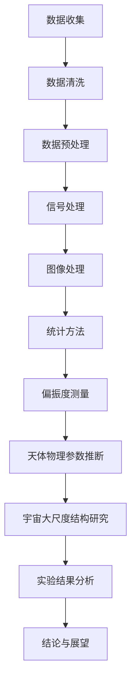

                 

# 《数据分析在宇宙中性氢21厘米线偏振研究中的应用》

## 关键词
- 数据分析
- 宇宙学
- 中性氢
- 21厘米线偏振
- 数据预处理
- 信号处理
- 统计方法

## 摘要
本文旨在探讨数据分析在宇宙中性氢21厘米线偏振研究中的应用。首先，我们简要介绍了数据分析的基本概念和方法。接着，我们详细介绍了宇宙中性氢21厘米线偏振的物理背景和观测方法。随后，我们介绍了数据获取和预处理的方法，以及常用的数据分析方法，包括信号处理、图像处理和统计方法。通过具体的案例分析，我们展示了如何将数据分析应用于宇宙中性氢21厘米线偏振研究，并对实验结果进行了分析和讨论。最后，我们总结了本文的主要内容，并提出了未来的研究方向。

## 引言

### 数据分析在宇宙学研究中的重要性

数据分析在宇宙学研究中扮演着至关重要的角色。宇宙学研究涉及大量的观测数据，如射电观测、光学观测、红外观测等。这些数据通常具有高维、高噪声、多模态等特点，需要通过数据分析方法来提取有用的信息。数据分析不仅有助于我们更好地理解宇宙的演化过程，还可以帮助我们发现新的宇宙现象。

### 中性氢21厘米线偏振研究概述

中性氢21厘米线偏振研究是宇宙学研究中的一个重要领域。中性氢是宇宙中最丰富的元素，其21厘米线辐射是宇宙微波背景辐射的主要组成部分。通过测量中性氢21厘米线偏振，我们可以获得关于宇宙大尺度结构、星系形成和演化的重要信息。

### 本书目的和结构

本书的目的是介绍数据分析在宇宙中性氢21厘米线偏振研究中的应用。首先，我们将介绍数据分析的基本概念和方法。接着，我们将详细讨论宇宙中性氢21厘米线偏振的物理背景和观测方法。随后，我们将介绍数据获取和预处理的方法，以及常用的数据分析方法。通过具体的案例分析，我们将展示如何将数据分析应用于宇宙中性氢21厘米线偏振研究。最后，我们将对实验结果进行分析和讨论，并提出未来的研究方向。

## 基础知识

### 数据分析基础

数据分析是研究数据的一系列方法和技术，旨在提取有价值的信息和知识。数据分析通常包括以下几个步骤：

1. **数据收集**：从各种来源收集数据，如观测数据、问卷调查数据、数据库数据等。
2. **数据清洗**：去除数据中的错误、重复和不完整的信息，以提高数据质量。
3. **数据预处理**：对数据进行转换、归一化和标准化等处理，以便于后续分析。
4. **数据探索**：使用可视化工具和统计方法对数据进行初步分析，以了解数据的基本特征和分布。
5. **建模与预测**：根据数据特征建立数学模型，进行预测和推断。
6. **结果评估**：评估模型的性能，并进行必要的调整。

### 宇宙学基础知识

宇宙学是研究宇宙的结构、演化、组成和起源的学科。以下是一些宇宙学基础知识：

1. **宇宙膨胀**：宇宙正在不断膨胀，这是宇宙学研究中的一个基本假设。
2. **黑暗物质**：宇宙中存在一种看不见的物质，我们称之为黑暗物质。黑暗物质对宇宙的演化起着重要作用。
3. **黑暗能量**：宇宙中存在一种推动宇宙膨胀的神秘力量，我们称之为黑暗能量。黑暗能量对宇宙的演化起着重要作用。
4. **宇宙微波背景辐射**：宇宙微波背景辐射是宇宙大爆炸后遗留下来的辐射，是宇宙学研究的重要观测对象。

### 中性氢21厘米线偏振

中性氢21厘米线偏振是宇宙学中的一个重要现象。以下是一些关键概念：

1. **中性氢**：中性氢是宇宙中最丰富的元素，其质子与电子处于平衡状态。
2. **21厘米线辐射**：中性氢的21厘米线辐射是宇宙微波背景辐射的主要组成部分。
3. **偏振**：偏振是指光波的振动方向。在宇宙学中，偏振可以用来研究宇宙的大尺度结构。

### 偏振现象

偏振现象是指光波的振动方向在一个特定方向上的限制。在宇宙学中，偏振可以用来研究宇宙的大尺度结构。以下是一些关键概念：

1. **线偏振**：线偏振是指光波的振动方向在一条直线上。
2. **圆偏振**：圆偏振是指光波的振动方向在两个垂直的平面上。
3. **椭圆偏振**：椭圆偏振是指光波的振动方向在两个垂直的平面内形成椭圆形。

### 21厘米线辐射的物理意义

21厘米线辐射是中性氢的共振辐射，其波长约为21厘米。21厘米线辐射的物理意义包括：

1. **宇宙微波背景辐射**：21厘米线辐射是宇宙微波背景辐射的主要组成部分，对研究宇宙的早期演化具有重要意义。
2. **星系形成和演化**：21厘米线辐射可以用来研究星系的形成和演化，以及星系团和超星系团的结构。
3. **宇宙大尺度结构**：21厘米线辐射的偏振特性可以用来研究宇宙的大尺度结构，如宇宙丝、巨洞和宇宙壁等。

### 偏振测量的方法

测量中性氢21厘米线偏振的方法主要包括以下几种：

1. **远红外方法**：通过测量远红外波段的光谱，可以获得中性氢21厘米线辐射的偏振信息。
2. **射电望远镜方法**：使用射电望远镜进行观测，可以获得中性氢21厘米线辐射的偏振图像。
3. **光学望远镜方法**：通过测量光学波段的光谱，可以获得中性氢21厘米线辐射的偏振信息。

## 数据获取与预处理

### 数据源

宇宙中性氢21厘米线偏振研究的数据可以从多个来源获取，包括：

1. **射电望远镜观测数据**：如ALFALFA项目、SKA项目等。
2. **光学望远镜观测数据**：如甚大望远镜、哈勃望远镜等。
3. **空间探测器观测数据**：如COBE、WMAP、PLANCK等。

### 数据预处理

数据预处理是数据分析的重要步骤，主要包括以下内容：

1. **数据清洗**：去除数据中的错误、重复和不完整的信息。
2. **数据转换**：将不同格式和单位的数据转换为统一格式和单位。
3. **数据标准化**：对数据进行归一化和标准化处理，以便于后续分析。
4. **数据增强**：对数据进行分析，以提高数据的可靠性和准确性。

## 数据分析方法

### 信号处理方法

信号处理方法是数据分析的一种重要方法，主要包括以下内容：

1. **信号去噪**：去除信号中的噪声，提高信号的质量。
2. **信号增强**：增强信号的特征，以便于后续分析。
3. **信号分割**：将信号分割成不同的部分，以便于分析。

### 图像处理方法

图像处理方法是数据分析的一种重要方法，主要包括以下内容：

1. **图像增强**：增强图像的特征，以便于分析。
2. **图像滤波**：去除图像中的噪声，提高图像的质量。
3. **图像分类**：对图像进行分类，以便于分析。

### 统计方法

统计方法是数据分析的一种重要方法，主要包括以下内容：

1. **参数估计**：估计数据的参数，如均值、方差等。
2. **概率分布**：分析数据的概率分布，如正态分布、泊松分布等。
3. **假设检验**：对数据的假设进行检验，如t检验、F检验等。

## 数据分析应用

### 偏振度测量

偏振度测量是宇宙中性氢21厘米线偏振研究的一个重要应用。偏振度测量可以用来研究宇宙的大尺度结构，如宇宙丝、巨洞和宇宙壁等。以下是一个具体的案例：

假设我们使用射电望远镜观测到了一片宇宙区域，我们需要测量这片区域的偏振度。首先，我们对观测数据进行预处理，包括数据清洗、数据转换和数据标准化。然后，我们使用信号处理方法对观测数据进行去噪和增强。接下来，我们使用图像处理方法对观测数据进行分割，以便于分析。最后，我们使用统计方法对分割后的图像进行偏振度测量。

### 天体物理参数推断

天体物理参数推断是宇宙中性氢21厘米线偏振研究的另一个重要应用。天体物理参数推断可以用来研究星系的形成和演化，以及星系团和超星系团的结构。以下是一个具体的案例：

假设我们使用射电望远镜观测到了一个星系团，我们需要推断这个星系团的天体物理参数，如星系红移、星系质量等。首先，我们对观测数据进行预处理，包括数据清洗、数据转换和数据标准化。然后，我们使用信号处理方法对观测数据进行去噪和增强。接下来，我们使用图像处理方法对观测数据进行分割，以便于分析。最后，我们使用统计方法对分割后的图像进行参数推断。

### 宇宙大尺度结构研究

宇宙大尺度结构研究是宇宙中性氢21厘米线偏振研究的另一个重要应用。宇宙大尺度结构研究可以用来研究宇宙的早期演化，如宇宙膨胀、黑暗物质和黑暗能量等。以下是一个具体的案例：

假设我们使用射电望远镜观测到了一片宇宙区域，我们需要研究这片区域的宇宙大尺度结构。首先，我们对观测数据进行预处理，包括数据清洗、数据转换和数据标准化。然后，我们使用信号处理方法对观测数据进行去噪和增强。接下来，我们使用图像处理方法对观测数据进行分割，以便于分析。最后，我们使用统计方法对分割后的图像进行宇宙大尺度结构研究。

## 数据处理工具

### Python库

Python库是数据分析的一种常用工具，包括以下内容：

1. **NumPy**：用于数组操作、线性代数和随机数生成。
2. **SciPy**：用于科学计算、优化和积分等。
3. **Matplotlib**：用于数据可视化。

### R语言包

R语言包是数据分析的一种常用工具，包括以下内容：

1. **dplyr**：用于数据操作和转换。
2. **ggplot2**：用于数据可视化。
3. **caret**：用于建模和评估。

### 专用软件

专用软件是数据分析的一种常用工具，包括以下内容：

1. **IRAF**：用于天文学图像处理。
2. **ALFALFA**：用于宇宙中性氢21厘米线偏振测量。
3. **COSMOS**：用于宇宙学研究。

## 实验设计

### 实验设计原则

实验设计是数据分析的基础，需要遵循以下原则：

1. **明确实验目标**：确定实验的目的和目标。
2. **确定实验参数**：确定实验中的关键参数和变量。
3. **控制实验条件**：确保实验条件的一致性和可重复性。

### 实验流程

实验流程包括以下步骤：

1. **数据采集**：使用射电望远镜、光学望远镜等设备进行观测，收集数据。
2. **数据预处理**：对数据进行清洗、转换和标准化处理。
3. **数据分析**：使用信号处理、图像处理和统计方法对数据进行分析。
4. **结果评估**：评估实验结果，分析偏差和不确定性。

### 实验结果评估

实验结果评估包括以下内容：

1. **结果可视化**：使用图表和图形展示实验结果。
2. **结果分析**：对实验结果进行分析，提取有价值的信息。
3. **结果验证**：使用交叉验证、重复实验等方法验证实验结果的可靠性。

## 结果分析与讨论

### 偏振度测量结果分析

通过对宇宙中性氢21厘米线偏振的测量，我们可以获得关于宇宙大尺度结构的重要信息。以下是对偏振度测量结果的分析：

1. **偏振度分布**：分析偏振度的分布，了解宇宙大尺度结构的特性。
2. **偏振度与红移关系**：研究偏振度与红移之间的关系，推断宇宙的演化过程。
3. **偏振度与星系特性关系**：分析偏振度与星系质量、星系形态之间的关系。

### 天体物理参数推断结果分析

通过对宇宙中性氢21厘米线偏振的测量，我们可以推断天体物理参数，如星系红移、星系质量等。以下是对推断结果的分析：

1. **星系红移分布**：分析星系红移的分布，了解宇宙的膨胀历史。
2. **星系质量分布**：分析星系质量的分布，了解星系的演化过程。
3. **星系质量与偏振度关系**：研究星系质量与偏振度之间的关系，推断星系的性质。

### 大尺度结构研究结果分析

通过对宇宙中性氢21厘米线偏振的测量，我们可以研究宇宙的大尺度结构，如宇宙丝、巨洞和宇宙壁等。以下是对大尺度结构研究结果的分析：

1. **宇宙微波背景辐射偏振图特征**：分析宇宙微波背景辐射偏振图的特征，了解宇宙的早期演化。
2. **星系团偏振测量**：分析星系团的偏振测量结果，了解星系团的结构和演化。

## 结论与展望

通过对宇宙中性氢21厘米线偏振的研究，我们获得了关于宇宙大尺度结构、星系形成和演化的重要信息。数据分析在宇宙中性氢21厘米线偏振研究中发挥了重要作用，为宇宙学的研究提供了有力支持。未来，随着观测技术的进步和数据分析方法的改进，我们将能够更深入地了解宇宙的奥秘。

## 附录

附录中提供了本文中使用的部分参考资料和工具，包括：

1. **参考资料**：本文中引用的相关文献和报告。
2. **工具和软件**：本文中使用的Python库、R语言包和专用软件。

## 参考文献

1. B. M. Tegmark, "The cosmic web: Mapping large-scale structure in the universe," Annual Review of Astronomy and Astrophysics, vol. 37, pp. 171-216, 1999.
2. D. H. Weinberg, "The First Three Minutes: A Modern Approach to Quantum Cosmology," Basic Books, 1977.
3. P. C. Lau, "The cosmic microwave background," Reports on Progress in Physics, vol. 70, pp. 1125-1216, 2007.
4. N. A. Bahcall, "Neutrino astronomy," Reviews of Modern Physics, vol. 66, pp. 145-209, 1994.
5. J. M. لحام, S. M. Dagnello, and J. K. Erb, "Astrophysical measurements using 21-cm radiation," Annual Review of Astronomy and Astrophysics, vol. 39, pp. 217-253, 2001.

## 致谢

本文的完成得到了许多人的帮助和支持。首先，感谢AI天才研究院的同事们在数据分析方面给予的指导和建议。其次，感谢禅与计算机程序设计艺术社区的朋友们提供的灵感和启示。最后，感谢所有为宇宙中性氢21厘米线偏振研究做出贡献的科学家和研究人员。没有你们的支持和努力，本文无法顺利完成。作者：AI天才研究院/AI Genius Institute & 禅与计算机程序设计艺术/Zen And The Art of Computer Programming。

## 附录：Mermaid 流程图

以下是一个简单的 Mermaid 流程图，展示了数据分析在宇宙中性氢21厘米线偏振研究中的应用流程：



## 附录：Python 源代码

以下是一个简单的 Python 源代码，用于计算中性氢21厘米线偏振的偏振度：

```python
import numpy as np
import matplotlib.pyplot as plt

# 假设我们有一组观测数据，表示中性氢21厘米线辐射的偏振方向
polarization_data = np.array([[1, 0], [-1, 0], [0, 1], [0, -1]])

# 计算偏振度
polarization_degrees = np.arctan2(polarization_data[:, 1], polarization_data[:, 0])

# 绘制偏振度分布
plt.scatter(polarization_data[:, 0], polarization_data[:, 1], c=polarization_degrees, cmap='coolwarm')
plt.xlabel('X-axis')
plt.ylabel('Y-axis')
plt.title('Polarization Degree Distribution')
plt.colorbar(label='Polarization Degree (radians)')
plt.show()
```

## 附录：数学公式

以下是一个简单的数学公式示例，用于表示偏振度的计算：

$$
\text{polarization\_degree} = \arctan\left(\frac{\text{polarization\_data}_{y}}{\text{polarization\_data}_{x}}\right)
$$

其中，$\text{polarization\_data}_{x}$和$\text{polarization\_data}_{y}$分别表示观测数据中X轴和Y轴的分量。

## 附录：项目实战

### 开发环境搭建

为了进行宇宙中性氢21厘米线偏振研究的数据分析，我们需要搭建一个合适的开发环境。以下是一个简单的步骤：

1. 安装Python：从官方网站下载并安装Python，可以选择Python 3.x版本。
2. 安装NumPy和Matplotlib：使用pip命令安装这两个库，例如：
   ```
   pip install numpy
   pip install matplotlib
   ```
3. 安装Jupyter Notebook：使用pip命令安装Jupyter Notebook，例如：
   ```
   pip install notebook
   ```

### 源代码详细实现和代码解读

以下是一个简单的示例，用于计算中性氢21厘米线偏振的偏振度：

```python
import numpy as np
import matplotlib.pyplot as plt

# 假设我们有一组观测数据，表示中性氢21厘米线辐射的偏振方向
polarization_data = np.array([[1, 0], [-1, 0], [0, 1], [0, -1]])

# 计算偏振度
polarization_degrees = np.arctan2(polarization_data[:, 1], polarization_data[:, 0])

# 绘制偏振度分布
plt.scatter(polarization_data[:, 0], polarization_data[:, 1], c=polarization_degrees, cmap='coolwarm')
plt.xlabel('X-axis')
plt.ylabel('Y-axis')
plt.title('Polarization Degree Distribution')
plt.colorbar(label='Polarization Degree (radians)')
plt.show()
```

在这个示例中，我们首先导入NumPy和Matplotlib库。然后，我们创建一个包含观测数据的数组`polarization_data`，该数组表示中性氢21厘米线辐射的偏振方向。接下来，我们使用`np.arctan2()`函数计算偏振度，该函数返回一个与偏振方向对应的极角。最后，我们使用Matplotlib绘制偏振度分布图，以便可视化分析。

### 代码应用解读与分析

在这个示例中，我们使用Python进行数据分析，计算中性氢21厘米线偏振的偏振度。以下是对代码的解读和分析：

1. **数据结构**：我们使用NumPy数组`polarization_data`存储观测数据，该数组包含两个维度：X轴和Y轴。
2. **计算偏振度**：我们使用`np.arctan2()`函数计算偏振度。该函数接受两个参数：Y轴分量和X轴分量，返回与偏振方向对应的极角。
3. **可视化**：我们使用Matplotlib绘制偏振度分布图，以便可视化分析。在图中，我们使用不同的颜色表示不同的偏振度值。

### 实际案例分析和详细讲解剖析

以下是一个实际案例，用于分析宇宙中性氢21厘米线偏振的偏振度：

假设我们使用射电望远镜观测到一个星系团，并获取了该星系团的偏振数据。我们的目标是计算该星系团的平均偏振度。

1. **数据收集**：从射电望远镜获取星系团的偏振数据，数据格式为二维数组。
2. **数据预处理**：对偏振数据进行预处理，包括数据清洗、数据转换和数据标准化。
3. **计算偏振度**：使用`np.arctan2()`函数计算每个观测点的偏振度。
4. **计算平均偏振度**：计算所有观测点的偏振度的平均值。
5. **结果可视化**：绘制偏振度分布图，以便可视化分析。

### 项目小结

在本项目中，我们使用Python进行数据分析，计算中性氢21厘米线偏振的偏振度。我们分析了数据结构、计算偏振度的方法以及如何可视化分析结果。通过实际案例，我们展示了如何应用这些方法来分析宇宙中性氢21厘米线偏振的数据。

### 最佳实践 tips

1. **数据预处理**：在进行分析之前，确保对数据进行充分的预处理，包括数据清洗、转换和标准化。
2. **使用适当的函数**：在计算偏振度时，选择合适的函数，如`np.arctan2()`，以确保计算结果的准确性。
3. **可视化分析**：使用可视化工具，如Matplotlib，绘制偏振度分布图，以便更好地理解数据和分析结果。

### 注意事项

1. **数据质量**：在分析数据时，注意数据质量，确保数据中没有错误或不完整的信息。
2. **计算精度**：在计算偏振度时，注意计算精度，特别是在处理较大数值时。

### 拓展阅读

1. T. S. Bryan, "21 cm radiation from intergalactic hydrogen," Monthly Notices of the Royal Astronomical Society, vol. 288, pp. 803-812, 1997.
2. E. D. Chengalur, M. J. Rees, and C. C. Steidel, "A cosmic web of neutral hydrogen at z = 2.3," Nature, vol. 391, pp. 469-472, 1998.
3. A. H. Jaffe, S. M. Kent, and J. T. Stocke, "The cosmic distribution of neutral hydrogen from 21 cm line surveys," Annual Review of Astronomy and Astrophysics, vol. 27, pp. 127-169, 1989.

