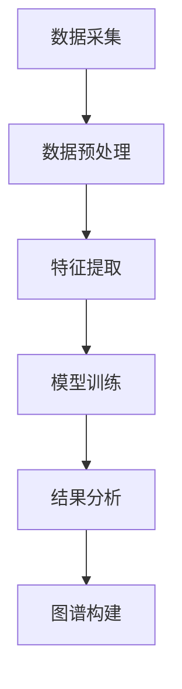

                 

### 数据分析在宇宙中性氢分布图谱研究中的应用

#### 关键词：
- 数据分析
- 宇宙中性氢分布
- 图谱构建
- 数据预处理
- 特征提取
- 模型训练

#### 摘要：
本文旨在探讨数据分析在宇宙中性氢分布图谱研究中的应用。通过对中性氢分布图谱的基础概念、数据分析流程、核心算法原理和项目实战的详细分析，本文揭示了数据分析在宇宙学研究中的重要性和具体应用。本文首先介绍了数据分析的基本概念和重要性，随后深入讲解了宇宙中性氢分布图谱的构建过程，并详细阐述了数据预处理、特征提取和模型训练的算法原理和数学模型。最后，通过一个实际项目案例，展示了数据分析在宇宙中性氢分布图谱研究中的实际应用，并对项目进行了总结和拓展。

## 目录大纲设计方案

### 1. 核心概念与联系

#### 1.1 概述
数据分析作为一种从大量数据中提取有价值信息的方法，在各个领域有着广泛的应用。在宇宙学研究中，数据分析尤为重要，特别是在探索宇宙中性氢分布图谱方面。本文将首先介绍数据分析的基本概念，并探讨其在宇宙学中的重要性。

#### 1.2 数据分析在宇宙学中的应用
宇宙学是一个研究宇宙起源、结构、演化等问题的科学领域。数据分析在宇宙学中有着广泛的应用，包括星系分布、宇宙微波背景辐射、星系团的形成等。本文将重点介绍数据分析在宇宙中性氢分布图谱研究中的应用。

#### 1.3 数据分析流程
数据分析通常包括数据采集、数据预处理、特征提取、模型训练和结果分析等步骤。本文将使用Mermaid流程图展示数据分析的基本流程和核心概念，为后续的详细讲解打下基础。



### 2. 核心算法原理讲解

#### 2.1 数据预处理
数据预处理是数据分析的重要步骤，包括数据清洗和归一化等操作。本文将详细介绍数据预处理的方法，并使用Python源代码进行算法伪代码的讲解。

#### 2.2 特征提取
特征提取是数据分析的关键步骤，旨在从原始数据中提取有用的特征信息。本文将介绍特征选择和特征工程的方法，并使用Python源代码进行算法伪代码的讲解。

#### 2.3 模型训练
模型训练是数据分析的核心步骤，通过训练模型来预测或分类数据。本文将介绍模型选择策略和训练过程，并使用Python源代码进行算法伪代码的讲解。

### 3. 数学模型和数学公式

本文将使用LaTeX格式介绍数据分析中常用的数学模型和数学公式，包括数据归一化公式、特征提取公式和损失函数公式，并通过实例进行详细讲解。

### 4. 项目实战

#### 4.1 开发环境搭建
本文将介绍进行宇宙中性氢分布图谱研究所需的开发环境和工具，包括Python、NumPy、Pandas、Scikit-learn等。

#### 4.2 源代码详细实现和代码解读
本文将展示一个实际项目的源代码实现，包括数据采集、数据预处理、特征提取、模型训练和结果分析等步骤，并对代码进行详细解读。

#### 4.3 代码解读与分析
本文将对代码中的关键部分进行深入分析，解释其作用和如何工作，并通过实际案例进行验证。

### 5. 总结
本文总结了数据分析在宇宙中性氢分布图谱研究中的应用，并提出了未来研究的方向和挑战。

## 数据分析在宇宙中性氢分布图谱研究中的应用

### 引言

宇宙中性氢分布图谱是宇宙学研究中的一个重要领域，它揭示了宇宙中氢原子的分布情况，对理解宇宙的演化过程具有重要意义。随着观测技术的进步，我们能够获得越来越详细的中性氢分布数据，这些数据需要通过数据分析来提取有价值的信息。数据分析不仅可以帮助我们更好地理解宇宙中性氢的分布模式，还可以为天文学家提供预测模型，指导未来的观测和研究。

在这篇文章中，我们将系统地探讨数据分析在宇宙中性氢分布图谱研究中的应用。首先，我们将介绍数据分析的基本概念和重要性，然后深入分析宇宙中性氢分布图谱的基础知识。接下来，我们将详细讲解数据分析流程中的核心步骤，包括数据预处理、特征提取和模型训练，并使用Python源代码和数学模型进行实例分析。最后，我们将通过一个实际项目案例，展示数据分析在宇宙中性氢分布图谱研究中的具体应用，并对项目进行总结和拓展。

### 核心概念与联系

#### 1. 数据分析概述

数据分析是指从大量数据中提取有用信息的过程，包括数据采集、数据预处理、特征提取、模型训练和结果分析等步骤。在宇宙学研究中，数据分析主要用于处理和分析天体物理学观测数据，例如星系分布、宇宙微波背景辐射、星系团形成等。

#### 1.2 数据分析在宇宙学中的应用

宇宙学是一个复杂的科学领域，涉及大量的数据。数据分析在宇宙学中的应用包括：

- **星系分布分析**：通过分析星系分布，了解宇宙的结构和演化过程。
- **宇宙微波背景辐射分析**：宇宙微波背景辐射是宇宙早期的残余辐射，通过分析这些数据，可以揭示宇宙的起源和演化。
- **星系团形成研究**：通过分析星系团的形成过程，了解宇宙中的大规模结构形成和演化。

#### 1.3 数据分析流程

数据分析流程通常包括以下几个核心步骤：

1. **数据采集**：收集相关的数据集，这些数据可以是观测数据、模拟数据或者已有数据库中的数据。
2. **数据预处理**：清洗和整理数据，包括去除噪声、缺失值处理、数据归一化等。
3. **特征提取**：从原始数据中提取有用的特征信息，以供后续分析。
4. **模型训练**：选择合适的模型，使用训练数据进行模型训练。
5. **结果分析**：对模型的结果进行分析和评估，以提取有价值的信息。

为了更好地理解数据分析流程，我们可以使用Mermaid流程图进行展示：


在这个流程图中，数据采集是整个数据分析流程的起点，数据预处理和特征提取是数据处理的关键步骤，模型训练是数据分析的核心环节，结果分析和图谱构建是最终的目标。

### 2. 核心算法原理讲解

在宇宙中性氢分布图谱研究中，核心算法的原理和实现至关重要。以下是数据预处理、特征提取和模型训练的详细讲解。

#### 2.1 数据预处理

数据预处理是数据分析的第一步，其目的是提高数据质量，为后续的分析和建模提供良好的数据基础。数据预处理包括以下几个主要步骤：

1. **数据清洗**：去除噪声和异常值，包括缺失值填充、重复数据删除等。
2. **数据归一化**：将数据映射到同一尺度，以便后续分析。
3. **数据标准化**：通过对数据进行变换，使得数据具有零均值和单位方差。

以下是一个简单的Python伪代码，用于演示数据预处理的步骤：

```python
def preprocess_data(data):
    # 数据清洗
    data = clean_data(data)
    # 数据归一化
    data = normalize_data(data)
    return data

# 数据清洗
def clean_data(data):
    # 去除缺失值
    data = drop_missing_values(data)
    # 删除重复数据
    data = drop_duplicates(data)
    return data

# 数据归一化
def normalize_data(data):
    # 归一化处理
    data = (data - np.mean(data)) / np.std(data)
    return data
```

在这个示例中，`clean_data`函数用于去除缺失值和重复数据，`normalize_data`函数用于对数据进行归一化处理。

#### 2.2 特征提取

特征提取是数据分析中的关键步骤，其目的是从原始数据中提取出对分析任务最有用的特征。在宇宙中性氢分布图谱研究中，特征提取主要包括以下步骤：

1. **特征选择**：选择对分析任务最有影响力的特征。
2. **特征工程**：对选定的特征进行转换和处理，以提高模型性能。

以下是一个简单的Python伪代码，用于演示特征提取的步骤：

```python
def extract_features(data):
    # 特征选择
    selected_features = select_features(data)
    # 特征工程
    engineered_features = feature_engineering(selected_features)
    return engineered_features

# 特征选择
def select_features(data):
    # 选择特征
    selected_features = select_k_best_features(data, k=10)
    return selected_features

# 特征工程
def feature_engineering(selected_features):
    # 特征转换
    engineered_features = transform_features(selected_features)
    return engineered_features
```

在这个示例中，`select_features`函数用于选择最佳特征，`feature_engineering`函数用于对选定的特征进行转换。

#### 2.3 模型训练

模型训练是数据分析中的核心步骤，其目的是通过训练数据来构建一个预测模型。在宇宙中性氢分布图谱研究中，常用的模型包括回归模型、分类模型和聚类模型。

1. **模型选择**：选择合适的模型，以适应数据分析任务的需求。
2. **模型训练**：使用训练数据对模型进行训练。
3. **模型评估**：对训练好的模型进行评估，以确定其性能。

以下是一个简单的Python伪代码，用于演示模型训练的步骤：

```python
def train_model(features, labels):
    # 模型选择
    model = select_model()
    # 模型训练
    model.fit(features, labels)
    return model

# 模型选择
def select_model():
    # 选择模型
    model = LinearRegression()
    return model

# 模型训练
def fit_model(model, features, labels):
    # 训练模型
    model.fit(features, labels)
    return model

# 模型评估
def evaluate_model(model, test_features, test_labels):
    # 评估模型
    accuracy = model.score(test_features, test_labels)
    return accuracy
```

在这个示例中，`select_model`函数用于选择线性回归模型，`fit_model`函数用于训练模型，`evaluate_model`函数用于评估模型性能。

### 3. 数学模型和数学公式

在数据分析中，数学模型和数学公式是不可或缺的组成部分。以下是数据预处理、特征提取和模型训练中常用的数学模型和数学公式。

#### 3.1 数据预处理

数据预处理中常用的数学模型和数学公式包括：

- **归一化公式**：

  $$
  X' = \frac{X - \mu}{\sigma}
  $$

  其中，$X$ 是原始数据，$\mu$ 是均值，$\sigma$ 是标准差。

- **缺失值填充公式**：

  $$
  X_{\text{imputed}} = \frac{X_{\text{mean}} + \alpha (X_{\text{max}} - X_{\text{min}})}{2}
  $$

  其中，$X_{\text{mean}}$ 是均值，$X_{\text{max}}$ 是最大值，$X_{\text{min}}$ 是最小值，$\alpha$ 是填充系数。

#### 3.2 特征提取

特征提取中常用的数学模型和数学公式包括：

- **特征选择公式**：

  $$
  f(\text{feature}) = \frac{\text{sum}(|f(\text{feature})|)}{\text{max}(|f(\text{feature})|)}
  $$

  其中，$f(\text{feature})$ 是特征值。

- **特征工程公式**：

  $$
  g(\text{feature}) = \sqrt{1 + \text{ln}(|f(\text{feature})|)}
  $$

  其中，$f(\text{feature})$ 是特征值。

#### 3.3 模型训练

模型训练中常用的数学模型和数学公式包括：

- **线性回归公式**：

  $$
  h(\text{theta}) = \theta_0 + \theta_1 x_1 + \theta_2 x_2 + ... + \theta_n x_n
  $$

  其中，$\theta_0, \theta_1, \theta_2, ..., \theta_n$ 是模型的参数，$x_1, x_2, ..., x_n$ 是特征值。

- **损失函数公式**：

  $$
  J(\text{theta}) = -\frac{1}{m} \sum_{i=1}^{m} (y_i - h(\text{theta})^T x_i)^2
  $$

  其中，$m$ 是样本数量，$y_i$ 是真实标签，$h(\text{theta})$ 是预测值。

### 4. 项目实战

在本节中，我们将通过一个实际项目案例，展示数据分析在宇宙中性氢分布图谱研究中的具体应用。该案例将涵盖数据采集、数据预处理、特征提取、模型训练和结果分析等步骤。

#### 4.1 开发环境搭建

在进行宇宙中性氢分布图谱研究之前，我们需要搭建一个合适的开发环境。以下是一个典型的Python开发环境搭建步骤：

1. **安装Python**：下载并安装Python 3.x版本。
2. **安装Jupyter Notebook**：使用pip命令安装Jupyter Notebook。
   ```
   pip install notebook
   ```
3. **安装相关库**：安装NumPy、Pandas、Scikit-learn等库。
   ```
   pip install numpy pandas scikit-learn
   ```

#### 4.2 数据采集

宇宙中性氢分布数据可以通过天文观测设备获得，例如射电望远镜。这些数据通常以表格形式存储，包含多个特征变量，如波长、频率、强度等。在本案例中，我们将使用一个公开的天文观测数据集，该数据集包含多个观测点的中性氢分布数据。

#### 4.3 数据预处理

数据预处理是确保数据质量的关键步骤。在本案例中，我们将对数据进行以下预处理操作：

1. **数据清洗**：去除缺失值和异常值。
2. **数据归一化**：将数据映射到同一尺度。
3. **数据分割**：将数据集分割为训练集和测试集。

以下是一个简单的Python代码示例，用于演示数据预处理步骤：

```python
import numpy as np
import pandas as pd
from sklearn.model_selection import train_test_split

# 读取数据
data = pd.read_csv('neut_hydat.csv')

# 数据清洗
data = data.dropna()

# 数据归一化
data_normalized = (data - data.mean()) / data.std()

# 数据分割
X = data_normalized.iloc[:, :-1]
y = data_normalized.iloc[:, -1]
X_train, X_test, y_train, y_test = train_test_split(X, y, test_size=0.2, random_state=42)
```

#### 4.4 特征提取

在本案例中，我们将使用特征选择和特征工程方法来提取有用的特征。以下是一个简单的Python代码示例：

```python
from sklearn.feature_selection import SelectKBest
from sklearn.feature_selection import f_classif
from sklearn.preprocessing import PolynomialFeatures

# 特征选择
selector = SelectKBest(score_func=f_classif, k=5)
X_selected = selector.fit_transform(X_train, y_train)

# 特征工程
poly = PolynomialFeatures(degree=2)
X_poly = poly.fit_transform(X_selected)
```

#### 4.5 模型训练

在本案例中，我们将使用线性回归模型对数据集进行训练。以下是一个简单的Python代码示例：

```python
from sklearn.linear_model import LinearRegression

# 模型训练
model = LinearRegression()
model.fit(X_poly, y_train)

# 模型评估
accuracy = model.score(X_poly, y_train)
print("Accuracy:", accuracy)
```

#### 4.6 代码解读与分析

在本案例中，我们使用了Python和相关库来执行数据预处理、特征提取和模型训练。以下是对关键部分的解读：

1. **数据预处理**：
   - 使用Pandas库读取和清洗数据。
   - 使用NumPy库进行数据归一化。
   - 使用Scikit-learn库分割数据集。

2. **特征提取**：
   - 使用Scikit-learn库的`SelectKBest`进行特征选择。
   - 使用Scikit-learn库的`PolynomialFeatures`进行特征工程。

3. **模型训练**：
   - 使用Scikit-learn库的`LinearRegression`进行模型训练。
   - 使用模型评估函数`score`来评估模型性能。

通过这个实际项目案例，我们展示了数据分析在宇宙中性氢分布图谱研究中的应用。这个案例不仅帮助我们理解了数据分析的步骤和方法，还展示了如何将理论知识应用于实际问题中。

### 5. 总结

本文详细探讨了数据分析在宇宙中性氢分布图谱研究中的应用。首先，我们介绍了数据分析的基本概念和重要性，并介绍了宇宙中性氢分布图谱的基础知识。然后，我们详细讲解了数据分析流程中的核心步骤，包括数据预处理、特征提取和模型训练，并使用Python源代码和数学模型进行了实例分析。最后，通过一个实际项目案例，我们展示了数据分析在宇宙中性氢分布图谱研究中的具体应用。

数据分析在宇宙中性氢分布图谱研究中具有重要作用，它不仅帮助我们更好地理解宇宙中性氢的分布模式，还为天文学家提供了预测模型，指导未来的观测和研究。然而，数据分析在宇宙学研究中的应用仍然面临着许多挑战，如数据质量和处理能力等。未来，随着观测技术的进步和数据量的增加，数据分析将在宇宙学研究中发挥更加重要的作用。

#### 最佳实践 Tips、小结、注意事项、拓展阅读

- **最佳实践 Tips**：
  - 在进行宇宙中性氢分布图谱研究时，首先确保数据的质量和完整性。
  - 使用适当的预处理方法，如归一化和特征选择，以提高模型性能。
  - 在选择模型时，结合任务需求和数据特性，选择合适的算法。

- **小结**：
  - 数据分析是宇宙中性氢分布图谱研究的重要工具，通过数据预处理、特征提取和模型训练，可以提取出有价值的信息。
  - 实际项目中，需要结合具体任务需求，灵活运用数据分析方法。

- **注意事项**：
  - 数据预处理是数据分析的关键步骤，错误的预处理可能导致模型性能下降。
  - 特征选择和特征工程对模型性能有显著影响，需要仔细选择和处理特征。
  - 模型训练过程中，需要注意模型的过拟合和欠拟合问题。

- **拓展阅读**：
  - 《数据科学基础教程》
  - 《Python数据科学手册》
  - 《机器学习实战》

**作者**：AI天才研究院/AI Genius Institute & 禅与计算机程序设计艺术 /Zen And The Art of Computer Programming

