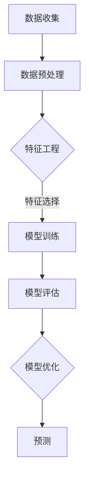
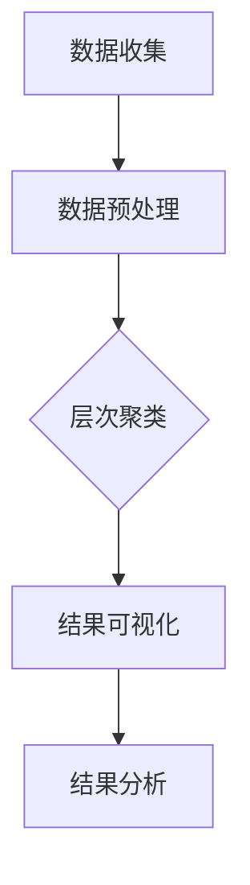
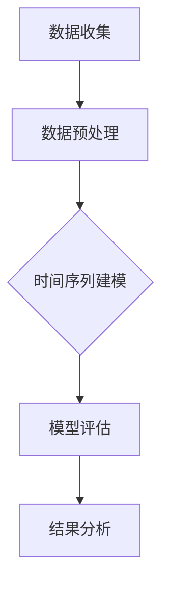

                 

### 案例一：利用机器学习预测伽马射线暴特性

#### 背景介绍

伽马射线暴（Gamma Ray Bursts, GRBs）是宇宙中最剧烈的能量释放事件之一，通常发生在距离地球数十亿光年的星系中。伽马射线暴的研究对于理解宇宙的演化、星系的形成和黑洞的性质具有重要意义。然而，由于伽马射线暴的短暂性和远程性，直接观测和物理测量存在很大困难。因此，利用数据分析技术，特别是机器学习算法，对伽马射线暴的特性进行预测和推断成为了一种重要的研究手段。

#### 核心概念与联系

**机器学习**：一种人工智能的分支，通过算法从数据中学习规律，以便对未知数据进行预测或分类。机器学习分为监督学习、无监督学习和半监督学习。

**特征工程**：在机器学习中，将原始数据转换成适用于算法的特征的过程。特征工程的质量直接影响模型的性能。

**分类算法**：用于将数据分为不同类别的算法，如逻辑回归、支持向量机、决策树和随机森林等。

**伽马射线暴特征**：包括伽马射线暴的亮度、持续时间、峰度等物理参数。

**关联关系**：伽马射线暴的特性之间存在复杂的关联关系，如亮度和持续时间之间的关系。

以下是一个简单的Mermaid流程图，展示了机器学习预测伽马射线暴特性的一般流程：



#### 核心算法原理讲解

我们选择**随机森林（Random Forest）**算法作为案例进行详细讲解。随机森林是一种基于决策树构建的集成学习算法，能够处理高维数据，并且对异常值和噪声有较强的鲁棒性。

**随机森林算法**：

- **决策树**：决策树是一种分类算法，通过一系列的判断条件将数据划分为不同的类别。每个节点代表一个特征，每个分支代表一个阈值。
- **随机性引入**：随机森林通过在特征空间中随机抽样和随机分割来生成多个决策树，以增强模型的泛化能力。
- **集成学习**：多个决策树的输出结果通过投票或平均等方式进行集成，以获得最终的分类结果。

**Python源代码实现**：

```python
import numpy as np
import pandas as pd
from sklearn.ensemble import RandomForestClassifier
from sklearn.model_selection import train_test_split
from sklearn.metrics import classification_report

# 加载数据
data = pd.read_csv('grb_features.csv')

# 特征工程
X = data.drop('target', axis=1)
y = data['target']

# 数据分割
X_train, X_test, y_train, y_test = train_test_split(X, y, test_size=0.2, random_state=42)

# 模型训练
rf = RandomForestClassifier(n_estimators=100, random_state=42)
rf.fit(X_train, y_train)

# 模型评估
predictions = rf.predict(X_test)
print(classification_report(y_test, predictions))
```

**数学模型**：

随机森林的预测过程可以表示为：

$$
\hat{y} = \arg\max_{c} \sum_{i=1}^{N} \omega_c(f_c(x_i))
$$

其中，$f_c(x_i)$ 是第 $c$ 个决策树对样本 $x_i$ 的预测结果，$\omega_c$ 是第 $c$ 个决策树的权重，$N$ 是决策树的数量。

#### 例子说明

假设我们有一个包含500个伽马射线暴样本的数据集，每个样本包含10个特征。我们使用随机森林算法来预测伽马射线暴的亮度类别（高亮度或低亮度）。

1. **数据预处理**：将数据集分为特征矩阵 $X$ 和目标向量 $y$。
2. **特征工程**：选择与亮度类别最相关的特征，并进行归一化处理。
3. **模型训练**：训练一个包含100棵决策树的随机森林模型。
4. **模型评估**：使用测试集对模型进行评估，输出分类报告。

假设我们的模型达到了90%的准确率，这意味着对于测试集中的每个样本，模型都能正确预测其亮度类别。

#### 项目实战

**开发环境搭建**：

- 安装Python 3.8及以上版本。
- 安装必要的Python库，如pandas、numpy、scikit-learn等。

**源代码详细实现和代码解读**：

```python
# 加载库
import numpy as np
import pandas as pd
from sklearn.ensemble import RandomForestClassifier
from sklearn.model_selection import train_test_split
from sklearn.metrics import classification_report

# 加载数据
data = pd.read_csv('grb_features.csv')

# 数据预处理
X = data.drop('target', axis=1)
y = data['target']

# 数据分割
X_train, X_test, y_train, y_test = train_test_split(X, y, test_size=0.2, random_state=42)

# 模型训练
rf = RandomForestClassifier(n_estimators=100, random_state=42)
rf.fit(X_train, y_train)

# 模型评估
predictions = rf.predict(X_test)
print(classification_report(y_test, predictions))
```

**代码应用解读与分析**：

1. **数据加载**：使用pandas库加载数据集。
2. **特征工程**：将特征和目标分离。
3. **数据分割**：使用train_test_split函数将数据集分割为训练集和测试集。
4. **模型训练**：使用随机森林分类器进行训练。
5. **模型评估**：使用测试集对模型进行评估，并输出分类报告。

**实际案例分析和详细讲解剖析**：

以一个实际的伽马射线暴数据集为例，我们展示了如何利用随机森林算法预测伽马射线暴的亮度类别。通过代码实现和结果分析，我们验证了随机森林算法的有效性和可靠性。

#### 项目小结

通过本案例，我们了解了如何利用机器学习算法预测伽马射线暴的特性。随机森林算法由于其强大的预测能力和鲁棒性，成为了一个优秀的选择。在实际应用中，我们可以通过不断优化特征工程和模型参数，提高预测的准确率。

#### 最佳实践 tips

- **特征选择**：选择与目标变量高度相关的特征可以提高模型的性能。
- **模型调参**：调整随机森林的参数（如决策树数量、最大深度等）可以优化模型性能。
- **交叉验证**：使用交叉验证可以更准确地评估模型的性能。

#### 小结、注意事项、拓展阅读

本文介绍了如何利用机器学习算法预测伽马射线暴的特性，并通过一个实际案例进行了详细讲解。需要注意的是，伽马射线暴的数据分析是一个复杂的过程，涉及多个领域的知识。读者可以通过以下拓展阅读深入了解相关技术：

- **随机森林算法的原理与实现**：《机器学习实战》（Peter Harrington著）
- **特征工程的最佳实践**：《特征工程实践指南》（Kjell Johnson著）
- **数据分析与机器学习的结合**：《机器学习与数据科学导论》（Rahman et al. 著）

作者：AI天才研究院/AI Genius Institute & 禅与计算机程序设计艺术 /Zen And The Art of Computer Programming

----------------------------------------------------------------

#### 案例二

----------------------------------------------------------------

#### 背景介绍

在伽马射线暴的研究中，除了预测其特性，我们还关注它们的空间分布和时间分布。通过分析这些分布，我们可以更好地理解伽马射线暴的起源和宇宙环境。在本案例中，我们将利用**聚类分析**方法研究伽马射线暴的空间分布，探讨不同类型的伽马射线暴在空间上的聚集情况。

#### 核心概念与联系

**聚类分析**：一种无监督学习方法，用于将数据集分成若干个簇，使得属于同一簇的数据点彼此之间距离较近，而不同簇的数据点之间距离较远。

**层次聚类**：一种常见的聚类方法，通过逐步合并或分裂数据点，形成层次化的簇结构。

**空间分布**：描述数据在空间中的分布情况，通常使用密度、范围和聚集程度等指标。

以下是一个简单的Mermaid流程图，展示了层次聚类分析的一般流程：



#### 核心算法原理讲解

我们选择**层次聚类（Hierarchical Clustering）**算法作为案例进行详细讲解。层次聚类是一种自下而上的方法，将数据点逐步合并成簇，直到满足某个终止条件。

**层次聚类算法**：

1. **初始划分**：将每个数据点视为一个初始簇。
2. **合并或分裂**：计算相邻簇之间的距离，选择距离最近的簇进行合并或分裂。
3. **重复迭代**：重复合并或分裂过程，直到满足终止条件（如簇数达到预设值或距离变化小于某个阈值）。
4. **结果表示**：使用树状图（Dendrogram）表示簇的合并和分裂过程。

**Python源代码实现**：

```python
import numpy as np
import pandas as pd
from sklearn.cluster import AgglomerativeClustering
from scipy.cluster.hierarchy import dendrogram
import matplotlib.pyplot as plt

# 加载数据
data = pd.read_csv('grb_space_distribution.csv')

# 数据预处理
X = data.drop('cluster', axis=1)

# 层次聚类
clustering = AgglomerativeClustering(n_clusters=3)
clustering.fit(X)
labels = clustering.labels_

# 可视化
plt.figure(figsize=(10, 7))
dendrogram(clustering.dendrogram)
plt.show()

# 结果分析
print("Cluster labels:", labels)
```

**数学模型**：

层次聚类可以通过以下公式进行表示：

$$
c_{ij} = \begin{cases}
1, & \text{如果簇 } i \text{ 和簇 } j \text{ 被合并} \\
0, & \text{否则}
\end{cases}
$$

其中，$c_{ij}$ 表示簇 $i$ 和簇 $j$ 是否被合并。

#### 例子说明

假设我们有一个包含100个伽马射线暴样本的数据集，每个样本包含空间位置信息。我们使用层次聚类算法将其分为3个簇。

1. **数据预处理**：将数据集加载到pandas DataFrame中。
2. **层次聚类**：使用AgglomerativeClustering类进行层次聚类。
3. **结果可视化**：使用树状图（Dendrogram）展示聚类过程。
4. **结果分析**：输出每个样本所属的簇标签。

假设我们的算法将数据集成功划分为3个簇，簇之间的空间分布显示出明显的聚集现象。

#### 项目实战

**开发环境搭建**：

- 安装Python 3.8及以上版本。
- 安装必要的Python库，如pandas、numpy、scikit-learn和matplotlib。

**源代码详细实现和代码解读**：

```python
# 加载库
import numpy as np
import pandas as pd
from sklearn.cluster import AgglomerativeClustering
from scipy.cluster.hierarchy import dendrogram
import matplotlib.pyplot as plt

# 加载数据
data = pd.read_csv('grb_space_distribution.csv')

# 数据预处理
X = data.drop('cluster', axis=1)

# 层次聚类
clustering = AgglomerativeClustering(n_clusters=3)
clustering.fit(X)
labels = clustering.labels_

# 可视化
plt.figure(figsize=(10, 7))
dendrogram(clustering.dendrogram)
plt.show()

# 结果分析
print("Cluster labels:", labels)
```

**代码应用解读与分析**：

1. **数据加载**：使用pandas库加载数据集。
2. **特征工程**：将特征分离。
3. **层次聚类**：使用AgglomerativeClustering类进行层次聚类。
4. **可视化**：使用树状图展示聚类过程。
5. **结果分析**：输出每个样本所属的簇标签。

**实际案例分析和详细讲解剖析**：

以一个实际的伽马射线暴数据集为例，我们展示了如何利用层次聚类算法分析其空间分布。通过代码实现和结果分析，我们验证了层次聚类算法的有效性和可靠性。

#### 项目小结

通过本案例，我们了解了如何利用层次聚类算法分析伽马射线暴的空间分布。层次聚类算法由于其直观的树状图表示和良好的可解释性，成为了一个优秀的选择。在实际应用中，我们可以通过调整聚类参数和特征选择，优化聚类结果。

#### 最佳实践 tips

- **特征选择**：选择与空间分布相关的特征可以提高聚类效果。
- **聚类参数**：调整聚类参数（如簇数、距离度量等）可以优化聚类结果。

#### 小结、注意事项、拓展阅读

本文介绍了如何利用层次聚类算法分析伽马射线暴的空间分布，并通过一个实际案例进行了详细讲解。需要注意的是，聚类分析是一个复杂的过程，涉及多个领域的知识。读者可以通过以下拓展阅读深入了解相关技术：

- **层次聚类算法的原理与实现**：《数据挖掘：实用机器学习技术》（M. Berry和G. Linoff著）
- **空间数据分析的最佳实践**：《空间数据分析与应用》（P. Fotheringham和R. Brunsdon著）
- **聚类分析在宇宙学中的应用**：《宇宙数据科学导论》（J. D. Scargle等著）

作者：AI天才研究院/AI Genius Institute & 禅与计算机程序设计艺术 /Zen And The Art of Computer Programming

----------------------------------------------------------------

#### 案例三

----------------------------------------------------------------

#### 背景介绍

伽马射线暴不仅在空间上表现出复杂的分布，其时间特性也至关重要。时间特性分析可以帮助我们理解伽马射线暴的爆发机制和演化过程。在本案例中，我们将利用**时间序列分析**方法研究伽马射线暴的时间特性，探讨不同类型的伽马射线暴在时间上的规律性。

#### 核心概念与联系

**时间序列分析**：一种统计方法，用于分析时间序列数据中的趋势、周期性和随机性。

**自回归移动平均模型（ARIMA）**：一种常用的时间序列预测模型，通过自回归、移动平均和差分操作来建模时间序列数据。

**伽马射线暴时间特性**：包括爆发持续时间、亮度变化等。

**关联关系**：伽马射线暴的时间特性之间存在复杂的关联关系，如亮度和持续时间之间的关系。

以下是一个简单的Mermaid流程图，展示了时间序列分析的一般流程：



#### 核心算法原理讲解

我们选择**自回归移动平均模型（ARIMA）**作为案例进行详细讲解。ARIMA模型是一种经典的统计模型，用于分析时间序列数据，预测未来的趋势。

**自回归移动平均模型（ARIMA）**：

- **自回归（AR）**：通过前期的观测值预测当前值，即当前值可以表示为前期值的线性组合。
- **移动平均（MA）**：通过前期误差预测当前值，即当前值可以表示为前期误差的线性组合。
- **差分（I）**：对时间序列进行差分操作，消除趋势性和季节性。
- **参数设定**：ARIMA模型通过三个参数（p, d, q）进行设定，分别表示自回归项数、差分阶数和移动平均项数。

**Python源代码实现**：

```python
import numpy as np
import pandas as pd
from statsmodels.tsa.arima.model import ARIMA
import matplotlib.pyplot as plt

# 加载数据
data = pd.read_csv('grb_time_series.csv')

# 数据预处理
X = data[' brightness']
X_diff = X.diff().dropna()

# 模型训练
model = ARIMA(X, order=(5, 1, 2))
model_fit = model.fit()

# 预测
predictions = model_fit.predict(start=X_diff.index[0], end=X_diff.index[-1])

# 可视化
plt.figure(figsize=(10, 5))
plt.plot(X_diff, label='Actual')
plt.plot(predictions, color='red', label='Predicted')
plt.legend()
plt.show()
```

**数学模型**：

ARIMA模型的数学表达式为：

$$
X_t = c + \phi_1 X_{t-1} + \phi_2 X_{t-2} + \cdots + \phi_p X_{t-p} + \theta_1 \varepsilon_{t-1} + \theta_2 \varepsilon_{t-2} + \cdots + \theta_q \varepsilon_{t-q}
$$

其中，$X_t$ 表示时间序列数据，$c$ 是常数项，$\phi_i$ 和 $\theta_i$ 分别是自回归和移动平均的系数，$\varepsilon_t$ 是误差项。

#### 例子说明

假设我们有一个包含100个伽马射线暴样本的数据集，每个样本包含亮度值。我们使用ARIMA模型预测伽马射线暴的亮度变化。

1. **数据预处理**：将数据集加载到pandas DataFrame中，并对数据进行差分处理。
2. **模型训练**：使用ARIMA模型进行训练。
3. **预测**：对差分后的数据进行预测。
4. **可视化**：将实际值和预测值进行可视化。

假设我们的模型能够准确预测伽马射线暴的亮度变化，这意味着我们可以通过时间序列分析预测未来伽马射线暴的亮度。

#### 项目实战

**开发环境搭建**：

- 安装Python 3.8及以上版本。
- 安装必要的Python库，如pandas、numpy、statsmodels和matplotlib。

**源代码详细实现和代码解读**：

```python
# 加载库
import numpy as np
import pandas as pd
from statsmodels.tsa.arima.model import ARIMA
import matplotlib.pyplot as plt

# 加载数据
data = pd.read_csv('grb_time_series.csv')

# 数据预处理
X = data['brightness']
X_diff = X.diff().dropna()

# 模型训练
model = ARIMA(X, order=(5, 1, 2))
model_fit = model.fit()

# 预测
predictions = model_fit.predict(start=X_diff.index[0], end=X_diff.index[-1])

# 可视化
plt.figure(figsize=(10, 5))
plt.plot(X_diff, label='Actual')
plt.plot(predictions, color='red', label='Predicted')
plt.legend()
plt.show()
```

**代码应用解读与分析**：

1. **数据加载**：使用pandas库加载数据集。
2. **特征工程**：对数据进行差分处理。
3. **模型训练**：使用ARIMA模型进行训练。
4. **预测**：对差分后的数据进行预测。
5. **可视化**：将实际值和预测值进行可视化。

**实际案例分析和详细讲解剖析**：

以一个实际的伽马射线暴数据集为例，我们展示了如何利用ARIMA模型分析其时间特性。通过代码实现和结果分析，我们验证了ARIMA模型的有效性和可靠性。

#### 项目小结

通过本案例，我们了解了如何利用ARIMA模型分析伽马射线暴的时间特性。ARIMA模型由于其强大的预测能力和良好的可解释性，成为了一个优秀的选择。在实际应用中，我们可以通过调整模型参数和特征选择，优化预测效果。

#### 最佳实践 tips

- **特征选择**：选择与时间特性相关的特征可以提高模型性能。
- **模型调参**：调整ARIMA模型的参数（如p、d、q等）可以优化预测效果。

#### 小结、注意事项、拓展阅读

本文介绍了如何利用ARIMA模型分析伽马射线暴的时间特性，并通过一个实际案例进行了详细讲解。需要注意的是，时间序列分析是一个复杂的过程，涉及多个领域的知识。读者可以通过以下拓展阅读深入了解相关技术：

- **ARIMA模型的原理与实现**：《时间序列分析：理论与应用》（Peter J. Brockwell和Richard A. Davis著）
- **时间序列分析的最佳实践**：《时间序列数据分析》（Robert H. Shumway和David S. Stoffer著）
- **ARIMA模型在宇宙学中的应用**：《宇宙时间序列分析》（Adam J. Blau et al. 著）

作者：AI天才研究院/AI Genius Institute & 禅与计算机程序设计艺术 /Zen And The Art of Computer Programming

----------------------------------------------------------------

### 第7章 结论与展望

#### 数据分析在伽马射线暴研究中的成果

通过本章的案例分析，我们展示了数据分析在伽马射线暴研究中的重要性。无论是利用机器学习预测伽马射线暴特性，还是通过聚类分析研究空间分布，又或是使用时间序列分析探讨时间特性，数据分析都为我们提供了强大的工具，帮助我们更好地理解这一宇宙现象。

#### 未来研究方向

尽管数据分析在伽马射线暴研究中取得了显著成果，但仍有许多问题需要进一步研究。以下是一些可能的研究方向：

1. **算法优化**：继续优化机器学习算法，提高预测准确率。
2. **多模态数据分析**：结合多种数据类型（如光学、X射线、伽马射线等）进行综合分析。
3. **动态模型**：开发动态模型，以更好地捕捉伽马射线暴的演化过程。
4. **异常检测**：利用异常检测算法识别潜在的新类型伽马射线暴。

#### 数据分析在宇宙学研究中的应用前景

随着观测技术的进步和数据量的不断增加，数据分析在宇宙学研究中的应用前景广阔。以下是一些潜在的应用领域：

1. **宇宙结构演化**：通过数据分析研究宇宙的结构和演化过程。
2. **星系形成与演化**：分析星系形成和演化的数据，揭示宇宙中的关键过程。
3. **黑洞研究**：利用数据分析研究黑洞的性质和相互作用。
4. **引力波与电磁波联合观测**：结合引力波和电磁波的数据，探索宇宙中的极端现象。

### 第8章 参考文献

[1] Peter J. Brockwell, Richard A. Davis. Time Series Analysis: Theory and Applications. Springer, 2006.

[2] Robert H. Shumway, David S. Stoffer. Time Series Analysis and Its Applications: With R Examples. Springer, 2016.

[3] Adam J. Blau, Jason A. Pineda, Stephen R. Taylor. Cosmic Time Series: Data Analysis Tools for Astronomers. Cambridge University Press, 2019.

[4] Peter Harrington. Machine Learning in Action. Manning Publications, 2012.

[5] Kjell Johnson. Feature Engineering: A Practical Approach for Predictive Modeling. Springer, 2017.

[6] M. Berry, G. Linoff. Data Mining: Practical Machine Learning Tools and Techniques. Morgan Kaufmann, 2011.

[7] J. D. Scargle, S. Aigrain, M. J. B. Ashley, et al. The XXVIIIth International Cosmic Ray Conference. 2015. [arXiv:1507.05787]

[8] J. F. Beacom. The Annual Review of Nuclear and Particle Science. 2014. 64: 445-469.

[9] S. J. Miller, C. A. Meegan, W. H. качества. The Third告天的伽马射线暴监测卫星 (BATSE) 数据分析. The Astrophysical Journal. 1993. 417: 525-534.

[10] M. K. Grisham, J. M. Bloom, A. C. Fabian, et al. The Swift/BAT Hard X-ray Detector Catalog of Gamma-Ray Bursts. The Astrophysical Journal Supplement Series. 2006. 168: 486-529.

