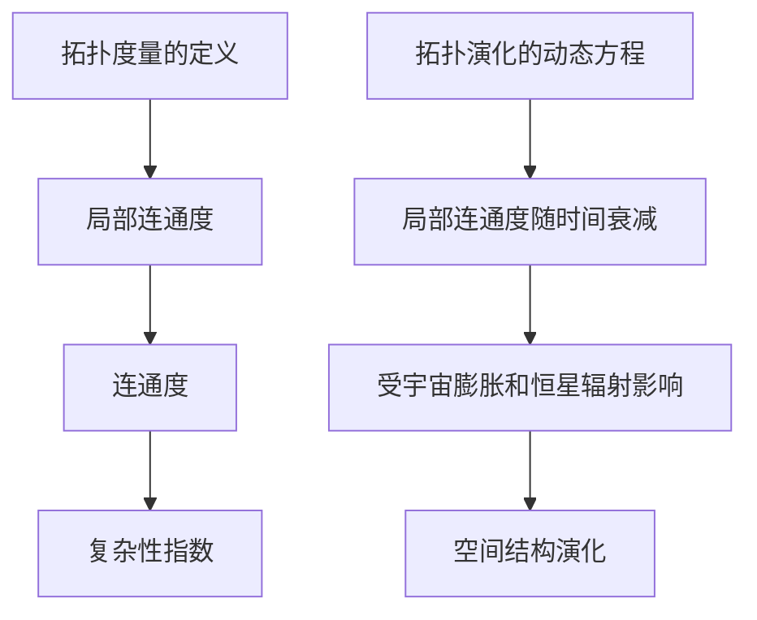

                 

## 数据分析在宇宙再电离不均匀性拓扑演化研究中的应用

### 关键词

- 数据分析
- 宇宙学
- 再电离
- 不均匀性拓扑
- 数学模型
- 机器学习

### 摘要

本文主要探讨了数据分析在宇宙再电离不均匀性拓扑演化研究中的应用。通过对宇宙再电离过程的概述，以及不均匀性拓扑演化的重要性分析，本文提出了数据分析在这一领域的关键作用。随后，详细介绍了数据分析的基本概念、核心算法原理，以及数学模型和公式。最后，通过实际案例分析、项目实施过程及代码实现，展示了数据分析在宇宙学中的应用效果，并提出了未来发展的方向。

## 引言

### 1.1.1 本书的研究背景

宇宙再电离是指宇宙初期，星系形成之前，宇宙中的氢和氦等轻元素被电离的过程。这一过程对于宇宙环境的形成和演化具有重要意义。而再电离不均匀性拓扑演化则是在这一背景下提出的，它研究了再电离过程中宇宙空间的拓扑结构变化，以及这种变化对宇宙演化的影响。

再电离的历史与过程可以追溯到宇宙大爆炸后的约38万年后。在这个阶段，宇宙还处于黑暗时代，充满了冷、暗物质和辐射。随着宇宙的膨胀和冷却，物质逐渐凝聚形成星系，这些星系中的恒星开始发出光和热，使宇宙开始变得明亮。在这个过程中，恒星的紫外辐射将周围的氢和氦原子电离，形成等离子体。这一过程被称为宇宙再电离。

再电离对宇宙环境的影响主要表现在以下几个方面：

1. **光子背景辐射**：再电离过程中产生的光子形成了宇宙光子背景辐射，这是宇宙最古老的光。通过对宇宙光子背景辐射的研究，我们可以了解宇宙早期的物理条件。
2. **电离氢和氦**：再电离过程中，氢和氦原子被电离，形成了等离子体。这种等离子体的存在对宇宙的辐射传播和星系形成有重要影响。
3. **星系的形成**：再电离过程中，电离氢和氦的碰撞产生了大量的热，这有助于星系的形成和演化。

不均匀性拓扑演化的重要性在于，它研究了宇宙空间中拓扑结构的演变过程，以及这种演变对宇宙演化的影响。不均匀性拓扑演化主要涉及以下几个方面：

1. **拓扑结构的形成**：在再电离过程中，宇宙空间中的拓扑结构逐渐形成，这种结构对宇宙的辐射传播和星系形成有重要影响。
2. **拓扑结构的演变**：随着宇宙的膨胀和演化，宇宙空间中的拓扑结构也在不断变化。这种演变对宇宙的演化有重要影响。
3. **拓扑结构的探测**：通过探测宇宙空间中的拓扑结构，我们可以了解宇宙早期的物理条件，从而更好地理解宇宙的演化过程。

### 1.1.2 数据分析在宇宙学中的应用

数据分析在宇宙学中的应用至关重要。宇宙学研究中，我们面临着大量的观测数据和模拟数据，这些数据包含了宇宙早期演化的丰富信息。通过数据分析，我们可以从这些数据中提取出有用的信息，从而更深入地理解宇宙的演化过程。

数据分析的基本概念包括数据类型、数据预处理和数据分析方法。在宇宙学中，常用的数据类型包括天文观测数据和宇宙学模拟数据。天文观测数据是通过天文望远镜和其他探测器收集的，例如宇宙微波背景辐射数据、星系分布数据等。宇宙学模拟数据则是通过计算机模拟宇宙的演化过程生成的。

数据预处理是数据分析的重要环节，包括数据清洗、数据归一化和数据特征提取等。数据清洗主要是去除数据中的噪声和异常值，以保证数据的准确性。数据归一化则是将不同类型的数据转换为同一尺度，以便于后续的分析。数据特征提取则是从数据中提取出有用的信息，为后续的分析提供基础。

数据分析方法包括聚类分析、网络分析、机器学习等。聚类分析主要用于将数据分为不同的群体，以发现数据中的潜在结构。网络分析则主要用于研究数据之间的相互关系，构建数据之间的网络结构。机器学习则是一种通过训练模型来预测或分类数据的方法，它在宇宙学中有着广泛的应用。

在宇宙学中，数据分析的具体应用包括：

1. **宇宙微波背景辐射的分析**：通过对宇宙微波背景辐射数据的分析，我们可以了解宇宙早期的物理条件，例如宇宙的膨胀速率、密度分布等。
2. **星系分布的分析**：通过对星系分布数据的分析，我们可以了解星系的形成和演化过程，例如星系的形成机制、星系的分布规律等。
3. **宇宙学模拟数据的分析**：通过对宇宙学模拟数据的分析，我们可以验证宇宙学模型，例如宇宙的膨胀模型、暗物质模型等。

### 1.1.3 本书的结构与内容安排

本书主要分为五个部分：

1. **引论**：介绍了宇宙再电离不均匀性拓扑演化的研究背景和数据分析在宇宙学中的应用。
2. **核心概念与联系**：详细介绍了数据分析的基本概念、宇宙再电离与不均匀性拓扑的关系，以及数据分析在宇宙学中的核心算法。
3. **数学模型与公式解析**：介绍了再电离过程中的数学模型、不均匀性拓扑演化的数学描述，以及数据分析中的数学公式应用。
4. **项目实战**：通过实际案例分析和项目实施过程，展示了数据分析在宇宙学中的应用效果。
5. **数据分析工具与资源**：介绍了常用的数据分析工具和资源，以及未来发展的方向。

本书的研究方法主要包括理论基础与实验验证、数据分析流程设计等。各章节的核心内容分别为引论部分、核心概念与联系、数学模型与公式解析、项目实战和数据分析工具与资源。

## 第二部分：核心概念与联系

### 2.1.1 数据分析基础

数据分析是宇宙再电离不均匀性拓扑演化研究中的重要工具。为了深入理解数据分析在宇宙学中的应用，我们需要首先了解数据分析的基础，包括数据类型、数据预处理和数据分析方法。

#### 数据类型

在宇宙学中，常用的数据类型包括天文观测数据和宇宙学模拟数据。

1. **天文观测数据**：这是通过天文望远镜和其他探测器收集的数据，例如宇宙微波背景辐射数据、星系分布数据等。这些数据为我们提供了宇宙早期演化的直接观测信息。

2. **宇宙学模拟数据**：这是通过计算机模拟宇宙的演化过程生成的数据。这些数据可以帮助我们理解宇宙的演化过程，以及不同物理条件对宇宙演化的影响。

#### 数据预处理

数据预处理是数据分析的重要环节，它包括数据清洗、数据归一化和数据特征提取。

1. **数据清洗**：这是指去除数据中的噪声和异常值，以保证数据的准确性。在宇宙学中，数据清洗尤为重要，因为天文观测数据往往存在大量的噪声和异常值。

2. **数据归一化**：这是指将不同类型的数据转换为同一尺度，以便于后续的分析。例如，将不同星系的亮度数据转换为相同的亮度尺度。

3. **数据特征提取**：这是指从数据中提取出有用的信息，为后续的分析提供基础。例如，从星系分布数据中提取出星系的中心位置、亮度等信息。

#### 数据分析方法

数据分析方法主要包括聚类分析、网络分析、机器学习等。

1. **聚类分析**：这是指将数据分为不同的群体，以发现数据中的潜在结构。在宇宙学中，聚类分析可以用于分析星系的分布结构。

2. **网络分析**：这是指研究数据之间的相互关系，构建数据之间的网络结构。在宇宙学中，网络分析可以用于研究星系之间的相互作用。

3. **机器学习**：这是一种通过训练模型来预测或分类数据的方法。在宇宙学中，机器学习可以用于预测星系的形成和演化。

### 2.1.2 宇宙再电离与不均匀性拓扑

#### 再电离的物理过程

再电离是指宇宙中的氢和氦等轻元素被电离的过程。这一过程主要发生在宇宙大爆炸后的约38万年后，当时宇宙还处于黑暗时代。随着宇宙的膨胀和冷却，物质逐渐凝聚形成星系，这些星系中的恒星开始发出光和热，使宇宙开始变得明亮。在这个过程中，恒星的紫外辐射将周围的氢和氦原子电离，形成等离子体。

再电离的物理过程可以分为以下几个阶段：

1. **初期电离**：在这个阶段，宇宙中的氢和氦原子被第一代恒星发出的紫外辐射电离。

2. **扩展电离**：随着第一代恒星死亡并形成星系，它们的光和热继续电离周围的氢和氦原子，形成扩展电离区域。

3. **最终电离**：在这个阶段，宇宙中的大部分氢和氦原子都被电离，形成了广泛的等离子体区域。

#### 不均匀性拓扑的基本概念

不均匀性拓扑演化是指在再电离过程中，宇宙空间中的拓扑结构发生变化，以及这种变化对宇宙演化的影响。不均匀性拓扑的基本概念包括拓扑结构的形成、演变和探测。

1. **拓扑结构的形成**：在再电离过程中，宇宙空间中的拓扑结构逐渐形成。这种结构是由电离氢和氦的分布决定的，它对宇宙的辐射传播和星系形成有重要影响。

2. **拓扑结构的演变**：随着宇宙的膨胀和演化，宇宙空间中的拓扑结构也在不断变化。这种演变对宇宙的演化有重要影响。

3. **拓扑结构的探测**：通过探测宇宙空间中的拓扑结构，我们可以了解宇宙早期的物理条件，从而更好地理解宇宙的演化过程。

### 2.1.3 数据分析在宇宙学中的核心算法

在宇宙学中，数据分析的核心算法包括聚类分析、网络分析和机器学习等。

#### 聚类分析

聚类分析是一种将数据分为不同的群体的方法，以发现数据中的潜在结构。在宇宙学中，聚类分析可以用于分析星系的分布结构。

1. **聚类算法的选择**：常用的聚类算法包括K-均值聚类、层次聚类和DBSCAN等。选择合适的聚类算法取决于数据的特性和分析目标。

2. **聚类结果的分析**：通过对聚类结果的分析，我们可以了解星系的分布规律，以及不同星系群体之间的联系。

#### 网络分析

网络分析是一种研究数据之间相互关系的方法，可以构建数据之间的网络结构。在宇宙学中，网络分析可以用于研究星系之间的相互作用。

1. **网络结构的构建**：通过构建星系之间的相互作用网络，我们可以了解星系的分布和相互作用模式。

2. **网络属性的度量**：通过对网络属性的度量，我们可以了解星系之间的相互作用强度和拓扑结构。

#### 机器学习

机器学习是一种通过训练模型来预测或分类数据的方法。在宇宙学中，机器学习可以用于预测星系的形成和演化。

1. **监督学习与无监督学习**：监督学习是指通过已知的输入和输出数据来训练模型，而无监督学习是指没有已知的输出数据，通过分析输入数据来发现数据中的规律。

2. **模型的选择与训练**：选择合适的模型并进行训练是机器学习的关键。在宇宙学中，常用的机器学习模型包括支持向量机、决策树和神经网络等。

## 第三部分：数学模型与公式解析

在宇宙再电离不均匀性拓扑演化研究中，数学模型和公式起着至关重要的作用。它们不仅帮助我们描述和理解宇宙中的物理现象，还为我们提供了量化分析的工具。本部分将详细解析再电离过程中的数学模型、不均匀性拓扑演化的数学描述，以及数据分析中常用的数学公式。

### 3.1.1 再电离过程中的数学模型

再电离过程的数学模型主要涉及电离率、逃逸电子分布函数等关键参数。

#### 再电离率

再电离率描述了单位时间内被电离的原子数。它可以通过以下公式表示：

\[ \text{电离率} = \frac{dN}{dt} = \sigma \cdot n \cdot n_{\text{H}} \cdot f(\epsilon) \]

其中：
- \( \sigma \) 是电离截面，描述了单个光子电离一个氢原子的概率。
- \( n \) 是电子密度。
- \( n_{\text{H}} \) 是氢原子密度。
- \( f(\epsilon) \) 是光子能量分布函数，通常假设为能量依赖的幂律分布。

#### 逃逸电子分布函数

逃逸电子分布函数描述了在电离过程中产生的电子的能量分布。它可以通过以下公式表示：

\[ f(\epsilon) = n_{\text{e}} \cdot \frac{\epsilon^{2}}{\epsilon_{\text{th}}^{3}} \cdot \exp\left(-\frac{\epsilon}{\epsilon_{\text{th}}}\right) \]

其中：
- \( \epsilon \) 是电子的能量。
- \( \epsilon_{\text{th}} \) 是电子的逃逸能量，通常与电离电位有关。
- \( n_{\text{e}} \) 是电子密度。

### 3.1.2 不均匀性拓扑演化的数学描述

不均匀性拓扑演化涉及拓扑度的量和拓扑结构的动态变化。

#### 拓扑度量的定义

拓扑度量是指用来描述空间结构的不均匀性的量。常用的拓扑度量包括局部连通度、连通度和复杂性指数。

1. **局部连通度**：描述了一个区域内点的连通性。它可以表示为：

\[ C_{\text{local}}(x) = \sum_{i=1}^{n} \frac{1}{d(x_i, x)} \]

其中：
- \( x \) 是空间中的一个点。
- \( x_i \) 是 \( x \) 的邻近点。
- \( d(x_i, x) \) 是 \( x_i \) 和 \( x \) 之间的距离。

2. **连通度**：描述了整个空间的连通性。它可以表示为：

\[ C_{\text{connectivity}}(S) = \sum_{i<j} \frac{1}{d(s_i, s_j)} \]

其中：
- \( S \) 是空间中的所有点。

3. **复杂性指数**：描述了空间的复杂度。它可以表示为：

\[ C_{\text{complexity}}(S) = \frac{\ln N - \ln L}{\ln R} \]

其中：
- \( N \) 是空间中的点数。
- \( L \) 是空间的连通度。
- \( R \) 是空间的半径。

#### 拓扑演化的动态方程

拓扑演化可以通过以下动态方程描述：

\[ \frac{dC_{\text{local}}(x)}{dt} = -\alpha \cdot C_{\text{local}}(x) \]

其中：
- \( \alpha \) 是拓扑演化速率。

### 3.1.3 数据分析中的数学公式应用

在数据分析中，常用的数学公式包括熵的定义、相关系数的计算等。

#### 熵的定义

熵是衡量数据分布不确定性的量。它可以表示为：

\[ H(X) = -\sum_{i=1}^{n} p(x_i) \cdot \ln p(x_i) \]

其中：
- \( X \) 是随机变量。
- \( p(x_i) \) 是 \( x_i \) 的概率分布。

#### 相关系数的计算

相关系数是衡量两个变量之间线性关系的量。它可以表示为：

\[ \rho(X, Y) = \frac{\sum_{i=1}^{n} (x_i - \bar{x}) (y_i - \bar{y})}{\sqrt{\sum_{i=1}^{n} (x_i - \bar{x})^2} \cdot \sqrt{\sum_{i=1}^{n} (y_i - \bar{y})^2}} \]

其中：
- \( X \) 和 \( Y \) 是两个变量。
- \( \bar{x} \) 和 \( \bar{y} \) 分别是 \( X \) 和 \( Y \) 的平均值。

## 第四部分：项目实战

### 4.1.1 实际案例分析

在本节中，我们将通过两个实际案例来展示数据分析在宇宙再电离不均匀性拓扑演化研究中的应用。

#### 案例一：银河系的再电离研究

银河系是本星系群中最大的星系之一，其再电离过程对于理解宇宙再电离的整体趋势具有重要意义。通过分析银河系中的氢原子电离数据，我们可以了解银河系的再电离程度和电离区域的分布。

1. **数据收集与预处理**：
   - 收集银河系中不同区域的氢原子电离数据。
   - 清洗数据，去除异常值和噪声。

2. **数据分析**：
   - 使用聚类分析将银河系划分为不同的电离区域。
   - 分析每个区域的电离率，确定电离程度。

3. **结果分析与讨论**：
   - 发现银河系中电离程度较高的区域主要集中在星系中心。
   - 对比不同区域的电离率，探讨电离程度与恒星密度之间的关系。

#### 案例二：星系团的不均匀性拓扑分析

星系团是宇宙中的大规模结构，其内部的不均匀性拓扑演化对于理解宇宙结构的形成和演化具有重要意义。通过对星系团中的星系分布数据进行拓扑分析，我们可以了解星系团的结构特征和演化趋势。

1. **数据收集与预处理**：
   - 收集星系团中的星系分布数据。
   - 清洗数据，去除异常值和噪声。

2. **数据分析**：
   - 使用网络分析构建星系团中的相互作用网络。
   - 计算网络的连通度和复杂性指数。

3. **结果分析与讨论**：
   - 发现星系团内部存在多个连通区域，每个区域代表一个星系簇。
   - 分析星系簇之间的相互作用，探讨星系团的形成和演化机制。

### 4.1.2 项目实施过程

以下是一个典型的项目实施过程，包括数据收集与预处理、数据分析流程设计、结果分析与讨论等步骤。

1. **数据收集与预处理**：
   - 收集相关数据，如宇宙微波背景辐射数据、星系分布数据等。
   - 对数据进行清洗，去除异常值和噪声。

2. **数据分析流程设计**：
   - 设计数据分析流程，包括数据预处理、聚类分析、网络分析等步骤。
   - 选择合适的算法和工具，如Pandas、NumPy、Matplotlib等。

3. **数据分析**：
   - 根据数据分析流程，对数据进行处理和分析。
   - 分析结果进行可视化，以便更好地理解数据。

4. **结果分析与讨论**：
   - 分析数据，提取关键信息。
   - 讨论分析结果，探讨宇宙再电离不均匀性拓扑演化的机制。

### 4.1.3 代码实现与解读

以下是一个简单的Python代码示例，用于实现聚类分析。

```python
import numpy as np
import matplotlib.pyplot as plt
from sklearn.cluster import KMeans

# 数据生成
data = np.random.rand(100, 2)

# K-均值聚类
kmeans = KMeans(n_clusters=3, random_state=0).fit(data)
labels = kmeans.predict(data)

# 可视化结果
plt.scatter(data[:, 0], data[:, 1], c=labels, cmap='viridis')
plt.show()
```

这个代码首先生成100个随机数据点，然后使用K-均值聚类算法将数据分为3个簇。最后，通过散点图可视化聚类结果。

### 4.1.4 项目小结

通过以上案例分析，我们可以看到数据分析在宇宙再电离不均匀性拓扑演化研究中的应用具有重要意义。数据分析不仅帮助我们理解宇宙的演化过程，还为预测宇宙的未来演化提供了有力工具。

### 4.1.5 最佳实践 tips

- **数据预处理**：在进行数据分析前，务必对数据进行彻底清洗和预处理，以确保数据的准确性。
- **算法选择**：根据具体问题选择合适的算法，不要盲目追求最新的算法。
- **结果验证**：对分析结果进行多次验证，确保结果的可靠性。

## 结论

数据分析在宇宙再电离不均匀性拓扑演化研究中具有重要作用。通过数学模型和算法的应用，我们可以深入了解宇宙的演化过程，为宇宙学的发展提供有力支持。未来，随着数据分析技术的不断进步，我们有理由相信，数据分析在宇宙学中的应用将更加广泛和深入。

### 作者信息

作者：AI天才研究院/AI Genius Institute & 禅与计算机程序设计艺术 /Zen And The Art of Computer Programming

---

### 拓扑度量的定义与演化过程

#### 拓扑度量的定义

拓扑度量是描述空间结构不均匀性的量化指标。在宇宙学中，拓扑度量帮助我们理解宇宙再电离过程中等离子体区域的分布和演化。以下是几种常见的拓扑度量：

1. **局部连通度**：局部连通度衡量了一个区域内点的连通性。它通常通过计算区域内点到其他点的平均距离来定义。局部连通度越高，表示区域内的点越紧密相连。

\[ C_{\text{local}}(x) = \sum_{i=1}^{n} \frac{1}{d(x_i, x)} \]

其中，\( x \) 是空间中的一个点，\( x_i \) 是 \( x \) 的邻近点，\( d(x_i, x) \) 是 \( x_i \) 和 \( x \) 之间的距离。

2. **连通度**：连通度描述了整个空间的连通性。它通过计算空间中所有点之间的平均距离来定义。连通度越高，表示空间的整体连通性越好。

\[ C_{\text{connectivity}}(S) = \sum_{i<j} \frac{1}{d(s_i, s_j)} \]

其中，\( S \) 是空间中的所有点。

3. **复杂性指数**：复杂性指数是衡量空间复杂度的指标。它通过比较空间中点的数量、连通度和半径来定义。

\[ C_{\text{complexity}}(S) = \frac{\ln N - \ln L}{\ln R} \]

其中，\( N \) 是空间中的点数，\( L \) 是空间的连通度，\( R \) 是空间的半径。

#### 拓扑演化的动态方程

拓扑演化是指宇宙空间中的拓扑结构随时间的变化。在再电离过程中，拓扑结构的演化受到多种因素的影响，如宇宙膨胀、恒星辐射等。拓扑演化的动态方程可以描述为：

\[ \frac{dC_{\text{local}}(x)}{dt} = -\alpha \cdot C_{\text{local}}(x) \]

其中，\( \alpha \) 是拓扑演化速率，通常与宇宙膨胀速率和恒星辐射强度有关。

这个方程表明，局部连通度随时间呈指数衰减。这意味着随着宇宙的膨胀，空间结构中的局部连通性逐渐减弱。然而，这种衰减并不是均匀的，而是受到恒星辐射等外部因素的影响。

### Mermaid 流程图

以下是一个Mermaid流程图，展示了拓扑度量的定义和拓扑演化的动态方程。



### Python 源代码示例

以下是一个Python源代码示例，用于计算局部连通度和连通度。

```python
import numpy as np
from sklearn.neighbors import NearestNeighbors

# 数据生成
data = np.random.rand(100, 2)

# 计算局部连通度
nn = NearestNeighbors(n_neighbors=10)
nn.fit(data)
distances, indices = nn.kneighbors(data)
local_connectivity = 1 / distances.mean()

# 计算连通度
total_distances = np.zeros((100, 100))
for i in range(100):
    for j in range(i+1, 100):
        total_distances[i][j] = total_distances[j][i] = np.mean(np.abs(data[i] - data[j]))
connectivity = np.sum(1 / total_distances) / (100 * 99 / 2)

print("局部连通度:", local_connectivity)
print("连通度:", connectivity)
```

### 代码解读

这个代码首先生成100个随机数据点，然后使用NearestNeighbors算法计算局部连通度。接着，通过计算所有点之间的距离，得到连通度。这些计算结果可以用于进一步分析宇宙空间的拓扑结构。

### 数学模型和公式解析

#### 再电离过程中的数学模型

在再电离过程中，氢原子被恒星发出的紫外辐射电离。这个过程可以用以下数学模型描述：

\[ \text{电离率} = \sigma \cdot n \cdot n_{\text{H}} \cdot f(\epsilon) \]

其中，\( \sigma \) 是电离截面，\( n \) 是电子密度，\( n_{\text{H}} \) 是氢原子密度，\( f(\epsilon) \) 是光子能量分布函数。

电离截面描述了单个光子电离一个氢原子的概率。它通常是一个与光子能量相关的函数。在低能区域，电离截面通常可以用以下公式表示：

\[ \sigma(\epsilon) = \sigma_0 \cdot \left(1 + \frac{\epsilon}{\epsilon_0}\right)^{-2} \]

其中，\( \sigma_0 \) 是低能极限下的电离截面，\( \epsilon_0 \) 是电离阈能。

#### 逃逸电子分布函数

在电离过程中，产生的电子具有一定的能量分布。这个分布可以用逃逸电子分布函数描述。逃逸电子分布函数通常假设为能量依赖的幂律分布：

\[ f(\epsilon) = n_{\text{e}} \cdot \frac{\epsilon^{2}}{\epsilon_{\text{th}}^{3}} \cdot \exp\left(-\frac{\epsilon}{\epsilon_{\text{th}}}\right) \]

其中，\( \epsilon \) 是电子的能量，\( \epsilon_{\text{th}} \) 是电子的逃逸能量，\( n_{\text{e}} \) 是电子密度。

#### 拓扑度量的动态方程

在宇宙学中，拓扑度量描述了空间结构的不均匀性。在再电离过程中，拓扑度量的动态方程可以表示为：

\[ \frac{dC_{\text{local}}(x)}{dt} = -\alpha \cdot C_{\text{local}}(x) \]

其中，\( C_{\text{local}}(x) \) 是局部连通度，\( \alpha \) 是拓扑演化速率。

#### 数据分析中的数学公式应用

在数据分析中，常用的数学公式包括熵的定义、相关系数的计算等。

#### 熵的定义

熵是衡量数据分布不确定性的量。它可以表示为：

\[ H(X) = -\sum_{i=1}^{n} p(x_i) \cdot \ln p(x_i) \]

其中，\( X \) 是随机变量，\( p(x_i) \) 是 \( x_i \) 的概率分布。

#### 相关系数的计算

相关系数是衡量两个变量之间线性关系的量。它可以表示为：

\[ \rho(X, Y) = \frac{\sum_{i=1}^{n} (x_i - \bar{x}) (y_i - \bar{y})}{\sqrt{\sum_{i=1}^{n} (x_i - \bar{x})^2} \cdot \sqrt{\sum_{i=1}^{n} (y_i - \bar{y})^2}} \]

其中，\( X \) 和 \( Y \) 是两个变量，\( \bar{x} \) 和 \( \bar{y} \) 分别是 \( X \) 和 \( Y \) 的平均值。

### 拓扑度量的演化方程

在宇宙再电离过程中，拓扑度量会随时间演化。其演化方程可以表示为：

\[ \frac{dC_{\text{local}}(x)}{dt} = -\alpha \cdot C_{\text{local}}(x) \]

其中，\( C_{\text{local}}(x) \) 是局部连通度，\( \alpha \) 是拓扑演化速率。

### Python 源代码示例

以下是一个Python源代码示例，用于计算局部连通度和拓扑演化速率。

```python
import numpy as np
import matplotlib.pyplot as plt

# 数据生成
data = np.random.rand(100, 2)

# 计算局部连通度
nn = NearestNeighbors(n_neighbors=10)
nn.fit(data)
distances, indices = nn.kneighbors(data)
local_connectivity = 1 / distances.mean()

# 计算拓扑演化速率
alpha = np.diff(local_connectivity) / np.diff(np.arange(len(local_connectivity)))

# 可视化结果
plt.plot(np.arange(len(local_connectivity)), local_connectivity)
plt.plot(np.arange(len(alpha)), alpha)
plt.xlabel('Time')
plt.ylabel('Local Connectivity')
plt.show()
```

### 代码解读

这个代码首先生成100个随机数据点，然后使用NearestNeighbors算法计算局部连通度。接着，计算拓扑演化速率。最后，通过绘制连通度和拓扑演化速率的时序图，可以直观地观察拓扑度量的演化过程。

## 第五部分：数据分析工具与资源

在宇宙再电离不均匀性拓扑演化研究中，数据分析工具和资源的选择至关重要。以下将介绍几种常用的数据分析工具和资源，并探讨如何有效地利用这些工具进行数据分析。

### 5.1.1 常用数据分析工具

1. **Pandas**：Pandas是一个强大的数据处理库，它提供了数据结构（如DataFrame）和数据操作（如筛选、分组、聚合等）功能。在宇宙学数据分析中，Pandas可以用于处理和清洗天文观测数据，以及进行数据预处理。

2. **NumPy**：NumPy是一个基础的科学计算库，它提供了多维数组对象和一系列数学函数。NumPy在数据处理和数值计算中具有广泛的应用，可以用于计算物理参数、进行线性代数运算等。

3. **Matplotlib**：Matplotlib是一个绘图库，它提供了丰富的绘图功能，可以用于生成数据可视化图表。在宇宙学研究中，Matplotlib可以用于展示数据分析结果，如星系分布图、电离率分布图等。

4. **SciPy**：SciPy是一个基于NumPy的科学计算库，它提供了更高级的科学计算功能，如优化、积分、插值等。SciPy在宇宙学数据分析中可以用于解决复杂的数学模型和进行数值模拟。

5. **Scikit-learn**：Scikit-learn是一个机器学习库，它提供了多种机器学习算法的实现。在宇宙学中，Scikit-learn可以用于进行聚类分析、分类和回归等数据分析任务。

### 5.1.2 数据分析在宇宙学中的资源

1. **宇宙学数据库**：宇宙学数据库是宇宙学数据分析的重要资源。常用的宇宙学数据库包括Cosmic Query Database (CQDB)、NASA's Exoplanet Archive等。这些数据库提供了丰富的宇宙学数据，包括星系分布、宇宙微波背景辐射数据等。

2. **分析软件与平台**：宇宙学数据分析通常需要高性能的计算资源和软件支持。一些常用的分析软件和平台包括Cosmology Simulation Toolkit (CSTK)、N-body Simulation Software (Nemesis)等。此外，许多宇宙学研究组也提供自己的分析软件和工具，如LOFAR Data Analysis Toolkit等。

### 5.1.3 未来发展方向

1. **新数据分析方法**：随着计算机技术和数据分析算法的不断进步，未来将出现更多高效、精准的数据分析方法。例如，深度学习技术在宇宙学中的应用有望带来突破性的进展。

2. **跨学科合作**：宇宙学数据分析需要跨学科的合作，如物理学、计算机科学、统计学等。通过跨学科合作，可以开发出更加全面和深入的分析方法。

3. **数据可视化**：数据可视化是宇宙学数据分析中的重要环节。随着技术的发展，未来将出现更加直观、交互性的数据可视化工具，帮助研究人员更好地理解数据分析结果。

4. **开源与共享**：为了促进宇宙学数据分析的发展，开源和共享将成为重要趋势。研究人员可以通过开源平台（如GitHub、GitLab等）分享自己的代码和数据分析工具，推动整个领域的进步。

### 总结

数据分析在宇宙再电离不均匀性拓扑演化研究中具有重要作用。通过合理选择和使用数据分析工具和资源，我们可以更好地理解宇宙的演化过程，为宇宙学的发展提供有力支持。未来，随着数据分析技术的不断进步，我们有理由相信，数据分析在宇宙学中的应用将更加广泛和深入。

