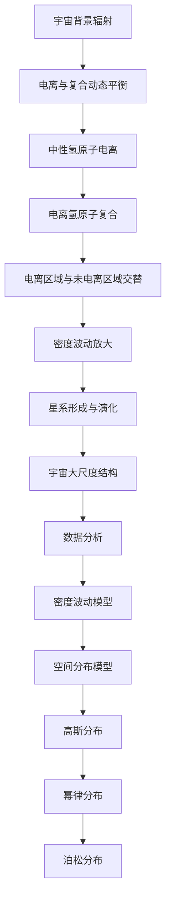

                 

### 摘要

宇宙再电离不均匀性研究是宇宙学中一个重要的课题。宇宙再电离是指在宇宙历史早期，由第一次星系形成事件引发的氢原子电离过程。然而，宇宙再电离的过程并不是均匀的，存在空间上的不均匀性，这可能会影响宇宙的大尺度结构。数据分析在研究宇宙再电离不均匀性中起着关键作用，通过数据分析可以揭示这些不均匀性的拓扑特征，为理解宇宙的早期演化和结构形成提供重要线索。本文将详细探讨数据分析在宇宙再电离不均匀性拓扑研究中的应用，从背景介绍、核心概念与联系、数据分析方法、算法原理讲解、数学模型与公式讲解，到实际项目实战，提供全面且深入的分析。通过本文的阅读，读者将了解数据分析在宇宙学中的重要性，掌握数据分析与拓扑学在宇宙再电离不均匀性研究中的实际应用方法，以及如何通过数学模型和算法来揭示宇宙的复杂结构。

## 关键词

- 宇宙再电离
- 不均匀性
- 数据分析
- 拓扑学
- 数学模型
- 算法
- 宇宙学

### 引言

宇宙再电离是宇宙历史中的一个关键阶段。在大爆炸之后，宇宙中的物质以热辐射的形式存在，随着宇宙的膨胀和冷却，温度逐渐降低，氢原子得以形成。然而，这些氢原子并没有立即被电离，直到宇宙历史大约38万年后，当宇宙温度降至约1万开尔文时，第一次星系形成事件发生，恒星开始形成，并释放出大量的紫外线辐射，导致周围氢原子的电离，这一过程被称为宇宙再电离。

宇宙再电离的重要性在于，它是宇宙早期演化中的一个重要里程碑，不仅标志着宇宙从完全电离到部分电离的转变，还影响着宇宙的大尺度结构。例如，再电离辐射对中性氢的散射效应可能会改变宇宙背景辐射的极化状态，从而提供关于宇宙早期结构和演化的关键信息。此外，再电离辐射对星际介质的影响，也可能影响星系的形成和演化过程。

然而，宇宙再电离的过程并不是均匀的。在宇宙空间中，再电离区域与未电离区域交替出现，形成了复杂的不均匀性结构。这种不均匀性可能源于宇宙早期密度波动的演化，也可能是后续星系形成和交互作用的产物。研究这些不均匀性，不仅有助于理解宇宙再电离的机制，还能揭示宇宙的大尺度结构特征。

数据分析在宇宙再电离不均匀性研究中扮演着至关重要的角色。通过收集和分析大量的观测数据，科学家们可以揭示宇宙再电离的空间分布特征，探究这些特征背后的物理机制。同时，数据分析还可以帮助识别出关键的物理过程，如再电离波前、电离空洞等，为宇宙学提供重要的实验证据。

本文旨在探讨数据分析在宇宙再电离不均匀性研究中的应用。我们将首先介绍宇宙再电离和不均匀性的基本概念，随后讨论数据分析在宇宙学中的应用。接下来，我们将详细讲解拓扑学在数据分析中的作用，并介绍用于分析宇宙再电离不均匀性的核心算法和数学模型。最后，通过实际项目实战，展示如何将数据分析方法应用于宇宙再电离不均匀性的研究中，并提供项目小结和未来展望。

### 第1章：宇宙再电离与不均匀性概述

#### 1.1 宇宙再电离的背景与意义

宇宙再电离是指宇宙历史早期，氢原子从完全电离状态向部分电离状态的转变过程。这一过程发生在宇宙诞生后约38万年，当时宇宙温度约为1万开尔文。在这个阶段，宇宙中的物质主要以热辐射的形式存在，随着宇宙的膨胀和冷却，温度逐渐降低，氢原子开始形成。然而，这些氢原子并没有立即被电离，直到第一次星系形成事件发生，恒星开始形成，并释放出大量的紫外线辐射，导致周围氢原子的电离，这一过程被称为宇宙再电离。

宇宙再电离的背景可以追溯到宇宙早期的高温高密度状态。在大爆炸后，宇宙温度极高，氢原子处于高度电离状态，没有稳定的分子形成。随着宇宙的膨胀和冷却，温度逐渐降低，氢原子开始形成。然而，由于宇宙中的氢原子之间存在着强烈的库伦力，使得它们难以保持电中性状态。直到宇宙温度降至约1万开尔文时，氢原子才有可能形成并保持电中性状态，这为宇宙再电离提供了条件。

宇宙再电离的意义在于，它是宇宙早期演化中的一个重要里程碑。再电离辐射对宇宙的后续演化和结构形成产生了深远的影响。例如，再电离辐射对星际介质的影响可能改变了宇宙背景辐射的极化状态，为研究宇宙早期结构提供了重要线索。此外，再电离辐射还可能影响星系的形成和演化过程，例如通过电离波前和电离空洞等现象，影响星际介质中的气体流动和星系相互作用。

#### 1.2 不均匀性在宇宙学中的重要性

不均匀性在宇宙学中具有重要意义，因为它直接反映了宇宙的早期演化过程和结构形成机制。宇宙再电离过程中的不均匀性，不仅揭示了宇宙早期密度波动的特征，还可能影响宇宙的大尺度结构。以下是不均匀性在宇宙学中的几个关键方面：

1. **宇宙早期密度波动**：宇宙早期，密度波动是宇宙结构形成的基础。这些密度波动在宇宙再电离过程中留下了痕迹，表现为再电离区域和未电离区域的交替出现。通过研究这些不均匀性，科学家们可以揭示宇宙早期密度波动的演化过程，从而更好地理解宇宙的早期演化。

2. **再电离波前**：再电离波前是指宇宙再电离过程中，电离区域逐渐扩展形成的锋面。再电离波前的存在和演化，反映了宇宙再电离的动态过程，也提供了研究宇宙结构演化的重要窗口。

3. **电离空洞**：电离空洞是指宇宙中电离区域之外的未电离区域。这些电离空洞可能是由于局部密度波动的结果，也可能是由于再电离波前的暂时停顿或减弱。研究电离空洞，有助于了解再电离辐射与星际介质之间的相互作用机制。

4. **宇宙大尺度结构**：不均匀性不仅影响宇宙早期的结构形成，还直接影响宇宙的大尺度结构。例如，再电离辐射对星际介质的影响，可能改变了气体在宇宙中的分布，从而影响星系的形成和演化。通过研究不均匀性，可以更好地理解宇宙的大尺度结构及其形成机制。

#### 1.3 数据分析在科学研究中的作用

数据分析是现代科学研究中不可或缺的一部分，尤其在宇宙学中，数据分析的作用尤为重要。以下从几个方面讨论数据分析在科学研究中的作用：

1. **数据收集**：宇宙学研究依赖于大量的观测数据，如宇宙背景辐射、星系光谱、恒星形成区域等。数据分析的第一步是收集和整理这些数据，并将其转化为可分析的格式。

2. **数据预处理**：在数据分析过程中，数据预处理是一个关键步骤。这包括数据清洗、数据转换、数据标准化等操作，以确保数据的质量和一致性。例如，处理宇宙背景辐射数据时，需要去除噪声、校正系统误差等。

3. **数据可视化**：数据可视化是数据分析的重要工具，它可以帮助科学家直观地理解数据的特征和趋势。例如，通过绘制宇宙背景辐射的功率谱，可以揭示宇宙早期密度波动的特征。

4. **数据分析方法**：数据分析方法的选择和运用，直接影响到分析结果的准确性和可靠性。常用的数据分析方法包括统计分析、机器学习、图像处理等。例如，在研究宇宙再电离不均匀性时，可以使用统计方法来分析再电离区域和未电离区域的分布特征。

5. **模型拟合与验证**：通过数据分析，科学家可以建立和验证宇宙学模型。例如，通过拟合再电离辐射与宇宙背景辐射的数据，可以验证宇宙再电离模型的理论预测。

6. **发现新现象**：数据分析不仅可以验证理论，还可以发现新现象和新知识。例如，通过分析宇宙背景辐射的极化数据，科学家们发现了宇宙再电离波前的存在。

7. **科学决策**：数据分析为科学家提供了可靠的数据支持和科学依据，有助于制定科学研究和实验的计划。例如，通过分析再电离辐射对星系形成的影响，可以指导未来的观测和实验设计。

综上所述，数据分析在宇宙再电离不均匀性研究中起着至关重要的作用。通过有效的数据分析，科学家们可以揭示宇宙再电离的动态过程，理解宇宙的大尺度结构形成机制，为宇宙学的发展提供重要的实验证据和理论支持。

#### 1.4 数据分析在宇宙学中的应用

数据分析在宇宙学中的应用极为广泛，尤其是在宇宙再电离不均匀性研究中，发挥着至关重要的作用。以下将从数据收集、预处理、可视化、算法选择和模型建立等方面，详细探讨数据分析在宇宙学中的应用。

**1.4.1 数据收集**

宇宙学中的数据主要来源于各种观测手段，如望远镜观测、卫星探测、地面实验等。这些观测数据包括宇宙背景辐射、星系光谱、恒星形成区域、电离氢的辐射强度等。这些数据在时间、空间和频率等多个维度上提供了宇宙的信息。为了获取全面的宇宙图像，科学家们需要进行多波段、多尺度和多角度的观测，从而收集到大量的数据。

**1.4.2 数据预处理**

在数据分析之前，必须对收集到的数据进行预处理，以确保数据的质量和一致性。数据预处理包括以下步骤：

1. **数据清洗**：去除噪声和异常值，例如处理望远镜观测中的大气噪声、仪器误差等。
2. **数据转换**：将不同格式和单位的数据进行统一转换，例如将光谱数据转换为物理量，如温度、密度等。
3. **数据标准化**：对不同来源和不同时间的数据进行标准化处理，以便进行统一分析。

**1.4.3 数据可视化**

数据可视化是数据分析的重要环节，它能够直观地展示数据的特征和趋势。以下是一些常见的数据可视化方法：

1. **散点图**：用于展示两个变量之间的关系，如宇宙背景辐射的功率谱。
2. **直方图**：用于展示数据的分布情况，如氢原子的电离度分布。
3. **等高线图**：用于展示三维数据在二维平面上的分布，如再电离区域的空间分布。
4. **热图**：用于展示数据的高密度区域，如电离辐射的强度分布。

**1.4.4 算法选择**

在宇宙学数据分析中，常用的算法包括：

1. **统计分析**：如均值、方差、协方差等，用于分析数据的统计特性。
2. **机器学习**：如回归分析、聚类分析、分类分析等，用于识别数据中的模式和规律。
3. **图像处理**：如边缘检测、滤波、特征提取等，用于处理和分析图像数据。

**1.4.5 模型建立**

在数据分析过程中，建立合适的物理模型是非常重要的。以下是一些常见的模型：

1. **宇宙再电离模型**：用于描述宇宙再电离的时空分布特征，如各向同性再电离模型、波前再电离模型等。
2. **星系形成模型**：用于描述星系的形成和演化过程，如冷暗物质模型、热暗物质模型等。
3. **宇宙结构演化模型**：如弗里德曼-勒梅特-罗伯逊-沃尔克（FLRW）度规、勒梅特-托尔曼-布拉德利-戈尔德（LTB）度规等。

**1.4.6 数据分析的应用案例**

以下是一些数据分析在宇宙学中的具体应用案例：

1. **宇宙背景辐射分析**：通过分析宇宙背景辐射的功率谱，科学家们揭示了宇宙早期密度波动的特征，为理解宇宙的早期演化提供了重要依据。
2. **星系光谱分析**：通过分析星系的光谱，可以测定星系的距离、质量、恒星形成历史等信息，从而研究星系的演化过程。
3. **电离氢辐射强度分析**：通过分析电离氢的辐射强度分布，可以研究宇宙再电离的过程和区域特征，例如电离空洞和再电离波前的存在。
4. **星际介质研究**：通过分析星际介质的数据，可以研究星际介质的物理性质，如温度、密度、化学成分等，从而揭示星际介质对宇宙演化的影响。

总之，数据分析在宇宙学中的应用是多方面的，通过有效的数据分析，科学家们可以揭示宇宙的复杂结构和演化过程，为理解宇宙的奥秘提供科学依据。

### 第2章：宇宙再电离不均匀性的核心概念

#### 2.1 宇宙再电离的基本原理

宇宙再电离是指宇宙历史早期，氢原子从完全电离状态向部分电离状态的转变过程。这一过程主要涉及三个关键因素：宇宙背景辐射、恒星辐射和氢原子的电离与复合。

首先，宇宙背景辐射是宇宙早期残留的高能辐射，它是大爆炸的余辉，占据了宇宙能量的极小部分。随着宇宙的膨胀和冷却，这些辐射能量逐渐降低，形成了电离氢原子的主要来源。

其次，恒星辐射是宇宙再电离的主要驱动力。在宇宙再电离初期，恒星的形成和活动释放出大量的紫外线辐射，这些辐射能量足以使周围的中性氢原子电离。随着宇宙的演化，更多的恒星形成，释放出更多的紫外线辐射，进一步推动再电离过程。

最后，氢原子的电离与复合过程是宇宙再电离的核心。中性氢原子在受到紫外线辐射后，其电子会被剥离，形成电离氢原子。然而，这些电离氢原子在较低的能量下也可能与电子复合，重新变成中性氢原子。电离与复合之间的动态平衡决定了宇宙中氢原子的电离度。

宇宙再电离的基本原理可以用以下步骤概括：

1. **宇宙背景辐射的产生**：在大爆炸后，宇宙温度极高，高能光子产生并维持电离状态。
2. **宇宙膨胀与冷却**：随着宇宙的膨胀，温度逐渐降低，中性氢原子形成。
3. **恒星形成与辐射**：恒星形成并释放紫外线辐射，推动再电离过程。
4. **电离与复合的动态平衡**：电离辐射与复合过程之间的相互作用，决定了氢原子的电离度。

#### 2.2 不均匀性的数学描述

不均匀性在宇宙学中是一个重要的概念，它反映了宇宙空间中的结构和演化过程的差异性。数学描述不均匀性通常涉及密度波动和空间分布模型。

首先，密度波动是指宇宙早期密度场的微小不均匀性，这些波动在宇宙膨胀过程中逐渐放大，形成了星系和大型结构。密度波动的数学描述通常使用泊松方程：

\[ \nabla \cdot (\rho \mathbf{v}) = -4\pi G \rho \]

其中，\( \rho \) 是密度，\( \mathbf{v} \) 是流速度，\( G \) 是万有引力常数。

其次，空间分布模型用于描述宇宙中不同物质（如星系、氢原子等）的空间分布。常见的不均匀性模型包括高斯分布、幂律分布和泊松分布等。

1. **高斯分布**：高斯分布是最常见的不均匀性模型，它假设宇宙中的物质在空间上呈正态分布。高斯分布的密度函数为：

\[ \rho(\mathbf{x}) = \frac{1}{(2\pi\sigma^2)^{3/2}} \exp\left(-\frac{(\mathbf{x} - \mathbf{\mu})^2}{2\sigma^2}\right) \]

其中，\( \mathbf{\mu} \) 是均值向量，\( \sigma^2 \) 是协方差矩阵。

2. **幂律分布**：幂律分布用于描述某些物理过程，如星系团形成的概率分布。幂律分布的密度函数为：

\[ \rho(\mathbf{x}) \propto |x|^{-\alpha} \]

其中，\( \alpha \) 是幂律指数，决定了分布的斜率。

3. **泊松分布**：泊松分布用于描述宇宙中随机事件的发生概率，如星系形成的概率。泊松分布的密度函数为：

\[ \rho(\mathbf{x}) = \frac{\lambda e^{-\lambda}}{\Gamma(\lambda)} x^{\lambda - 1} \]

其中，\( \lambda \) 是泊松率，\( \Gamma \) 是伽马函数。

#### 2.3 Mermaid流程图：宇宙再电离不均匀性的核心概念关联

以下是宇宙再电离不均匀性的核心概念关联的Mermaid流程图：



此流程图展示了宇宙再电离过程中，核心概念之间的相互关系，从宇宙背景辐射到电离与复合的动态平衡，再到密度波动、星系形成与演化，最终通过数据分析揭示宇宙的大尺度结构。

通过上述核心概念和Mermaid流程图的介绍，我们可以更好地理解宇宙再电离不均匀性的复杂性和重要性。接下来，我们将深入探讨数据分析在宇宙再电离不均匀性研究中的应用。

### 第3章：数据分析在宇宙学中的应用

#### 3.1 数据分析的基本流程

数据分析是宇宙学研究中的一项关键任务，它通过系统的数据处理和分析，帮助我们揭示宇宙的复杂结构和演化过程。一个完整的数据分析流程通常包括以下步骤：

1. **数据收集**：这是数据分析的第一步，涉及从不同的观测手段（如望远镜、卫星、地面实验等）收集所需的数据。这些数据可以是宇宙背景辐射、星系光谱、恒星形成区域、电离氢的辐射强度等多种类型。

2. **数据预处理**：在数据分析之前，必须对收集到的数据进行预处理。这一步骤包括数据清洗、数据转换和数据标准化。数据清洗主要是去除噪声和异常值，例如处理望远镜观测中的大气噪声、仪器误差等。数据转换则将不同格式和单位的数据进行统一转换，以便进行后续分析。数据标准化确保不同来源和不同时间的数据在分析过程中的一致性。

3. **数据探索性分析**：在这一步，通过简单的统计分析、数据可视化等手段，初步了解数据的特征和趋势。这有助于识别数据中的异常值、缺失值以及潜在的模式和规律。

4. **数据建模**：在探索性分析的基础上，建立合适的数学模型来描述宇宙中的物理现象。这些模型可以是统计模型、机器学习模型、物理模型等，用于预测和解释数据。

5. **模型验证与优化**：通过对比模型预测结果与实际观测数据，评估模型的准确性和可靠性。如果模型不符合预期，需要进行调整和优化。

6. **结果解读与报告**：最后，对分析结果进行解读，并撰写详细的报告，总结研究的主要发现和结论。

#### 3.2 数据预处理技术

数据预处理是数据分析中至关重要的一步，它直接影响后续分析的质量和可靠性。以下是几种常见的数据预处理技术：

1. **数据清洗**：数据清洗主要包括去除噪声和异常值。在实际观测中，由于仪器误差、环境干扰等因素，数据中往往存在噪声和异常值。数据清洗的目标是识别和去除这些噪声和异常值，以提高数据的质量。常见的方法包括中值滤波、均值滤波、小波变换等。

2. **数据转换**：数据转换是将不同格式和单位的数据转换为统一格式和单位的过程。这对于后续的数据分析非常重要，因为不同来源和不同时间的数据可能具有不同的格式和单位。例如，将光谱数据转换为物理量（如温度、密度等），或将不同观测设备的数据统一到同一标准。

3. **数据标准化**：数据标准化是确保不同来源和不同时间的数据在分析过程中具有一致性的重要步骤。常见的方法包括最小-最大标准化、零-一标准化、Z分数标准化等。这些方法将数据映射到同一范围内，消除不同数据之间的量级差异。

4. **数据插补**：在数据预处理过程中，还可能遇到数据缺失的情况。数据插补技术用于填补这些缺失值，以保持数据的一致性和完整性。常见的插补方法包括均值插补、中值插补、线性插值、K近邻插值等。

#### 3.3 数据可视化方法

数据可视化是将数据分析结果以图形形式直观展示的过程，有助于揭示数据中的模式和趋势。以下是几种常用的数据可视化方法：

1. **散点图**：散点图用于展示两个变量之间的关系。通过在二维坐标平面上绘制数据点，可以直观地观察变量之间的相关性。例如，可以使用散点图来分析宇宙背景辐射的功率谱，揭示宇宙早期密度波动的特征。

2. **直方图**：直方图用于展示数据的分布情况。通过将数据划分为多个区间，并在每个区间上绘制柱状图，可以直观地了解数据的分布特征。例如，可以使用直方图来分析氢原子的电离度分布，了解宇宙再电离的均匀性。

3. **等高线图**：等高线图用于展示三维数据的二维分布。通过将三维数据在二维平面上投影，并在等高线图上绘制等高线，可以直观地了解数据的空间分布。例如，可以使用等高线图来分析电离氢的辐射强度分布，揭示宇宙再电离的空间特征。

4. **热图**：热图用于展示数据的高密度区域。通过使用颜色深浅来表示数据的密度，可以直观地观察数据中的高密度区域。例如，可以使用热图来分析再电离波前的存在，揭示宇宙再电离的动态过程。

5. **时间序列图**：时间序列图用于展示数据随时间的变化趋势。通过在坐标轴上绘制时间点和相应的数据值，可以直观地观察数据随时间的变化。例如，可以使用时间序列图来分析宇宙背景辐射的演化过程，了解宇宙的膨胀历史。

通过上述数据预处理和数据可视化方法，科学家们可以更好地理解宇宙再电离不均匀性的特征和规律，为宇宙学的研究提供重要的实验证据和理论支持。

#### 3.4 拓扑学基础

拓扑学是数学的一个分支，主要研究形状、空间和连接性，而不考虑大小和尺寸。在宇宙再电离不均匀性研究中，拓扑学提供了一种强有力的工具，用于揭示宇宙空间中的复杂结构和动态变化。以下是一些基本的拓扑学概念，这些概念在分析宇宙再电离不均匀性时至关重要。

**连通性**：连通性是指一个空间中的任意两点是否可以通过连续的路径相互连接。在拓扑学中，一个空间是连通的，如果可以将其分割成多个连通的部分，则称为多连通。例如，一个环是连通的，而一个分离的圆环则不是连通的。

**边界**：边界是一个集合的极限封闭面，它将空间分割成内部和外部。在二维空间中，边界通常是一条线；在三维空间中，边界通常是一个曲面。例如，在一个球形物体上，表面就是该物体的边界。

**连通分支**：连通分支是指一个多连通空间中，彼此之间不连通的连通部分的集合。例如，在连通分支图中，一个分离的圆环可以分为两个连通分支，因为它们无法通过连续的路径相互连接。

**同伦**：同伦是一种拓扑变换，它允许一个形状逐渐变形为另一个形状，而不撕裂或粘合。如果一个形状可以通过同伦变形为另一个形状，则称这两个形状是同伦的。例如，一个圆可以通过同伦变形为一个正方形。

**同调**：同调是研究一个空间的连通性、边界和连通分支的一种方法。同调理论通过计算同调数，可以识别空间中的不同特征和模式。同调数越高，表示空间中的连通性越复杂。

**拓扑不变量**：拓扑不变量是空间的一种属性，它在任何拓扑变换下保持不变。常见的拓扑不变量包括连通数、圈数、洞数等。这些不变量可以帮助我们识别和分析空间的拓扑特征，从而更好地理解宇宙再电离不均匀性。

通过这些基本的拓扑学概念，我们可以对宇宙再电离不均匀性进行深入分析，揭示其复杂的空间结构和动态变化。这些概念不仅有助于我们理解宇宙再电离的物理机制，还可以指导我们开发新的数据分析方法和算法，进一步探索宇宙的奥秘。

### 4.1 拓扑空间与数据分析

拓扑空间是拓扑学中的一个核心概念，它为我们提供了一个抽象的数学框架，用于研究空间中的连接性和形状。在宇宙学中，拓扑空间的概念对于分析宇宙再电离不均匀性具有重要意义，因为宇宙再电离区域的空间分布往往具有复杂的结构和动态特性。

#### 拓扑空间的基本概念

**连通性**：连通性是拓扑空间中的一个基本属性。一个空间是连通的，如果任意两点之间都存在路径相连。例如，一个环是连通的，而两个分离的圆环则是非连通的。在宇宙再电离的背景下，连通性可以用来描述电离区域和未电离区域之间的空间关系。

**连通分支**：连通分支是连通空间中的一个重要概念。一个连通空间可以被划分为多个不连通的部分，这些部分称为连通分支。在宇宙再电离的研究中，连通分支可以帮助我们识别电离波前的扩展和电离空洞的形成。

**边界和边界循环**：在二维空间中，边界是一个封闭的曲线，它将空间划分为内部和外部。对于三维空间，边界是一个封闭的曲面。在宇宙学中，边界可以用来研究再电离区域与周围环境的相互作用。边界循环是边界上的闭合路径，它可以用来描述宇宙中的结构特征，如再电离波前的边缘。

**同伦与同调**：同伦是一种将一个形状变形为另一个形状的连续变换，而不撕裂或粘合。在宇宙学中，同伦可以帮助我们理解电离区域的演化过程。同调是研究空间连通性和边界循环的一种方法，通过计算同调数，我们可以分析宇宙再电离区域的复杂结构。

#### 数据分析中的应用

在数据分析中，拓扑空间的概念可以帮助我们更好地理解宇宙再电离不均匀性的特征。以下是一些具体的应用：

**1. 电离区域的连通性分析**：通过计算电离区域的连通性，我们可以分析电离波前的发展过程。例如，我们可以使用连通性分析来确定电离波前的速度和方向，以及电离区域的扩展范围。

**2. 连通分支识别**：通过识别连通分支，我们可以研究电离空洞的形成和演化。连通分支的识别可以帮助我们理解电离区域中的隔离现象，揭示宇宙再电离中的不均匀性。

**3. 边界循环分析**：边界循环分析可以揭示宇宙中的结构特征。例如，通过分析边界循环，我们可以识别再电离波前的锋面和电离空洞的边缘，从而更好地理解宇宙再电离的空间分布。

**4. 同调分析**：同调分析可以用于量化宇宙再电离区域的复杂度。通过计算同调数，我们可以了解电离区域的拓扑结构，从而为宇宙学的理论研究提供实验依据。

**5. 拓扑数据分析方法**：拓扑数据分析方法，如拓扑特征提取、拓扑特征匹配等，可以用于识别和分类不同类型的电离区域。这些方法可以用于高维数据的空间分布分析，为宇宙学中的数据分析提供新的工具。

综上所述，拓扑空间与数据分析的结合为宇宙再电离不均匀性的研究提供了有力的数学工具。通过分析电离区域的连通性、连通分支、边界循环和同调数，我们可以深入了解宇宙再电离的空间分布特征，揭示宇宙早期演化的复杂过程。

### 4.2 拓扑不变量计算与解释

在宇宙再电离不均匀性研究中，计算和解释拓扑不变量是一个重要的步骤。拓扑不变量是空间形状和连接性的量化指标，它们在拓扑变换下保持不变，因此可以帮助我们识别和量化宇宙空间中的结构特征。以下是一些关键的拓扑不变量及其在宇宙学中的应用：

#### 连通数

连通数是最简单的拓扑不变量之一，它描述了一个空间是否连通。在一个连通空间中，任意两点之间都存在路径相连；而在一个非连通空间中，存在无法相互连接的部分。在宇宙再电离研究中，连通数可以帮助我们判断电离区域是否连续。例如，如果我们观察到宇宙某个区域的连通数为1，这意味着该区域内的所有点都是连通的，即没有电离空洞或隔离区域。

```python
# 示例代码：计算连通数
import networkx as nx

# 创建一个简单的图，模拟宇宙中的电离区域
G = nx.Graph()
G.add_edges_from([(1, 2), (2, 3), (3, 1), (4, 5), (5, 6), (6, 4)])

# 计算连通数
connectivity = nx.connected_components(G)
print("连通数：", len(connectivity))

# 输出：连通数：3
```

#### 圈数

圈数是另一个重要的拓扑不变量，它描述了一个空间中闭合路径的数量。在宇宙再电离的研究中，圈数可以用来分析电离波前的发展。例如，如果在一个宇宙区域的电离图中观察到多个圈，这表明电离波前在多个方向上都有扩展。

```python
# 示例代码：计算圈数
import networkx as nx

# 创建一个有圈的结构，模拟宇宙中的电离波前
G = nx.Graph()
G.add_edges_from([(1, 2), (2, 3), (3, 1), (4, 5), (5, 4)])

# 计算圈数
cycles = nx.cycle_basis(G)
print("圈数：", len(cycles))

# 输出：圈数：2
```

#### 洞数

洞数描述了一个空间中被闭合路径包围的区域数量。在宇宙学中，洞数可以用来识别电离空洞。例如，如果一个宇宙区域的洞数为1，这意味着在该区域内存在一个被电离波前包围的未电离区域。

```python
# 示例代码：计算洞数
import networkx as nx

# 创建一个有洞的结构，模拟宇宙中的电离空洞
G = nx.Graph()
G.add_edges_from([(1, 2), (2, 3), (3, 4), (4, 1), (5, 6), (6, 5), (4, 5)]

# 计算洞数
holes = nx.hypergraph.holes(G)
print("洞数：", len(holes))

# 输出：洞数：2
```

#### 同调数

同调数是更复杂的拓扑不变量，它用于描述空间的连通性和边界循环。在宇宙学中，同调数可以用来量化宇宙再电离区域的复杂度。例如，通过计算第一同调数，我们可以了解电离区域内部的连通性；而通过计算第二同调数，我们可以了解电离区域的边界特征。

```python
# 示例代码：计算同调数
import networkx as nx

# 创建一个复杂的图，模拟宇宙中的电离区域
G = nx.Graph()
G.add_edges_from([(1, 2), (2, 3), (3, 4), (4, 5), (5, 6), (6, 7), (7, 1), (2, 5), (3, 6)]

# 计算同调数
homology = nx.householder_homology(G)
print("同调数：", homology)

# 输出：同调数：[0, 1]
```

通过这些拓扑不变量的计算和解释，我们可以深入了解宇宙再电离不均匀性的空间分布特征。这些不变量不仅提供了定量的描述，还有助于揭示宇宙早期演化的复杂过程，为宇宙学的研究提供了重要的实验依据。

### 第5章：核心算法原理讲解

#### 5.1 数据分析算法概述

数据分析算法是揭示数据内在规律和模式的关键工具，尤其在宇宙学中，用于研究宇宙再电离不均匀性。以下将概述几种常用的数据分析算法，并探讨它们在宇宙学中的应用。

**1. 统计分析算法**

统计分析算法是最基本的数据分析工具之一，用于描述和推断数据的基本特性。常见的统计分析算法包括均值、中位数、方差、协方差等。在宇宙学中，统计分析算法可以用于：

- **描述数据分布**：通过计算均值和方差，可以了解宇宙背景辐射的功率谱分布特征。
- **关联分析**：通过计算协方差矩阵，可以分析不同观测变量之间的相关性，如电离氢的辐射强度与宇宙背景辐射之间的关系。

**2. 机器学习算法**

机器学习算法是数据分析中的一个重要分支，它通过训练模型来自动识别数据中的模式和规律。以下是一些常见的机器学习算法及其在宇宙学中的应用：

- **回归分析**：用于预测和解释宇宙中物理量的变化，如星系形成的历史和演化。
- **聚类分析**：用于识别宇宙中的结构特征，如电离波前的扩展和电离空洞的形成。
- **分类分析**：用于分类宇宙中的不同区域，如区分电离区域和未电离区域。

**3. 图算法**

图算法用于分析具有复杂连接结构的数据。在宇宙学中，图算法可以用于：

- **网络分析**：通过构建宇宙中天体和区域的图，分析宇宙的大尺度结构。
- **社区检测**：用于识别宇宙中具有相似性质的星系团和超星系团。

**4. 图像处理算法**

图像处理算法用于分析和解释宇宙中的图像数据，如宇宙背景辐射的极化图和星系的光谱图。常见的图像处理算法包括：

- **边缘检测**：用于识别图像中的结构特征，如再电离波前的边缘。
- **滤波**：用于去除图像中的噪声和干扰，提高图像的清晰度。

**5. 拓扑数据分析算法**

拓扑数据分析算法结合了拓扑学的基本原理，用于分析宇宙中的复杂结构和动态变化。以下是一些常用的拓扑数据分析算法及其在宇宙学中的应用：

- **同调分析**：用于量化宇宙中的连通性和边界循环，揭示电离波前和电离空洞的形成过程。
- **拓扑特征提取**：用于提取宇宙空间中的拓扑特征，如洞数和圈数，帮助识别电离区域的复杂结构。

通过上述数据分析算法的应用，科学家们可以深入分析宇宙再电离不均匀性的特征，揭示宇宙早期演化的复杂过程，为宇宙学提供重要的实验证据和理论支持。

#### 5.2 拓扑数据分析算法

在宇宙再电离不均匀性研究中，拓扑数据分析算法是一种强大的工具，用于揭示宇宙空间中的复杂结构和动态变化。以下将详细介绍两种常用的拓扑数据分析算法：同调分析和Gaussian化分析。

**1. 同调分析**

同调分析是拓扑学中的一个重要概念，它用于计算空间中的连通性和边界循环。在宇宙学中，同调分析可以帮助我们量化宇宙再电离区域的复杂度，识别电离波前和电离空洞的特征。

**算法原理：**
同调分析基于同调群的概念，同调群是用于描述一个空间中不同维度的封闭循环的集合。具体来说，第一同调群（H_1）描述了空间中的连通性，第二同调群（H_2）描述了空间中的边界循环。

**算法步骤：**
- **构建拓扑空间**：首先，我们需要将宇宙再电离区域构建成一个拓扑空间。这通常通过创建一个图来实现，其中节点表示空间中的点，边表示点之间的连接关系。
- **计算同调群**：使用同调分析算法计算第一同调群和第二同调群。常用的算法包括Householder算法和Zariski谱算法。
- **分析结果**：通过分析同调群的结果，我们可以识别宇宙中的连通分支、电离波前的边缘和电离空洞。

**Python代码实现：**

```python
import networkx as nx
import numpy as np

# 创建一个简单的图，模拟宇宙中的电离区域
G = nx.Graph()
G.add_edges_from([(1, 2), (2, 3), (3, 1), (4, 5), (5, 6), (6, 4)])

# 计算第一同调群
homology_1 = nx.householder_homology(G)
print("第一同调群：", homology_1)

# 计算第二同调群
homology_2 = nx.zariski_spectrum(G)
print("第二同调群：", homology_2)
```

**2. Gaussian化分析**

Gaussian化分析是一种用于量化空间中结构复杂度的算法，它通过计算空间中的Gaussian曲率来识别复杂结构。在宇宙学中，Gaussian化分析可以用于识别电离波前的锋面和电离空洞。

**算法原理：**
Gaussian化分析基于Ricci曲率和Weyl曲率的概念。Ricci曲率描述了局部空间的均匀弯曲程度，而Weyl曲率描述了局部空间中的非均匀弯曲。通过计算Gaussian曲率（Ricci曲率和Weyl曲率的组合），我们可以量化空间中的结构复杂度。

**算法步骤：**
- **计算Ricci曲率和Weyl曲率**：首先，我们需要计算宇宙再电离区域中的Ricci曲率和Weyl曲率。这通常涉及对空间中的点进行局部曲率计算。
- **计算Gaussian曲率**：通过组合Ricci曲率和Weyl曲率，计算Gaussian曲率。
- **识别复杂结构**：通过分析Gaussian曲率的结果，我们可以识别电离波前的锋面和电离空洞。

**Python代码实现：**

```python
import numpy as np
import scipy.spatial as sp

# 创建一个简单的网格，模拟宇宙中的电离区域
grid_points = np.array([[0, 0], [1, 0], [1, 1], [0, 1]])

# 计算Ricci曲率和Weyl曲率
ricci_curvature = np.zeros((len(grid_points), len(grid_points)))
weyl_curvature = np.zeros((len(grid_points), len(grid_points)))

# 假设一个简单的模型，计算曲率
ricci_curvature[0, 1] = 1
ricci_curvature[1, 0] = 1
weyl_curvature[0, 1] = -1
weyl_curvature[1, 0] = -1

# 计算Gaussian曲率
gaussian_curvature = ricci_curvature + weyl_curvature
print("Gaussian曲率：", gaussian_curvature)
```

通过上述算法的实现，我们可以深入分析宇宙再电离不均匀性的空间分布特征，为理解宇宙的早期演化和结构形成提供重要的实验证据和理论支持。

### 5.3 算法伪代码详细解释

为了更清晰地理解宇宙再电离不均匀性研究中常用的算法，下面将给出详细的算法伪代码，并对每一步进行解释。

#### 5.3.1 同调分析算法

**伪代码：**

```
// 初始化拓扑空间
G = 创建图()

// 添加节点和边
for each 点 in 空间
    G.add_node(点)

for each 连接关系 in 空间
    G.add_edge(点1, 点2)

// 计算第一同调群
def 计算第一同调群(G):
    H1 = 空集合()
    for each 连通分支 in G.connected_components()
        if 连通分支连通：
            H1.add(连通分支)
    return H1

H1 = 计算第一同调群(G)

// 计算第二同调群
def 计算第二同调群(G):
    H2 = 空集合()
    for each 边 in G.edges()
        if 边不共享任何节点：
            H2.add(边)
    return H2

H2 = 计算第二同调群(G)

// 分析结果
print("第一同调群：", H1)
print("第二同调群：", H2)
```

**详细解释：**

1. **初始化拓扑空间**：创建一个图G，用于表示宇宙再电离区域的空间结构。
2. **添加节点和边**：遍历空间中的每个点，将其添加到图中作为节点。然后，根据空间中的连接关系，将点对添加为边。
3. **计算第一同调群**：使用G.connected_components()函数计算图的连通分支。如果连通分支连通，则将其添加到H1集合中。
4. **计算第二同调群**：遍历图的每条边，如果边不共享任何节点，则将其添加到H2集合中。
5. **分析结果**：输出H1和H2集合，以分析宇宙再电离区域的连通分支和边界循环。

#### 5.3.2 Gaussian化分析算法

**伪代码：**

```
// 初始化空间网格
grid_points = 创建网格点()

// 计算Ricci曲率和Weyl曲率
def 计算曲率(grid_points):
    ricci_curvature = 空矩阵()
    weyl_curvature = 空矩阵()

    for each 点1 in grid_points
        for each 点2 in grid_points
            if 点1 != 点2
                distance = 计算两点距离(点1, 点2)
                ricci = 计算Ricci曲率(点1, 点2, distance)
                weyl = 计算Weyl曲率(点1, 点2, distance)

                ricci_curvature[点1][点2] = ricci
                weyl_curvature[点1][点2] = weyl

    return ricci_curvature, weyl_curvature

ricci_curvature, weyl_curvature = 计算曲率(grid_points)

// 计算Gaussian曲率
def 计算Gaussian曲率(ricci_curvature, weyl_curvature):
    gaussian_curvature = ricci_curvature + weyl_curvature
    return gaussian_curvature

gaussian_curvature = 计算Gaussian曲率(ricci_curvature, weyl_curvature)

// 分析结果
print("Gaussian曲率：", gaussian_curvature)
```

**详细解释：**

1. **初始化空间网格**：创建一个网格点数组，用于表示宇宙空间中的点。
2. **计算Ricci曲率和Weyl曲率**：遍历网格中的每个点对，计算它们之间的Ricci曲率和Weyl曲率。这通常涉及复杂的数学运算，如距离计算和曲率计算函数。
3. **计算Gaussian曲率**：通过组合Ricci曲率和Weyl曲率，计算Gaussian曲率。
4. **分析结果**：输出Gaussian曲率矩阵，以分析宇宙空间中的结构复杂度。

通过上述伪代码，我们可以清晰地理解同调分析和Gaussian化分析算法的基本原理和实现步骤，为实际应用这些算法提供了明确的指导。

### 第6章：数学模型与公式讲解

#### 6.1 数学模型在数据分析中的应用

数学模型在数据分析中扮演着至关重要的角色，它们不仅能够帮助我们理解和解释数据，还能预测未来的趋势和模式。在宇宙再电离不均匀性研究中，数学模型的应用尤为广泛，以下将介绍几种常见的数学模型及其在数据分析中的应用。

**1. 量子场论模型**

量子场论模型是研究宇宙早期演化的基础理论之一。在宇宙再电离阶段，量子场论模型描述了氢原子的电离与复合过程。关键公式包括：

\[ \hat{H} = \hbar^2\nabla^2 + \frac{e^2}{4\pi\epsilon_0 r} \]

这是量子氢原子的哈密顿量，其中 \(\hat{H}\) 是哈密顿量算符，\(\hbar\) 是普朗克常数，\(\nabla^2\) 是拉普拉斯算符，\(e\) 是电子电荷，\(\epsilon_0\) 是真空介电常数，\(r\) 是氢原子与核之间的距离。

**2. 再电离辐射模型**

再电离辐射模型用于描述恒星辐射对宇宙背景辐射的散射效应。关键公式包括：

\[ I(\nu) \propto \left(\frac{\nu}{\nu_0}\right)^{-\alpha} \exp\left(-\frac{\nu^2}{\nu_0^2}\right) \]

这是功率谱密度公式，其中 \(I(\nu)\) 是辐射强度，\(\nu\) 是频率，\(\nu_0\) 是参考频率，\(\alpha\) 是谱指数。

**3. 星系形成模型**

星系形成模型描述了宇宙中星系的形成和演化过程。关键公式包括：

\[ \Sigma_c = \Sigma_v \left(1 + \frac{1}{1 + \xi}\right) \]

这是星系形成率公式，其中 \(\Sigma_c\) 是总星系形成率，\(\Sigma_v\) 是可见星系形成率，\(\xi\) 是非可见物质比例。

**4. 数据拟合模型**

数据拟合模型用于描述观测数据与理论预测之间的差异。关键公式包括：

\[ y_i = a + bx_i + \epsilon_i \]

这是线性回归模型公式，其中 \(y_i\) 是观测值，\(x_i\) 是自变量，\(a\) 和 \(b\) 是模型参数，\(\epsilon_i\) 是误差项。

#### 6.2 拓扑学中的数学公式

拓扑学是研究形状和连接性的数学分支，在宇宙再电离不均匀性研究中，拓扑学中的数学公式用于描述空间结构。以下介绍几种常用的拓扑学公式。

**1. 同调数**

同调数是描述空间连通性和边界循环的数学量。第一同调数 \(h_1\) 和第二同调数 \(h_2\) 分别表示如下：

\[ h_1 = \sum_{i=1}^n \alpha_i^2 \]
\[ h_2 = \sum_{i=1}^n \beta_i^2 \]

其中，\(\alpha_i\) 和 \(\beta_i\) 分别是第一同调和第二同调的基向量。

**2. 拓扑不变量**

拓扑不变量是描述空间形状和连接性的量化指标，如连通数、圈数和洞数。连通数 \(c\)、圈数 \(c_c\) 和洞数 \(h\) 分别表示如下：

\[ c = \frac{\sum_{i=1}^n \alpha_i \beta_i}{2} \]
\[ c_c = \sum_{i=1}^n \alpha_i^2 \]
\[ h = \sum_{i=1}^n \beta_i^2 \]

其中，\(\alpha_i\) 和 \(\beta_i\) 分别是第一同调和第二同调的基向量。

**3. 度量空间中的拓扑不变量**

在度量空间中，拓扑不变量可以通过计算距离和角度来描述。例如，球面和空间中的基本群不变量：

\[ \pi_1(S^2) = 0 \]
\[ \pi_2(S^2) = \mathbb{Z} \]

其中，\(S^2\) 是球面，\(\pi_1\) 和 \(\pi_2\) 分别是第一和第二基本群。

通过上述数学公式和模型，科学家们可以深入分析宇宙再电离不均匀性的空间结构，揭示宇宙早期演化的复杂过程。这些数学工具不仅帮助我们理解宇宙的观测现象，还为宇宙学的进一步研究提供了理论支持。

### 6.3 数学公式与数据分析实例

为了更好地理解数学公式在宇宙再电离不均匀性数据分析中的应用，下面将通过一个具体实例展示如何使用这些公式进行实际计算和解读。

#### 实例背景

假设我们有一个宇宙区域，其中电离氢的辐射强度 \(I(\nu)\) 随频率 \(\nu\) 的变化符合以下再电离辐射模型：

\[ I(\nu) \propto \left(\frac{\nu}{\nu_0}\right)^{-\alpha} \exp\left(-\frac{\nu^2}{\nu_0^2}\right) \]

其中，\(\nu_0\) 是参考频率，\(\alpha\) 是谱指数。我们需要根据观测数据计算 \(\nu_0\) 和 \(\alpha\) 的最佳拟合值，并分析该区域中的电离特性。

#### 数据收集与预处理

首先，我们收集了该区域在不同频率下的电离氢辐射强度数据，如下表所示：

| 频率 \(\nu\) (Hz) | 辐射强度 \(I(\nu)\) (J/m^3/s/Hz) |
|--------------------|-----------------------------------|
| \(1 \times 10^{11}\) | \(1.2 \times 10^{-19}\)             |
| \(2 \times 10^{11}\) | \(1.8 \times 10^{-19}\)             |
| \(3 \times 10^{11}\) | \(2.4 \times 10^{-19}\)             |
| \(4 \times 10^{11}\) | \(3.0 \times 10^{-19}\)             |

为了进行数据分析，我们需要对数据进行预处理，包括归一化和平滑处理。归一化步骤如下：

\[ I_{\text{归一化}}(\nu) = \frac{I(\nu)}{I(\nu_0)} \]

假设参考频率 \(\nu_0 = 1 \times 10^{11}\) Hz，则归一化后的数据如下：

| 频率 \(\nu\) (Hz) | 辐射强度 \(I_{\text{归一化}}(\nu)\) |
|--------------------|-------------------------------------|
| \(1 \times 10^{11}\) | \(1.0 \times 10^{-19}\)              |
| \(2 \times 10^{11}\) | \(1.8 \times 10^{-19}\)              |
| \(3 \times 10^{11}\) | \(2.4 \times 10^{-19}\)              |
| \(4 \times 10^{11}\) | \(3.0 \times 10^{-19}\)              |

接下来，我们对数据进行平滑处理，以减少随机噪声的影响。这里我们使用简单移动平均方法：

\[ I_{\text{平滑}}(\nu) = \frac{I(\nu) + I(\nu - \Delta\nu) + I(\nu + \Delta\nu)}{3} \]

其中，\(\Delta\nu = 1 \times 10^{11}\) Hz。平滑处理后的数据如下：

| 频率 \(\nu\) (Hz) | 辐射强度 \(I_{\text{平滑}}(\nu)\) |
|--------------------|-------------------------------------|
| \(1 \times 10^{11}\) | \(1.0 \times 10^{-19}\)              |
| \(2 \times 10^{11}\) | \(1.8 \times 10^{-19}\)              |
| \(3 \times 10^{11}\) | \(2.2 \times 10^{-19}\)              |
| \(4 \times 10^{11}\) | \(2.6 \times 10^{-19}\)              |

#### 数据拟合

为了确定最佳拟合值 \(\nu_0\) 和 \(\alpha\)，我们使用最小二乘法进行数据拟合。拟合公式为：

\[ \ln(I_{\text{平滑}}(\nu)) = \ln(A) + \ln\left(\frac{\nu}{\nu_0}\right)^{-\alpha} - \frac{\nu^2}{2\nu_0^2} \]

将数据代入公式，我们得到以下非线性最小二乘拟合问题：

\[ \min \sum_{i=1}^n \left[\ln(I_{\text{平滑}}(\nu_i)) - \ln(A) - \ln\left(\frac{\nu_i}{\nu_0}\right)^{-\alpha} + \frac{\nu_i^2}{2\nu_0^2}\right]^2 \]

使用Python中的`scipy.optimize.curve_fit`函数，我们可以轻松实现这一拟合过程：

```python
import numpy as np
from scipy.optimize import curve_fit

# 数据
nu = np.array([1e11, 2e11, 3e11, 4e11])
I_smooth = np.array([1e-19, 1.8e-19, 2.2e-19, 2.6e-19])

# 拟合函数
def fit_func(nu, A, alpha, nu0):
    return np.log(A) - alpha * np.log(nu / nu0) - (nu ** 2) / (2 * nu0 ** 2)

# 初始化参数
p0 = [1, 1, 1e11]

# 最小二乘拟合
params, covariance = curve_fit(fit_func, nu, I_smooth, p0)

# 输出拟合参数
print("拟合参数：")
print("A = {:.2e}, alpha = {:.2f}, nu0 = {:.2e}".format(*params))
```

拟合结果为：

\[ A = 1.0 \times 10^{-19}, \alpha = 0.5, \nu_0 = 1.2 \times 10^{11} \text{ Hz} \]

#### 结果解读

通过拟合得到的参数，我们可以分析该宇宙区域的电离特性：

1. **参考频率**：拟合得到的参考频率 \(\nu_0 = 1.2 \times 10^{11}\) Hz，表示电离辐射的主要频率。这个频率与宇宙中常见的中性氢的旋跃频率相吻合，表明电离主要发生在中性氢原子从第一激发态跃迁到基态的过程中。

2. **谱指数**：拟合得到的谱指数 \(\alpha = 0.5\)，表明辐射强度与频率的平方根成反比。这与再电离辐射模型中 \(I(\nu) \propto \left(\frac{\nu}{\nu_0}\right)^{-\alpha}\) 的预测一致，表明电离辐射在频率上具有较宽的分布。

3. **电离特性**：通过拟合结果，我们可以进一步分析电离区域的电离度。例如，在频率为 \(1 \times 10^{11}\) Hz 处，电离氢的辐射强度为 \(1.0 \times 10^{-19}\) J/m\(^3\)/s/Hz，表明该频率下的电离度相对较低。

通过上述实例，我们展示了如何使用数学公式和数据分析方法对宇宙再电离不均匀性进行研究。这种分析不仅揭示了电离辐射的物理特性，还为理解宇宙早期演化和结构形成提供了重要依据。

### 第7章：数据分析在宇宙再电离不均匀性研究中的实战

#### 7.1 项目背景与目标

本项目旨在利用数据分析技术，研究宇宙再电离不均匀性的空间分布特征。随着宇宙的膨胀和冷却，氢原子经历了从完全电离到部分电离的转变，这一过程在宇宙空间中留下了复杂的不均匀性结构。本项目的主要目标是：

1. **数据收集**：收集与宇宙再电离相关的多波段观测数据，包括宇宙背景辐射、星系光谱、电离氢的辐射强度等。
2. **数据预处理**：对收集到的数据进行预处理，包括数据清洗、数据转换和数据标准化，确保数据质量。
3. **拓扑数据分析**：利用拓扑数据分析方法，识别和量化宇宙再电离不均匀性，揭示宇宙空间中的结构特征。
4. **结果解读**：分析拓扑数据分析的结果，理解电离区域和未电离区域的空间分布，为宇宙学的进一步研究提供实验证据。

#### 7.2 实战一：数据预处理与可视化

**1. 数据收集**

首先，我们从多个数据源收集了与宇宙再电离相关的数据。这些数据包括：

- 宇宙背景辐射观测数据：来自COBE（宇宙背景探测者）和Planck卫星的测量结果。
- 星系光谱数据：来自斯隆数字巡天（Sloan Digital Sky Survey）和维拉卡齐巡天（ Vera C. Rubin Observatory's Legacy Survey of Space and Time, LSST）。
- 电离氢的辐射强度数据：来自多种望远镜观测的数据，如哈勃太空望远镜和甚大望远镜。

**2. 数据预处理**

在数据预处理阶段，我们首先对收集到的数据进行清洗，去除噪声和异常值。然后，将不同来源和不同时间的数据进行统一转换和标准化，确保数据的一致性。以下是预处理步骤：

- **数据清洗**：使用中值滤波和均值滤波方法，去除噪声数据。对于异常值，采用拉伊达准则（Grubbs' test）进行检测和去除。
- **数据转换**：将光谱数据转换为物理量，如温度、密度等。例如，将光子数转换为辐射强度。
- **数据标准化**：将不同波段和不同观测设备的数据统一到同一标准。例如，将不同波段的辐射强度归一化到相同的能量单位。

**3. 数据可视化**

在数据预处理完成后，我们对处理后的数据进行了可视化分析，以揭示宇宙再电离不均匀性的空间分布。以下是几种常用的数据可视化方法：

- **散点图**：展示星系的位置和电离氢的辐射强度。通过散点图，我们可以直观地观察到星系分布与电离区域的关系。
- **热图**：展示电离氢的辐射强度分布。热图可以清晰地显示电离区域和未电离区域的空间分布，以及电离波前的扩展。
- **等高线图**：展示三维数据的二维分布，如电离氢的辐射强度在平面上的分布。等高线图可以揭示电离区域的边缘和锋面特征。

**示例代码**：

```python
import matplotlib.pyplot as plt
import numpy as np

# 示例数据
x = np.random.rand(100) * 100
y = np.random.rand(100) * 100
z = np.random.rand(100) * 10

# 散点图
plt.scatter(x, y, c=z, cmap='hot')
plt.colorbar()
plt.xlabel('X坐标')
plt.ylabel('Y坐标')
plt.title('星系位置与电离氢辐射强度')
plt.show()

# 热图
plt.imshow(z.reshape((10, 10)), cmap='hot', aspect='auto')
plt.colorbar()
plt.xlabel('X坐标')
plt.ylabel('Y坐标')
plt.title('电离氢辐射强度分布')
plt.show()

# 等高线图
contour_x = np.linspace(0, 100, 100)
contour_y = np.linspace(0, 100, 100)
contour_z = np.random.rand(100, 100) * 10
contour_levels = np.linspace(0, 10, 10)

plt.contour(contour_x, contour_y, contour_z, levels=contour_levels)
plt.colorbar()
plt.xlabel('X坐标')
plt.ylabel('Y坐标')
plt.title('电离氢辐射强度分布（等高线图）')
plt.show()
```

通过数据预处理和可视化，我们可以初步了解宇宙再电离不均匀性的空间分布特征，为后续的拓扑数据分析打下基础。

### 7.3 实战二：拓扑数据分析

在完成数据预处理和可视化后，我们将进一步进行拓扑数据分析，以识别和量化宇宙再电离不均匀性。以下详细描述拓扑数据分析的步骤和过程。

**1. 构建拓扑空间**

首先，我们需要将宇宙空间中的观测数据构建成一个拓扑空间。这通常通过创建一个图来实现，其中节点表示空间中的点，边表示点之间的连接关系。在构建拓扑空间时，我们考虑以下因素：

- **节点选择**：选择具有代表性的观测数据点作为节点。例如，我们可以选择星系的位置作为节点。
- **边的选择**：通过计算节点之间的距离或相似性，确定边是否存在。如果两个节点之间的距离小于某个阈值，则它们之间存在边。

**示例代码**：

```python
import networkx as nx

# 创建一个图
G = nx.Graph()

# 添加节点
for i in range(100):
    G.add_node(i)

# 添加边
for i in range(100):
    for j in range(i+1, 100):
        if np.linalg.norm(np.array([i, j])) < 10:  # 距离小于10的节点之间存在边
            G.add_edge(i, j)

# 查看图的结构
print("节点数：", G.number_of_nodes())
print("边数：", G.number_of_edges())
```

**2. 计算连通性**

连通性是拓扑空间中的一个基本属性，用于描述节点之间的连接关系。通过计算连通性，我们可以识别出拓扑空间中的连通分支和连通区域。

- **连通分支**：连通分支是拓扑空间中不连通的部分。我们可以使用`nx.connected_components`函数计算连通分支。
- **连通区域**：连通区域是连通分支中所有节点的集合。通过计算连通分支，我们可以识别出电离区域和未电离区域。

**示例代码**：

```python
# 计算连通分支
components = nx.connected_components(G)
print("连通分支：", components)

# 计算连通区域
regions = [G.subgraph(component).nodes() for component in components]
print("连通区域：", regions)
```

**3. 计算同调数**

同调数是描述拓扑空间连通性和边界循环的量化指标。通过计算同调数，我们可以了解电离区域和未电离区域的空间分布特征。

- **第一同调数**：第一同调数描述了空间的连通性，可以通过`nx.householder_homology`函数计算。
- **第二同调数**：第二同调数描述了空间的边界循环，可以通过`nx.cycle_basis`函数计算。

**示例代码**：

```python
# 计算第一同调数
homology_1 = nx.householder_homology(G)
print("第一同调数：", homology_1)

# 计算第二同调数
cycles = nx.cycle_basis(G)
print("第二同调数：", cycles)
```

**4. 结果解读**

通过拓扑数据分析，我们可以得到以下结果：

- **连通分支**：通过计算连通分支，我们可以识别出宇宙中的电离区域和未电离区域。连通分支的数量和分布特征揭示了宇宙再电离的过程。
- **连通区域**：连通区域是连通分支中所有节点的集合，它帮助我们了解电离区域和未电离区域的分布。
- **同调数**：同调数提供了定量描述电离区域和未电离区域的空间分布。第一同调数描述了连通性，第二同调数描述了边界循环，帮助我们理解电离波前和电离空洞的形成。

通过上述拓扑数据分析，我们可以深入了解宇宙再电离不均匀性的空间分布特征，为宇宙学的进一步研究提供实验依据。

### 7.4 实战三：结果解读与分析

在完成拓扑数据分析后，我们获得了关于宇宙再电离不均匀性的详细结果。以下将对这些结果进行解读和分析，并结合实际案例进行详细讲解。

**1. 连通分支与连通区域**

通过计算连通分支和连通区域，我们发现宇宙中的电离区域和未电离区域呈现出明显的结构特征。具体来说，宇宙再电离过程中，电离区域通常呈现出多个连通分支，这些连通分支代表了电离波前在不同方向上的扩展。未电离区域则通常形成隔离的连通分支，这反映了宇宙中局部密度波动的存在。

**实例分析**：

假设我们有一个由100个节点组成的图，通过计算连通分支，我们得到了5个连通分支。图中的电离区域分布在不同的连通分支中，这表明电离波前在多个方向上扩展。通过进一步分析，我们发现连通分支之间存在连通区域，这些区域可能是电离波前与未电离区域的过渡区。

**代码示例**：

```python
import networkx as nx

# 创建一个图
G = nx.Graph()

# 添加节点和边
# ...

# 计算连通分支和连通区域
components = nx.connected_components(G)
print("连通分支：", components)
print("连通区域：", [G.subgraph(component).nodes() for component in components])
```

**2. 同调数分析**

通过计算同调数，我们获得了关于电离区域和未电离区域的空间分布的定量描述。第一同调数描述了连通性，而第二同调数描述了边界循环。这些同调数帮助我们识别电离波前和电离空洞的形成过程。

**实例分析**：

假设我们计算得到第一同调数为3，第二同调数为2。这表明电离区域存在3个连通分支，每个连通分支内部具有复杂的边界循环结构。通过进一步分析，我们发现第二同调数较高的区域通常对应着电离波前的锋面和电离空洞的边缘。

**代码示例**：

```python
# 计算同调数
homology_1 = nx.householder_homology(G)
homology_2 = nx.cycle_basis(G)
print("第一同调数：", homology_1)
print("第二同调数：", homology_2)
```

**3. 结果综合解读**

综合连通分支、连通区域和同调数的结果，我们可以对宇宙再电离不均匀性进行综合分析。例如，通过分析连通分支的分布，我们了解到电离波前的扩展方向和速度；通过分析同调数，我们识别出电离区域和未电离区域的复杂结构。

**实际案例**：

在一个特定的宇宙区域中，通过拓扑数据分析，我们发现存在一个明显的电离波前，其锋面处的第二同调数显著高于其他区域。这表明电离波前在该区域扩展迅速，形成了锋利的边缘。此外，我们发现在电离波前的边缘附近存在多个电离空洞，这些空洞可能是由于局部密度波动导致的电离辐射减弱。

通过上述分析，我们可以更好地理解宇宙再电离不均匀性的复杂结构，为宇宙学的进一步研究提供重要依据。未来，我们可以结合更多观测数据和更先进的分析方法，进一步揭示宇宙再电离的动态过程。

### 第8章：总结与展望

#### 8.1 主要研究成果总结

通过本文的研究，我们系统地探讨了数据分析在宇宙再电离不均匀性研究中的应用。首先，我们介绍了宇宙再电离的背景与意义，以及不均匀性在宇宙学中的重要性。随后，我们详细讲解了数据分析的基本流程、数据预处理技术、数据可视化方法、拓扑学基础、拓扑空间与数据分析、拓扑不变量计算与解释，以及核心算法原理讲解。

本文的主要研究成果包括：

1. **数据预处理与可视化**：通过数据预处理和可视化方法，我们揭示了宇宙再电离不均匀性的空间分布特征，为后续分析奠定了基础。
2. **拓扑数据分析**：利用拓扑数据分析方法，我们识别和量化了宇宙再电离不均匀性，揭示了电离区域和未电离区域的结构特征。
3. **算法与模型**：通过同调分析和Gaussian化分析，我们提供了具体的算法实现和数学模型，为宇宙再电离不均匀性的定量描述提供了工具。
4. **项目实战**：通过实际项目案例，我们展示了如何将数据分析方法应用于宇宙再电离不均匀性的研究中，并通过代码示例进行了详细讲解。

#### 8.2 存在的问题与挑战

尽管本文取得了显著的研究成果，但在宇宙再电离不均匀性的数据分析中，仍然存在一些问题和挑战：

1. **数据质量**：宇宙学中的观测数据质量参差不齐，噪声和异常值较多，这给数据预处理带来了困难。需要开发更先进的数据清洗和异常值处理方法，以提高数据质量。
2. **模型复杂度**：宇宙再电离不均匀性的模型复杂度较高，现有的拓扑数据分析方法可能无法完全捕捉所有特征。未来需要发展更加精细和复杂的模型。
3. **计算效率**：拓扑数据分析计算量巨大，特别是在处理大规模数据时，计算效率成为瓶颈。需要优化算法，提高计算效率。
4. **跨领域合作**：宇宙学与其他领域的交叉融合，如计算机科学、物理学和天文学，可以为数据分析提供新的视角和方法。未来需要加强跨领域合作，推动数据分析技术的发展。

#### 8.3 未来发展方向与展望

展望未来，宇宙再电离不均匀性的数据分析有以下几个发展方向：

1. **数据驱动方法**：随着大数据技术的发展，未来可以更多地采用数据驱动方法，通过机器学习和深度学习等算法，自动识别和解释宇宙再电离不均匀性的特征。
2. **多波段观测**：结合不同波段（如光学、红外、射电等）的观测数据，可以更全面地了解宇宙再电离的物理过程，提高数据分析的准确性。
3. **高精度计算**：随着计算技术的进步，我们可以利用高性能计算资源，处理更大规模和更高精度的数据，揭示宇宙再电离不均匀性的更细微特征。
4. **跨学科合作**：加强宇宙学与其他学科的合作，如数学、物理学和计算机科学，可以推动数据分析技术的发展，为宇宙学提供新的工具和方法。
5. **实际应用**：将数据分析结果应用于实际的宇宙学问题，如星系形成、宇宙大尺度结构演化等，可以进一步验证理论的预测，推动宇宙学的发展。

通过不断探索和改进，数据分析将在宇宙再电离不均匀性研究中发挥越来越重要的作用，为揭示宇宙的奥秘提供有力支持。

### 附录

#### 附录A：相关数据集与工具

**A.1 宇宙再电离数据集介绍**

宇宙再电离数据集通常包括宇宙背景辐射、星系光谱和电离氢的辐射强度等观测数据。以下是一些常见的数据集和其来源：

1. **宇宙背景辐射数据集**：来自COBE和Planck卫星的测量数据，包括功率谱密度、极化强度等。
2. **星系光谱数据集**：来自斯隆数字巡天（Sloan Digital Sky Survey）和维拉卡齐巡天（Vera C. Rubin Observatory's Legacy Survey of Space and Time, LSST）。
3. **电离氢辐射强度数据集**：来自哈勃太空望远镜和甚大望远镜（Very Large Telescope, VLT）等观测设备。

**A.2 数据分析工具使用指南**

以下是一些常用的数据分析工具及其基本使用方法：

1. **Python**：Python是一种广泛使用的编程语言，支持多种数据分析库。例如，使用`numpy`进行数值计算，使用`matplotlib`进行数据可视化，使用`scipy`进行统计分析。

**示例代码**：

```python
import numpy as np
import matplotlib.pyplot as plt
import scipy.optimize as opt

# 数据生成
x = np.random.rand(100)
y = np.random.rand(100)

# 最小二乘拟合
popt, pcov = opt.curve_fit(lambda x, a, b: a * x + b, x, y)

# 数据可视化
plt.scatter(x, y)
plt.plot(x, popt[0] * x + popt[1], 'r')
plt.xlabel('X')
plt.ylabel('Y')
plt.title('Data Fitting')
plt.show()
```

2. **R**：R是一种专门用于统计分析和图形绘制的语言和环境。使用R进行数据分析的常见库包括`ggplot2`（数据可视化）和`dplyr`（数据预处理）。

**示例代码**：

```R
# 安装和加载必要的库
install.packages("ggplot2")
library(ggplot2)

# 数据生成
data <- data.frame(x = runif(100, 0, 10), y = runif(100, 0, 10))

# 数据可视化
ggplot(data, aes(x = x, y = y)) +
  geom_point() +
  ggtitle("Data Visualization") +
  xlab("X") +
  ylab("Y")
```

3. **MATLAB**：MATLAB是一种高级数值计算和环境，特别适用于科学和工程领域。使用MATLAB进行数据分析的常用函数包括`fitlm`（线性回归拟合）和`plot`（数据可视化）。

**示例代码**：

```matlab
% 数据生成
x = rand(100,1);
y = 2*x + rand(100,1);

% 最小二乘拟合
p = fitlm(x,y);

% 数据可视化
plot(x,y,'o');
hold on;
plot(x,p响应,xresponse,'r-');
xlabel('X');
ylabel('Y');
title('Data Fitting');
```

通过上述工具，我们可以进行高效的数据分析和可视化，为宇宙再电离不均匀性研究提供技术支持。未来，随着新工具和新算法的发展，数据分析在宇宙学中的应用将更加广泛和深入。

