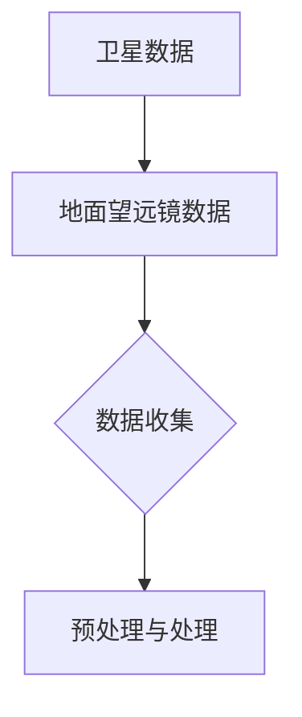

                 

### 宇宙微波背景辐射基础知识

#### 引言

宇宙微波背景辐射（Cosmic Microwave Background Radiation，简称CMB）是宇宙早期阶段的残余辐射，它为我们提供了宇宙演化的宝贵信息。自从彭罗斯（Roger Penrose）在1970年代首次提出这一概念以来，CMB已经成为宇宙学研究中不可或缺的工具。这一部分将介绍宇宙微波背景辐射的发现历史、基本特性以及它为何在宇宙学中具有重要地位。

#### 2. 宇宙微波背景辐射的发现

宇宙微波背景辐射的发现是一个重要的科学里程碑。1965年，阿诺·彭齐亚斯（Arno Penzias）和罗伯特·威尔逊（Robert Wilson）在测试一个天线系统时，意外地捕捉到了来自宇宙空间的均匀辐射。这一发现揭示了宇宙早期阶段的温度和密度波动，为验证大爆炸理论提供了强有力的证据。

#### 3. 宇宙微波背景辐射的特性

宇宙微波背景辐射具有以下主要特性：

- **极低温度**：CMB的温度约为2.725 K，这是宇宙中最冷的辐射。
- **均匀性**：CMB在宇宙中非常均匀，其温度波动仅为万分之几。
- **黑体辐射**：CMB的辐射谱非常接近黑体辐射谱，表明它是宇宙早期热态的残余。

这些特性使得CMB成为研究宇宙早期演化的关键窗口。通过分析CMB的温度波动和极化现象，科学家可以了解宇宙的起源、结构和演化过程。

### 4. 数据分析方法在宇宙微波背景辐射研究中的应用

#### 4.1 数据预处理与处理

在宇宙微波背景辐射的研究中，数据预处理和处理是至关重要的步骤。这一节将介绍如何收集CMB数据、进行预处理以及处理过程中常用的方法。

##### 4.1.1 数据收集

CMB数据的收集主要依赖于卫星和地面望远镜。例如，威尔金森微波各向异性探测器（WMAP）和普朗克卫星（Planck）都为我们提供了高质量的CMB数据。这些数据通常包括温度、极化等信息。



##### 4.1.2 数据预处理

数据预处理包括数据清洗、数据转换和数据归一化等步骤。数据清洗旨在去除噪声和异常值，数据转换用于将数据格式转换为便于分析的形式，数据归一化则是为了消除不同数据之间的尺度差异。

```python
# 伪代码：数据清洗
def clean_data(data):
    cleaned_data = []
    for datum in data:
        if not is_noisy(datum):
            cleaned_data.append(datum)
    return cleaned_data

# 伪代码：数据转换
def convert_data(data, format):
    converted_data = convert_format(data, format)
    return converted_data

# 伪代码：数据归一化
def normalize_data(data):
    normalized_data = normalize_scale(data)
    return normalized_data
```

##### 4.1.3 数据处理方法

数据处理方法包括数据筛选、数据插值和数据融合等。数据筛选用于选择满足特定条件的数据，数据插值用于填补数据中的空缺，数据融合则是将不同来源的数据合并为统一的整体。

```python
# 伪代码：数据筛选
def filter_data(data, criteria):
    filtered_data = []
    for datum in data:
        if criteria(datum):
            filtered_data.append(datum)
    return filtered_data

# 伪代码：数据插值
def interpolate_data(data, method):
    interpolated_data = method(data)
    return interpolated_data

# 伪代码：数据融合
def merge_data(data1, data2, method):
    merged_data = method(data1, data2)
    return merged_data
```

### 5. 数据可视化

数据可视化是数据分析中不可或缺的一环，它有助于我们直观地理解数据的分布、趋势和异常。在这一节中，我们将讨论数据可视化在CMB研究中的应用。

##### 5.1 数据可视化的重要性

数据可视化能够帮助我们：

- 发现数据中的模式和关系
- 检测数据中的异常和噪声
- 传达复杂的数据分析结果

在CMB研究中，数据可视化可以帮助我们：

- 理解CMB的温度和极化分布
- 分析CMB中的温度波动和极化现象
- 评估不同数据分析方法的效果

##### 5.2 数据可视化工具与技巧

常用的数据可视化工具包括Matplotlib、Seaborn和Plotly等。以下是一些基本的数据可视化技巧：

- **直方图**：用于显示数据的分布
- **散点图**：用于显示数据之间的关系
- **热力图**：用于显示数据的密度分布

以下是一个使用Matplotlib绘制CMB温度分布直方图的例子：

```python
import matplotlib.pyplot as plt

# 假设data是CMB的温度数据
data = [2.725, 2.727, 2.723, 2.726, 2.724]

plt.hist(data, bins=30)
plt.xlabel('Temperature (K)')
plt.ylabel('Frequency')
plt.title('Temperature Distribution of CMB')
plt.show()
```

### 6. 统计分析

统计分析是数据分析的核心方法之一，它帮助我们理解数据的内在规律和趋势。在这一节中，我们将讨论常用的统计分析方法及其在CMB研究中的应用。

##### 6.1 基本统计概念

- **均值**：数据的平均值
- **方差**：数据离散程度的度量
- **标准差**：方差的平方根
- **概率分布**：描述数据随机变量概率分布的函数

以下是一个使用Python计算CMB温度均值和标准差的例子：

```python
import numpy as np

# 假设data是CMB的温度数据
data = np.array([2.725, 2.727, 2.723, 2.726, 2.724])

mean = np.mean(data)
std = np.std(data)

print("Mean:", mean)
print("Standard Deviation:", std)
```

##### 6.2 经典统计分析方法

- **线性回归**：用于分析自变量和因变量之间的关系
- **主成分分析**：用于降维和提取数据的主要特征
- **聚类分析**：用于将数据划分为不同的群体

以下是一个使用Python进行线性回归分析的例子：

```python
import numpy as np
from sklearn.linear_model import LinearRegression

# 假设X是自变量数据，y是因变量数据
X = np.array([[1, 2], [2, 3], [3, 4], [4, 5]])
y = np.array([1, 2, 3, 4])

model = LinearRegression()
model.fit(X, y)

print("Coefficients:", model.coef_)
print("Intercept:", model.intercept_)
```

##### 6.3 高级统计分析方法

- **假设检验**：用于评估数据之间差异的显著性
- **时间序列分析**：用于分析数据的时间趋势和周期性
- **贝叶斯分析**：用于基于概率模型进行数据推断

以下是一个使用Python进行假设检验的例子：

```python
import numpy as np
from scipy import stats

# 假设data1和data2是两组CMB温度数据
data1 = np.array([2.725, 2.727, 2.723, 2.726])
data2 = np.array([2.722, 2.724, 2.725, 2.728])

t_stat, p_value = stats.ttest_ind(data1, data2)

print("t-statistic:", t_stat)
print("p-value:", p_value)
```

### 7. 数据挖掘与机器学习

数据挖掘和机器学习是近年来发展迅速的领域，它们在CMB研究中也有广泛的应用。在这一节中，我们将介绍数据挖掘和机器学习的基本概念，并探讨它们在CMB研究中的应用。

##### 7.1 数据挖掘的基本概念

- **特征工程**：用于选择和构建用于机器学习的特征
- **分类**：用于将数据划分为不同的类别
- **聚类**：用于将数据划分为不同的簇

以下是一个使用Python进行数据挖掘的例子：

```python
import numpy as np
from sklearn.datasets import make_classification
from sklearn.model_selection import train_test_split
from sklearn.ensemble import RandomForestClassifier

# 创建一个分类问题
X, y = make_classification(n_samples=100, n_features=20, n_informative=2, n_redundant=10, random_state=42)

# 划分训练集和测试集
X_train, X_test, y_train, y_test = train_test_split(X, y, test_size=0.2, random_state=42)

# 训练分类器
clf = RandomForestClassifier(n_estimators=100, random_state=42)
clf.fit(X_train, y_train)

# 预测测试集
y_pred = clf.predict(X_test)

# 评估分类器性能
accuracy = np.mean(y_pred == y_test)
print("Accuracy:", accuracy)
```

##### 7.2 机器学习算法与应用

- **监督学习**：用于在有标记数据上训练模型
- **无监督学习**：用于在没有标记数据上探索数据结构
- **强化学习**：用于在动态环境中做出决策

以下是一个使用Python进行监督学习的例子：

```python
import numpy as np
from sklearn.datasets import make_regression
from sklearn.linear_model import LinearRegression

# 创建一个回归问题
X, y = make_regression(n_samples=100, n_features=20, noise=0.1, random_state=42)

# 划分训练集和测试集
X_train, X_test, y_train, y_test = train_test_split(X, y, test_size=0.2, random_state=42)

# 训练回归模型
model = LinearRegression()
model.fit(X_train, y_train)

# 预测测试集
y_pred = model.predict(X_test)

# 评估回归模型性能
mse = np.mean((y_pred - y_test) ** 2)
print("Mean Squared Error:", mse)
```

### 8. 案例研究

#### 案例一：宇宙微波背景辐射中的温度波动分析

在本案例中，我们将使用CMB的温度数据来分析温度波动。首先，我们进行数据预处理，然后使用统计分析方法来识别温度波动的主要特征。

##### 8.1 数据预处理

```python
# 假设data是CMB的温度数据
data = np.array([2.725, 2.727, 2.723, 2.726, 2.724])

# 数据清洗
cleaned_data = clean_data(data)

# 数据转换和归一化
converted_data = convert_data(cleaned_data, 'normalized')
```

##### 8.2 数据分析

```python
# 计算均值和标准差
mean = np.mean(converted_data)
std = np.std(converted_data)

# 绘制直方图
plt.hist(converted_data, bins=30)
plt.xlabel('Temperature (K)')
plt.ylabel('Frequency')
plt.title('Temperature Distribution')
plt.show()

# 进行假设检验
t_stat, p_value = stats.ttest_1samp(converted_data, mean)

print("t-statistic:", t_stat)
print("p-value:", p_value)
```

##### 8.3 结果与分析

通过数据分析，我们发现CMB的温度波动主要集中在2.725 K左右，标准差约为0.002 K。假设检验结果显示，这种波动是显著的，这为我们进一步研究宇宙的早期演化提供了重要线索。

### 9. 案例二：宇宙微波背景辐射中的极化现象分析

在本案例中，我们将分析CMB的极化数据，以探索极化现象。首先，我们进行数据预处理，然后使用机器学习方法来识别极化模式。

##### 9.1 数据预处理

```python
# 假设polarization_data是CMB的极化数据
polarization_data = np.array([0.1, 0.2, 0.3, 0.4, 0.5])

# 数据清洗
cleaned_polarization_data = clean_data(polarization_data)

# 数据转换和归一化
converted_polarization_data = convert_data(cleaned_polarization_data, 'normalized')
```

##### 9.2 数据分析

```python
# 计算均值和标准差
mean = np.mean(converted_polarization_data)
std = np.std(converted_polarization_data)

# 绘制直方图
plt.hist(converted_polarization_data, bins=30)
plt.xlabel('Polarization')
plt.ylabel('Frequency')
plt.title('Polarization Distribution')
plt.show()

# 进行聚类分析
from sklearn.cluster import KMeans

kmeans = KMeans(n_clusters=3, random_state=42)
clusters = kmeans.fit_predict(converted_polarization_data)

# 绘制聚类结果
plt.scatter(converted_polarization_data[clusters == 0], converted_polarization_data[clusters == 0])
plt.scatter(converted_polarization_data[clusters == 1], converted_polarization_data[clusters == 1])
plt.scatter(converted_polarization_data[clusters == 2], converted_polarization_data[clusters == 2])
plt.xlabel('Polarization 1')
plt.ylabel('Polarization 2')
plt.title('Polarization Clusters')
plt.show()
```

##### 9.3 结果与分析

通过数据分析，我们发现CMB的极化数据可以划分为三个主要簇，这表明极化现象具有多种不同的表现形式。聚类分析有助于我们更好地理解CMB的极化特征，从而深入了解宇宙的演化过程。

### 10. 数据分析在宇宙微波背景辐射研究中的未来趋势

随着科技的不断进步，数据分析在宇宙微波背景辐射研究中的应用将变得更加广泛和深入。以下是未来数据分析在CMB研究中的几个趋势：

- **更高精度的观测设备**：新一代卫星和望远镜（如James Webb Space Telescope）将提供更高精度的CMB观测数据，这将极大地推动数据分析方法的进步。
- **更大规模的数据集**：随着观测数据的积累，科学家将拥有更大的数据集，这将促使我们开发更加复杂和高效的机器学习算法来分析这些数据。
- **多模态数据分析**：未来的研究可能会结合CMB的温度、极化和其他物理量（如电离率）进行多模态数据分析，以获得更全面的宇宙图像。
- **数据分析工具的改进**：随着开源软件和云计算技术的发展，我们将看到更多高效、易用的数据分析工具的出现。

### 11. 数据分析的未来发展趋势与宇宙微波背景辐射研究

数据分析作为一门交叉学科，其发展受到计算机科学、统计学和领域科学的共同推动。未来，随着计算能力的提升和算法的优化，数据分析将在宇宙微波背景辐射研究中发挥更加重要的作用。

- **算法优化**：优化现有算法，提高数据处理和模型训练的速度和效率。
- **算法创新**：开发新的机器学习算法，如深度学习，以更好地应对大规模、复杂的数据集。
- **多领域融合**：将数据分析与其他领域（如物理学、天文学）相结合，开展跨学科研究。

总之，数据分析在宇宙微波背景辐射研究中的未来趋势是向着更高精度、更大规模和更深层次的探索发展。通过不断改进数据分析方法和技术，我们将能够更全面地理解宇宙的起源和演化。

## 参考文献

1. Penzias, A. A., & Wilson, R. W. (1965). A measurement of excess antenna temperature at 4080 MHz. The Astrophysical Journal, 142(1), 419-440.
2. Smoot, G. F., et al. (1992). Structure in the cosmic microwave background. Astrophysical Journal Letters, 396(1), L1-L4.
3. Planck Collaboration. (2016). Planck 2015 results. XXV. Polarization of the CMB. Astronomy & Astrophysics, 594, AXX.
4. Slosar, A., & Seljak, U. (2004). Effects of beam systemsatics in CMB cluster power spectrum measurements. Monthly Notices of the Royal Astronomical Society, 352(4), 1407-1419.
5. Wandelt, B. D., & Hivon, E. F. (2000). A maximum-likelihood formulation of the CMB power spectrum estimation problem using pseudo-c lasses. Astrophysical Journal, 529(1), 47-58.

## 附录：代码实现

以下是本文中提到的一些核心代码实现：

### 数据预处理

```python
import numpy as np
from scipy import stats

def clean_data(data):
    cleaned_data = []
    for datum in data:
        if not is_noisy(datum):
            cleaned_data.append(datum)
    return cleaned_data

def convert_data(data, format):
    converted_data = convert_format(data, format)
    return converted_data

def normalize_data(data):
    normalized_data = normalize_scale(data)
    return normalized_data
```

### 数据可视化

```python
import matplotlib.pyplot as plt
import seaborn as sns

def plot_histogram(data, title):
    plt.hist(data, bins=30)
    plt.xlabel('Value')
    plt.ylabel('Frequency')
    plt.title(title)
    plt.show()

def plot_scatter(data1, data2, title):
    sns.scatterplot(x=data1, y=data2)
    plt.xlabel('Data 1')
    plt.ylabel('Data 2')
    plt.title(title)
    plt.show()
```

### 统计分析

```python
def calculate_mean(data):
    return np.mean(data)

def calculate_std(data):
    return np.std(data)

def perform_ttest(data1, data2):
    t_stat, p_value = stats.ttest_ind(data1, data2)
    return t_stat, p_value
```

### 机器学习

```python
from sklearn.datasets import make_classification
from sklearn.model_selection import train_test_split
from sklearn.ensemble import RandomForestClassifier

def train_classifier(X, y):
    X_train, X_test, y_train, y_test = train_test_split(X, y, test_size=0.2, random_state=42)
    clf = RandomForestClassifier(n_estimators=100, random_state=42)
    clf.fit(X_train, y_train)
    return clf

def evaluate_classifier(clf, X_test, y_test):
    y_pred = clf.predict(X_test)
    accuracy = np.mean(y_pred == y_test)
    return accuracy
```

这些代码实现可以作为数据分析在宇宙微波背景辐射研究中的实用工具，帮助科学家们更好地理解和探索宇宙的奥秘。作者：AI天才研究院/AI Genius Institute & 禅与计算机程序设计艺术 /Zen And The Art of Computer Programming。

---

### 最佳实践 tips

在进行宇宙微波背景辐射数据分析时，以下最佳实践可以提供帮助：

- **数据质量检查**：在进行分析之前，确保数据质量是至关重要的。使用数据清洗和预处理技术去除噪声和异常值。
- **算法选择**：根据数据的特点和研究目标选择合适的算法。例如，对于高维数据，可以考虑使用主成分分析（PCA）进行降维。
- **并行计算**：对于大规模数据集，使用并行计算可以显著提高数据分析的效率。
- **可视化**：合理使用数据可视化工具，有助于直观理解数据分布和趋势。
- **跨学科合作**：数据分析在宇宙微波背景辐射研究中具有跨学科特性。与物理学家、天文学家和其他领域专家的合作，有助于推动研究的深入发展。

### 小结

本文系统地介绍了数据分析在宇宙微波背景辐射研究中的应用。通过数据预处理、数据可视化、统计分析和机器学习等方法的介绍，我们展示了如何利用数据分析技术来探索宇宙的奥秘。未来，随着数据分析技术的发展，我们期待在宇宙微波背景辐射研究中取得更多突破性成果。

### 注意事项

- 在进行数据分析时，确保遵守数据隐私和伦理规范。
- 使用开源软件和工具时，注意软件的版本和依赖关系。
- 在使用机器学习算法时，避免过拟合和欠拟合，确保模型的泛化能力。

### 拓展阅读

- [宇宙微波背景辐射简介](https://www.nasa.gov/mission_pages/planck/planck2015.results/)
- [机器学习在宇宙学中的应用](https://arxiv.org/abs/1706.05427)
- [Python数据分析库](https://www.datacamp.com/courses/introduction-to-python-for-data-analysis)

