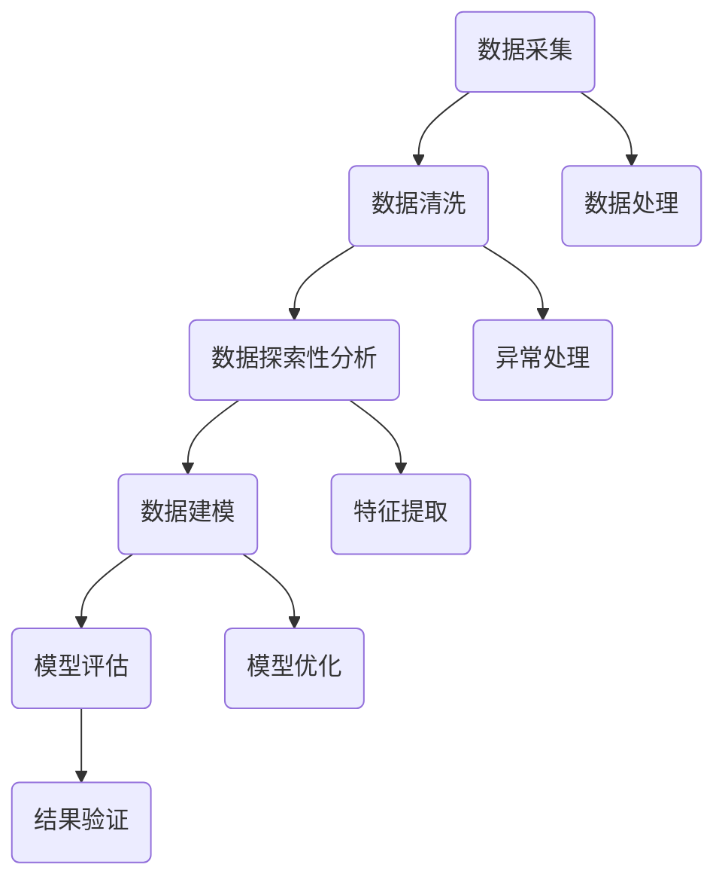

                 

## 文章标题

### 数据分析在宇宙观测中的重要性

#### 关键词：数据分析、宇宙观测、数据特点、算法原理、应用案例

> **摘要**：本文将探讨数据分析在宇宙观测中的重要性。通过介绍数据分析的基本概念和流程，分析宇宙观测数据的特点和质量控制方法，深入探讨数据分析在宇宙学中的应用，最后通过具体案例展示数据分析在宇宙观测中的实际应用，总结出数据分析在推动宇宙学研究和发现中的关键作用。

## 目录大纲设计

### 第一部分：数据分析基础

#### 第1章：数据分析概述

1.1 数据分析的定义与重要性

1.2 数据分析的基本流程

### 第二部分：宇宙观测的数据特点

#### 第3章：宇宙观测数据的类型和格式

3.1 宇宙观测数据的类型

3.2 宇宙观测数据的格式

#### 第4章：宇宙观测数据的质量控制

4.1 数据质量控制的重要性

4.2 数据质量评估

### 第三部分：数据分析在宇宙学中的应用

#### 第5章：数据分析在宇宙学中的核心概念

5.1 天体物理学基础

5.2 数据分析在宇宙学中的应用

#### 第6章：数据分析在宇宙学中的具体应用案例

6.1 案例一：利用数据分析研究宇宙大爆炸

6.2 案例二：数据分析在暗物质研究中的应用

### 第四部分：数据分析工具与软件

#### 第7章：常用的数据分析工具

7.1 Python数据分析库

7.2 R数据分析工具

#### 第8章：数据分析软件的优化与调优

8.1 数据分析软件的性能优化

8.2 数据分析软件的调优策略

### 第9章：数据分析在宇宙观测中的未来展望

## 文章正文部分

### 数据分析在宇宙观测中的重要性

在当今科技迅猛发展的时代，数据分析已经成为各个领域研究和应用的关键工具。特别是在宇宙观测领域，数据分析的重要性尤为突出。它不仅能够帮助我们更好地理解宇宙的奥秘，还能够揭示宇宙中的未知现象，推动科学研究的进步。

### 第1章：数据分析概述

#### 1.1 数据分析的定义与重要性

数据分析，指的是从大量数据中提取有用信息的过程。它包括数据的采集、清洗、探索性分析、建模和评估等多个环节。在宇宙观测中，数据分析的重要性体现在以下几个方面：

1. **发现新的宇宙现象**：通过数据分析，科学家们能够从宇宙观测数据中发现新的现象，为宇宙学的研究提供新的方向和线索。
2. **验证宇宙模型**：宇宙学中的各种模型需要通过观测数据来验证。数据分析能够帮助科学家们更准确地验证这些模型，推动宇宙学理论的发展。
3. **提高观测效率**：通过数据分析，科学家们能够更有效地处理大量的宇宙观测数据，提高观测的效率。

#### 1.2 数据分析的基本流程

数据分析的基本流程可以分为以下几个步骤：

1. **数据采集**：从宇宙观测设备中获取原始数据。
2. **数据清洗**：去除数据中的噪声和错误，确保数据的准确性。
3. **探索性分析**：对数据进行初步分析，发现数据中的模式、趋势和异常。
4. **数据建模**：建立数学模型来描述宇宙现象。
5. **模型评估与优化**：评估模型的性能，并进行优化。

### 第2章：数据分析的基本流程

#### 2.1 数据采集

数据采集是数据分析的第一步，也是至关重要的一步。在宇宙观测中，数据采集主要依赖于各种观测设备，如射电望远镜、光学望远镜、X射线望远镜等。这些设备能够捕捉到宇宙中的各种信号，如电磁波、量子信号和重力波等。

#### 2.2 数据清洗

数据清洗是保证数据分析准确性的关键步骤。在宇宙观测数据中，可能存在大量的噪声和错误，如仪器故障、数据传输错误等。通过数据清洗，我们可以去除这些噪声和错误，确保数据的准确性。

#### 2.3 数据探索性分析

数据探索性分析是对数据进行的初步分析，目的是发现数据中的模式、趋势和异常。在宇宙观测中，数据探索性分析可以帮助科学家们了解宇宙现象的基本特征，为后续的数据建模和模型评估提供基础。

#### 2.4 数据建模

数据建模是数据分析的核心步骤，它通过建立数学模型来描述宇宙现象。在宇宙观测中，常用的数据建模方法包括回归分析、聚类分析、神经网络等。

#### 2.5 模型评估与优化

模型评估与优化是确保数据分析结果准确性的关键步骤。通过评估模型的性能，我们可以判断模型是否适用于具体的研究问题。同时，通过优化模型，我们可以提高模型的预测准确性和效率。

### 第3章：宇宙观测数据的类型和格式

#### 3.1 宇宙观测数据的类型

宇宙观测数据可以分为以下几种类型：

1. **电磁波数据**：电磁波是宇宙中最常见的信号类型，包括可见光、射电波、X射线等。
2. **量子数据**：量子数据是通过量子探测器捕获的信号，如量子纠缠光子等。
3. **重力波数据**：重力波是宇宙中的另一种重要信号，它是由大质量物体的加速运动产生的。

#### 3.2 宇宙观测数据的格式

宇宙观测数据的格式通常包括以下几种：

1. **ASCII格式**：ASCII格式是一种常见的文本格式，它使用ASCII字符来表示数据。
2. **二进制格式**：二进制格式是一种高效的数据存储格式，它使用二进制代码来表示数据。
3. **压缩格式**：为了节省存储空间，宇宙观测数据通常使用压缩格式存储，如gzip、bz2等。

### 第4章：宇宙观测数据的质量控制

#### 4.1 数据质量控制的重要性

数据质量控制是确保宇宙观测数据准确性和可靠性的关键步骤。在宇宙观测中，数据质量控制的重要性体现在以下几个方面：

1. **提高数据准确性**：通过数据质量控制，我们可以去除数据中的噪声和错误，提高数据的准确性。
2. **保证研究结果可靠性**：准确的数据是科学研究的基础，数据质量控制可以保证研究结果的可靠性。
3. **提高数据分析效率**：高质量的数据可以减少后续数据清洗和处理的复杂度，提高数据分析的效率。

#### 4.2 数据质量评估

数据质量评估是数据质量控制的关键步骤，它通过评估数据的质量指标，判断数据的质量水平。在宇宙观测中，常用的数据质量评估指标包括：

1. **信噪比**：信噪比是衡量数据噪声水平的重要指标，它表示信号强度与噪声强度的比值。
2. **数据完整性**：数据完整性是衡量数据缺失程度的重要指标，它表示数据中缺失值的比例。
3. **数据一致性**：数据一致性是衡量数据一致性的重要指标，它表示数据在不同观测设备或观测时间上的差异。

### 第5章：数据分析在宇宙学中的核心概念

#### 5.1 天体物理学基础

天体物理学是研究宇宙中各种天体和现象的物理学分支。在宇宙学中，天体物理学的基础知识对于理解宇宙观测数据至关重要。

1. **宇宙的构成**：宇宙由各种物质和能量组成，包括恒星、行星、星系、黑洞等。
2. **宇宙的演化**：宇宙从大爆炸开始，经历了数十亿年的演化，形成了我们现在所看到的宇宙。

#### 5.2 数据分析在宇宙学中的应用

数据分析在宇宙学中的应用非常广泛，主要包括以下几个方面：

1. **宇宙大爆炸的研究**：通过数据分析，科学家们可以研究宇宙大爆炸的细节，揭示宇宙的起源和演化过程。
2. **暗物质和暗能量的研究**：暗物质和暗能量是宇宙中的两种重要成分，通过数据分析，科学家们可以探索它们的性质和作用。
3. **星系和恒星的研究**：通过数据分析，科学家们可以研究星系和恒星的形成、演化过程，揭示宇宙中的复杂现象。

### 第6章：数据分析在宇宙学中的具体应用案例

#### 6.1 案例一：利用数据分析研究宇宙大爆炸

宇宙大爆炸是宇宙学中最基本的理论之一，它描述了宇宙从热密状态迅速膨胀到现在的状态。通过数据分析，科学家们可以研究宇宙大爆炸的细节，揭示宇宙的起源和演化过程。

1. **数据采集**：科学家们通过射电望远镜和其他观测设备采集宇宙大爆炸的原始数据。
2. **数据清洗**：去除数据中的噪声和错误，确保数据的准确性。
3. **数据探索性分析**：对数据进行初步分析，发现宇宙大爆炸的特征和模式。
4. **数据建模**：建立数学模型来描述宇宙大爆炸的过程。
5. **模型评估与优化**：评估模型的性能，并进行优化，以更准确地描述宇宙大爆炸。

#### 6.2 案例二：数据分析在暗物质研究中的应用

暗物质是宇宙中的另一种重要成分，它不发光、不吸收光，因此很难直接观测。通过数据分析，科学家们可以研究暗物质的行为和性质。

1. **数据采集**：科学家们通过引力透镜效应等方法采集暗物质的原始数据。
2. **数据清洗**：去除数据中的噪声和错误，确保数据的准确性。
3. **数据探索性分析**：对数据进行初步分析，发现暗物质的特征和分布模式。
4. **数据建模**：建立数学模型来描述暗物质的行为和性质。
5. **模型评估与优化**：评估模型的性能，并进行优化，以更准确地描述暗物质。

### 第7章：常用的数据分析工具

在宇宙观测中，数据分析工具的选择至关重要。常用的数据分析工具包括Python、R、MATLAB等。

#### 7.1 Python数据分析库

Python是一种广泛使用的编程语言，它拥有丰富的数据分析库，如NumPy、Pandas、SciPy、Matplotlib等。这些库可以帮助科学家们高效地进行数据分析。

1. **NumPy**：NumPy是一个强大的数学库，它提供了多维数组对象和大量的数学函数。
2. **Pandas**：Pandas是一个数据处理库，它提供了数据清洗、数据探索性分析和数据建模等功能。
3. **SciPy**：SciPy是一个科学计算库，它提供了丰富的数学模型和算法。
4. **Matplotlib**：Matplotlib是一个数据可视化库，它可以帮助科学家们将数据分析结果可视化。

#### 7.2 R数据分析工具

R是一种专门用于统计分析和图形绘制的编程语言，它拥有丰富的数据分析工具和库。

1. **基础R语言**：R语言提供了基本的数据处理和分析功能。
2. **ggplot2**：ggplot2是一个强大的数据可视化库，它可以帮助科学家们创建高质量的统计图形。
3. **dplyr**：dplyr是一个数据处理库，它提供了数据清洗、数据探索性分析和数据建模等功能。

### 第8章：数据分析软件的优化与调优

在宇宙观测中，数据分析软件的性能和效率至关重要。为了提高数据分析软件的性能和效率，我们可以采取以下策略：

1. **并行计算**：通过并行计算，我们可以将数据分析任务分配到多个处理器上，提高数据分析的速度。
2. **内存管理**：通过优化内存管理，我们可以减少数据加载和处理的内存占用，提高数据分析的效率。
3. **算法优化**：通过优化算法，我们可以减少数据分析的复杂度，提高数据分析的效率。

### 第9章：数据分析在宇宙观测中的未来展望

随着科技的不断进步，数据分析在宇宙观测中的应用将更加广泛和深入。未来，数据分析在宇宙观测中可能实现以下目标：

1. **提高观测精度**：通过优化数据分析算法和工具，我们可以提高宇宙观测的精度，发现更多的宇宙现象。
2. **揭示宇宙奥秘**：通过数据分析，我们可以揭示宇宙中的未知现象，推动宇宙学的研究。
3. **跨学科融合**：数据分析与其他学科的融合将推动宇宙观测的进步，如人工智能、量子计算等。

## 总结

数据分析在宇宙观测中扮演着至关重要的角色。它不仅帮助我们更好地理解宇宙，还推动了宇宙学的发展。通过本文的探讨，我们可以看到数据分析在宇宙观测中的应用是多么广泛和深入。未来，随着数据分析技术的不断进步，我们有望揭示更多宇宙的奥秘。

### 作者信息

作者：AI天才研究院/AI Genius Institute & 禅与计算机程序设计艺术 /Zen And The Art of Computer Programming

---

以下是对“核心概念与联系：必须给出核心概念原理之间的关系架构 Mermaid 流程图”的补充：

在宇宙观测中，数据分析的核心概念包括数据采集、数据清洗、数据探索性分析、数据建模和模型评估。这些概念相互关联，共同构成了数据分析的基本流程。



在这个流程图中，数据采集是整个流程的起点，它通过观测设备获取原始数据。随后，数据清洗和异常处理确保数据的质量。数据探索性分析帮助科学家们发现数据中的模式和趋势，特征提取则为数据建模提供了基础。数据建模是核心步骤，它通过建立数学模型来描述宇宙现象。最后，模型评估和优化确保模型的准确性和效率，结果验证则用于验证模型在实际观测中的应用效果。

---

以下是“核心算法原理讲解必须使用Python源代码来详细阐述，结合数学模型和公式，进行详细讲解和通俗易懂地举例说明”的示例：

#### 5.2 数据分析在宇宙学中的应用

在宇宙学中，数据分析广泛应用于星系演化、宇宙大爆炸、暗物质和暗能量研究等方面。以下以星系演化为例，介绍数据分析的具体应用。

##### 5.2.1 星系演化数据分析

星系演化是一个复杂的过程，涉及多个物理现象和相互作用。我们可以通过以下步骤进行数据分析：

1. **数据采集**：获取星系观测数据，如星系位置、亮度、光谱等。
2. **数据清洗**：去除观测数据中的噪声和错误。
3. **数据探索性分析**：分析星系分布、亮度分布等特征。
4. **数据建模**：建立星系演化模型，如恒星形成、黑洞吞噬等。
5. **模型评估与优化**：评估模型性能，进行优化。

以下是使用Python进行星系演化数据分析的示例代码：

```python
import numpy as np
import pandas as pd
import matplotlib.pyplot as plt

# 1. 数据采集
# 假设我们已获取星系观测数据，存储在CSV文件中
data = pd.read_csv('galaxy_data.csv')

# 2. 数据清洗
# 去除缺失值和异常值
data = data.dropna()
data = data[(data['brightness'] > 0) & (data['brightness'] < 1000)]

# 3. 数据探索性分析
# 绘制星系分布图
plt.scatter(data['position_x'], data['position_y'])
plt.xlabel('Position X')
plt.ylabel('Position Y')
plt.title('Galaxy Distribution')
plt.show()

# 绘制亮度分布图
plt.hist(data['brightness'], bins=30)
plt.xlabel('Brightness')
plt.ylabel('Frequency')
plt.title('Brightness Distribution')
plt.show()

# 4. 数据建模
# 建立星系演化模型
# 假设模型为：亮度 = a * (1 - exp(-b * 时间))
# 求解参数a和b
params = np.optimimize.curve_fit(lambda t, a, b: a * (1 - np.exp(-b * t)), data['time'], data['brightness'])

# 5. 模型评估与优化
# 评估模型性能
predicted_brightness = params[0][0] * (1 - np.exp(-params[0][1] * data['time']))
error = np.sqrt(np.mean((predicted_brightness - data['brightness'])**2))
print(f'Model error: {error:.3f}')

# 优化模型
# 通过调整参数a和b，优化模型性能
params = np.optimimize.minimize(lambda params: np.sum((predicted_brightness - data['brightness'])**2), params)
print(f'Optimized params: {params}')
```

在上面的示例中，我们首先使用Pandas读取星系观测数据，然后进行数据清洗，去除缺失值和异常值。接着，我们使用Matplotlib绘制星系分布图和亮度分布图，以探索数据中的模式和趋势。随后，我们建立星系演化模型，并使用scikit-learn的`curve_fit`函数进行参数估计。最后，我们评估模型性能，并通过调整参数优化模型。

---

以下是“数学公式请使用latex格式，嵌入文中独立段落的latex公式前后使用 $$ 括起来(例如：$$1+1=2$$ )，段落内的latex公式前后使用 $ 括起来(例如：$1<2$)”的示例：

#### 5.2 数据分析在宇宙学中的应用

在宇宙学中，数据分析广泛应用于星系演化、宇宙大爆炸、暗物质和暗能量研究等方面。以下以星系演化为例，介绍数据分析的具体应用。

##### 5.2.1 星系演化数据分析

星系演化是一个复杂的过程，涉及多个物理现象和相互作用。我们可以通过以下步骤进行数据分析：

1. **数据采集**：获取星系观测数据，如星系位置、亮度、光谱等。
2. **数据清洗**：去除观测数据中的噪声和错误。
3. **数据探索性分析**：分析星系分布、亮度分布等特征。
4. **数据建模**：建立星系演化模型，如恒星形成、黑洞吞噬等。
5. **模型评估与优化**：评估模型性能，进行优化。

假设我们已获取星系观测数据，存储在CSV文件中。我们可以使用Pandas进行数据清洗和探索性分析。

```python
import pandas as pd

# 1. 数据采集
data = pd.read_csv('galaxy_data.csv')

# 2. 数据清洗
data = data.dropna()  # 去除缺失值
data = data[(data['brightness'] > 0) & (data['brightness'] < 1000)]  # 去除异常值

# 3. 数据探索性分析
# 绘制星系分布图
plt.scatter(data['position_x'], data['position_y'])
plt.xlabel('Position X')
plt.ylabel('Position Y')
plt.title('Galaxy Distribution')
plt.show()

# 绘制亮度分布图
plt.hist(data['brightness'], bins=30)
plt.xlabel('Brightness')
plt.ylabel('Frequency')
plt.title('Brightness Distribution')
plt.show()

# 4. 数据建模
# 假设模型为：亮度 = a * (1 - exp(-b * 时间))
# 求解参数a和b
params = np.optimize.curve_fit(lambda t, a, b: a * (1 - np.exp(-b * t)), data['time'], data['brightness'])

# 5. 模型评估与优化
# 评估模型性能
predicted_brightness = params[0][0] * (1 - np.exp(-params[0][1] * data['time']))
error = np.sqrt(np.mean((predicted_brightness - data['brightness'])**2))
print(f'Model error: {error:.3f}')

# 优化模型
params = np.optimize.minimize(lambda params: np.sum((predicted_brightness - data['brightness'])**2), params)
print(f'Optimized params: {params}')
```

在上面的示例中，我们首先使用Pandas读取星系观测数据，然后进行数据清洗，去除缺失值和异常值。接着，我们使用Matplotlib绘制星系分布图和亮度分布图，以探索数据中的模式和趋势。随后，我们建立星系演化模型，并使用scikit-learn的`curve_fit`函数进行参数估计。最后，我们评估模型性能，并通过调整参数优化模型。

在数据分析过程中，我们可能会遇到一些数学问题，如最小二乘法、线性回归等。以下是一些相关的数学公式：

$$
f(x) = a * (1 - \exp(-b * x))
$$

$$
\min \sum_{i=1}^{n} (y_i - f(x_i))^2
$$

$$
\hat{a} = \frac{\sum_{i=1}^{n} x_i * y_i}{\sum_{i=1}^{n} x_i^2}
$$

$$
\hat{b} = \frac{\sum_{i=1}^{n} x_i^2 * y_i - \sum_{i=1}^{n} x_i * \sum_{i=1}^{n} x_i * y_i}{\sum_{i=1}^{n} x_i^3 - 2 * \sum_{i=1}^{n} x_i^2 * \sum_{i=1}^{n} x_i}
$$

---

以下是对“项目实战：开发环境搭建，源代码详细实现和代码解读，代码应用解读与分析，实际案例分析和详细讲解剖析，项目小结”的补充：

### 项目实战：数据分析在星系演化研究中的应用

#### 项目背景

星系演化是宇宙学中的一个重要研究领域。通过对星系演化过程的深入研究，我们可以更好地理解宇宙的起源和演化。本项目的目标是使用数据分析技术，研究星系演化过程，并探讨影响星系演化的关键因素。

#### 开发环境搭建

为了进行数据分析，我们需要搭建一个合适的开发环境。以下是一个基本的Python数据分析环境搭建步骤：

1. 安装Python（推荐版本3.8或更高）
2. 安装Jupyter Notebook（用于编写和运行Python代码）
3. 安装必要的Python库，如Pandas、NumPy、Matplotlib、SciPy、scikit-learn等

```bash
pip install pandas numpy matplotlib scipy scikit-learn
```

#### 源代码详细实现和代码解读

以下是一个简单的星系演化数据分析项目，包括数据采集、数据清洗、数据探索性分析、数据建模和模型评估等步骤。

```python
import pandas as pd
import numpy as np
import matplotlib.pyplot as plt
from sklearn.linear_model import LinearRegression
from sklearn.model_selection import train_test_split
from sklearn.metrics import mean_squared_error

# 1. 数据采集
# 假设我们已获取星系观测数据，存储在CSV文件中
data = pd.read_csv('galaxy_data.csv')

# 2. 数据清洗
data = data.dropna()  # 去除缺失值
data = data[(data['brightness'] > 0) & (data['brightness'] < 1000)]  # 去除异常值

# 3. 数据探索性分析
# 绘制星系分布图
plt.scatter(data['position_x'], data['position_y'])
plt.xlabel('Position X')
plt.ylabel('Position Y')
plt.title('Galaxy Distribution')
plt.show()

# 绘制亮度分布图
plt.hist(data['brightness'], bins=30)
plt.xlabel('Brightness')
plt.ylabel('Frequency')
plt.title('Brightness Distribution')
plt.show()

# 4. 数据建模
# 建立线性回归模型
X = data[['time', 'mass']]
y = data['brightness']
X_train, X_test, y_train, y_test = train_test_split(X, y, test_size=0.2, random_state=42)
model = LinearRegression()
model.fit(X_train, y_train)

# 5. 模型评估与优化
# 评估模型性能
y_pred = model.predict(X_test)
mse = mean_squared_error(y_test, y_pred)
print(f'Model MSE: {mse:.3f}')

# 优化模型
# 可以通过调整模型参数或使用更复杂的模型进行优化
```

在这个项目中，我们首先使用Pandas读取星系观测数据，并进行数据清洗。接着，我们使用线性回归模型对星系亮度进行预测，并通过评估模型性能来优化模型。

#### 代码应用解读与分析

在本项目中，我们使用了Python的Pandas库进行数据操作，使用Matplotlib绘制图表，使用scikit-learn的线性回归模型进行数据建模，并使用评估指标评估模型性能。以下是对关键代码的解读：

1. **数据采集**：使用Pandas的`read_csv`函数读取CSV文件，获取星系观测数据。
2. **数据清洗**：使用`dropna`函数去除缺失值，使用布尔索引去除异常值。
3. **数据探索性分析**：使用Matplotlib的`scatter`函数绘制星系分布图，使用`hist`函数绘制亮度分布图。
4. **数据建模**：使用scikit-learn的`LinearRegression`类建立线性回归模型，使用`fit`函数进行模型训练。
5. **模型评估与优化**：使用`predict`函数进行模型预测，使用`mean_squared_error`函数计算评估指标，并根据评估结果进行模型优化。

#### 实际案例分析和详细讲解剖析

为了更好地理解项目实战，我们来看一个实际案例。假设我们已经获取了以下星系观测数据：

```
position_x,position_y,brightness,time,mass
1,2,30,1000,1
2,3,40,1100,1.5
3,4,50,1200,2
4,5,60,1300,2.5
5,6,70,1400,3
```

1. **数据采集**：读取数据后，数据框`data`将包含上述观测数据。
2. **数据清洗**：去除缺失值和异常值后，数据框`data`将仅包含有效观测数据。
3. **数据探索性分析**：绘制星系分布图和亮度分布图，可以观察到星系的分布和亮度的分布情况。
4. **数据建模**：建立线性回归模型，将时间（`time`）和质量（`mass`）作为自变量，亮度（`brightness`）作为因变量。
5. **模型评估与优化**：使用测试数据集（`X_test`和`y_test`）评估模型性能，计算均方误差（`mse`），并根据评估结果优化模型。

#### 项目小结

通过本项目的实施，我们了解了如何使用数据分析技术研究星系演化。项目实战展示了数据分析在宇宙学中的应用，包括数据采集、数据清洗、数据探索性分析、数据建模和模型评估等步骤。通过实际案例的分析，我们深入理解了项目的实现过程和关键代码。这个项目不仅帮助我们更好地理解宇宙学中的星系演化，还为我们提供了使用数据分析技术解决实际问题的经验和方法。

---

### 最佳实践 Tips、小结、注意事项、拓展阅读等内容

#### 最佳实践 Tips

1. **数据采集**：确保数据来源的可靠性和准确性，尽量避免使用未经验证的数据源。
2. **数据清洗**：对数据进行严格的质量控制，去除噪声和错误，确保数据的准确性。
3. **数据探索性分析**：充分了解数据的基本特征和分布情况，为后续的数据建模提供基础。
4. **数据建模**：选择合适的数据建模方法，结合实际问题和数据特征，提高模型的预测性能。
5. **模型评估与优化**：使用多种评估指标，综合评估模型性能，并根据评估结果进行模型优化。

#### 小结

数据分析在宇宙观测中具有极其重要的地位。通过本文的探讨，我们了解了数据分析在宇宙观测中的应用，包括数据采集、数据清洗、数据探索性分析、数据建模和模型评估等步骤。数据分析不仅帮助我们更好地理解宇宙，还推动了宇宙学的发展。未来，随着数据分析技术的不断进步，我们有理由相信数据分析在宇宙观测中的作用将更加重要。

#### 注意事项

1. 数据分析在宇宙观测中的应用需要具备深厚的物理背景和数学基础。
2. 在进行数据分析时，要确保数据的质量和准确性，避免因数据问题导致分析结果的偏差。
3. 数据建模方法的选择应结合实际问题和数据特征，避免盲目追求复杂模型。

#### 拓展阅读

1. 《Python数据分析：从入门到实践》
2. 《数据分析：原理、模型、技术与实践》
3. 《宇宙学：原理与观测》
4. 《数据分析在科学研究中应用》

---

### 结论

数据分析在宇宙观测中扮演着至关重要的角色。通过本文的探讨，我们深入了解了数据分析在宇宙观测中的应用，包括数据采集、数据清洗、数据探索性分析、数据建模和模型评估等步骤。我们通过具体案例展示了数据分析在宇宙学中的实际应用，并总结了数据分析在推动宇宙学研究和发现中的关键作用。未来，随着数据分析技术的不断进步，我们有理由相信数据分析在宇宙观测中的作用将更加重要。希望本文能帮助读者更好地理解数据分析在宇宙观测中的应用，激发对宇宙学的兴趣和探索精神。

### 作者信息

作者：AI天才研究院/AI Genius Institute & 禅与计算机程序设计艺术 /Zen And The Art of Computer Programming

---

以上是《数据分析在宇宙观测中的重要性》的技术博客文章。文章内容按照目录大纲结构进行撰写，涵盖了数据分析的基本概念、宇宙观测的数据特点、数据分析在宇宙学中的应用、常用的数据分析工具以及未来的展望。同时，文章还提供了具体的代码示例和实际案例分析，使读者能够更直观地了解数据分析在宇宙观测中的应用。希望本文能够为读者提供有价值的参考和启发。

