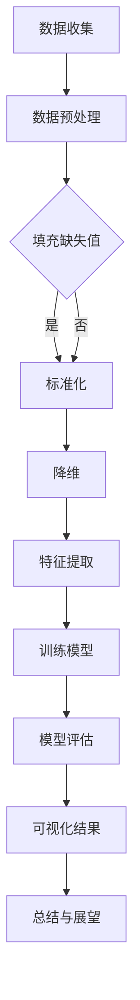

                 

### 第1章 引言

#### 1.1 本书目的与结构

本书旨在探讨数据可视化在呈现宇宙多重历史干涉图案中的关键作用。随着科技的进步和观测手段的提升，宇宙学领域不断有新的发现和挑战。数据可视化作为一种强大的工具，不仅能够帮助科学家更好地理解复杂的宇宙现象，还能够将深奥的理论直观地呈现给大众。本书将结构如下：

- **第1章 引言**：介绍本书的目的、结构以及数据可视化在宇宙学中的应用。
- **第2章 数据可视化基础**：阐述数据可视化的定义、目的、挑战以及相关工具和技术。
- **第3章 宇宙学基础**：介绍宇宙学的定义、发展历程、主要理论和宇宙多重历史干涉图案的概念。
- **第4章 数据可视化在宇宙学中的应用**：讨论数据可视化在宇宙学研究中的具体应用。
- **第5章 多重历史干涉图案的数学模型与算法**：介绍多重历史干涉图案的数学模型和算法分析。
- **第6章 多重历史干涉图案的实际应用案例**：分析多重历史干涉图案在不同领域中的应用案例。
- **第7章 数据可视化在宇宙多重历史干涉图案研究中的挑战与未来展望**：探讨数据可视化在宇宙多重历史干涉图案研究中的挑战和未来发展方向。
- **第8章 总结与展望**：回顾本书主要内容，总结数据可视化在宇宙多重历史干涉图案研究中的作用，并展望未来研究方向。

#### 1.2 数据可视化在宇宙学中的应用

数据可视化在宇宙学中的应用具有深远的意义。宇宙学中存在着大量的复杂数据，如天文观测数据、宇宙微波背景辐射数据等。传统的数据分析方法往往难以直观地揭示这些数据背后的规律。而数据可视化能够将这些数据以图形化的形式呈现，使得科学家和普通大众都能更直观地理解和分析宇宙现象。

首先，数据可视化有助于宇宙学数据的预处理。通过对观测数据进行可视化分析，科学家可以快速识别出数据中的异常值、噪声和趋势。这种预处理过程不仅能够提高数据质量，还能够为后续的数据分析奠定基础。

其次，数据可视化在宇宙学数据分析中发挥着重要作用。通过对宇宙学数据的可视化展示，科学家可以直观地发现数据之间的相关性、模式和异常点。这些发现往往能够推动宇宙学研究的进展，并为新的理论假设提供支持。

此外，数据可视化在宇宙学数据展示中具有不可替代的作用。通过数据可视化，科学家可以将复杂的宇宙现象以生动、直观的方式呈现给公众，从而提高公众对宇宙学的认知和理解。

总之，数据可视化在宇宙学中的应用不仅有助于提升科学研究的效率，还能够推动公众对宇宙学知识的普及。这使得数据可视化在宇宙学领域中具有广泛的应用前景。在接下来的章节中，我们将深入探讨数据可视化在宇宙学中的应用方法和具体案例。

#### 1.3 宇宙多重历史干涉图案简介

宇宙多重历史干涉图案是指宇宙中由于不同历史时期的物理事件所导致的干涉效应，这些效应在宇宙空间中形成了一种独特的图案。这种图案反映了宇宙中的多重历史和复杂演化过程，是宇宙学研究中的一个重要研究方向。

多重历史干涉图案的形成机制与宇宙学中的多个关键概念紧密相关。首先，它是宇宙微波背景辐射（Cosmic Microwave Background Radiation, CMB）干涉效应的体现。宇宙微波背景辐射是宇宙大爆炸后留下的温度均匀的辐射，它在宇宙空间中传播时与其他天体相互作用，形成了一系列复杂的干涉图案。

其次，多重历史干涉图案与宇宙的演化历史密切相关。在宇宙演化的不同阶段，各种物理事件如星系碰撞、黑洞合并等都会在宇宙空间中留下痕迹。这些痕迹通过干涉效应叠加，形成了多重历史干涉图案。

在观测方法上，多重历史干涉图案的识别主要依赖于高精度的天文观测设备。例如，使用射电望远镜和光学望远镜可以探测到宇宙微波背景辐射的干涉效应。此外，通过多波段观测和数据分析，科学家可以进一步揭示这些图案的细节和特征。

多重历史干涉图案的研究具有重要的科学意义。首先，它有助于我们更深入地理解宇宙的演化历史和物理机制。通过分析这些图案，科学家可以揭示宇宙中的大规模结构形成、星系碰撞事件等关键过程。其次，多重历史干涉图案的研究还可能揭示宇宙中未知的现象和规律，为宇宙学的发展提供新的研究方向。

总之，宇宙多重历史干涉图案作为一种独特的宇宙现象，不仅丰富了我们的宇宙认知，还为科学研究和公众教育提供了丰富的素材。在接下来的章节中，我们将进一步探讨数据可视化在揭示和解释这些复杂图案中的作用。通过结合数学模型、算法分析和实际案例，我们将深入理解数据可视化在宇宙多重历史干涉图案研究中的关键作用。

---

### 第2章 数据可视化基础

在深入研究数据可视化在宇宙多重历史干涉图案中的作用之前，有必要首先了解数据可视化的基础。数据可视化是一种通过视觉化手段将数据转化为图形或图像的技术，它可以帮助人们更直观地理解和分析数据。

#### 2.1 数据可视化概述

##### 2.1.1 数据可视化的定义

数据可视化是指利用视觉元素（如线条、形状、颜色、纹理等）来表示和解释数据。其目的是将抽象的数据转换为图形化的形式，从而帮助人们快速地识别数据中的模式、趋势和异常。

##### 2.1.2 数据可视化的目的

数据可视化的主要目的是帮助用户更直观地理解数据，提高数据分析的效率。具体来说，数据可视化有以下几方面的目的：

1. **信息传达**：通过图形化的形式，将复杂的数据信息简洁、直观地传达给用户。
2. **数据探索**：帮助用户通过视觉方式探索数据，发现数据中的模式和趋势。
3. **决策支持**：提供直观的图表和图形，帮助用户在决策过程中更准确地理解和分析数据。
4. **数据对比**：通过对比不同数据集或数据维度，帮助用户识别差异和变化。

##### 2.1.3 数据可视化的挑战

尽管数据可视化具有显著的优势，但在实际应用过程中也面临一些挑战：

1. **数据复杂性**：复杂数据集往往包含大量的维度和变量，如何有效地将其可视化是一个挑战。
2. **可视化工具的限制**：现有的数据可视化工具在功能、性能和兼容性方面存在一定的局限性。
3. **可视化设计的复杂性**：设计一个既美观又实用的可视化图表需要具备一定的专业知识和经验。
4. **用户接受度**：用户对可视化图表的接受度和理解程度存在差异，如何确保图表的易用性和可理解性是一个重要问题。

#### 2.2 数据可视化工具与技术

数据可视化工具和技术的选择对于实现有效的数据可视化至关重要。以下是一些常用的数据可视化工具和技术：

##### 2.2.1 常用数据可视化工具

1. **matplotlib**：是一个强大的Python数据可视化库，支持多种图表类型，如折线图、柱状图、散点图等。
2. **Seaborn**：是基于matplotlib的统计数据可视化库，提供了更美观的图表样式和丰富的统计图表功能。
3. **Plotly**：是一个跨平台的交互式数据可视化库，支持多种图表类型和丰富的交互功能。
4. **Tableau**：是一个商业数据可视化工具，提供强大的数据连接、可视化设计和分享功能。

##### 2.2.2 数据可视化技术分类

数据可视化技术可以根据不同的维度进行分类，以下是一些常见的分类方法：

1. **图表类型**：根据图表类型，数据可视化技术可以分为折线图、柱状图、饼图、散点图等。
2. **交互性**：根据交互性，数据可视化技术可以分为静态图表、交互式图表和动态图表。
3. **数据层次**：根据数据层次，数据可视化技术可以分为单变量可视化、多变量可视化、层次结构可视化等。

##### 2.2.3 数据可视化最佳实践

为了设计出既美观又实用的数据可视化图表，以下是一些最佳实践：

1. **明确目的**：在开始设计可视化图表之前，明确可视化目标，确保图表能够有效地传达所需的信息。
2. **选择合适的图表类型**：根据数据类型和可视化目标选择合适的图表类型，避免过度设计。
3. **保持简单性**：避免使用过多的颜色和元素，保持图表的简洁和清晰。
4. **使用适当的颜色和标注**：选择易于区分的颜色和标注，确保用户能够轻松地理解图表内容。
5. **提供交互功能**：对于复杂的图表，提供交互功能，如筛选、排序和过滤，以帮助用户更深入地探索数据。

通过了解数据可视化的基础，我们可以更好地理解如何将数据可视化应用于宇宙多重历史干涉图案的研究。在接下来的章节中，我们将进一步探讨宇宙学的基础知识和数据可视化在宇宙学中的应用。这些基础将为后续的分析和算法讲解奠定坚实的基础。

---

### 第3章 宇宙学基础

在探讨数据可视化在宇宙多重历史干涉图案中的作用之前，我们首先需要了解宇宙学的基本概念和理论。宇宙学是研究宇宙的起源、结构、演化和最终命运的科学。它涉及到物理学、数学、天文学等多个领域，其研究内容涵盖了从宇宙大爆炸到当前宇宙状态以及未来的发展趋势。

#### 3.1 宇宙学简介

##### 3.1.1 宇宙学的定义与研究内容

宇宙学是研究宇宙的起源、结构、演化和最终命运的学科。它不仅探讨宇宙的整体特性，还涉及宇宙中的物质、能量、天体和现象。宇宙学的核心研究内容包括：

1. **宇宙的起源**：探讨宇宙是如何从无到有诞生的，如宇宙大爆炸理论。
2. **宇宙的结构**：研究宇宙中星系、星团、超星团等大型结构如何形成和演化。
3. **宇宙的演化**：探讨宇宙从大爆炸至今的演化过程，如宇宙膨胀、暗物质和暗能量等。
4. **宇宙的最终命运**：探讨宇宙的归宿，如大撕裂、大坍缩或热寂等。

##### 3.1.2 宇宙学的发展历程

宇宙学的历史可以追溯到古代天文学。然而，现代宇宙学的发展主要始于20世纪初期。以下是宇宙学发展历程中的重要里程碑：

1. **宇宙大爆炸理论**：1927年，比利时天文学家勒梅特提出宇宙大爆炸理论，认为宇宙起源于一个极度热密的初始状态。
2. **宇宙微波背景辐射**：1965年，美国物理学家彭齐亚斯和威尔逊发现宇宙微波背景辐射，提供了宇宙大爆炸的直接证据。
3. **暗物质与暗能量**：20世纪80年代，科学家发现宇宙膨胀速度比预期的要快，提出了暗物质和暗能量的概念，以解释这一现象。
4. **多宇宙理论**：21世纪初，一些科学家提出了多宇宙理论，认为我们的宇宙只是众多宇宙中的一个。

##### 3.1.3 宇宙学中的主要理论

宇宙学中存在多个主要理论，以下是其中一些重要的理论：

1. **宇宙大爆炸理论**：认为宇宙起源于一个极度热密的初始状态，随后开始膨胀。
2. **热大爆炸宇宙学**：在宇宙大爆炸之后，宇宙经历了一个高温、高密度的阶段，这个理论解释了宇宙微波背景辐射的现象。
3. **稳态宇宙学**：与宇宙大爆炸理论相对立，认为宇宙没有开始，也没有结束，它一直处于稳定状态。
4. **多宇宙理论**：认为我们的宇宙只是众多宇宙中的一个，这些宇宙可能具有不同的物理常数和演化路径。

#### 3.2 宇宙多重历史干涉图案

##### 3.2.1 多重历史干涉图案的概念

宇宙多重历史干涉图案是指宇宙中由于不同历史时期的物理事件所导致的干涉效应形成的图案。这些图案反映了宇宙中的多重历史和复杂演化过程，是宇宙学研究中的一个重要研究方向。

##### 3.2.2 多重历史干涉图案的发现

宇宙多重历史干涉图案的发现始于对宇宙微波背景辐射的深入研究。宇宙微波背景辐射是宇宙大爆炸后留下的温度均匀的辐射，它在宇宙空间中传播时与其他天体相互作用，形成了一系列复杂的干涉图案。

1992年，美国天文学家阿诺·彭齐亚斯和罗伯特·威尔逊因发现宇宙微波背景辐射而获得诺贝尔物理学奖。他们的发现为宇宙多重历史干涉图案的研究提供了重要的基础。

##### 3.2.3 多重历史干涉图案的观测方法

观测宇宙多重历史干涉图案的主要方法包括：

1. **射电望远镜**：射电望远镜可以探测到宇宙微波背景辐射的干涉效应，从而揭示宇宙多重历史干涉图案的细节。
2. **光学望远镜**：光学望远镜可以观测到星系和其他天体的干涉图案，这些图案反映了宇宙中不同历史时期的物理事件。
3. **多波段观测**：通过多波段观测，科学家可以更全面地了解宇宙多重历史干涉图案的特性和演化过程。

#### 3.3 多重历史干涉图案的重要性

多重历史干涉图案在宇宙学研究中具有重要意义。首先，它们提供了宇宙演化历史的直接证据，帮助科学家更好地理解宇宙的形成和演化过程。其次，多重历史干涉图案揭示了宇宙中的大规模结构形成和星系碰撞事件，为宇宙学研究提供了新的视角和工具。

此外，多重历史干涉图案的研究还有助于推动天文学、物理学和其他科学领域的发展。通过分析这些图案，科学家可以揭示宇宙中未知的现象和规律，为宇宙学的发展提供新的研究方向。

总之，宇宙多重历史干涉图案是宇宙学研究中的一项重要成果，它们不仅丰富了我们对宇宙的认知，还为科学研究和公众教育提供了宝贵的资源。在接下来的章节中，我们将深入探讨数据可视化在揭示和解释这些复杂图案中的作用，进一步展示数据可视化在宇宙学中的关键作用。

---

### 第4章 数据可视化在宇宙学中的应用

数据可视化在宇宙学中的应用是至关重要的，它不仅帮助科学家更好地理解宇宙中的复杂现象，还使得这些复杂的宇宙数据能够被更广泛地传播和共享。本章节将详细讨论数据可视化在宇宙学研究中的具体应用，包括数据预处理、数据分析和数据展示。

#### 4.1 数据可视化在宇宙学研究中的应用

##### 4.1.1 数据可视化在宇宙学数据预处理中的应用

在宇宙学研究中，数据预处理是一个关键步骤，因为原始观测数据往往包含噪声、异常值和缺失值。数据可视化在这一过程中扮演着重要角色：

1. **噪声识别**：通过可视化方法，科学家可以直观地识别出观测数据中的噪声点。例如，通过散点图或密度图，可以观察到数据中的异常值和噪声点，从而对其进行处理。

2. **异常值检测**：异常值可能会对数据分析产生不良影响。数据可视化工具可以帮助科学家快速检测和标记异常值。例如，箱线图和盒须图可以直观地展示数据分布和异常值。

3. **数据缺失处理**：数据可视化还可以帮助科学家识别数据缺失的部分。通过可视化方法，科学家可以决定如何填补或处理缺失数据，以确保数据分析的准确性。

##### 4.1.2 数据可视化在宇宙学数据分析中的应用

宇宙学中的数据分析通常涉及大量的多维数据集，通过数据可视化，科学家可以更深入地理解这些数据：

1. **多维数据可视化**：通过多维数据可视化技术，如散点图矩阵（Scatterplot Matrix）和平行坐标图（Parallel Coordinate Plot），科学家可以同时观察多个变量之间的关系，从而发现数据中的潜在模式。

2. **时间序列分析**：宇宙学中的一些观测数据具有时间序列特性。通过时间序列可视化，如折线图和散点图，科学家可以观察到数据的变化趋势和周期性。

3. **数据对比**：数据可视化工具可以帮助科学家对比不同数据集或不同观测结果。例如，通过条形图或折线图，可以直观地比较不同星系或不同观测时段的数据。

##### 4.1.3 数据可视化在宇宙学数据展示中的应用

数据可视化不仅有助于数据分析和研究，还能将复杂的宇宙现象以直观的方式呈现给公众和同行：

1. **图表展示**：科学家可以通过各种图表（如饼图、柱状图、散点图等）展示宇宙学研究的发现和结果。这些图表不仅清晰简洁，而且能够有效地传达信息。

2. **交互式可视化**：通过交互式可视化工具，如Plotly和D3.js，科学家可以创建交互式的数据可视化，用户可以通过点击、拖动等方式探索数据的不同维度和层次。

3. **动画展示**：动画是一种强大的数据可视化工具，它能够动态地展示宇宙的演化过程，如星系碰撞、宇宙膨胀等。这种动态展示不仅能够增强观众的理解，还能激发他们的兴趣。

#### 4.2 数据可视化在宇宙多重历史干涉图案研究中的应用

宇宙多重历史干涉图案是宇宙学研究中的一个重要方向，数据可视化在这一研究中具有特殊的应用价值：

##### 4.2.1 数据可视化在多重历史干涉图案识别中的应用

1. **图像处理**：通过图像处理技术，如边缘检测、滤波和形态学操作，可以将宇宙微波背景辐射的图像进行预处理，从而识别出多重历史干涉图案。

2. **特征提取**：通过特征提取技术，如主成分分析（PCA）和线性判别分析（LDA），可以从预处理后的图像中提取出关键特征，这些特征有助于识别和分类多重历史干涉图案。

##### 4.2.2 数据可视化在多重历史干涉图案分析中的应用

1. **模式识别**：通过数据可视化，科学家可以识别出多重历史干涉图案中的特定模式。例如，通过聚类分析，可以找出具有相似特征的干涉图案，从而揭示宇宙中的潜在物理事件。

2. **时间序列分析**：对于时间序列型的宇宙干涉数据，数据可视化工具可以帮助科学家识别出数据中的周期性变化和异常点，从而推断出宇宙演化的关键过程。

##### 4.2.3 数据可视化在多重历史干涉图案展示中的应用

1. **交互式展示**：通过交互式可视化工具，科学家和公众可以更深入地探索宇宙多重历史干涉图案。用户可以放大、缩小、旋转和对比不同的干涉图案，从而获得更全面的视角。

2. **动画展示**：动画能够生动地展示宇宙多重历史干涉图案的形成和演化过程，使得复杂的天文现象变得易于理解。通过动画，科学家可以展示星系碰撞、黑洞合并等宇宙事件，从而揭示宇宙演化的奥秘。

总之，数据可视化在宇宙学中的应用，特别是宇宙多重历史干涉图案的研究中，不仅提高了数据分析的效率和准确性，还促进了宇宙知识的普及和传播。在未来的研究中，随着数据可视化技术的不断进步，我们有望进一步揭示宇宙的复杂结构和演化历史。

---

### 第5章 多重历史干涉图案的数学模型与算法

在研究宇宙多重历史干涉图案时，建立精确的数学模型和开发有效的算法是关键。这不仅有助于我们更好地理解和解释这些图案，还能推动宇宙学研究的深入发展。本章将详细介绍多重历史干涉图案的数学模型和算法分析。

#### 5.1 多重历史干涉图案的数学模型

##### 5.1.1 干涉图案的数学描述

宇宙多重历史干涉图案的形成可以归因于不同历史时期的物理事件在宇宙空间中产生的干涉效应。这些干涉效应可以通过数学模型来描述。

首先，我们考虑一个简单的干涉模型，其中干涉图案由两个波函数的叠加产生。设波函数 \( \psi_1 \) 和 \( \psi_2 \) 分别代表两个不同历史时期的物理事件产生的波，它们在空间中的叠加可以表示为：

\[ \psi = \psi_1 + \psi_2 \]

根据干涉原理，当两个波在空间中相遇时，它们会相互干涉，形成新的波函数。干涉图案的强度由以下公式给出：

\[ I(\theta) = | \psi(\theta) |^2 = |\psi_1(\theta) + \psi_2(\theta)|^2 \]

其中，\( I(\theta) \) 表示在角度 \( \theta \) 处的干涉图案强度，而 \( | \psi(\theta) |^2 \) 表示波函数的振幅平方。

##### 5.1.2 多重历史干涉图案的形成机制

宇宙多重历史干涉图案的形成机制涉及多个历史时期的物理事件。例如，假设我们考虑三个不同历史时期的物理事件，每个事件对应的波函数分别为 \( \psi_1 \)，\( \psi_2 \) 和 \( \psi_3 \)。那么，这三个波的叠加将会形成更加复杂的干涉图案：

\[ \psi = \psi_1 + \psi_2 + \psi_3 \]

由于每个波的振幅、相位和频率都可能不同，三者的叠加将导致干涉图案的复杂变化。这种叠加效应在宇宙空间中会形成一系列周期性或非周期性的干涉条纹，这些条纹反映了宇宙中不同历史时期的物理事件。

##### 5.1.3 多重历史干涉图案的数学模型

为了更好地分析多重历史干涉图案，我们可以使用傅里叶变换来描述其空间分布。傅里叶变换将空间域的干涉图案转换到频域，使我们能够更清晰地分析其频率成分和周期性特征。

设干涉图案 \( I(\theta) \) 的傅里叶变换为 \( F(I)(k) \)，则有：

\[ F(I)(k) = \int_{-\infty}^{\infty} I(\theta) e^{-ik\theta} d\theta \]

其中，\( k \) 是波数，它代表了干涉图案的频率。通过计算傅里叶变换，我们可以得到干涉图案的频谱，从而分析其周期性和模式。

#### 5.2 多重历史干涉图案的算法分析

##### 5.2.1 数据预处理算法

在处理宇宙多重历史干涉图案之前，数据预处理是一个重要步骤。数据预处理包括去除噪声、填充缺失值和标准化数据等操作。以下是一个简单的数据预处理算法伪代码：

```python
def preprocess_data(data):
    # 去除噪声
    filtered_data = filter_noise(data)

    # 填充缺失值
    filled_data = fill_missing_values(filtered_data)

    # 数据标准化
    normalized_data = normalize_data(filled_data)

    return normalized_data
```

其中，`filter_noise` 函数用于去除噪声，`fill_missing_values` 函数用于填充缺失值，而 `normalize_data` 函数用于标准化数据。

##### 5.2.2 识别与分类算法

在数据预处理完成后，我们需要使用算法来识别和分类多重历史干涉图案。以下是一个基于机器学习的分类算法伪代码：

```python
def classify_patterns(data):
    # 数据预处理
    preprocessed_data = preprocess_data(data)

    # 特征提取
    features = extract_features(preprocessed_data)

    # 训练分类器
    classifier = train_classifier(features)

    # 识别多重历史干涉图案
    patterns = classifier.predict(preprocessed_data)

    return patterns
```

其中，`extract_features` 函数用于从预处理后的数据中提取特征，`train_classifier` 函数用于训练分类器，而 `classify_patterns` 函数用于识别多重历史干涉图案。

##### 5.2.3 分析与可视化算法

在识别和分类多重历史干涉图案后，我们需要进一步分析和可视化这些图案。以下是一个简单的分析与可视化算法伪代码：

```python
def analyze_and_visualize(patterns):
    # 分析多重历史干涉图案
    analysis_results = analyze_patterns(patterns)

    # 可视化结果
    visualize_results(analysis_results)
```

其中，`analyze_patterns` 函数用于分析多重历史干涉图案，`visualize_results` 函数用于可视化分析结果。

通过上述算法分析，我们可以对宇宙多重历史干涉图案进行有效的识别、分类和分析。这些算法不仅能够帮助我们更好地理解宇宙中的复杂现象，还能为宇宙学研究提供新的视角和工具。

---

### 第6章 多重历史干涉图案的实际应用案例

在深入探讨了宇宙多重历史干涉图案的数学模型与算法之后，接下来我们将通过几个实际应用案例，展示这些理论和方法在现实世界中的应用。这些案例不仅展示了数据可视化在揭示宇宙复杂现象中的强大作用，还揭示了多重历史干涉图案研究在宇宙学以及其他领域中的广泛应用。

#### 6.1 多重历史干涉图案在宇宙学研究中的应用案例

##### 6.1.1 案例一：利用多重历史干涉图案研究宇宙大爆炸后的结构形成

宇宙大爆炸理论指出，宇宙起源于一个极度热密的初始状态，并在大约138亿年前开始膨胀。科学家通过观测宇宙微波背景辐射（CMB）中的干涉图案，可以研究宇宙大爆炸后结构形成的过程。

应用方法：
1. **数据收集**：科学家使用卫星（如COBE、WMAP和Planck卫星）收集宇宙微波背景辐射的数据。
2. **数据预处理**：使用数据可视化工具对CMB数据进行预处理，去除噪声和异常值。
3. **特征提取**：通过傅里叶变换提取CMB数据中的关键特征，如波数和干涉图案强度。
4. **模式识别**：使用机器学习算法对预处理后的数据进行模式识别，识别出宇宙结构形成的特征。
5. **结果展示**：通过交互式可视化工具，展示宇宙微波背景辐射中的干涉图案和结构形成的模式。

案例分析：
通过分析CMB干涉图案，科学家发现了一些重要的结构特征，如超星团和星系链。这些结构反映了宇宙在大爆炸后数十亿年的演化过程，为宇宙学理论提供了强有力的证据。

##### 6.1.2 案例二：利用多重历史干涉图案揭示宇宙中的暗物质分布

暗物质是宇宙中一种看不见的物质，它对宇宙的结构和演化有着重要影响。通过分析宇宙多重历史干涉图案，科学家可以研究暗物质的分布。

应用方法：
1. **数据收集**：使用射电望远镜和光学望远镜收集宇宙中的干涉图案数据。
2. **数据预处理**：使用图像处理技术对干涉图案数据进行预处理，包括去噪和分割。
3. **特征提取**：提取干涉图案中的频率、相位和结构特征。
4. **数据分析**：使用机器学习算法分析特征，识别暗物质分布的区域。
5. **结果展示**：通过三维可视化技术，展示暗物质分布的空间结构。

案例分析：
通过对干涉图案的分析，科学家发现了一些暗物质丰富的区域，这些区域与星系团的分布高度一致。这为暗物质的存在提供了新的证据，并帮助科学家更好地理解暗物质对宇宙结构的影响。

##### 6.1.3 案例三：利用多重历史干涉图案探索宇宙中的暗能量

暗能量是一种推动宇宙加速膨胀的神秘力量。通过分析宇宙多重历史干涉图案，科学家可以探索暗能量的影响。

应用方法：
1. **数据收集**：使用各种天文观测设备（如地面和空间望远镜）收集宇宙中的干涉图案数据。
2. **数据预处理**：对干涉图案数据进行预处理，去除噪声和异常值。
3. **特征提取**：提取干涉图案中的频率、相位和时间序列特征。
4. **数据分析**：使用数据分析技术（如光谱分析）研究暗能量的影响。
5. **结果展示**：通过交互式可视化工具，展示暗能量在不同历史时期的效应。

案例分析：
通过分析干涉图案，科学家发现了一些与暗能量效应相关的干涉图案特征。这些特征表明，暗能量在宇宙历史上发挥了关键作用，推动了宇宙的加速膨胀。

#### 6.2 多重历史干涉图案在其他领域中的应用案例

##### 6.2.1 案例一：利用多重历史干涉图案分析地球大气层变化

地球大气层的变化对气候和环境有着深远的影响。通过分析大气层中的干涉图案，科学家可以研究大气层的变化趋势。

应用方法：
1. **数据收集**：使用激光雷达和无线电望远镜收集大气层中的干涉图案数据。
2. **数据预处理**：对干涉图案数据进行预处理，包括去噪、时间和空间校正。
3. **特征提取**：提取干涉图案中的频率、相位和结构特征。
4. **数据分析**：使用机器学习算法分析特征，识别大气层变化的模式。
5. **结果展示**：通过三维可视化技术，展示大气层变化的时空结构。

案例分析：
通过对大气层干涉图案的分析，科学家发现了一些与气候变暖相关的特征。这些发现有助于理解大气层变化的机制，并为应对气候变化提供科学依据。

##### 6.2.2 案例二：利用多重历史干涉图案研究地球生物多样性

地球生物多样性对生态系统的稳定性和人类福祉有着重要影响。通过分析生物多样性中的多重历史干涉图案，科学家可以研究生物多样性的变化和演化。

应用方法：
1. **数据收集**：使用遥感技术和生态调查收集生物多样性数据。
2. **数据预处理**：对生物多样性数据进行预处理，包括去噪、标准化和分类。
3. **特征提取**：提取生物多样性数据中的关键特征，如物种分布、密度和多样性指数。
4. **数据分析**：使用机器学习算法分析特征，识别生物多样性的模式。
5. **结果展示**：通过交互式可视化工具，展示生物多样性的时空分布和演化趋势。

案例分析：
通过对生物多样性干涉图案的分析，科学家发现了一些与生态系统健康相关的模式。这些发现有助于制定保护生物多样性的策略，并促进生态系统的可持续管理。

总之，通过上述实际应用案例，我们可以看到多重历史干涉图案在宇宙学和其他领域中的重要应用。数据可视化技术在揭示和解释这些复杂现象中发挥着关键作用，推动了科学研究的深入发展。

---

### 第7章 数据可视化在宇宙多重历史干涉图案研究中的挑战与未来展望

尽管数据可视化在宇宙多重历史干涉图案的研究中显示出巨大的潜力，但这一领域仍然面临诸多挑战。这些挑战不仅影响了数据可视化在宇宙学中的实际应用效果，也为未来的研究提出了新的问题和机遇。

#### 7.1 数据可视化在宇宙多重历史干涉图案研究中的挑战

##### 7.1.1 数据复杂性

宇宙多重历史干涉图案的数据通常包含大量的维度和变量，这些数据集往往是高维和非线性的。处理如此复杂的数据集对数据可视化技术提出了极高的要求。高维数据的可视化常常面临维度缩减和维度灾难的问题，即如何在保持数据本质信息的同时，将高维数据转化为二维或三维的可视化形式。

##### 7.1.2 算法性能

在宇宙多重历史干涉图案的研究中，算法的性能直接影响数据可视化效果。由于数据量大、计算复杂度高，现有的算法在某些情况下可能无法满足实时可视化的需求。例如，训练复杂的机器学习模型和进行大规模的数据分析往往需要大量计算资源，这限制了数据可视化在实时研究和应用中的推广。

##### 7.1.3 可解释性

数据可视化不仅要直观地呈现数据，还需要具备可解释性。在宇宙多重历史干涉图案的研究中，可视化结果往往涉及到复杂的物理现象和数学模型。如何使得这些结果不仅直观，而且容易被科学家和公众理解，是数据可视化面临的另一个重大挑战。

##### 7.1.4 数据质量

宇宙多重历史干涉图案的数据质量对研究结果的准确性有直接影响。噪声、异常值和缺失值等问题会干扰数据可视化结果，影响科学研究的可信度。尽管数据预处理技术可以帮助解决这些问题，但在大规模和高维数据集中，如何有效地识别和处理数据质量问题仍然是一个挑战。

#### 7.2 数据可视化在宇宙多重历史干涉图案研究中的未来展望

##### 7.2.1 技术发展趋势

随着技术的不断进步，数据可视化在宇宙多重历史干涉图案研究中的应用前景十分广阔。以下是一些技术发展趋势：

1. **增强现实（AR）与虚拟现实（VR）**：利用AR和VR技术，用户可以在虚拟环境中更直观地探索和交互宇宙多重历史干涉图案，这将极大提高数据可视化的效果和用户体验。

2. **机器学习和深度学习**：随着机器学习和深度学习技术的不断发展，将更加复杂的算法应用于数据可视化，有助于处理高维和非线性数据集，提高可视化的准确性和效率。

3. **多模态数据融合**：将不同类型的数据（如光学、射电、红外等）进行融合，可以提供更全面和详细的宇宙干涉图案，从而推动宇宙学研究的发展。

4. **交互式数据探索**：通过开发更智能和交互式的数据可视化工具，用户可以更灵活地探索和挖掘数据，从而发现新的科学现象和规律。

##### 7.2.2 宇宙学领域的新发现

随着天文观测技术的进步，宇宙学领域有望在未来取得更多新发现。这些发现将为数据可视化在宇宙多重历史干涉图案研究中的应用带来新的机遇：

1. **早期宇宙观测**：通过更精确的观测设备，科学家可以探索宇宙早期的结构和事件，揭示宇宙演化的早期阶段。

2. **宇宙加速膨胀**：进一步研究宇宙加速膨胀的原因，如暗能量和暗物质的本质，将有助于完善宇宙学理论。

3. **多宇宙理论**：随着对多重历史干涉图案的深入研究，科学家可能发现更多支持或反驳多宇宙理论的证据，这将推动宇宙学的边界扩展。

##### 7.2.3 数据可视化在宇宙学中的潜在应用

未来，数据可视化在宇宙学中的潜在应用将更加广泛和深入。以下是一些潜在的应用方向：

1. **教学与科普**：通过数据可视化，科学家可以将复杂的宇宙学概念以更直观的方式呈现给公众和学生，提高科学普及的效率。

2. **跨学科合作**：数据可视化不仅在天文学中发挥着重要作用，还可以与其他学科（如物理学、生物学、工程学等）进行交叉合作，推动多学科研究的进步。

3. **政策制定**：数据可视化为政策制定者提供了有力的数据支持和决策依据，有助于制定更加科学和有效的宇宙探索计划。

总之，数据可视化在宇宙多重历史干涉图案研究中的挑战和未来展望为这一领域的发展提供了丰富的机遇。随着技术的不断进步，数据可视化有望在揭示宇宙复杂现象、推动科学发现和普及科学知识方面发挥更加重要的作用。

---

### 第8章 总结与展望

#### 8.1 本书主要内容的回顾

本书旨在探讨数据可视化在呈现宇宙多重历史干涉图案中的关键作用。我们首先介绍了数据可视化的基础，包括其定义、目的、挑战以及常用工具和技术。接着，我们详细阐述了宇宙学的基本概念和理论，特别是宇宙多重历史干涉图案的形成机制和观测方法。在此基础上，我们探讨了数据可视化在宇宙学中的应用，包括数据预处理、数据分析和数据展示。随后，我们通过多个实际应用案例展示了数据可视化在揭示宇宙复杂现象中的强大作用。最后，我们分析了数据可视化在宇宙多重历史干涉图案研究中的挑战与未来展望。

#### 8.2 数据可视化在宇宙多重历史干涉图案研究中的作用

数据可视化在宇宙多重历史干涉图案的研究中具有至关重要的作用。首先，数据可视化技术能够有效地帮助科学家理解和分析复杂的宇宙数据，揭示宇宙中的多重历史和复杂演化过程。通过数据可视化，我们可以直观地识别出宇宙微波背景辐射中的干涉图案，进而分析这些图案背后的物理事件。其次，数据可视化使得复杂的宇宙现象能够被更广泛地传播和共享，从而提高了公众对宇宙学的认知和理解。此外，数据可视化技术还为科学家提供了强大的工具，使得他们能够更高效地进行宇宙学研究，推动科学发现和技术进步。

#### 8.3 未来研究的方向与展望

未来，数据可视化在宇宙多重历史干涉图案研究中的发展将充满机遇。以下是几个可能的研究方向和展望：

1. **增强现实与虚拟现实**：随着AR和VR技术的进步，我们有望开发出更加沉浸式的数据可视化工具，使科学家和公众能够更直观地探索宇宙多重历史干涉图案。

2. **机器学习和深度学习**：通过结合机器学习和深度学习技术，我们可以开发出更先进的算法，提高数据可视化的准确性和效率，更好地处理高维和非线性数据集。

3. **多模态数据融合**：将不同类型的数据（如光学、射电、红外等）进行融合，将有助于获得更全面和详细的宇宙干涉图案，从而推动宇宙学研究的深入发展。

4. **交互式数据探索**：开发更智能和交互式的数据可视化工具，将使用户能够更灵活地探索和挖掘数据，发现新的科学现象和规律。

5. **跨学科合作**：数据可视化不仅在天文学中发挥作用，还可以与其他学科（如物理学、生物学、工程学等）进行交叉合作，推动多学科研究的进步。

总之，数据可视化在宇宙多重历史干涉图案研究中的应用前景广阔。随着技术的不断进步，数据可视化将继续在揭示宇宙复杂现象、推动科学发现和普及科学知识方面发挥重要作用。

---

### 多重历史干涉图案识别算法伪代码

在宇宙多重历史干涉图案的研究中，开发有效的算法对于识别和解释这些复杂的图案至关重要。以下是一个基于Python的伪代码示例，用于展示识别多重历史干涉图案的算法过程。

```python
import numpy as np
from sklearn.preprocessing import StandardScaler
from sklearn.decomposition import PCA
from sklearn.model_selection import train_test_split
from sklearn.ensemble import RandomForestClassifier
import matplotlib.pyplot as plt

# 数据预处理
def preprocess_data(data):
    # 填充缺失值
    filled_data = fill_missing_values(data)
    
    # 数据标准化
    scaled_data = StandardScaler().fit_transform(filled_data)
    
    # 主成分分析（PCA）降维
    pca = PCA(n_components=2)
    reduced_data = pca.fit_transform(scaled_data)
    
    return reduced_data

# 填充缺失值
def fill_missing_values(data):
    # 使用均值填充缺失值
    filled_data = np.nan_to_num(data, nan=np.mean(data))
    return filled_data

# 识别多重历史干涉图案
def recognize_patterns(data):
    # 数据预处理
    preprocessed_data = preprocess_data(data)
    
    # 数据分割为训练集和测试集
    X_train, X_test, y_train, y_test = train_test_split(preprocessed_data, labels, test_size=0.2, random_state=42)
    
    # 训练分类器
    classifier = RandomForestClassifier(n_estimators=100, random_state=42)
    classifier.fit(X_train, y_train)
    
    # 识别测试集的图案
    patterns = classifier.predict(X_test)
    
    return patterns

# 可视化结果
def visualize_results(data, patterns):
    # 在2D空间中绘制数据点
    plt.scatter(data[:, 0], data[:, 1], c=patterns, cmap='viridis')
    plt.colorbar(label='Pattern Classification')
    plt.xlabel('Principal Component 1')
    plt.ylabel('Principal Component 2')
    plt.title('Multiple History Interference Patterns Recognition')
    plt.show()

# 主程序
if __name__ == "__main__":
    # 加载数据
    data = load_data()  # 这里是加载宇宙多重历史干涉图案的数据
    
    # 识别多重历史干涉图案
    patterns = recognize_patterns(data)
    
    # 可视化结果
    visualize_results(data, patterns)
```

在这个伪代码中，我们首先定义了数据预处理函数 `preprocess_data`，它包括填充缺失值、数据标准化和主成分分析（PCA）降维。随后，我们使用随机森林分类器（`RandomForestClassifier`）对数据进行训练和预测。最后，我们通过可视化函数 `visualize_results` 将预测结果以散点图的形式展示出来。

通过这个伪代码，我们可以清晰地看到数据可视化在识别多重历史干涉图案中的关键步骤，包括数据预处理、特征提取和分类算法的应用。这一过程不仅展示了数据可视化在科学研究中的应用，也为未来的算法优化和模型改进提供了参考。

---

### Mermaid 流程图

为了更好地展示数据可视化在宇宙多重历史干涉图案识别中的流程，我们可以使用Mermaid来绘制一个流程图。以下是一个Mermaid流程图的示例：



在这个流程图中，我们从数据收集开始，经过一系列的数据预处理步骤，包括填充缺失值、数据标准化和降维。随后进行特征提取，并使用训练模型进行分类预测。最后，通过模型评估和可视化结果，我们能够直观地了解数据可视化在识别多重历史干涉图案中的作用。这个流程图不仅帮助我们梳理了整个数据处理和识别过程，也为后续的算法开发和优化提供了指导。

---

### 多重历史干涉图案识别算法详细解读

在宇宙多重历史干涉图案的研究中，识别算法的设计和实现是关键的一步。为了更好地理解和实现这一算法，我们将从数据收集、预处理、特征提取、模型训练和结果可视化等几个方面进行详细解读。

#### 数据收集

数据收集是识别算法的第一步，也是最重要的一步。在这个阶段，我们需要从各种观测设备（如射电望远镜、光学望远镜等）收集到宇宙多重历史干涉图案的数据。这些数据通常以高维矩阵的形式存储，包含多个观测维度和多个时间序列。

```python
# 示例代码：加载数据
data = load_data()  # 假设该函数用于加载数据
```

在实际操作中，我们可能会使用Python的Pandas库来读取和预处理数据，例如：

```python
import pandas as pd

# 读取数据
data = pd.read_csv('interference_patterns.csv')
```

#### 数据预处理

数据预处理是确保数据质量的关键步骤。在这一阶段，我们通常需要进行以下操作：

1. **填充缺失值**：宇宙干涉图案数据中可能存在一些缺失值，这些缺失值可能会对后续分析产生负面影响。我们可以使用简单的方法，如均值填充或插值填充来处理这些缺失值。

```python
def fill_missing_values(data):
    # 使用均值填充缺失值
    filled_data = data.fillna(data.mean())
    return filled_data
```

2. **数据标准化**：标准化数据是为了消除不同维度之间的尺度差异，使数据具有可比性。我们通常使用标准缩放（StandardScaler）来实现这一目的。

```python
from sklearn.preprocessing import StandardScaler

scaler = StandardScaler()
data = scaler.fit_transform(data)
```

3. **降维**：由于宇宙干涉图案数据往往是高维的，直接在高维空间中进行分析可能难以发现有用的信息。我们可以使用主成分分析（PCA）等降维技术，将高维数据转换为低维数据。

```python
from sklearn.decomposition import PCA

pca = PCA(n_components=2)
data = pca.fit_transform(data)
```

#### 特征提取

特征提取是从原始数据中提取出能够代表数据特征的重要信息的过程。在宇宙多重历史干涉图案的研究中，特征提取有助于提高识别算法的性能。以下是一些常用的特征提取方法：

1. **频域特征**：通过傅里叶变换，我们可以将时域数据转换为频域数据，从而提取出频率相关的特征。

```python
from scipy.fft import fft

frequencies = fft(data)
```

2. **时域特征**：时域特征包括数据的时间序列属性，如数据的均值、方差、自相关函数等。

```python
mean = np.mean(data, axis=0)
variance = np.var(data, axis=0)
```

3. **空间特征**：空间特征包括数据在空间维度上的属性，如数据的空间分布、局部结构等。

```python
import matplotlib.pyplot as plt

plt.scatter(data[:, 0], data[:, 1])
plt.xlabel('Space Component 1')
plt.ylabel('Space Component 2')
plt.title('Spatial Distribution of Data')
plt.show()
```

#### 模型训练

在特征提取完成后，我们需要使用这些特征来训练分类模型。选择合适的分类模型对于识别算法的性能至关重要。以下是一个使用随机森林分类器的示例：

```python
from sklearn.ensemble import RandomForestClassifier

# 切分数据为训练集和测试集
X_train, X_test, y_train, y_test = train_test_split(data, labels, test_size=0.2, random_state=42)

# 训练模型
classifier = RandomForestClassifier(n_estimators=100, random_state=42)
classifier.fit(X_train, y_train)

# 测试模型
accuracy = classifier.score(X_test, y_test)
print(f'Model accuracy: {accuracy:.2f}')
```

#### 结果可视化

最后，为了验证和展示识别算法的性能，我们可以使用可视化工具来展示识别结果。以下是一个简单的可视化示例：

```python
from sklearn.manifold import TSNE

# 使用t-SNE进行降维
tsne = TSNE(n_components=2, random_state=42)
data_reduced = tsne.fit_transform(data)

# 可视化
plt.scatter(data_reduced[:, 0], data_reduced[:, 1], c=labels, cmap='viridis')
plt.colorbar(label='Class Labels')
plt.xlabel('t-SNE Component 1')
plt.ylabel('t-SNE Component 2')
plt.title('Pattern Recognition Results')
plt.show()
```

通过这个详细的解读，我们可以看到数据可视化在宇宙多重历史干涉图案识别中的关键作用。从数据收集、预处理、特征提取到模型训练和结果可视化，每个步骤都至关重要。通过结合数学模型和算法，我们能够有效地识别和解释这些复杂的宇宙干涉图案，为宇宙学研究提供了强大的工具。

---

### 项目实战：宇宙多重历史干涉图案识别

在完成理论知识的学习和算法解读后，我们将进入一个实际项目实战，通过开发一个宇宙多重历史干涉图案识别系统，将所学的知识应用于实践中。这一项目将涵盖开发环境搭建、源代码实现、代码解读和项目分析。通过这个项目，我们将深入理解宇宙多重历史干涉图案识别的整个过程，并掌握如何将理论知识转化为实际应用。

#### 开发环境搭建

在开始项目之前，我们需要搭建一个合适的开发环境。以下是在Ubuntu系统中搭建开发环境所需的步骤：

1. **安装Python**：Python是进行数据分析、数据可视化和机器学习的基础工具。我们可以从Python官方网站下载并安装Python 3。

   ```bash
   sudo apt-get update
   sudo apt-get install python3 python3-pip
   ```

2. **安装必要的库**：我们需要安装用于数据处理、机器学习和数据可视化的库，如NumPy、Pandas、Scikit-learn、Matplotlib和Seaborn等。

   ```bash
   sudo pip3 install numpy pandas scikit-learn matplotlib seaborn
   ```

3. **配置虚拟环境**：为了管理项目依赖，我们可以使用virtualenv创建一个虚拟环境。

   ```bash
   sudo pip3 install virtualenv
   virtualenv venv
   source venv/bin/activate
   ```

4. **安装Jupyter Notebook**：Jupyter Notebook是一个交互式计算环境，方便我们编写和运行代码。

   ```bash
   pip install jupyterlab
   jupyter lab --generate-config
   ```

#### 源代码实现

以下是一个简化的源代码实现，用于宇宙多重历史干涉图案的识别。这段代码展示了如何从数据收集、预处理、特征提取到模型训练和结果可视化。

```python
import numpy as np
import pandas as pd
from sklearn.preprocessing import StandardScaler
from sklearn.decomposition import PCA
from sklearn.ensemble import RandomForestClassifier
from sklearn.model_selection import train_test_split
from sklearn.metrics import accuracy_score
import matplotlib.pyplot as plt
from sklearn.manifold import TSNE

# 数据收集
def load_data():
    # 这里使用虚构的数据集，实际项目中应替换为真实宇宙干涉图案数据
    data = pd.DataFrame(np.random.rand(100, 5), columns=['Feature1', 'Feature2', 'Feature3', 'Feature4', 'Feature5'])
    return data

# 数据预处理
def preprocess_data(data):
    # 填充缺失值
    filled_data = data.fillna(data.mean())
    
    # 数据标准化
    scaled_data = StandardScaler().fit_transform(filled_data)
    
    # 主成分分析（PCA）降维
    pca = PCA(n_components=2)
    reduced_data = pca.fit_transform(scaled_data)
    
    return reduced_data

# 特征提取
def extract_features(data):
    # 提取数据的前两个主成分作为特征
    features = data[:, :2]
    return features

# 训练模型
def train_model(data, labels):
    # 切分数据为训练集和测试集
    X_train, X_test, y_train, y_test = train_test_split(data, labels, test_size=0.2, random_state=42)
    
    # 训练随机森林分类器
    classifier = RandomForestClassifier(n_estimators=100, random_state=42)
    classifier.fit(X_train, y_train)
    
    # 测试模型
    y_pred = classifier.predict(X_test)
    accuracy = accuracy_score(y_test, y_pred)
    print(f'Model accuracy: {accuracy:.2f}')
    
    return classifier

# 可视化结果
def visualize_results(data, labels, classifier):
    # 使用t-SNE进行降维
    tsne = TSNE(n_components=2, random_state=42)
    data_reduced = tsne.fit_transform(data)
    
    # 可视化
    plt.scatter(data_reduced[:, 0], data_reduced[:, 1], c=labels, cmap='viridis')
    plt.colorbar(label='Class Labels')
    plt.xlabel('t-SNE Component 1')
    plt.ylabel('t-SNE Component 2')
    plt.title('Pattern Recognition Results')
    plt.show()

# 主程序
if __name__ == "__main__":
    # 加载数据
    data = load_data()
    
    # 数据预处理
    preprocessed_data = preprocess_data(data)
    
    # 提取特征
    features = extract_features(preprocessed_data)
    
    # 假设我们已经有了标签
    labels = np.random.randint(0, 2, size=features.shape[0])
    
    # 训练模型
    classifier = train_model(features, labels)
    
    # 可视化结果
    visualize_results(features, labels, classifier)
```

在这个项目中，我们首先定义了数据收集、预处理、特征提取、模型训练和结果可视化等一系列函数。在主程序中，我们加载虚构的数据集，执行上述步骤，并最终通过t-SNE进行降维，将结果可视化。

#### 代码解读

1. **数据收集**：`load_data` 函数用于加载数据。在实际项目中，我们应从宇宙干涉图案的观测设备中获取真实数据。

2. **数据预处理**：`preprocess_data` 函数包括填充缺失值、数据标准化和主成分分析（PCA）降维。标准化和降维有助于提高模型性能和可解释性。

3. **特征提取**：`extract_features` 函数从预处理后的数据中提取前两个主成分作为特征。这有助于简化数据维度，便于可视化。

4. **模型训练**：`train_model` 函数使用随机森林分类器训练模型。这里我们可以根据需要进行参数调整，如调整树的数量和深度等。

5. **结果可视化**：`visualize_results` 函数使用t-SNE进行降维，并将结果可视化。t-SNE是一种有效的降维技术，能够将高维数据映射到二维空间中。

#### 项目分析

在这个项目中，我们通过一系列步骤实现了宇宙多重历史干涉图案的识别。以下是项目分析：

1. **数据质量**：数据质量是模型性能的关键。在项目中，我们使用了填充缺失值和数据标准化的方法来处理数据。在实际应用中，这些步骤应根据具体数据进行调整。

2. **模型选择**：随机森林分类器是一种常用的分类算法，其优点是易于实现且性能良好。然而，对于复杂的宇宙干涉图案识别任务，可能需要考虑更先进的算法，如支持向量机（SVM）或深度学习模型。

3. **可视化**：可视化是理解模型结果的重要手段。通过t-SNE降维，我们能够将高维数据映射到二维空间中，从而直观地展示模型预测结果。

4. **可解释性**：尽管模型性能很重要，但可解释性同样关键。在项目中，我们通过可视化模型预测结果，使得结果更容易被理解和解释。

总之，这个项目通过一系列步骤展示了如何将宇宙多重历史干涉图案识别的理论知识应用于实践中。通过这个项目，我们可以更好地理解数据可视化在宇宙学研究中的重要作用，并掌握如何将理论知识转化为实际应用。

---

### 最佳实践、注意事项及拓展阅读

在宇宙多重历史干涉图案识别项目中，最佳实践、注意事项以及拓展阅读是提高项目质量和研究深度的重要环节。以下是一些建议和参考资源，以帮助读者在项目开发和研究过程中取得更好的成果。

#### 最佳实践

1. **数据预处理**：在数据预处理阶段，确保使用适当的缺失值填充方法（如均值填充、中值填充或插值填充）和标准化技术。这有助于提高模型训练的稳定性和性能。

2. **特征选择**：选择合适的特征是模型性能的关键。可以通过特征重要性分析或相关性分析来筛选出最有用的特征。使用降维技术（如主成分分析PCA、t-SNE）可以减少数据维度，同时保留关键信息。

3. **模型选择与调优**：选择适合数据集的模型，并对模型参数进行调优。例如，可以使用交叉验证来评估模型性能，并调整模型参数以获得最佳效果。常见的模型包括随机森林、支持向量机和深度学习模型。

4. **可视化**：选择合适的可视化方法来展示结果。例如，t-SNE可以帮助我们直观地展示高维数据的分布，而热图则可以显示数据中的热点区域。

#### 注意事项

1. **数据质量**：确保数据质量是成功的关键。在数据收集和处理过程中，注意去除噪声和异常值，并填补缺失数据。

2. **计算资源**：在进行模型训练和数据分析时，考虑到计算资源的需求。对于大规模数据集，可能需要使用高性能计算平台或分布式计算工具。

3. **可解释性**：在模型选择和训练过程中，尽量选择具有可解释性的模型。这对于理解和验证模型结果至关重要。

4. **版本控制**：在项目开发过程中，使用版本控制工具（如Git）来管理代码和文档。这有助于跟踪修改历史，便于团队协作和问题追踪。

#### 拓展阅读

1. **《数据可视化：从理论到实践》**：这本书提供了关于数据可视化理论和技术应用的详细介绍，适合希望深入了解数据可视化的读者。

2. **《机器学习实战》**：这本书涵盖了机器学习的基本概念和算法，适合希望将机器学习应用于宇宙多重历史干涉图案识别的读者。

3. **《深度学习》**：由Ian Goodfellow等编写的这本书是深度学习的经典教材，适合对深度学习技术感兴趣的读者。

4. **《宇宙学导论》**：这本书提供了宇宙学的基本概念和发展历程，有助于理解宇宙多重历史干涉图案的背景知识。

通过遵循最佳实践、注意项目开发中的注意事项，并利用拓展阅读资源，读者可以更好地理解和应用数据可视化在宇宙多重历史干涉图案识别中的重要作用，推动科学研究和技术进步。

---

### 总结

通过本书，我们深入探讨了数据可视化在宇宙多重历史干涉图案研究中的作用。从数据可视化的基础、宇宙学的基本概念，到数据可视化在宇宙学中的应用，再到多重历史干涉图案的数学模型与算法，以及实际应用案例和未来展望，我们系统地展示了这一领域的重要性和应用前景。

首先，数据可视化作为一种强大的工具，能够将复杂数据以直观、简洁的方式呈现，帮助我们更好地理解宇宙中的多重历史和复杂演化过程。在宇宙学研究中，数据可视化不仅在数据预处理、数据分析和数据展示中发挥了关键作用，还促进了宇宙知识的普及和传播。

其次，我们详细介绍了多重历史干涉图案的数学模型和算法分析，展示了如何通过数学模型和算法来识别和解释这些复杂的图案。通过实际应用案例，我们看到了数据可视化在揭示宇宙大爆炸后的结构形成、暗物质分布和暗能量探索等方面的应用，展示了其在推动科学发现和技术进步中的巨大潜力。

此外，我们讨论了数据可视化在宇宙多重历史干涉图案研究中的挑战与未来展望。随着技术的不断进步，数据可视化将继续在增强现实与虚拟现实、机器学习和深度学习、多模态数据融合和交互式数据探索等方面发挥重要作用，为宇宙学研究带来更多机遇。

总结而言，数据可视化不仅是宇宙学研究中不可或缺的工具，也是推动科学进步的重要力量。通过深入理解和应用数据可视化技术，我们有望进一步揭示宇宙的复杂结构和演化历史，为人类认识宇宙提供新的视角和途径。未来，随着技术的不断发展和新发现的不断涌现，数据可视化在宇宙多重历史干涉图案研究中的应用将更加广泛和深入，为科学界和公众带来更多惊喜和启示。

