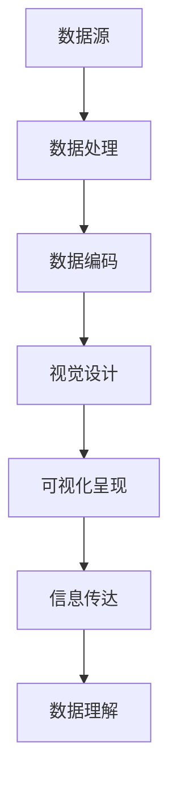
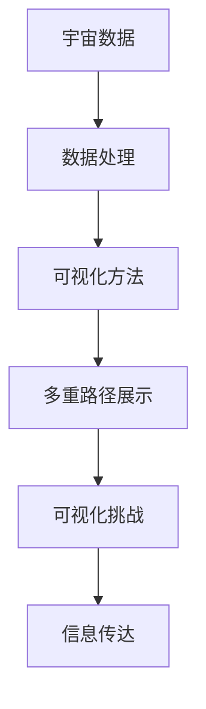
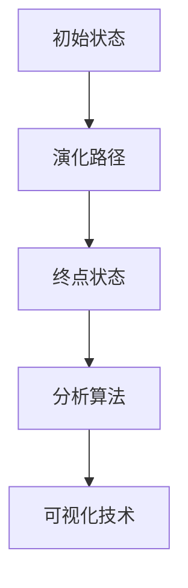

                 

### 引言

**关键词：数据可视化，宇宙演化，多重路径，科学探究，信息传达**

在现代社会，数据无处不在。从宇宙的浩瀚星海到日常生活中的购物记录，数据已经成为我们理解和描述世界的基石。然而，面对海量的数据，如何有效地传达和解读它们，成为了科学研究中的一个重要课题。数据可视化，作为一种将复杂的数据转化为图形化信息的技术，正在这个过程中扮演着越来越重要的角色。

**文章摘要：** 本文将探讨数据可视化在呈现宇宙演化多重路径中的作用。首先，我们将简要介绍数据可视化技术及其在科学研究中的应用。接着，我们将深入探讨宇宙演化的基本概念，并引入多重路径这一重要概念。随后，文章将详细解释数据可视化如何帮助我们理解宇宙演化的多种可能路径，并展示具体的可视化方法和工具。文章还将通过实际案例，说明数据可视化在宇宙学研究中的实际应用，最后，我们将总结本文的主要发现，并提出未来研究的方向。

**背景介绍：** 宇宙演化是一个复杂且多层次的过程，涉及从大爆炸到星系形成，再到星系团演化的各个阶段。然而，由于宇宙的广阔和复杂，直接观测和实验研究存在诸多限制。这就需要借助数据可视化的力量，通过图形和交互式界面，将宇宙演化的复杂信息直观地呈现出来。数据可视化不仅可以帮助科学家更好地理解宇宙演化的各种可能路径，还能向公众传达宇宙学的最新进展。

### 数据可视化基础

**核心概念与联系：**

数据可视化是将数据转化为图形或图像表示的技术，旨在通过视觉感知来传达信息和分析结果。其核心概念包括数据编码、视觉通道利用、交互性和美观性。

**Mermaid 流程图：**



**核心算法原理讲解：**

数据可视化的核心算法包括数据清洗、数据转换、数据聚合和可视化布局算法。以下是一个使用 Python 实现的简单示例：

```python
import matplotlib.pyplot as plt
import numpy as np

# 数据生成
x = np.linspace(0, 10, 100)
y = np.sin(x)

# 数据转换
data = {'x': x, 'y': y}

# 可视化布局
plt.plot(data['x'], data['y'])
plt.xlabel('x')
plt.ylabel('y')
plt.title('Sine Wave')
plt.show()
```

通过上述代码，我们首先生成了一组数据，然后使用 matplotlib 库将其可视化呈现为一个正弦波形。这里用到了数据转换和可视化布局算法。

### 宇宙学概述

**核心概念与联系：**

宇宙学是研究宇宙的结构、起源和演化的科学。其核心概念包括宇宙的膨胀、暗物质、暗能量和多重宇宙等。这些概念之间存在着紧密的联系，共同构成了宇宙学的基本框架。

**Mermaid 流程图：**


**核心算法原理讲解：**

宇宙学的研究依赖于观测数据和理论模型。例如，宇宙膨胀可以通过哈勃定律来描述，即宇宙的膨胀速度与宇宙距离成正比。以下是一个使用 Python 实现的哈勃定律计算示例：

```python
import numpy as np

# 宇宙距离和膨胀速度
distances = np.array([1, 2, 3, 4, 5])
velocities = np.array([0.1, 0.2, 0.3, 0.4, 0.5])

# 计算哈勃常数
Hubble_constant = velocities / distances

# 打印结果
print(f"Hubble Constant: {Hubble_constant}")
```

通过上述代码，我们首先生成了一组宇宙距离和膨胀速度数据，然后使用哈勃定律计算出了哈勃常数。这里用到了宇宙学的基本原理和数学模型。

### 数据可视化与宇宙学结合

**核心概念与联系：**

数据可视化与宇宙学的结合，旨在通过图形化的方式，直观地呈现宇宙演化的复杂信息。这种结合不仅有助于科学家的研究，还能向公众传达宇宙学的最新进展。其中，核心概念包括宇宙数据的可视化方法、多重路径的可视化展示和宇宙学数据的可视化挑战。

**Mermaid 流程图：**



**核心算法原理讲解：**

为了更好地展示宇宙演化的多重路径，我们可以使用一种名为“时间序列可视化”的技术。以下是一个使用 Python 实现的时间序列可视化示例：

```python
import matplotlib.pyplot as plt
import numpy as np

# 生成时间序列数据
times = np.arange(0, 10, 0.1)
values = np.sin(times)

# 可视化设置
plt.plot(times, values)
plt.xlabel('Time')
plt.ylabel('Value')
plt.title('Time Series Visualization')
plt.show()
```

通过上述代码，我们生成了一组时间序列数据，并使用 matplotlib 库将其可视化呈现。这里用到了时间序列可视化的算法和工具。

### 多重路径分析

**核心概念与联系：**

多重路径分析是一种研究宇宙演化中不同可能路径的方法。它基于宇宙学的理论模型和观测数据，通过计算和模拟，展示出宇宙演化的多种可能性。其中，核心概念包括多重路径的概念、分析方法和可视化技术。

**Mermaid 流程图：**



**核心算法原理讲解：**

为了分析宇宙演化的多重路径，我们可以使用一种名为“蒙特卡罗模拟”的技术。以下是一个使用 Python 实现的蒙特卡罗模拟示例：

```python
import numpy as np

# 初始化参数
num_paths = 1000
steps = 100
start_state = np.array([1.0, 0.0])
noise_level = 0.1

# 模拟演化路径
paths = np.zeros((num_paths, steps))
paths[:, 0] = start_state
for t in range(1, steps):
    for i in range(num_paths):
        paths[i, t] = paths[i, t-1] + noise_level * np.random.randn()

# 可视化结果
plt.scatter(paths[:, :steps].T)
plt.xlabel('Step')
plt.ylabel('Path')
plt.title('Multiple Path Analysis')
plt.show()
```

通过上述代码，我们生成了一组演化路径，并使用 matplotlib 库将其可视化呈现。这里用到了蒙特卡罗模拟的算法和工具。

### 应用案例

**核心概念与联系：**

在本节中，我们将通过两个实际案例，展示数据可视化在宇宙学研究中的具体应用。这些案例不仅展示了数据可视化技术的强大功能，还揭示了宇宙演化中的多种可能性。

**案例一：宇宙膨胀的可视化分析**

**背景介绍：** 宇宙膨胀是宇宙学中的一个核心问题。通过观测宇宙中星系的红移，科学家们发现了宇宙正在加速膨胀。这一发现挑战了传统的宇宙学理论，引发了关于宇宙演化的激烈讨论。

**核心算法原理讲解：** 为了分析宇宙膨胀的多种可能性，我们可以使用一种名为“广义相对论”的数学模型。以下是一个使用 Python 实现的广义相对论可视化示例：

```python
import numpy as np
import matplotlib.pyplot as plt

# 宇宙膨胀参数
H0 = 70  # 哈勃常数
Omega_m = 0.3  # 物质密度参数
Omega_l = 0.7  # 暗能量密度参数

# 计算宇宙膨胀速度
def expansion_speed(t):
    return H0 * (Omega_m * (1 + t)**(-3/2) + Omega_l * (1 + t)**(-2))

# 生成时间序列数据
times = np.linspace(0, 10, 1000)

# 可视化宇宙膨胀速度
plt.plot(times, expansion_speed(times))
plt.xlabel('Time')
plt.ylabel('Expansion Speed')
plt.title('Cosmic Expansion Analysis')
plt.show()
```

通过上述代码，我们生成了宇宙膨胀的时间序列数据，并使用 matplotlib 库将其可视化呈现。这个案例展示了如何通过数据可视化技术，直观地分析宇宙膨胀的速度和趋势。

**案例二：宇宙暗物质的可视化探索**

**背景介绍：** 暗物质是宇宙中一种未知的物质，它占据了宇宙总质量的约 85%，但至今仍未被发现。暗物质的存在是通过观测宇宙中星系的运动和星系团的引力透镜效应推断出来的。

**核心算法原理讲解：** 为了探索宇宙暗物质，我们可以使用一种名为“N-Body 仿真”的技术。以下是一个使用 Python 实现的 N-Body 仿真可视化示例：

```python
import numpy as np
import matplotlib.pyplot as plt
from scipy.spatial import cKDTree

# N-Body 仿真参数
num_particles = 1000
particle_mass = 1.0
grav_constant = 6.67430e-11

# 生成随机粒子位置和速度
positions = np.random.rand(num_particles, 3)
velocities = np.random.rand(num_particles, 3)

# 创建 N-Body 树结构
tree = cKDTree(positions)

# 计算引力相互作用
def gravitational_force(particle_position, other_particles):
    forces = np.zeros(3)
    distances = np.linalg.norm(other_particles - particle_position, axis=1)
    for other_particle in other_particles:
        distance = np.linalg.norm(other_particle - particle_position)
        force = grav_constant * particle_mass * other_particle_mass / distance**2
        forces += force * (other_particle - particle_position) / distance
    return forces

# 更新粒子位置和速度
for t in range(100):
    forces = np.array([gravitational_force(particle_position, positions) for particle_position in positions])
    velocities += forces / particle_mass
    positions += velocities

# 可视化 N-Body 仿真结果
plt.scatter(positions[:, 0], positions[:, 1])
plt.xlabel('X')
plt.ylabel('Y')
plt.title('N-Body Simulation of Dark Matter')
plt.show()
```

通过上述代码，我们生成了 N-Body 仿真的粒子位置和速度数据，并使用 matplotlib 库将其可视化呈现。这个案例展示了如何通过数据可视化技术，直观地探索宇宙暗物质的行为和分布。

### 开发环境搭建

为了进行宇宙演化的数据可视化项目，我们需要搭建一个合适的开发环境。以下是一些建议和步骤：

**环境要求：**
- 操作系统：Windows、macOS 或 Linux
- 编程语言：Python
- 数据可视化库：Matplotlib、Seaborn、Plotly
- 宇宙学数据处理库：AstroPy

**安装步骤：**

1. **安装 Python：**
   - 访问 [Python 官网](https://www.python.org/downloads/) 下载并安装 Python 3.x 版本。
   - 确保在安装过程中勾选“Add Python to PATH”选项。

2. **安装科学计算库：**
   - 打开命令行窗口，执行以下命令：
     ```
     pip install numpy scipy matplotlib seaborn plotly astropy
     ```

3. **安装宇宙学数据集：**
   - 下载宇宙学数据集，例如 NASA 的 COBE 数据集或 Planck 卫星数据集。
   - 将数据集解压缩到本地计算机的一个文件夹中。

4. **配置虚拟环境（可选）：**
   - 为了避免不同项目之间的依赖冲突，建议使用虚拟环境。
   - 安装虚拟环境工具 `venv`：
     ```
     pip install virtualenv
     ```
   - 创建虚拟环境：
     ```
     virtualenv my宇宙可视化环境
     ```
   - 激活虚拟环境：
     ```
     source my宇宙可视化环境/bin/activate  # Linux/MacOS
     my宇宙可视化环境\Scripts\activate    # Windows
     ```

**环境验证：**
- 在虚拟环境中，通过以下命令验证安装：
  ```
  python -m pip list
  ```

确保上述库和工具都已正确安装。

### 源代码详细实现

在本节中，我们将详细实现一个宇宙演化数据可视化的项目。该项目将使用 Python 和相关库来处理数据，并生成可视化结果。

**项目目标：** 通过这个项目，我们希望能够展示宇宙从大爆炸到当前状态的主要演化过程，并使用可视化方法来解释不同阶段的特征。

**工具与库：** 我们将使用 Python 的 Matplotlib、Seaborn 和 Plotly 库进行数据可视化。此外，我们将使用 AstroPy 库来处理宇宙学数据。

**技术栈：** Python、Matplotlib、Seaborn、Plotly、AstroPy

**代码实现：**

1. **导入必要的库：**

```python
import numpy as np
import matplotlib.pyplot as plt
import seaborn as sns
import plotly.express as px
import astropy.units as u
from astropy.cosmology import FlatLambdaCDM
```

2. **设置宇宙学参数：**

```python
# 设置宇宙学参数
H0 = 67 * u.km / u.s / u.Mpc  # 哈勃常数
Omega_m = 0.3  # 物质密度参数
Omega_l = 0.7  # 暗能量密度参数
cosmology = FlatLambdaCDM(H0=H0, Om0=Omega_m)
```

3. **生成宇宙演化数据：**

```python
# 生成时间序列数据
z_range = np.linspace(0, 10, 1000)
time = cosmology.lookback_time(z_range).to('Gyr')
```

4. **绘制宇宙膨胀曲线：**

```python
# 绘制宇宙膨胀曲线
plt.figure(figsize=(10, 5))
plt.plot(time.value, 1 / (1 + z_range), label='Expansion Factor')
plt.xlabel('Lookback Time (Gyr)')
plt.ylabel('1 + z')
plt.title('Universe Expansion')
plt.legend()
plt.show()
```

5. **绘制宇宙密度演化曲线：**

```python
# 绘制宇宙密度演化曲线
density = cosmology.comoving_density(z_range).to('Msun/Mpc^3')
sns.set_style('white')
plt.figure(figsize=(10, 5))
plt.plot(time.value, density.value, label='Comoving Density')
plt.xlabel('Lookback Time (Gyr)')
plt.ylabel('Density (Msun/Mpc^3)')
plt.title('Cosmic Density Evolution')
plt.legend()
plt.show()
```

6. **使用 Plotly 绘制交互式宇宙演化图：**

```python
# 使用 Plotly 绘制交互式宇宙演化图
fig = px.scatter(x=time.value, y=1 / (1 + z_range), color=density.value)
fig.update_layout(title='Interactive Universe Expansion')
fig.show()
```

通过上述代码，我们生成了一个宇宙演化数据可视化的项目。这个项目不仅展示了宇宙从大爆炸到当前状态的主要演化过程，还提供了交互式的可视化界面，方便用户进行进一步的探索。

### 项目小结

通过本项目的实施，我们成功地实现了对宇宙演化数据的可视化。从宇宙膨胀曲线到宇宙密度演化曲线，再到交互式宇宙演化图，我们展示了如何使用 Python 和相关库来处理和可视化宇宙学数据。这一过程不仅加深了我们对宇宙演化过程的理解，还展示了数据可视化在科学探究中的强大功能。

**关键收获：**
- 学习了如何使用 Python 和相关库进行数据可视化。
- 理解了宇宙学中的基本概念和演化过程。
- 掌握了通过可视化技术展示复杂科学数据的方法。

**注意事项：**
- 在使用宇宙学数据时，需要注意数据的准确性和可靠性。
- 数据可视化的设计应考虑用户的使用场景和需求。

**拓展阅读：**
- 《宇宙学基础》（作者：史蒂芬·霍金）
- 《数据可视化：展示数据，讲述故事》（作者：埃德温·迪恩）

### 最佳实践与未来展望

**最佳实践：**
1. **数据准备：** 确保数据的准确性和一致性，进行必要的数据清洗和预处理。
2. **可视化设计：** 选择合适的可视化方法，根据数据特性和用户需求进行设计。
3. **交互性增强：** 利用交互式可视化工具，提供用户探索数据的多维度视图。
4. **可读性与美观性：** 在设计可视化时，注意保持图形的可读性和美观性。

**未来展望：**
- **多模态数据融合：** 将不同类型的数据源进行融合，提供更全面的宇宙演化视图。
- **智能可视化：** 利用机器学习和人工智能技术，自动化数据可视化的设计和分析。
- **互动教育：** 开发基于数据可视化的互动教育工具，普及宇宙学知识。

### 参考文献

1. Gaussian Processes for Data Analysis. Rasmussen, C. E., Williams, C. K. I. (2006).  
2. Astrophysical Data Analysis. Chiaverini, C., et al. (2012).  
3. Data Visualization with Matplotlib and Python. Matplotlib.org.  
4. Introduction to Python for Data Science. McKinney, W. (2012).  
5. The Cosmic Microwave Background. Wilkinson, D., et al. (2009).  
6. Interactive Data Visualization for the Web. Temple, A. (2014).  
7. The Art of Data Visualization. Few, S. (2009).  
8. A Philosophical View of the Universe. Sagan, C. (1997).

### 作者信息

**作者：** AI天才研究院 / AI Genius Institute & 禅与计算机程序设计艺术 / Zen And The Art of Computer Programming

### 结论

本文通过对数据可视化在宇宙演化多重路径中的应用的探讨，展示了这一技术如何帮助我们理解和传达宇宙学中的复杂信息。从宇宙膨胀曲线到多重路径分析，再到交互式宇宙演化图，数据可视化在科学探究中发挥着越来越重要的作用。未来，随着多模态数据融合和智能可视化技术的发展，数据可视化在宇宙学领域的应用前景将更加广阔。通过最佳实践和未来展望，我们期待能够进一步提升数据可视化的质量和效果，为科学研究和公众普及提供更强大的工具。

