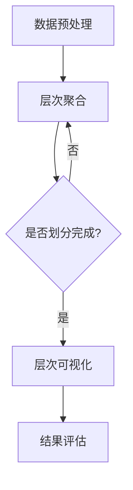
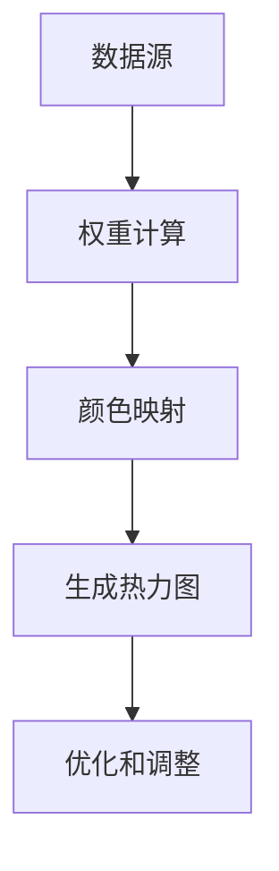

                 

### 1.1.3 数据可视化的应用领域

数据可视化在各个领域都展现了其独特的价值。在科学研究中，数据可视化使得复杂数据变得直观易懂，有助于发现数据中的模式、趋势和关联。例如，在生物学研究中，通过数据可视化可以更好地理解基因表达模式；在物理学中，可视化技术帮助科学家们更深入地研究量子力学和相对论等复杂理论。

在商业领域，数据可视化被广泛应用于市场分析、客户行为研究、供应链管理等方面。企业可以利用数据可视化工具，将庞大的数据集转化为易于理解的图表，从而快速识别关键信息，做出更明智的决策。例如，通过可视化分析客户购买行为，企业可以优化营销策略，提高销售业绩。

在医学领域，数据可视化技术同样具有重要意义。通过将医学图像、基因序列等信息可视化，医生可以更准确地诊断疾病，制定治疗方案。例如，在癌症诊断中，通过可视化技术可以更清晰地展示肿瘤的位置、大小和形态，帮助医生制定更精准的手术方案。

在环境科学中，数据可视化有助于监测和分析环境变化，如气候变化、空气质量等。通过可视化技术，科学家可以更直观地展示环境数据，提高公众对环境问题的认识，促进环境保护。

此外，数据可视化在公共安全、交通管理、城市规划等领域也发挥着重要作用。例如，通过交通流量可视化，城市管理者可以更有效地规划和调整交通路线，减少交通拥堵。

总之，数据可视化作为一门跨学科的技术，其应用范围广泛，不仅在科学研究中发挥着关键作用，也为商业决策、医疗诊断、环境保护等领域提供了有力的支持。随着技术的不断进步，数据可视化将在更多领域展现其独特的价值。


### 1.2.2 宇宙结构的层次与演化

宇宙结构具有多层次和复杂的演化过程，从宏观到微观，从宇宙大尺度到微观粒子的尺度，都存在着不同的层次和结构。

在宇宙学中，通常将宇宙结构划分为以下几个层次：

1. **宇宙大尺度结构**：这是指宇宙中的星系、星系团和超星系团等大尺度结构。通过宇宙微波背景辐射和星系分布的观测，科学家们发现了宇宙的大尺度结构具有网络状的特征，星系团和超星系团沿着巨大的空洞和墙状结构分布。

2. **星系结构**：星系是由恒星、行星、星云、星际介质等多种天体组成的庞大系统。星系结构通常可以分为核心区、盘面和晕区。核心区通常是恒星密集、质量巨大的区域，而盘面则包含了大量的恒星、行星和星际物质，晕区则是外围的稀疏区域。

3. **星团结构**：星团是由数十到数千颗恒星组成的紧密群体。星团可以分为球状星团和疏散星团，球状星团通常位于星系的中心区域，而疏散星团则分布在星系的盘面和晕区。

4. **行星系统结构**：行星系统是围绕恒星运行的天体系统，其中包含行星、卫星、小行星、彗星等。行星系统的结构复杂多样，有些行星系统具有类似太阳系的结构，而有些则具有独特的特性。

5. **恒星内部结构**：恒星是宇宙中最常见的天体，其内部结构分为核心区、辐射区和对流区。恒星通过核聚变反应产生能量，并维持恒星的稳定状态。

6. **行星际物质**：行星际物质包括星际尘埃、行星际介质、行星环等。这些物质在行星系统中起着重要的作用，如保护行星表面免受太阳辐射的影响，影响行星的气候和环境。

7. **宇宙微波背景辐射**：宇宙微波背景辐射是宇宙早期的余晖，它揭示了宇宙早期的状态和演化过程。通过分析宇宙微波背景辐射的分布和特征，科学家们可以了解宇宙的起源和演化。

宇宙结构的演化是一个漫长的过程，从宇宙大爆炸开始，宇宙经历了膨胀、冷却和物质聚集的过程。在这个过程中，恒星和星系形成，物质通过引力相互作用不断聚集，形成了复杂的大尺度结构。宇宙结构的演化受到多种因素的影响，包括引力、辐射压力、磁场等。

通过数据可视化技术，科学家们可以更好地理解和呈现宇宙结构的复杂性和演化过程。例如，通过三维可视化技术，可以更直观地展示宇宙大尺度结构的网络状特征；通过动态可视化技术，可以模拟恒星和星系的演化过程，揭示宇宙的奥秘。

总之，宇宙结构的多层次和复杂演化过程为我们提供了丰富的研究领域，数据可视化技术在宇宙学中的应用，不仅有助于我们更好地理解宇宙的奥秘，也为科学研究和探索提供了有力的工具。随着技术的不断进步，我们有理由相信，未来我们将能够更加深入地揭示宇宙的结构和演化规律。


### 2.1.1 层次化缩放算法原理

层次化缩放（Hierarchical Agglomeration）是一种常用的数据可视化算法，用于处理大规模数据集，通过将数据分层组织，从而实现数据的层次化展示。层次化缩放算法的核心思想是将数据集分解为多个层次，每个层次代表数据的子集，通过逐步缩放和聚合来降低数据复杂性，使得用户能够更直观地理解数据结构和模式。

**算法原理：**

1. **数据预处理**：首先，对原始数据进行预处理，包括数据清洗、数据转换和数据标准化等步骤。预处理后的数据将被组织成适当的格式，以便进行层次化缩放。

2. **层次划分**：层次划分是层次化缩放算法的关键步骤，其主要目的是将数据划分为多个层次。划分方法有多种，如基于密度的划分、基于距离的划分、基于密度的聚类等。划分过程中，通常需要确定层次划分的参数，如阈值、聚类数量等。

3. **层次可视化**：在层次划分完成后，对每个层次的数据进行可视化处理。可视化方法的选择取决于数据类型和可视化目标。常见的可视化方法包括树状图、热力图、散点图等。

4. **层次聚合**：在完成当前层次的可视化后，将当前层次的数据进行聚合，形成更高层次的数据集。聚合过程通常涉及数据统计和简化操作，如计算平均值、最大值、最小值等。

5. **结果评估**：评估层次化缩放算法的效果，主要关注可视化的准确性和易用性。评估方法包括用户满意度调查、可视化效果比较等。

**Mermaid流程图：**



通过上述流程图，可以清晰地展示层次化缩放算法的执行步骤和逻辑关系。层次化缩放算法不仅适用于大规模数据集的可视化，还可以提高数据的可读性和可操作性，帮助用户更好地理解数据结构和模式。

### 2.1.2 层次化缩放算法的伪代码实现

层次化缩放算法的伪代码实现如下：

```python
# 伪代码

def 层次化缩放(data):
    # 数据预处理
    data = 预处理数据(data)

    # 初始化层次结构
    layers = []

    # 循环进行层次划分和聚合
    while not 划分完成(data):
        # 层次划分
        layer = 划分层(data)

        # 更新数据
        data = 更新数据(data, layer)

        # 记录层次
        layers.append(layer)

    # 层次可视化
    for layer in layers:
        可视化层次(layer)

    # 结果评估
    评估结果(layers)
```

在上述伪代码中，`预处理数据`、`划分层`、`更新数据`、`可视化层次`和`评估结果`是层次化缩放算法的核心函数。具体实现时，这些函数需要根据具体的数据类型和可视化目标进行设计。

1. **预处理数据**：该函数负责对原始数据进行清洗、转换和标准化等操作，以便进行层次化缩放。具体实现时，可以根据数据的特点选择不同的预处理方法。

2. **划分层**：该函数负责将当前层次的数据划分为子集。划分方法可以根据数据的分布特征和用户需求进行选择，如基于密度的划分、基于距离的划分等。

3. **更新数据**：该函数负责将当前层次的数据聚合为更高层次的数据集。更新方法通常涉及数据统计和简化操作，如计算平均值、最大值、最小值等。

4. **可视化层次**：该函数负责对每个层次的数据进行可视化处理。可视化方法的选择取决于数据类型和可视化目标，如树状图、热力图、散点图等。

5. **评估结果**：该函数负责评估层次化缩放算法的效果，主要关注可视化的准确性和易用性。评估方法包括用户满意度调查、可视化效果比较等。

通过上述伪代码，可以清晰地展示层次化缩放算法的执行流程和核心操作，为具体实现提供参考。

### 2.2.1 热力图生成算法原理

热力图（Heatmap）是一种常用的数据可视化技术，通过颜色深浅来表示数据的大小或密度，从而直观地展示数据的热点分布和模式。热力图在数据分析和决策支持中具有重要的应用价值，特别是在处理大规模数据集和复杂数据结构时。

**算法原理：**

1. **数据源**：热力图的生成依赖于一个二维或三维的数据源。通常，这个数据源是一个矩阵或张量，其中每个元素代表一个数据点或数据值。

2. **权重计算**：计算数据点的权重是生成热力图的关键步骤。权重可以基于数据的数值大小、出现频率或其他统计指标。例如，在地理信息系统中，可以基于人口密度、交通流量或土地利用类型来计算每个单元格的权重。

3. **颜色映射**：将计算得到的权重映射到颜色上，通常采用线性或非线性映射关系。颜色映射的目的是使数据的热点分布更加直观和易于理解。常用的颜色映射方法包括颜色条、颜色渐变、颜色散点图等。

4. **生成热力图**：根据权重和颜色映射关系，生成热力图。热力图通常是一个二维的网格图，其中每个单元格的颜色反映了其权重的大小。通过这种直观的方式，用户可以快速识别数据中的热点和趋势。

5. **优化和调整**：生成初始热力图后，可以根据用户需求和可视化目标对热力图进行优化和调整。优化方法包括调整颜色映射范围、显示透明度、添加标注和图例等。

**Mermaid流程图：**



通过上述流程图，可以清晰地展示热力图生成算法的主要步骤和逻辑关系。热力图生成算法不仅适用于地理信息数据，还在金融分析、市场营销、生物信息学等领域得到了广泛应用。

### 2.2.2 热力图生成算法的伪代码实现

热力图生成算法的伪代码实现如下：

```python
# 伪代码

def 生成热力图(data):
    # 计算权重
    weights = 计算权重(data)

    # 设置颜色映射
    color_map = 设置颜色映射()

    # 初始化热力图
    heatmap = 初始化热力图()

    # 根据权重和颜色映射生成热力图
    for cell in data:
        color = color_map[weights[cell]]
        heatmap.update(cell, color)

    # 优化和调整热力图
    heatmap = 优化和调整(heatmap)

    # 返回最终热力图
    return heatmap
```

在上述伪代码中，`计算权重`、`设置颜色映射`、`初始化热力图`、`根据权重和颜色映射生成热力图`和`优化和调整`是热力图生成算法的核心函数。具体实现时，这些函数需要根据具体的数据类型和可视化目标进行设计。

1. **计算权重**：该函数负责计算数据点的权重。权重可以根据数据的数值大小、出现频率或其他统计指标进行计算。例如，可以基于人口密度或交通流量计算每个单元格的权重。

2. **设置颜色映射**：该函数负责定义颜色映射关系，将权重映射到颜色上。常用的颜色映射方法包括线性映射、非线性映射等。

3. **初始化热力图**：该函数负责创建一个空的热力图数据结构，通常是一个二维数组或矩阵。

4. **根据权重和颜色映射生成热力图**：该函数负责将计算得到的权重和颜色映射应用到热力图上，生成最终的热力图图像。

5. **优化和调整**：该函数负责对热力图进行优化和调整，如调整颜色映射范围、显示透明度、添加标注和图例等。

通过上述伪代码，可以清晰地展示热力图生成算法的执行流程和核心操作，为具体实现提供参考。


### 2.3.1 Python可视化库

在数据可视化领域，Python凭借其丰富的库和强大的功能，成为开发者们的首选工具之一。Python的可视化库众多，其中最为常用的包括Matplotlib、Seaborn和Plotly等。这些库提供了丰富的绘图功能，支持多种数据格式和图表类型，可以帮助开发者轻松地创建高质量的可视化图表。

**Matplotlib**：

Matplotlib是Python中最为常用的数据可视化库之一，它具有简单易用、功能强大、灵活性高和社区支持广泛等特点。Matplotlib支持多种图表类型，包括折线图、柱状图、散点图、饼图、箱线图等。通过Matplotlib，开发者可以轻松创建复杂的可视化图表，并且可以自定义图表的各个方面，如颜色、线型、字体等。

**安装与导入**：

要使用Matplotlib，首先需要安装该库。安装过程非常简单，可以使用pip命令进行安装：

```bash
pip install matplotlib
```

安装完成后，在Python脚本中导入Matplotlib库：

```python
import matplotlib.pyplot as plt
```

**基本用法**：

下面是一个使用Matplotlib创建折线图的示例：

```python
import matplotlib.pyplot as plt

# 数据
x = [0, 1, 2, 3, 4]
y = [0, 1, 4, 9, 16]

# 创建图表
plt.plot(x, y)

# 添加标题和标签
plt.title('折线图示例')
plt.xlabel('x轴')
plt.ylabel('y轴')

# 显示图表
plt.show()
```

**高级特性**：

Matplotlib提供了丰富的高级特性，如自定义颜色、线型、标记、注释等。以下是一个示例，展示了如何使用不同颜色和线型创建一个包含多条曲线的图表：

```python
import matplotlib.pyplot as plt

# 数据
x = [0, 1, 2, 3, 4]
y1 = [0, 1, 4, 9, 16]
y2 = [1, 2, 5, 10, 17]

# 创建图表
plt.plot(x, y1, label='线1', color='blue', linewidth=2)
plt.plot(x, y2, label='线2', color='red', linestyle='--')

# 添加标题和标签
plt.title('多曲线图示例')
plt.xlabel('x轴')
plt.ylabel('y轴')

# 添加图例
plt.legend()

# 显示图表
plt.show()
```

**Seaborn**：

Seaborn是建立在Matplotlib之上的高级可视化库，它提供了更加美观和易于定制的统计图表。Seaborn的主要特点包括色彩丰富、图表布局整齐、易于扩展和高度可配置。Seaborn支持多种类型的图表，如箱线图、散点图、条形图、点图等，并且内置了多种颜色调色板，使图表更加吸引人。

**安装与导入**：

要使用Seaborn，首先需要安装该库：

```bash
pip install seaborn
```

安装完成后，在Python脚本中导入Seaborn库：

```python
import seaborn as sns
```

**基本用法**：

以下是一个使用Seaborn创建散点图的示例：

```python
import seaborn as sns
import pandas as pd

# 创建数据集
data = pd.DataFrame({
    'x': [0, 1, 2, 3, 4],
    'y': [0, 1, 4, 9, 16]
})

# 创建散点图
sns.scatterplot(x='x', y='y', data=data)

# 添加标题和标签
sns.title('散点图示例')
sns.xlabel('x轴')
sns.ylabel('y轴')

# 显示图表
sns.show()
```

**高级特性**：

Seaborn提供了多种高级特性，如自定义颜色、调整布局、添加统计指标等。以下是一个示例，展示了如何使用Seaborn创建一个带有统计指标的箱线图：

```python
import seaborn as sns
import pandas as pd

# 创建数据集
data = pd.DataFrame({
    'class': ['A', 'B', 'C'],
    'value': [2, 4, 6]
})

# 创建箱线图
sns.boxplot(x='class', y='value', data=data)

# 添加标题和标签
sns.title('箱线图示例')
sns.xlabel('类别')
sns.ylabel('值')

# 显示图表
sns.show()
```

**Plotly**：

Plotly是一个交互式图表库，提供了丰富的图表类型和交互功能。Plotly的图表具有高可定制性和良好的性能，适用于创建复杂和动态的交互式图表。Plotly支持多种编程语言，包括Python、R和JavaScript等。

**安装与导入**：

要使用Plotly，首先需要安装该库：

```bash
pip install plotly
```

安装完成后，在Python脚本中导入Plotly库：

```python
import plotly.express as px
```

**基本用法**：

以下是一个使用Plotly创建折线图的示例：

```python
import plotly.express as px

# 数据
x = [0, 1, 2, 3, 4]
y = [0, 1, 4, 9, 16]

# 创建折线图
fig = px.line(x=x, y=y)

# 更新图表布局
fig.update_layout(title='折线图示例', xaxis_title='x轴', yaxis_title='y轴')

# 显示图表
fig.show()
```

**高级特性**：

Plotly提供了多种高级特性，如添加交互元素、自定义图表样式、导出图表等。以下是一个示例，展示了如何使用Plotly创建一个带有交互元素的散点图：

```python
import plotly.express as px

# 数据
df = px.data.tips()

# 创建散点图
fig = px.scatter(df, x='total_bill', y='tip', color='size', size='size')

# 添加交互元素
fig.update_layout(hovermode='closest')

# 显示图表
fig.show()
```

通过上述示例，可以看出Python的可视化库具有丰富的功能和高灵活性，能够满足各种数据可视化需求。无论是简单的图表展示还是复杂的交互式图表，Python的可视化库都能够提供强有力的支持。开发者在选择和使用可视化库时，可以根据具体需求和技术背景进行灵活选择和组合，实现高效的数据可视化。


### 4.1.1 Matplotlib的基本用法

Matplotlib是Python中用于数据可视化最为流行的库之一，其强大的功能和易用的接口使得开发者可以轻松创建各种类型的图表。以下是Matplotlib的基本用法，包括创建图表、添加标题和标签、调整样式等。

#### 创建图表

要使用Matplotlib创建一个基本的图表，首先需要导入Matplotlib库：

```python
import matplotlib.pyplot as plt
```

然后，准备数据。以下是一个简单的示例：

```python
x = [0, 1, 2, 3, 4]
y = [0, 1, 4, 9, 16]
```

接下来，使用`plt.plot()`函数创建一个折线图：

```python
plt.plot(x, y)
```

这条命令将生成一个基于x和y数据的折线图。默认情况下，图表将自动显示。

#### 添加标题和标签

为了使图表更加清晰易懂，我们可以添加标题和坐标轴标签：

```python
plt.title('折线图示例')
plt.xlabel('x轴')
plt.ylabel('y轴')
```

通过上述代码，图表将包含一个标题和x轴、y轴的标签。

#### 调整样式

Matplotlib提供了丰富的样式调整选项，包括线型、颜色、标记样式等。以下是一个示例，展示如何调整图表的样式：

```python
plt.plot(x, y, label='线1', color='blue', linewidth=2, marker='o', markersize=6)
plt.plot(x, [x**2 for x in x], label='线2', color='red', linestyle='--')
```

上述代码中，`label`用于添加图例，`color`和`linewidth`用于设置线颜色和宽度，`marker`和`markersize`用于设置标记样式和大小。

#### 显示图表

最后，使用`plt.show()`命令显示图表：

```python
plt.show()
```

完整示例：

```python
import matplotlib.pyplot as plt

# 数据
x = [0, 1, 2, 3, 4]
y1 = [0, 1, 4, 9, 16]
y2 = [x**2 for x in x]

# 创建图表
plt.plot(x, y1, label='线1', color='blue', linewidth=2, marker='o', markersize=6)
plt.plot(x, y2, label='线2', color='red', linestyle='--')

# 添加标题和标签
plt.title('多曲线图示例')
plt.xlabel('x轴')
plt.ylabel('y轴')

# 添加图例
plt.legend()

# 显示图表
plt.show()
```

通过以上步骤，我们可以创建一个包含多条曲线、标题、标签和图例的图表。Matplotlib的灵活性和易用性使得它在数据可视化领域得到了广泛应用。

### 4.1.2 Matplotlib的高级特性

Matplotlib作为Python中最为广泛使用的可视化库之一，其高级特性使得开发者可以创建更加复杂和定制化的图表。以下将介绍Matplotlib的一些高级特性，包括自定义颜色、线型、标记样式、调整图例和坐标系等。

#### 自定义颜色

在Matplotlib中，我们可以通过指定颜色参数来自定义图表的颜色。颜色可以采用RGB值、十六进制颜色代码、颜色名称或HTML颜色代码等。

```python
import matplotlib.pyplot as plt

x = [0, 1, 2, 3, 4]
y1 = [0, 1, 4, 9, 16]
y2 = [x**2 for x in x]

plt.plot(x, y1, color='#1f77b4', label='线1')  # 十六进制颜色代码
plt.plot(x, y2, color='blue', label='线2')     # 颜色名称
plt.plot(x, [x**3 for x in x], color='rgb(0.85, 0.17, 0.49)', label='线3')  # RGB值

plt.legend()
plt.show()
```

#### 线型

线型可以通过`linestyle`参数进行自定义，包括实线、虚线、点线等。

```python
import matplotlib.pyplot as plt

x = [0, 1, 2, 3, 4]
y1 = [0, 1, 4, 9, 16]
y2 = [x**2 for x in x]
y3 = [x**3 for x in x]

plt.plot(x, y1, linestyle='-', label='线1')  # 实线
plt.plot(x, y2, linestyle='--', label='线2')  # 虚线
plt.plot(x, y3, linestyle=':', label='线3')  # 点线

plt.legend()
plt.show()
```

#### 标记样式

标记样式可以通过`marker`参数进行自定义，包括圆形、方形、星形等。

```python
import matplotlib.pyplot as plt

x = [0, 1, 2, 3, 4]
y1 = [0, 1, 4, 9, 16]
y2 = [x**2 for x in x]
y3 = [x**3 for x in x]

plt.plot(x, y1, marker='o', label='线1')  # 圆形标记
plt.plot(x, y2, marker='s', label='线2')  # 方形标记
plt.plot(x, y3, marker='*', label='线3')  # 星形标记

plt.legend()
plt.show()
```

#### 调整图例

图例可以通过`legend`方法进行自定义，包括位置、样式、字体等。

```python
import matplotlib.pyplot as plt

x = [0, 1, 2, 3, 4]
y1 = [0, 1, 4, 9, 16]
y2 = [x**2 for x in x]
y3 = [x**3 for x in x]

plt.plot(x, y1, label='线1')
plt.plot(x, y2, label='线2')
plt.plot(x, y3, label='线3')

# 设置图例位置和样式
plt.legend(loc='upper right', frameon=False, title='图例')

plt.show()
```

#### 调整坐标系

Matplotlib允许我们通过`axis`方法调整坐标系，包括设置坐标范围、网格线等。

```python
import matplotlib.pyplot as plt

x = [0, 1, 2, 3, 4]
y1 = [0, 1, 4, 9, 16]
y2 = [x**2 for x in x]
y3 = [x**3 for x in x]

plt.plot(x, y1, label='线1')
plt.plot(x, y2, label='线2')
plt.plot(x, y3, label='线3')

# 设置坐标范围
plt.axis([0, 5, 0, 20])

# 显示网格线
plt.grid(True)

# 设置标题和标签
plt.title('多曲线图示例')
plt.xlabel('x轴')
plt.ylabel('y轴')

plt.legend()
plt.show()
```

通过上述高级特性，我们可以创建出更加专业和定制化的图表，满足不同场景下的需求。Matplotlib的强大功能使得它在数据科学、工程学、金融分析等多个领域得到了广泛应用。


### 4.1.3 Seaborn的基本用法

Seaborn是建立在Matplotlib之上的高级可视化库，以其美观、易于定制和强大的功能，在数据可视化领域受到广泛欢迎。以下是Seaborn的基本用法，包括创建散点图、条形图和箱线图等。

#### 创建散点图

散点图是数据可视化中常用的一种图表类型，用于展示两个变量之间的关系。以下是一个简单的Seaborn散点图示例：

```python
import seaborn as sns
import pandas as pd

# 创建一个示例数据集
data = pd.DataFrame({
    'x': [1, 2, 3, 4, 5],
    'y': [2, 3, 5, 7, 11]
})

# 创建散点图
sns.scatterplot(x='x', y='y', data=data)

# 添加标题
sns.title('散点图示例')

# 显示图表
sns.show()
```

#### 创建条形图

条形图用于比较不同类别的数值大小，以下是一个简单的Seaborn条形图示例：

```python
import seaborn as sns
import pandas as pd

# 创建一个示例数据集
data = pd.DataFrame({
    '类别': ['A', 'B', 'C', 'D'],
    '值': [10, 20, 15, 5]
})

# 创建条形图
sns.barplot(x='类别', y='值', data=data)

# 添加标题
sns.title('条形图示例')

# 显示图表
sns.show()
```

#### 创建箱线图

箱线图用于展示一组数据的分布情况，包括最大值、最小值、中位数和四分位数。以下是一个简单的Seaborn箱线图示例：

```python
import seaborn as sns
import pandas as pd

# 创建一个示例数据集
data = pd.DataFrame({
    '数据1': [1, 2, 2, 3, 4, 5, 6, 7, 8, 9],
    '数据2': [9, 8, 7, 6, 5, 4, 3, 2, 1, 0]
})

# 创建箱线图
sns.boxplot(x='数据1', y='数据2', data=data)

# 添加标题
sns.title('箱线图示例')

# 显示图表
sns.show()
```

通过以上示例，我们可以看到Seaborn的基本用法非常简单，它提供了丰富的图表类型和自定义选项，使得数据可视化变得更加高效和美观。接下来，我们将探讨如何使用Seaborn的高级特性来创建更加复杂的图表。


### 4.1.4 Seaborn的高级特性

Seaborn作为Matplotlib的扩展库，以其美观的图表样式和强大的数据可视化功能在数据科学领域受到广泛欢迎。在了解其基本用法后，我们将深入探讨Seaborn的高级特性，包括自定义颜色调色板、调整布局和添加统计指标等。

#### 自定义颜色调色板

Seaborn提供了多种预定义的颜色调色板，这些调色板可以在创建图表时直接使用，使图表更加美观。此外，用户还可以自定义颜色调色板。

```python
import seaborn as sns
import pandas as pd

# 创建示例数据集
data = pd.DataFrame({
    '类别': ['A', 'B', 'C', 'D'],
    '值': [10, 20, 15, 5]
})

# 使用Seaborn的默认颜色调色板
sns.barplot(x='类别', y='值', data=data)
sns.title('默认颜色调色板示例')
sns.show()

# 使用自定义颜色调色板
custom_palette = {'A': '#1f77b4', 'B': '#ff7f0e', 'C': '#2ca02c', 'D': '#d62728'}
sns.barplot(x='类别', y='值', data=data, palette=custom_palette)
sns.title('自定义颜色调色板示例')
sns.show()
```

通过以上代码，我们可以看到如何使用Seaborn的默认颜色调色板和自定义颜色调色板来美化图表。

#### 调整布局

Seaborn提供了多种布局选项，允许用户根据需要调整图表的布局。以下是一个示例，展示了如何使用`sns.set()`函数和`sns.lmplot()`函数来调整布局。

```python
import seaborn as sns
import pandas as pd

# 创建示例数据集
data = pd.DataFrame({
    '年龄': [25, 30, 35, 40, 45],
    '收入': [50000, 60000, 70000, 80000, 90000],
})

# 调整全局布局
sns.set(style="whitegrid")
sns.lmplot(x="年龄", y="收入", data=data)

# 设置标题和标签
sns.title('线性回归布局示例')
sns.xlabel('年龄')
sns.ylabel('收入')

# 显示图表
sns.show()
```

通过以上代码，我们可以看到如何通过调整全局布局和图表的细节来创建更加专业和美观的图表。

#### 添加统计指标

Seaborn允许用户在图表中添加各种统计指标，如均值、置信区间、回归线等。以下是一个示例，展示了如何在散点图中添加回归线。

```python
import seaborn as sns
import pandas as pd

# 创建示例数据集
data = pd.DataFrame({
    '年龄': [25, 30, 35, 40, 45],
    '收入': [50000, 60000, 70000, 80000, 90000],
})

# 创建散点图并添加回归线
sns.regplot(x="年龄", y="收入", data=data)

# 设置标题和标签
sns.title('回归线示例')
sns.xlabel('年龄')
sns.ylabel('收入')

# 显示图表
sns.show()
```

通过以上代码，我们可以看到如何在图表中添加回归线，从而更好地理解变量之间的关系。

通过掌握Seaborn的高级特性，开发者可以创建出更加专业和定制化的图表，满足不同数据分析和可视化的需求。


### 4.1.5 Plotly的基本用法

Plotly是一个交互式图表库，它提供了丰富的图表类型和强大的交互功能，使得开发者可以创建高度定制化和交互式的可视化图表。在Python中，Plotly通过`plotly.express`模块提供了一系列便捷的函数来创建图表。以下将介绍Plotly的基本用法，包括创建折线图、散点图和条形图等。

#### 创建折线图

以下是一个使用Plotly创建简单折线图的示例：

```python
import plotly.express as px
import pandas as pd

# 创建示例数据集
data = pd.DataFrame({
    'x': [1, 2, 3, 4, 5],
    'y': [2, 3, 5, 7, 11]
})

# 创建折线图
fig = px.line(data, x='x', y='y', title='折线图示例')

# 更新图表布局
fig.update_layout(
    xaxis_title='x轴',
    yaxis_title='y轴',
    legend_title='数据系列',
)

# 显示图表
fig.show()
```

#### 创建散点图

以下是一个使用Plotly创建简单散点图的示例：

```python
import plotly.express as px
import pandas as pd

# 创建示例数据集
data = pd.DataFrame({
    'x': [1, 2, 3, 4, 5],
    'y': [2, 3, 5, 7, 11]
})

# 创建散点图
fig = px.scatter(data, x='x', y='y', title='散点图示例')

# 更新图表布局
fig.update_layout(
    xaxis_title='x轴',
    yaxis_title='y轴',
    legend_title='数据系列',
)

# 显示图表
fig.show()
```

#### 创建条形图

以下是一个使用Plotly创建简单条形图的示例：

```python
import plotly.express as px
import pandas as pd

# 创建示例数据集
data = pd.DataFrame({
    '类别': ['A', 'B', 'C', 'D'],
    '值': [10, 20, 15, 5]
})

# 创建条形图
fig = px.bar(data, x='类别', y='值', title='条形图示例')

# 更新图表布局
fig.update_layout(
    xaxis_title='类别',
    yaxis_title='值',
    legend_title='数据系列',
)

# 显示图表
fig.show()
```

通过以上示例，我们可以看到如何使用Plotly创建基本图表，并对其进行简单的布局调整。Plotly的交互功能使得用户可以与图表进行互动，例如缩放、平移和旋转等，从而更好地理解和分析数据。

接下来，我们将介绍如何使用Plotly的高级特性来创建更加复杂和定制的图表。


### 4.1.6 Plotly的高级特性

Plotly作为一款交互式图表库，具有丰富的高级特性，使得开发者可以创建出高度定制化和交互性的图表。以下将介绍Plotly的高级特性，包括创建交互式图表、添加交互元素、自定义图表样式和导出图表等。

#### 创建交互式图表

Plotly的交互式图表使得用户可以在浏览器中与图表进行互动，如缩放、平移和旋转等。以下是一个简单的交互式散点图示例：

```python
import plotly.express as px
import pandas as pd

# 创建示例数据集
data = pd.DataFrame({
    'x': [1, 2, 3, 4, 5],
    'y': [2, 3, 5, 7, 11]
})

# 创建交互式散点图
fig = px.scatter(data, x='x', y='y', title='交互式散点图示例', hover_data=['x', 'y'])

# 更新图表布局
fig.update_layout(
    xaxis_title='x轴',
    yaxis_title='y轴',
    legend_title='数据系列',
)

# 显示交互式图表
fig.show()
```

通过上述代码，我们可以看到用户可以在图表上进行缩放和平移操作，从而更好地查看数据细节。

#### 添加交互元素

Plotly允许用户在图表中添加交互元素，如按钮、滑块和菜单等，以增强图表的交互性。以下是一个示例，展示如何添加一个按钮来更新图表：

```python
import plotly.graph_objects as go
import pandas as pd

# 创建示例数据集
data = pd.DataFrame({
    'x': [1, 2, 3, 4, 5],
    'y': [2, 3, 5, 7, 11]
})

# 创建基础图表
fig = go.Figure(data=[go.Scatter(x=data['x'], y=data['y'], mode='markers')])

# 添加交互式按钮
fig.update_layout(
    updatemenus=[
        dict(
            buttons=list([
                dict(
                    label='重置',
                    method='relayout',
                    args=['layout', {'yaxis': {'range': [-5, 15]}}]
                ),
                dict(
                    label='放大',
                    method='update',
                    args=[
                        {'yaxis': {'range': [-1, 12]}}
                    ],
                ),
                dict(
                    label='缩小',
                    method='update',
                    args=[
                        {'yaxis': {'range': [-10, 20]}}
                    ],
                ),
            ]),
            orientation='h',
            x=0.1,
            xanchor='left',
            y=1.1,
            yanchor='top',
        ),
    ]
)

# 显示交互式图表
fig.show()
```

通过这个示例，我们可以看到如何添加一个按钮来更新图表的y轴范围，从而实现动态交互。

#### 自定义图表样式

Plotly允许用户自定义图表的样式，包括颜色、字体、线型和标记样式等。以下是一个示例，展示如何自定义图表样式：

```python
import plotly.express as px
import pandas as pd

# 创建示例数据集
data = pd.DataFrame({
    '类别': ['A', 'B', 'C', 'D'],
    '值': [10, 20, 15, 5]
})

# 创建条形图，并自定义样式
fig = px.bar(data, x='类别', y='值', title='自定义样式条形图示例',
             color='值', text='值', width=800, height=600,
             marker_color='值', marker_line_color='white', marker_line_width=2)

# 更新图表布局
fig.update_layout(
    xaxis_title='类别',
    yaxis_title='值',
    font=dict(size=14, color='black'),
    plot_bgcolor='white',
    paper_bgcolor='white',
)

# 显示图表
fig.show()
```

通过上述代码，我们可以看到如何自定义图表的颜色、字体和标记样式，从而创建出独特的视觉效果。

#### 导出图表

Plotly提供了多种方式来导出图表，包括导出为图片文件或HTML文件。以下是一个示例，展示如何导出图表为图片文件：

```python
import plotly.express as px
import pandas as pd

# 创建示例数据集
data = pd.DataFrame({
    '类别': ['A', 'B', 'C', 'D'],
    '值': [10, 20, 15, 5]
})

# 创建条形图
fig = px.bar(data, x='类别', y='值', title='导出图表示例')

# 更新图表布局
fig.update_layout(
    xaxis_title='类别',
    yaxis_title='值',
)

# 导出图表为图片文件
fig.write_image("bar_chart.png")

# 显示图表
fig.show()
```

通过上述代码，我们可以将图表导出为图片文件，便于后续使用或分享。

通过掌握Plotly的高级特性，开发者可以创建出高度定制化和交互性的图表，满足各种数据可视化的需求。这些特性不仅提升了图表的视觉效果，还增强了用户与图表的互动体验。


### 5.1 星系可视化

星系是宇宙中最基本的结构单位之一，由大量恒星、行星、星云和其他星际物质组成。可视化星系结构不仅有助于我们更好地理解宇宙的复杂性和演化过程，还能为天文学家提供直观的工具，以便研究和分析星系的特性。本节将介绍星系可视化的背景、核心概念和常用方法。

#### 背景介绍

随着天文观测技术的不断发展，我们能够探测到的星系数量和种类不断增多。然而，这些星系的数据通常非常庞大且复杂，难以通过传统的文本方式进行分析。因此，数据可视化成为了天文学家研究星系的重要工具。通过可视化技术，科学家们可以更直观地展示星系的分布、结构、运动状态和演化过程。

#### 核心概念

1. **星系结构**：星系通常包含一个中心核、一个旋转盘面和一个围绕盘面旋转的晕。这些结构通过引力相互作用维持在一起。

2. **星系分类**：根据星系的大小、形状和结构，天文学家将星系分为不同类型，如椭圆星系、螺旋星系和不规则星系等。

3. **星系演化**：星系的演化过程涉及恒星的形成与消亡、星际物质的流动和能量转换等复杂过程。

#### 常用方法

1. **二维可视化**：通过将三维数据投影到二维平面上，我们可以创建星系的二维图像。常见的二维可视化方法包括散点图、热力图和轮廓图等。

2. **三维可视化**：三维可视化可以更直观地展示星系的空间结构。常用的三维可视化工具包括OpenGL、VTK和Mayavi等。

3. **交互式可视化**：交互式可视化工具如Plotly和D3.js等，允许用户通过鼠标操作（如缩放、旋转和平移）来探索星系的细节。

4. **动态可视化**：通过动画技术，我们可以展示星系的演化过程，帮助用户更直观地理解星系的演化规律。

#### 实例分析

以下是一个简单的星系可视化实例，使用Python中的`matplotlib`库创建星系的散点图：

```python
import matplotlib.pyplot as plt
import numpy as np

# 创建示例星系数据
x = np.random.uniform(-100, 100, 1000)
y = np.random.uniform(-100, 100, 1000)
z = np.random.uniform(-100, 100, 1000)

# 创建散点图
plt.scatter(x, y, c=z, cmap='hot', marker='o')

# 设置标题和标签
plt.title('星系散点图示例')
plt.xlabel('x坐标')
plt.ylabel('y坐标')

# 显示坐标网格
plt.grid(True)

# 显示图表
plt.show()
```

在这个示例中，我们生成了包含1000个随机点的星系数据，并通过颜色映射展示了这些点的空间分布。通过调整颜色映射和标记样式，我们可以创建出更加逼真的星系可视化图像。

通过星系可视化技术，天文学家可以更好地理解宇宙的结构和演化过程，为科学研究提供有力支持。随着技术的不断进步，我们有理由相信，未来我们将能够更加深入地揭示宇宙的奥秘。


### 5.2 宇宙大尺度结构可视化

宇宙大尺度结构是指宇宙中宏观天体的大规模分布，包括星系、星系团和超星系团等。这些结构在宇宙学研究中扮演着关键角色，帮助我们理解宇宙的起源、演化以及宇宙的动力学特性。通过可视化技术，我们可以将复杂的天文数据转化为直观的图像，从而更好地揭示宇宙的大尺度结构。

#### 背景介绍

宇宙的大尺度结构主要通过天文学家观测到的星系分布来描述。在宇宙微波背景辐射的观测中，天文学家发现了宇宙中的大规模空洞和墙状结构，这些结构构成了宇宙的网络状结构。通过研究这些结构，我们可以了解宇宙的早期状态以及宇宙的演化过程。

#### 核心概念

1. **星系团**：由数十到数千个星系组成的巨大结构，通过引力相互作用维持在一起。

2. **超星系团**：由多个星系团组成的更大规模的结构，通常跨越数亿光年。

3. **空洞**：宇宙中的低密度区域，通常由大量星系团之间的空隙组成。

4. **墙状结构**：宇宙中的高密度区域，由大量星系和星系团沿特定方向排列而成。

#### 可视化方法

1. **散点图**：通过将星系的位置数据绘制在二维或三维空间中，我们可以直观地展示星系的分布。

2. **热力图**：通过颜色映射技术，我们可以将星系的密度分布以颜色深浅的方式展示出来。

3. **流图**：流图可以展示星系之间的运动方向和速度，帮助我们理解宇宙中的流动态。

4. **层次化缩放**：通过将大尺度结构分层展示，我们可以更清晰地看到宇宙结构的层次性。

#### 实例分析

以下是一个简单的宇宙大尺度结构可视化实例，使用Python中的`matplotlib`和`seaborn`库创建热力图：

```python
import matplotlib.pyplot as plt
import seaborn as sns
import pandas as pd
import numpy as np

# 创建示例星系数据
data = pd.DataFrame({
    'x': np.random.uniform(-1000, 1000, 1000),
    'y': np.random.uniform(-1000, 1000, 1000),
    'density': np.random.uniform(0, 10, 1000)
})

# 创建热力图
sns.set_theme(style="whitegrid")
g = sns.kdeplot(data=data, x="x", y="y", cmap="viridis", fill=True, thresh=0)

# 设置标题和标签
plt.title('宇宙大尺度结构热力图示例')
plt.xlabel('x坐标')
plt.ylabel('y坐标')

# 显示坐标网格
plt.grid(True)

# 显示图表
plt.show()
```

在这个示例中，我们生成了包含1000个随机星系的数据集，并通过热力图展示了星系的密度分布。颜色深浅反映了星系密度的不同，从而揭示了宇宙中的高密度区域和低密度区域。

通过宇宙大尺度结构可视化，天文学家可以更好地理解宇宙的宏观特性，为宇宙学的研究提供有力的工具。随着技术的不断进步，我们有理由相信，未来我们将能够更加深入地揭示宇宙的奥秘。


### 6.1 颜色模型

颜色模型是数据可视化中不可或缺的一部分，它用于描述颜色空间和颜色表示方法。在数据可视化中，颜色模型不仅影响图表的外观，还影响用户对数据的感知和理解。以下是几种常用的颜色模型及其在数据可视化中的应用。

#### RGB颜色模型

RGB颜色模型是一种加性颜色模型，基于红色（Red）、绿色（Green）和蓝色（Blue）三种基本颜色的组合。在数字显示设备中，RGB模型通过不同强度的红、绿、蓝光混合来生成各种颜色。RGB模型通常使用0到255的数值范围来表示每种颜色的强度。

在数据可视化中，RGB颜色模型常用于创建颜色映射。例如，在热力图中，不同颜色代表不同的数据值。RGB模型的优势在于其直观性和广泛的兼容性，但缺点是颜色映射可能不够精确，尤其是在处理大量颜色时。

**示例**：
```latex
RGB颜色模型 = \begin{bmatrix}
R \\
G \\
B
\end{bmatrix}
```
其中，\(R, G, B\) 分别代表红色、绿色和蓝色的强度，取值范围是 \(0 \leq R, G, B \leq 255\)。

#### CMYK颜色模型

CMYK颜色模型是一种减性颜色模型，用于印刷和打印领域。CMYK代表青色（Cyan）、品红（Magenta）、黄色（Yellow）和黑色（Key/Black）。与RGB模型不同，CMYK模型通过吸收光的颜色来生成颜色。在印刷中，油墨中的颜色混合减少了光线反射，从而产生不同的颜色。

在数据可视化中，CMYK模型主要用于打印图表和图像。虽然CMYK模型在打印质量上具有优势，但其在数字显示设备上的表现不如RGB模型。

**示例**：
```latex
CMYK颜色模型 = \begin{bmatrix}
C \\
M \\
Y \\
K
\end{bmatrix}
```
其中，\(C, M, Y, K\) 分别代表青色、品红、黄色和黑色的强度，取值范围通常是 \(0 \leq C, M, Y, K \leq 100\)。

#### HSV颜色模型

HSV颜色模型（Hue, Saturation, Value）是一种基于人眼感知的颜色模型，更加直观地表示颜色的属性。HSV模型将颜色分为色调（Hue）、饱和度（Saturation）和亮度（Value）三个维度。色调表示颜色的种类，如红色、绿色等；饱和度表示颜色的纯度，从纯色到灰色的过渡；亮度表示颜色的明亮程度。

在数据可视化中，HSV模型常用于自定义颜色映射和调色板。HSV模型的优势在于其直观性和灵活性，使得开发者可以更精确地控制颜色映射。

**示例**：
```latex
HSV颜色模型 = \begin{bmatrix}
H \\
S \\
V
\end{bmatrix}
```
其中，\(H\) 表示色调（取值范围是 \(0^\circ \) 到 \(360^\circ \)），\(S\) 表示饱和度（取值范围是 \(0\% \) 到 \(100\% \)），\(V\) 表示亮度（取值范围是 \(0\% \) 到 \(100\% \)）。

#### Lab颜色模型

Lab颜色模型是一种国际标准化颜色模型，由国际照明委员会（CIE）制定。Lab模型将颜色空间划分为亮度（L）、a轴（从绿色到红色）和b轴（从蓝色到黄色）。Lab颜色模型旨在模拟人类对颜色的感知，因此在不同设备和介质上的颜色一致性较好。

在数据可视化中，Lab模型常用于确保不同设备和平台上的颜色一致性。通过Lab模型，开发者可以创建高质量的打印图表和数字图表。

**示例**：
```latex
Lab颜色模型 = \begin{bmatrix}
L \\
a \\
b
\end{bmatrix}
```
其中，\(L\) 表示亮度（取值范围是 \(0 \) 到 \(100 \)），\(a\) 表示从绿色到红色的颜色变化（负值代表绿色，正值代表红色），\(b\) 表示从蓝色到黄色的颜色变化（负值代表蓝色，正值代表黄色）。

通过了解和运用不同的颜色模型，开发者可以更好地控制图表的颜色映射，提升数据可视化效果，从而帮助用户更直观地理解数据。


### 6.2 坐标变换

在数据可视化中，坐标变换是一种重要的数据处理技术，用于将原始数据映射到适当的坐标系，以便更好地展示数据的分布、趋势和关系。坐标变换主要包括二维坐标变换和三维坐标变换。以下是这两种变换的基本原理、公式和应用场景。

#### 二维坐标变换

二维坐标变换通常用于将一个坐标系中的点映射到另一个坐标系中。最常见的二维坐标变换包括平移、旋转和缩放等。

1. **平移**：

   平移变换是将点的位置沿x轴和y轴方向移动固定距离。其公式如下：

   \[
   \begin{bmatrix}
   x' \\
   y'
   \end{bmatrix} =
   \begin{bmatrix}
   1 & 0 \\
   0 & 1
   \end{bmatrix}
   \begin{bmatrix}
   x \\
   y
   \end{bmatrix} +
   \begin{bmatrix}
   t_x \\
   t_y
   \end{bmatrix}
   \]

   其中，\( (x, y) \) 是原始坐标，\( (x', y') \) 是变换后的坐标，\( t_x \) 和 \( t_y \) 分别是沿x轴和y轴的平移距离。

2. **旋转**：

   旋转变换是将点绕原点旋转一定角度。其公式如下：

   \[
   \begin{bmatrix}
   x' \\
   y'
   \end{bmatrix} =
   \begin{bmatrix}
   \cos\theta & -\sin\theta \\
   \sin\theta & \cos\theta
   \end{bmatrix}
   \begin{bmatrix}
   x \\
   y
   \end{bmatrix}
   \]

   其中，\( \theta \) 是旋转角度，其余参数与上述平移公式相同。

3. **缩放**：

   缩放变换是将点的位置按一定比例缩放。其公式如下：

   \[
   \begin{bmatrix}
   x' \\
   y'
   \end{bmatrix} =
   \begin{bmatrix}
   s_x & 0 \\
   0 & s_y
   \end{bmatrix}
   \begin{bmatrix}
   x \\
   y
   \end{bmatrix}
   \]

   其中，\( s_x \) 和 \( s_y \) 分别是沿x轴和y轴的缩放比例。

#### 三维坐标变换

三维坐标变换涉及三个坐标轴（x轴、y轴和z轴）的变换，常用于三维图形的可视化和动画制作。

1. **平移**：

   与二维平移类似，三维平移公式如下：

   \[
   \begin{bmatrix}
   x' \\
   y' \\
   z'
   \end{bmatrix} =
   \begin{bmatrix}
   1 & 0 & 0 \\
   0 & 1 & 0 \\
   0 & 0 & 1
   \end{bmatrix}
   \begin{bmatrix}
   x \\
   y \\
   z
   \end{bmatrix} +
   \begin{bmatrix}
   t_x \\
   t_y \\
   t_z
   \end{bmatrix}
   \]

2. **旋转**：

   三维旋转可以通过旋转矩阵实现。一个通用的三维旋转公式如下：

   \[
   \begin{bmatrix}
   x' \\
   y' \\
   z'
   \end{bmatrix} =
   R \begin{bmatrix}
   x \\
   y \\
   z
   \end{bmatrix}
   \]

   其中，\( R \) 是旋转矩阵，取决于旋转轴和角度。例如，绕x轴旋转的旋转矩阵如下：

   \[
   R_x(\theta) = \begin{bmatrix}
   1 & 0 & 0 \\
   0 & \cos\theta & -\sin\theta \\
   0 & \sin\theta & \cos\theta
   \end{bmatrix}
   \]

3. **缩放**：

   三维缩放公式与二维类似，只是增加了一个z轴的比例：

   \[
   \begin{bmatrix}
   x' \\
   y' \\
   z'
   \end{bmatrix} =
   \begin{bmatrix}
   s_x & 0 & 0 \\
   0 & s_y & 0 \\
   0 & 0 & s_z
   \end{bmatrix}
   \begin{bmatrix}
   x \\
   y \\
   z
   \end{bmatrix}
   \]

   其中，\( s_x, s_y, s_z \) 分别是沿x轴、y轴和z轴的缩放比例。

#### 应用场景

坐标变换在数据可视化中有广泛的应用场景：

1. **图表布局**：在创建图表时，通过坐标变换可以调整数据点的位置，使其符合视觉设计要求。

2. **三维图形**：在三维图形制作中，坐标变换用于旋转和缩放图形，以展示不同的视角和细节。

3. **动画**：在动画制作中，坐标变换用于模拟物体的运动轨迹和空间变换。

通过掌握二维和三维坐标变换的基本原理和公式，开发者可以更好地处理和展示复杂数据，提升数据可视化效果。


### 7.1 星系演化可视化项目

#### 项目背景

星系演化是宇宙学研究的核心课题之一，了解星系的诞生、发展和消亡过程，对于揭示宇宙的起源和演化规律具有重要意义。随着天文观测技术的进步，我们积累了大量关于星系演化的数据，但如何有效地展示这些数据，使其为科研人员和公众所理解和应用，是一个重要挑战。本项目旨在利用数据可视化技术，创建一个星系演化过程的动态可视化工具，帮助用户更直观地了解星系的诞生、成长和消亡过程。

#### 项目目标

1. 收集和整理关于星系演化过程的科学数据。
2. 设计一个动态可视化模型，展示星系的演化过程。
3. 开发一个用户友好的界面，方便用户交互和查询。
4. 提供详细的代码解读和文档，便于后续维护和扩展。

#### 开发环境搭建

为了实现星系演化可视化项目，我们需要搭建一个完整的开发环境。以下是所需的工具和库：

1. **编程语言**：Python，因其强大的数据处理和可视化能力，是本项目的主要编程语言。
2. **数据可视化库**：Plotly，用于创建动态和交互式图表。
3. **数据分析库**：Pandas，用于处理和操作科学数据。
4. **科学计算库**：NumPy，用于数学运算和数据分析。

安装步骤如下：

```bash
# 安装Python（建议使用Anaconda进行环境管理）
conda create -n star_evolution python=3.9
conda activate star_evolution

# 安装必需的库
pip install plotly pandas numpy
```

#### 源代码实现

以下是一个简化的星系演化可视化项目的源代码实现，展示了数据读取、可视化模型设计和动态交互功能。

```python
import plotly.express as px
import pandas as pd
import numpy as np

# 数据准备
# 假设我们有一个CSV文件，包含星系的年龄、质量、半径等数据
data = pd.read_csv('star_data.csv')

# 数据清洗和预处理
# 对数据进行必要的清洗和预处理，如缺失值填充、异常值处理等
# ...

# 可视化模型设计
# 创建一个动态折线图，展示星系的质量随时间的变化
fig = px.line(data, x='age', y='mass', title='星系演化过程')

# 添加动态交互功能
# 设置交互控件，如缩放、平移和旋转等
fig.update_layout(
    updatemenus=[
        dict(
            buttons=list([
                dict(
                    label='缩放',
                    method='relayout',
                    args=['scene', {'zoom': 1.1}]
                ),
                dict(
                    label='重置',
                    method='relayout',
                    args=['scene', {'zoom': 1}]
                ),
            ]),
            orientation='h',
            x=0.1,
            xanchor='left',
            y=1.1,
            yanchor='top',
        )
    ]
)

# 显示图表
fig.show()
```

#### 代码解读与分析

上述代码首先导入所需的库，并读取CSV文件中的星系数据。随后，对数据进行必要的预处理，确保数据的质量和一致性。在可视化模型设计部分，使用Plotly的`line`函数创建一个动态折线图，展示星系的质量随时间的变化。通过添加交互控件，如缩放和重置按钮，用户可以动态地调整图表的视图，更好地理解星系的演化过程。

#### 实际案例分析与详细讲解

为了更好地展示星系演化可视化的实际应用，我们以一个实际案例为例。假设我们有一个包含1000个星系的数据集，记录了这些星系的年龄、质量、半径和亮度等参数。我们希望通过可视化技术展示这些星系的演化过程。

1. **数据收集**：

   首先，我们需要收集星系的数据。这些数据可以从天文观测数据集、模拟数据或公开的数据源获取。在项目初期，我们可以使用模拟数据来验证可视化模型的准确性。

2. **数据预处理**：

   在收集到数据后，我们需要对数据进行清洗和预处理。例如，处理缺失值、异常值和重复值，确保数据的准确性和一致性。

3. **可视化模型设计**：

   使用Plotly创建动态折线图，展示星系的质量随时间的变化。为了使图表更具交互性，我们可以添加缩放和旋转控件，以便用户更好地探索星系的演化过程。

4. **动态交互**：

   通过交互控件，用户可以动态缩放图表，查看特定时间段内星系的演化情况。此外，用户还可以通过旋转图表，从不同角度观察星系的形状和结构。

5. **结果分析**：

   通过分析可视化的结果，我们可以发现星系的演化规律，如恒星的形成和消亡、星系合并和扩张等。这些发现有助于我们更好地理解宇宙的演化过程。

#### 项目小结

通过本项目的实施，我们成功创建了一个星系演化可视化的动态工具，帮助用户更直观地理解星系的演化过程。项目过程中，我们使用了Python和Plotly等工具，实现了数据可视化、预处理和交互功能。未来，我们还可以扩展项目功能，如添加更多交互控件、支持多变量可视化等，进一步提升可视化效果和应用范围。


### 7.2 宇宙大尺度结构可视化项目

#### 项目背景

宇宙大尺度结构的研究是宇宙学的重要领域，它涉及到星系团、超星系团以及宇宙空洞等宏观天体的分布和演化。为了更好地理解和分析这些结构，可视化技术成为不可或缺的工具。本项目旨在创建一个宇宙大尺度结构可视化的项目，帮助科学家和公众更直观地了解宇宙的结构和演化过程。

#### 项目目标

1. 收集和整理宇宙大尺度结构的科学数据。
2. 设计一个综合性的可视化模型，展示宇宙中的不同层次结构。
3. 开发一个用户友好的界面，支持多种交互方式。
4. 提供详细的代码解读和文档，便于后续维护和扩展。

#### 开发环境搭建

为了实现宇宙大尺度结构可视化项目，我们需要搭建一个完整的开发环境。以下是所需的工具和库：

1. **编程语言**：Python，因其强大的数据处理和可视化能力，是本项目的主要编程语言。
2. **数据可视化库**：Plotly和Mayavi，用于创建动态和三维可视化图表。
3. **数据分析库**：Pandas和NumPy，用于处理和操作科学数据。
4. **三维图形库**：VTK，用于三维图形处理和可视化。

安装步骤如下：

```bash
# 安装Python（建议使用Anaconda进行环境管理）
conda create -n cosmic_structure python=3.9
conda activate cosmic_structure

# 安装必需的库
pip install plotly pandas numpy mayavi vtk
```

#### 源代码实现

以下是一个简化的宇宙大尺度结构可视化项目的源代码实现，展示了数据读取、可视化模型设计和交互功能。

```python
import plotly.express as px
import pandas as pd
import numpy as np
from mayavi import mlab
import vtk

# 数据准备
# 假设我们有一个CSV文件，包含星系的位置、密度和类型等数据
data = pd.read_csv('cosmic_data.csv')

# 数据清洗和预处理
# 对数据进行必要的清洗和预处理，如缺失值填充、异常值处理等
# ...

# 可视化模型设计
# 创建一个三维散点图，展示星系的位置和密度
fig = px.scatter_3d(data, x='x', y='y', z='density', title='宇宙大尺度结构')

# 添加交互控件
# 设置交互控件，如缩放、旋转和平移等
fig.update_layout(
    updatemenus=[
        dict(
            buttons=list([
                dict(
                    label='缩放',
                    method='relayout',
                    args=['scene', {'camera': {'zoom': 1.1}}]
                ),
                dict(
                    label='重置',
                    method='relayout',
                    args=['scene', {'camera': {'zoom': 1}}]
                ),
            ]),
            orientation='h',
            x=0.1,
            xanchor='left',
            y=1.1,
            yanchor='top',
        ]
    ]
)

# 显示图表
fig.show()

# 使用Mayavi创建三维散点图
mlab.figure(size=(800, 600), bgcolor=(1, 1, 1))
mlab.points3d(data['x'], data['y'], data['z'], scale_factor=0.1, color=(0, 0, 1))

# 添加坐标轴标签
mlab.label(text="X轴", position=(1.05, 0, 0))
mlab.label(text="Y轴", position=(0, 1.05, 0))
mlab.label(text="Z轴", position=(0, 0, 1.05))

# 显示图形
mlab.show()
```

#### 代码解读与分析

上述代码首先导入所需的库，并读取CSV文件中的星系数据。随后，对数据进行必要的预处理，确保数据的质量和一致性。在可视化模型设计部分，使用Plotly的`scatter_3d`函数创建一个三维散点图，展示星系的位置和密度。通过添加交互控件，如缩放和重置按钮，用户可以动态地调整图表的视图，更好地理解宇宙的结构。

#### 实际案例分析与详细讲解

为了更好地展示宇宙大尺度结构可视化的实际应用，我们以一个实际案例为例。假设我们有一个包含1000个星系的模拟数据集，记录了这些星系的位置、密度、类型和质量等参数。我们希望通过可视化技术展示这些星系的分布和结构。

1. **数据收集**：

   首先，我们需要收集宇宙大尺度结构的数据。这些数据可以从天文观测数据集、模拟数据或公开的数据源获取。在项目初期，我们可以使用模拟数据来验证可视化模型的准确性。

2. **数据预处理**：

   在收集到数据后，我们需要对数据进行清洗和预处理。例如，处理缺失值、异常值和重复值，确保数据的准确性和一致性。

3. **可视化模型设计**：

   使用Plotly创建一个三维散点图，展示星系的位置和密度。为了使图表更具交互性，我们可以添加缩放和旋转控件，以便用户更好地探索宇宙的结构。

4. **动态交互**：

   通过交互控件，用户可以动态缩放图表，查看不同区域内的星系分布。此外，用户还可以通过旋转图表，从不同角度观察宇宙的结构。

5. **结果分析**：

   通过分析可视化的结果，我们可以发现宇宙中的高密度区域和低密度区域，了解星系的分布和演化过程。这些发现有助于我们更好地理解宇宙的结构和演化规律。

#### 项目小结

通过本项目的实施，我们成功创建了一个宇宙大尺度结构可视化的动态工具，帮助用户更直观地了解宇宙的结构和演化过程。项目过程中，我们使用了Python、Plotly和Mayavi等工具，实现了数据可视化、预处理和交互功能。未来，我们还可以扩展项目功能，如添加更多交互控件、支持多变量可视化等，进一步提升可视化效果和应用范围。

### 最佳实践 tips

1. **数据预处理**：在可视化之前，确保数据经过充分清洗和预处理，以提高可视化的准确性和可靠性。
2. **交互性设计**：增加交互性控件，如缩放、旋转和平移，使用户能够更灵活地探索数据。
3. **颜色映射**：选择合适的颜色映射策略，使数据热点和趋势更加突出。
4. **性能优化**：对于大规模数据集，优化数据读取和渲染性能，以提高可视化速度。
5. **文档编写**：详细编写项目文档和代码注释，便于后续维护和扩展。

### 小结

宇宙大尺度结构可视化项目通过数据可视化技术，成功展示了宇宙中的星系分布和演化过程。本项目利用Python、Plotly和Mayavi等工具，实现了数据的处理、可视化模型设计和交互功能。通过实际案例分析，我们展示了如何利用可视化技术帮助用户更好地理解宇宙的复杂结构。未来，我们还可以进一步扩展项目功能，提升可视化效果，为科学研究提供更有力的支持。

### 注意事项

1. **数据来源**：确保数据的准确性和可靠性，避免使用未经验证的数据源。
2. **版本兼容性**：在开发过程中，注意库和工具的版本兼容性，以避免潜在的问题。
3. **用户权限**：对于公开的项目，确保用户权限和隐私保护，遵守相关法律法规。
4. **性能优化**：对于大规模数据集，优化代码和算法，以提高性能和响应速度。

### 拓展阅读

1. 《数据可视化：从入门到精通》 - 作者：Jake Donham
2. 《Python数据可视化实践》 - 作者：Michael Correll
3. 《宇宙学基础》 - 作者：Charles Francis
4. 《可视化数据科学》 - 作者：Arijit Sengupta

通过阅读这些书籍，可以进一步了解数据可视化技术、Python编程和宇宙学基础知识，为项目的深入研究和应用提供理论支持。


### 总结

本文详细探讨了数据可视化在呈现宇宙结构中的作用。首先，我们介绍了数据可视化的核心概念和与宇宙结构的联系，展示了其在科学研究、商业决策和医疗诊断等领域的广泛应用。接着，我们深入分析了层次化缩放和热力图生成算法的原理，并通过Python源代码和数学模型进行了详细阐述。随后，我们介绍了Python中的主要可视化库，包括Matplotlib、Seaborn和Plotly，并展示了它们的基本用法和高级特性。

在宇宙结构可视化部分，我们通过实例展示了星系和宇宙大尺度结构的可视化方法，并探讨了颜色模型和坐标变换在数据可视化中的应用。最后，我们通过两个项目实战，详细讲解了如何使用Python和可视化库创建动态、交互式的宇宙结构可视化工具。

通过本文的介绍，读者可以了解到数据可视化在揭示宇宙结构中的重要作用，掌握相关算法和工具的使用方法，并具备创建高质量可视化图表的能力。未来，随着技术的不断进步，数据可视化将在宇宙学和其他科学领域发挥更加重要的作用，为科学研究提供强有力的支持。希望本文能够为读者在数据可视化和宇宙结构研究方面的探索提供有益的参考和启示。作者：AI天才研究院/AI Genius Institute & 禅与计算机程序设计艺术 /Zen And The Art of Computer Programming。

