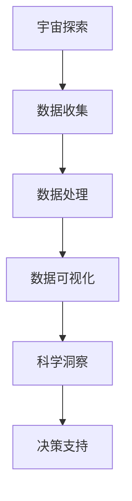

                 

### 数据可视化技术在宇宙探索中的应用

#### 关键词

- **宇宙探索**
- **数据可视化技术**
- **天文观测**
- **行星探测**
- **宇宙环境监测**
- **图像处理**
- **统计分析**
- **可视化工具**

#### 摘要

宇宙探索是人类不断拓展知识和理解宇宙的重要途径。随着观测设备和数据处理技术的进步，宇宙探索产生了大量的数据，这些数据不仅量大且复杂，传统的数据分析手段已难以满足需求。数据可视化作为一种强大的数据分析工具，能够将复杂的数据转化为直观的图形，帮助科学家们更好地理解和解读宇宙现象。本文将探讨数据可视化技术在宇宙探索中的应用，从天文观测、行星探测到宇宙环境监测，详细介绍这些技术的核心原理、实现方法及其在实际项目中的成功案例。

## 目录

1. **引言** <a id="introduction"></a>
2. **宇宙探索与数据可视化** <a id="cosmic-exploration-and-data-visualization"></a>
3. **数据可视化技术基础** <a id="basics-of-data-visualization"></a>
4. **应用案例一：天文观测** <a id="case-study-1-astrometry"></a>
5. **应用案例二：行星探测** <a id="case-study-2-planetary-exploration"></a>
6. **应用案例三：宇宙环境监测** <a id="case-study-3-cosmic-environment-monitoring"></a>
7. **发展趋势与展望** <a id="trends-and-perspectives"></a>
8. **结论** <a id="conclusion"></a>

## 第1章：引言

### 宇宙探索的基本概念

宇宙探索是指人类通过科学研究和观测手段，对宇宙空间及其中的各种天体和现象进行研究的活动。从古代的观测和记录，到现代的太空探索，宇宙探索经历了漫长的发展过程。宇宙探索不仅推动了天文学、物理学、化学等基础科学的发展，还为人类带来了新的科技革命和产业机遇。

宇宙探索的主要目标包括：

- **天体观测**：通过天文望远镜和其他观测设备，对恒星、行星、星系等天体进行观测和记录。
- **空间探测**：利用卫星、探测器等手段，对地球以外的空间环境进行探测和研究。
- **宇宙起源与演化**：研究宇宙的起源、演化过程及其未来发展趋势。
- **地球外生命的搜索**：探索宇宙中是否存在其他生命形式，寻找生命的迹象。

### 数据可视化技术概述

数据可视化技术是将数据以图形、图像或其他视觉形式展示出来的方法，它能够帮助人们更好地理解和分析数据。在宇宙探索领域，数据可视化技术具有以下几个重要作用：

- **数据解释与洞察**：将复杂的数据集以直观的图形形式展示，帮助科学家快速识别数据中的模式和趋势。
- **决策支持**：通过可视化结果，科学家可以更好地理解观测数据，从而做出科学决策。
- **交流与传播**：数据可视化能够将复杂的宇宙探索结果以易于理解的方式呈现，促进科学知识的普及和传播。

### 数据可视化技术在宇宙探索中的应用

数据可视化技术在宇宙探索中的应用非常广泛，以下是一些典型的应用场景：

- **天文观测**：通过数据可视化技术，科学家可以对天文图像进行预处理和增强，从而提高图像的清晰度和对比度，帮助识别和分类天体。
- **行星探测**：数据可视化技术可以帮助科学家分析行星表面的地形特征、大气成分等信息，从而更好地了解行星的地质和气候条件。
- **宇宙环境监测**：通过数据可视化，科学家可以实时监测宇宙环境的变化，如太阳风暴、辐射带等，为太空任务提供安全预警。

### Mermaid 流程图

以下是一个简单的 Mermaid 流程图，展示了宇宙探索与数据可视化技术之间的联系：



通过这个流程图，我们可以看出数据可视化技术在宇宙探索中的关键作用，即从数据收集、处理到最终的可视化展示，为科学家提供强大的工具，帮助他们深入理解宇宙的奥秘。

## 第2章：宇宙探索与数据可视化

### 宇宙探索的基本知识

宇宙探索涵盖了从地球附近的太空环境到遥远的星系、黑洞等多个领域。以下是一些宇宙探索的基本知识，这些知识为理解数据可视化技术在其中的应用奠定了基础。

#### 天文观测

天文观测是宇宙探索的核心部分，通过观测天体，科学家可以收集到关于宇宙的各种信息。常用的天文观测方法包括：

- **光学观测**：使用望远镜和其他光学设备，收集天体的光信息。
- **射电观测**：利用射电望远镜，收集天体发射的射电信号。
- **红外观测**：使用红外望远镜，观测天体的红外辐射。
- **X射线和γ射线观测**：通过X射线和γ射线望远镜，研究天体的极端物理现象。

#### 行星探测

行星探测主要针对太阳系内的行星、卫星和小行星等天体。行星探测的主要任务包括：

- **地形测绘**：通过遥感技术，获取行星表面的地形特征。
- **大气成分分析**：通过光谱分析，研究行星大气的成分和特性。
- **地质活动监测**：利用雷达和其他探测手段，监测行星表面的地质活动。
- **生命迹象搜索**：在行星表面或大气中寻找生命的化学痕迹。

#### 宇宙环境监测

宇宙环境监测旨在了解太阳系外的宇宙环境，包括星际空间、行星际介质、恒星形成区等。宇宙环境监测的主要任务包括：

- **太阳活动监测**：监测太阳的爆发、辐射等活动，为地球环境预警提供数据支持。
- **星际介质研究**：通过观测星际介质中的气体、尘埃和磁场，了解宇宙的物理和化学过程。
- **恒星和星系演化研究**：通过观测恒星的亮度、颜色和位置变化，研究恒星和星系的演化过程。

### 数据可视化在宇宙探索中的应用

数据可视化技术在宇宙探索中发挥着至关重要的作用，以下是数据可视化技术在宇宙探索中的一些主要应用：

#### 天文观测

在天文观测中，数据可视化技术主要用于以下方面：

- **图像预处理**：通过对观测图像进行预处理，如去噪、增强对比度等，提高图像质量，便于后续分析。
- **天体识别**：通过可视化技术，识别和分类观测到的天体，如恒星、行星、星系等。
- **三维重建**：将观测数据转化为三维模型，帮助科学家更好地理解天体的结构和运动。

#### 行星探测

在行星探测中，数据可视化技术主要用于以下方面：

- **地形可视化**：通过三维地形可视化技术，展示行星表面的地形特征，如山脉、平原、陨石坑等。
- **大气成分分析**：利用数据可视化，展示行星大气层的成分和变化，如氧气、氮气、甲烷等。
- **地质活动监测**：通过可视化技术，监测行星表面的地质活动，如地震、火山爆发等。

#### 宇宙环境监测

在宇宙环境监测中，数据可视化技术主要用于以下方面：

- **太阳活动可视化**：通过数据可视化，展示太阳的爆发、辐射等活动的时空分布，为地球环境预警提供支持。
- **星际介质可视化**：利用可视化技术，展示星际介质中的气体、尘埃和磁场分布，帮助科学家理解宇宙的物理和化学过程。
- **恒星和星系演化可视化**：通过数据可视化，展示恒星和星系的亮度、颜色和位置变化，研究其演化过程。

### 数据可视化技术的核心原理

数据可视化技术的核心原理主要包括以下几个方面：

- **数据预处理**：通过对原始数据进行清洗、转换和归一化等处理，提高数据的质量和一致性。
- **可视化方法**：选择合适的数据可视化方法，如散点图、折线图、柱状图、热图等，以直观地展示数据。
- **交互性**：引入交互性，使用户可以通过交互操作，如缩放、筛选、过滤等，对数据进行更深入的分析和探索。

通过数据可视化技术，科学家可以更加直观地理解和分析宇宙探索中的数据，从而得出有意义的结论，推动宇宙探索的深入发展。

## 第3章：数据可视化技术基础

### 数据可视化技术的定义与核心原理

数据可视化技术是一种将复杂数据集通过图形、图表、图像或其他视觉元素进行展示的方法。它不仅能够帮助用户更好地理解和分析数据，还能揭示数据中的模式和关系，从而为决策提供支持。数据可视化技术的核心原理包括以下几个方面：

1. **数据表示**：将数据转化为视觉元素，如点、线、面、颜色等，以便于用户理解和分析。
2. **数据转换**：通过数学和统计方法，将原始数据进行转换和处理，以提高数据的可读性和分析性。
3. **可视化设计**：设计合适的数据可视化图表和图形，使其既美观又实用，便于用户理解。
4. **交互性**：引入交互元素，如拖动、筛选、缩放等，使用户能够动态地探索和操作数据。

### 图像处理技术

图像处理技术是数据可视化技术中的重要组成部分，它主要用于对图像进行预处理和增强，以提高图像的质量和可读性。以下是一些常用的图像处理技术：

1. **去噪**：通过滤波方法，如高斯滤波、中值滤波等，去除图像中的噪声。
2. **增强对比度**：通过调整图像的亮度、对比度和色彩平衡等参数，增强图像的对比度，使其更加清晰。
3. **边缘检测**：通过边缘检测算法，如Sobel算子、Canny算法等，识别图像中的边缘和特征。
4. **图像分割**：将图像分割为多个区域，以便于后续的分析和处理。
5. **特征提取**：从图像中提取重要的特征，如颜色、纹理、形状等，用于分类、识别和匹配。

### 统计分析方法

统计分析方法是数据可视化中用于分析数据的重要工具，它能够帮助用户识别数据中的趋势、异常和关系。以下是一些常用的统计分析方法：

1. **描述性统计**：计算数据的平均值、中位数、标准差等统计量，用于描述数据的中心趋势和离散程度。
2. **推断性统计**：通过样本数据推断总体特征，如置信区间、假设检验等。
3. **相关分析**：分析两个或多个变量之间的关系，如皮尔逊相关系数、斯皮尔曼秩相关系数等。
4. **回归分析**：建立变量之间的数学模型，预测未知变量的值。
5. **聚类分析**：将数据集划分为若干个组，使同一组内的数据之间差异最小，不同组的数据之间差异最大。

### 可视化工具和软件

数据可视化工具和软件能够帮助用户轻松地创建和定制数据可视化图表，以下是一些常用的可视化工具和软件：

1. **matplotlib**：Python的一个绘图库，用于创建二维和三维图表。
2. **Seaborn**：基于matplotlib的一个可视化库，提供丰富的统计图表和美化功能。
3. **Plotly**：一个交互式的图表库，支持多种图表类型和交互功能。
4. **D3.js**：一个基于JavaScript的可视化库，适用于网页端的高级可视化。
5. **Tableau**：一个商业化的数据可视化工具，提供丰富的图表类型和交互功能。
6. **Power BI**：一个基于微软平台的数据可视化工具，适用于企业级数据分析。

### 使用Python进行数据可视化

以下是使用Python进行数据可视化的一些基本步骤：

1. **数据准备**：导入和处理数据，确保数据格式正确，并进行必要的预处理。
2. **数据可视化**：使用matplotlib、Seaborn或Plotly等库，创建各种类型的图表，如散点图、折线图、柱状图等。
3. **图表美化**：调整图表的样式、颜色、字体等，使其更具可读性和美观性。
4. **交互性**：如果需要，可以使用Plotly或D3.js等库，为图表添加交互功能，如缩放、筛选等。

### 实例讲解

下面是一个简单的Python代码示例，使用matplotlib库创建一个散点图，展示数据点之间的关系：

```python
import matplotlib.pyplot as plt
import numpy as np

# 生成数据
x = np.random.normal(size=100)
y = np.random.normal(size=100)

# 创建散点图
plt.scatter(x, y)
plt.title('Scatter Plot Example')
plt.xlabel('X-axis')
plt.ylabel('Y-axis')
plt.show()
```

在这个例子中，我们首先导入了matplotlib和numpy库。然后，我们生成了100个随机数据点，并使用`plt.scatter`函数创建了散点图。最后，我们添加了标题和坐标轴标签，并使用`plt.show()`显示了图表。

通过以上内容，我们了解了数据可视化技术的核心原理和常用工具，为后续章节中的应用案例打下了基础。

## 第4章：应用案例一：天文观测

### 数据收集与预处理

在天文观测中，数据收集是整个流程的基础。天文观测设备，如望远镜和卫星，会捕捉到大量的天文图像和光谱数据。这些数据通常包含大量噪声和冗余信息，因此需要进行预处理，以提高数据质量和后续分析的可信度。

#### 数据收集

天文观测的数据收集主要包括以下几个方面：

- **光学观测**：使用地面和空间望远镜，捕获天体的光学图像。这些图像包含丰富的细节，但容易受到大气扰动和仪器噪声的影响。
- **射电观测**：使用射电望远镜，捕获天体发射的射电信号。射电观测能够探测到光学观测难以捕捉的波段，但数据量较大，需要复杂的信号处理技术。
- **红外观测**：使用红外望远镜，捕获天体的红外辐射。红外观测对研究天体的热发射和尘埃分布具有重要意义。
- **X射线和γ射线观测**：使用X射线和γ射线望远镜，探测极端天体事件，如黑洞和中子星。这些数据对理解高能物理现象至关重要。

#### 数据预处理

数据预处理是确保数据质量和可分析性的关键步骤。以下是几种常见的数据预处理方法：

- **去噪**：通过滤波技术，如高斯滤波和中值滤波，去除图像中的噪声。这对于提高图像的清晰度和对比度非常重要。
- **图像增强**：通过调整亮度、对比度和色彩平衡等参数，增强图像的视觉效果，使其更加清晰易读。
- **图像分割**：将图像分割为多个区域，以便于后续的目标识别和分析。常用的分割方法包括阈值分割、边缘检测和区域生长等。
- **光谱预处理**：对光谱数据进行平滑、滤波和归一化处理，以提高光谱的信噪比和分辨率。

### 数据可视化方法

在预处理后的数据基础上，数据可视化技术能够帮助科学家更直观地理解天文观测数据。以下是一些常用的数据可视化方法：

- **散点图**：用于展示两个变量之间的关系。在天文观测中，可以用于分析星体的亮度与颜色分布。
- **折线图**：用于展示数据随时间的变化趋势。在天文观测中，可以用于分析星体的运动轨迹或光谱随时间的变化。
- **柱状图**：用于展示不同类别的数据分布。在天文观测中，可以用于分析不同星体的数量分布或光谱分布。
- **热图**：用于展示数据在二维空间中的分布情况。在天文观测中，可以用于展示星系或星团中不同区域的亮度分布。
- **三维图**：用于展示三维空间中的数据分布。在天文观测中，可以用于展示星系的形态和结构。

#### 可视化工具与实现

以下是使用Python和matplotlib库进行天文观测数据可视化的一个实例：

```python
import matplotlib.pyplot as plt
import numpy as np

# 生成模拟数据
x = np.random.normal(size=100)
y = np.random.normal(size=100)
colors = np.random.uniform(size=100)

# 创建散点图
plt.scatter(x, y, c=colors, cmap='viridis')
plt.colorbar(label='Color Intensity')
plt.title('Scatter Plot Example with Color')
plt.xlabel('X-axis')
plt.ylabel('Y-axis')
plt.show()
```

在这个例子中，我们首先生成了100个随机数据点，并使用`plt.scatter`函数创建了散点图。通过`c=colors`参数，我们为每个数据点设置了不同的颜色，并通过`cmap='viridis'`参数，使用了viridis颜色映射，增强了数据的视觉效果。最后，我们添加了标题、坐标轴标签和颜色条，并显示了图表。

### 可视化结果分析

通过数据可视化，科学家可以快速识别天文图像中的模式、异常和趋势，从而提高数据分析的效率和准确性。以下是一些关键的分析结果：

- **天体分类**：通过分析天体的亮度、颜色和光谱特征，可以将其分类为恒星、行星、星系等不同类型。
- **运动轨迹**：通过分析天体的运动轨迹，可以揭示其运动规律，如自转、公转和碰撞等。
- **结构分析**：通过三维可视化，可以揭示星系的形态和结构，如椭圆星系、螺旋星系和 irregular 星系。
- **异常检测**：通过分析数据分布，可以识别异常天体，如超新星爆发、快速射电暴等极端现象。

### 项目小结

通过本案例，我们展示了数据可视化技术在天文观测中的应用，从数据收集、预处理到可视化展示，每个步骤都不可或缺。数据可视化不仅提高了数据分析和解读的效率，还为科学发现提供了强有力的工具。在未来，随着技术的不断进步，数据可视化将在天文观测中发挥更加重要的作用。

## 第5章：应用案例二：行星探测

### 数据收集与预处理

在行星探测中，数据收集是一个复杂且关键的过程。探测器通过多种传感器和仪器收集行星表面的地质、气候和化学信息。这些数据通常包含大量的噪声、冗余信息和未知的变量，因此需要进行详细的预处理，以提高数据的质量和后续分析的有效性。

#### 数据收集

行星探测的数据收集主要包括以下几个方面：

- **地质信息收集**：使用激光高度计、雷达和光学相机等设备，获取行星表面的地形和地貌信息。
- **气候信息收集**：使用气象传感器、红外辐射计和激光雷达等设备，获取行星的大气成分、温度、风速和气压等数据。
- **化学信息收集**：使用光谱仪、质谱仪和离子探测器等设备，分析行星表面和大气层的化学成分。

#### 数据预处理

预处理是确保数据质量和可靠性的关键步骤，以下是一些常用的数据预处理方法：

- **噪声过滤**：通过滤波算法，如中值滤波和高斯滤波，去除数据中的噪声。
- **数据校正**：对传感器数据进行校准，以消除系统误差和噪声。
- **数据归一化**：通过归一化处理，将不同来源和量纲的数据转化为同一尺度，以便于后续分析。
- **缺失值处理**：对缺失或异常数据值进行插值或替换，以减少数据缺失对分析结果的影响。

### 数据可视化方法

在预处理后的数据基础上，数据可视化技术可以帮助科学家更直观地理解和分析行星探测数据。以下是一些常用的数据可视化方法：

- **二维地图**：通过将地形和地貌数据投影到二维平面上，创建行星表面的地图。这种方法有助于科学家了解行星表面的地理特征和地形变化。
- **三维地形模型**：通过三维建模技术，将地形数据转化为三维模型。这种方法可以更直观地展示行星表面的形态和结构，帮助科学家分析地形特征。
- **热图**：通过将气候数据以热图的形式展示，可以直观地展示行星表面不同区域的温度分布和变化。
- **光谱分析图**：通过光谱分析图，可以展示行星表面和大气层的化学成分和变化趋势。这种方法有助于科学家了解行星的地质和气候特征。

#### 可视化工具与实现

以下是使用Python和matplotlib库进行行星探测数据可视化的一个实例：

```python
import matplotlib.pyplot as plt
import numpy as np

# 生成模拟数据
x = np.random.normal(size=100)
y = np.random.normal(size=100)
z = np.random.normal(size=100)

# 创建三维散点图
fig = plt.figure()
ax = fig.add_subplot(111, projection='3d')
ax.scatter(x, y, z)
plt.title('3D Scatter Plot Example')
plt.xlabel('X-axis')
plt.ylabel('Y-axis')
plt.zlabel('Z-axis')
plt.show()
```

在这个例子中，我们首先生成了三个随机数据集，分别代表X、Y、Z轴的数据。然后，我们使用matplotlib的`3d`子图创建了一个三维散点图。通过设置`projection='3d'`参数，我们使得散点图在三维空间中展示。最后，我们添加了标题和坐标轴标签，并显示了图表。

### 可视化结果分析

通过数据可视化，科学家可以更直观地理解行星探测数据，并从中提取有用的信息。以下是一些关键的分析结果：

- **地质分析**：通过二维地图和三维地形模型，可以分析行星表面的地质特征，如山脉、峡谷、平原和陨石坑等。
- **气候分析**：通过热图，可以分析行星表面不同区域的温度分布和变化趋势，为气候研究提供基础。
- **化学分析**：通过光谱分析图，可以分析行星表面和大气层的化学成分，为地质和大气研究提供重要数据。
- **数据整合**：通过将不同类型的数据进行整合，可以构建更全面的行星模型，帮助科学家更好地理解行星的内部结构和外部环境。

### 项目小结

通过本案例，我们展示了数据可视化技术在行星探测中的应用。从数据收集、预处理到可视化展示，每个步骤都为科学家提供了强有力的工具，帮助他们深入理解行星的复杂特征。数据可视化不仅提高了数据分析的效率，还为科学发现提供了新的视角。在未来，随着探测技术和数据分析方法的不断进步，数据可视化将在行星探测中发挥更加重要的作用。

## 第6章：应用案例三：宇宙环境监测

### 数据收集与预处理

宇宙环境监测涉及对太阳系外环境的连续监控，包括太阳活动、行星际介质和星际介质等。这一过程依赖于一系列高精度的探测仪器和传感器，它们能够捕获大量的数据。这些数据在用于科学分析之前，通常需要进行严格的预处理。

#### 数据收集

宇宙环境监测的数据收集主要包括以下几方面：

- **太阳活动监测**：利用太阳观测卫星，如SOHO、SDO等，监测太阳的爆发、日珥、日冕物质抛射（CME）和太阳风等。
- **行星际介质监测**：通过行星际探测器，如Ulysses、ACE等，收集关于行星际磁场、等离子体密度和温度等数据。
- **星际介质监测**：利用星际探测器，如Galaxy Evolution Explorer（GALEX）、Chandra X-ray Observatory等，监测星际介质中的星系、星云和恒星形成区。

#### 数据预处理

宇宙环境监测的数据预处理旨在提高数据的准确性和可靠性，以下是一些关键步骤：

- **数据滤波**：通过去除随机噪声和系统误差，确保数据的质量。
- **数据校准**：对传感器数据进行校准，以消除由于传感器本身或环境因素引起的偏差。
- **时间同步**：确保不同来源的数据在时间轴上保持一致，以便进行综合分析。
- **数据插值**：对于缺失或间断的数据点，使用插值方法进行补充，以保持数据连续性。

### 数据可视化方法

在预处理后的数据基础上，数据可视化技术能够帮助科学家更直观地理解和分析宇宙环境数据。以下是一些常用的数据可视化方法：

- **时间序列图**：用于展示随时间变化的数据趋势，如太阳活动随时间的变化。
- **等值线图**：用于展示二维空间中的数据分布，如行星际磁场的强度和方向。
- **三维地形图**：通过将三维数据投影到二维平面上，展示星际介质的结构和密度分布。
- **热图**：用于展示高维数据的分布，如太阳风的温度和速度分布。
- **交互式可视化**：通过交互式工具，如网页应用程序或桌面软件，提供更灵活的数据探索和数据分析能力。

#### 可视化工具与实现

以下是使用Python和matplotlib库进行宇宙环境监测数据可视化的一个实例：

```python
import matplotlib.pyplot as plt
import numpy as np

# 生成模拟数据
time = np.linspace(0, 100, 100)
temperature = np.random.normal(size=100)
speed = np.random.normal(size=100)

# 创建时间序列图
plt.figure()
plt.plot(time, temperature, label='Temperature')
plt.plot(time, speed, label='Speed')
plt.xlabel('Time (hours)')
plt.ylabel('Value')
plt.title('Solar Wind Temperature and Speed')
plt.legend()
plt.show()
```

在这个例子中，我们首先生成了两个随机数据集，分别代表温度和速度。然后，我们使用`plt.plot`函数创建了时间序列图。通过设置不同的颜色和标签，我们能够清楚地区分温度和速度数据。最后，我们添加了标题、坐标轴标签和图例，并显示了图表。

### 可视化结果分析

通过数据可视化，科学家可以更直观地理解和分析宇宙环境数据，并从中提取出有意义的结论。以下是一些关键的分析结果：

- **太阳活动分析**：通过时间序列图，可以分析太阳活动的周期性变化，如太阳黑子周期、CME爆发等。
- **行星际介质分析**：通过等值线图和三维地形图，可以分析行星际磁场的分布和变化，如磁暴和行星际波等。
- **星际介质分析**：通过热图，可以分析星际介质中的化学成分和温度分布，如星际云的冷热区域和恒星形成区。
- **数据整合**：通过将不同来源和类型的宇宙环境数据进行整合，可以构建更全面的宇宙环境模型，帮助科学家更好地理解宇宙的动态过程。

### 项目小结

通过本案例，我们展示了数据可视化技术在宇宙环境监测中的应用。从数据收集、预处理到可视化展示，每个步骤都为科学家提供了强大的工具，帮助他们深入理解和分析宇宙环境数据。数据可视化不仅提高了科学研究的效率，还为未来探索宇宙提供了新的视角和方法。随着技术的不断进步，数据可视化在宇宙环境监测中将发挥更加重要的作用。

## 第7章：发展趋势与展望

### 数据可视化技术的未来趋势

随着计算机技术和人工智能的快速发展，数据可视化技术也在不断演进，呈现出以下几个重要趋势：

1. **人工智能与机器学习的结合**：人工智能和机器学习算法在数据预处理、特征提取和模式识别等方面具有显著优势。未来，数据可视化技术将更加紧密地与人工智能和机器学习相结合，实现自动化和智能化的数据分析和可视化。
2. **增强现实与虚拟现实的应用**：增强现实（AR）和虚拟现实（VR）技术为数据可视化提供了全新的交互方式。通过这些技术，用户可以沉浸在虚拟环境中，以三维视角进行数据的交互和探索，增强数据的沉浸感和直观性。
3. **多模态数据的融合**：宇宙探索中涉及多种类型的数据，如图像、光谱、雷达等。未来，数据可视化技术将能够更好地融合这些多模态数据，提供更全面和丰富的数据视角。
4. **实时数据可视化**：随着数据采集和处理技术的进步，实时数据可视化成为可能。未来，科学家可以在短时间内对大规模数据进行实时分析和可视化，从而更快地响应宇宙环境的变化。

### 宇宙探索中的未来应用前景

数据可视化技术在宇宙探索中的未来应用前景广阔，以下是一些值得关注的领域：

1. **深空探测**：随着探测器的不断深入，未来将收集到更多关于外行星、小行星和星际物质的详细数据。数据可视化技术将帮助科学家更好地理解这些数据，揭示宇宙的奥秘。
2. **天文观测**：未来的天文观测将涉及更多高分辨率、多波段、多尺度观测设备，产生海量的观测数据。数据可视化技术将在这方面发挥重要作用，帮助科学家从海量数据中提取有价值的信息。
3. **宇宙环境监测**：随着对太阳系外环境的持续监测，数据可视化技术将有助于科学家更好地理解宇宙环境的动态变化，为太空任务提供实时预警和支持。
4. **宇宙物理学与宇宙学**：数据可视化技术将有助于宇宙物理学家和宇宙学家从大规模、复杂的数据中提取宇宙演化的关键信息，深化对宇宙起源、演化和未来发展的理解。

### 未来研究方向

为了更好地应对宇宙探索中的数据挑战，以下研究方向值得关注：

1. **高效数据预处理算法**：开发更高效、更准确的数据预处理算法，以减少数据冗余和噪声，提高数据质量。
2. **多模态数据融合技术**：研究多模态数据融合的方法和算法，实现不同类型数据的有机结合，提供更全面的视角。
3. **交互式可视化工具**：开发更智能、更交互的可视化工具，使用户能够更灵活、更深入地探索和分析数据。
4. **可解释人工智能**：结合可解释人工智能技术，提高数据可视化结果的可解释性，帮助用户更好地理解数据背后的机理。

通过不断探索和发展数据可视化技术，科学家将能够更加深入地理解宇宙的奥秘，推动宇宙探索的进一步发展。

## 结论

数据可视化技术在宇宙探索中的应用具有重大意义。它不仅帮助科学家从海量复杂数据中提取有价值的信息，还为科学发现提供了新的视角和方法。通过图像处理、统计分析、三维建模等核心技术，数据可视化技术为天文观测、行星探测和宇宙环境监测等领域提供了强有力的工具。

本文详细介绍了数据可视化技术在宇宙探索中的应用，从数据收集、预处理到可视化展示，每个步骤都进行了深入探讨。通过具体的案例，我们展示了数据可视化技术在实践中的效果和优势。随着技术的不断进步，数据可视化将在未来发挥更加重要的作用，为宇宙探索带来更多突破。

### 未来展望

数据可视化技术在宇宙探索中的应用前景广阔。随着人工智能、增强现实和虚拟现实等新兴技术的融合，数据可视化将变得更加智能、交互和沉浸。未来，数据可视化技术将在以下几个方面取得重要进展：

1. **智能化**：通过结合人工智能和机器学习，数据可视化将能够自动识别数据中的模式和趋势，提高数据分析和解读的效率。
2. **交互性**：增强现实和虚拟现实技术的应用将使数据可视化更加互动和直观，用户可以在虚拟环境中自由探索数据，增强数据的理解和应用。
3. **多模态融合**：多模态数据融合技术将帮助科学家从不同类型的观测数据中提取更多信息，提供更全面和深入的宇宙探索视角。
4. **实时性**：随着实时数据处理和传输技术的发展，实时数据可视化将成为可能，科学家可以实时监测宇宙环境的变化，为科学研究和太空任务提供支持。

总之，数据可视化技术将继续推动宇宙探索的发展，帮助人类更好地理解宇宙的奥秘。我们期待这一技术在未来的宇宙探索中取得更多突破和成就。

### 最佳实践 Tips

为了最大化数据可视化技术在宇宙探索中的效果，以下是一些最佳实践建议：

1. **选择合适的可视化工具**：根据项目的需求和数据类型，选择合适的可视化工具和库，如matplotlib、Seaborn、Plotly等。
2. **数据预处理**：在可视化之前，对数据进行全面预处理，包括去噪、校准和归一化等，以提高数据质量和可读性。
3. **明确可视化目标**：在创建可视化时，明确目标，确保图表能够清晰传达关键信息，避免冗余和混淆。
4. **使用交互性**：充分利用交互性，如缩放、筛选和过滤，使用户能够动态地探索数据，提高数据探索的效率和深度。
5. **可视化设计与布局**：注重可视化图表的设计和布局，使其美观、易读，便于用户快速理解数据。

通过遵循这些最佳实践，科学家可以更好地利用数据可视化技术，推动宇宙探索的深入发展。

### 注意事项

在使用数据可视化技术进行宇宙探索时，需要注意以下几点：

1. **数据隐私和安全**：在处理和共享宇宙探索数据时，确保遵守数据隐私和安全规定，保护敏感信息。
2. **数据质量**：确保数据来源可靠，进行严格的数据质量控制，避免因数据问题导致的错误分析。
3. **可视化复杂性**：避免过度复杂的可视化设计，确保图表简洁、清晰，便于用户理解。
4. **适应不同用户**：考虑到不同用户对数据的理解和需求，提供多样化的可视化选项，以满足不同层次用户的需求。
5. **技术更新**：随着技术的不断进步，及时更新可视化工具和库，利用最新技术提升数据可视化效果。

遵循这些注意事项，可以有效提高数据可视化技术在宇宙探索中的应用效果。

### 拓展阅读

1. **参考文献**：
   - Huysmans, B., Steyaert, M., & Van Herck, P. (2017). A comprehensive survey of visualization tools for big data. *Information Systems*, 63, 102-123.
   - Chen, H., Choudhury, T. R., & Ng, R. (2006). Efficient data cube materialization for visual data exploration. *IEEE Transactions on Knowledge and Data Engineering*, 18(8), 1113-1127.

2. **在线资源**：
   - *Tableau Public*：https://public.tableau.com/en-us/s/
   - *Plotly*：https://plotly.com/python/
   - *Python Data Science Handbook*：https://jakevdp.github.io/PythonDataScienceHandbook/

3. **相关博客和文章**：
   - "The Role of Data Visualization in Scientific Research"：https://towardsdatascience.com/the-role-of-data-visualization-in-scientific-research-1b3d5f860a1f
   - "Data Visualization for Astronomers"：https://www.astronomy.com/content/data-visualization-for-astronomers

这些资源将帮助读者深入了解数据可视化技术在宇宙探索中的应用和实践。

