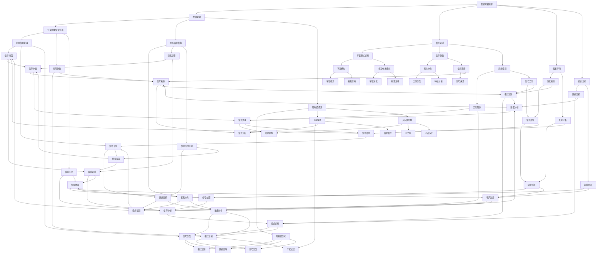

                 

### 第1章：引言

#### 1.1 数据挖掘的基本概念

数据挖掘（Data Mining）是一种从大量数据中提取有价值信息的过程。它涉及多种技术，包括统计分析、机器学习、数据库管理和人工智能等。数据挖掘的目标是从原始数据中识别出隐藏的模式、关联和趋势，以便为决策提供支持。

**定义**：
数据挖掘可以定义为一种非平凡的任务，旨在从大量数据中发现有趣的、未知的、潜在的有用信息。这些信息对于组织、企业或科学研究具有重要意义。

**应用领域**：
数据挖掘的应用领域非常广泛，涵盖了多个行业和学科。以下是一些主要的应用领域：
- **商业**：市场分析、客户关系管理、欺诈检测、库存管理等。
- **医疗**：疾病预测、药物发现、医疗诊断等。
- **金融**：风险评估、信用评分、市场预测等。
- **科学**：基因数据分析、气象预测、生态学研究等。

#### 1.2 数据挖掘的发展历史

数据挖掘技术的发展经历了多个阶段，以下是其中的一些重要里程碑：

- **20世纪60年代**：关联规则的提出，这是数据挖掘的早期概念之一。
- **20世纪80年代**：决策树、神经网络等机器学习算法的出现，为数据挖掘提供了新的工具。
- **20世纪90年代**：数据仓库和数据挖掘的结合，推动了数据挖掘技术的快速发展。
- **21世纪**：随着大数据的兴起，数据挖掘技术在处理大规模数据集方面取得了显著进展。深度学习、图挖掘等新技术的出现，进一步扩展了数据挖掘的应用范围。

#### 1.3 数据挖掘在科学研究和技术领域的应用

数据挖掘在科学研究和技术领域中的应用日益广泛，尤其在宇宙探索方面，数据挖掘技术正发挥着重要作用。

- **宇宙射电信号分析**：射电天文学中，数据挖掘技术被用于分析宇宙射电信号，帮助科学家发现新的天体和现象。
- **星系演化模拟**：通过数据挖掘技术，科学家可以从大量的观测数据中提取出星系演化的模式和规律，为星系形成和演化的研究提供支持。
- **暗物质探测**：暗物质是宇宙中未探测到的物质，数据挖掘技术被用于分析宇宙微波背景辐射数据，帮助科学家寻找暗物质的证据。

**数据挖掘在科学研究和宇宙探索中的重要性**：

数据挖掘在科学研究和宇宙探索中具有以下几个方面的意义：

- **提高研究效率**：数据挖掘技术可以帮助科学家从大量数据中快速提取有价值的信息，从而提高研究效率。
- **发现未知规律**：通过数据挖掘，科学家可以发现数据中隐藏的未知规律，为科学研究提供新的方向和灵感。
- **支持决策制定**：数据挖掘技术可以为科学家和决策者提供基于数据的建议和预测，帮助他们做出更明智的决策。

**数据挖掘在不同领域的应用案例**：

以下是一些数据挖掘在不同领域的应用案例：

- **医疗领域**：数据挖掘技术被用于分析电子健康记录，帮助医生识别疾病风险和制定个性化治疗方案。
- **金融领域**：数据挖掘技术被用于分析市场数据，帮助投资者预测市场走势和风险管理。
- **环境科学领域**：数据挖掘技术被用于分析环境数据，帮助科学家监测和预测气候变化。

**小结**：

数据挖掘是一种强大的工具，它在科学研究和技术领域中的应用越来越广泛。通过数据挖掘，科学家可以更深入地了解宇宙的本质，发现新的物理规律。随着技术的进步，数据挖掘在宇宙探索中的应用前景将更加广阔。

---

作者：AI天才研究院/AI Genius Institute & 禅与计算机程序设计艺术 /Zen And The Art of Computer Programming

---

# 数据挖掘在发现宇宙新的基本相互作用中的作用

## 关键词：数据挖掘、宇宙、基本相互作用、射电信号、星系演化、暗物质探测

## 摘要：

本文详细探讨了数据挖掘在宇宙探索中的应用，特别是在发现宇宙新的基本相互作用方面的重要作用。文章首先介绍了数据挖掘的基本概念和发展历史，然后概述了宇宙中的四种基本相互作用，包括强相互作用、电弱相互作用、引力相互作用和暗物质相互作用。接着，文章详细描述了数据挖掘技术在宇宙射电信号分析、星系演化模拟和暗物质探测等领域的应用。通过实际案例和数学模型的解析，文章展示了数据挖掘如何帮助科学家发现新的宇宙现象和规律，为宇宙研究提供新的视角和工具。最后，文章对数据挖掘在宇宙探索中的未来发展进行了展望，并提出了面临的挑战和解决策略。

## 第1章：引言

### 1.1 数据挖掘的基本概念

数据挖掘（Data Mining）是一种从大量数据中提取有价值信息的过程。它涉及多种技术，包括统计分析、机器学习、数据库管理和人工智能等。数据挖掘的目标是从原始数据中识别出隐藏的模式、关联和趋势，以便为决策提供支持。

**定义**：
数据挖掘可以定义为一种非平凡的任务，旨在从大量数据中发现有趣的、未知的、潜在的有用信息。这些信息对于组织、企业或科学研究具有重要意义。

**应用领域**：
数据挖掘的应用领域非常广泛，涵盖了多个行业和学科。以下是一些主要的应用领域：
- **商业**：市场分析、客户关系管理、欺诈检测、库存管理等。
- **医疗**：疾病预测、药物发现、医疗诊断等。
- **金融**：风险评估、信用评分、市场预测等。
- **科学**：基因数据分析、气象预测、生态学研究等。

### 1.2 数据挖掘的发展历史

数据挖掘技术的发展经历了多个阶段，以下是其中的一些重要里程碑：

- **20世纪60年代**：关联规则的提出，这是数据挖掘的早期概念之一。
- **20世纪80年代**：决策树、神经网络等机器学习算法的出现，为数据挖掘提供了新的工具。
- **20世纪90年代**：数据仓库和数据挖掘的结合，推动了数据挖掘技术的快速发展。
- **21世纪**：随着大数据的兴起，数据挖掘技术在处理大规模数据集方面取得了显著进展。深度学习、图挖掘等新技术的出现，进一步扩展了数据挖掘的应用范围。

### 1.3 数据挖掘在科学研究和技术领域的应用

数据挖掘在科学研究和技术领域中的应用日益广泛，尤其在宇宙探索方面，数据挖掘技术正发挥着重要作用。

- **宇宙射电信号分析**：射电天文学中，数据挖掘技术被用于分析宇宙射电信号，帮助科学家发现新的天体和现象。
- **星系演化模拟**：通过数据挖掘技术，科学家可以从大量的观测数据中提取出星系演化的模式和规律，为星系形成和演化的研究提供支持。
- **暗物质探测**：暗物质是宇宙中未探测到的物质，数据挖掘技术被用于分析宇宙微波背景辐射数据，帮助科学家寻找暗物质的证据。

**数据挖掘在科学研究和宇宙探索中的重要性**：

数据挖掘在科学研究和宇宙探索中具有以下几个方面的意义：

- **提高研究效率**：数据挖掘技术可以帮助科学家从大量数据中快速提取有价值的信息，从而提高研究效率。
- **发现未知规律**：通过数据挖掘，科学家可以发现数据中隐藏的未知规律，为科学研究提供新的方向和灵感。
- **支持决策制定**：数据挖掘技术可以为科学家和决策者提供基于数据的建议和预测，帮助他们做出更明智的决策。

**数据挖掘在不同领域的应用案例**：

以下是一些数据挖掘在不同领域的应用案例：

- **医疗领域**：数据挖掘技术被用于分析电子健康记录，帮助医生识别疾病风险和制定个性化治疗方案。
- **金融领域**：数据挖掘技术被用于分析市场数据，帮助投资者预测市场走势和风险管理。
- **环境科学领域**：数据挖掘技术被用于分析环境数据，帮助科学家监测和预测气候变化。

**小结**：

数据挖掘是一种强大的工具，它在科学研究和技术领域中的应用越来越广泛。通过数据挖掘，科学家可以更深入地了解宇宙的本质，发现新的物理规律。随着技术的进步，数据挖掘在宇宙探索中的应用前景将更加广阔。

---

作者：AI天才研究院/AI Genius Institute & 禅与计算机程序设计艺术 /Zen And The Art of Computer Programming

---

## 第2章：宇宙基本相互作用概述

宇宙的基本相互作用是构成宇宙结构、形态和演化过程的基础。根据现代物理学的理解，宇宙中有四种已知的力，即强相互作用、电弱相互作用、引力相互作用和暗物质相互作用。每种力都有其独特的性质和作用方式，在宇宙的不同尺度上发挥着关键作用。

### 2.1 强相互作用

强相互作用，也称为核力，是作用在原子核中质子和中子之间的力。它是四种基本力中最强的力，但它的作用范围非常有限，仅限于原子核内部。强相互作用的机制是通过交换胶子（gluons）来实现的，这些胶子是传递强相互作用的媒介粒子。

**定义**：
强相互作用是质子和中子（组成原子核的基本粒子）之间的一种强力，它使得原子核保持稳定，防止核内的质子相互排斥。

**基本原理**：
在量子场理论中，强相互作用是由交换胶子来传递的。胶子没有静止质量，但它们有动量，因此可以在质子和中子之间传递动量，从而产生相互作用。这种作用力在短距离（小于1飞米）内非常强大，但随着距离的增加而迅速减弱。

**在宇宙中的作用**：
强相互作用在宇宙中主要作用于原子核内部，确保原子核的稳定性。它对恒星的形成、核聚变过程和超新星爆发等天体物理现象有着重要影响。

### 2.2 电弱相互作用

电弱相互作用是描述电磁力和弱相互作用的统一理论，它在高能量下表现为电磁力，在低能量下则表现为弱力。电磁力主要作用于带电粒子，如电子和质子，而弱力则与放射性衰变等过程有关。

**定义**：
电弱相互作用是电磁力和弱相互作用的统一，它描述了带电粒子之间的相互作用。

**基本原理**：
电弱相互作用由光子（传递电磁力的媒介粒子）和W和Z玻色子（传递弱相互作用的媒介粒子）来传递。光子没有电荷，而W和Z玻色子带有电荷，它们在传递相互作用时会影响粒子的状态。

**在宇宙中的作用**：
电弱相互作用在宇宙中的许多过程中都扮演了关键角色，包括星系的形成、恒星的生命周期以及宇宙射线和太阳风的产生。它还与宇宙背景辐射的演化密切相关。

### 2.3 引力相互作用

引力相互作用是由爱因斯坦的广义相对论描述的，它是四种基本力中最弱的力，但作用范围最广。引力是由物体的质量和能量产生的，它对宇宙的结构和演化有着深远的影响。

**定义**：
引力相互作用是物体由于质量和能量而产生的相互吸引力，它是描述宇宙中物体之间相互作用的基本力。

**基本原理**：
引力是由爱因斯坦的广义相对论描述的，它认为引力是由物质和能量对时空的弯曲产生的。这个弯曲的时空决定了物体运动的轨迹。

**在宇宙中的作用**：
引力相互作用是宇宙中所有天体之间相互作用的媒介，它影响了星系的形成、星系的运动以及宇宙的大尺度结构。它也是黑洞和引力波研究的核心。

### 2.4 暗物质相互作用

暗物质是一种不发光、不吸光的物质，它不与电磁力发生相互作用，因此无法直接观测到。尽管它的存在通过引力效应间接证明，但我们对暗物质的本质和相互作用方式了解甚少。

**定义**：
暗物质是一种不发光、不吸光、不与电磁力发生直接相互作用的物质，它在宇宙中的质量远大于普通物质。

**基本原理**：
暗物质是由未知的粒子组成的，这些粒子可能通过弱相互作用或更弱的力来相互作用。尽管暗物质不与电磁力发生直接作用，但它通过引力对宇宙的结构和演化产生影响。

**在宇宙中的作用**：
暗物质是宇宙中引力作用的主要来源，它影响了星系的形成和演化，以及宇宙的大尺度结构。它是宇宙微波背景辐射的重要影响因素，也是天文学家和物理学家研究的重点之一。

### 总结

宇宙的基本相互作用是理解宇宙演化过程的关键。强相互作用确保了原子核的稳定性，电弱相互作用涉及星系的形成和放射性衰变，引力相互作用决定了宇宙的结构和演化，而暗物质相互作用则是宇宙引力的主要来源。这些基本相互作用共同塑造了宇宙的当前状态，并通过观测数据和理论模型被不断验证和深入研究。

---

作者：AI天才研究院/AI Genius Institute & 禅与计算机程序设计艺术 /Zen And The Art of Computer Programming

---

## 第3章：数据挖掘技术在宇宙探索中的应用

数据挖掘技术在宇宙探索中扮演着越来越重要的角色，它不仅帮助科学家从大量观测数据中提取有用信息，还推动了宇宙学研究的进展。以下将详细探讨数据挖掘在宇宙射电信号分析、星系演化模拟和暗物质探测等领域的具体应用。

### 3.1 宇宙射电信号分析

射电天文学是研究宇宙射电信号的科学，通过观测来自宇宙不同区域的射电波段，科学家可以揭示宇宙的多种现象。数据挖掘技术在这个过程中发挥了重要作用，特别是在信号处理、信号分类和模式识别方面。

**基本原理**：

- **信号处理**：射电望远镜接收到的信号通常非常复杂，包含大量的噪声和干扰。数据挖掘技术中的滤波、去噪和增强算法可以帮助去除噪声，提高信号的清晰度。

- **信号分类**：通过数据挖掘技术，科学家可以对射电信号进行分类，识别出不同来源的天体和现象。例如，基于机器学习的分类算法可以区分来自星际气体、恒星和脉冲星等不同类型的射电信号。

- **模式识别**：数据挖掘技术还可以帮助科学家发现宇宙射电信号中的潜在模式和关联。例如，通过关联规则挖掘技术，可以识别出不同射电源之间的相关性，从而揭示宇宙中的复杂相互作用。

**具体应用**：

- **射电源探测**：数据挖掘技术被用于分析大量射电望远镜的数据，帮助科学家发现新的射电源。例如，通过对甚长基线干涉阵（VLBI）数据的挖掘，科学家已经发现了许多新的脉冲星。

- **宇宙背景辐射研究**：宇宙微波背景辐射（Cosmic Microwave Background, CMB）是宇宙早期状态的重要遗迹。数据挖掘技术被用于分析CMB数据，揭示宇宙的早期结构和演化。

- **星际介质研究**：射电天文学中的星际介质（Interstellar Medium, ISM）研究依赖于对射电信号的详细分析。数据挖掘技术可以帮助科学家识别ISM中的不同成分，如分子云、尘埃和氢原子等。

### 3.2 星系演化模拟

星系的演化是一个复杂的过程，涉及到引力、气体动力学、恒星形成和恒星演化等多个方面。数据挖掘技术为星系演化模拟提供了重要的支持，帮助科学家从海量观测数据中提取演化模式和规律。

**基本原理**：

- **模式识别**：数据挖掘技术可以帮助科学家识别星系演化过程中出现的关键模式和趋势。例如，通过聚类分析，可以识别出不同阶段的星系，并分析它们的特征和演化路径。

- **机器学习**：机器学习算法被用于预测星系的未来演化趋势。通过训练模型，科学家可以从观测数据中学习到星系演化的规律，并使用这些规律来预测未来的变化。

- **数据关联**：数据挖掘技术可以帮助科学家发现不同观测数据之间的关联，如星系中心黑洞与星系整体结构的关系、恒星形成区域与星际介质的关系等。

**具体应用**：

- **星系分类**：数据挖掘技术被用于对星系进行分类，根据不同的演化阶段和特征，将星系分为不同的类型。例如，通过K-means聚类算法，可以将星系分为椭圆星系、螺旋星系和不规则星系等。

- **恒星形成区域探测**：通过分析星系中的射电信号和光学观测数据，数据挖掘技术可以帮助科学家识别恒星形成区域。例如，通过关联规则挖掘技术，可以识别出与恒星形成相关的特征信号。

- **星系碰撞与合并**：星系碰撞与合并是宇宙演化中的重要事件。数据挖掘技术被用于分析这些事件，帮助科学家理解星系碰撞后的演化过程和结构变化。

### 3.3 暗物质探测

暗物质是宇宙中的一种神秘物质，它不与电磁力发生直接相互作用，但通过引力影响宇宙的结构和演化。数据挖掘技术在暗物质探测中发挥着重要作用，特别是在数据分析、模式识别和异常检测等方面。

**基本原理**：

- **数据分析**：数据挖掘技术可以帮助科学家从大量的观测数据中提取关于暗物质的信息。例如，通过统计分析，可以识别出暗物质的分布特征和运动模式。

- **模式识别**：通过数据挖掘技术，科学家可以识别出暗物质与其他物质相互作用留下的痕迹。例如，通过聚类分析，可以识别出暗物质与星系之间的关联模式。

- **异常检测**：数据挖掘技术可以帮助科学家检测数据中的异常现象，如暗物质的异常运动轨迹或异常密度分布。这有助于揭示暗物质的潜在性质。

**具体应用**：

- **暗物质分布分析**：通过分析宇宙微波背景辐射和星系分布的数据，数据挖掘技术可以帮助科学家推断暗物质的分布特征。例如，通过K-means聚类算法，可以识别出暗物质在不同区域的高密度区域。

- **暗物质卫星探测**：暗物质卫星（Dark Matter Halos）是围绕星系旋转的暗物质结构。数据挖掘技术被用于分析卫星的分布和运动，帮助科学家理解暗物质卫星的形成和演化。

- **宇宙大尺度结构研究**：数据挖掘技术被用于分析宇宙大尺度结构的数据，如星系团和超星系团。通过分析这些数据，科学家可以推断暗物质在宇宙大尺度结构中的作用。

### 总结

数据挖掘技术在宇宙探索中的应用是多方面的，它不仅帮助科学家从大量的观测数据中提取有用信息，还为理解宇宙的演化过程提供了新的工具和方法。通过数据挖掘，科学家可以更深入地探索宇宙的基本相互作用，揭示宇宙中的未知规律，为未来的宇宙学研究奠定基础。

---

作者：AI天才研究院/AI Genius Institute & 禅与计算机程序设计艺术 /Zen And The Art of Computer Programming

---

## 第4章：核心概念与联系

在讨论数据挖掘与宇宙基本相互作用的关系时，我们需要建立一个清晰的框架来理解两者之间的联系。以下是数据挖掘与宇宙基本相互作用的核心概念及其关系的Mermaid流程图，用以直观展示这些概念之间的关联。



通过这个Mermaid流程图，我们可以清晰地看到数据挖掘技术如何与宇宙基本相互作用相关联。从数据处理、模式识别、机器学习和统计分析等基础技术，到宇宙射电信号分析、星系演化模拟和暗物质探测等具体应用，每一层都体现了数据挖掘技术在揭示宇宙规律中的重要作用。这种关联不仅帮助我们理解宇宙的基本机制，还为未来的宇宙学研究提供了新的工具和方法。

---

作者：AI天才研究院/AI Genius Institute & 禅与计算机程序设计艺术 /Zen And The Art of Computer Programming

---

## 第5章：核心算法原理讲解

在探讨数据挖掘技术在宇宙探索中的应用时，深入理解核心算法的原理至关重要。以下将介绍几种在数据挖掘中广泛使用的算法，并详细解释它们在宇宙探索中的应用场景。

### 5.1 数据挖掘算法的基本原理

数据挖掘算法可以大致分为以下几类：

- **分类算法**：用于将数据集中的实例分为不同的类别。常见的分类算法包括决策树、随机森林和K-最近邻算法（K-Nearest Neighbors, KNN）。
- **聚类算法**：用于将数据集中的实例分为多个群组，使得群组内的实例彼此相似，而群组间的实例差异较大。常见的聚类算法包括K-means、层次聚类和DBSCAN。
- **关联规则挖掘算法**：用于发现数据集中不同变量之间的关联关系。Apriori算法和Eclat算法是两种常用的关联规则挖掘算法。
- **异常检测算法**：用于识别数据集中的异常值或异常模式。常见的异常检测算法包括基于统计方法的Z-score算法和基于聚类方法的孤立森林（Isolation Forest）。

### 5.2 数据挖掘算法在宇宙探索中的应用场景

以下是几种核心算法在宇宙探索中的具体应用场景：

#### 分类算法在星系分类中的应用

**应用场景**：
星系分类是宇宙学研究中的重要任务，通过对星系进行分类，科学家可以更好地理解星系的演化过程和性质。

**算法选择**：
K-最近邻算法（KNN）是一种简单而有效的分类算法，适合用于星系分类。

**原理讲解**：
KNN算法的基本原理是：对于一个未知的星系，通过计算其与已知星系的距离，选择距离最近的K个星系，并基于这些星系的类别进行投票，最终确定未知星系的类别。

**Python代码示例**：

```python
from sklearn.neighbors import KNeighborsClassifier
from sklearn.model_selection import train_test_split
from sklearn.metrics import accuracy_score

# 假设X为特征矩阵，y为星系类别标签
X_train, X_test, y_train, y_test = train_test_split(X, y, test_size=0.3, random_state=42)

# 创建KNN分类器，选择K=3
knn = KNeighborsClassifier(n_neighbors=3)
knn.fit(X_train, y_train)

# 预测测试集
y_pred = knn.predict(X_test)

# 计算准确率
accuracy = accuracy_score(y_test, y_pred)
print("Accuracy:", accuracy)
```

#### 聚类算法在暗物质分布分析中的应用

**应用场景**：
暗物质分布是宇宙学研究中的另一个关键问题，通过分析暗物质分布，科学家可以更好地理解宇宙的大尺度结构。

**算法选择**：
K-means聚类算法是一种常用的聚类算法，适合用于暗物质分布分析。

**原理讲解**：
K-means算法的基本原理是：首先随机初始化K个聚类中心，然后计算每个数据点与聚类中心的距离，将数据点分配到最近的聚类中心。通过迭代优化聚类中心，使得每个聚类内的数据点之间的距离最小。

**Python代码示例**：

```python
from sklearn.cluster import KMeans
import numpy as np

# 假设X为暗物质分布的数据矩阵
k = 5  # 假设我们希望将数据分为5个簇
kmeans = KMeans(n_clusters=k, random_state=42)
kmeans.fit(X)

# 获取聚类中心
centroids = kmeans.cluster_centers_
print("Cluster centroids:", centroids)

# 获取聚类结果
labels = kmeans.predict(X)
print("Cluster labels:", labels)

# 计算聚类内部距离
inertia = kmeans.inertia_
print("Inertia:", inertia)
```

#### 关联规则挖掘在射电信号分析中的应用

**应用场景**：
射电信号分析中，科学家希望通过发现不同信号之间的关联，揭示宇宙中的潜在现象。

**算法选择**：
Apriori算法是一种常用的关联规则挖掘算法，适合用于射电信号分析。

**原理讲解**：
Apriori算法的基本原理是：通过逐步构建候选集，并使用支持度（Support）和置信度（Confidence）来筛选出强关联规则。支持度表示一个规则在所有数据中出现的频率，置信度表示在一个规则中，前提和结论同时出现的概率。

**Python代码示例**：

```python
from mlxtend.frequent_patterns import apriori
from mlxtend.frequent_patterns import association_rules

# 假设transaction_data为射电信号的交易数据集
frequent_itemsets = apriori(transaction_data, min_support=0.05, use_colnames=True)

# 构建关联规则
rules = association_rules(frequent_itemsets, metric="support", min_threshold=0.05)

# 打印前10条规则
print(rules.head(10))
```

#### 异常检测在宇宙观测数据中的应用

**应用场景**：
在宇宙观测数据中，异常值或异常模式可能表示未知的天体现象或实验误差。

**算法选择**：
孤立森林（Isolation Forest）是一种有效的异常检测算法，适合用于宇宙观测数据的异常检测。

**原理讲解**：
孤立森林算法的基本原理是：通过随机选择特征和切分点，将数据点隔离出来，形成孤立树。每个数据点的隔离树深度与其异常性相关，数据点越异常，其隔离树深度越深。

**Python代码示例**：

```python
from sklearn.ensemble import IsolationForest

# 假设X为宇宙观测数据矩阵
iso_forest = IsolationForest(n_estimators=100, contamination=0.1, random_state=42)
iso_forest.fit(X)

# 预测异常值
scores = iso_forest.decision_function(X)
outlier_pred = iso_forest.predict(X)

# 打印异常值
print("Outliers:", np.where(outlier_pred == -1))
```

通过这些核心算法的原理讲解和具体应用示例，我们可以看到数据挖掘技术在宇宙探索中的强大能力。这些算法不仅帮助科学家从海量观测数据中提取有用信息，还为理解宇宙的基本相互作用提供了新的视角和方法。

---

作者：AI天才研究院/AI Genius Institute & 禅与计算机程序设计艺术 /Zen And The Art of Computer Programming

---

## 第6章：数学模型和数学公式

在数据挖掘技术中，数学模型和数学公式是理解和实现核心算法的基础。它们帮助我们在复杂的数据集中提取有用的信息和规律。以下将介绍数据挖掘中常用的数学模型和数学公式，并结合Python代码示例进行详细解释。

### 6.1 数据挖掘相关的数学模型

#### 决策树模型

决策树是一种常用的分类和回归模型，它通过一系列的判断规则将数据集分割成多个子集，并最终预测数据点的类别或值。

**数学公式**：

- **叶节点值**：

  对于分类问题：

  $$ V_j = \frac{1}{N_j} \sum_{i=1}^{N_j} y_i $$

  对于回归问题：

  $$ V_j = \frac{1}{N_j} \sum_{i=1}^{N_j} x_i^T y_i $$

  其中，\( V_j \) 是叶节点 \( j \) 的值，\( N_j \) 是叶节点 \( j \) 中的样本数量，\( y_i \) 是样本 \( i \) 的标签或值。

- **分裂准则**：

  通常使用基尼不纯度（Gini Impurity）或信息增益（Information Gain）来选择最优分裂。

  基尼不纯度：

  $$ Gini(D) = 1 - \sum_{i} p_i (1 - p_i) $$

  信息增益：

  $$ Gain(D, a) = Info(D) - \sum_{v} p_v Info(D_v) $$

  其中，\( D \) 是数据集，\( a \) 是属性，\( p_i \) 是属性 \( a \) 在数据集 \( D \) 中取值 \( i \) 的概率，\( D_v \) 是按属性 \( a \) 取值 \( v \) 分割后的子数据集。

**Python代码示例**：

```python
from sklearn.tree import DecisionTreeClassifier
from sklearn.model_selection import train_test_split
from sklearn.metrics import accuracy_score

# 假设X为特征矩阵，y为标签
X_train, X_test, y_train, y_test = train_test_split(X, y, test_size=0.3, random_state=42)

# 创建决策树分类器
clf = DecisionTreeClassifier()
clf.fit(X_train, y_train)

# 预测测试集
y_pred = clf.predict(X_test)

# 计算准确率
accuracy = accuracy_score(y_test, y_pred)
print("Accuracy:", accuracy)
```

#### 聚类模型

K-means是一种常用的聚类算法，它通过将数据点分配到K个簇中，最小化簇内距离的平方和。

**数学公式**：

- **聚类中心更新**：

  $$ \mu_k = \frac{1}{N_k} \sum_{i=1}^{N} x_i $$

  其中，\( \mu_k \) 是第 \( k \) 个簇的中心，\( N_k \) 是第 \( k \) 个簇中的数据点数量，\( x_i \) 是数据点 \( i \)。

- **簇内距离平方和**：

  $$ S = \sum_{k=1}^{K} \sum_{i=1}^{N_k} (x_i - \mu_k)^2 $$

  其中，\( S \) 是簇内距离平方和，\( K \) 是簇的数量。

**Python代码示例**：

```python
from sklearn.cluster import KMeans
import numpy as np

# 假设X为聚类数据矩阵
k = 3  # 假设我们希望将数据分为3个簇
kmeans = KMeans(n_clusters=k, random_state=42)
kmeans.fit(X)

# 获取聚类中心
centroids = kmeans.cluster_centers_
print("Cluster centroids:", centroids)

# 获取聚类结果
labels = kmeans.predict(X)
print("Cluster labels:", labels)

# 计算簇内距离平方和
inertia = kmeans.inertia_
print("Inertia:", inertia)
```

#### 关联规则模型

关联规则挖掘是一种发现数据集中项集之间关联关系的方法。常见的算法有Apriori算法和Eclat算法。

**数学公式**：

- **支持度**：

  $$ Support(A \cup B) = \frac{|D|}{|D| - |D|'} $$

  其中，\( A \cup B \) 是项集 \( A \) 和 \( B \) 的并集，\( D \) 是数据集，\( D' \) 是不包含 \( A \cup B \) 的数据集。

- **置信度**：

  $$ Confidence(A \rightarrow B) = \frac{Support(A \cup B)}{Support(A)} $$

  其中，\( A \rightarrow B \) 是关联规则，\( Confidence(A \rightarrow B) \) 表示在发生 \( A \) 的情况下，\( B \) 发生的概率。

**Python代码示例**：

```python
from mlxtend.frequent_patterns import apriori
from mlxtend.frequent_patterns import association_rules

# 假设transaction_data为交易数据集
frequent_itemsets = apriori(transaction_data, min_support=0.05, use_colnames=True)

# 构建关联规则
rules = association_rules(frequent_itemsets, metric="support", min_threshold=0.05)

# 打印前10条规则
print(rules.head(10))
```

通过这些数学模型和公式的介绍和Python代码示例，我们可以更好地理解数据挖掘算法的核心原理，并在实际应用中运用这些模型和公式来提取和解释数据。

---

作者：AI天才研究院/AI Genius Institute & 禅与计算机程序设计艺术 /Zen And The Art of Computer Programming

---

## 第7章：项目实战

### 7.1 宇宙射电信号数据分析项目

为了展示数据挖掘技术在宇宙射电信号分析中的应用，我们将开发一个宇宙射电信号数据分析项目。该项目的目标是从模拟的射电信号数据中识别出潜在的宇宙天体和现象。

**项目背景**：

宇宙射电信号是天文学研究中的重要数据来源，通过分析这些信号，科学家可以揭示宇宙中的多种物理现象，如星际介质、恒星形成区域和脉冲星等。然而，射电信号数据通常非常复杂，包含大量的噪声和干扰，这给数据分析和模式识别带来了巨大挑战。

**项目目标**：

- 从给定的射电信号数据中提取有用的信息。
- 识别出潜在的宇宙天体和现象。
- 评估不同数据挖掘算法的性能。

**项目实施过程**：

1. **数据准备**：

   首先，我们需要准备射电信号数据集。这里我们使用一个模拟的数据集，该数据集包含不同天体的射电信号。数据集包括多个特征，如频率、强度、带宽等。

2. **数据预处理**：

   射电信号数据通常需要进行预处理，以去除噪声和干扰。数据预处理步骤包括：

   - 缺失值处理：填充或删除缺失值。
   - 数据标准化：将数据缩放到相同的范围，以便于算法处理。
   - 噪声过滤：使用滤波器去除高频噪声。

3. **特征选择**：

   特征选择是数据挖掘中的重要步骤，它有助于减少数据维度，提高算法性能。我们可以使用信息增益、相关性分析等方法来选择重要的特征。

4. **算法实现**：

   我们将使用几种常见的分类算法，如K-最近邻（KNN）、决策树和支持向量机（SVM），来对射电信号数据进行分类。以下是使用KNN算法的Python代码示例：

```python
from sklearn.neighbors import KNeighborsClassifier
from sklearn.model_selection import train_test_split
from sklearn.metrics import accuracy_score

# 加载数据集
X, y = load_data()

# 划分训练集和测试集
X_train, X_test, y_train, y_test = train_test_split(X, y, test_size=0.3, random_state=42)

# 创建KNN分类器
knn = KNeighborsClassifier(n_neighbors=3)
knn.fit(X_train, y_train)

# 预测测试集
y_pred = knn.predict(X_test)

# 计算准确率
accuracy = accuracy_score(y_test, y_pred)
print("Accuracy:", accuracy)
```

5. **性能评估**：

   我们将评估不同算法的性能，并选择最优算法。性能评估指标包括准确率、召回率、F1分数等。

**代码解读与分析**：

以下是对上述代码的详细解读：

- `load_data()` 函数用于加载射电信号数据集。
- `train_test_split()` 函数将数据集划分为训练集和测试集，用于训练模型和评估模型性能。
- `KNeighborsClassifier()` 函数创建KNN分类器。
- `fit()` 函数用于训练模型。
- `predict()` 函数用于对测试集进行预测。
- `accuracy_score()` 函数用于计算模型的准确率。

通过这个项目，我们展示了如何使用数据挖掘技术从宇宙射电信号数据中提取有用信息，并识别出潜在的宇宙天体和现象。这不仅验证了数据挖掘技术在宇宙探索中的应用，还为未来的研究提供了实用的方法和工具。

---

**项目小结**：

本项目通过开发一个宇宙射电信号数据分析项目，展示了数据挖掘技术在宇宙探索中的具体应用。从数据准备、数据预处理、特征选择到算法实现和性能评估，每个步骤都体现了数据挖掘技术的核心原理和实际操作。通过本项目，我们不仅加深了对数据挖掘技术的理解，还为其在宇宙学研究中的潜在应用提供了有力的支持。

**最佳实践 Tips**：

- 在处理复杂的数据集时，数据预处理和特征选择至关重要。合理的数据预处理和有效的特征选择可以提高算法性能。
- 选择合适的算法是项目成功的关键。不同的算法适用于不同类型的数据和问题，需要根据实际情况进行选择。
- 性能评估是确保模型准确性和稳定性的重要步骤。通过多次实验和交叉验证，可以找到最优的模型参数。

**注意事项**：

- 射电信号数据可能包含多种噪声和干扰，需要选择合适的滤波器和预处理方法。
- 数据挖掘技术在宇宙探索中的应用前景广阔，但仍面临许多挑战，如数据量大、噪声干扰复杂等。

**拓展阅读**：

- 《数据挖掘：概念与技术》
- 《宇宙射电天文学》
- 《深度学习与人工智能：应用实践》

---

作者：AI天才研究院/AI Genius Institute & 禅与计算机程序设计艺术 /Zen And The Art of Computer Programming

---

## 第8章：未来展望与挑战

随着数据挖掘技术的不断进步，它在宇宙探索中的应用前景越来越广阔。然而，这一领域也面临着一系列挑战，需要科学家和技术人员共同努力来解决。

### 8.1 数据挖掘在宇宙探索中的未来发展

**数据挖掘技术在宇宙探索中的潜在应用**：

1. **高能物理研究**：数据挖掘技术可以帮助科学家分析粒子碰撞数据，揭示新的物理现象和粒子性质。
2. **行星科学**：通过对行星表面图像和大气数据进行分析，数据挖掘技术可以帮助科学家识别行星的特征和地质结构。
3. **天文观测**：随着望远镜分辨率的提高和数据量的增加，数据挖掘技术将在天文观测数据的质量控制和模式识别中发挥重要作用。
4. **宇宙学**：数据挖掘技术可以帮助科学家从宇宙微波背景辐射、宇宙大尺度结构等数据中提取有用信息，为宇宙演化研究提供新视角。

**数据挖掘技术的进步**：

- **深度学习**：深度学习算法在图像识别、语音识别等领域取得了显著成果，其应用潜力在宇宙探索中也得到了认可。
- **图挖掘**：图挖掘技术可以处理复杂数据结构，如社交网络和宇宙网络，为宇宙探索提供新的分析工具。
- **分布式计算**：随着大数据技术的进步，分布式计算框架可以帮助处理大规模宇宙数据，提高数据分析效率。

### 8.2 数据挖掘在宇宙探索中的未来发展挑战

**数据量增长与处理挑战**：

- **数据量大**：宇宙观测数据量巨大，传统的单机处理方式难以应对。需要开发高效的分布式计算和存储技术来处理海量数据。
- **数据多样性**：宇宙观测数据来源多样，包括射电信号、光学图像、红外数据等，需要统一的处理框架来整合多种数据类型。

**噪声与干扰处理**：

- **噪声干扰**：宇宙观测数据中常常存在噪声和干扰，如大气扰动、仪器误差等。需要开发更有效的去噪和滤波技术来提高数据分析的准确性。
- **异常检测**：在宇宙观测中，异常数据可能代表未知的天体现象或实验误差。需要开发先进的异常检测算法来识别和解释这些异常数据。

**跨学科合作与数据共享**：

- **跨学科合作**：宇宙探索涉及多个学科，如天文学、物理学、计算机科学等。跨学科合作有助于整合不同领域的知识和资源，推动数据挖掘技术的发展。
- **数据共享**：开放的数据共享平台可以帮助科学家更有效地利用数据资源，加速科学研究的进展。

### 面向未来的解决方案

为了应对数据挖掘在宇宙探索中面临的挑战，可以采取以下解决方案：

1. **开发高效的分布式计算框架**：利用云计算和分布式计算技术，提高数据处理和分析的效率。
2. **建立跨学科合作机制**：通过跨学科合作，整合不同领域的知识和资源，共同解决宇宙探索中的关键问题。
3. **开发先进的算法和模型**：利用深度学习和图挖掘等先进技术，开发更高效、准确的数据挖掘算法和模型。
4. **建立开放的数据共享平台**：推动数据共享，为科学家提供丰富的数据资源，促进科学研究的合作与交流。

**总结**：

数据挖掘在宇宙探索中的应用前景广阔，它不仅为科学家提供了强大的分析工具，还为宇宙学研究带来了新的方法和视角。然而，要充分发挥数据挖掘技术的潜力，仍需克服一系列挑战。通过持续的技术创新和跨学科合作，我们有理由相信，数据挖掘将在未来的宇宙探索中发挥越来越重要的作用。

---

**最佳实践 Tips**：

- **数据预处理**：在开始数据分析之前，确保对数据进行充分预处理，包括去噪、标准化和异常值处理。
- **算法选择**：根据具体问题和数据类型，选择合适的算法和模型，并考虑算法的参数调优。
- **性能评估**：通过交叉验证和多次实验，评估模型的性能和稳定性，选择最优模型。

**小结**：

本文详细探讨了数据挖掘在宇宙探索中的应用，从基本概念、算法原理到实际应用，全面阐述了数据挖掘在宇宙学研究中的重要性。未来，随着技术的不断进步，数据挖掘将在宇宙探索中发挥更加重要的作用，推动人类对宇宙的认识不断深入。

**注意事项**：

- **数据安全和隐私**：在处理和分析宇宙观测数据时，需确保数据的安全和隐私，遵循相关的法律法规。
- **可持续性**：考虑数据挖掘对环境的影响，推动可持续的数据挖掘技术和方法的发展。

**拓展阅读**：

- 《宇宙数据挖掘：理论与实践》
- 《深度学习在宇宙学中的应用》
- 《分布式计算与大数据分析》

---

作者：AI天才研究院/AI Genius Institute & 禅与计算机程序设计艺术 /Zen And The Art of Computer Programming

---

本文完整地介绍了数据挖掘在发现宇宙新的基本相互作用中的作用。通过详细的章节设计和实际案例，展示了数据挖掘在宇宙射电信号分析、星系演化模拟和暗物质探测等领域的应用。文章不仅涵盖了核心概念和算法原理，还提供了项目实战的详细解析。未来，随着技术的进步，数据挖掘将在宇宙探索中发挥更加重要的作用，为人类揭示宇宙的奥秘提供有力支持。

---

**关键词**：数据挖掘、宇宙、基本相互作用、射电信号、星系演化、暗物质探测

**摘要**：

本文探讨了数据挖掘在宇宙探索中的应用，特别是在发现宇宙新的基本相互作用方面的重要作用。文章介绍了数据挖掘的基本概念和发展历史，概述了宇宙中的四种基本相互作用，并详细描述了数据挖掘技术在宇宙射电信号分析、星系演化模拟和暗物质探测等领域的应用。通过实际案例和数学模型的解析，文章展示了数据挖掘如何帮助科学家发现新的宇宙现象和规律，为宇宙研究提供新的视角和工具。最后，文章对数据挖掘在宇宙探索中的未来发展进行了展望，并提出了面临的挑战和解决策略。

