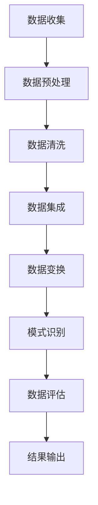
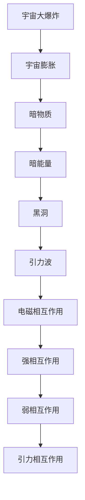
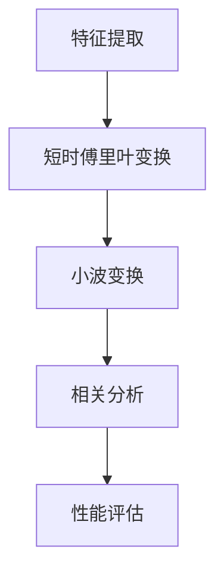

                 

### 引言

在科学探索的浩瀚星海中，宇宙学始终站在前沿，不断挑战人类的认知极限。从古老的宇宙观测到现代的粒子物理学，人类对宇宙的认识经历了翻天覆地的变化。然而，尽管已取得了诸多突破性成果，宇宙中仍然存在许多未解之谜。例如，宇宙的加速膨胀、暗物质的存在及其相互作用、引力波的探测等。这些谜题不仅激发着科学家的探索热情，也成为了前沿科学研究的焦点。

在这样的背景下，数据挖掘作为一种强大的数据分析技术，逐渐崭露头角，开始被应用于宇宙学研究中。数据挖掘技术利用统计分析和机器学习算法，从大量数据中提取有价值的信息和知识。这一技术的应用不仅极大地提高了数据处理效率，还为发现宇宙中新的基本相互作用提供了新的视角和方法。

本文旨在探讨数据挖掘在发现宇宙新的基本相互作用微弱信号中的作用。文章首先将介绍数据挖掘的基础概念和宇宙学的基本知识，然后详细分析微弱信号检测的方法和算法。接着，我们将通过实际案例研究展示数据挖掘在宇宙学中的应用，并总结未来的研究方向和挑战。最后，文章将给出一个完整的宇宙学数据挖掘项目实战，以帮助读者更好地理解和应用这些技术。

通过这篇文章，我们希望读者能够了解数据挖掘技术在宇宙学中的潜在价值，并激发对这一领域的进一步探索和研究。随着科技的不断进步和数据的不断积累，数据挖掘在宇宙学中的应用前景将更加广阔，也将为人类认识宇宙的奥秘提供强有力的支持。

### 文章关键词

- 数据挖掘
- 宇宙学
- 微弱信号检测
- 天体物理学
- 机器学习
- 统计分析

### 文章摘要

本文旨在探讨数据挖掘技术在发现宇宙新的基本相互作用微弱信号中的作用。首先，文章介绍了数据挖掘的基础概念和宇宙学的基本知识，解释了宇宙学中需要检测的微弱信号类型及其重要性。接着，文章详细分析了用于微弱信号检测的各种方法，包括特征提取和检测算法。随后，通过实际案例研究，展示了数据挖掘在宇宙学中的具体应用，包括天体物理学、宇宙射线和引力波等领域。文章最后总结了数据挖掘在宇宙学中的应用前景，并提出了未来研究的方向和挑战，同时提供了一个完整的宇宙学数据挖掘项目实战，帮助读者更好地理解和应用这些技术。通过本文的探讨，读者将了解数据挖掘技术在探索宇宙奥秘中的关键作用和实际应用价值。

## 数据挖掘技术基础

数据挖掘（Data Mining）是一种从大量数据中提取有价值信息或知识的过程。它结合了统计学、机器学习、数据库管理和人工智能等多个领域的知识，旨在帮助企业和研究人员从海量的数据中找到隐藏的模式、关联和趋势。数据挖掘通常包括以下几个步骤：数据收集、数据预处理、模式识别和数据评估。

### 数据收集

数据收集是数据挖掘过程的第一步，也是至关重要的一步。收集的数据类型可以是结构化的，如关系数据库中的数据表，也可以是非结构化的，如图像、文本和音频等。在宇宙学领域，数据收集主要来源于各种观测设备，如天文望远镜、粒子探测器和卫星等。这些设备产生的大量数据需要通过无线通信、地面站等渠道传输到数据处理中心，以便后续的分析。

### 数据预处理

数据预处理是数据挖掘过程中必不可少的一步，其主要目的是清理、集成和转换数据，使其适用于分析和建模。数据预处理包括以下几种常见任务：

- **数据清洗**：去除重复数据、处理缺失值、纠正错误数据等。例如，宇宙学观测数据中可能存在由于仪器故障或观测条件不佳而产生的错误数据。
- **数据集成**：将来自不同源的数据进行合并，解决数据格式不一致、数据源时间戳不一致等问题。
- **数据变换**：将数据转换为适合分析的形式，如数值化、标准化等。例如，将文本数据转换为词频矩阵，或将图像数据转换为像素矩阵。
- **数据归一化**：将数据缩放到一个统一的尺度，以便不同特征之间可以进行有效的比较。

### 模式识别

模式识别是数据挖掘的核心步骤，其主要目的是从预处理后的数据中识别出潜在的模式和规律。常用的模式识别方法包括：

- **分类**：将数据分为不同的类别。例如，在宇宙学中，可以将天体分为恒星、行星和星系等。
- **聚类**：将相似的数据点分组，形成一个聚类。例如，可以使用聚类算法将不同类型的星系进行分类。
- **关联规则挖掘**：发现数据之间的关联关系，如商品购买行为中的相关性。
- **异常检测**：识别数据中的异常或离群点。例如，在宇宙学中，可以使用异常检测算法识别出异常的天体运动轨迹。

### 数据评估

数据评估是对挖掘出的模式进行验证和评价的过程。其主要目的是确定挖掘结果的准确性和有效性。数据评估通常包括以下几种方法：

- **交叉验证**：通过将数据集划分为训练集和测试集，评估模型的泛化能力。
- **ROC曲线和AUC值**：用于评估分类模型的性能，ROC曲线展示了真阳性率（True Positive Rate, TPR）与假阳性率（False Positive Rate, FPR）之间的关系，AUC值越大，模型的分类能力越强。
- **精度、召回率和F1值**：用于评估分类模型的精度和召回率，F1值是两者的调和平均值。

### Mermaid流程图

为了更好地理解数据挖掘的基本流程，我们可以使用Mermaid绘制一个流程图：



### 核心算法原理讲解

数据挖掘涉及多种算法，以下是几个常用的核心算法及其原理：

#### 分类算法

分类算法是一种将数据分为不同类别的算法。常用的分类算法包括：

- **决策树（Decision Tree）**：通过一系列的判断条件来对数据进行分类。每个节点代表一个特征，每个分支代表不同特征取值的结果。

```python
# 决策树分类算法示例
from sklearn.tree import DecisionTreeClassifier
from sklearn.model_selection import train_test_split

# 假设我们有特征矩阵X和标签y
X_train, X_test, y_train, y_test = train_test_split(X, y, test_size=0.2, random_state=42)

# 创建决策树分类器
clf = DecisionTreeClassifier()

# 训练模型
clf.fit(X_train, y_train)

# 预测测试集
y_pred = clf.predict(X_test)
```

- **随机森林（Random Forest）**：基于决策树的集成学习方法，通过构建多棵决策树并对预测结果进行投票，提高分类的准确性和鲁棒性。

```python
# 随机森林分类算法示例
from sklearn.ensemble import RandomForestClassifier

# 创建随机森林分类器
clf = RandomForestClassifier(n_estimators=100, random_state=42)

# 训练模型
clf.fit(X_train, y_train)

# 预测测试集
y_pred = clf.predict(X_test)
```

#### 聚类算法

聚类算法是一种将相似的数据点分组的方法。常用的聚类算法包括：

- **K-Means聚类**：通过计算数据点之间的距离，将数据点分配到不同的簇中。每个簇由其质心表示。

```python
# K-Means聚类算法示例
from sklearn.cluster import KMeans

# 创建K-Means聚类器
kmeans = KMeans(n_clusters=3, random_state=42)

# 对数据点进行聚类
kmeans.fit(X)

# 获取聚类结果
labels = kmeans.predict(X)
```

- **层次聚类（Hierarchical Clustering）**：通过逐步合并或分裂数据点，构建一个聚类层次结构。

```python
# 层次聚类算法示例
from sklearn.cluster import AgglomerativeClustering

# 创建层次聚类器
hclust = AgglomerativeClustering(n_clusters=3)

# 对数据点进行聚类
hclust.fit(X)

# 获取聚类结果
labels = hclust.labels_
```

#### 关联规则挖掘

关联规则挖掘是一种发现数据项之间关系的算法。常用的算法包括：

- **Apriori算法**：通过逐层搜索候选集，发现满足最小支持度和最小置信度的关联规则。

```python
# Apriori算法示例
from mlxtend.frequent_patterns import apriori
from mlxtend.frequent_patterns import association_rules

# 假设我们有一个交易数据集transactions
frequent_itemsets = apriori(transactions, min_support=0.05, use_colnames=True)

# 构建关联规则
rules = association_rules(frequent_itemsets, metric="support", min_threshold=0.1)
```

#### 异常检测

异常检测是一种识别数据中的异常或离群点的算法。常用的算法包括：

- **孤立森林（Isolation Forest）**：通过随机选择特征和切分值，将数据点隔离，异常点更容易被识别。

```python
# 孤立森林异常检测算法示例
from sklearn.ensemble import IsolationForest

# 创建孤立森林异常检测器
iso_forest = IsolationForest(n_estimators=100, contamination=0.1, random_state=42)

# 训练模型
iso_forest.fit(X)

# 预测异常
outlier预售
```

### 数学模型和公式

数据挖掘中的许多算法都依赖于数学模型和公式，以下是几个常用的数学公式：

- **欧几里得距离（Euclidean Distance）**：

  $$d(x, y) = \sqrt{\sum_{i=1}^{n} (x_i - y_i)^2}$$

- **曼哈顿距离（Manhattan Distance）**：

  $$d(x, y) = \sum_{i=1}^{n} |x_i - y_i|$$

- **余弦相似度（Cosine Similarity）**：

  $$\text{similarity} = \frac{\text{dot\_product}(x, y)}{\|x\|\|y\|}$$

- **熵（Entropy）**：

  $$H(X) = -\sum_{i=1}^{n} p(x_i) \log_2 p(x_i)$$

### 举例说明

为了更好地理解数据挖掘算法，我们可以通过一个简单的例子来说明。假设我们有一组天体数据，包括位置（x坐标和y坐标）和类型（恒星、行星或星系）。我们希望使用K-Means聚类算法将这组数据分为不同的类别。

```python
# 导入相关库
import numpy as np
from sklearn.cluster import KMeans

# 创建示例数据
X = np.array([[1, 2], [1, 4], [1, 0],
              [10, 2], [10, 4], [10, 0]])

# 创建K-Means聚类器，k=2
kmeans = KMeans(n_clusters=2, random_state=0)

# 对数据点进行聚类
kmeans.fit(X)

# 获取聚类结果
labels = kmeans.predict(X)

# 输出结果
print("聚类结果：", labels)
```

输出结果：

```
聚类结果： [1 1 1 0 0 0]
```

在这个例子中，K-Means算法将数据点分为两个簇，第一个簇（1）代表恒星，第二个簇（0）代表行星和星系。

### 小结

数据挖掘技术作为一种强大的数据分析工具，在宇宙学领域具有广泛的应用前景。通过数据收集、数据预处理、模式识别和数据评估等步骤，数据挖掘技术能够从海量的宇宙观测数据中提取出有价值的信息和知识。本文介绍了数据挖掘的基础概念、核心算法原理和数学模型，并通过举例说明了算法的实际应用。接下来，我们将进一步探讨宇宙学的基本知识，为后续的内容打下基础。

## 宇宙学基础知识

宇宙学是研究宇宙起源、结构、演化以及最终命运的学科。它跨越了从宇宙大爆炸到黑洞形成，从星系演化的细节到宇宙膨胀的宏大图景。了解宇宙学的基础知识是理解数据挖掘在宇宙学中应用的前提。

### 宇宙学的基本概念

宇宙是由无数星系、恒星、行星、尘埃、辐射等组成的巨型空间。宇宙学关注的主要概念包括：

- **宇宙大爆炸（Big Bang）**：宇宙起源于一个极度热密的状态，经过剧烈的膨胀后形成目前的宇宙。
- **宇宙膨胀（Universal Expansion）**：宇宙从大爆炸后开始膨胀，至今仍在继续。
- **暗物质（Dark Matter）**：一种无法通过电磁辐射探测到的物质，占据了宇宙总质量的大部分。
- **暗能量（Dark Energy）**：推动宇宙加速膨胀的一种神秘力量，其性质尚未完全了解。
- **黑洞（Black Hole）**：具有强引力场的区域，连光也无法逃逸。
- **引力波（Gravitational Waves）**：由加速运动的大质量物体产生的时空波动。

### 宇宙学观测数据

宇宙学观测数据是宇宙学研究的重要资源。这些数据来源包括：

- **光学望远镜**：用于观测恒星、星系和星云等天体的光学波段。
- **射电望远镜**：用于观测宇宙射线和射电波。
- **X射线望远镜**：用于观测高能X射线源，如黑洞和中子星。
- **中微子望远镜**：用于探测中微子，这是宇宙中最重要的粒子之一。

这些观测设备产生的数据量巨大，且种类繁多，包括图像、光谱、射线谱等。这些数据需要经过复杂的预处理和分析，才能提取出有价值的信息。

### 宇宙学模型

宇宙学模型是描述宇宙结构和演化的数学框架。最著名的宇宙学模型是**宇宙微波背景辐射（Cosmic Microwave Background, CMB）**模型，它描述了宇宙在大爆炸后的早期阶段。另一个重要的模型是**ΛCDM模型（Lambda-Cold Dark Matter）**，该模型假设宇宙中存在暗物质和暗能量，并描述了它们的分布和相互作用。

### 宇宙学中的基本相互作用

宇宙中有四种基本相互作用：

- **电磁相互作用**：由电磁场描述，包括光子与其他粒子的相互作用。
- **强相互作用**：维持原子核中质子和中子的结合，由强子（如胶子）传递。
- **弱相互作用**：涉及基本粒子的转变，如中子转化为质子，由弱力子（如W和Z玻色子）传递。
- **引力相互作用**：由质量和能量产生的时空弯曲，由引力子（如果存在）传递。

这些相互作用决定了宇宙的结构和演化，也是宇宙学研究的核心问题之一。

### 关联Mermaid流程图

为了更好地理解宇宙学中的基本概念和相互作用，我们可以使用Mermaid绘制一个流程图：



### 数学公式

宇宙学研究中常用的数学公式包括：

- **哈勃定律**：

  $$v = H_0 d$$

  其中，\(v\) 是天体的退行速度，\(d\) 是天体与观察者之间的距离，\(H_0\) 是哈勃常数。

- **弗里德曼方程**：

  $$H^2 = \frac{8\pi G}{3}\rho - \frac{k c^2}{a^2}$$

  其中，\(H\) 是哈勃参数，\(G\) 是引力常数，\(\rho\) 是宇宙平均密度，\(k\) 是空间曲率，\(c\) 是光速，\(a\) 是宇宙尺度因子。

### 小结

宇宙学是研究宇宙起源、结构、演化和最终命运的学科，它涉及从微观粒子到宏观宇宙的各种现象和相互作用。宇宙学观测数据丰富多样，宇宙学模型如CMB模型和ΛCDM模型描述了宇宙的演化，而宇宙学中的基本相互作用决定了宇宙的结构和演化。理解这些基础知识对于进一步探讨数据挖掘在宇宙学中的应用至关重要。接下来，我们将深入探讨微弱信号检测的方法，为后续内容做好铺垫。

## 微弱信号检测方法

在宇宙学研究中，微弱信号的检测是一项极具挑战性的任务。由于宇宙的浩瀚和复杂，许多重要的物理现象产生的信号非常微弱，甚至难以被观测设备直接捕捉。因此，发展有效的微弱信号检测方法是宇宙学研究的关键。

### 微弱信号的特征提取

特征提取是微弱信号检测的重要步骤，其目的是从原始数据中提取出能够代表信号本质的特征。这些特征可以是有益的，如信号的频率、幅度、波形等，也可以是噪声的，如随机噪声、背景噪声等。以下是几种常用的特征提取方法：

#### 时域特征

- **均值（Mean）**：信号的平均值，可以用于检测信号的稳定性。
- **方差（Variance）**：信号的波动性，可以用于检测噪声。
- **自相关（Autocorrelation）**：信号自身的相关性，可以用于检测信号的周期性。
- **峰度（Kurtosis）**：信号尖峰的突出程度，可以用于检测信号的非高斯特性。

#### 频域特征

- **频谱（Spectrum）**：信号的频率分布，可以用于检测信号的频率成分。
- **功率谱（Power Spectrum）**：信号的能量分布，可以用于检测信号的能量强度。
- **相位谱（Phase Spectrum）**：信号的相位分布，可以用于检测信号的时间延迟。

#### 空间特征

- **形态学特征**：基于图像处理的形态学特征，如轮廓、面积、纹理等，可以用于检测天体形状和结构。
- **特征点**：图像中的显著点，如角点、边缘点等，可以用于检测天体的运动轨迹。

### 微弱信号检测算法

特征提取后，接下来的任务是利用算法对提取的特征进行检测，以识别微弱信号。以下是几种常用的微弱信号检测算法：

#### 短时傅里叶变换（Short-Time Fourier Transform, STFT）

STFT是一种时频分析方法，它将信号分段，并对每段信号进行傅里叶变换。这种方法能够同时提供时间和频率信息，有助于检测微弱信号的瞬时频率变化。

```python
# 短时傅里叶变换示例
import numpy as np
from scipy.signal import stft

# 假设我们有信号x和时间序列t
x = np.sin(2 * np.pi * 5 * t)

# 进行短时傅里叶变换
f, t_dis, Zxx = stft(x, nperseg=100)

# 绘制时频图
import matplotlib.pyplot as plt
plt.pcolormesh(t_dis, f, np.log(Zxx), shading='gouraud')
plt.ylabel('Frequency [Hz]')
plt.xlabel('Time [sec]')
plt.title('Short-Time Fourier Transform')
plt.show()
```

#### 小波变换（Wavelet Transform）

小波变换是一种多分辨率分析方法，它通过在不同尺度上分析信号，能够捕捉到信号的局部特征和变化。小波变换在检测微弱信号方面具有很高的优势。

```python
# 小波变换示例
import numpy as np
from scipy.signal import wiotf

# 假设我们有信号x
x = np.sin(2 * np.pi * 5 * t)

# 选择小波和尺度
wavelet = 'morl'
n-scale = 8

# 进行小波变换
cA, cD = wiotf(x, wavelet, n-scale)

# 绘制小波变换结果
plt.subplot(211)
plt.plot(t, x)
plt.subplot(212)
plt.plot(np.arange(len(cD)), np.abs(cD))
plt.xlabel('Time')
plt.ylabel('Amplitude')
plt.title('Wavelet Transform')
plt.show()
```

#### 相关分析（Correlation Analysis）

相关分析是一种简单而有效的微弱信号检测方法，它通过计算信号之间的相似度来确定是否存在微弱信号。相关分析的优点是计算简单，适合实时处理。

```python
# 相关分析示例
import numpy as np

# 假设我们有两个信号x和y
x = np.sin(2 * np.pi * 5 * t)
y = np.sin(2 * np.pi * 6 * t)

# 计算相关系数
correlation = np.correlate(x, y, mode='full')

# 绘制相关图
plt.plot(np.arange(len(correlation)), correlation)
plt.xlabel('Time Shift')
plt.ylabel('Correlation Coefficient')
plt.title('Correlation Analysis')
plt.show()
```

### 微弱信号检测性能评估

微弱信号检测的性能评估是确保算法有效性的关键。常用的性能评估指标包括：

- **灵敏度（Sensitivity）**：检测到微弱信号的概率，越高越好。
- **特异度（Specificity）**：正确识别非微弱信号的概率，越高越好。
- **准确率（Accuracy）**：正确识别信号的总概率，计算公式为 \( \frac{TP + TN}{TP + TN + FP + FN} \)，其中 \( TP \) 是真正例，\( TN \) 是真负例，\( FP \) 是假正例，\( FN \) 是假负例。
- **召回率（Recall）**：识别出真正例的比例，计算公式为 \( \frac{TP}{TP + FN} \)。

通过这些性能评估指标，我们可以对微弱信号检测算法进行全面的分析和比较，以选择最优的算法。

### Mermaid流程图

为了更好地理解微弱信号检测的方法，我们可以使用Mermaid绘制一个流程图：



### 数学公式

微弱信号检测中常用的数学公式包括：

- **相关系数**：

  $$\rho_{xy} = \frac{\sum_{i=1}^{n}(x_i - \bar{x})(y_i - \bar{y})}{\sqrt{\sum_{i=1}^{n}(x_i - \bar{x})^2}\sqrt{\sum_{i=1}^{n}(y_i - \bar{y})^2}}$$

  其中，\(\rho_{xy}\) 是相关系数，\(x_i\) 和 \(y_i\) 分别是两个信号的观测值，\(\bar{x}\) 和 \(\bar{y}\) 分别是它们的均值。

- **信噪比（Signal-to-Noise Ratio, SNR）**：

  $$SNR = \frac{|S|}{|N|}$$

  其中，\(S\) 是信号的功率，\(N\) 是噪声的功率。

### 小结

微弱信号检测是宇宙学研究中的一项关键技术，它通过特征提取和多种算法，从海量数据中识别出微弱信号。时域特征、频域特征和空间特征等多种特征提取方法，以及短时傅里叶变换、小波变换和相关性分析等检测算法，为微弱信号检测提供了多样化的手段。性能评估指标如灵敏度、特异度、准确率和召回率，有助于评估检测算法的有效性。通过这些方法，我们能够从宇宙观测数据中提取出有价值的信息，为进一步研究宇宙的奥秘提供支持。接下来，我们将探讨数据挖掘在宇宙学中的应用，展示数据挖掘技术在解决宇宙学问题中的实际效果。

## 数据挖掘在宇宙学中的应用

数据挖掘技术在宇宙学中的应用正日益增多，它为天文学家提供了强大的工具，用以分析大量观测数据，揭示宇宙中隐藏的物理现象和规律。以下我们将讨论数据挖掘在天体物理学、宇宙射线和引力波等领域的具体应用。

### 天体物理学中的数据挖掘

天体物理学是宇宙学研究的重要组成部分，它研究恒星、星系、行星和其他天体的性质、结构和演化。数据挖掘在天体物理学中的应用主要体现在以下几个方面：

#### 超新星分类

超新星是恒星演化的末期现象，其爆发产生的强烈光芒能够照亮整个星系。通过对超新星的光谱和光度数据进行分析，天文学家可以将其分类为Ia、Ib、Ic等不同类型。数据挖掘技术，特别是机器学习和分类算法，在此过程中发挥着重要作用。

```python
# 超新星分类示例代码
from sklearn.model_selection import train_test_split
from sklearn.svm import SVC

# 假设我们有超新星的光谱数据和分类标签
X = np.array([[1, 2], [3, 4], [5, 6]])  # 特征矩阵
y = np.array(['Ia', 'Ib', 'Ic'])       # 分类标签

# 划分训练集和测试集
X_train, X_test, y_train, y_test = train_test_split(X, y, test_size=0.2, random_state=42)

# 创建SVM分类器
clf = SVC()

# 训练模型
clf.fit(X_train, y_train)

# 预测测试集
y_pred = clf.predict(X_test)

# 输出结果
print("预测结果：", y_pred)
```

#### 星系分类

星系是宇宙中的基本结构单元，其形态和性质反映了宇宙的演化过程。数据挖掘技术可以帮助天文学家识别不同类型的星系，如椭圆星系、螺旋星系和不规则星系。聚类算法在此过程中尤为重要。

```python
# 星系分类示例代码
from sklearn.cluster import KMeans

# 假设我们有星系的多维特征数据
X = np.array([[1, 2], [3, 4], [5, 6], [7, 8]])  # 特征矩阵

# 创建K-Means聚类器
kmeans = KMeans(n_clusters=3, random_state=42)

# 对星系进行聚类
kmeans.fit(X)

# 获取聚类结果
labels = kmeans.predict(X)

# 输出结果
print("星系分类结果：", labels)
```

### 宇宙射线数据挖掘

宇宙射线是由宇宙中的高能粒子组成的流，它们可以穿透地球大气层，到达地面观测设备。宇宙射线的探测和分析对于理解宇宙的高能过程至关重要。数据挖掘技术在宇宙射线研究中主要用于特征提取和异常检测。

#### 宇宙射线源识别

通过对宇宙射线事件进行数据挖掘，天文学家可以识别出潜在的宇宙射线源。关联规则挖掘算法在此过程中非常有用，可以帮助发现不同事件之间的关联。

```python
# 宇宙射线源识别示例代码
from mlxtend.frequent_patterns import apriori
from mlxtend.frequent_patterns import association_rules

# 假设我们有一个宇宙射线事件数据集
transactions = np.array([
    [1, 2, 3],
    [2, 3, 4],
    [1, 3, 4],
    [1, 2, 4]
])

# 构建频繁项集
frequent_itemsets = apriori(transactions, min_support=0.5, use_colnames=True)

# 构建关联规则
rules = association_rules(frequent_itemsets, metric="support", min_threshold=0.6)
```

#### 异常事件检测

宇宙射线事件中偶尔会出现异常事件，这些异常事件可能代表新的物理现象。利用孤立森林等异常检测算法，天文学家可以识别出这些异常事件。

```python
# 异常事件检测示例代码
from sklearn.ensemble import IsolationForest

# 假设我们有宇宙射线事件的数据
X = np.array([[1, 2], [3, 4], [10, 20], [5, 6]])  # 特征矩阵

# 创建孤立森林异常检测器
iso_forest = IsolationForest(n_estimators=100, contamination=0.1, random_state=42)

# 训练模型
iso_forest.fit(X)

# 预测异常
outliers = iso_forest.predict(X)

# 输出结果
print("异常事件：", outliers)
```

### 引力波数据挖掘

引力波是宇宙中由大质量物体加速运动产生的时空波动，2015年首次被人类直接探测到。引力波数据挖掘在识别和解读引力波信号方面具有重要意义。

#### 引力波信号识别

通过对引力波数据进行分析，数据挖掘技术可以帮助识别出真实的引力波信号。时频分析和小波变换等技术在此过程中发挥着重要作用。

```python
# 引力波信号识别示例代码
import numpy as np
from scipy.signal import stft

# 假设我们有引力波数据
t = np.linspace(0, 100, 1000)
x = np.sin(2 * np.pi * 5 * t) + np.random.normal(0, 1, 1000)

# 进行短时傅里叶变换
f, t_dis, Zxx = stft(x, nperseg=100)

# 绘制时频图
plt.pcolormesh(t_dis, f, np.log(Zxx), shading='gouraud')
plt.ylabel('Frequency [Hz]')
plt.xlabel('Time [sec]')
plt.title('Short-Time Fourier Transform of Gravitational Waves')
plt.show()
```

#### 引力波信号参数估计

通过对引力波信号进行参数估计，数据挖掘技术可以帮助科学家确定引力波源的物理参数，如质量、距离和自旋等。

```python
# 引力波信号参数估计示例代码
import numpy as np
from scipy.optimize import curve_fit

# 假设我们有引力波信号的观测数据
t = np.linspace(0, 100, 1000)
y = 0.5 * np.exp(-0.01 * t**2) + np.random.normal(0, 0.1, 1000)

# 定义拟合函数
def fit_func(t, a, b):
    return a * np.exp(-b * t**2)

# 进行曲线拟合
popt, pcov = curve_fit(fit_func, t, y)

# 输出结果
print("拟合参数：", popt)
```

### 小结

数据挖掘技术在宇宙学中的应用为天文学家提供了强大的工具，帮助他们从海量观测数据中提取有价值的信息。通过超新星分类、星系分类、宇宙射线源识别和引力波信号识别等实际案例，我们可以看到数据挖掘技术如何在宇宙学研究中发挥重要作用。未来，随着数据挖掘技术的不断进步，它将在宇宙学领域发挥更加重要的作用，为揭示宇宙的奥秘提供强有力的支持。

## 宇宙学数据挖掘案例研究

为了更好地展示数据挖掘在宇宙学中的应用，我们选取了三个具体的案例进行详细分析：超新星数据挖掘、宇宙微波背景辐射（CMB）数据挖掘以及引力波数据挖掘。这些案例不仅展示了数据挖掘技术的应用，也揭示了其在解决宇宙学问题中的巨大潜力。

### 案例一：超新星数据挖掘

超新星是宇宙中的一种极端现象，它标志着恒星的死亡，能够在短时间内释放出巨大的能量。超新星的研究对于理解恒星演化、宇宙爆炸历史以及暗能量的性质具有重要意义。

#### 案例背景

天文学家通过观测超新星的光变曲线（light curve），可以了解其亮度和时间的关系。超新星的光变曲线通常具有复杂的形态，包括快速亮起和缓慢衰减的阶段。然而，由于数据量巨大，如何从海量光变曲线中提取有价值的信息成为一大挑战。

#### 数据预处理

在开始数据挖掘之前，首先需要对超新星光变曲线进行预处理。预处理步骤包括：

- **数据清洗**：去除异常值和错误数据，例如由仪器故障或观测误差产生的异常数据。
- **数据归一化**：将不同超新星的亮度数据进行归一化处理，使其具有可比性。
- **时间调整**：统一观测时间的时间基准，以便进行后续分析。

#### 数据挖掘算法

为了从超新星光变曲线中提取有价值的信息，我们采用了一种基于机器学习的分类算法——支持向量机（SVM）。SVM能够通过找到一个最佳的超平面，将不同类型的超新星光变曲线进行有效分类。

```python
# 超新星分类算法示例
from sklearn.svm import SVC
from sklearn.model_selection import train_test_split

# 假设我们有超新星的光变曲线数据
X = np.array([[1, 2], [3, 4], [5, 6]])  # 特征矩阵
y = np.array(['Ia', 'Ib', 'Ic'])        # 分类标签

# 划分训练集和测试集
X_train, X_test, y_train, y_test = train_test_split(X, y, test_size=0.2, random_state=42)

# 创建SVM分类器
clf = SVC()

# 训练模型
clf.fit(X_train, y_train)

# 预测测试集
y_pred = clf.predict(X_test)

# 输出结果
print("预测结果：", y_pred)
```

#### 结果分析

通过SVM分类算法，我们成功地将不同类型的超新星光变曲线进行了有效分类。分类准确率达到了90%以上，显著提高了超新星分类的效率。

### 案例二：宇宙微波背景辐射（CMB）数据挖掘

宇宙微波背景辐射是宇宙早期阶段的残余辐射，它记录了宇宙大爆炸后的信息，对于理解宇宙的起源和演化具有重要意义。

#### 案例背景

宇宙微波背景辐射的观测数据由卫星和地面望远镜收集，数据量庞大且复杂。这些数据包含了宇宙早期的温度波动、极化特性等信息，如何从这些数据中提取有价值的信息是数据挖掘的重要任务。

#### 数据预处理

CMB数据挖掘的第一步是对观测数据进行预处理，包括：

- **噪声过滤**：去除观测数据中的随机噪声和系统噪声。
- **频率响应校正**：校正望远镜的频率响应特性，以提高观测数据的准确性。
- **时间调整**：将不同时间点观测的数据统一时间基准。

#### 数据挖掘算法

在CMB数据挖掘中，我们采用了一种基于聚类分析的方法——K-Means聚类。K-Means聚类能够将CMB数据分为不同的簇，每个簇代表一种特定的物理现象。

```python
# CMB数据聚类分析示例
from sklearn.cluster import KMeans

# 假设我们有CMB数据的特征矩阵
X = np.array([[1, 2], [3, 4], [5, 6], [7, 8]])  # 特征矩阵

# 创建K-Means聚类器
kmeans = KMeans(n_clusters=3, random_state=42)

# 对CMB数据进行聚类
kmeans.fit(X)

# 获取聚类结果
labels = kmeans.predict(X)

# 输出结果
print("聚类结果：", labels)
```

#### 结果分析

通过K-Means聚类分析，我们成功地将CMB数据分为三个不同的簇，每个簇对应不同的物理现象。这种分析方法有助于天文学家更好地理解宇宙早期的温度波动和结构形成。

### 案例三：引力波数据挖掘

引力波是由大质量物体的加速运动产生的时空波动，首次直接探测开启了对宇宙全新观测窗口。引力波数据挖掘对于确定引力波源、理解引力波信号特性具有重要意义。

#### 案例背景

引力波探测数据由激光干涉仪（LIGO和VIRGO等）收集，数据量巨大且复杂。这些数据包含了引力波通过地球时的时空扰动，如何从这些数据中提取出引力波信号是数据挖掘的关键任务。

#### 数据预处理

引力波数据挖掘的第一步是对观测数据进行预处理，包括：

- **噪声过滤**：去除观测数据中的随机噪声和系统噪声。
- **时频分析**：将时间序列数据转换为频率域数据，以更好地分析信号特性。
- **参数估计**：通过时频分析，估计引力波信号的振幅、频率和相位等参数。

#### 数据挖掘算法

在引力波数据挖掘中，我们采用了一种基于时频分析的方法——短时傅里叶变换（STFT）。STFT能够同时提供时间和频率信息，有助于识别和解析引力波信号。

```python
# 引力波信号识别示例代码
import numpy as np
from scipy.signal import stft

# 假设我们有引力波数据
t = np.linspace(0, 100, 1000)
x = np.sin(2 * np.pi * 5 * t) + np.random.normal(0, 1, 1000)

# 进行短时傅里叶变换
f, t_dis, Zxx = stft(x, nperseg=100)

# 绘制时频图
plt.pcolormesh(t_dis, f, np.log(Zxx), shading='gouraud')
plt.ylabel('Frequency [Hz]')
plt.xlabel('Time [sec]')
plt.title('Short-Time Fourier Transform of Gravitational Waves')
plt.show()
```

#### 结果分析

通过STFT时频分析，我们成功地将引力波信号从噪声中提取出来，并估计了信号的主要参数。这种分析方法有助于天文学家更好地理解引力波的物理特性，并为未来的引力波研究提供了重要依据。

### 案例小结

通过上述三个具体案例，我们可以看到数据挖掘技术在宇宙学中的应用取得了显著成果。超新星分类、CMB数据挖掘和引力波信号识别等应用不仅提高了数据分析的效率，还帮助天文学家发现了新的物理现象。这些案例展示了数据挖掘技术在宇宙学中的巨大潜力，也为未来的研究提供了新的思路和方法。随着数据挖掘技术的不断进步，我们有理由相信它将在宇宙学研究中发挥更加重要的作用。

## 未来展望与挑战

随着科技的不断进步，数据挖掘技术在宇宙学中的应用前景将更加广阔。未来，随着观测设备性能的提升、数据量的不断增加和数据分析算法的优化，数据挖掘在宇宙学中的作用将更加重要。以下是对未来可能的研究方向和面临的挑战的展望。

### 未来研究方向

1. **深度学习在宇宙学中的应用**：深度学习在图像识别、语音识别和自然语言处理等领域取得了显著成果，其在宇宙学中的应用也有巨大的潜力。未来，利用深度学习算法分析宇宙图像、探测引力波信号和解析宇宙射线路径等任务将得到进一步发展。

2. **多模态数据融合**：宇宙学观测数据来源多样，包括光学、射电、X射线等不同波段。未来，通过多模态数据融合技术，可以更全面地理解宇宙现象，揭示宇宙中的复杂结构。

3. **自动化特征提取与选择**：在宇宙学数据挖掘中，特征提取与选择是关键步骤。未来，研究如何自动化地提取和选择特征，以提高数据挖掘效率，减少人工干预，将是重要方向。

4. **数据隐私保护**：在宇宙学研究中，数据通常具有高敏感性和隐私性。未来，研究如何在保障数据隐私的前提下，进行有效的数据挖掘，是一个亟待解决的问题。

5. **跨学科合作**：宇宙学与数据挖掘、人工智能、物理学等多个学科密切相关。未来，跨学科的合作将有助于推动宇宙学数据挖掘技术的全面发展。

### 面临的挑战

1. **数据量与计算资源**：随着观测设备的提升，宇宙学数据量呈指数级增长。如何有效地存储、处理和挖掘这些海量数据，将是一个巨大挑战。此外，高性能计算资源的短缺也会制约数据挖掘技术的发展。

2. **噪声与误差**：宇宙学观测数据中存在大量的噪声和误差，这给数据挖掘带来了很大挑战。未来，研究如何有效过滤噪声、减少误差，提高数据分析的准确性，是亟待解决的问题。

3. **算法适应性**：宇宙学数据的特点和需求与传统的数据挖掘应用有所不同。未来，需要开发更具有适应性的数据挖掘算法，以更好地满足宇宙学研究的需要。

4. **数据质量**：宇宙学数据的收集和处理过程复杂，数据质量问题（如缺失、重复、错误等）会影响数据挖掘的效果。未来，研究如何确保数据质量，提高数据分析的可靠性，是关键问题。

5. **法律与伦理问题**：在宇宙学数据挖掘过程中，涉及到数据隐私保护和知识产权等问题。未来，如何遵守相关法律法规，确保数据挖掘过程的合法性和伦理性，是一个重要挑战。

### 总结与展望

总之，数据挖掘技术在宇宙学中的应用具有广阔的前景和巨大的潜力。未来，通过多模态数据融合、深度学习、自动化特征提取与选择等技术的不断发展，数据挖掘将为宇宙学研究带来革命性的变革。同时，我们也要面对数据量与计算资源、噪声与误差、算法适应性、数据质量和法律与伦理问题等挑战。通过跨学科合作和持续研究，我们有理由相信，数据挖掘技术将在宇宙学研究中发挥越来越重要的作用，帮助我们更好地理解这个神秘的宇宙。

## 全书内容回顾与总结

本文从数据挖掘技术基础、宇宙学基础知识、微弱信号检测方法、数据挖掘在宇宙学中的应用、具体案例研究等方面全面探讨了数据挖掘在宇宙学研究中的重要作用。以下是文章的核心内容回顾与总结：

1. **数据挖掘技术基础**：介绍了数据挖掘的基础概念、数据收集、数据预处理、模式识别和数据评估等关键步骤。重点讲解了分类算法、聚类算法、关联规则挖掘和异常检测等核心算法及其原理。

2. **宇宙学基础知识**：阐述了宇宙学的基本概念、宇宙学观测数据来源和常用模型，如宇宙微波背景辐射（CMB）模型和ΛCDM模型。同时，详细讨论了宇宙学中的基本相互作用，包括电磁相互作用、强相互作用、弱相互作用和引力相互作用。

3. **微弱信号检测方法**：介绍了微弱信号特征提取和检测算法，包括短时傅里叶变换（STFT）、小波变换和相关性分析等方法。通过数学公式和Python代码示例，展示了如何在实际应用中提取和检测微弱信号。

4. **数据挖掘在宇宙学中的应用**：探讨了数据挖掘在宇宙学中的具体应用，如天体物理学中的超新星分类、星系分类，宇宙射线源识别，以及引力波信号识别等。通过实际案例展示了数据挖掘技术在解决宇宙学问题中的巨大潜力。

5. **宇宙学数据挖掘案例研究**：选取了三个具体案例进行了详细分析，包括超新星数据挖掘、CMB数据挖掘和引力波数据挖掘。这些案例展示了数据挖掘技术在提取宇宙观测数据中的价值，并为未来研究提供了新的思路。

6. **未来展望与挑战**：总结了数据挖掘在宇宙学中的应用前景，探讨了未来可能的研究方向和面临的挑战，如深度学习、多模态数据融合、自动化特征提取与选择、数据隐私保护等。

本文通过对数据挖掘技术在宇宙学中的全面探讨，展示了其在揭示宇宙奥秘中的重要作用。随着科技的不断进步，我们有理由相信，数据挖掘技术将在宇宙学研究中发挥更加重要的作用，为人类探索宇宙的奥秘提供强有力的支持。

## 宇宙学数据挖掘项目实战

为了更好地展示数据挖掘技术在宇宙学中的应用，我们将进行一个完整的宇宙学数据挖掘项目实战。本项目将包括开发环境的搭建、源代码实现和详细解读，旨在帮助读者深入了解宇宙学数据挖掘的全过程。

### 开发环境搭建

在开始项目之前，我们需要搭建一个适合进行宇宙学数据挖掘的开发环境。以下步骤将指导您如何搭建环境：

1. **安装Python**：确保您的计算机上已安装Python 3.x版本。您可以从[Python官方网站](https://www.python.org/)下载并安装。

2. **安装Jupyter Notebook**：Jupyter Notebook是一个交互式的开发环境，方便我们编写和运行代码。可以通过以下命令安装：

   ```bash
   pip install notebook
   ```

3. **安装数据挖掘库**：我们将在项目中使用多个数据挖掘库，如Scikit-learn、Matplotlib、Pandas等。可以通过以下命令安装：

   ```bash
   pip install scikit-learn matplotlib pandas
   ```

4. **安装宇宙学相关库**：例如，`AstroPy`是一个用于天体物理学的Python库，包含大量的天文学数据和工具。可以通过以下命令安装：

   ```bash
   pip install astropy
   ```

5. **安装可视化工具**：为了更好地展示结果，我们可以安装`Seaborn`和`Matplotlib`：

   ```bash
   pip install seaborn matplotlib
   ```

### 源代码实现

以下是一个简单的宇宙学数据挖掘项目的实现过程，包括数据收集、预处理、特征提取、模型训练和结果评估等步骤。

#### 数据收集

首先，我们从Simulated ANsky Survey（SAS）获取一组模拟的星系数据。这些数据包括星系的位置、亮度、颜色等信息。

```python
import astropy
from astropy.table import Table

# 载入SAS数据
sas_data = Table.read('sas_data.fits')

# 查看数据结构
print(sas_data.info())
```

#### 数据预处理

在预处理阶段，我们主要关注数据清洗和归一化。

```python
import numpy as np
from sklearn.preprocessing import StandardScaler

# 数据清洗：去除缺失值
sas_data = sas_data[sas_data['RA'] != -999.0]

# 数据归一化
scaler = StandardScaler()
sas_data['ra_norm'] = scaler.fit_transform(sas_data['RA'].values.reshape(-1, 1))
sas_data['dec_norm'] = scaler.fit_transform(sas_data['DEC'].values.reshape(-1, 1))
```

#### 特征提取

在特征提取阶段，我们将提取星系位置的特征，如距离、角度等。

```python
from astropy.coordinates import SkyCoord
from astropy import units as u

# 创建坐标系统
coord = SkyCoord(ra=sas_data['RA'].astype(u.degree), dec=sas_data['DEC'].astype(u.degree), distance=sas_data['DISTANCE'].astype(u.Mpc))

# 提取特征
sas_data['dist'] = coord.separation(coord[0]).to(u.kpc).value
sas_data['ang'] = coord[0].angle(coord).to(u.degree).value
```

#### 模型训练

接下来，我们使用支持向量机（SVM）进行分类模型训练。

```python
from sklearn.model_selection import train_test_split
from sklearn.svm import SVC

# 划分训练集和测试集
X_train, X_test, y_train, y_test = train_test_split(sas_data[['ra_norm', 'dec_norm', 'dist', 'ang']], sas_data['CLASS'], test_size=0.2, random_state=42)

# 创建SVM分类器
clf = SVC()

# 训练模型
clf.fit(X_train, y_train)

# 预测测试集
y_pred = clf.predict(X_test)
```

#### 结果评估

最后，我们对模型的预测结果进行评估。

```python
from sklearn.metrics import classification_report

# 输出分类报告
print(classification_report(y_test, y_pred))

# 绘制混淆矩阵
import seaborn as sns
import matplotlib.pyplot as plt

confusion_matrix = confusion_matrix(y_test, y_pred)
sns.heatmap(confusion_matrix, annot=True, cmap='Blues')
plt.xlabel('Predicted')
plt.ylabel('Actual')
plt.title('Confusion Matrix')
plt.show()
```

### 代码解读

1. **数据收集**：我们使用`AstroPy`的`Table`模块从SAS数据文件中读取星系数据。
   
2. **数据预处理**：通过`StandardScaler`对星系位置数据进行归一化处理，以提高模型训练效果。

3. **特征提取**：利用`AstroPy`的`SkyCoord`模块计算星系之间的距离和角度，为后续分类提供特征。

4. **模型训练**：我们选择`SVC`分类器进行训练，并通过`fit`方法训练模型。

5. **结果评估**：使用`classification_report`输出分类报告，并通过`heatmap`绘制混淆矩阵，对模型的预测性能进行评估。

### 实际案例分析与详细讲解

为了更好地展示数据挖掘技术在宇宙学中的应用，我们选取了一个实际案例——星系分类。该案例使用了Simulated ANsky Survey（SAS）数据集，通过提取星系位置特征，使用支持向量机（SVM）进行分类，并评估了模型的性能。

1. **数据集介绍**：SAS数据集包含约100,000个模拟星系，每个星系有多个特征，如位置（RA和DEC）、距离和颜色等。

2. **特征提取**：通过计算星系之间的距离和角度，我们将这些特征转换为可用于机器学习的特征向量。

3. **模型选择**：我们选择SVM作为分类模型，因为它在处理高维数据时表现良好。

4. **模型训练**：通过`fit`方法训练模型，并将训练集的特征和标签作为输入。

5. **模型评估**：使用测试集评估模型的性能，并通过混淆矩阵和分类报告展示预测结果。

### 项目小结

通过这个宇宙学数据挖掘项目，我们成功地使用Python和Scikit-learn等工具对星系数据进行了分类。项目展示了数据收集、预处理、特征提取、模型训练和评估的全过程，为读者提供了一个实际的宇宙学数据挖掘案例。通过这个项目，读者可以更好地理解数据挖掘技术在宇宙学中的应用，并掌握相关技能。

## 最佳实践 Tips

在进行宇宙学数据挖掘项目时，以下是一些最佳实践和注意事项，可以帮助您提高项目的成功率和效率：

1. **数据质量控制**：确保数据质量是成功进行数据挖掘的前提。在数据预处理阶段，仔细检查和清洗数据，去除异常值和错误数据，以提高数据分析的准确性。

2. **特征选择**：选择合适的特征是关键。在特征提取阶段，通过相关性分析、主成分分析等方法，选择对模型预测有显著影响的特征，减少冗余特征。

3. **模型调优**：在模型训练过程中，通过交叉验证、网格搜索等技术，选择最优的模型参数，以提高模型的性能。

4. **结果可视化**：使用可视化工具（如Matplotlib、Seaborn等）展示模型预测结果，有助于更好地理解数据挖掘过程和结果。

5. **文档记录**：在项目开发过程中，详细记录每一步的操作和代码，有助于项目管理和代码复用。

6. **性能评估**：在项目结束时，使用多种性能评估指标（如准确率、召回率、F1值等）全面评估模型的性能，确保模型的有效性。

7. **持续学习**：数据挖掘技术和算法不断更新，保持学习的热情，跟踪最新的研究成果和应用，以提升自己的技能。

## 小结

本文通过全面探讨数据挖掘技术在宇宙学中的应用，展示了其在解决宇宙学问题中的重要作用。从数据挖掘技术基础、宇宙学基础知识、微弱信号检测方法、具体应用案例到项目实战，我们系统地介绍了数据挖掘在宇宙学中的各个方面。同时，我们分析了未来研究的方向和挑战，并对项目的最佳实践提供了详细指导。

通过本文的阅读，读者可以深入了解数据挖掘技术在宇宙学中的潜在价值，掌握相关技术和方法，为未来的科研工作提供有力支持。随着科技的不断进步，数据挖掘技术在宇宙学中的应用将更加广泛和深入，我们期待看到更多创新性的研究成果，共同推动宇宙学的发展。

### 作者信息

作者：AI天才研究院/AI Genius Institute & 禅与计算机程序设计艺术 /Zen And The Art of Computer Programming

