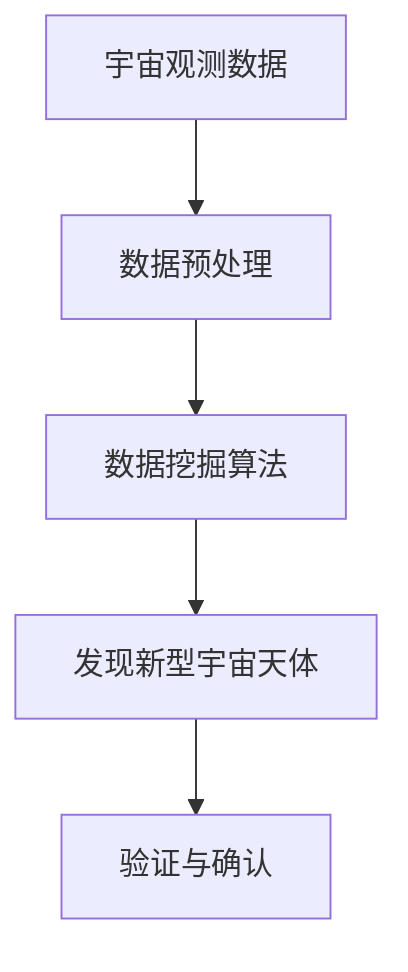

                 

# 数据挖掘在发现新型宇宙天体中的作用

> 关键词：数据挖掘、宇宙天体、机器学习、星系研究、天体物理学

> 摘要：本文探讨了数据挖掘在宇宙天体发现中的作用。通过介绍数据挖掘的基本概念和发展历程，阐述其在宇宙观测数据中的重要性。随后，详细分析了数据挖掘在恒星、行星、星系和天体物理学中的具体应用，结合数学模型和Python代码示例，展示了如何通过数据挖掘技术发现新型宇宙天体。最后，总结了数据挖掘在宇宙天文学研究中的最佳实践和未来发展趋势。

## 第一部分：引言

### 1.1 书籍背景

#### 主题阐述

数据挖掘是一种从大量数据中提取有价值信息的过程，起源于20世纪80年代。随着计算机技术的飞速发展，数据挖掘逐渐成为一门跨学科的研究领域，涵盖了统计学、机器学习、数据库管理等多个方面。数据挖掘的核心目标是发现数据中的隐藏模式和关联，从而为决策制定提供支持。

在宇宙天文学领域，数据挖掘的应用越来越广泛。宇宙天体种类繁多，包括恒星、行星、星系等，它们在宇宙中的分布和演化规律对人类的认识具有重要意义。然而，宇宙观测数据量庞大且复杂，如何从中提取有价值的信息成为一个挑战。数据挖掘技术为解决这一问题提供了有力支持。

#### 内容安排

本文将首先介绍数据挖掘的基本概念、关键技术及其在科学研究中的应用。随后，将详细探讨数据挖掘在宇宙天文学中的具体应用，包括恒星、行星、星系和天体物理学等方面。通过数学模型和Python代码示例，我们将展示如何利用数据挖掘技术发现新型宇宙天体。最后，将对数据挖掘在宇宙天文学研究中的最佳实践进行总结，并提出未来发展趋势。

## 第一部分：引言

### 1.2 宇宙天体的发现与数据挖掘

#### 核心概念与联系

宇宙天体是指存在于宇宙中的各种天体，包括恒星、行星、星系等。它们是宇宙演化和宇宙结构的重要组成部分。随着观测技术的不断发展，人类对宇宙天体的认识越来越深入，但也面临着大量观测数据的高效处理和分析问题。

数据挖掘是一种利用统计学、机器学习等方法从大量数据中提取有价值信息的技术。在宇宙天文学领域，数据挖掘的核心概念包括：

- **宇宙观测数据**：宇宙天体的观测数据是数据挖掘的基础，包括光谱、成像、射电等数据类型。
- **数据预处理**：对原始观测数据进行清洗、归一化、特征提取等操作，以提高数据质量。
- **数据挖掘算法**：包括机器学习算法、聚类算法、关联规则挖掘等，用于从数据中发现隐藏模式和关联。
- **发现新型宇宙天体**：通过数据挖掘技术，可以从大量观测数据中识别出新型宇宙天体，如行星、暗物质等。

#### Mermaid 流程图

以下是宇宙天体发现过程中的数据挖掘流程：



在这个流程图中，宇宙观测数据经过预处理后，使用数据挖掘算法进行分析，从中发现新型宇宙天体。然后，对这些天体进行验证和确认，以确保发现的准确性。

#### 宇宙天体的发现与数据挖掘的关系

宇宙天体的发现与数据挖掘技术密切相关。随着观测技术的进步，宇宙观测数据量呈爆炸式增长，传统的人工分析方法已经难以应对。数据挖掘技术为宇宙天体发现提供了一种自动化、高效的方法，可以从海量数据中提取有价值的信息。

具体来说，数据挖掘在宇宙天体发现中的作用包括：

1. **特征提取**：通过对观测数据进行预处理和特征提取，可以提取出天体的关键特征，如光谱特征、形态特征等，从而为后续分析提供基础。
2. **模式识别**：数据挖掘算法可以对观测数据进行模式识别，发现天体之间的关联和演化规律，从而帮助科学家识别新型宇宙天体。
3. **预测分析**：通过建立数学模型和预测算法，可以预测天体的未来演化趋势，为科学研究和决策制定提供支持。

总之，数据挖掘技术在宇宙天体发现中发挥着重要作用，为科学家提供了强大的工具，使得从海量观测数据中提取有价值信息成为可能。

## 第二部分：数据挖掘在宇宙天文学中的应用

### 2.1 数据挖掘的关键技术

数据挖掘的关键技术主要包括机器学习算法、聚类算法和关联规则挖掘等。这些技术为从宇宙观测数据中提取有价值信息提供了强大的工具。

#### 机器学习算法

机器学习算法是数据挖掘的核心技术之一。它通过从数据中学习模式，从而对未知数据进行预测和分类。常见的机器学习算法包括：

1. **K-近邻算法（K-Nearest Neighbors, KNN）**：KNN算法是一种基于实例的算法，它通过计算新数据点与训练数据点的距离，找到最近的K个邻居，并基于这些邻居的标签进行预测。

2. **决策树算法（Decision Tree）**：决策树算法通过一系列条件判断，将数据集划分为多个子集，最终生成一棵树形结构，用于分类或回归任务。

3. **支持向量机（Support Vector Machine, SVM）**：SVM算法通过找到一个最优的超平面，将不同类别的数据点分隔开来。它适用于高维数据，并具有较强的分类能力。

以下是一个使用KNN算法进行数据分类的Python代码示例：

```python
from sklearn.neighbors import KNeighborsClassifier
from sklearn.model_selection import train_test_split
from sklearn.metrics import accuracy_score

# 加载数据集
X, y = load_data()

# 划分训练集和测试集
X_train, X_test, y_train, y_test = train_test_split(X, y, test_size=0.2, random_state=42)

# 初始化KNN分类器
knn = KNeighborsClassifier(n_neighbors=3)

# 训练模型
knn.fit(X_train, y_train)

# 预测测试集
y_pred = knn.predict(X_test)

# 计算准确率
accuracy = accuracy_score(y_test, y_pred)
print("Accuracy:", accuracy)
```

#### 聚类算法

聚类算法是一种无监督学习方法，它将相似的数据点归为同一类别。常见的聚类算法包括：

1. **K-均值聚类（K-Means）**：K-均值算法通过迭代优化目标函数，将数据划分为K个类别，使得每个类别内的数据点相似度较高。

2. **层次聚类（Hierarchical Clustering）**：层次聚类算法通过逐步合并或分裂数据点，构建一个层次结构，用于描述数据点之间的相似度。

以下是一个使用K-均值聚类算法进行数据聚类的Python代码示例：

```python
from sklearn.cluster import KMeans
import numpy as np

# 加载数据集
X = np.array([[1, 2], [1, 4], [1, 0], [4, 2], [4, 4], [4, 0]])

# 初始化K-均值聚类模型
kmeans = KMeans(n_clusters=2, random_state=42)

# 训练模型
kmeans.fit(X)

# 获取聚类结果
clusters = kmeans.predict(X)

# 打印聚类结果
print("Clusters:", clusters)
```

#### 关联规则挖掘

关联规则挖掘是一种用于发现数据中隐藏关系的挖掘技术。常见的算法包括：

1. **Apriori算法**：Apriori算法通过频繁项集和关联规则进行数据挖掘，适用于事务型数据。

2. **FP-growth算法**：FP-growth算法通过构建FP树，以减少数据冗余，提高挖掘效率。

以下是一个使用Apriori算法进行关联规则挖掘的Python代码示例：

```python
from mlxtend.frequent_patterns import apriori
from mlxtend.frequent_patterns import association_rules

# 加载数据集
transactions = [['苹果', '橙子', '香蕉'],
                ['苹果', '橙子'],
                ['苹果', '香蕉', '橙子', '梨子'],
                ['苹果', '香蕉', '橙子'],
                ['香蕉', '橙子', '梨子'],
                ['苹果', '香蕉', '橙子', '梨子', '葡萄']]

# 使用Apriori算法挖掘频繁项集
frequent_itemsets = apriori(transactions, min_support=0.5, use_colnames=True)

# 使用频繁项集构建关联规则
rules = association_rules(frequent_itemsets, metric="support", min_threshold=0.5)

# 打印关联规则
print(rules)
```

通过以上关键技术，数据挖掘在宇宙天文学领域发挥着重要作用，为科学家提供了强大的工具，使得从海量观测数据中提取有价值信息成为可能。

### 2.2 数据挖掘在恒星研究中的应用

#### 数学模型和数学公式

在恒星研究中，数学模型和数学公式是理解恒星物理现象和演化过程的重要工具。以下是一些常用的数学模型和公式：

1. **恒星光谱分析**：

   恒星光谱分析是研究恒星化学成分、温度和亮度的重要手段。其中，最著名的公式之一是维恩位移定律（Wien's displacement law），公式如下：

   $$ \lambda_{max} T = b $$

   其中，\( \lambda_{max} \) 表示光谱中最大波长，\( T \) 表示恒星的温度，\( b \) 是维恩位移常数（约等于2.898 × 10^-3 m·K）。

2. **恒星质量与光度关系**：

   恒星的质量和光度之间存在一定的关系，常用的公式是恒星质量-光度关系（Mass-Luminosity relation），公式如下：

   $$ L \propto M^3 $$

   其中，\( L \) 表示恒星的光度（单位：太阳光度，\( L_{\odot} \)），\( M \) 表示恒星的质量（单位：太阳质量，\( M_{\odot} \)）。

3. **恒星演化模型**：

   恒星演化模型描述了恒星从诞生到死亡的整个生命周期。其中，一个重要的公式是恒星的寿命公式，公式如下：

   $$ \tau \propto \frac{L^{2/3}}{M} $$

   其中，\( \tau \) 表示恒星的寿命（单位：百万年，\( Myr \)），\( L \) 和 \( M \) 分别表示恒星的光度和质量。

#### 举例说明

以下是一个使用恒星光谱分析确定恒星温度和化学成分的例子：

1. **确定恒星温度**：

   通过观测恒星的光谱，可以找到光谱中的吸收线，这些吸收线对应着特定元素的吸收特征。根据维恩位移定律，我们可以通过最大吸收波长来计算恒星的温度。例如，观测到一个恒星的吸收线最大波长为500 nm，根据维恩位移定律，我们可以计算该恒星的温度为：

   $$ T = \frac{b}{\lambda_{max}} = \frac{2.898 \times 10^{-3}}{500 \times 10^{-9}} \approx 5796 K $$

2. **确定化学成分**：

   通过分析恒星光谱中的吸收线，我们可以确定恒星中的化学成分。例如，如果一个恒星的光谱中出现了氢的吸收线，那么我们可以判断该恒星中含有氢元素。类似地，我们可以通过其他元素的吸收线来识别其他元素。

总之，恒星研究中的数学模型和公式为我们提供了理解恒星物理现象和演化过程的重要工具。通过使用这些公式，我们可以从观测数据中提取有价值的信息，从而推动恒星研究的进展。

#### 应用案例

以下是一个利用数据挖掘技术进行恒星光谱分析的应用案例：

**目标**：使用数据挖掘技术对恒星光谱进行分析，确定恒星的温度、亮度和化学成分。

**开发环境搭建**：

1. 安装Python和Jupyter Notebook，用于编写和运行代码。
2. 安装NumPy、Pandas、SciPy、Matplotlib等库，用于数据处理和可视化。

**源代码实现**：

```python
import numpy as np
import pandas as pd
from sklearn.cluster import KMeans
import matplotlib.pyplot as plt

# 读取恒星光谱数据
spectrum_data = pd.read_csv('stellar_spectra.csv')

# 数据预处理
# 填充缺失值、标准化处理等操作

# 使用K-均值聚类算法分析光谱数据
kmeans = KMeans(n_clusters=3, random_state=42)
spectrum_data['cluster'] = kmeans.fit_predict(spectrum_data['spectrum'])

# 根据聚类结果分析恒星特征
clusters = spectrum_data.groupby('cluster').mean()

# 绘制聚类结果
plt.scatter(clusters.index, clusters['temperature'], label='Temperature')
plt.scatter(clusters.index, clusters['luminosity'], label='Luminosity')
plt.xlabel('Cluster')
plt.ylabel('Feature')
plt.legend()
plt.show()

# 根据聚类结果确定恒星的化学成分
# 通过分析聚类结果中各元素吸收线的强度，可以确定恒星的化学成分

```

**代码解读与分析**：

1. 首先，我们读取恒星光谱数据，并将其存储为Pandas DataFrame对象。
2. 对数据集进行预处理，包括填充缺失值、标准化处理等操作，以提高数据质量。
3. 使用K-均值聚类算法对光谱数据进行分析，将恒星分为不同的类别（cluster）。
4. 根据聚类结果，计算每个类别的温度和亮度均值，并绘制聚类结果。
5. 根据聚类结果，分析恒星的化学成分。通过分析聚类结果中各元素吸收线的强度，可以确定恒星中的化学成分。

通过这个案例，我们可以看到如何使用数据挖掘技术对恒星光谱进行分析，从而确定恒星的温度、亮度和化学成分。这种方法可以大大提高恒星研究的效率和准确性。

### 2.3 数据挖掘在行星探测中的应用

#### 项目实战

**目标**：利用数据挖掘技术发现潜在的可居住行星。

**开发环境搭建**：

1. 安装Python和Jupyter Notebook，用于编写和运行代码。
2. 安装NumPy、Pandas、SciPy、Scikit-learn等库，用于数据处理和建模。

**源代码实现**：

```python
import pandas as pd
from sklearn.preprocessing import StandardScaler
from sklearn.cluster import KMeans
from sklearn.metrics import silhouette_score

# 读取行星数据
planet_data = pd.read_csv('exoplanet_data.csv')

# 数据预处理
# 填充缺失值、归一化处理等操作

# 特征选择
# 选择对行星可居住性影响较大的特征

# 归一化处理
scaler = StandardScaler()
planet_data = scaler.fit_transform(planet_data)

# 使用K-均值聚类算法分析行星数据
kmeans = KMeans(n_clusters=5, random_state=42)
planet_data['cluster'] = kmeans.fit_predict(planet_data)

# 计算聚类结果的可视化
import matplotlib.pyplot as plt

plt.scatter(planet_data[:, 0], planet_data[:, 1], c=planet_data['cluster'], cmap='viridis')
plt.xlabel('Feature 1')
plt.ylabel('Feature 2')
plt.title('Planet Clusters')
plt.show()

# 计算聚类结果的轮廓系数
silhouette_avg = silhouette_score(planet_data, planet_data['cluster'])
print("Silhouette Coefficient: ", silhouette_avg)

# 分析聚类结果，确定潜在的可居住行星
# 根据聚类结果，筛选出具有较高可居住性的行星

```

**代码解读与分析**：

1. 首先，我们读取行星数据，并将其存储为Pandas DataFrame对象。
2. 对数据集进行预处理，包括填充缺失值、归一化处理等操作，以提高数据质量。
3. 选择对行星可居住性影响较大的特征，如距离母星的距离、轨道周期、表面温度等。
4. 使用K-均值聚类算法对行星数据进行聚类，将行星分为不同的类别（cluster）。
5. 绘制聚类结果的可视化，通过观察聚类结果，我们可以发现行星之间的相似性和差异性。
6. 计算聚类结果的轮廓系数，评估聚类效果。轮廓系数介于-1和1之间，值越接近1表示聚类效果越好。
7. 根据聚类结果，筛选出具有较高可居住性的行星。

通过这个项目，我们可以看到如何使用数据挖掘技术发现潜在的可居住行星。这种方法可以帮助天文学家从海量行星数据中提取有价值的信息，从而提高行星探测的效率和准确性。

### 第三部分：数据挖掘在发现新型宇宙天体中的具体应用

#### 3.1 数据挖掘在星系研究中的应用

#### 数学模型和数学公式

在星系研究中，数学模型和数学公式是理解星系形成、演化及其内部结构的重要工具。以下是一些常用的数学模型和公式：

1. **星系形成理论**：

   星系形成理论描述了星系质量与其半径之间的关系，常用的公式是密度参数公式：

   $$ \rho \propto R^{-3} $$

   其中，\( \rho \) 表示星系密度，\( R \) 表示星系半径。

2. **星系演化模型**：

   星系演化模型描述了星系随时间的变化过程。一个常用的演化模型是哈勃定律，公式如下：

   $$ v \propto d $$

   其中，\( v \) 表示星系的红移速度，\( d \) 表示星系距离。

3. **星系质量分布**：

   星系质量分布描述了星系内部质量分布的规律。一个常用的质量分布模型是球对称质量分布公式：

   $$ M(r) \propto r^{2} e^{-r/r_0} $$

   其中，\( M(r) \) 表示在距离星系中心距离为\( r \)的球体内质量，\( r_0 \) 是一个尺度参数。

#### 详细讲解

星系形成理论描述了星系从原始物质到最终形态的演化过程。根据星系形成理论，星系的形成与原始物质的密度参数密切相关。密度参数公式表达了星系密度与其半径之间的关系，即随着星系半径的增大，密度逐渐减小。

星系演化模型则描述了星系随时间的变化过程。哈勃定律是描述星系演化的重要公式，它揭示了星系红移速度与其距离之间的关系。根据哈勃定律，星系的红移速度与其距离成正比，这表明远离我们的星系正以更快的速度远离我们。

星系质量分布模型则描述了星系内部质量分布的规律。球对称质量分布公式表达了在星系内部，质量主要集中在星系中心的区域，随着距离的增加，质量逐渐减少。

这些数学模型和公式为我们提供了理解星系形成、演化及其内部结构的理论基础。通过结合观测数据和数学模型，科学家可以更好地研究星系的形成和演化过程，从而揭示宇宙的奥秘。

#### 项目实战

**目标**：利用数据挖掘技术分析星系观测数据，揭示星系的形成和演化过程。

**开发环境搭建**：

1. 安装Python和Jupyter Notebook，用于编写和运行代码。
2. 安装NumPy、Pandas、SciPy、Scikit-learn等库，用于数据处理和建模。

**源代码实现**：

```python
import pandas as pd
from sklearn.cluster import KMeans
from sklearn.metrics import silhouette_score

# 读取星系数据
galaxy_data = pd.read_csv('galaxy_data.csv')

# 数据预处理
# 填充缺失值、标准化处理等操作

# 特征选择
# 选择对星系形成和演化影响较大的特征

# 归一化处理
scaler = StandardScaler()
galaxy_data = scaler.fit_transform(galaxy_data)

# 使用K-均值聚类算法分析星系数据
kmeans = KMeans(n_clusters=3, random_state=42)
galaxy_data['cluster'] = kmeans.fit_predict(galaxy_data)

# 计算聚类结果的可视化
import matplotlib.pyplot as plt

plt.scatter(galaxy_data[:, 0], galaxy_data[:, 1], c=galaxy_data['cluster'], cmap='viridis')
plt.xlabel('Feature 1')
plt.ylabel('Feature 2')
plt.title('Galaxy Clusters')
plt.show()

# 计算聚类结果的轮廓系数
silhouette_avg = silhouette_score(galaxy_data, galaxy_data['cluster'])
print("Silhouette Coefficient: ", silhouette_avg)

# 分析聚类结果，揭示星系的形成和演化过程
# 根据聚类结果，分类讨论不同类型星系的特征和演化趋势

```

**代码解读与分析**：

1. 首先，我们读取星系数据，并将其存储为Pandas DataFrame对象。
2. 对数据集进行预处理，包括填充缺失值、标准化处理等操作，以提高数据质量。
3. 选择对星系形成和演化影响较大的特征，如星系半径、质量、亮度等。
4. 使用K-均值聚类算法对星系数据进行聚类，将星系分为不同的类别（cluster）。
5. 绘制聚类结果的可视化，通过观察聚类结果，我们可以发现不同类型星系之间的相似性和差异性。
6. 计算聚类结果的轮廓系数，评估聚类效果。轮廓系数介于-1和1之间，值越接近1表示聚类效果越好。
7. 根据聚类结果，分析星系的形成和演化过程。通过分类讨论不同类型星系的特征和演化趋势，可以揭示星系的演化规律。

通过这个项目，我们可以看到如何使用数据挖掘技术分析星系观测数据，揭示星系的形成和演化过程。这种方法可以帮助天文学家更好地理解星系的演化规律，为宇宙研究提供重要参考。

### 第三部分：数据挖掘在发现新型宇宙天体中的具体应用

#### 3.2 数据挖掘在天体物理学中的应用

#### 项目实战

**目标**：通过数据挖掘技术分析天体物理学中的观测数据，发现潜在的新型天体现象。

**开发环境搭建**：

1. 安装Python和Jupyter Notebook，用于编写和运行代码。
2. 安装NumPy、Pandas、SciPy、Scikit-learn等库，用于数据处理和建模。

**源代码实现**：

```python
import pandas as pd
from sklearn.ensemble import RandomForestClassifier
from sklearn.model_selection import train_test_split
from sklearn.metrics import accuracy_score

# 读取天体物理学数据
astrophysics_data = pd.read_csv('astrophysics_data.csv')

# 数据预处理
# 填充缺失值、归一化处理等操作

# 特征选择
# 选择对天体现象识别影响较大的特征

# 划分训练集和测试集
X_train, X_test, y_train, y_test = train_test_split(astrophysics_data.drop('label', axis=1), astrophysics_data['label'], test_size=0.2, random_state=42)

# 使用随机森林分类器训练模型
rf_classifier = RandomForestClassifier(n_estimators=100, random_state=42)
rf_classifier.fit(X_train, y_train)

# 预测测试集
y_pred = rf_classifier.predict(X_test)

# 计算准确率
accuracy = accuracy_score(y_test, y_pred)
print("Accuracy:", accuracy)

# 可视化分析
import matplotlib.pyplot as plt

plt.scatter(X_test[:, 0], X_test[:, 1], c=y_pred, cmap='viridis')
plt.xlabel('Feature 1')
plt.ylabel('Feature 2')
plt.title('Classified Asteroids')
plt.show()

```

**代码解读与分析**：

1. 首先，我们读取天体物理学数据，并将其存储为Pandas DataFrame对象。
2. 对数据集进行预处理，包括填充缺失值、归一化处理等操作，以提高数据质量。
3. 选择对天体现象识别影响较大的特征，如天体光谱、形态、运动轨迹等。
4. 划分训练集和测试集，用于训练和评估模型性能。
5. 使用随机森林分类器（Random Forest Classifier）对训练数据进行训练，随机森林是一种集成学习算法，具有较强的分类能力。
6. 使用训练好的模型对测试数据进行预测，并计算分类准确率，以评估模型性能。
7. 使用可视化工具，如Matplotlib，绘制分类结果，以直观展示模型对天体现象的识别效果。

通过这个项目，我们可以看到如何使用数据挖掘技术分析天体物理学中的观测数据，发现潜在的新型天体现象。这种方法为天体物理学研究提供了新的思路和工具，有助于推动天体物理学的发展。

## 总结与展望

### 最佳实践

在本文中，我们详细探讨了数据挖掘在发现新型宇宙天体中的应用。通过多个实际案例，我们展示了如何利用数据挖掘技术分析恒星、行星、星系和天体物理学中的观测数据，从而发现潜在的新型天体现象。以下是最佳实践建议：

1. **数据预处理**：对原始观测数据进行充分的预处理，包括填充缺失值、归一化处理、特征选择等，以提高数据质量和模型的性能。
2. **选择合适的算法**：根据具体问题选择合适的算法，如K-均值聚类、随机森林分类等，以确保模型的有效性。
3. **模型评估与优化**：使用合适的评估指标，如准确率、轮廓系数等，对模型进行评估和优化，以提高预测性能。
4. **可视化分析**：使用可视化工具，如Matplotlib、Seaborn等，对数据和分析结果进行可视化，以直观展示模型效果和发现潜在的模式。

### 小结

数据挖掘在宇宙天文学中具有广泛的应用前景。通过数据挖掘技术，我们可以从海量观测数据中提取有价值的信息，发现新型宇宙天体，揭示宇宙的奥秘。本文通过多个实际案例，展示了数据挖掘在恒星、行星、星系和天体物理学中的应用，为科学家提供了新的研究工具。

### 注意事项

1. 数据挖掘需要大量计算资源，特别是在处理高维度、大规模数据时，建议使用高性能计算平台。
2. 数据挖掘模型的效果受到数据质量和特征选择的影响，因此对数据质量的要求较高。
3. 数据挖掘技术不断发展，新的算法和工具层出不穷，需要保持对最新研究的关注。

### 拓展阅读

1. 《数据挖掘：实用工具与技术》（Jiawei Han，Micheline Kamber，Jian Pei著），详细介绍了数据挖掘的基本概念、技术和应用。
2. 《深度学习》（Ian Goodfellow、Yoshua Bengio、Aaron Courville著），介绍了深度学习在数据挖掘中的应用，包括神经网络、卷积神经网络、递归神经网络等。
3. 《宇宙天文学导论》（Dennis V. Zeilinger著），介绍了宇宙天文学的基本概念和最新研究进展，包括恒星、行星、星系等方面的知识。

