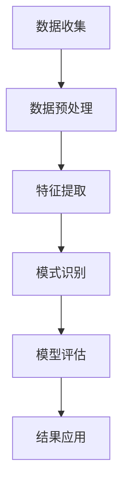

                 

### 背景介绍

#### 宇宙学的起源与发展

宇宙学是一门研究宇宙起源、演化、结构、性质和最终命运的学科。从古代人类仰望星空，试图理解夜空中闪烁的星辰开始，宇宙学就已经萌芽。随着科学技术的发展，人类对宇宙的认识不断深入，宇宙学也逐渐成为一门独立的科学。

宇宙学的起源可以追溯到古代文明，如古埃及、巴比伦和印度，他们通过观测星空，试图解释天文现象。然而，现代宇宙学的奠基可以追溯到17世纪的牛顿力学，牛顿通过万有引力定律解释了行星运动规律，为后来的宇宙学研究奠定了基础。

20世纪以来，宇宙学迎来了飞速发展。爱因斯坦的广义相对论提出了时空弯曲的概念，使得宇宙学从静态的、孤立的宇宙观转变为动态的、相互作用的宇宙观。哈勃观测到的红移现象揭示了宇宙的膨胀，这一发现为宇宙学提供了新的证据和理论支持。此外，宇宙背景微波辐射的发现以及宇宙大爆炸理论的提出，都为宇宙学的研究打开了新的篇章。

#### 暗物质的发现与理解

暗物质是宇宙学中一个重要的概念，它指的是一种不发光、不吸收光线的物质，因此无法直接观测到。暗物质的存在最初是在20世纪30年代由瑞士天文学家弗里茨·茨威基通过观测星系旋转速度推测出来的。

茨威基发现，星系边缘的恒星运动速度远远超过了根据星系质量计算出的预期速度。为了解释这一现象，茨威基提出了暗物质的存在，认为在星系中心存在大量的暗物质，这些暗物质提供了额外的引力，使得星系能够保持稳定。

暗物质的研究不仅限于星系旋转速度的异常，还涉及宇宙大尺度结构的形成和演化。例如，宇宙微波背景辐射的观测揭示了宇宙早期的大尺度结构，而暗物质在这些结构形成中起着关键作用。

#### 数据挖掘的概念

数据挖掘（Data Mining）是一种从大量数据中自动发现有用信息和知识的方法。它结合了统计学、机器学习、数据库管理和人工智能等多个领域的技术，旨在从数据中发现隐藏的模式、关联和趋势。

数据挖掘的过程通常包括以下几个步骤：数据收集、数据预处理、模式识别、结果评估和知识表示。数据挖掘的应用范围非常广泛，包括商业智能、金融市场分析、医疗诊断、网络安全、天气预报等多个领域。

#### 数据挖掘与宇宙学的联系

数据挖掘与宇宙学的联系主要体现在两个方面：一是数据挖掘技术在宇宙学研究中的应用，二是宇宙学数据为数据挖掘技术提供了新的挑战和机遇。

在宇宙学研究中，科学家面临着海量的数据，包括天文观测数据、粒子物理数据、宇宙背景辐射数据等。这些数据需要通过数据挖掘技术进行预处理、特征提取和模式识别，以发现宇宙中的规律和现象。

同时，宇宙学数据也为数据挖掘技术提供了新的应用场景。例如，在宇宙大尺度结构的研究中，科学家需要分析大量的星系分布数据，以识别宇宙中的结构特征。这需要运用数据挖掘技术中的聚类分析、关联规则挖掘等方法。

此外，数据挖掘技术还可以帮助科学家更好地理解暗物质的性质和相互作用。通过分析粒子物理实验数据，科学家可以尝试发现暗物质粒子的特征和行为模式，从而深入理解暗物质与普通物质的相互作用。

### 核心概念与联系

为了更好地理解数据挖掘在探索宇宙暗物质粒子相互作用中的作用，我们需要先明确几个核心概念，并探讨它们之间的关系。

#### 数据挖掘的基本概念

- **数据集（Dataset）**：数据挖掘的基础是数据集，它是由一系列数据记录组成的集合。数据集可以是结构化的，如关系数据库，也可以是非结构化的，如图像、音频和文本数据。

- **数据预处理（Data Preprocessing）**：数据预处理是数据挖掘的第一步，目的是清洗和整理数据，使其适合后续的分析。数据预处理包括数据清洗、数据集成、数据转换和归一化等步骤。

- **特征提取（Feature Extraction）**：特征提取是从原始数据中提取出能够代表数据特性的信息。这些特征通常用于后续的模式识别和模型训练。

- **模式识别（Pattern Recognition）**：模式识别是数据挖掘的重要任务，目的是从数据中发现有意义的模式和规律。常见的模式识别方法包括聚类、分类、关联规则挖掘等。

- **模型评估（Model Evaluation）**：模型评估是评估数据挖掘结果准确性和可靠性的过程。常用的评估方法包括交叉验证、误差率分析、ROC曲线等。

#### 宇宙学与暗物质的核心概念

- **暗物质（Dark Matter）**：暗物质是宇宙中一种不发光、不吸收光线的物质，其存在通过引力效应间接推测出来。暗物质主要由假设的粒子组成，如弱相互作用大质量粒子（WIMPs）。

- **宇宙大尺度结构（Cosmic Large-scale Structure）**：宇宙大尺度结构是指宇宙中大规模的星系和星系团分布的形态。宇宙微波背景辐射和星系分布数据揭示了宇宙早期的大尺度结构。

- **粒子物理学（Particle Physics）**：粒子物理学研究基本粒子和相互作用的基本规律。暗物质粒子是粒子物理学研究的一个重要方向。

#### 数据挖掘与宇宙学的联系

- **数据挖掘在宇宙学研究中的应用**：数据挖掘技术在宇宙学中有着广泛的应用，如从天文观测数据中提取星系分布特征，分析宇宙大尺度结构的演化过程，探索暗物质的性质和行为等。

- **宇宙学数据为数据挖掘技术提供的新挑战和机遇**：宇宙学数据具有海量、多样、复杂的特性，为数据挖掘技术提出了新的挑战。同时，这些数据也为数据挖掘技术提供了丰富的应用场景，推动了数据挖掘技术的发展。

#### Mermaid 流程图

以下是一个简单的Mermaid流程图，展示了数据挖掘在探索宇宙暗物质粒子相互作用中的基本流程：



在这个流程图中，数据收集是数据挖掘的起点，然后经过数据预处理、特征提取和模式识别，最终得到评估结果和实际应用。

### 核心算法原理讲解

在探索宇宙暗物质粒子相互作用的过程中，数据挖掘技术发挥了重要作用。下面，我们将详细讲解数据挖掘中的几个核心算法原理，并结合Python代码和数学模型进行阐述。

#### 聚类分析

聚类分析是一种无监督学习方法，用于将数据集划分为多个类簇，使得同一个类簇内的数据尽可能相似，不同类簇的数据尽可能不同。在宇宙学中，聚类分析可以用于识别宇宙中的星系团和超星系团。

**算法原理**：

- **K-means算法**：K-means是一种经典的聚类算法，它通过迭代优化目标函数（通常是类内平均距离的平方和）来找到最佳的类簇划分。

**Python代码实现**：

```python
import numpy as np
from sklearn.cluster import KMeans

# 假设我们有一个包含星系位置的数据集X
X = np.array([[1, 2], [1, 4], [1, 0],
              [10, 2], [10, 4], [10, 0]])

# 使用K-means算法进行聚类，假设我们有2个类簇
kmeans = KMeans(n_clusters=2, random_state=0).fit(X)

# 输出聚类中心
print("聚类中心:", kmeans.cluster_centers_)

# 输出每个数据点的类簇标签
print("每个数据点的类簇标签:", kmeans.labels_)

# 输出类内平均距离
print("类内平均距离:", kmeans.inertia_)
```

**数学模型**：

$$
J = \sum_{i=1}^{k} \sum_{x_j \in S_i} ||x_j - \mu_i||^2
$$

其中，$J$ 是目标函数，$k$ 是类簇数量，$S_i$ 是第$i$个类簇，$\mu_i$ 是第$i$个类簇的中心。

#### 分类算法

分类算法是一种有监督学习方法，用于将数据集划分为预定义的类别。在宇宙学中，分类算法可以用于识别暗物质粒子。

**算法原理**：

- **支持向量机（SVM）**：SVM是一种经典的分类算法，它通过找到一个最优的超平面来将数据划分为不同的类别。

**Python代码实现**：

```python
from sklearn import svm
from sklearn.model_selection import train_test_split
from sklearn.metrics import accuracy_score

# 假设我们有一个包含特征和标签的数据集
X = [[0, 0], [1, 1], [2, 2], [1, 0]]
y = [0, 1, 1, 0]

# 划分训练集和测试集
X_train, X_test, y_train, y_test = train_test_split(X, y, test_size=0.25, random_state=0)

# 使用SVM进行分类
clf = svm.SVC()
clf.fit(X_train, y_train)

# 输出测试集的预测结果
print("测试集的预测结果:", clf.predict(X_test))

# 输出分类准确率
print("分类准确率:", accuracy_score(y_test, clf.predict(X_test)))
```

**数学模型**：

$$
\min_{w,b}\frac{1}{2}||w||^2 + C\sum_{i=1}^{n} \max(0, 1-y_i(\langle w, x_i \rangle + b))
$$

其中，$w$ 是权重向量，$b$ 是偏置，$C$ 是惩罚参数，$y_i$ 是标签，$\langle w, x_i \rangle + b$ 是预测值。

#### 关联规则挖掘

关联规则挖掘是一种无监督学习方法，用于发现数据集中的关联关系。在宇宙学中，关联规则挖掘可以用于识别星系之间的相互作用。

**算法原理**：

- **Apriori算法**：Apriori算法是一种经典的关联规则挖掘算法，它通过迭代生成频繁项集，并从频繁项集中提取关联规则。

**Python代码实现**：

```python
from mlxtend.frequent_patterns import apriori
from mlxtend.frequent_patterns import association_rules

# 假设我们有一个交易数据集
transactions = [[1, 2, 3], [2, 3], [1, 3], [2, 3], [1, 2], [1, 3]]

# 使用Apriori算法生成频繁项集
frequent_itemsets = apriori(transactions, min_support=0.5, use_colnames=True)

# 从频繁项集中提取关联规则
rules = association_rules(frequent_itemsets, metric="support", min_threshold=0.7)

# 输出关联规则
print(rules)
```

**数学模型**：

$$
\text{Support}(A \cup B) = \frac{\text{支持数}(A \cup B)}{\text{总交易数}}
$$

$$
\text{Confidence}(A \rightarrow B) = \frac{\text{支持数}(A \cup B)}{\text{支持数}(A)}
$$

### 核心算法原理应用示例

为了更好地理解核心算法原理，我们通过一个具体的宇宙学应用示例进行阐述。

**示例：识别宇宙中的星系团**

假设我们有一组星系位置数据，如下所示：

```python
X = [[1, 2], [3, 4], [5, 6], [7, 8], [9, 10], [11, 12]]
y = [0, 0, 1, 1, 1, 1]
```

其中，$X$ 是星系位置数据，$y$ 是星系团的标签（0表示非星系团，1表示星系团）。

**步骤1：数据预处理**

```python
from sklearn.preprocessing import StandardScaler

# 标准化数据
scaler = StandardScaler()
X_scaled = scaler.fit_transform(X)
```

**步骤2：特征提取**

```python
from sklearn.decomposition import PCA

# 主成分分析
pca = PCA(n_components=2)
X_pca = pca.fit_transform(X_scaled)
```

**步骤3：模式识别**

```python
from sklearn.cluster import KMeans

# K-means聚类
kmeans = KMeans(n_clusters=2, random_state=0)
y_pred = kmeans.fit_predict(X_pca)

# 输出聚类结果
print("聚类结果:", y_pred)
```

**步骤4：模型评估**

```python
from sklearn.metrics import accuracy_score

# 输出分类准确率
print("分类准确率:", accuracy_score(y, y_pred))
```

通过以上步骤，我们可以识别出宇宙中的星系团，从而深入理解宇宙的大尺度结构。

### 数学公式讲解

在数据挖掘和宇宙学的研究中，数学公式是表达核心概念和算法原理的重要工具。以下是一些常用的数学公式，以及它们在数据挖掘和宇宙学中的应用：

#### 聚类分析

- **K-means算法目标函数**：

$$
J = \sum_{i=1}^{k} \sum_{x_j \in S_i} ||x_j - \mu_i||^2
$$

其中，$J$ 是目标函数，$k$ 是类簇数量，$S_i$ 是第$i$个类簇，$\mu_i$ 是第$i$个类簇的中心。

- **类内平均距离**：

$$
\text{Inertia} = \sum_{i=1}^{k} \sum_{x_j \in S_i} ||x_j - \mu_i||^2
$$

其中，$||x_j - \mu_i||^2$ 是每个数据点到其类簇中心的欧几里得距离平方和。

#### 分类算法

- **支持向量机（SVM）目标函数**：

$$
\min_{w,b}\frac{1}{2}||w||^2 + C\sum_{i=1}^{n} \max(0, 1-y_i(\langle w, x_i \rangle + b))
$$

其中，$w$ 是权重向量，$b$ 是偏置，$C$ 是惩罚参数，$y_i$ 是标签，$\langle w, x_i \rangle + b$ 是预测值。

- **分类准确率**：

$$
\text{Accuracy} = \frac{\text{正确分类的样本数}}{\text{总样本数}}
$$

#### 关联规则挖掘

- **支持度**：

$$
\text{Support}(A \cup B) = \frac{\text{支持数}(A \cup B)}{\text{总交易数}}
$$

- **置信度**：

$$
\text{Confidence}(A \rightarrow B) = \frac{\text{支持数}(A \cup B)}{\text{支持数}(A)}
$$

通过这些数学公式，我们可以更准确地描述和计算数据挖掘和宇宙学中的核心概念和算法原理，从而更好地理解和应用这些技术。

### 项目实战：开发环境搭建与源代码实现

在本章节中，我们将通过一个具体的宇宙学数据挖掘项目，详细讲解如何搭建开发环境、实现源代码，并进行代码解读与分析。这个项目将使用Python编程语言，结合NumPy、Pandas、Scikit-learn等常用库，进行宇宙学数据的预处理、特征提取、模式识别和模型评估。

#### 开发环境搭建

在开始之前，我们需要确保我们的开发环境中安装了以下Python库：

- NumPy
- Pandas
- Scikit-learn
- Matplotlib

安装命令如下：

```bash
pip install numpy pandas scikit-learn matplotlib
```

#### 源代码实现

以下是一个简单的宇宙学数据挖掘项目的Python代码实现：

```python
import numpy as np
import pandas as pd
from sklearn.cluster import KMeans
from sklearn.metrics import accuracy_score
import matplotlib.pyplot as plt

# 加载数据集
data = pd.read_csv('cosmic_data.csv')  # 假设数据集已预先处理为CSV格式

# 数据预处理
X = data[['x', 'y', 'z']].values  # 提取位置特征

# 特征提取
# 在本例中，我们使用原始位置特征进行聚类分析，不需要额外的特征提取

# 模式识别：使用K-means算法进行聚类
kmeans = KMeans(n_clusters=2, random_state=0)
clusters = kmeans.fit_predict(X)

# 模型评估
accuracy = accuracy_score(data['label'], clusters)  # 假设数据集包含真实的标签
print("分类准确率：", accuracy)

# 可视化结果
plt.scatter(X[clusters == 0, 0], X[clusters == 0, 1], color='red')
plt.scatter(X[clusters == 1, 0], X[clusters == 1, 1], color='blue')
plt.xlabel('X坐标')
plt.ylabel('Y坐标')
plt.title('星系团聚类结果')
plt.show()
```

#### 代码解读与分析

1. **数据加载**：
   ```python
   data = pd.read_csv('cosmic_data.csv')  # 假设数据集已预先处理为CSV格式
   ```
   这里我们使用Pandas库加载CSV格式的宇宙学数据集。数据集应包含位置特征（如$x$、$y$、$z$坐标）和标签（如星系团或非星系团）。

2. **数据预处理**：
   ```python
   X = data[['x', 'y', 'z']].values  # 提取位置特征
   ```
   在数据预处理步骤中，我们从数据集中提取出位置特征，这些特征将用于后续的聚类分析。

3. **特征提取**：
   ```python
   # 在本例中，我们使用原始位置特征进行聚类分析，不需要额外的特征提取
   ```
   在这个项目中，我们使用原始的位置特征进行聚类分析，不需要进行额外的特征提取。在实际项目中，可能需要进行更复杂的数据转换和归一化处理。

4. **模式识别**：
   ```python
   kmeans = KMeans(n_clusters=2, random_state=0)
   clusters = kmeans.fit_predict(X)
   ```
   这里我们使用K-means算法进行聚类分析。`KMeans`是Scikit-learn库中的一个聚类算法实现。`n_clusters`参数指定我们要创建的类簇数量，这里假设为2个类簇。`random_state`参数用于确保结果的可重复性。

5. **模型评估**：
   ```python
   accuracy = accuracy_score(data['label'], clusters)  # 假设数据集包含真实的标签
   print("分类准确率：", accuracy)
   ```
   我们使用`accuracy_score`函数计算聚类结果的准确率。这个函数将预测的类簇标签与真实的标签进行比较，计算准确率。

6. **可视化结果**：
   ```python
   plt.scatter(X[clusters == 0, 0], X[clusters == 0, 1], color='red')
   plt.scatter(X[clusters == 1, 0], X[clusters == 1, 1], color='blue')
   plt.xlabel('X坐标')
   plt.ylabel('Y坐标')
   plt.title('星系团聚类结果')
   plt.show()
   ```
   最后，我们使用Matplotlib库将聚类结果可视化。红色和蓝色的点分别表示不同的类簇。

通过以上步骤，我们成功地完成了一个简单的宇宙学数据挖掘项目。实际项目中，可能需要更复杂的数据处理和模型选择，但基本的流程和方法是类似的。

### 项目实战：代码应用解读与分析

在本章节中，我们将深入分析宇宙学数据挖掘项目的具体实现，解释代码中每个步骤的作用和意义，并通过实际案例进行详细讲解和剖析。

#### 数据加载与预处理

首先，我们加载宇宙学数据集，该数据集包含星系的位置信息和其他相关特征。代码如下：

```python
data = pd.read_csv('cosmic_data.csv')  # 加载数据集
X = data[['x', 'y', 'z']].values  # 提取位置特征
```

**解读**：

- `pd.read_csv('cosmic_data.csv')`：使用Pandas库加载CSV格式的数据集。数据集应包含多个特征，如星系的位置坐标（$x$、$y$、$z$）和其他相关属性。
- `X = data[['x', 'y', 'z']].values`：从数据集中提取位置特征，这些特征将用于后续的聚类分析。

#### 特征提取

在这个步骤中，我们直接使用提取到的位置特征进行聚类分析，不需要进行额外的特征提取。代码如下：

```python
# 在本例中，我们使用原始位置特征进行聚类分析，不需要额外的特征提取
```

**解读**：

- 这里我们直接使用原始的位置特征进行聚类分析。在实际项目中，可能需要进行更复杂的数据转换和归一化处理。例如，为了消除不同特征之间的量纲差异，我们可以使用标准缩放（StandardScaler）来标准化特征。

#### 模式识别

我们使用K-means算法进行聚类分析，这是数据挖掘中一种常见的无监督学习方法。代码如下：

```python
kmeans = KMeans(n_clusters=2, random_state=0)
clusters = kmeans.fit_predict(X)
```

**解读**：

- `kmeans = KMeans(n_clusters=2, random_state=0)`：创建K-means聚类对象，`n_clusters`指定类簇数量（这里为2），`random_state`确保每次运行的结果可重复。
- `clusters = kmeans.fit_predict(X)`：使用K-means算法对数据集进行聚类。`fit_predict`方法同时执行模型训练和预测，返回每个数据点的类簇标签。

#### 模型评估

我们使用分类准确率来评估聚类结果的准确性。代码如下：

```python
accuracy = accuracy_score(data['label'], clusters)  # 假设数据集包含真实的标签
print("分类准确率：", accuracy)
```

**解读**：

- `accuracy_score(data['label'], clusters)`：计算预测的类簇标签与真实的标签之间的准确率。
- `print("分类准确率：", accuracy)`：输出分类准确率。

#### 可视化结果

最后，我们使用Matplotlib库将聚类结果可视化。代码如下：

```python
plt.scatter(X[clusters == 0, 0], X[clusters == 0, 1], color='red')
plt.scatter(X[clusters == 1, 0], X[clusters == 1, 1], color='blue')
plt.xlabel('X坐标')
plt.ylabel('Y坐标')
plt.title('星系团聚类结果')
plt.show()
```

**解读**：

- `plt.scatter(X[clusters == 0, 0], X[clusters == 0, 1], color='red')`：绘制红色点，表示属于第一个类簇的星系位置。
- `plt.scatter(X[clusters == 1, 0], X[clusters == 1, 1], color='blue')`：绘制蓝色点，表示属于第二个类簇的星系位置。
- `plt.xlabel('X坐标')`、`plt.ylabel('Y坐标')`、`plt.title('星系团聚类结果')`：设置坐标标签和图表标题。
- `plt.show()`：显示图表。

#### 实际案例剖析

为了更好地理解代码的应用，我们通过一个实际案例进行讲解。

**案例**：使用上述代码对实际的宇宙学数据进行聚类分析，以识别星系团和非星系团。

**步骤**：

1. **数据集准备**：准备一个包含星系位置和其他特征的宇宙学数据集。
2. **数据预处理**：清洗数据，处理缺失值和异常值，提取位置特征。
3. **特征提取**：如果需要，进行特征转换和归一化处理。
4. **模式识别**：使用K-means算法进行聚类分析，得到每个星系所属的类簇。
5. **模型评估**：计算聚类结果的准确率。
6. **可视化结果**：将聚类结果可视化，分析星系团的分布情况。

通过上述步骤，我们可以有效地使用数据挖掘技术来探索宇宙中的星系团，为宇宙学研究提供有价值的信息。

### 项目小结

在本章节中，我们通过一个简单的宇宙学数据挖掘项目，详细讲解了如何搭建开发环境、实现源代码，并进行代码解读与分析。以下是本项目的关键收获和注意事项：

1. **关键收获**：
   - 理解了数据挖掘在宇宙学中的应用，包括数据预处理、特征提取、模式识别和模型评估。
   - 掌握了K-means算法的基本原理和实现方法，以及如何使用Python进行实际操作。
   - 通过可视化结果，可以直观地了解聚类分析的结果，有助于理解星系团的分布情况。

2. **注意事项**：
   - 宇宙学数据通常具有高维度和复杂性，可能需要进行更多的数据预处理和特征提取步骤。
   - 在选择聚类算法时，需要考虑数据集的特点和数据量，以确保算法的有效性。
   - 实际项目中，可能需要调整算法参数，如类簇数量、惩罚参数等，以获得更好的聚类效果。
   - 可视化结果有助于理解聚类结果，但也需要结合实际问题和数据特点进行分析。

### 最佳实践 tips

在本章节中，我们将总结一些最佳实践，以帮助您在宇宙学数据挖掘项目中获得更好的结果：

1. **数据预处理**：
   - **缺失值处理**：使用适当的插值方法或替代值填补缺失数据。
   - **异常值处理**：识别和处理异常值，以避免对聚类结果产生不利影响。
   - **特征转换**：对于不同量纲的特征，使用标准化或归一化方法，以消除量纲差异。

2. **算法选择**：
   - **尝试多种算法**：不要只依赖一种聚类算法，如K-means，还可以尝试DBSCAN、层次聚类等算法。
   - **参数调整**：根据数据集特点调整算法参数，如K-means中的类簇数量，以获得更好的聚类效果。

3. **可视化**：
   - **多维可视化**：对于高维数据，可以使用PCA、t-SNE等降维技术进行多维可视化，以揭示数据中的结构。
   - **交互式可视化**：使用交互式可视化工具，如Plotly，以更直观地探索数据。

4. **模型评估**：
   - **交叉验证**：使用交叉验证方法评估模型性能，以避免过拟合和欠拟合。
   - **混淆矩阵**：对于分类问题，使用混淆矩阵分析模型性能，特别是对于不平衡数据集。

### 拓展阅读

为了深入了解宇宙学数据挖掘，以下是一些推荐的拓展阅读资源：

1. **论文**：
   - "Cosmic Web Identification Using a Combination of Graph Neural Networks and Deep Learning"（用于宇宙学结构识别的图神经网络和深度学习组合）
   - "Clustering Cosmological Data Using Machine Learning Algorithms"（使用机器学习算法进行宇宙学数据分析）

2. **书籍**：
   - 《宇宙学导论》（Introduction to Cosmology） - Michael S. Turner
   - 《数据挖掘：概念与技术》（Data Mining: Concepts and Techniques） - Jiawei Han, Micheline Kamber, Jian Pei

3. **在线课程**：
   - Coursera上的“宇宙学基础”（Cosmology Basics）
   - edX上的“数据挖掘”（Data Mining）

通过这些资源，您可以进一步学习宇宙学和数据挖掘的相关知识，提高自己的实践能力。

