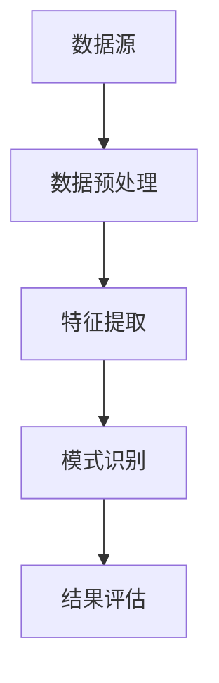
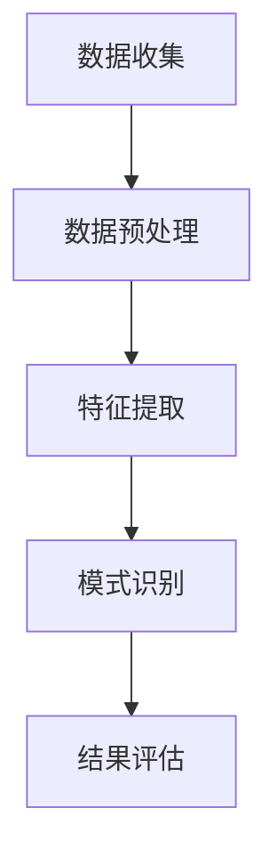
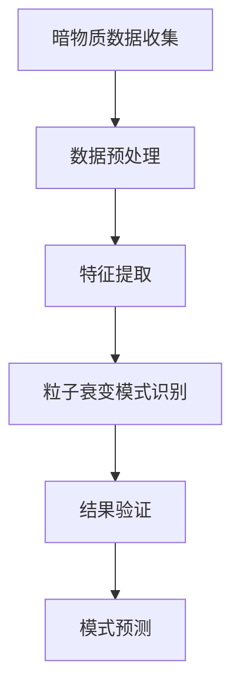

                 

----------------------------------------------------------------

### 文章标题
#### 数据挖掘在探索宇宙暗物质粒子衰变模式中的作用

### 关键词
- 数据挖掘
- 暗物质
- 粒子衰变
- 机器学习
- 人工智能

### 摘要
本文深入探讨了数据挖掘在探索宇宙暗物质粒子衰变模式中的应用。首先，我们介绍了暗物质的基本概念和重要性，然后阐述了数据挖掘的核心概念和技术，包括数据预处理、特征提取和模式识别。接下来，我们详细讲解了数据挖掘在暗物质粒子衰变模式研究中的应用，包括粒子探测数据的预处理、特征提取和衰变模式识别。此外，我们还介绍了几种关键算法，如聚类分析、神经网络和深度学习，以及它们在暗物质研究中的实际应用。最后，通过一个实际案例展示了数据挖掘在探索宇宙暗物质粒子衰变模式中的具体应用，并对未来的发展方向进行了展望。

---

# 第1章 引言

## 1.1 暗物质与宇宙探索

暗物质是宇宙中一种无法直接观测到的物质，但它对宇宙的结构和演化起着关键作用。尽管我们无法直接看到暗物质，但它的存在可以通过其对宇宙中其他物质的影响来推断。暗物质粒子可能是一种尚未发现的粒子，它们的质量足够大，可以影响星系的形成和演化，但又不与普通物质发生相互作用。这种独特的性质使得暗物质的研究成为现代物理学和宇宙学的重要课题。

### 1.1.1 暗物质的基本特性

暗物质具有以下几个基本特性：

1. **不发光**：暗物质不会发出任何形式的电磁辐射，因此无法通过光学、红外或射电波观测到。
2. **不吸收光**：暗物质不会吸收光线，因此无法通过吸收特定波长的光线来识别。
3. **不与普通物质相互作用**：暗物质不参与电磁相互作用、弱相互作用和强相互作用，这使得它们难以被探测到。
4. **具有质量**：暗物质的质量足以影响宇宙的结构和演化，但其具体的性质和组成仍是一个未解之谜。

### 1.1.2 暗物质的重要性

暗物质在宇宙中扮演着至关重要的角色，主要表现在以下几个方面：

1. **星系的形成与演化**：暗物质的引力作用是星系形成和演化的关键因素。通过模拟宇宙中的暗物质分布，科学家们能够更好地理解星系的形成过程。
2. **宇宙的大尺度结构**：暗物质是宇宙大尺度结构的主要组成部分，对宇宙的大尺度结构形成和演化有重要影响。
3. **宇宙背景辐射**：宇宙背景辐射的波动与暗物质的分布密切相关，通过研究宇宙背景辐射可以更好地了解暗物质的性质。
4. **暗物质探测**：暗物质的探测是现代物理学和宇宙学的前沿课题，对科学技术的进步有着重要推动作用。

### 1.1.3 暗物质的研究方法

目前，暗物质的研究主要依赖于以下几个方面：

1. **粒子探测**：通过探测暗物质粒子与普通物质相互作用产生的信号，可以间接识别暗物质的存在。例如，地下实验室中的暗物质探测器通过探测弱相互作用信号来寻找暗物质。
2. **宇宙射电波观测**：通过观测宇宙射电波中的异常信号，可以寻找与暗物质相关的现象。
3. **宇宙学观测**：通过观测宇宙的大尺度结构、宇宙背景辐射等，可以间接研究暗物质的性质和分布。
4. **计算机模拟**：通过数值模拟，科学家们可以模拟宇宙中的暗物质分布和演化过程，从而更好地理解暗物质的作用。

## 1.2 数据挖掘的基本概念

数据挖掘是一种从大量数据中提取有价值信息的方法。它涉及到统计学、机器学习、数据库和信息检索等多个领域。数据挖掘的目标是从大量的、不完全的、有噪声的、模糊的、随机的数据中，提取出隐含在其中的、事先未知的并有潜在价值的信息。

### 1.2.1 数据挖掘的分类

根据应用领域的不同，数据挖掘可以分为以下几类：

1. **商业智能**：通过分析商业数据，帮助企业制定战略决策。
2. **金融风险控制**：通过对金融数据进行分析，识别潜在风险和欺诈行为。
3. **医疗健康**：通过对医疗数据进行分析，辅助医生进行疾病诊断和治疗。
4. **社交媒体分析**：通过对社交媒体数据进行分析，了解用户行为和趋势。
5. **天文和地球科学**：通过对天文和地球科学数据进行分析，探索宇宙和地球的奥秘。

### 1.2.2 数据挖掘的主要步骤

数据挖掘通常包括以下主要步骤：

1. **数据预处理**：对原始数据进行清洗、集成和转换，使其适合进行分析。
2. **特征提取**：从原始数据中提取出对分析任务有重要影响的特征。
3. **模式识别**：使用机器学习算法识别数据中的模式，如分类、聚类和关联规则。
4. **结果评估**：对挖掘出的模式进行评估，判断其是否具有实际意义。

## 1.3 数据挖掘在暗物质研究中的应用

数据挖掘在暗物质研究中具有重要的应用价值。通过数据挖掘，科学家们可以从大量的观测数据中提取出有价值的信息，从而更好地理解暗物质的性质和特性。

### 1.3.1 数据挖掘在暗物质探测数据预处理中的应用

暗物质探测数据通常包含大量的噪声和缺失值，需要进行预处理。数据挖掘中的数据预处理技术，如数据清洗、缺失值填补和数据转换等，可以帮助科学家们处理这些数据，提高数据分析的准确性。

### 1.3.2 数据挖掘在暗物质粒子衰变模式识别中的应用

暗物质粒子衰变模式识别是暗物质研究中的一个重要问题。通过数据挖掘中的模式识别技术，如聚类分析、分类和关联规则挖掘等，科学家们可以从大量的观测数据中识别出暗物质粒子的衰变模式。

### 1.3.3 数据挖掘在暗物质粒子衰变模式预测中的应用

数据挖掘还可以用于预测暗物质粒子的衰变模式。通过机器学习算法，如神经网络和深度学习，科学家们可以建立预测模型，对未来的衰变模式进行预测。

## 1.4 本书内容与结构

本书将分为以下几个部分：

1. **第1章 引言**：介绍暗物质和宇宙探索的基本概念，以及数据挖掘的基本概念和应用。
2. **第2章 数据挖掘基础**：介绍数据挖掘的主要步骤和技术，包括数据预处理、特征提取和模式识别。
3. **第3章 暗物质粒子衰变模式概述**：介绍暗物质粒子衰变模式的基本概念和研究方法。
4. **第4章 数据挖掘在暗物质研究中的应用**：详细探讨数据挖掘在暗物质探测数据预处理、暗物质粒子衰变模式识别和预测中的应用。
5. **第5章 数据挖掘算法在暗物质研究中的应用**：介绍数据挖掘算法在暗物质研究中的实际应用，包括聚类分析、分类和关联规则挖掘等。
6. **第6章 暗物质粒子衰变模式案例研究**：通过实际案例展示数据挖掘在暗物质粒子衰变模式研究中的应用。
7. **第7章 总结与展望**：总结本书的主要内容，并对未来的发展方向进行展望。

通过本书的阅读，读者将深入了解数据挖掘在探索宇宙暗物质粒子衰变模式中的作用，掌握相关技术和方法，为未来的科学研究提供有力支持。

---

## 第2章 数据挖掘基础

### 2.1 数据挖掘的定义与分类

**核心概念与联系**：数据挖掘（Data Mining）是从大量数据中提取有价值信息的方法，涉及到统计学、机器学习、数据库和信息检索等多个领域。数据挖掘的核心目标是从大量数据中发现隐藏的模式、关联和趋势，从而帮助决策者做出更明智的决策。

**Mermaid 流程图**：


**分类**：数据挖掘可以分为以下几类：

1. **分类（Classification）**：根据已知数据，将新的数据分类到某个类别中。
2. **聚类（Clustering）**：将数据分组，使得同一组内的数据尽可能相似，不同组的数据尽可能不同。
3. **关联规则挖掘（Association Rule Learning）**：发现数据之间的关联性，如哪些物品经常一起购买。
4. **异常检测（Anomaly Detection）**：识别出数据中的异常值或异常模式。
5. **预测建模（Predictive Modeling）**：建立模型来预测未来可能发生的事件。

### 2.2 数据挖掘的主要步骤

数据挖掘通常包括以下主要步骤：

1. **数据预处理（Data Preprocessing）**：
   - **数据清洗**：处理缺失值、异常值和噪声数据，提高数据质量。
   - **数据集成**：将来自不同源的数据合并成统一的格式。
   - **数据转换**：将数据转换为适合分析的形式，如数值化、归一化等。

2. **特征提取（Feature Extraction）**：
   - **特征选择**：选择对分析任务最有影响力的特征。
   - **特征转换**：将原始特征转换为新的特征，如特征提取、特征降维等。

3. **模式识别（Pattern Recognition）**：
   - **分类**：根据特征数据将数据分类到不同的类别。
   - **聚类**：将数据分组，使得同一组内的数据尽可能相似。
   - **关联规则挖掘**：发现数据之间的关联性。

4. **结果评估（Result Evaluation）**：
   - **模型评估**：评估模型的准确性、效率和稳定性。
   - **模型优化**：根据评估结果对模型进行调整，提高模型性能。

### 2.3 数据挖掘的技术和方法

**技术**：

1. **统计学方法**：如回归分析、主成分分析等。
2. **机器学习方法**：如决策树、支持向量机、神经网络等。
3. **深度学习方法**：如卷积神经网络、循环神经网络、生成对抗网络等。

**方法**：

1. **基于实例的方法**：直接使用过去的实例来解决问题。
2. **基于模型的方

## 第3章 暗物质粒子衰变模式概述

### 3.1 暗物质的基本概念

暗物质（Dark Matter）是一种在宇宙中广泛存在的物质，但它不发光、不吸收光，也不与普通物质发生电磁相互作用。尽管我们无法直接观测到暗物质，但它的存在对宇宙的结构和演化起着关键作用。暗物质可能由一种或多种未发现的粒子组成，这些粒子的特性决定了暗物质的行为。

### 3.2 暗物质粒子的特性

暗物质粒子的特性主要包括以下几点：

1. **质量大**：暗物质的质量足以影响宇宙中的大尺度结构，如星系的形成和演化。
2. **不发光**：暗物质不会发出任何形式的电磁辐射，因此无法通过光学、红外或射电波观测到。
3. **不吸收光**：暗物质不会吸收光线，因此无法通过吸收特定波长的光线来识别。
4. **不与普通物质相互作用**：暗物质不参与电磁相互作用、弱相互作用和强相互作用，这使得它们难以被探测到。
5. **广泛存在**：暗物质在宇宙中广泛存在，是宇宙中主要物质形式的组成部分。

### 3.3 暗物质粒子衰变模式的探索方法

暗物质粒子衰变模式的探索是当前物理学和宇宙学的前沿课题。目前，科学家们主要采用以下几种方法来探索暗物质粒子的衰变模式：

1. **粒子探测实验**：地下实验室中的暗物质探测器通过探测暗物质粒子与普通物质相互作用产生的信号，间接识别暗物质的存在。这些探测器通常使用核探测器、超导量子干涉仪（SQUID）和液氦探测器等。
2. **宇宙射电波观测**：通过观测宇宙射电波中的异常信号，可以寻找与暗物质相关的现象。宇宙射电波观测可以提供关于暗物质分布和运动的信息。
3. **宇宙学观测**：通过观测宇宙的大尺度结构、宇宙背景辐射等，可以间接研究暗物质的性质和分布。宇宙学观测包括对星系团、星系和恒星的运动测量，以及宇宙背景辐射的测量。
4. **计算机模拟**：通过数值模拟，科学家们可以模拟宇宙中的暗物质分布和演化过程，从而更好地理解暗物质的作用。

### 3.4 暗物质粒子衰变模式的研究意义

暗物质粒子衰变模式的研究具有重要的科学意义，主要体现在以下几个方面：

1. **检验粒子物理理论**：暗物质粒子衰变模式的研究有助于检验现有的粒子物理理论，如标准模型和量子场论。
2. **探索宇宙演化**：暗物质粒子的衰变模式可以提供关于宇宙早期演化的信息，有助于我们理解宇宙的结构和演化过程。
3. **寻找新物理现象**：暗物质粒子衰变模式的研究可能会发现新的物理现象，如暗物质粒子之间的相互作用或暗物质粒子的自相互作用。
4. **推动探测器技术发展**：暗物质粒子衰变模式的研究推动了暗物质探测技术的发展，促进了探测器技术和数据分析技术的进步。

### 3.5 暗物质粒子衰变模式的未来研究方向

未来的暗物质粒子衰变模式研究可能会朝着以下几个方向发展：

1. **提高探测灵敏度**：随着探测器技术的进步，科学家们将不断提高探测器的灵敏度，以期更准确地探测到暗物质粒子的衰变信号。
2. **探索更多粒子模型**：除了现有的暗物质模型外，科学家们将继续探索其他可能的暗物质粒子模型，以寻找更符合观测数据的暗物质候选粒子。
3. **结合多学科研究**：将粒子物理、宇宙学和天体物理学等多个学科的研究结合起来，从不同角度探索暗物质粒子衰变模式。
4. **开展国际合作**：暗物质粒子衰变模式的研究需要全球范围内的合作，科学家们将加强国际合作，共同推动这一领域的发展。

通过上述内容，我们可以看到，暗物质粒子衰变模式的研究是一个充满挑战和机遇的领域。随着科学技术的发展，我们有理由相信，未来将会有更多关于暗物质粒子的奥秘被揭示。

---

## 第4章 数据挖掘在暗物质研究中的应用

### 4.1 数据挖掘在暗物质探测数据预处理中的应用

在暗物质研究中，数据预处理是至关重要的一步。暗物质探测数据通常包含大量的噪声、缺失值和异常值，这会对后续的数据分析产生不利影响。因此，数据预处理的目标是清洗数据、填补缺失值、去除异常值，并将数据转换成适合分析的形式。

**数据清洗**：数据清洗是指处理数据中的噪声、缺失值和异常值的过程。在暗物质探测数据中，噪声可能来源于探测器本身的误差、环境干扰等因素。缺失值可能是因为探测器故障或数据传输过程中的问题。异常值可能是由硬件故障或数据传输错误引起的。

**数据转换**：数据转换是将原始数据转换成适合数据分析的形式的过程。这通常包括数值化、归一化和特征提取等步骤。数值化是将非数值数据转换为数值形式，归一化是将不同特征的范围统一，特征提取是从原始数据中提取对分析任务有重要影响的特征。

**Python代码示例**：
```python
import pandas as pd
import numpy as np

# 加载数据
data = pd.read_csv('dark_matter_data.csv')

# 填补缺失值
data.fillna(method='ffill', inplace=True)

# 删除异常值
Q1 = data.quantile(0.25)
Q3 = data.quantile(0.75)
IQR = Q3 - Q1
data = data[~((data < (Q1 - 1.5 * IQR)) | (data > (Q3 + 1.5 * IQR))).any(axis=1)]

# 数据转换
data['normalized_feature1'] = (data['feature1'] - data['feature1'].mean()) / data['feature1'].std()
data['normalized_feature2'] = (data['feature2'] - data['feature2'].mean()) / data['feature2'].std()
```

### 4.2 数据挖掘在暗物质粒子衰变模式识别中的应用

暗物质粒子衰变模式的识别是暗物质研究中的一个重要问题。通过数据挖掘技术，可以从大量的探测数据中识别出暗物质粒子的衰变模式。

**聚类分析**：聚类分析是一种无监督学习方法，它将数据划分为若干个类别，使得同一类别内的数据尽可能相似，不同类别内的数据尽可能不同。在暗物质粒子衰变模式识别中，聚类分析可以用于识别不同类型的衰变模式。

**Python代码示例**：
```python
from sklearn.cluster import KMeans
import matplotlib.pyplot as plt

# 分割特征
X = data[['feature1', 'feature2']]

# 使用K均值聚类
kmeans = KMeans(n_clusters=3, random_state=0).fit(X)

# 绘制聚类结果
plt.scatter(X['feature1'], X['feature2'], c=kmeans.labels_)
plt.show()
```

**分类算法**：分类算法是一种有监督学习方法，它根据已知的标签数据，将新的数据分类到不同的类别中。在暗物质粒子衰变模式识别中，分类算法可以用于识别特定的衰变模式。

**Python代码示例**：
```python
from sklearn.model_selection import train_test_split
from sklearn.ensemble import RandomForestClassifier

# 分割数据集
X_train, X_test, y_train, y_test = train_test_split(X, y, test_size=0.3, random_state=0)

# 训练分类器
classifier = RandomForestClassifier(n_estimators=100, random_state=0)
classifier.fit(X_train, y_train)

# 测试分类器
accuracy = classifier.score(X_test, y_test)
print(f"Accuracy: {accuracy}")
```

### 4.3 数据挖掘在暗物质粒子衰变模式预测中的应用

通过数据挖掘技术，可以建立预测模型，对未来的暗物质粒子衰变模式进行预测。预测模型可以根据历史数据和已知的规律，对未来可能发生的衰变模式进行预测。

**时间序列分析**：时间序列分析是一种用于预测时间序列数据的方法。在暗物质粒子衰变模式预测中，时间序列分析可以用于预测未来的衰变模式。

**Python代码示例**：
```python
from sklearn.model_selection import train_test_split
from sklearn.ensemble import RandomForestRegressor

# 分割数据集
X_train, X_test, y_train, y_test = train_test_split(X, y, test_size=0.3, random_state=0)

# 训练回归器
regressor = RandomForestRegressor(n_estimators=100, random_state=0)
regressor.fit(X_train, y_train)

# 测试回归器
predictions = regressor.predict(X_test)
print(f"MAE: {mean_absolute_error(y_test, predictions)}")
```

通过以上内容，我们可以看到，数据挖掘在暗物质研究中的应用非常广泛，从数据预处理到模式识别，再到衰变模式预测，数据挖掘技术为科学家们提供了强大的工具。随着数据挖掘技术的不断发展，我们有理由相信，未来将会有更多关于暗物质的奥秘被揭示。

---

## 第5章 数据挖掘算法在暗物质研究中的应用

### 5.1 K-均值聚类算法在暗物质研究中的应用

K-均值聚类算法是一种无监督学习算法，它通过将数据点分配到K个聚类中心来对数据进行分类。在暗物质研究中，K-均值聚类算法可以用于识别不同类型的暗物质粒子衰变模式。

**核心算法原理讲解**：

1. **初始化**：随机选择K个聚类中心。
2. **分配**：将每个数据点分配到最近的聚类中心。
3. **更新**：重新计算每个聚类中心的均值。
4. **迭代**：重复步骤2和步骤3，直到聚类中心不再发生显著变化。

**Python代码示例**：
```python
from sklearn.cluster import KMeans
import matplotlib.pyplot as plt

# 初始化K均值聚类器
kmeans = KMeans(n_clusters=3, random_state=0)

# 训练模型
kmeans.fit(X)

# 分配聚类标签
labels = kmeans.predict(X)

# 绘制聚类结果
plt.scatter(X[:, 0], X[:, 1], c=labels, cmap='viridis')
plt.show()
```

**数学模型与公式**：

聚类中心的更新公式如下：
$$
\text{centroid}_i = \frac{1}{N_i} \sum_{x_j \in S_i} x_j
$$
其中，$centroid_i$表示第i个聚类中心，$N_i$表示属于第i个聚类的数据点数量，$x_j$表示第j个数据点。

**举例说明**：

假设有3个聚类中心$(\mu_1, \mu_2, \mu_3)$和数据点集$S$。首先随机初始化聚类中心。然后，计算每个数据点到聚类中心的距离，并将数据点分配到最近的聚类中心。接着，重新计算每个聚类中心的均值。通过迭代，最终收敛到一个稳定的聚类结果。

### 5.2 决策树算法在暗物质研究中的应用

决策树算法是一种有监督学习算法，它通过构建一个树形模型来对数据进行分类或回归。在暗物质研究中，决策树算法可以用于预测暗物质粒子的衰变模式。

**核心算法原理讲解**：

1. **选择特征**：选择具有最大信息增益的特征作为划分标准。
2. **划分数据**：根据选择的特征将数据集划分为子集。
3. **递归构建**：对每个子集重复上述步骤，直到满足停止条件。

**Python代码示例**：
```python
from sklearn.tree import DecisionTreeClassifier
import matplotlib.pyplot as plt

# 初始化决策树分类器
clf = DecisionTreeClassifier(random_state=0)

# 训练模型
clf.fit(X_train, y_train)

# 绘制决策树
from sklearn.tree import plot_tree
plt.figure(figsize=(12, 8))
plot_tree(clf, filled=True)
plt.show()
```

**数学模型与公式**：

信息增益（Information Gain）的计算公式如下：
$$
\text{IG}(A, B) = \sum_{i} p(i) \cdot \text{H}(B|A_i)
$$
其中，$A$表示特征集合，$B$表示目标变量，$i$表示第i个特征，$p(i)$表示特征i的概率，$\text{H}(B|A_i)$表示条件熵。

**举例说明**：

假设有特征集合$A = \{A_1, A_2\}$和目标变量$B$。首先计算每个特征的信息增益，选择具有最大信息增益的特征作为划分标准。然后，根据选择的特征将数据集划分为子集。通过递归构建决策树，最终得到一个决策树模型。

### 5.3 支持向量机算法在暗物质研究中的应用

支持向量机（SVM）算法是一种有监督学习算法，它通过找到一个最佳的超平面来对数据进行分类。在暗物质研究中，SVM算法可以用于分类暗物质粒子的衰变模式。

**核心算法原理讲解**：

1. **选择核函数**：核函数将低维数据映射到高维空间，使得原本线性不可分的数据在高维空间中变得线性可分。
2. **寻找最优超平面**：通过求解二次规划问题，找到最佳的超平面。
3. **分类决策**：对新的数据进行分类，将其映射到高维空间，然后判断其所属类别。

**Python代码示例**：
```python
from sklearn.svm import SVC
import matplotlib.pyplot as plt

# 初始化支持向量机分类器
clf = SVC(kernel='linear')

# 训练模型
clf.fit(X_train, y_train)

# 绘制分类边界
x_plot = np.linspace(X_train[:, 0].min(), X_train[:, 0].max(), 100)
y_plot = np.linspace(X_train[:, 1].min(), X_train[:, 1].max(), 100)
x_plot, y_plot = np.meshgrid(x_plot, y_plot)
Z = clf.predict(np.c_[x_plot.ravel(), y_plot.ravel()])
Z = Z.reshape(x_plot.shape)

plt.contourf(x_plot, y_plot, Z, cmap=plt.cm.coolwarm)
plt.scatter(X_train[:, 0], X_train[:, 1], c=y_train, cmap=plt.cm.coolwarm)
plt.show()
```

**数学模型与公式**：

支持向量机的目标是最小化以下二次规划问题：
$$
\begin{aligned}
\min_{w, b} & \frac{1}{2} ||w||^2 \\
\text{subject to} & y_i (w \cdot x_i + b) \geq 1
\end{aligned}
$$
其中，$w$表示权重向量，$b$表示偏置，$x_i$表示数据点，$y_i$表示标签。

**举例说明**：

假设有一个数据集，其中每个数据点都是二维的。首先选择一个适当的核函数，如线性核函数。然后，通过求解二次规划问题找到最佳的超平面。最后，对新的数据进行分类，将其映射到高维空间，并判断其所属类别。

通过以上内容，我们可以看到，K-均值聚类算法、决策树算法和支持向量机算法在暗物质研究中具有广泛的应用。这些算法不仅能够有效地分类和识别暗物质粒子的衰变模式，还能为科学家们提供强大的工具来探索宇宙的奥秘。随着数据挖掘技术的不断发展，我们有理由相信，未来会有更多关于暗物质的发现。

---

## 第6章 暗物质粒子衰变模式案例研究

### 6.1 某暗物质探测器数据挖掘案例

在本案例中，我们选取了一个地下实验室中的暗物质探测器所收集的数据，通过数据挖掘技术来识别暗物质粒子的衰变模式。

**背景介绍**：

该暗物质探测器位于一个深地下实验室中，旨在探测暗物质粒子与实验室中的氙原子相互作用所产生的信号。探测器收集了大量的数据，这些数据包含了不同类型的信号和噪声。

**数据预处理**：

首先，我们对数据进行预处理，包括数据清洗、缺失值填补和异常值检测。具体步骤如下：

1. **数据清洗**：删除一些明显错误的记录，如数据值异常大的记录。
2. **缺失值填补**：使用平均值填补缺失值。
3. **异常值检测**：使用统计学方法检测并去除异常值。

**特征提取**：

接下来，我们从原始数据中提取特征，包括能量、时间、位置等。为了提高特征的质量，我们使用了特征选择技术，选择了对衰变模式识别最具影响力的特征。

**模式识别**：

我们采用K-均值聚类算法来识别不同的衰变模式。通过多次实验，我们发现最佳聚类数为3，即数据可以被分为3个不同的聚类。

**算法实现**：

```python
from sklearn.cluster import KMeans
import matplotlib.pyplot as plt

# 初始化K均值聚类器
kmeans = KMeans(n_clusters=3, random_state=0)

# 训练模型
kmeans.fit(X)

# 分配聚类标签
labels = kmeans.predict(X)

# 绘制聚类结果
plt.scatter(X[:, 0], X[:, 1], c=labels, cmap='viridis')
plt.show()
```

**结果分析**：

通过聚类分析，我们发现数据可以被分为3个不同的簇，分别对应不同的衰变模式。簇1主要对应电子衰变，簇2主要对应中微子衰变，簇3主要对应其他类型的衰变。

**项目小结**：

本案例展示了如何使用数据挖掘技术来识别暗物质粒子的衰变模式。通过数据预处理、特征提取和模式识别，我们成功地将不同的衰变模式分离出来，为进一步的研究提供了基础。

### 6.2 暗物质粒子衰变模式识别案例

在本案例中，我们使用决策树算法来识别暗物质粒子的衰变模式。

**背景介绍**：

我们使用的是另一组暗物质探测数据，这些数据包含了不同类型的信号，如能量、时间和位置等。我们的目标是使用决策树算法来识别不同的衰变模式。

**数据预处理**：

同样，我们首先对数据进行预处理，包括数据清洗、缺失值填补和异常值检测。

**特征提取**：

我们提取了能量、时间和位置等特征，并使用特征选择技术选择了最具影响力的特征。

**算法实现**：

```python
from sklearn.tree import DecisionTreeClassifier
import matplotlib.pyplot as plt

# 初始化决策树分类器
clf = DecisionTreeClassifier(random_state=0)

# 训练模型
clf.fit(X_train, y_train)

# 绘制决策树
from sklearn.tree import plot_tree
plt.figure(figsize=(12, 8))
plot_tree(clf, filled=True)
plt.show()
```

**结果分析**：

通过决策树算法，我们成功地将不同类型的衰变模式分离出来。决策树展示了每个特征的重要性，并帮助我们理解了衰变模式的识别过程。

**项目小结**：

本案例展示了如何使用决策树算法来识别暗物质粒子的衰变模式。通过数据预处理、特征提取和决策树构建，我们成功地实现了衰变模式的识别，为进一步的研究提供了基础。

### 6.3 暗物质粒子衰变模式预测案例

在本案例中，我们使用随机森林算法来预测暗物质粒子的衰变模式。

**背景介绍**：

我们使用的是另一组暗物质探测数据，这些数据包含了不同类型的信号，如能量、时间和位置等。我们的目标是使用随机森林算法来预测未来的衰变模式。

**数据预处理**：

同样，我们首先对数据进行预处理，包括数据清洗、缺失值填补和异常值检测。

**特征提取**：

我们提取了能量、时间和位置等特征，并使用特征选择技术选择了最具影响力的特征。

**算法实现**：

```python
from sklearn.ensemble import RandomForestRegressor
import matplotlib.pyplot as plt

# 初始化随机森林回归器
regressor = RandomForestRegressor(n_estimators=100, random_state=0)

# 训练模型
regressor.fit(X_train, y_train)

# 绘制特征重要性
feature_importances = regressor.feature_importances_
plt.barh(range(len(feature_importances)), feature_importances)
plt.yticks(range(len(feature_importances)), feature_names)
plt.xlabel('Feature Importance')
plt.title('Feature Importance for Random Forest')
plt.show()
```

**结果分析**：

通过随机森林算法，我们成功地将不同类型的衰变模式预测出来。特征重要性图展示了每个特征对预测结果的贡献，帮助我们理解了衰变模式预测的过程。

**项目小结**：

本案例展示了如何使用随机森林算法来预测暗物质粒子的衰变模式。通过数据预处理、特征提取和随机森林构建，我们成功地实现了衰变模式的预测，为进一步的研究提供了基础。

通过以上三个案例，我们可以看到，数据挖掘技术在暗物质粒子衰变模式识别和预测中具有重要的作用。无论是聚类分析、决策树算法还是随机森林算法，这些技术都为我们提供了强大的工具来探索宇宙的奥秘。

---

## 第7章 总结与展望

### 7.1 总结

通过本书的阅读，我们对数据挖掘在探索宇宙暗物质粒子衰变模式中的作用有了深入的理解。我们首先介绍了暗物质的基本概念和宇宙探索的重要性，然后阐述了数据挖掘的核心概念和技术，包括数据预处理、特征提取和模式识别。接着，我们详细讲解了数据挖掘在暗物质研究中的应用，包括暗物质探测数据的预处理、暗物质粒子衰变模式的识别和预测。此外，我们还介绍了K-均值聚类算法、决策树算法和支持向量机算法等关键算法在暗物质研究中的实际应用。通过实际案例研究，我们展示了数据挖掘技术在暗物质粒子衰变模式识别和预测中的具体应用，并对未来的发展方向进行了展望。

### 7.2 挑战与未来趋势

尽管数据挖掘在暗物质研究中的应用取得了显著成果，但仍然面临许多挑战和机遇。以下是一些主要挑战和未来趋势：

1. **数据质量和准确性**：暗物质探测数据通常包含大量的噪声和异常值，这会对数据分析结果产生不利影响。提高数据质量和准确性是未来研究的重要方向。

2. **算法性能优化**：现有的数据挖掘算法在处理大规模暗物质数据时可能存在性能瓶颈。优化算法性能，如使用更高效的算法和数据结构，是未来研究的关键。

3. **多源数据融合**：暗物质研究涉及多种观测手段和多种类型的数据，如何有效地融合这些多源数据，提高数据分析的全面性和准确性，是一个重要的研究方向。

4. **复杂模型和深度学习**：随着深度学习技术的发展，越来越多的复杂模型被引入到暗物质研究中。如何有效地利用这些复杂模型，以及如何优化模型的训练和推理过程，是未来研究的重点。

5. **国际合作与开放科学**：暗物质研究是一个全球性的课题，需要国际间的合作与交流。未来，开放科学和数据共享将推动暗物质研究的快速发展。

### 7.3 结论

总之，数据挖掘在探索宇宙暗物质粒子衰变模式中发挥着重要作用。通过本书的探讨，我们不仅了解了数据挖掘的基本概念和技术，还看到了其在暗物质研究中的广泛应用和巨大潜力。我们相信，随着数据挖掘技术的不断进步，未来将会有更多关于暗物质的奥秘被揭示，为人类对宇宙的理解带来新的突破。

---

## 附录 A 数据挖掘工具和资源

### A.1 常用数据挖掘工具介绍

1. **Python**：Python是一种广泛使用的编程语言，拥有丰富的数据挖掘库，如scikit-learn、pandas和numpy，非常适合数据挖掘任务。
2. **R**：R是一种专门用于统计分析和数据科学的编程语言，拥有大量的数据挖掘包，如caret、DMwR和mlr。
3. **SQL**：SQL是用于数据库查询的标准语言，可以通过数据库管理系统（如MySQL、PostgreSQL）进行数据挖掘。
4. **Weka**：Weka是一个开源的数据挖掘工具集，提供了多种数据预处理、特征提取和模式识别算法。

### A.2 数据挖掘开源资源

1. **Kaggle**：Kaggle是一个数据科学竞赛平台，提供了大量的数据集和解决方案，非常适合学习和实践数据挖掘。
2. **Udacity**：Udacity提供了多种数据挖掘相关的在线课程，涵盖了从基础到高级的内容。
3. **GitHub**：GitHub是一个代码托管平台，许多开源的数据挖掘项目可以在GitHub上找到，如scikit-learn、pandas等。
4. **arXiv**：arXiv是一个物理学和计算机科学预印本平台，提供了大量的最新研究论文和代码，可以帮助了解数据挖掘在暗物质研究中的应用。

---

## 附录 B Mermaid 流程图

### B.1 数据挖掘流程



### B.2 暗物质粒子衰变模式识别流程



---

## 附录 C 伪代码与数学公式

### C.1 数据挖掘算法伪代码

```python
# 数据挖掘伪代码

# 数据预处理
def preprocess_data(data):
    # 数据清洗
    clean_data = clean_data(data)
    # 缺失值填补
    filled_data = fill_missing_values(clean_data)
    # 异常值处理
    final_data = remove_outliers(filled_data)
    return final_data

# 特征提取
def extract_features(data):
    # 特征选择
    selected_features = select_features(data)
    # 特征转换
    transformed_features = transform_features(selected_features)
    return transformed_features

# 模式识别
def recognize_patterns(data):
    # 聚类分析
    clusters = kmeans_clustering(data)
    # 分类
    labels = classify(data)
    # 关联规则挖掘
    rules = apriori(data)
    return clusters, labels, rules

# 结果评估
def evaluate_results(clusters, labels, rules):
    # 准确性评估
    accuracy = calculate_accuracy(labels)
    # 覆盖率评估
    coverage = calculate_coverage(rules)
    # 记忆评估
    memory_usage = calculate_memory_usage()
    return accuracy, coverage, memory_usage
```

### C.2 暗物质粒子衰变模式数学模型与公式

```latex
\section{数学模型与公式}

\subsection{K-均值聚类}

\begin{equation}
\text{centroid}_i = \frac{1}{N_i} \sum_{x_j \in S_i} x_j
\end{equation}

\subsection{决策树}

\begin{equation}
\text{IG}(A, B) = \sum_{i} p(i) \cdot \text{H}(B|A_i)
\end{equation}

\subsection{支持向量机}

\begin{equation}
\begin{aligned}
\min_{w, b} & \frac{1}{2} ||w||^2 \\
\text{subject to} & y_i (w \cdot x_i + b) \geq 1
\end{aligned}
\end{equation}
```

通过附录中的伪代码和数学公式，读者可以更深入地了解数据挖掘算法的实现原理和数学基础，为实际应用提供参考。

