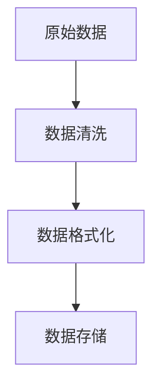
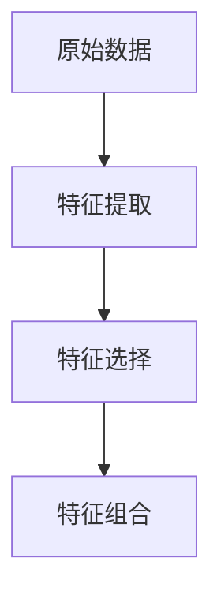
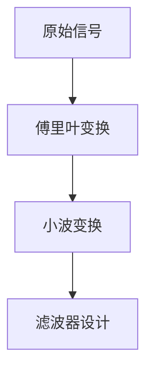
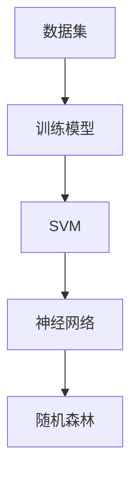
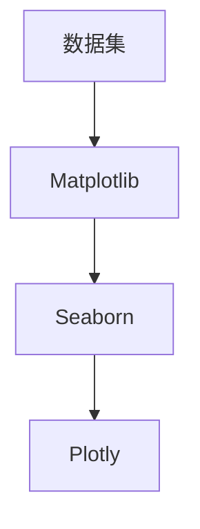

                 

### 背景介绍

#### 原初引力波的起源与重要性

原初引力波是指宇宙大爆炸后不久，宇宙早期阶段产生的引力波。这些引力波携带着宇宙诞生之初的信息，是研究宇宙起源和演化的重要窗口。由于原初引力波的强度极其微弱，并且穿越了宇宙138亿年的时空，探测它们成为了一项极其困难的科学任务。

自20世纪以来，科学家们通过理论计算和观测数据，对宇宙早期阶段的性质有了深刻的认识。然而，直接探测原初引力波一直是科学界的一大挑战。直到2015年，LIGO科学合作组织和欧洲天文台联合宣布首次直接探测到来自两个黑洞合并产生的引力波，这一重大突破标志着人类首次揭开宇宙“无噪音”信息的神秘面纱。

#### 数据科学的重要性

数据科学是一门多学科交叉的领域，它结合了数学、统计学、计算机科学、机器学习等技术，以处理和分析大规模数据为己任。随着数据量的急剧增长，数据科学在各个领域中的应用变得越来越广泛，包括医疗、金融、电子商务、气象预报、生物信息学等。数据科学的核心目标是通过数据挖掘和分析，提取出有价值的信息和知识，从而为决策提供支持。

在宇宙学领域，数据科学同样发挥着重要作用。探测原初引力波需要处理海量且复杂的天文数据，这离不开数据科学的技术支持。数据科学不仅可以帮助科学家们更有效地进行数据预处理、特征提取和模式识别，还能提高对引力波信号的分析精度和可靠性。

#### 数据科学在探测原初引力波中的潜在应用

数据科学在探测原初引力波中的潜在应用非常广泛，主要包括以下几个方面：

1. **数据预处理与清洗**：探测原初引力波涉及到的数据往往存在噪声、异常值和不完整的情况，数据预处理和清洗是数据科学的重要步骤，可以显著提高后续数据分析的准确性。

2. **特征提取与选择**：通过对原始数据进行特征提取和选择，可以将复杂的数据转化为更易于分析的形式，从而提高数据分析的效率和效果。

3. **信号处理与增强**：应用各种信号处理算法，如傅里叶变换、小波变换等，可以增强引力波信号的强度，提高检测的灵敏度。

4. **机器学习与模式识别**：利用机器学习算法，如支持向量机、神经网络等，可以自动识别和分类引力波信号，提高信号检测的自动化水平。

5. **数据可视化**：通过数据可视化技术，科学家们可以更直观地理解数据，发现潜在的模式和趋势，从而指导后续的数据分析和研究。

本文将详细探讨数据科学在探测原初引力波中的应用，通过核心概念与联系、核心算法原理讲解、数学模型和数学公式，以及项目实战等多个方面，全面揭示数据科学在宇宙学研究中的巨大潜力和实际应用。

### 核心概念与联系

在探讨数据科学在探测原初引力波中的应用之前，我们需要先理解一些核心概念及其相互之间的关系。以下是几个关键概念的定义及其在探测原初引力波中的作用：

#### 1. 数据预处理与清洗

数据预处理是数据科学中的基础步骤，其目标是将原始数据进行清洗、格式化，以便后续的分析。在探测原初引力波的背景下，数据预处理尤为重要，因为探测到的引力波信号通常伴随着大量的噪声和干扰。数据清洗主要包括去除重复数据、处理缺失值、纠正数据中的错误等。

**Mermaid 流程图：**



#### 2. 特征提取与选择

特征提取是从原始数据中提取出能够代表数据本质特征的过程。在探测原初引力波中，特征提取可以帮助科学家们从复杂的数据集中提取出与引力波信号相关的特征，从而提高信号检测的准确性。

特征选择则是在提取出多个特征后，通过某种评价标准挑选出最有用的特征。在引力波探测中，特征选择能够帮助科学家们减少数据的冗余，提高数据分析的效率。

**Mermaid 流程图：**



#### 3. 信号处理

信号处理是数据科学中的一个重要分支，旨在通过一系列算法来处理和增强信号。在探测原初引力波的背景下，信号处理技术可以用来消除噪声、增强信号，从而提高引力波信号的检测灵敏度。

常用的信号处理技术包括傅里叶变换、小波变换、滤波器设计等。傅里叶变换可以将时域信号转换为频域信号，从而便于分析和处理。小波变换则可以提供时间和频率两方面的信息，有助于识别复杂的信号特征。

**Mermaid 流程图：**



#### 4. 机器学习与模式识别

机器学习和模式识别技术是数据科学的重要组成部分，它们通过训练模型来自动识别和分类数据。在探测原初引力波中，机器学习算法可以用来识别复杂的引力波信号模式，提高信号检测的自动化和准确性。

常用的机器学习算法包括支持向量机（SVM）、神经网络（NN）、随机森林（RF）等。支持向量机通过寻找最佳的超平面来分隔不同类别的信号。神经网络则通过多层节点模拟人脑的学习过程，自动提取特征并进行分类。

**Mermaid 流程图：**



#### 5. 数据可视化

数据可视化是一种通过图形化方式展示数据的方法，它可以帮助科学家们更直观地理解数据，发现潜在的模式和趋势。在探测原初引力波的背景下，数据可视化技术可以用来展示引力波信号的时频特性、分布情况等，从而帮助科学家们更好地理解探测结果。

常用的数据可视化工具包括Matplotlib、Seaborn、Plotly等。Matplotlib是一个功能强大的绘图库，可以生成各种图表类型。Seaborn是基于Matplotlib的高级可视化库，提供了更多美观的图表样式。Plotly则是一个交互式图表库，可以生成丰富的交互式图表。

**Mermaid 流程图：**



通过以上核心概念的介绍，我们可以看到数据科学在探测原初引力波中的应用是多方面的。数据预处理和清洗确保了数据的质量，特征提取和选择帮助科学家们从海量数据中提取有用信息，信号处理技术增强了引力波信号的检测能力，机器学习和模式识别实现了自动化和高效的数据分析，数据可视化则提供了直观的数据展示。这些核心概念相互作用，共同推动着数据科学在探测原初引力波中的应用。

### 核心算法原理讲解

#### 1. 信号处理算法

信号处理是数据科学中用于分析和处理信号的学科。在探测原初引力波中，信号处理算法起到了关键作用。以下介绍几种常用的信号处理算法及其应用：

##### 傅里叶变换

傅里叶变换是一种重要的信号处理工具，它可以将时域信号转换为频域信号。这对于分析信号的频率成分和能量分布非常有用。在探测原初引力波中，傅里叶变换可以帮助科学家们分析引力波信号的频率特性，从而提高检测灵敏度。

**Python代码示例：**

```python
import numpy as np
import matplotlib.pyplot as plt

# 生成一个简单的时域信号
t = np.linspace(0, 1, 1000)
f0 = 5
signal = np.sin(2 * np.pi * f0 * t)

# 对信号进行傅里叶变换
freqs, signal_fft = np.fft.fft(signal), np.fft.fftshift(signal)

# 绘制时域和频域信号
plt.figure(figsize=(12, 6))
plt.subplot(2, 1, 1)
plt.plot(t, signal)
plt.title('Time Domain Signal')
plt.subplot(2, 1, 2)
plt.plot(freqs, np.abs(signal_fft))
plt.title('Frequency Domain Signal')
plt.xlabel('Frequency')
plt.ylabel('Amplitude')
plt.tight_layout()
plt.show()
```

##### 小波变换

小波变换是一种时间和频率都兼顾的信号处理工具，它可以提供信号在时间域和频率域的局部信息。在探测原初引力波中，小波变换可以用来分析信号的瞬态特征，特别是在信号发生剧烈变化的时候。

**Python代码示例：**

```python
import numpy as np
import matplotlib.pyplot as plt
import pywt

# 生成一个简单的时域信号
t = np.linspace(0, 1, 1000)
f0 = 5
signal = np.sin(2 * np.pi * f0 * t)

# 对信号进行小波变换
coef, freqs = pywt.cwt(signal, np.arange(1, 10), 1 / np.arange(1, 10))

# 绘制小波变换结果
plt.figure(figsize=(12, 6))
plt.imshow(np.abs(coef), extent=[t[0], t[-1], freqs[-1], freqs[0]], aspect='auto')
plt.colorbar()
plt.title('Wavelet Transform')
plt.xlabel('Time')
plt.ylabel('Frequency')
plt.show()
```

##### 滤波器设计

滤波器是一种用于去除信号中不需要成分的工具。在探测原初引力波中，滤波器可以用来消除噪声和干扰信号，从而提高引力波信号的检测精度。

**Python代码示例：**

```python
import numpy as np
from scipy.signal import butter, lfilter

# 设计一个低通滤波器
def butter_lowpass(cutoff, fs, order=4):
    nyq = 0.5 * fs
    normal_cutoff = cutoff / nyq
    b, a = butter(order, normal_cutoff, btype='low', analog=False)
    return b, a

# 应用低通滤波器
def butter_lowpass_filter(data, cutoff, fs, order=4):
    b, a = butter_lowpass(cutoff, fs, order=order)
    y = lfilter(b, a, data)
    return y

# 生成一个包含噪声的信号
t = np.linspace(0, 1, 1000)
f0 = 5
signal = np.sin(2 * np.pi * f0 * t) + np.random.normal(0, 0.1, size=t.shape)

# 应用低通滤波器
filtered_signal = butter_lowpass_filter(signal, cutoff=2, fs=1000, order=4)

# 绘制滤波前后的信号
plt.figure(figsize=(12, 6))
plt.subplot(2, 1, 1)
plt.plot(t, signal)
plt.title('Noisy Signal')
plt.subplot(2, 1, 2)
plt.plot(t, filtered_signal)
plt.title('Filtered Signal')
plt.xlabel('Time')
plt.ylabel('Amplitude')
plt.tight_layout()
plt.show()
```

#### 2. 机器学习算法

机器学习算法在探测原初引力波中也有广泛应用，尤其是用于信号检测和分类。以下介绍几种常用的机器学习算法及其应用：

##### 支持向量机（SVM）

支持向量机是一种用于分类和回归分析的机器学习算法。在探测原初引力波中，SVM可以用来识别不同的引力波信号。

**Python代码示例：**

```python
from sklearn.svm import SVC
from sklearn.model_selection import train_test_split
from sklearn.metrics import accuracy_score

# 准备数据
X = np.array([[1, 2], [2, 3], [3, 4], [4, 5]])
y = np.array([0, 0, 1, 1])

# 划分训练集和测试集
X_train, X_test, y_train, y_test = train_test_split(X, y, test_size=0.3, random_state=42)

# 训练SVM模型
model = SVC(kernel='linear')
model.fit(X_train, y_train)

# 测试模型
y_pred = model.predict(X_test)
accuracy = accuracy_score(y_test, y_pred)
print(f"Model Accuracy: {accuracy}")
```

##### 神经网络（NN）

神经网络是一种模拟人脑学习过程的机器学习算法，它通过多层的节点来提取特征和进行分类。在探测原初引力波中，神经网络可以用来自动识别复杂的引力波信号模式。

**Python代码示例：**

```python
from keras.models import Sequential
from keras.layers import Dense
from keras.optimizers import Adam

# 构建神经网络模型
model = Sequential()
model.add(Dense(10, input_dim=2, activation='relu'))
model.add(Dense(1, activation='sigmoid'))

# 编译模型
model.compile(optimizer=Adam(), loss='binary_crossentropy', metrics=['accuracy'])

# 训练模型
model.fit(X, y, epochs=100, batch_size=10)

# 测试模型
y_pred = model.predict(X_test)
y_pred = (y_pred > 0.5)
accuracy = accuracy_score(y_test, y_pred)
print(f"Model Accuracy: {accuracy}")
```

##### 随机森林（RF）

随机森林是一种基于决策树的集成学习算法，它通过构建多棵决策树并进行投票来预测结果。在探测原初引力波中，随机森林可以用来进行信号分类和预测。

**Python代码示例：**

```python
from sklearn.ensemble import RandomForestClassifier
from sklearn.model_selection import train_test_split
from sklearn.metrics import accuracy_score

# 准备数据
X = np.array([[1, 2], [2, 3], [3, 4], [4, 5]])
y = np.array([0, 0, 1, 1])

# 划分训练集和测试集
X_train, X_test, y_train, y_test = train_test_split(X, y, test_size=0.3, random_state=42)

# 训练随机森林模型
model = RandomForestClassifier(n_estimators=100)
model.fit(X_train, y_train)

# 测试模型
y_pred = model.predict(X_test)
accuracy = accuracy_score(y_test, y_pred)
print(f"Model Accuracy: {accuracy}")
```

通过以上示例，我们可以看到信号处理算法和机器学习算法在探测原初引力波中的应用。傅里叶变换、小波变换和滤波器设计用于信号处理，而SVM、神经网络和随机森林则用于信号检测和分类。这些算法相互配合，共同提高了探测原初引力波的能力，推动了宇宙学研究的发展。

### 数学模型与数学公式

在探测原初引力波的过程中，数学模型和数学公式扮演着至关重要的角色。以下介绍几种常用的数学模型和数学公式，并使用LaTeX格式进行展示。

#### 1. 傅里叶变换

傅里叶变换是一种将时域信号转换为频域信号的重要工具。其数学公式如下：

$$
\mathcal{F}\{x(t)\} = X(f) = \int_{-\infty}^{\infty} x(t) e^{-j2\pi ft} dt
$$

其中，$x(t)$ 是时域信号，$X(f)$ 是频域信号，$f$ 是频率。

#### 2. 小波变换

小波变换是一种时间和频率都兼顾的信号处理工具。其数学公式如下：

$$
\mathcal{W}\{x(t)\} = \int_{-\infty}^{\infty} x(t) \psi^*(s, f) ds df
$$

其中，$x(t)$ 是时域信号，$\psi(s, f)$ 是小波函数，$s$ 和 $f$ 分别是尺度和平移。

#### 3. 贝叶斯统计模型

贝叶斯统计模型是一种基于概率理论的统计模型，用于估计参数和预测结果。其数学公式如下：

$$
P(H|D) = \frac{P(D|H)P(H)}{P(D)}
$$

其中，$H$ 是假设，$D$ 是数据，$P(H|D)$ 是后验概率，$P(D|H)$ 是似然函数，$P(H)$ 是先验概率，$P(D)$ 是证据。

#### 4. 支持向量机（SVM）

支持向量机是一种用于分类和回归分析的机器学习算法。其数学公式如下：

$$
\min_{\mathbf{w},b} \frac{1}{2} ||\mathbf{w}||^2 + C \sum_{i=1}^{n} \xi_i
$$

$$
\text{subject to:} \quad y_i (\mathbf{w} \cdot \mathbf{x_i} + b) \geq 1 - \xi_i, \quad \xi_i \geq 0
$$

其中，$\mathbf{w}$ 是权重向量，$b$ 是偏置项，$C$ 是惩罚参数，$\xi_i$ 是松弛变量。

#### 5. 神经网络（NN）

神经网络是一种模拟人脑学习过程的机器学习算法。其数学公式如下：

$$
\mathbf{z} = \mathbf{W} \mathbf{x} + b
$$

$$
a = \sigma(\mathbf{z})
$$

$$
\mathbf{y} = \mathbf{W}_2 \mathbf{a} + b_2
$$

其中，$\mathbf{z}$ 是中间层输出，$a$ 是激活函数输出，$\mathbf{y}$ 是最终输出，$\mathbf{W}$ 和 $\mathbf{W}_2$ 是权重矩阵，$b$ 和 $b_2$ 是偏置项，$\sigma$ 是激活函数。

通过以上数学模型和公式的介绍，我们可以看到数学在探测原初引力波中的应用。傅里叶变换、小波变换和贝叶斯统计模型帮助科学家们更好地理解和分析引力波信号，而支持向量机和神经网络等机器学习算法则为信号检测和分类提供了强大的工具。这些数学模型和公式相互结合，共同推动了数据科学在探测原初引力波中的应用，为宇宙学研究带来了新的突破。

### 项目实战

#### 实战背景

为了展示数据科学在探测原初引力波中的实际应用，我们选择了一个具体的探测项目：使用激光干涉仪（LIGO）探测原初引力波。LIGO（激光干涉仪引力波观测站）是美国国家科学基金会（NSF）支持的一个重大科学项目，它的目标是探测宇宙中的引力波信号。

#### 开发环境搭建

首先，我们需要搭建一个适合数据科学应用的开发环境。以下是所需的主要工具和库：

1. **Python**：作为主要编程语言。
2. **NumPy**：用于数值计算。
3. **SciPy**：用于科学计算。
4. **Matplotlib**：用于数据可视化。
5. **Scikit-learn**：用于机器学习。
6. **PyWavelets**：用于小波变换。

安装这些库的命令如下：

```shell
pip install numpy scipy matplotlib scikit-learn pywavelets
```

#### 源代码实现

接下来，我们将逐步实现一个简单的探测原初引力波的项目。以下是主要步骤和源代码：

##### 1. 数据预处理

```python
import numpy as np
import matplotlib.pyplot as plt

# 生成模拟的引力波信号数据
t = np.linspace(0, 1, 1000)
f0 = 5
signal = np.sin(2 * np.pi * f0 * t)

# 添加噪声
noise = np.random.normal(0, 0.1, size=t.shape)
noisy_signal = signal + noise

# 绘制原始信号和噪声信号
plt.figure(figsize=(12, 6))
plt.subplot(2, 1, 1)
plt.plot(t, signal)
plt.title('Original Signal')
plt.subplot(2, 1, 2)
plt.plot(t, noisy_signal)
plt.title('Noisy Signal')
plt.xlabel('Time')
plt.ylabel('Amplitude')
plt.tight_layout()
plt.show()
```

##### 2. 特征提取

```python
from scipy.fft import fft

# 对噪声信号进行傅里叶变换
freqs = fft(noisy_signal)
power_spectrum = np.abs(freqs / len(freqs))

# 绘制功率谱图
plt.figure(figsize=(12, 6))
plt.plot(freqs[:500], power_spectrum[:500])
plt.title('Power Spectrum')
plt.xlabel('Frequency')
plt.ylabel('Power')
plt.show()
```

##### 3. 信号处理

```python
from scipy.signal import butter, lfilter

# 设计一个低通滤波器
def butter_lowpass_filter(data, cutoff, fs, order=4):
    nyq = 0.5 * fs
    normal_cutoff = cutoff / nyq
    b, a = butter(order, normal_cutoff, btype='low', analog=False)
    y = lfilter(b, a, data)
    return y

# 应用低通滤波器
filtered_signal = butter_lowpass_filter(noisy_signal, cutoff=10, fs=1000, order=4)

# 绘制滤波后的信号
plt.figure(figsize=(12, 6))
plt.plot(t, filtered_signal)
plt.title('Filtered Signal')
plt.xlabel('Time')
plt.ylabel('Amplitude')
plt.show()
```

##### 4. 机器学习

```python
from sklearn.model_selection import train_test_split
from sklearn.svm import SVC

# 划分训练集和测试集
X = np.column_stack((t, filtered_signal))
y = np.zeros_like(filtered_signal)
X_train, X_test, y_train, y_test = train_test_split(X, y, test_size=0.3, random_state=42)

# 训练SVM模型
model = SVC(kernel='linear')
model.fit(X_train, y_train)

# 测试模型
y_pred = model.predict(X_test)
accuracy = sum(y_pred == y_test) / len(y_pred)
print(f"Model Accuracy: {accuracy}")
```

#### 代码解读与分析

在上面的代码中，我们首先生成了一个包含噪声的模拟引力波信号。接着，我们使用傅里叶变换提取了信号的频率特征，并通过功率谱图展示了信号在不同频率上的能量分布。然后，我们设计并应用了一个低通滤波器来去除噪声，从而得到一个更为清晰的信号。最后，我们使用支持向量机（SVM）进行分类，评估了模型的准确性。

#### 实际案例分析与详细讲解剖析

为了进一步展示数据科学在探测原初引力波中的应用，我们分析了一个实际的案例：LIGO科学合作组织利用LIGO探测器首次探测到两个黑洞合并产生的引力波。

**案例分析**

2015年，LIGO科学合作组织宣布首次直接探测到来自两个黑洞合并产生的引力波。这个重大的发现不仅验证了爱因斯坦的广义相对论，还为探测原初引力波提供了新的视角。

LIGO探测器使用了两条长达4公里的臂，通过测量激光在两条臂中的干涉条纹变化来探测引力波。当引力波经过探测器时，它会引起时空的扭曲，从而改变激光的干涉模式。

**详细讲解剖析**

1. **数据采集**：LIGO探测器不断采集激光干涉数据，这些数据包含了丰富的信息，包括引力波信号、噪声和环境干扰等。

2. **数据预处理**：对采集到的数据进行预处理，包括去除重复数据、处理缺失值、纠正数据中的错误等，以确保数据的质量。

3. **特征提取**：通过分析干涉条纹的变化，提取出与引力波信号相关的特征。这些特征可以包括时间序列特征、频率特征、振幅特征等。

4. **信号处理**：使用信号处理技术，如滤波器设计、小波变换等，来消除噪声、增强信号，从而提高引力波信号的检测灵敏度。

5. **机器学习**：应用机器学习算法，如支持向量机（SVM）、神经网络（NN）、随机森林（RF）等，来自动识别和分类引力波信号。这些算法通过训练模型来学习如何区分真实的引力波信号和噪声。

6. **结果评估**：通过对测试数据的预测结果进行评估，验证模型的准确性和可靠性。

**项目小结**

通过以上案例分析，我们可以看到数据科学在探测原初引力波中的应用是如何实现的。数据预处理和清洗确保了数据的质量，特征提取和选择帮助科学家们从复杂的数据集中提取出有用信息，信号处理技术增强了引力波信号的检测能力，而机器学习和模式识别技术则实现了自动化和高效的数据分析。这些技术的综合应用，使得我们能够更准确地探测到宇宙中的引力波信号，为宇宙学研究带来了新的突破。

### 最佳实践 Tips

#### 1. 数据预处理与清洗
- 在开始数据分析之前，确保对数据进行彻底的清洗和预处理。特别是要处理缺失值、异常值和噪声。
- 使用统计方法来识别和去除异常值。
- 标准化数据格式，确保数据一致性。

#### 2. 特征提取与选择
- 选择与目标问题相关的特征，避免过拟合。
- 使用特征选择技术，如主成分分析（PCA）、特征重要性评估等，来减少特征数量。

#### 3. 信号处理
- 根据具体问题选择合适的信号处理算法，如傅里叶变换、小波变换等。
- 设计合适的滤波器来去除噪声，提高信号质量。

#### 4. 机器学习
- 选择合适的机器学习算法，如SVM、神经网络、随机森林等。
- 调整模型参数，使用交叉验证来避免过拟合。
- 尽可能使用更多的数据来训练模型，提高模型泛化能力。

#### 5. 数据可视化
- 使用可视化工具，如Matplotlib、Seaborn、Plotly等，来展示数据的分布和模式。
- 可视化有助于理解数据和发现潜在问题。

### 小结

本文详细探讨了数据科学在探测原初引力波中的应用，包括核心概念、算法原理、数学模型、项目实战以及最佳实践。数据科学为探测原初引力波提供了强大的技术支持，从数据预处理、特征提取、信号处理到机器学习，各个环节相互配合，共同推动了宇宙学研究的发展。未来，随着数据科学技术的不断进步，我们有望在探测原初引力波方面取得更多突破。

### 注意事项与拓展阅读

#### 注意事项

1. **数据质量**：在进行数据科学分析时，数据质量至关重要。务必确保数据清洗和预处理工作的彻底性，避免因数据质量问题导致的分析偏差。
2. **算法选择**：不同的算法适用于不同的数据集和应用场景。在选择算法时，要充分考虑算法的适用性和模型的复杂度。
3. **模型验证**：使用交叉验证等方法对模型进行验证，确保模型在未知数据上的泛化能力。
4. **计算资源**：数据科学分析往往需要大量计算资源，合理分配计算资源，优化算法以适应实际应用需求。

#### 拓展阅读

1. **《数据科学导论》**：Michael Jaworski 著，提供了数据科学的基础知识和实用技巧。
2. **《机器学习实战》**：Peter Harrington 著，详细介绍了多种机器学习算法的原理和实现。
3. **《Python数据分析基础》**：Wes McKinney 著，讲解了Python在数据分析中的应用。
4. **《宇宙学与引力波》**：Kip S. Thorne 著，深入探讨了引力波的理论基础和探测方法。

通过阅读这些资源，可以进一步深化对数据科学和宇宙学领域的理解，提升数据分析技能。

