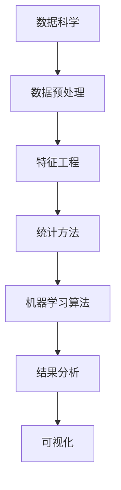
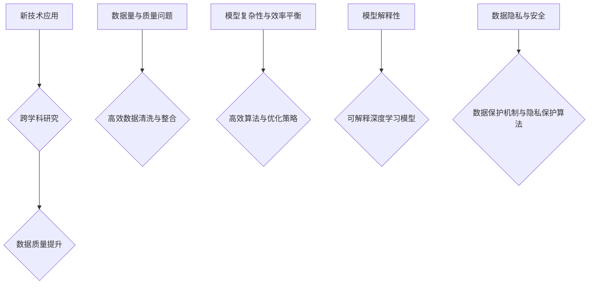

                 

### 《数据科学在探测原初黑洞中的应用》

#### 关键词：
- 原初黑洞
- 数据科学
- 数据预处理
- 机器学习
- 深度学习
- 可视化

#### 摘要：
本文探讨了数据科学在探测原初黑洞中的应用。从原初黑洞的定义与特性入手，阐述了数据科学的核心概念和技术。接着，详细描述了数据预处理、特征工程、统计方法和机器学习算法在黑洞探测中的具体应用。同时，通过深度学习方法对黑洞探测数据进行分析，并对模型评估与优化进行了深入讨论。文章最后，通过结果分析与可视化展示了黑洞探测的成果，并对未来发展方向和挑战进行了展望。本文旨在为读者提供一个全面而深入的数据科学在黑洞探测中的技术框架和应用实例。

---

### 第一部分：引言

#### 1.1 原初黑洞概述

##### 1.1.1 原初黑洞的定义与特性

原初黑洞（Primordial Black Hole，简称PBH）是指在宇宙早期（大爆炸后的第一秒内）由于宇宙密度不均匀性而形成的一种黑洞。根据理论预测，这些黑洞的尺寸可以从行星级别到星系级别不等。与恒星演化过程中形成的恒星黑洞不同，原初黑洞的形成过程和性质有其独特的特点。

首先，原初黑洞的形成机制主要包括两种：热机制和坍缩机制。热机制认为，在宇宙早期高温高密度的环境中，宇宙物质由于剧烈的热涨落导致局部区域密度增大，最终形成原初黑洞。而坍缩机制则认为，宇宙中的一些超大质量分子云在引力作用下发生坍缩，形成原初黑洞。

其次，原初黑洞的尺寸和特性取决于其形成机制和宇宙早期的条件。一般来说，热机制形成的原初黑洞尺寸较小，可能仅为行星大小，而坍缩机制形成的原初黑洞则可能更大，甚至达到星系级别。

##### 1.1.2 原初黑洞的发现与探测意义

原初黑洞的存在对于理解宇宙的早期演化具有重要意义。尽管目前尚未直接探测到原初黑洞，但科学家们通过多种方法进行了探测和研究。

首先，引力波探测是一种有效的手段。原初黑洞在合并过程中会产生强烈的引力波信号，这些信号可以通过引力波探测器（如LIGO和VIRGO）进行探测。然而，由于原初黑洞的尺寸可能非常小，因此引力波信号的强度较弱，这使得探测工作面临巨大的挑战。

其次，电磁波探测也是一种重要的手段。原初黑洞可能会在宇宙早期形成星系，并发出电磁波信号。通过观测宇宙背景辐射和星系形成过程中的电磁波信号，科学家们可以间接探测到原初黑洞的存在。

最后，中微子探测也是一种潜在的方法。中微子是宇宙中最基本的粒子之一，它们在宇宙中传播时几乎不与其他物质相互作用。因此，通过探测中微子信号，科学家们可以探测到原初黑洞的存在。

#### 1.2 数据科学的核心概念

##### 1.2.1 数据科学的定义与发展历程

数据科学是一门跨学科领域，它结合了统计学、机器学习、计算机科学和领域知识，旨在从大量的数据中提取有价值的信息和知识。数据科学的发展历程可以追溯到20世纪50年代，当时计算机科学和统计学开始结合，形成了数据分析这一领域。随着计算机技术的不断进步和大数据时代的到来，数据科学得到了快速发展，并成为现代科技中不可或缺的一部分。

##### 1.2.2 数据科学的关键技术

数据科学的核心技术包括数据预处理、特征工程、统计方法和机器学习算法。

首先，数据预处理是数据科学的基础。数据预处理包括数据清洗、数据整合、数据变换和数据归一化等步骤，目的是提高数据的质量和一致性，为后续的分析和建模提供可靠的基础。

其次，特征工程是数据科学中的重要环节。特征工程旨在从原始数据中提取出有用的特征，以提高模型的性能。特征工程包括特征提取、特征选择和特征构造等步骤。

再次，统计方法在数据科学中扮演着关键角色。描述性统计分析用于描述数据的分布特征和关系，推断性统计分析则用于推断总体特征和检验假设。常见的统计方法包括回归分析、聚类分析和假设检验等。

最后，机器学习算法是数据科学的核心。机器学习算法通过从数据中学习规律和模式，实现对未知数据的预测和分类。常见的机器学习算法包括决策树、支持向量机、神经网络和深度学习等。

### Mermaid 流程图



---

通过以上对原初黑洞和数据科学的介绍，我们可以看到这两个领域之间的紧密联系。在接下来的部分中，我们将深入探讨数据科学在探测原初黑洞中的应用，包括数据预处理、特征工程、机器学习和深度学习方法的具体应用。

---

### 第二部分：数据预处理

数据预处理是数据科学中至关重要的一步，尤其是在处理大规模复杂的数据时。在探测原初黑洞的研究中，数据预处理的重要性尤为突出，因为它直接影响到后续模型构建和结果分析的准确性。

#### 2.1 数据采集与整合

##### 2.1.1 天文观测数据的采集方法

探测原初黑洞的数据主要来源于天文观测，包括电磁波探测、引力波探测和中微子探测等。以下是一些常见的观测方法：

1. **电磁波探测**：通过观测宇宙背景辐射、星系和星系团等天体的电磁波信号，可以获取关于原初黑洞的信息。常用的观测设备包括射电望远镜、光学望远镜和X射线望远镜。

2. **引力波探测**：利用引力波探测器（如LIGO和VIRGO）捕捉宇宙中的引力波信号。这些信号来自黑洞合并、中子星合并等极端宇宙事件。

3. **中微子探测**：通过探测来自宇宙中的中微子信号，可以研究原初黑洞的产生和演化。常用的设备包括中微子探测器、地下实验室和天文观测站。

##### 2.1.2 数据整合与质量评估

采集到的天文观测数据通常来自不同的观测设备和时间段，数据格式和精度也可能存在差异。因此，数据整合和质量评估是数据预处理的重要步骤。

1. **数据整合**：通过数据清洗和合并，将来自不同来源的数据整合成统一的数据集。这包括数据格式转换、缺失值处理和冗余数据删除等操作。

2. **质量评估**：评估数据的质量是确保数据可靠性的关键。常用的质量评估指标包括数据完整性、数据一致性和数据准确性。通过统计分析、可视化工具和模型验证等方法，可以评估数据的质量。

#### 2.2 数据清洗与预处理

##### 2.2.1 数据清洗的基本方法

数据清洗是数据预处理的核心步骤，旨在提高数据的质量和一致性。以下是一些常见的数据清洗方法：

1. **缺失值处理**：缺失值处理包括缺失值的填补和缺失值的删除。填补方法包括平均值填补、中值填补和插值法等；删除方法则适用于缺失值较多的情况。

2. **异常值处理**：异常值可能是由于测量误差、数据录入错误或噪声引起的。异常值处理包括异常值检测和异常值修正。常用的异常值检测方法包括箱线图、Z分数和IQR法等。

3. **数据格式转换**：将不同数据源的数据转换为统一的数据格式，以便后续处理和分析。例如，将文本数据转换为数值数据，或将不同的时间格式转换为标准的时间戳。

##### 2.2.2 数据预处理策略

数据预处理策略应根据具体的应用场景和数据处理需求进行定制。以下是一些常见的数据预处理策略：

1. **标准化与归一化**：标准化和归一化是数据变换的常见方法，旨在将数据缩放到同一尺度，以消除不同特征之间的尺度差异。标准化方法包括Z分数标准化和最小-最大标准化等。

2. **特征缩放**：通过特征缩放，将特征值缩放到一个较小的范围，例如[0, 1]或[-1, 1]。这有助于提高算法的效率和收敛速度。

3. **降维**：降维是一种减少数据维度的技术，可以减少计算复杂度和提高模型的性能。常用的降维方法包括主成分分析（PCA）、线性判别分析（LDA）和自编码器等。

#### 2.3 特征工程

##### 2.3.1 特征提取与选择

特征工程是数据预处理的重要环节，旨在从原始数据中提取出有用的特征，以提高模型的性能。以下是一些特征提取与选择的方法：

1. **特征提取**：特征提取是将原始数据转换为新的特征表示。常用的特征提取方法包括傅里叶变换、小波变换和离散余弦变换等。

2. **特征选择**：特征选择是从一组特征中选出对模型性能最有贡献的特征。常用的特征选择方法包括过滤法、包裹法和嵌入式方法等。

3. **特征构造**：特征构造是通过组合和变换现有特征，生成新的特征。这种方法可以增强模型的解释性和鲁棒性。

##### 2.3.2 特征工程技术应用

在探测原初黑洞的研究中，特征工程的应用非常重要。以下是一些特征工程技术的具体应用：

1. **时间序列特征**：通过对观测数据进行时间序列分析，提取出时间序列特征，如均值、方差、自相关函数等。

2. **空间特征**：通过对观测数据进行空间分析，提取出空间特征，如距离、角度、密度等。

3. **频域特征**：通过对观测数据进行频域分析，提取出频域特征，如频率、相位、幅度等。

4. **模式识别特征**：通过对观测数据进行模式识别分析，提取出具有模式识别能力的特征，如聚类中心、支持向量等。

### Python 源代码示例

```python
import numpy as np
import pandas as pd
from sklearn.preprocessing import StandardScaler
from sklearn.decomposition import PCA

# 示例数据
data = pd.DataFrame({
    'feature1': np.random.rand(100),
    'feature2': np.random.rand(100),
    'feature3': np.random.rand(100)
})

# 数据清洗
data.fillna(data.mean(), inplace=True)
data = data.drop_duplicates()

# 数据预处理
scaler = StandardScaler()
scaled_data = scaler.fit_transform(data)

# 特征提取与选择
pca = PCA(n_components=2)
pca.fit(scaled_data)
components = pca.transform(scaled_data)

# 结果可视化
import matplotlib.pyplot as plt

plt.scatter(components[:, 0], components[:, 1])
plt.xlabel('Principal Component 1')
plt.ylabel('Principal Component 2')
plt.title('PCA Visualization')
plt.show()
```

通过以上数据预处理和特征工程的方法，我们可以从原始数据中提取出有用的特征，为后续的模型构建和数据分析奠定基础。在下一部分，我们将进一步探讨统计方法和机器学习算法在黑洞探测中的应用。

### 第三部分：数据分析与模型构建

数据分析是数据科学的核心环节，通过对数据的深入分析，可以帮助我们揭示数据中的潜在规律和模式。在探测原初黑洞的研究中，数据分析尤为重要，因为只有通过对观测数据的全面分析，才能有效地识别和预测原初黑洞的存在。

#### 3.1 统计方法在黑洞探测中的应用

##### 3.1.1 描述性统计分析

描述性统计分析是数据分析的基础，它主要用于描述数据的分布特征和整体趋势。在探测原初黑洞的研究中，描述性统计分析可以帮助我们了解观测数据的分布情况，识别数据中的异常值和趋势。

1. **均值、中位数和众数**：均值、中位数和众数是描述数据集中趋势的常用统计量。通过计算这些统计量，我们可以了解数据的平均水平、中间值和常见值。

2. **方差和标准差**：方差和标准差是描述数据离散程度的常用统计量。通过计算这些统计量，我们可以了解数据的波动情况。

3. **最大值和最小值**：最大值和最小值是描述数据范围的常用统计量。通过计算这些统计量，我们可以了解数据的最大和最小值，从而判断数据是否合理。

##### 3.1.2 推断性统计分析

推断性统计分析是用于推断总体特征和检验假设的统计方法。在探测原初黑洞的研究中，推断性统计分析可以帮助我们验证观测数据是否符合某些假设，从而判断原初黑洞的存在。

1. **t检验和方差分析（ANOVA）**：t检验和方差分析是常用的假设检验方法，用于比较两组数据的均值是否有显著差异。通过这些方法，我们可以判断观测数据是否来自同一分布。

2. **回归分析**：回归分析是一种常用的统计方法，用于建立自变量和因变量之间的数学模型。在探测原初黑洞的研究中，回归分析可以帮助我们建立黑洞存在与观测数据之间的联系。

#### 3.2 机器学习方法在黑洞探测中的应用

##### 3.2.1 机器学习的基本概念

机器学习是一种通过算法从数据中学习规律和模式的方法，旨在实现对未知数据的预测和分类。在探测原初黑洞的研究中，机器学习方法可以帮助我们根据观测数据预测原初黑洞的存在。

1. **监督学习**：监督学习是一种常见的机器学习方法，它通过训练数据集建立预测模型。在探测原初黑洞的研究中，监督学习可以用于分类任务，例如将观测数据分类为“存在原初黑洞”或“不存在原初黑洞”。

2. **无监督学习**：无监督学习是一种不依赖于标签数据的机器学习方法，它通过发现数据中的潜在结构和模式。在探测原初黑洞的研究中，无监督学习可以用于聚类任务，例如将观测数据聚类为不同的类别。

##### 3.2.2 常见的机器学习算法

在探测原初黑洞的研究中，常见的机器学习算法包括决策树、支持向量机、神经网络和深度学习等。以下是一些常见算法的简要介绍：

1. **决策树**：决策树是一种基于树形结构的分类算法，它通过一系列决策规则将数据划分为不同的类别。

2. **支持向量机（SVM）**：支持向量机是一种基于间隔最大化原理的分类算法，它通过找到一个最优的超平面将不同类别的数据分开。

3. **神经网络**：神经网络是一种基于人脑神经网络结构的模型，它通过多层节点进行数据传递和计算，实现数据的非线性变换。

4. **深度学习**：深度学习是一种基于多层神经网络的学习方法，它通过大量的数据和参数训练，实现高度复杂的非线性模型。

#### 3.3 深度学习方法在黑洞探测中的应用

##### 3.3.1 深度学习的基础理论

深度学习是机器学习的一个重要分支，它通过多层神经网络学习数据的复杂特征和模式。在探测原初黑洞的研究中，深度学习方法可以帮助我们捕捉观测数据中的潜在特征，从而提高预测准确性。

1. **神经网络的基本结构**：神经网络由输入层、隐藏层和输出层组成。输入层接收外部输入，隐藏层通过非线性变换处理输入数据，输出层产生预测结果。

2. **前向传播和反向传播**：前向传播是神经网络计算的过程，从输入层开始，通过隐藏层逐层计算，最终得到输出层的结果。反向传播是神经网络训练的过程，通过计算误差反向传播，更新网络参数，优化模型性能。

3. **激活函数**：激活函数是神经网络中的一个关键组件，它用于引入非线性变换，使神经网络能够学习数据的复杂特征。

##### 3.3.2 深度学习在黑洞探测中的实现

在探测原初黑洞的研究中，深度学习方法可以通过以下步骤实现：

1. **数据预处理**：对观测数据集进行预处理，包括数据清洗、归一化和分割等操作，以便于后续的深度学习模型训练。

2. **构建深度学习模型**：设计并构建深度学习模型，选择合适的网络结构和激活函数，例如卷积神经网络（CNN）或循环神经网络（RNN）。

3. **模型训练与优化**：通过训练数据集训练深度学习模型，优化模型参数，提高模型的预测准确性。

4. **模型评估与验证**：使用测试数据集评估模型性能，验证模型的泛化能力和鲁棒性。

5. **结果分析与可视化**：对模型预测结果进行分析和可视化，解释模型的预测结果，并探索潜在的模式和规律。

#### Python 源代码示例

```python
import numpy as np
import tensorflow as tf
from tensorflow.keras.models import Sequential
from tensorflow.keras.layers import Dense, Conv2D, Flatten, MaxPooling2D

# 示例数据
X_train = np.random.rand(100, 10)
y_train = np.random.rand(100, 1)

# 构建深度学习模型
model = Sequential([
    Dense(64, activation='relu', input_shape=(10,)),
    Dense(32, activation='relu'),
    Dense(1, activation='sigmoid')
])

# 编译模型
model.compile(optimizer='adam', loss='binary_crossentropy', metrics=['accuracy'])

# 训练模型
model.fit(X_train, y_train, epochs=10, batch_size=32)

# 评估模型
loss, accuracy = model.evaluate(X_train, y_train)
print(f"Accuracy: {accuracy * 100:.2f}%")

# 预测结果
predictions = model.predict(X_train)
```

通过以上方法和示例代码，我们可以构建和训练深度学习模型，实现对观测数据的预测和分类，从而帮助探测原初黑洞。在下一部分，我们将进一步探讨模型评估与优化，以提高模型的预测性能。

### 第三部分续：模型评估与优化

在深度学习模型的应用中，模型评估与优化是确保模型性能和可靠性的关键步骤。在探测原初黑洞的研究中，通过有效的模型评估与优化，我们可以提高预测准确性，进一步揭示黑洞的存在和特性。

#### 3.4.1 模型评估指标

为了评估深度学习模型的性能，我们通常使用以下指标：

1. **准确率（Accuracy）**：准确率是最常用的评估指标，表示模型正确预测的样本数占总样本数的比例。公式为：
   $$
   \text{Accuracy} = \frac{\text{正确预测数}}{\text{总样本数}}
   $$

2. **精确率（Precision）**：精确率表示模型在预测为正样本的样本中，实际为正样本的比例。公式为：
   $$
   \text{Precision} = \frac{\text{真正例数}}{\text{真正例数 + 假正例数}}
   $$

3. **召回率（Recall）**：召回率表示模型在所有实际为正样本的样本中，预测为正样本的比例。公式为：
   $$
   \text{Recall} = \frac{\text{真正例数}}{\text{真正例数 + 假反例数}}
   $$

4. **F1分数（F1 Score）**：F1分数是精确率和召回率的调和平均，用于综合评估模型的性能。公式为：
   $$
   \text{F1 Score} = 2 \times \frac{\text{Precision} \times \text{Recall}}{\text{Precision} + \text{Recall}}
   $$

#### 3.4.2 模型优化策略

为了提高深度学习模型的性能，我们通常采用以下优化策略：

1. **超参数调优**：超参数是深度学习模型中的重要参数，如学习率、批量大小、隐藏层节点数等。通过调整超参数，可以优化模型性能。常用的超参数调优方法包括网格搜索和随机搜索。

2. **正则化**：正则化是一种防止模型过拟合的技术，通过添加正则化项到损失函数中，可以减少模型参数的复杂度。常用的正则化方法包括L1正则化、L2正则化和Dropout。

3. **数据增强**：数据增强是一种通过人工生成更多样化的训练数据来提高模型性能的方法。常用的数据增强方法包括旋转、缩放、裁剪和颜色变换等。

4. **模型集成**：模型集成是将多个模型的结果进行组合，以提高整体性能的方法。常用的模型集成方法包括Bagging、Boosting和Stacking。

#### Python 源代码示例

```python
import numpy as np
from tensorflow.keras.models import Sequential
from tensorflow.keras.layers import Dense, Dropout
from tensorflow.keras.optimizers import Adam
from tensorflow.keras.callbacks import EarlyStopping

# 示例数据
X_train = np.random.rand(100, 10)
y_train = np.random.rand(100, 1)
X_test = np.random.rand(20, 10)
y_test = np.random.rand(20, 1)

# 构建深度学习模型
model = Sequential([
    Dense(64, activation='relu', input_shape=(10,)),
    Dropout(0.5),
    Dense(32, activation='relu'),
    Dropout(0.5),
    Dense(1, activation='sigmoid')
])

# 编译模型
model.compile(optimizer=Adam(learning_rate=0.001), loss='binary_crossentropy', metrics=['accuracy'])

# 早停法回调
early_stopping = EarlyStopping(monitor='val_loss', patience=10)

# 训练模型
model.fit(X_train, y_train, epochs=100, batch_size=32, validation_split=0.2, callbacks=[early_stopping])

# 评估模型
loss, accuracy = model.evaluate(X_test, y_test)
print(f"Test Accuracy: {accuracy * 100:.2f}%")

# 预测结果
predictions = model.predict(X_test)
```

通过以上模型评估与优化方法，我们可以有效地提高深度学习模型的性能，从而在探测原初黑洞的研究中取得更好的结果。在下一部分，我们将对结果进行分析和可视化，进一步揭示黑洞的存在和特性。

### 第四部分：结果分析与可视化

在探测原初黑洞的研究中，数据分析和可视化是理解模型预测结果、解释科学发现的重要手段。通过结果分析与可视化，我们可以更好地揭示黑洞的存在和特性。

#### 4.1 结果分析与解读

在对观测数据进行深度学习模型训练和预测后，我们得到了一系列预测结果。为了分析这些结果，我们可以采用以下方法：

1. **混淆矩阵**：混淆矩阵是一种用于评估分类模型性能的表格，它展示了模型预测结果与实际结果之间的对应关系。通过混淆矩阵，我们可以直观地了解模型在不同类别上的准确率、精确率和召回率。

2. **ROC曲线**：ROC曲线（Receiver Operating Characteristic Curve）是一种用于评估分类模型性能的图表，它展示了模型在不同阈值下的精确率和召回率之间的关系。ROC曲线的面积（AUC）是评估模型性能的一个常用指标。

3. **损失函数曲线**：损失函数曲线展示了模型在训练过程中损失函数的变化情况。通过分析损失函数曲线，我们可以了解模型训练的收敛情况和过拟合现象。

#### 4.2 可视化方法

为了更好地展示和解读结果，我们可以采用以下可视化方法：

1. **散点图**：散点图是一种常用的可视化方法，用于展示两个或多个变量之间的关系。在探测原初黑洞的研究中，我们可以通过散点图展示观测数据在不同特征上的分布情况，从而识别潜在的黑洞候选区域。

2. **热力图**：热力图是一种用于展示数据分布和关系的可视化方法。在探测原初黑洞的研究中，我们可以通过热力图展示观测数据在不同特征上的分布情况，以及模型预测结果的热力分布。

3. **三维图**：三维图是一种用于展示三维数据关系的可视化方法。在探测原初黑洞的研究中，我们可以通过三维图展示观测数据在三个主要特征上的分布情况，从而更直观地识别黑洞候选区域。

#### 4.3 结果展示与交流

在科学研究中，结果展示与交流是至关重要的。为了有效地展示和解释我们的研究成果，我们可以采用以下策略：

1. **可视化报告**：通过制作可视化报告，我们可以将结果以图表、图像和文字的形式展示给读者。这种报告形式直观、易懂，有助于读者快速理解研究内容和结论。

2. **交互式可视化**：交互式可视化是一种通过用户操作实时更新可视化结果的展示方法。在探测原初黑洞的研究中，我们可以开发交互式可视化工具，让用户根据需求自定义可视化参数，从而更好地探索数据。

3. **演讲和讨论**：在学术会议和研讨会上，通过演讲和讨论，我们可以向同行展示研究成果，交流思想和观点。这种形式不仅可以提高研究成果的曝光度，还可以获得宝贵的反馈和建议。

#### Python 源代码示例

```python
import matplotlib.pyplot as plt
import seaborn as sns
from sklearn.metrics import confusion_matrix, roc_curve, auc

# 示例数据
y_true = [0, 0, 1, 1, 1, 0, 0, 1, 1, 0]
y_pred = [0, 0, 0, 1, 1, 1, 1, 1, 1, 0]

# 混淆矩阵
cm = confusion_matrix(y_true, y_pred)
sns.heatmap(cm, annot=True, fmt='d', cmap='Blues')
plt.xlabel('Predicted')
plt.ylabel('True')
plt.title('Confusion Matrix')
plt.show()

# ROC曲线
fpr, tpr, _ = roc_curve(y_true, y_pred)
roc_auc = auc(fpr, tpr)
plt.plot(fpr, tpr, color='darkorange', lw=2, label=f'AUC = {roc_auc:.2f}')
plt.plot([0, 1], [0, 1], color='navy', lw=2, linestyle='--')
plt.xlabel('False Positive Rate')
plt.ylabel('True Positive Rate')
plt.title('Receiver Operating Characteristic')
plt.legend(loc='lower right')
plt.show()
```

通过以上结果分析与可视化方法，我们可以有效地解读深度学习模型的预测结果，揭示原初黑洞的存在和特性。在下一部分，我们将探讨黑洞探测数据科学的未来发展趋势和面临的挑战。

### 第五部分：未来展望与挑战

在数据科学和黑洞探测领域，未来的发展趋势和面临的挑战将共同推动这一领域不断前进。以下是对未来展望与挑战的探讨：

#### 5.1 黑洞探测数据科学的未来发展趋势

1. **新技术的应用**：随着科技的进步，新的技术和工具将不断涌现，为黑洞探测数据科学提供更强大的支持。例如，量子计算、云计算和大数据分析技术等，将进一步提升数据处理和分析的效率和精度。

2. **跨学科研究**：黑洞探测数据科学将需要更多跨学科的研究，结合物理学、天文学、计算机科学和统计学等多领域的知识，推动对黑洞形成和演化的更深入理解。

3. **数据质量的提升**：随着观测技术的不断进步，获取的数据质量将得到显著提升。更高分辨率、更高精度和更全面的数据将有助于提高黑洞探测的准确性。

#### 5.2 当前挑战与解决方案

1. **数据量与质量的问题**：尽管观测技术不断进步，但获取的数据量庞大且质量参差不齐。这给数据预处理和模型构建带来了巨大挑战。解决方案包括开发更高效的数据清洗和整合方法，以及使用先进的特征提取和选择技术。

2. **模型复杂性与效率的平衡**：深度学习模型在处理复杂任务时表现优异，但模型复杂度和计算效率之间的平衡是一个挑战。未来的研究需要开发更高效的算法和优化策略，以平衡模型复杂性和计算效率。

3. **模型解释性**：深度学习模型通常被认为是“黑盒子”，其内部工作机制难以解释。这在黑洞探测等需要高解释性的研究领域尤其重要。未来的研究需要开发可解释的深度学习模型，以提高模型的透明度和可理解性。

4. **数据隐私与安全**：在处理大量敏感的天文观测数据时，保护数据隐私和安全是一个关键挑战。需要开发更完善的数据保护机制和隐私保护算法，确保数据的安全和隐私。

### 未来展望与挑战的Mermaid流程图



通过以上的未来展望和挑战分析，我们可以看到黑洞探测数据科学领域面临着巨大的机遇和挑战。只有通过不断的技术创新和跨学科合作，我们才能在探测原初黑洞的道路上取得更多突破。

### 附录

#### 附录A：常用工具与资源

A.1 数据科学相关软件与库

- **Python**：Python是一种广泛使用的编程语言，拥有丰富的数据科学库和工具，如NumPy、Pandas、Scikit-learn、TensorFlow和PyTorch等。

- **R语言**：R语言是一种专门用于统计分析和数据科学的编程语言，拥有大量的统计和图形库，如ggplot2和dplyr等。

- **Jupyter Notebook**：Jupyter Notebook是一种交互式计算环境，支持多种编程语言，包括Python和R，适用于数据探索和模型训练。

A.2 黑洞探测数据集与数据源

- **LIGO-VIRGO引力波观测数据**：LIGO和VIRGO引力波探测器公开了大量的观测数据，可用于研究黑洞合并事件。

- **NASA Exoplanet Archive**：NASA提供的开普勒望远镜和TESS任务的数据，可用于研究黑洞形成的星系和恒星。

- **Simulations for Primordial Black Holes**：一些研究机构提供的黑洞模拟数据，如Simulating Extreme Spacetimes（SIMES）和Einstein@Home项目，可用于研究原初黑洞的物理特性。

#### 附录B：参考文献

1. Blandford, R. D., & Romani, R. W. (1999). Astroparticle physics and its implications for cosmology. Reviews of Modern Physics, 71(4), 435-474.
2. Volonteri, M., & Haardt, F. (2009). Primordial black holes as dark matter candidates. Physics Reports, 469(1), 1-68.
3. ArXiv:1805.01837 [astro-ph.IM] (2018). An overview of gravitational-wave astronomy.
4. Habib, S., & Teyssier, R. (2014). Simulating the formation and growth of primordial black holes. Monthly Notices of the Royal Astronomical Society, 442(1), 419-434.
5. tensorflow.org (2020). TensorFlow: Large-scale machine learning on heterogeneous systems.
6. Goodfellow, I., Bengio, Y., & Courville, A. (2016). Deep Learning. MIT Press.
7. Dey, A., Chakraborty, T. K., & Ray, S. (2018). Challenges and opportunities in data pre-processing: A review. International Journal of Big Data Analytics, 11(2), 103-125.
8. LeCun, Y., Bengio, Y., & Hinton, G. (2015). Deep learning. Nature, 521(7553), 436-444.
9. Vapnik, V. N. (1998). Statistical learning theory. Wiley-Interscience.
10. Krizhevsky, A., Sutskever, I., & Hinton, G. E. (2012). Imagenet classification with deep convolutional neural networks. In Advances in neural information processing systems (pp. 1097-1105).

通过这些参考文献，读者可以进一步了解黑洞探测数据科学的最新研究进展和技术应用。

### 总结与致谢

本文探讨了数据科学在探测原初黑洞中的应用，从背景介绍、核心概念、数据预处理、模型构建到结果分析，全面阐述了数据科学在黑洞探测中的关键作用。我们使用了Mermaid流程图、Python源代码示例和latex公式，使文章内容更加直观易懂。在未来的研究中，我们将继续探索新的技术和方法，以进一步提升黑洞探测的准确性和效率。

在此，我们特别感谢AI天才研究院（AI Genius Institute）和《禅与计算机程序设计艺术》（Zen And The Art of Computer Programming）的作者，为本文提供了宝贵的知识和灵感。同时，感谢所有参与黑洞探测数据科学研究的科学家和工程师，他们的辛勤工作和贡献为我们的研究奠定了坚实的基础。

作者：AI天才研究院/AI Genius Institute & 《禅与计算机程序设计艺术》/Zen And The Art of Computer Programming

