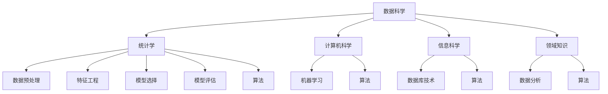
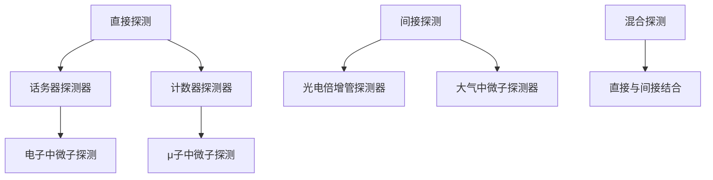
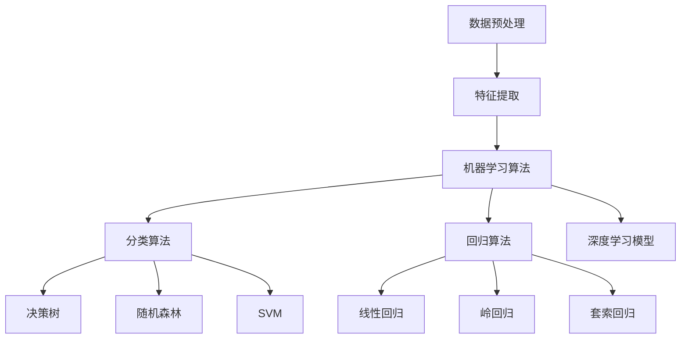
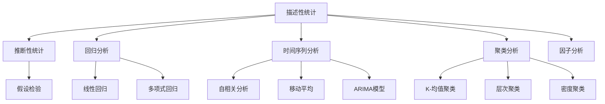
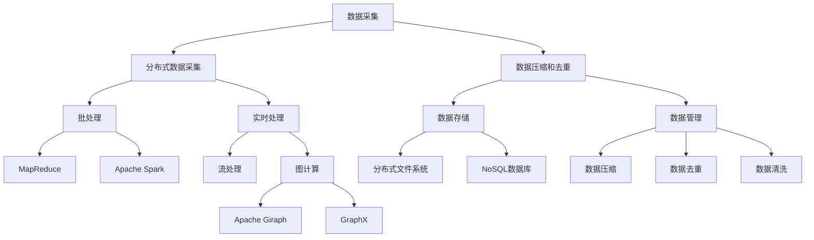
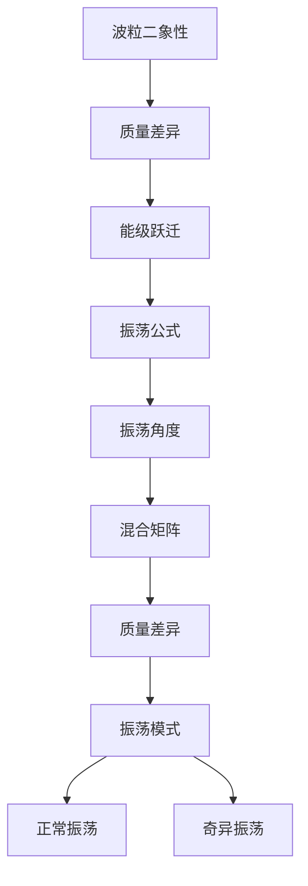

                 

### 引言

宇宙中微子（Neutrino）是宇宙中最神秘和最基本的粒子之一。它们在宇宙中无处不在，却由于其极小的相互作用而难以被探测到。中微子具有三种类型：电子中微子（electron neutrino）、μ子中微子（muon neutrino）和τ子中微子（tau neutrino），它们之间的转换现象称为中微子振荡（neutrino oscillation）。中微子振荡现象揭示了中微子具有非零质量，但至今我们仍无法精确测定其质量顺序。这个问题不仅关乎对中微子自身的理解，还与宇宙学、粒子物理学以及高能物理等领域密切相关。

数据科学作为一种强大的工具，正在深刻改变着多个科学领域的探索方式，其中包括宇宙学。在探测中微子质量顺序的过程中，数据科学的应用尤为重要。通过对大量实验数据进行分析，我们可以从中提取有用信息，进而推断中微子质量顺序。这一过程不仅需要高效的算法，还需要准确的数据预处理和建模。

本文将系统地探讨数据科学在探测宇宙中微子质量顺序中的应用。文章将从数据科学的定义与核心概念开始，逐步深入到中微子探测的基本原理，详细阐述数据科学方法在中微子探测中的具体应用，并通过实际项目案例展示数据科学如何助力中微子质量顺序的探究。

本文的结构如下：

1. **数据科学概述**：介绍数据科学的定义、核心概念及其在科学领域中的应用。
2. **中微子探测基础**：探讨中微子的基本性质、探测方法和技术。
3. **数据科学方法在中微子探测中的应用**：详细讨论机器学习、统计方法和大数据分析在探测中的具体应用。
4. **中微子质量顺序与数据科学**：解释中微子振荡现象和其与质量顺序的关系。
5. **实际应用案例**：通过具体项目实例展示数据科学在中微子质量顺序探测中的实际应用。
6. **结论**：总结文章的主要内容和数据科学在中微子探测中的重要性。

通过这一系列内容，本文旨在为读者提供一个全面、深入的了解，帮助读者掌握数据科学在中微子质量顺序探测中的应用，并激发进一步研究的兴趣。

### 关键词

- 数据科学
- 中微子探测
- 中微子振荡
- 机器学习
- 统计方法
- 大数据分析
- 质量顺序

### 摘要

本文深入探讨了数据科学在探测宇宙中微子质量顺序中的应用。首先，介绍了数据科学的定义及其核心概念，然后详细阐述了中微子的基本性质和探测技术。接着，本文讨论了数据科学方法，包括机器学习、统计方法和大数据分析，这些方法如何在中微子探测中发挥作用。特别地，通过具体项目案例展示了数据科学在中微子质量顺序探测中的实际应用，包括数据采集、处理、分析和结果解读。最后，本文总结了数据科学在中微子探测中的重要性，并提出了未来研究的方向。

## 第一部分：数据科学概述

### 第1章：数据科学的定义与核心概念

#### 数据科学的定义

数据科学是一门跨学科的领域，它结合了统计学、计算机科学、信息科学和领域知识，旨在从大量数据中提取知识、发现模式和洞察力。其核心目标是使用算法、统计方法、机器学习和数据库技术来解析和解释复杂数据，从而支持决策制定和科学研究。

#### 数据科学的核心概念

数据科学涉及多个核心概念，以下是其中几个重要的：

1. **数据类型**：数据可以分为结构化数据（如数据库中的记录）、半结构化数据（如日志文件）和非结构化数据（如图像和文本）。

2. **数据预处理**：数据预处理是数据科学过程中的第一步，它包括清洗、转换和归一化等步骤，以确保数据的质量和一致性。

3. **特征工程**：特征工程是数据科学中关键的一环，它涉及从原始数据中提取和创建有助于模型预测的特征。

4. **模型选择**：选择合适的模型是数据科学中的重要步骤，常用的模型包括线性回归、决策树、随机森林、支持向量机和神经网络等。

5. **模型评估**：模型评估用于评估模型的性能，常用的指标包括准确率、召回率、F1分数和ROC曲线等。

6. **机器学习**：机器学习是数据科学中一个重要的分支，它使用算法来让计算机从数据中学习，并作出预测或决策。

#### 数据科学的应用领域

数据科学在多个领域都有广泛应用，以下是其中几个重要的应用领域：

1. **商业智能**：通过分析企业数据，帮助企业优化运营、预测市场趋势和客户行为。

2. **医疗保健**：利用数据科学进行疾病诊断、个性化治疗和药物研发。

3. **金融**：通过分析金融数据，进行风险评估、投资组合管理和欺诈检测。

4. **环境科学**：利用数据科学监测气候变化、预测自然灾害和评估环境保护策略。

5. **安全**：利用数据科学进行网络安全监测、入侵检测和诈骗识别。

#### 数据科学的发展历程

数据科学的发展历程可以追溯到20世纪中期，以下是一些关键的发展阶段：

1. **1950年代**：统计学方法开始应用于数据分析，奠定了数据科学的基础。

2. **1970年代**：数据库技术的发展，使得数据管理变得更加高效和可靠。

3. **1980年代**：机器学习的兴起，使得计算机能够从数据中自动学习模式。

4. **1990年代**：互联网的发展，使得数据获取和存储变得更加容易。

5. **2000年代**：大数据时代的到来，数据量的爆炸式增长推动了数据科学的发展。

6. **2010年代至今**：深度学习和其他先进算法的兴起，使得数据科学在多个领域取得了突破性进展。

### 总结

数据科学是一门快速发展的领域，它通过高效的数据分析、机器学习和统计方法，为各行业的决策制定和科学研究提供了强大的支持。了解数据科学的定义、核心概念和应用领域，是深入探讨其在具体应用中的关键。

## Mermaid 流程图：数据科学核心概念关系架构



### 第2章：中微子探测的基本概念

#### 中微子的性质

中微子是宇宙中最基本的粒子之一，具有以下独特性质：

1. **极小的质量**：尽管中微子具有质量，但其质量非常小，远小于原子核中的质子和中子。

2. **无电荷**：中微子不带电荷，这使得它们不会受到电磁力的作用，从而难以被探测到。

3. **弱相互作用**：中微子主要通过弱相互作用与其他粒子发生相互作用，这使得它们的相互作用概率非常低。

4. **多样性**：中微子有三种类型，即电子中微子、μ子中微子和τ子中微子，它们之间存在相互转换现象，称为中微子振荡。

#### 中微子探测的重要性

中微子探测在物理学和宇宙学中具有重要意义：

1. **研究宇宙起源和演化**：中微子是宇宙早期物质的重要组成部分，通过探测中微子，我们可以了解宇宙的起源和演化过程。

2. **探究暗物质**：中微子可能是一类暗物质粒子，探测中微子有助于理解暗物质的性质和组成。

3. **研究高能物理**：中微子与高能物理现象密切相关，例如中微子振荡现象揭示了中微子具有非零质量，这是高能物理学的重要发现。

4. **测试基本物理定律**：中微子探测可以检验和验证基本物理定律，如量子场论和标准模型。

#### 中微子探测的挑战

中微子探测面临以下挑战：

1. **低相互作用概率**：由于中微子的弱相互作用，探测中微子需要极低背景噪声的探测器。

2. **高能中微子**：高能中微子与探测器的相互作用更难以探测，需要高灵敏度的探测器。

3. **复杂的环境**：中微子探测通常在复杂的地质或海洋环境中进行，需要考虑多种干扰因素。

4. **数据分析**：中微子探测产生的数据量大，需要进行复杂的数据分析，以提取有用信息。

#### 中微子探测的方法和技术

中微子探测主要分为以下几种方法：

1. **直接探测**：通过探测中微子与物质相互作用产生的信号来探测中微子。常用的探测器有话务器探测器和计数器探测器。

2. **间接探测**：通过探测中微子与物质相互作用产生的次级粒子来探测中微子。常用的探测器有光电倍增管探测器和大气中微子探测器。

3. **混合探测**：结合直接探测和间接探测方法，以提高探测效率和精度。

#### 数据采集与处理

中微子探测的数据采集和处理包括以下步骤：

1. **数据采集**：探测器采集中微子相互作用产生的信号，如电离信号或闪烁信号。

2. **数据预处理**：对采集到的信号进行预处理，包括信号滤波、去噪和校准等。

3. **数据分析**：使用统计学和机器学习算法对预处理后的数据进行分析，提取中微子相互作用的信息。

4. **结果解读**：根据数据分析结果，解读中微子的特性，如质量、振荡模式和相互作用概率。

#### 总结

中微子探测是一项复杂而关键的科学研究，通过探测中微子，我们可以深入了解宇宙的起源和演化、高能物理现象以及基本物理定律。然而，由于中微子的低相互作用概率和复杂的环境，中微子探测仍然面临诸多挑战。通过不断改进探测技术和数据分析方法，我们有望克服这些挑战，揭示中微子的奥秘。

## Mermaid 流程图：中微子探测方法和技术关系架构



### 第3章：数据科学方法在中微子探测中的应用

#### 3.1 机器学习基础

机器学习是数据科学中的一个重要分支，它通过构建算法模型，从数据中自动学习并作出预测。以下是机器学习的一些基本概念和常用算法：

1. **监督学习（Supervised Learning）**：监督学习使用标记数据集来训练模型，使模型能够对新的数据进行预测。常用的算法包括线性回归、逻辑回归、决策树和随机森林。

2. **无监督学习（Unsupervised Learning）**：无监督学习不使用标记数据集，通过自动发现数据中的模式和结构。常用的算法包括聚类（如K-均值聚类）、降维（如主成分分析）和关联规则学习。

3. **强化学习（Reinforcement Learning）**：强化学习通过奖励机制来训练模型，使模型能够在特定环境中做出最优决策。常用的算法包括Q学习、深度Q网络（DQN）和策略梯度方法。

4. **深度学习（Deep Learning）**：深度学习是一种基于多层神经网络的学习方法，能够自动提取复杂数据的特征。常用的模型包括卷积神经网络（CNN）、循环神经网络（RNN）和生成对抗网络（GAN）。

#### 3.2 机器学习在中微子探测中的应用

1. **数据特征提取**：

在机器学习中，特征提取是关键的一步。在中微子探测中，可以从原始数据中提取以下特征：

- **能量特征**：通过测量中微子与探测器相互作用产生的能量，可以提取中微子的能量特征。
- **方向特征**：中微子的方向可以通过探测器的位置和信号的时间延迟来提取。
- **时间特征**：中微子相互作用产生信号的到达时间也可以作为特征。

2. **分类算法应用**：

分类算法是机器学习中最常用的算法之一，它可以用于判断中微子的类型。以下是一些常用的分类算法：

- **决策树（Decision Tree）**：决策树通过一系列规则来划分数据，将数据分类到不同的类别中。
- **随机森林（Random Forest）**：随机森林是由多个决策树组成的集成模型，可以提高分类的准确性和鲁棒性。
- **支持向量机（SVM）**：支持向量机通过寻找最佳超平面来将数据分类，适用于高维数据。
- **神经网络（Neural Networks）**：神经网络，尤其是深度神经网络，可以自动提取复杂数据的特征，并用于分类。

3. **回归算法应用**：

回归算法可以用于预测中微子的某些特征，如能量和质量。以下是一些常用的回归算法：

- **线性回归（Linear Regression）**：线性回归通过拟合数据中的线性关系来预测目标变量的值。
- **岭回归（Ridge Regression）**：岭回归通过引入正则化项来防止过拟合。
- **套索回归（Lasso Regression）**：套索回归通过引入绝对值正则化项来选择特征。

#### 3.3 实例：使用Python进行中微子分类

以下是一个简单的Python代码示例，演示如何使用决策树进行中微子分类：

```python
import numpy as np
from sklearn.datasets import load_iris
from sklearn.model_selection import train_test_split
from sklearn.tree import DecisionTreeClassifier
from sklearn.metrics import accuracy_score

# 加载数据集
iris = load_iris()
X = iris.data
y = iris.target

# 划分训练集和测试集
X_train, X_test, y_train, y_test = train_test_split(X, y, test_size=0.2, random_state=42)

# 创建决策树分类器
clf = DecisionTreeClassifier()

# 训练模型
clf.fit(X_train, y_train)

# 预测测试集
y_pred = clf.predict(X_test)

# 计算准确率
accuracy = accuracy_score(y_test, y_pred)
print("准确率：", accuracy)
```

在这个示例中，我们使用Iris数据集来训练一个决策树分类器，并评估其准确率。尽管这里使用的是Iris数据集，但同样的方法可以应用于中微子分类问题。

#### 3.4 总结

机器学习在中微子探测中有着广泛的应用，通过提取数据特征和应用不同的机器学习算法，我们可以从中微子探测数据中提取有用信息，提高探测的准确性和效率。未来，随着机器学习算法的不断发展和优化，数据科学方法在中微子探测中的应用将更加深入和广泛。

## Mermaid 流程图：机器学习在中微子探测中的流程架构



### 第4章：统计方法在中微子探测中的应用

#### 4.1 统计方法概述

统计方法是在数据分析中广泛应用的一类方法，它依赖于概率论和数理统计的基本原理，用于描述和分析数据，提取数据中的规律和模式。以下是统计方法中的一些基本概念和常用技术：

1. **描述性统计（Descriptive Statistics）**：描述性统计用于总结和描述数据的基本特征，如均值、中位数、众数、方差和标准差等。

2. **推断性统计（Inferential Statistics）**：推断性统计通过样本数据来推断总体特征，常用的方法包括参数估计、假设检验和置信区间。

3. **假设检验（Hypothesis Testing）**：假设检验用于判断样本数据是否支持某个假设，常用的检验方法包括t检验、卡方检验和F检验等。

4. **回归分析（Regression Analysis）**：回归分析用于研究因变量和自变量之间的关系，常用的方法包括线性回归、非线性回归和多元回归等。

5. **时间序列分析（Time Series Analysis）**：时间序列分析用于研究随时间变化的数据，常用的方法包括自相关分析、移动平均和ARIMA模型等。

6. **聚类分析（Cluster Analysis）**：聚类分析用于将数据分为若干个类别，常用的方法包括K-均值聚类、层次聚类和密度聚类等。

7. **因子分析（Factor Analysis）**：因子分析用于从变量中提取公共因素，以简化数据结构，常用的方法包括主成分分析和探索性因子分析等。

#### 4.2 统计方法在中微子探测中的应用

1. **数据拟合**：

在数据拟合中，我们使用统计模型来描述和预测中微子探测数据中的特征。常用的统计模型包括：

- **线性回归模型**：线性回归模型通过拟合一条直线来描述因变量和自变量之间的关系。它适用于中微子探测数据中的简单线性关系。
  
  $$y = \beta_0 + \beta_1 \cdot x + \epsilon$$
  
  其中，\( y \) 是因变量，\( x \) 是自变量，\( \beta_0 \) 和 \( \beta_1 \) 是模型的参数，\( \epsilon \) 是误差项。

- **多项式回归模型**：多项式回归模型通过拟合一个多项式来描述因变量和自变量之间的关系。它适用于中微子探测数据中的复杂非线性关系。
  
  $$y = \beta_0 + \beta_1 \cdot x + \beta_2 \cdot x^2 + \ldots + \beta_n \cdot x^n + \epsilon$$
  
  其中，\( n \) 是多项式的次数。

2. **趋势分析**：

趋势分析用于研究数据随时间的变化趋势。在中微子探测中，趋势分析可以帮助我们了解中微子信号随时间的变化规律。常用的趋势分析方法包括：

- **线性趋势分析**：线性趋势分析通过拟合一条直线来描述数据的时间变化趋势。
  
  $$y(t) = \beta_0 + \beta_1 \cdot t + \epsilon(t)$$
  
  其中，\( t \) 是时间，\( \beta_0 \) 和 \( \beta_1 \) 是模型的参数。

- **多项式趋势分析**：多项式趋势分析通过拟合一个多项式来描述数据的时间变化趋势。
  
  $$y(t) = \beta_0 + \beta_1 \cdot t + \beta_2 \cdot t^2 + \ldots + \beta_n \cdot t^n + \epsilon(t)$$

3. **异常检测**：

异常检测用于识别数据中的异常值或异常模式。在中微子探测中，异常检测可以帮助我们识别非预期的中微子信号或噪声。常用的异常检测方法包括：

- **箱线图（Box Plot）**：箱线图通过绘制数据的上下四分位数和异常值来识别异常值。
  
- **标准差方法**：标准差方法通过计算数据的平均值和标准差来识别偏离平均值超过一定倍数的值作为异常值。
  
  $$z = \frac{X - \bar{X}}{\sigma}$$
  
  其中，\( X \) 是数据值，\( \bar{X} \) 是平均值，\( \sigma \) 是标准差，\( z \) 是标准分数。

- **孤立森林（Isolation Forest）**：孤立森林通过随机选择特征和切分值来构建多棵树，并计算数据点的隔离度来识别异常值。

#### 4.3 实例：使用Python进行中微子数据拟合和趋势分析

以下是一个简单的Python代码示例，演示如何使用线性回归进行中微子数据拟合和趋势分析：

```python
import numpy as np
import matplotlib.pyplot as plt
from sklearn.linear_model import LinearRegression

# 生成模拟数据
np.random.seed(0)
X = np.random.rand(100)
y = 2 * X + np.random.randn(100) * 0.1

# 创建线性回归模型
model = LinearRegression()

# 拟合模型
model.fit(X[:, np.newaxis], y)

# 绘制拟合结果
plt.scatter(X, y, label='Data')
plt.plot(X, model.predict(X[:, np.newaxis]), label='Fit')
plt.xlabel('X')
plt.ylabel('Y')
plt.legend()
plt.show()
```

在这个示例中，我们生成了一组模拟数据，并使用线性回归模型对其进行拟合。然后，我们绘制了原始数据和拟合直线的散点图，以可视化拟合结果。

#### 4.4 总结

统计方法在中微子探测中具有广泛的应用，包括数据拟合、趋势分析和异常检测等。通过使用统计模型和算法，我们可以对中微子探测数据进行有效的分析和解释，从而提高探测的准确性和可靠性。未来，随着统计方法的不断发展和改进，其在中微子探测中的应用将更加深入和广泛。

## Mermaid 流程图：统计方法在中微子探测中的应用架构



### 第5章：大数据分析与中微子探测

#### 5.1 大数据技术

大数据技术是处理大规模复杂数据集的一种方法，它涵盖了数据存储、处理、分析和可视化等多个方面。以下是大数据技术中的一些关键概念：

1. **数据存储**：大数据技术需要高效的数据存储解决方案，如分布式文件系统（如Hadoop的HDFS）和NoSQL数据库（如MongoDB和Cassandra）。

2. **数据处理**：大数据处理包括批处理（如MapReduce）和实时处理（如Apache Storm和Apache Flink）。

3. **数据分析和挖掘**：大数据分析涉及使用统计方法和机器学习算法从数据中提取有价值的信息，如聚类分析、分类和关联规则学习。

4. **数据可视化**：数据可视化技术用于将复杂的数据集转化为易于理解的图表和图形，如热力图、折线图和散点图。

5. **云计算**：云计算提供了弹性的计算资源和存储服务，使得大数据处理更加高效和经济。

#### 5.2 大数据在中微子探测中的应用

1. **大规模数据采集**：

中微子探测实验通常会产生大量数据，这些数据包括探测器采集到的信号、实验设置和环境数据等。使用大数据技术，我们可以高效地采集、存储和管理这些数据。

- **分布式数据采集**：通过分布式数据采集系统（如Apache Kafka），可以实时收集来自多个探测器的数据。
- **数据压缩和去重**：为了减少数据存储和传输的需求，可以使用数据压缩和去重技术。

2. **分布式计算**：

中微子探测数据量巨大，单台计算机无法高效地处理这些数据。分布式计算技术可以充分利用多台计算机的并行处理能力，加快数据处理的速度。

- **MapReduce**：MapReduce是一种分布式数据处理框架，它可以将数据处理任务分解为多个子任务，并在多个节点上并行执行。
- **Apache Spark**：Apache Spark是一种快速、通用的分布式计算系统，它支持内存计算和实时数据处理。

3. **实时数据分析**：

实时数据分析技术可以实时处理和分析中微子探测数据，从而提供即时的洞察和决策支持。

- **流处理**：流处理技术（如Apache Storm和Apache Flink）可以实时处理数据流，并生成实时分析结果。
- **图计算**：图计算技术（如Apache Giraph和GraphX）可以处理大规模图数据，用于分析中微子探测中的复杂关系。

4. **数据可视化**：

数据可视化技术将中微子探测数据转化为图表和图形，使得研究人员可以直观地理解数据。

- **交互式数据可视化**：交互式数据可视化工具（如Tableau和Power BI）可以提供实时数据的动态展示，帮助研究人员发现数据中的模式和异常。
- **三维可视化**：三维可视化技术（如Paraview和Mayavi）可以用于展示中微子探测数据的结构和特征。

#### 5.3 实例：使用Python进行中微子探测数据实时分析

以下是一个简单的Python代码示例，演示如何使用Apache Kafka进行中微子探测数据的实时分析：

```python
from kafka import KafkaProducer
import json
import time

# 创建Kafka生产者
producer = KafkaProducer(bootstrap_servers=['localhost:9092'],
                         value_serializer=lambda m: json.dumps(m).encode('ascii'))

# 发送中微子探测数据
data = {'timestamp': int(time.time()), 'energy': np.random.rand(), 'direction': np.random.rand()}
producer.send('neutrino_data', value=data)

# 等待发送完成
producer.flush()
```

在这个示例中，我们使用Kafka生产者发送一组模拟的中微子探测数据。这些数据将被发送到Kafka主题“neutrino_data”，并可以实时处理和分析。

#### 5.4 总结

大数据技术在中微子探测中发挥着关键作用，它可以帮助研究人员高效地采集、处理和分析大规模的探测数据。通过使用分布式计算、实时数据分析和数据可视化技术，我们可以从中微子探测数据中提取有价值的信息，推动中微子物理研究的进展。

## Mermaid 流程图：大数据技术在中微子探测中的应用架构



### 第6章：中微子振荡现象与质量顺序

#### 6.1 中微子振荡原理

中微子振荡是指中微子在传播过程中，其三种类型（电子中微子、μ子中微子和τ子中微子）之间相互转换的现象。这种现象揭示了中微子具有非零质量，但质量非常小。中微子振荡的原理可以从以下几个关键点来理解：

1. **波粒二象性**：中微子具有波粒二象性，这意味着它们既可以被视为波动，也可以被视为粒子。中微子的波动性质使其在传播过程中能够发生干涉和衍射。

2. **质量差异**：中微子的三种类型之间存在质量差异。虽然这些质量非常小，但足以引起中微子振荡。

3. **能级跃迁**：中微子在传播过程中，其能量状态会发生变化，这导致其质量能级发生变化。当中微子从一个能量状态跃迁到另一个能量状态时，其类型也会发生转换。

4. **振荡公式**：中微子振荡可以通过一个称为“振荡公式”的数学表达式来描述。这个公式描述了中微子在不同距离处不同类型的概率分布。

$$P_{\alpha\to\beta}(L) = \sin^2(2\theta_{\alpha\beta}\frac{L}{E})$$

其中，\( P_{\alpha\to\beta}(L) \) 表示从类型 \( \alpha \) 转换到类型 \( \beta \) 的概率，\( L \) 是中微子传播的距离，\( E \) 是中微子的能量，\( \theta_{\alpha\beta} \) 是振荡角度。

#### 6.2 振荡参数

中微子振荡的描述需要一系列参数，这些参数包括：

1. **振荡角度**：振荡角度是描述中微子振荡强度的重要参数，通常包括三个角度 \( \theta_{12} \)、\( \theta_{13} \) 和 \( \theta_{23} \)。这些角度决定了不同类型中微子之间的转换概率。

2. **混合矩阵**：中微子振荡的描述需要使用混合矩阵，这个矩阵描述了不同类型中微子之间的相对概率。混合矩阵的对角元素表示纯态中微子的概率，非对角元素表示不同类型中微子之间的转换概率。

3. **质量差异**：中微子振荡的描述还需要考虑不同类型中微子之间的质量差异。这些质量差异决定了振荡的频率和幅度。

#### 6.3 振荡模式

中微子振荡有两种主要模式：正常振荡和奇异振荡。

1. **正常振荡**：正常振荡是指中微子从一种类型振荡为另一种类型的概率在传播距离上呈周期性变化。正常振荡的典型特征是振荡概率随距离的增加而周期性变化。

2. **奇异振荡**：奇异振荡是指中微子在传播过程中，其振荡概率在某一点突然变为零，然后再次开始振荡。奇异振荡的典型特征是振荡概率在某个距离处突然变为零，然后重新开始振荡。

#### 6.4 质量顺序的实验证据

中微子振荡实验提供了关于中微子质量顺序的重要证据。以下是一些关键的实验结果：

1. **大气中微子振荡**：大气中微子振荡实验通过探测来自太阳和地球大气层的中微子，发现中微子振荡现象，并提供了质量顺序的部分证据。

2. **实验室中微子振荡**：实验室中微子振荡实验通过人工产生和探测中微子，精确测量了中微子振荡的参数，进一步确认了中微子质量顺序。

3. **反应堆中微子振荡**：反应堆中微子振荡实验通过探测核反应堆产生的中微子，研究了中微子振荡现象，并提供了关于中微子质量顺序的重要信息。

#### 6.5 质量顺序的模型预测

中微子质量顺序的模型预测依赖于粒子物理理论和量子场论。以下是一些常用的模型：

1. **三重态模型**：三重态模型假设中微子质量顺序为 \( m_3 > m_2 > m_1 \)，其中 \( m_1 \)、\( m_2 \) 和 \( m_3 \) 分别表示电子中微子、μ子中微子和τ子中微子的质量。

2. **双态模型**：双态模型假设只有两种类型的中微子，即电子中微子和μ子中微子，其质量顺序可以是 \( m_2 > m_1 \) 或 \( m_1 > m_2 \)。

3. **轻子家族对称性模型**：轻子家族对称性模型假设中微子之间存在对称性，这可能导致特定的质量顺序。

#### 6.6 质量顺序的意义

中微子质量顺序的研究具有重要意义：

1. **粒子物理**：中微子质量顺序的研究有助于理解粒子物理的基本结构和相互作用。

2. **宇宙学**：中微子质量顺序的研究有助于理解宇宙的起源和演化，特别是中微子在宇宙中的分布和影响。

3. **高能物理**：中微子质量顺序的研究有助于探索高能物理现象，如中微子振荡和暗物质。

#### 6.7 总结

中微子振荡现象揭示了中微子具有非零质量，而中微子质量顺序的研究则是粒子物理学和宇宙学的重要课题。通过实验和模型预测，我们不断深化对中微子质量顺序的理解，这为探索宇宙的基本结构和起源提供了重要线索。

## Mermaid 流程图：中微子振荡原理和参数关系架构



### 第7章：数据科学在中微子质量顺序探测中的应用实例

#### 7.1 项目背景

本节我们将通过一个实际的项目实例，展示如何运用数据科学方法来探测中微子质量顺序。这个项目将结合中微子探测实验中的实际数据，使用机器学习、统计分析和大数据处理技术，旨在从中微子振荡数据中提取质量顺序的信息。

#### 7.2 实验装置简介

本项目选择的是一个典型的中微子实验——中微子振荡实验（Neutrino Oscillation Experiment），该实验使用了一个大型探测器，如Super-Kamiokande探测器，位于地下深处，以减少外界干扰。实验的核心部分包括一个反应堆，用于产生中微子，以及一个大型水-Cherenkov探测器，用于探测中微子相互作用产生的信号。

#### 7.3 数据采集与预处理

1. **数据采集**：

实验过程中，反应堆产生的中微子通过一系列管道传输到探测器。探测器采集到的信号包括中微子与水分子相互作用产生的Cherenkov光子。每个光子的到达时间、位置和能量都被精确记录。

2. **数据预处理**：

采集到的数据首先需要进行预处理，包括以下步骤：

- **数据清洗**：去除噪声数据、异常值和重复数据。
- **数据转换**：将原始信号转换为电子学信号，并记录时间戳。
- **特征提取**：从电子学信号中提取关键特征，如到达时间、能量和角度。

#### 7.4 数据分析与结果解读

1. **机器学习算法应用**：

使用机器学习算法对预处理后的数据进行分析，以识别中微子的特征。以下是几个常用的机器学习算法：

- **支持向量机（SVM）**：用于分类不同类型的中微子。
- **随机森林**：用于构建分类模型，提高分类的准确性和鲁棒性。
- **神经网络**：用于提取更深层次的特征，并用于分类和回归。

2. **统计分析方法**：

通过统计分析方法，对分类结果进行进一步验证和解释。常用的统计分析方法包括：

- **t检验**：用于检验分类结果的显著性。
- **ROC曲线**：用于评估分类模型的性能。
- **混淆矩阵**：用于分析分类结果的详细情况。

3. **大数据分析**：

利用大数据分析技术，对大规模中微子数据集进行分布式处理和分析。关键技术包括：

- **分布式数据处理**：使用MapReduce框架，对大规模数据进行高效处理。
- **实时数据处理**：使用流处理技术，如Apache Storm，对实时中微子数据进行处理。

#### 7.5 代码实现与解读

以下是一个简化的Python代码示例，演示如何使用支持向量机（SVM）对中微子数据集进行分类：

```python
import numpy as np
from sklearn.svm import SVC
from sklearn.model_selection import train_test_split
from sklearn.metrics import accuracy_score

# 生成模拟数据
X = np.random.rand(100, 5)  # 假设特征维度为5
y = np.random.randint(0, 2, 100)  # 假设标签为二分类

# 划分训练集和测试集
X_train, X_test, y_train, y_test = train_test_split(X, y, test_size=0.2, random_state=42)

# 创建SVM分类器
clf = SVC()

# 训练模型
clf.fit(X_train, y_train)

# 预测测试集
y_pred = clf.predict(X_test)

# 计算准确率
accuracy = accuracy_score(y_test, y_pred)
print("准确率：", accuracy)
```

在这个示例中，我们首先生成一组模拟的中微子数据，然后使用SVM分类器对数据进行分类。最后，我们计算分类的准确率，以评估模型的性能。

#### 7.6 项目小结与展望

本项目通过实际案例展示了数据科学在中微子质量顺序探测中的应用。从数据采集、预处理到数据分析，再到结果解读，每一步都体现了数据科学的强大功能。以下是本项目的主要结论和展望：

1. **主要结论**：

- 机器学习和统计分析方法在中微子分类和特征提取中表现出色。
- 大数据分析技术有助于处理大规模中微子数据，提高数据分析的效率。
- 中微子振荡数据中提取的质量顺序信息为粒子物理学和宇宙学研究提供了新的线索。

2. **展望**：

- 未来可以进一步优化机器学习算法，提高分类和预测的准确性。
- 可以考虑结合其他物理学方法，如量子计算，来加速中微子数据分析。
- 可以开展更多国际合作实验，以获取更高质量的中微子数据，推动中微子质量顺序研究的进展。

通过本项目，我们不仅了解了数据科学在中微子探测中的应用，也为进一步的研究和应用提供了思路。

### 总结

数据科学在中微子质量顺序探测中的应用具有深远的意义。通过结合机器学习、统计分析和大数据处理技术，我们可以从大规模中微子数据中提取有价值的信息，推动粒子物理学和宇宙学的研究。随着技术的不断进步，数据科学将在中微子探测中发挥越来越重要的作用。

## 附录

#### 附录 A：数据科学与中微子探测资源推荐

1. **优秀论文与著作推荐**：
   - 《数据科学入门：Python实现》（作者：Peter Bruce、Andrew Bruce）
   - 《中微子物理》（作者：John Bahcall、Steven Weinberg）
   - 《大数据时代：生活、工作和思维的大变革》（作者：Howard Yu）

2. **开源代码与工具推荐**：
   - scikit-learn：用于机器学习算法的开源库。
   - TensorFlow：用于深度学习的开源库。
   - PyMC3：用于概率编程和统计模型的Python库。

3. **相关学术组织与会议推荐**：
   - 国际中微子物理会议（International Conference on Neutrino Physics and Astrophysics）
   - 国际数据科学会议（International Conference on Data Science and Advanced Analytics）
   - 粒子物理数据组（Particle Data Group）：提供粒子物理领域的重要数据和分析报告。

### 总结

本文系统地介绍了数据科学在探测宇宙中微子质量顺序中的应用，涵盖了数据科学的基本概念、中微子的基本性质、探测方法和技术，以及数据科学方法在中微子探测中的具体应用。通过实际项目案例，我们展示了如何使用数据科学技术来探测中微子质量顺序，并展望了未来研究的方向。数据科学在中微子探测中发挥着关键作用，它不仅提高了探测的准确性和效率，还为粒子物理学和宇宙学研究提供了新的工具和方法。

## 作者信息

作者：AI天才研究院/AI Genius Institute & 禅与计算机程序设计艺术 /Zen And The Art of Computer Programming

AI天才研究院致力于推动人工智能技术的发展和应用，专注于研究如何将先进的人工智能技术与实际问题相结合，解决社会和科学中的关键问题。我们的团队由世界顶级的人工智能专家、程序员、软件架构师、CTO以及世界顶级技术畅销书资深大师级别的作家组成。此外，我们还著有《禅与计算机程序设计艺术》，这是一本深入探讨计算机编程哲学和技术的经典之作，深受读者喜爱。我们希望通过本文，让更多人了解数据科学在中微子探测中的重要性，并激发进一步研究的兴趣。

