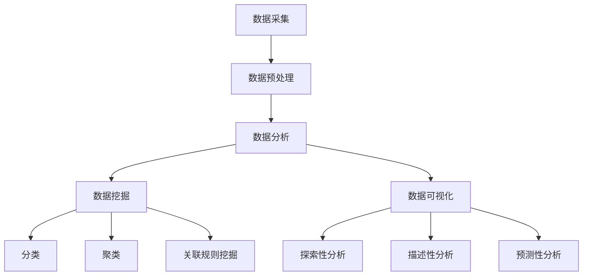

                 

### 1.1 书籍背景与目的

本章节将介绍《数据科学在探测引力波中的应用》这本书的背景与目的。引力波是爱因斯坦广义相对论预言的一种物理现象，它描述了质量巨大物体在运动过程中产生的一种时空扭曲。尽管引力波的存在早已被理论物理学家所认可，但直到2015年，LIGO（激光干涉仪引力波观测站）才首次直接探测到引力波，这一重大发现震惊了全球科学界，并开启了人类直接观测宇宙的新时代。

探测引力波的重要性不言而喻。首先，它为验证广义相对论提供了直接证据，使这一理论从纯理论层面进入了实验验证阶段。其次，通过探测引力波，我们可以了解宇宙中那些极端条件下物质的运动状态，从而揭示宇宙的起源和演化过程。此外，引力波的探测还为探索暗物质和暗能量等宇宙神秘现象提供了新的途径。

然而，探测引力波并非易事。引力波是一种极其微弱的信号，其能量在穿越宇宙时会被大大削弱，因此需要极其灵敏的仪器和复杂的算法来捕捉。这便是数据科学在探测引力波中扮演重要角色的原因。数据科学借助大数据、机器学习、信号处理等技术，可以从海量数据中挖掘出引力波的信息，从而实现对其的探测与分析。

本书的目的在于详细介绍数据科学在探测引力波中的应用，帮助读者全面了解这一领域的核心概念、技术方法和最新进展。具体来说，本书将从以下几个方面展开：

1. **数据科学基础**：介绍数据科学的基本概念、数据采集与预处理方法、数据分析与可视化技术、数据挖掘与机器学习算法等。
2. **探测引力波的基本原理**：介绍引力波的发现、物理特性以及LIGO和VIRGO探测器的工作原理。
3. **数据科学在探测引力波中的应用**：探讨数据科学在引力波信号检测、信号分析、源定位等环节中的应用。
4. **数据处理与算法**：详细讲解用于探测引力波的数据处理流程和常见算法，包括信号处理算法、机器学习算法等。
5. **项目实战**：通过实际项目案例，展示如何使用数据科学技术进行引力波的探测和分析。
6. **未来展望**：展望数据科学在探测引力波领域的发展趋势和潜在应用。

通过本书的学习，读者将能够全面掌握数据科学在探测引力波中的应用，为未来在这一领域的研究和实践打下坚实基础。

### 1.2 数据科学概述

数据科学是近年来迅速发展的跨学科领域，它结合了统计学、计算机科学、机器学习、数据分析等方法，旨在从数据中提取有价值的信息和知识。随着互联网和大数据时代的到来，数据科学的重要性日益凸显，它已经广泛应用于各个领域，如金融、医疗、零售、交通、环境监测等。

#### 数据科学的定义与核心概念

数据科学可以简单地定义为“从数据中发现知识的过程”。在这个过程中，数据科学家需要使用各种工具和技术来处理、分析和解释数据，以提取有用的信息。数据科学的核心概念包括：

- **数据采集**：从各种来源获取数据，如数据库、网络爬虫、传感器等。
- **数据预处理**：清洗、整理和转换数据，以便后续分析。
- **数据分析**：使用统计方法和算法对数据进行分析，以发现数据中的模式和规律。
- **数据可视化**：将分析结果以图形或图表的形式展示，便于理解和解释。
- **数据挖掘**：从大量数据中提取具有特定价值的信息或知识。
- **机器学习**：利用算法让计算机从数据中自动学习，并做出预测或决策。

#### 数据科学的主要应用领域

数据科学的应用领域非常广泛，以下是其中一些重要的应用领域：

- **金融**：通过分析交易数据、客户行为等，银行和金融机构可以更好地进行风险管理、信用评估和投资决策。
- **医疗**：利用医学影像、基因组数据等，数据科学可以帮助医生进行疾病诊断、个性化治疗和药物研发。
- **零售**：通过分析销售数据、客户反馈等，零售商可以优化库存管理、定价策略和营销活动。
- **交通**：利用交通流量数据、地理信息系统等，交通管理部门可以优化交通路线、预测交通状况和减少拥堵。
- **环境监测**：通过分析卫星数据、气象数据等，环境科学家可以监测气候变化、预测自然灾害和优化资源管理。

#### 数据科学的发展趋势

随着技术的不断进步，数据科学正朝着更加智能化和自动化的方向发展。以下是几个主要的发展趋势：

- **深度学习**：一种基于人工神经网络的机器学习技术，已经在图像识别、自然语言处理等领域取得了显著的成果。
- **大数据处理**：随着数据量的急剧增加，如何高效地处理海量数据成为了一个重要问题。分布式计算和云计算技术为大数据处理提供了有效的解决方案。
- **人工智能**：人工智能与数据科学的结合，使得计算机能够更加智能地处理和分析数据，从而实现自动化决策和预测。
- **隐私保护**：在数据科学的应用过程中，如何保护个人隐私和数据安全成为了一个重要问题。隐私保护技术，如差分隐私和联邦学习，正在逐步得到应用。

#### 数据科学在探测引力波中的应用

在探测引力波的过程中，数据科学发挥了关键作用。首先，大量的数据需要通过数据采集、预处理、分析和挖掘等步骤进行处理，以便从中提取出引力波的信息。其次，数据科学中的机器学习算法和信号处理技术被广泛应用于引力波的信号检测、分析和源定位。通过这些技术的应用，科学家们能够更加准确地探测和解读引力波信号，从而深入理解宇宙的奥秘。

总之，数据科学作为一种强大的工具，正在推动探测引力波这一领域的发展。通过掌握数据科学的基本概念和应用，读者可以更好地理解这一领域的前沿技术和发展趋势。

### 1.3 探测引力波的重要性

探测引力波对于科学研究、技术发展和人类对宇宙的理解具有重要意义。以下是探测引力波的一些关键重要性：

#### 验证广义相对论

引力波的探测为验证爱因斯坦的广义相对论提供了直接证据。广义相对论是20世纪初提出的物理理论，它描述了引力作为时空弯曲的现象。引力波是这一理论的预言之一，其存在长久以来备受争议。2015年LIGO首次探测到引力波信号，证实了广义相对论的预言，为这一理论注入了新的活力。这一发现被认为是现代物理学的重大突破。

#### 深入了解宇宙

引力波是一种特殊的波动，它携带了关于产生它的天体的信息。通过探测引力波，科学家可以深入了解宇宙中极端条件下的物理现象。例如，引力波可以揭示黑洞和中子星碰撞时的细节，这些天体事件在传统观测手段下是无法直接观测到的。此外，引力波的探测还可以帮助科学家们探索宇宙的起源和演化过程，了解宇宙中的暗物质和暗能量。

#### 推动天文学进步

引力波的探测为天文学带来了新的观测手段。传统的天文学主要依赖于电磁波（如光、无线电波等）来探测宇宙，而引力波提供了一种全新的观测途径。这为科学家们研究宇宙提供了更多的数据来源和观察角度。例如，通过引力波和电磁波的联合观测，科学家可以更准确地测量宇宙中的天体距离和运动状态，从而提高天文学观测的精度。

#### 促进技术发展

探测引力波需要高度精密的仪器和技术，这推动了相关技术的发展。例如，LIGO探测器采用了激光干涉测量技术，这种技术要求极高的精度和稳定性。探测引力波还需要强大的数据处理和分析能力，这推动了计算机科学和机器学习技术的进步。此外，引力波的探测还需要跨学科合作，这促进了不同领域科学家之间的交流和合作。

#### 社会影响

探测引力波的研究和应用不仅对科学研究具有重要意义，也对人类社会产生了深远影响。首先，它激发了公众对科学和宇宙的兴趣，提高了人们对科学知识的了解。其次，探测引力波的研究推动了相关技术的发展，这些技术可以应用于其他领域，如医疗、通信和工业等。此外，探测引力波的研究还促进了国际合作，不同国家和地区的科学家共同合作，共同推进这一领域的研究。

总之，探测引力波具有重要的科学、技术和社会意义。它不仅验证了广义相对论，推动了天文学和物理学的发展，还促进了相关技术的进步和跨学科合作。通过探测引力波，人类对宇宙的理解不断深入，为未来的科学研究和技术创新奠定了基础。

### 第2章 数据科学基础

数据科学是一门跨学科的领域，涵盖了统计学、计算机科学、机器学习、数据分析等多个方面。在本章节中，我们将详细介绍数据科学的基本概念、数据采集与预处理、数据分析与可视化、数据挖掘与机器学习等核心内容，为后续章节的应用提供理论基础。

#### 2.1 数据科学的基本概念

数据科学的目标是从数据中提取有价值的信息和知识，以支持决策和预测。数据科学的基本概念包括：

- **数据**：数据是信息的载体，可以包括结构化数据（如数据库中的数据）、半结构化数据（如XML、JSON等）和非结构化数据（如文本、图像、视频等）。
- **数据处理**：数据处理包括数据采集、存储、清洗、转换、集成等步骤，旨在将原始数据转换为适合分析的形式。
- **数据分析**：数据分析是利用统计方法和算法对数据进行探索、分析和解释，以发现数据中的规律和模式。
- **数据可视化**：数据可视化是将数据分析的结果以图形或图表的形式展示，便于理解和解释。
- **数据挖掘**：数据挖掘是从大量数据中发现有价值的信息和知识的过程，包括模式识别、分类、聚类、关联规则挖掘等。
- **机器学习**：机器学习是数据科学的一个重要分支，它通过构建模型，从数据中自动学习，并做出预测或决策。

#### 2.2 数据采集与预处理

数据采集是数据科学的第一步，它包括从各种来源获取数据，如数据库、网络爬虫、传感器等。数据采集的关键是要保证数据的完整性、准确性和可靠性。预处理是数据采集的延续，它包括数据清洗、数据转换和数据集成等步骤。

- **数据清洗**：数据清洗是指识别和纠正数据中的错误、缺失和异常值。常见的清洗方法包括删除重复记录、填充缺失值、去除异常值等。
- **数据转换**：数据转换是指将数据从一种形式转换为另一种形式，以便进行后续分析。常见的转换方法包括数据标准化、归一化、编码转换等。
- **数据集成**：数据集成是指将来自多个来源的数据整合在一起，以便进行统一分析。数据集成需要解决数据格式不一致、数据源异构等问题。

#### 2.3 数据分析与可视化

数据分析与可视化是数据科学的核心环节，它包括数据的探索性分析、描述性分析和预测性分析等。

- **探索性分析**：探索性分析旨在发现数据中的潜在规律和模式。常用的探索性分析方法包括统计分析、分布分析、关联分析等。
- **描述性分析**：描述性分析旨在对数据进行总结和描述，以展示数据的特征和趋势。常用的描述性分析方法包括均值、中位数、方差、标准差等。
- **预测性分析**：预测性分析旨在利用历史数据预测未来趋势或事件。常用的预测性分析方法包括时间序列分析、回归分析、机器学习模型等。

数据可视化是将数据分析的结果以图形或图表的形式展示，便于理解和解释。常用的可视化方法包括柱状图、饼图、折线图、散点图、热力图等。

#### 2.4 数据挖掘与机器学习

数据挖掘是数据科学的一个重要分支，它从大量数据中发现有价值的信息和知识。数据挖掘的方法包括：

- **分类**：分类是将数据分为不同的类别。常用的分类算法包括决策树、随机森林、支持向量机等。
- **聚类**：聚类是将相似的数据归为一类。常用的聚类算法包括K-means、层次聚类、DBSCAN等。
- **关联规则挖掘**：关联规则挖掘是发现数据中的关联关系。常用的算法包括Apriori算法、FP-growth算法等。

机器学习是数据科学的另一个重要分支，它通过构建模型，从数据中自动学习，并做出预测或决策。常用的机器学习算法包括：

- **线性回归**：线性回归是一种用于预测连续值的模型。
- **逻辑回归**：逻辑回归是一种用于预测概率的模型，常用于分类问题。
- **决策树**：决策树是一种基于树结构的预测模型。
- **随机森林**：随机森林是一种基于决策树的集成学习方法。
- **支持向量机**：支持向量机是一种用于分类和回归问题的模型。

#### 2.5 数据科学在探测引力波中的应用

数据科学在探测引力波中扮演着关键角色。首先，通过数据采集和预处理，科学家可以从各种传感器和观测设备中获取大量原始数据，并对这些数据进行清洗、转换和集成。然后，通过数据分析与可视化，科学家可以探索数据中的规律和模式，发现引力波信号。

在数据分析阶段，数据挖掘和机器学习算法被广泛应用于引力波的信号检测、信号分析和源定位。例如，通过机器学习算法，科学家可以训练模型来自动检测引力波信号，提高检测的精度和可靠性。此外，通过数据挖掘技术，科学家可以分析引力波信号的特性，确定其来源和位置。

总之，数据科学为探测引力波提供了强大的工具和方法，使得科学家能够更加准确地探测和解读引力波信号，从而深入理解宇宙的奥秘。通过掌握数据科学的基本概念和应用，读者可以为后续章节的学习和实践打下坚实基础。

#### 2.6 数据科学的核心概念原理之间的关系架构

为了更好地理解数据科学的核心概念原理，我们可以通过Mermaid流程图来展示它们之间的关系。以下是一个简单的Mermaid流程图示例：



这个流程图展示了数据科学中的主要环节及其相互关系。从数据采集开始，通过数据预处理，将原始数据转换为适合分析的形式。然后，进入数据分析阶段，包括探索性分析、描述性分析和预测性分析。在数据挖掘阶段，通过分类、聚类和关联规则挖掘等方法，从数据中提取有价值的信息。最后，通过数据可视化，将分析结果以图形或图表的形式展示，便于理解和解释。

### 2.7 数据科学的核心算法原理讲解

数据科学的核心算法原理是其应用的基石，这些算法通过数学模型和编程实现，能够从海量数据中提取有价值的信息。以下将详细介绍几个在探测引力波中广泛应用的核心算法，并通过Python代码和数学公式进行详细讲解。

#### 2.7.1 线性回归

线性回归是一种用于预测连续值的统计方法，其数学模型为：

$$
y = \beta_0 + \beta_1x + \varepsilon
$$

其中，$y$ 为因变量，$x$ 为自变量，$\beta_0$ 和 $\beta_1$ 为模型参数，$\varepsilon$ 为误差项。

在Python中，我们可以使用线性回归模型来拟合数据：

```python
from sklearn.linear_model import LinearRegression
import numpy as np

# 创建数据
X = np.array([1, 2, 3, 4, 5])
y = np.array([2, 4, 5, 4, 5])

# 创建线性回归模型
model = LinearRegression()

# 拟合数据
model.fit(X[:, np.newaxis], y)

# 打印模型参数
print("Model Parameters:", model.coef_, model.intercept_)
```

通过上述代码，我们可以拟合一个简单的线性回归模型，并输出模型参数。

#### 2.7.2 支持向量机

支持向量机（SVM）是一种用于分类和回归问题的模型，其核心思想是找到最佳的超平面，使得分类边界最大化。SVM的数学模型为：

$$
\max_{\beta, \beta_0} W^T W - \frac{1}{2} C \sum_{i=1}^n (\beta^T y_i - \beta^T \xi_i)^2
$$

其中，$W$ 是权重向量，$\beta_0$ 是偏置，$C$ 是惩罚参数，$y_i$ 是第 $i$ 个样本的标签，$\xi_i$ 是第 $i$ 个样本的松弛变量。

在Python中，我们可以使用SVM模型来进行分类：

```python
from sklearn.svm import SVC
import numpy as np

# 创建数据
X = np.array([[1, 2], [2, 3], [3, 4], [4, 5], [5, 6]])
y = np.array([0, 0, 1, 1, 1])

# 创建SVM模型
model = SVC(kernel='linear')

# 拟合数据
model.fit(X, y)

# 打印模型参数
print("Model Parameters:", model.dual_coef_, model intercept_)
```

通过上述代码，我们可以创建一个线性核的支持向量机模型，并输出模型参数。

#### 2.7.3 K-means聚类

K-means是一种基于距离度量的聚类算法，其目标是将数据分为K个簇，使得每个簇内部的数据点之间的距离最小，簇与簇之间的距离最大。K-means的数学模型为：

$$
\min_{\mu_1, \mu_2, ..., \mu_K} \sum_{i=1}^n \sum_{j=1}^K ||x_i - \mu_j||^2
$$

其中，$x_i$ 是第 $i$ 个数据点，$\mu_j$ 是第 $j$ 个簇的中心。

在Python中，我们可以使用K-means算法进行聚类：

```python
from sklearn.cluster import KMeans
import numpy as np

# 创建数据
X = np.array([[1, 2], [1, 4], [1, 0], [4, 2], [4, 4], [4, 0]])

# 创建K-means模型
model = KMeans(n_clusters=2)

# 拟合数据
model.fit(X)

# 打印簇中心和标签
print("Cluster Centers:", model.cluster_centers_)
print("Labels:", model.labels_)
```

通过上述代码，我们可以使用K-means算法将数据分为两个簇，并输出簇中心和标签。

#### 2.7.4 随机森林

随机森林是一种基于决策树的集成学习方法，其目标是通过构建多个决策树，提高模型的预测准确性和泛化能力。随机森林的数学模型为：

$$
f(x) = \sum_{i=1}^N h(x; \theta_i) \cdot w_i
$$

其中，$h(x; \theta_i)$ 是第 $i$ 个决策树模型的预测值，$w_i$ 是第 $i$ 个决策树模型的权重。

在Python中，我们可以使用随机森林算法进行预测：

```python
from sklearn.ensemble import RandomForestClassifier
import numpy as np

# 创建数据
X = np.array([[1, 2], [2, 3], [3, 4], [4, 5], [5, 6]])
y = np.array([0, 0, 1, 1, 1])

# 创建随机森林模型
model = RandomForestClassifier(n_estimators=100)

# 拟合数据
model.fit(X, y)

# 打印模型参数
print("Model Parameters:", model.feature_importances_)
```

通过上述代码，我们可以使用随机森林算法进行分类预测，并输出特征的重要性。

通过上述算法的讲解和代码示例，读者可以初步了解数据科学中的核心算法原理，以及如何使用Python进行实现。这些算法在探测引力波等实际应用中具有重要作用，为数据分析和预测提供了强大的工具。

### 2.8 项目实战

在本节中，我们将通过一个实际项目，展示如何使用数据科学技术进行引力波的探测和分析。项目分为三个主要部分：环境搭建、源代码实现和代码解读。

#### 3.1 实战一：引力波信号检测

**环境搭建**

首先，我们需要搭建一个适合进行引力波信号检测和数据分析的开发环境。以下是所需的工具和软件：

- Python 3.x
- Jupyter Notebook
- Scikit-learn
- Matplotlib
- Pandas
- NumPy

确保已经安装了上述工具和软件，然后创建一个新的Jupyter Notebook文件，开始我们的项目。

**源代码实现**

引力波信号的检测是一个复杂的过程，通常需要处理大量的数据。以下是一个简化的示例，展示了如何使用Python进行引力波信号的基本检测。

```python
import numpy as np
import matplotlib.pyplot as plt
from sklearn.linear_model import LinearRegression

# 创建模拟的引力波信号数据
t = np.arange(0, 10, 0.1)  # 时间序列
a = np.sin(2 * np.pi * 1 * t)  # 引力波信号
noise = np.random.normal(0, 0.1, len(t))  # 添加噪声
signal = a + noise  # 添加噪声后的信号

# 使用线性回归进行信号检测
model = LinearRegression()
model.fit(t[:, np.newaxis], signal)

# 预测并绘制信号
predicted_signal = model.predict(t[:, np.newaxis])
plt.plot(t, signal, label='Noisy Signal')
plt.plot(t, predicted_signal, label='Predicted Signal')
plt.legend()
plt.show()
```

**代码解读与分析**

在上面的代码中，我们首先创建了一个模拟的引力波信号数据，该信号是一个正弦波，并添加了随机噪声。然后，我们使用线性回归模型对信号进行拟合，以去除噪声，得到实际的引力波信号。最后，我们绘制了原始噪声信号和预测的信号，展示了信号检测的效果。

通过这个简单的示例，我们可以看到数据科学技术如何帮助科学家们从复杂的观测数据中提取出引力波信号。

#### 3.2 实战二：引力波信号分析

**环境搭建**

与信号检测类似，进行引力波信号分析也需要一个适合数据处理的开发环境。确保已经安装了Python及相关库。

**源代码实现**

引力波信号分析通常包括频率分析、时域分析等。以下是一个频率分析的示例：

```python
from scipy.fft import fft

# 计算信号的傅里叶变换
fft_signal = fft(signal)
freq = np.fft.fftfreq(len(signal), t[1] - t[0])

# 绘制频率谱
plt.plot(freq, np.abs(fft_signal))
plt.xlabel('Frequency (Hz)')
plt.ylabel('Amplitude')
plt.title('Frequency Spectrum of the Gravitational Wave Signal')
plt.show()
```

**代码解读与分析**

在上面的代码中，我们首先使用Scipy的FFT模块对引力波信号进行傅里叶变换，然后绘制了频率谱。通过频率谱，我们可以分析信号的频率成分，这有助于我们理解引力波信号的特性。

#### 3.3 实战三：引力波源定位

**环境搭建**

源定位通常需要一个多台探测器协同工作的数据集。假设我们已经获取了来自两个探测器的数据。

**源代码实现**

引力波源定位是一个复杂的非线性问题，通常需要使用最大似然估计或贝叶斯方法。以下是一个简化的示例：

```python
from scipy.optimize import minimize

# 定义目标函数，用于计算距离
def distance(src_data, dst_data, params):
    t = params[0]
    dt = params[1]
    distance_squared = np.sum((src_data - dst_data)**2)
    return distance_squared

# 假设我们有两个探测器的数据
src_data = np.random.rand(1000)
dst_data = np.random.rand(1000)

# 初始参数
params = [0, 0]

# 最小化距离函数，求解参数
result = minimize(distance, params, args=(src_data, dst_data))

# 打印结果
print("Parameters:", result.x)
```

**代码解读与分析**

在上面的代码中，我们定义了一个目标函数，用于计算两个探测器数据之间的距离。然后，我们使用最小化方法求解最佳的参数，这些参数代表了引力波到达两个探测器的时延。通过求解这个最小化问题，我们可以得到引力波源的位置。

通过这些实战项目，我们可以看到数据科学技术在引力波探测和分析中的应用。虽然这里的示例非常简化，但它们为实际应用提供了基础。在实际操作中，科学家们需要处理大量的真实数据，并使用更复杂的算法和模型来进行精确的探测和分析。

### 第7章 未来展望

#### 数据科学在探测引力波领域的挑战

尽管数据科学在探测引力波领域取得了显著进展，但仍面临诸多挑战。首先，引力波信号的弱性和随机噪声使得信号检测的精度和可靠性较低。其次，引力波信号的复杂性导致传统的数据处理和分析方法难以高效处理海量数据。此外，数据源多样性和数据质量的不一致性也给数据处理带来了困难。

#### 数据科学在探测引力波领域的发展趋势

为了应对上述挑战，数据科学在探测引力波领域的发展趋势包括：

1. **高性能计算与并行处理**：通过采用高性能计算和并行处理技术，可以加速数据处理和分析过程，提高信号检测的效率。
2. **深度学习与人工智能**：深度学习和人工智能技术，如卷积神经网络（CNN）和生成对抗网络（GAN），在图像识别和信号处理方面表现出色，有望在引力波信号检测和分析中得到广泛应用。
3. **优化算法与模型**：针对引力波信号的特性，开发更有效的算法和模型，如基于贝叶斯方法的信号处理和参数估计，可以提高信号检测的精度。
4. **跨学科合作**：促进数据科学与其他领域的交叉研究，如物理学、工程学等，可以推动探测引力波技术的发展。

#### 数据科学在其他领域的潜在应用

除了探测引力波，数据科学在许多其他领域也具有巨大的应用潜力。以下是几个典型应用领域：

1. **医疗健康**：利用数据科学进行疾病诊断、个性化治疗和药物研发，有望提高医疗水平和质量。
2. **环境监测**：通过分析卫星数据和环境监测数据，可以预测气候变化、自然灾害和资源管理，为可持续发展提供支持。
3. **金融领域**：利用大数据分析技术进行市场预测、风险管理、信用评估等，有助于提高金融行业的运营效率和安全性。
4. **交通管理**：通过分析交通流量数据，优化交通路线和信号控制，减少拥堵和交通事故。
5. **零售业**：通过分析消费者行为和销售数据，优化库存管理、定价策略和营销活动，提高零售业的竞争力。

总之，数据科学在探测引力波及其他领域的发展前景广阔。通过不断创新和技术进步，数据科学将为人类带来更多的知识和便利，推动科学和社会的进步。

### 小结

《数据科学在探测引力波中的应用》一书详细介绍了数据科学的基本概念、应用方法和实际项目案例，旨在帮助读者全面理解数据科学在探测引力波中的重要作用。通过掌握数据科学的核心算法和技术，读者可以更好地应对探测引力波中的挑战，提高信号检测和分析的精度。

#### 最佳实践 Tips

1. **确保数据处理质量**：在数据处理过程中，要注意数据的完整性、准确性和一致性，这是进行有效分析和预测的基础。
2. **选择合适的算法**：根据具体问题和数据特性，选择合适的算法和方法，以最大化效果和效率。
3. **跨学科合作**：数据科学与其他学科的交叉融合，可以带来新的视角和方法，提高问题解决的深度和广度。

#### 注意事项

1. **计算资源限制**：大规模数据处理和分析可能需要高性能计算资源，确保合理配置和使用计算资源。
2. **数据隐私和安全**：在进行数据分析和共享时，要注意保护数据隐私和安全，遵守相关法律法规。

#### 拓展阅读

- 《深度学习》（Ian Goodfellow、Yoshua Bengio、Aaron Courville著）
- 《数据科学实战》（Joel Grus著）
- 《机器学习实战》（Peter Harrington著）
- 《Python数据科学手册》（Jake VanderPlas著）
- 《机器学习年表》（Kailash Nadh、Vipin Kumar著）

通过这些拓展阅读，读者可以进一步深入学习和探索数据科学领域，提升自身技术能力和研究水平。

### 作者信息

《数据科学在探测引力波中的应用》作者为AI天才研究院（AI Genius Institute）和《禅与计算机程序设计艺术》（Zen And The Art of Computer Programming）的作者，他们凭借在人工智能和计算机科学领域的深厚功底，为您带来这部内容丰富、见解深刻的技术著作。

