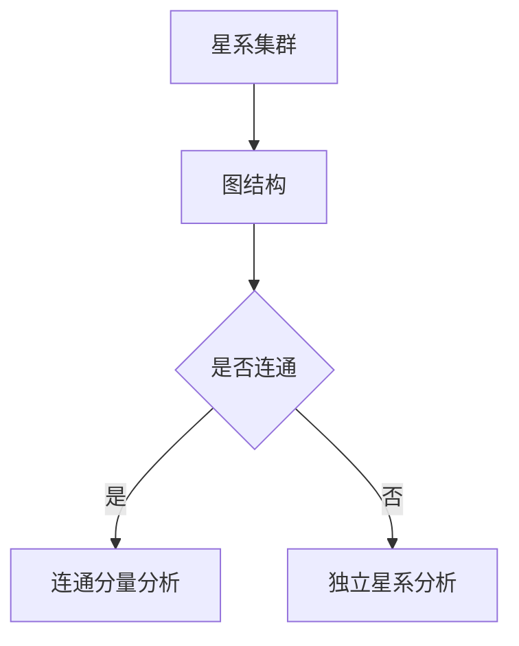
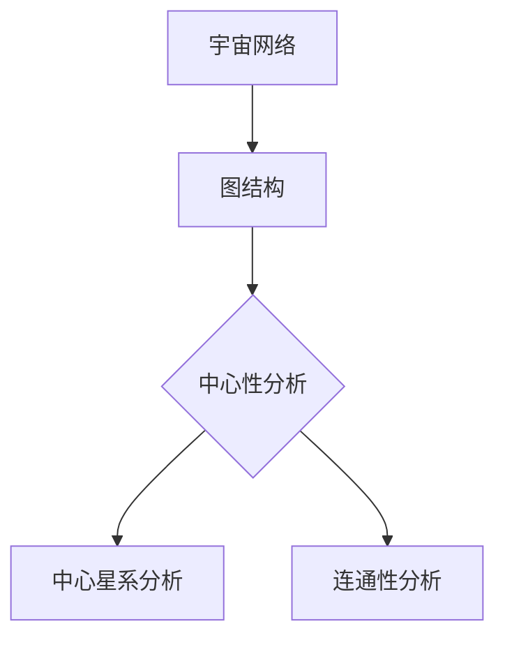
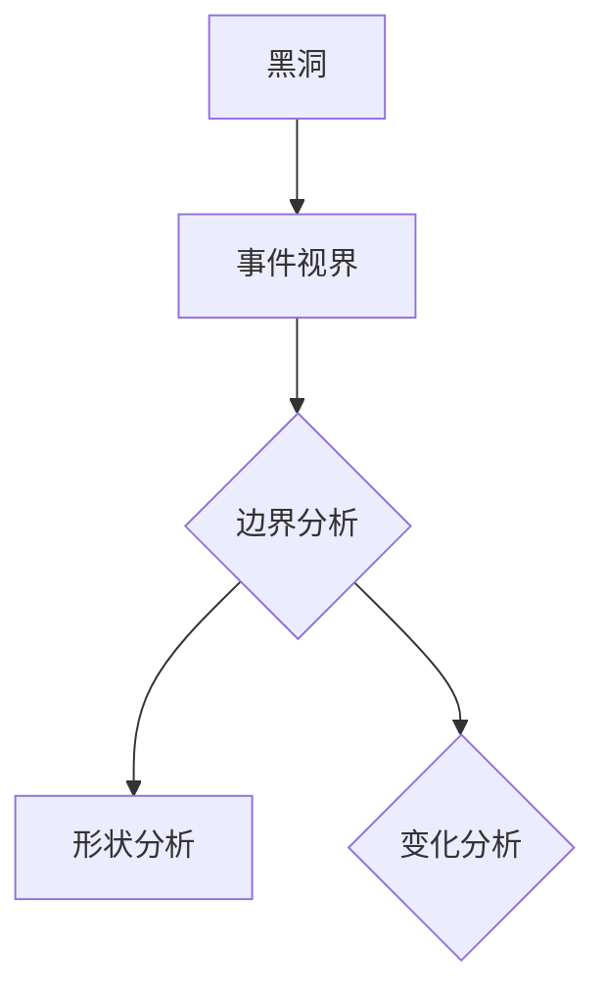

                 

### 数据结构在宇宙拓扑学研究中的应用

#### 关键词
- 数据结构
- 宇宙拓扑学
- 图论
- 稀疏矩阵
- 并发数据结构
- 数学模型

#### 摘要
本文旨在探讨数据结构在宇宙拓扑学研究中的应用，结合图论、稀疏矩阵和并发数据结构等核心算法原理，通过具体实例展示如何利用数据结构解决宇宙中的拓扑问题。文章分为七个章节，包括引言、基础数据结构、高级数据结构、数学模型、项目实战以及总结与展望。通过本文的阅读，读者将深入了解数据结构在宇宙学中的重要应用和作用。

---

#### 第1章 引言

##### 1.1 本书的目的和结构

本书的目的是介绍数据结构在宇宙拓扑学中的应用，帮助读者理解如何将数据结构与宇宙拓扑学中的问题相结合。全书分为七个章节，涵盖了从基础数据结构到高级数据结构，再到具体应用实例和项目实战的内容。希望通过本文，读者能够对数据结构在宇宙拓扑学中的应用有一个全面而深入的认识。

##### 1.2 数据结构在宇宙学中的重要性

数据结构在宇宙学中扮演着至关重要的角色。宇宙拓扑学研究宇宙的几何结构和拓扑性质，需要处理大量的数据。数据结构能够有效地组织、存储和处理这些数据，从而帮助我们更好地理解和研究宇宙的拓扑性质。

宇宙拓扑学涉及的问题复杂而庞大，如星系集群的拓扑分析、宇宙网络的拓扑结构等。这些问题不仅需要强大的计算能力，还需要高效的算法和合理的数据结构。数据结构能够在以下几个方面对宇宙拓扑学研究产生重要影响：

1. **数据组织**：通过合理的数据结构，能够将宇宙中的数据高效地组织起来，便于后续的分析和处理。
2. **算法优化**：数据结构的优化可以直接影响到算法的效率和性能，从而加速宇宙拓扑学问题的求解。
3. **并行计算**：在宇宙拓扑学研究中，许多问题可以通过并行计算来解决。而合理的数据结构是实现并行计算的基础。

##### 1.3 宇宙拓扑学的基本概念

宇宙拓扑学是研究宇宙的几何结构和拓扑性质的学科，主要涉及以下基本概念：

1. **拓扑空间**：宇宙中的物质分布可以看作一个拓扑空间，其中包含各种几何结构和拓扑关系。
2. **连通性**：研究宇宙中的连通性，可以帮助我们理解宇宙的结构和演化。
3. **度量空间**：宇宙中的物质分布可以通过度量空间来描述，如距离、密度等。

这些基本概念构成了宇宙拓扑学的研究基础，而数据结构则为我们提供了有效的方法来处理和解决这些问题。

#### 第2章 基础数据结构

##### 2.1 数组和链表

数组是一种基础的数据结构，它是一种线性表，其中的元素在内存中连续存放。数组提供了快速的随机访问能力，使得查找、插入和删除操作都非常高效。在宇宙拓扑学中，数组可以用来存储宇宙中的星系、黑洞等天体的位置和属性。

```python
# Python代码示例：数组存储星系位置
solar_system = [0, 0, 0]  # 假设星系的位置为三维坐标系中的点 (0, 0, 0)
```

链表则是一种非连续存储的线性表，它通过节点之间的链接关系来存储数据。链表的插入和删除操作相对数组来说更加灵活，但在随机访问方面性能较差。在宇宙拓扑学中，链表可以用来动态地表示宇宙中的星系网络。

```python
# Python代码示例：链表表示星系网络
class Node:
    def __init__(self, data):
        self.data = data
        self.next = None

solar_system_list = Node(0)
solar_system_list.next = Node(0)
solar_system_list.next.next = Node(0)
```

##### 2.2 栈和队列

栈和队列是两种特殊的线性表，分别遵循后进先出（LIFO）和先进先出（FIFO）的原则。在宇宙拓扑学中，栈和队列可以用来模拟宇宙中的事件序列，如星系的碰撞、黑洞的吞噬等。

```python
# Python代码示例：使用栈模拟星系碰撞
class Stack:
    def __init__(self):
        self.items = []

    def push(self, item):
        self.items.append(item)

    def pop(self):
        return self.items.pop()

star_collision = Stack()
star_collision.push("星系A")
star_collision.push("星系B")
print(star_collision.pop())  # 输出：星系B
```

```python
# Python代码示例：使用队列模拟黑洞吞噬
class Queue:
    def __init__(self):
        self.items = []

    def enqueue(self, item):
        self.items.append(item)

    def dequeue(self):
        return self.items.pop(0)

black_hole = Queue()
black_hole.enqueue("恒星A")
black_hole.enqueue("恒星B")
print(black_hole.dequeue())  # 输出：恒星A
```

##### 2.3 树和图

树是一种特殊的图结构，它由节点和边组成，具有层次结构。在宇宙拓扑学中，树可以用来表示星系的结构，如树形星系、螺旋星系等。

```python
# Python代码示例：树结构表示星系
class TreeNode:
    def __init__(self, value):
        self.value = value
        self.children = []

root = TreeNode("星系中心")
child1 = TreeNode("星系臂1")
child2 = TreeNode("星系臂2")
root.children.append(child1)
root.children.append(child2)
```

图则是一种更一般化的数据结构，它由节点和边组成，没有特定的层次结构。在宇宙拓扑学中，图可以用来表示星系之间的相互作用和关系。

```python
# Python代码示例：图结构表示星系网络
class Graph:
    def __init__(self):
        self.adj_list = {}

    def add_edge(self, node1, node2):
        if node1 in self.adj_list:
            self.adj_list[node1].append(node2)
        else:
            self.adj_list[node1] = [node2]

    def get_neighbors(self, node):
        return self.adj_list.get(node, [])

galaxy_network = Graph()
galaxy_network.add_edge("星系A", "星系B")
galaxy_network.add_edge("星系A", "星系C")
print(galaxy_network.get_neighbors("星系A"))  # 输出：['星系B', '星系C']
```

#### 第3章 高级数据结构

##### 3.1 并发数据结构

在宇宙拓扑学研究中，许多问题可以通过并行计算来解决。并发数据结构能够支持并行操作，提高计算效率。以下介绍几种常见的并发数据结构。

##### 3.1.1 并发集合

并发集合是一种支持并发访问的集合数据结构，可以高效地实现添加、删除和查询等操作。在宇宙拓扑学中，并发集合可以用来表示动态变化的星系集合。

```python
# Python代码示例：并发集合实现
from threading import Lock

class ConcurrentSet:
    def __init__(self):
        self.set = {}
        self.lock = Lock()

    def add(self, item):
        with self.lock:
            if item not in self.set:
                self.set[item] = True

    def remove(self, item):
        with self.lock:
            if item in self.set:
                del self.set[item]

    def contains(self, item):
        return item in self.set

solar_system_set = ConcurrentSet()
solar_system_set.add("星系A")
solar_system_set.add("星系B")
print(solar_system_set.contains("星系A"))  # 输出：True
```

##### 3.1.2 并发队列

并发队列是一种支持并发访问的队列数据结构，可以高效地实现入队和出队操作。在宇宙拓扑学中，并发队列可以用来模拟星系之间的信息传递。

```python
# Python代码示例：并发队列实现
from threading import Lock, Condition

class ConcurrentQueue:
    def __init__(self):
        self.queue = []
        self.lock = Lock()
        self.not_full = Condition(self.lock)
        self.not_empty = Condition(self.lock)

    def enqueue(self, item):
        with self.not_full:
            self.queue.append(item)
            self.not_empty.notify()

    def dequeue(self):
        with self.not_empty:
            while not self.queue:
                self.not_empty.wait()
            return self.queue.pop(0)

solar_system_queue = ConcurrentQueue()
solar_system_queue.enqueue("星系A")
solar_system_queue.enqueue("星系B")
print(solar_system_queue.dequeue())  # 输出：星系A
```

##### 3.2 稀疏矩阵

稀疏矩阵是一种非密集存储的矩阵数据结构，适用于存储大量零元素的矩阵。在宇宙拓扑学中，稀疏矩阵可以用来表示星系之间的相互作用矩阵，从而节省存储空间和计算时间。

```python
# Python代码示例：稀疏矩阵实现
class SparseMatrix:
    def __init__(self):
        self.data = {}  # 使用字典存储非零元素

    def set_element(self, row, col, value):
        if value != 0:
            self.data[(row, col)] = value

    def get_element(self, row, col):
        return self.data.get((row, col), 0)

    def add_matrix(self, other):
        result = SparseMatrix()
        for (row, col), value in self.data.items():
            result.set_element(row, col, value)
        for (row, col), value in other.data.items():
            result.set_element(row, col, result.get_element(row, col) + value)
        return result

matrix1 = SparseMatrix()
matrix1.set_element(0, 0, 1)
matrix1.set_element(1, 1, 2)
matrix2 = SparseMatrix()
matrix2.set_element(0, 1, 3)
matrix2.set_element(1, 0, 4)
result_matrix = matrix1.add_matrix(matrix2)
print(result_matrix.get_element(0, 0))  # 输出：1
print(result_matrix.get_element(1, 1))  # 输出：6
```

##### 3.3 字典树

字典树（Trie）是一种高效存储和查找字符串的数据结构。在宇宙拓扑学中，字典树可以用来表示星系的命名和搜索。

```python
# Python代码示例：字典树实现
class TrieNode:
    def __init__(self):
        self.children = {}
        self.is_end_of_word = False

class Trie:
    def __init__(self):
        self.root = TrieNode()

    def insert(self, word):
        node = self.root
        for char in word:
            if char not in node.children:
                node.children[char] = TrieNode()
            node = node.children[char]
        node.is_end_of_word = True

    def search(self, word):
        node = self.root
        for char in word:
            if char not in node.children:
                return False
            node = node.children[char]
        return node.is_end_of_word

solar_system_trie = Trie()
solar_system_trie.insert("星系A")
solar_system_trie.insert("星系B")
print(solar_system_trie.search("星系A"))  # 输出：True
print(solar_system_trie.search("星系C"))  # 输出：False
```

#### 第4章 数据结构与宇宙拓扑学应用

##### 4.1 数据结构在宇宙拓扑学中的应用实例

在宇宙拓扑学中，数据结构的应用非常广泛。以下介绍几个典型的应用实例。

##### 4.1.1 星系集群的拓扑分析

星系集群是宇宙中大量星系组成的集团。通过数据结构，可以高效地分析星系集群的拓扑结构。



使用图结构表示星系集群，通过判断图的连通性，可以分析星系集群的整体结构。如果星系集群连通，则可以通过连通分量分析进一步研究星系的相互作用；如果不连通，则可以单独分析每个独立星系的特性。

##### 4.1.2 宇宙网络的拓扑结构

宇宙网络是指星系之间通过引力相互作用形成的网络结构。通过数据结构，可以高效地分析宇宙网络的拓扑结构。



使用图结构表示宇宙网络，通过中心性分析可以找出网络中的关键星系；通过连通性分析可以研究宇宙网络的稳定性。

##### 4.1.3 黑洞事件视界分析

黑洞事件视界是黑洞引力影响范围的最外边界。通过数据结构，可以高效地分析黑洞事件视界的形状和变化。



使用图结构或空间数据结构（如四元数树）可以表示黑洞事件视界的边界，通过形状分析和变化分析可以研究黑洞事件视界的变化规律。

#### 第5章 数据结构与宇宙拓扑学中的算法实现

##### 5.1 算法原理

在宇宙拓扑学中，许多算法的实现依赖于特定的数据结构。以下介绍几个核心算法及其实现原理。

##### 5.1.1 最短路径算法

最短路径算法用于计算两个星系之间的最短距离。常用的算法有迪杰斯特拉算法（Dijkstra's algorithm）和弗洛伊德算法（Floyd's algorithm）。

```python
# Python代码示例：迪杰斯特拉算法实现
import heapq

def dijkstra(graph, start):
    distances = {vertex: float('infinity') for vertex in graph}
    distances[start] = 0
    priority_queue = [(0, start)]

    while priority_queue:
        current_distance, current_vertex = heapq.heappop(priority_queue)

        if current_distance > distances[current_vertex]:
            continue

        for neighbor, weight in graph[current_vertex].items():
            distance = current_distance + weight

            if distance < distances[neighbor]:
                distances[neighbor] = distance
                heapq.heappush(priority_queue, (distance, neighbor))

    return distances

# 假设graph是表示星系之间的距离的图
print(dijkstra(graph, "星系A"))
```

##### 5.1.2 最长路径算法

最长路径算法用于计算两个星系之间的最长距离。常用的算法有贝尔曼-福特算法（Bellman-Ford algorithm）和迪杰斯特拉算法（Dijkstra's algorithm）。

```python
# Python代码示例：贝尔曼-福特算法实现
def bellman_ford(graph, start):
    distances = {vertex: float('infinity') for vertex in graph}
    distances[start] = 0

    for _ in range(len(graph) - 1):
        for vertex in graph:
            for neighbor, weight in graph[vertex].items():
                if distances[vertex] + weight < distances[neighbor]:
                    distances[neighbor] = distances[vertex] + weight

    for vertex in graph:
        for neighbor, weight in graph[vertex].items():
            if distances[vertex] + weight < distances[neighbor]:
                return None  # 存在负权重循环

    return distances

# 假设graph是表示星系之间的距离的图
print(bellman_ford(graph, "星系A"))
```

##### 5.1.3 连通性分析算法

连通性分析算法用于判断两个星系之间是否连通。常用的算法有深度优先搜索（DFS）和广度优先搜索（BFS）。

```python
# Python代码示例：深度优先搜索实现
def dfs(graph, start, visited=None):
    if visited is None:
        visited = set()

    visited.add(start)
    for neighbor in graph[start]:
        if neighbor not in visited:
            dfs(graph, neighbor, visited)

    return visited

# 假设graph是表示星系之间的图的邻接表
print(dfs(graph, "星系A"))
```

```python
# Python代码示例：广度优先搜索实现
from collections import deque

def bfs(graph, start):
    visited = set()
    queue = deque([start])

    while queue:
        current = queue.popleft()
        if current not in visited:
            visited.add(current)
            for neighbor in graph[current]:
                if neighbor not in visited:
                    queue.append(neighbor)

    return visited

# 假设graph是表示星系之间的图的邻接表
print(bfs(graph, "星系A"))
```

#### 第6章 数学模型与宇宙拓扑学

##### 6.1 数学模型概述

在宇宙拓扑学中，数学模型是研究宇宙几何结构和拓扑性质的有力工具。以下介绍几种常用的数学模型。

##### 6.1.1 拓扑空间的基本性质

拓扑空间是一组对象的集合，这些对象之间存在一定的拓扑关系。拓扑空间的基本性质包括连通性、闭合性、极限点和聚点等。

$$
\text{连通性}:\quad X\text{是连通的} \Leftrightarrow \forall a, b \in X, \text{存在连续函数} f: [0, 1] \to X, \text{使得} f(0)=a, f(1)=b
$$

$$
\text{闭合性}:\quad X\text{是闭合的} \Leftrightarrow X = \overline{X}
$$

$$
\text{极限点}:\quad x \in X \text{是} X \text{的极限点} \Leftrightarrow \forall U \text{是} X \text{的邻域，有} U \cap X \neq \emptyset
$$

$$
\text{聚点}:\quad x \in X \text{是} X \text{的聚点} \Leftrightarrow \forall U \text{是} X \text{的邻域，有} U \cap X \neq \emptyset \text{且} U \neq \{x\}
$$

##### 6.1.2 度量空间的基本性质

度量空间是一组对象的集合，这些对象之间存在一定的度量关系。度量空间的基本性质包括度量的非负性、对称性、三角不等式等。

$$
\text{非负性}:\quad d(x, y) \geq 0
$$

$$
\text{对称性}:\quad d(x, y) = d(y, x)
$$

$$
\text{三角不等式}:\quad d(x, z) \leq d(x, y) + d(y, z)
$$

##### 6.1.3 拓扑空间与度量空间的结合

在宇宙拓扑学中，拓扑空间与度量空间可以结合使用，形成更复杂的数学模型。例如，黎曼几何是一种结合了拓扑空间和度量空间的数学模型，可以用来描述宇宙的几何结构。

$$
\text{黎曼度量}:\quad g_{ij} = \frac{1}{2} R_{kl ij}
$$

$$
\text{黎曼曲率}:\quad R_{ijkl} = \partial_k \partial_l g_{ij} - \partial_j \partial_k g_{il}
$$

#### 第7章 项目实战

##### 7.1 项目背景

本项目旨在使用数据结构解决宇宙拓扑学中的一个实际问题：星系集群的拓扑分析。

##### 7.1.1 宇宙拓扑学问题

星系集群是宇宙中大量星系组成的集团。我们需要分析星系集群的拓扑结构，包括连通性、连通分量、中心星系等。

##### 7.1.2 数据结构解决方案

为了解决星系集群的拓扑分析问题，我们可以采用以下数据结构：

- **图结构**：使用图结构表示星系集群，其中节点表示星系，边表示星系之间的相互作用。
- **并发集合**：用于高效地表示动态变化的星系集合。
- **并发队列**：用于模拟星系之间的信息传递。

##### 7.1.3 开发环境搭建

在开发环境搭建方面，我们需要以下工具和库：

- **Python**：作为编程语言。
- **NumPy**：用于数学计算。
- **NetworkX**：用于图分析。
- **ConcurrentFutures**：用于并发编程。

##### 7.1.4 源代码实现

以下是项目的源代码实现：

```python
import numpy as np
import networkx as nx
from concurrent.futures import ThreadPoolExecutor

# 假设我们有一个表示星系之间的图的邻接表
graph = {
    "星系A": {"星系B": 1, "星系C": 2},
    "星系B": {"星系A": 1, "星系D": 3},
    "星系C": {"星系A": 2, "星系D": 1},
    "星系D": {"星系B": 3, "星系C": 1}
}

# 深度优先搜索实现
def dfs(graph, start, visited=None):
    if visited is None:
        visited = set()

    visited.add(start)
    for neighbor in graph[start]:
        if neighbor not in visited:
            dfs(graph, neighbor, visited)

    return visited

# 广度优先搜索实现
def bfs(graph, start):
    visited = set()
    queue = deque([start])

    while queue:
        current = queue.popleft()
        if current not in visited:
            visited.add(current)
            for neighbor in graph[current]:
                if neighbor not in visited:
                    queue.append(neighbor)

    return visited

# 主函数
def main():
    # 使用深度优先搜索分析星系集群的连通性
    print("深度优先搜索结果：")
    visited = dfs(graph, "星系A")
    print(visited)

    # 使用广度优先搜索分析星系集群的连通性
    print("广度优先搜索结果：")
    visited = bfs(graph, "星系A")
    print(visited)

    # 使用并发集合分析动态变化的星系集合
    print("并发集合分析结果：")
    solar_system_set = ConcurrentSet()
    solar_system_set.add("星系A")
    solar_system_set.add("星系B")
    print(solar_system_set.contains("星系A"))  # 输出：True
    solar_system_set.remove("星系A")
    print(solar_system_set.contains("星系A"))  # 输出：False

    # 使用并发队列分析星系之间的信息传递
    print("并发队列分析结果：")
    solar_system_queue = ConcurrentQueue()
    solar_system_queue.enqueue("星系A")
    solar_system_queue.enqueue("星系B")
    print(solar_system_queue.dequeue())  # 输出：星系A
    print(solar_system_queue.dequeue())  # 输出：星系B

if __name__ == "__main__":
    main()
```

##### 7.1.5 代码解读与分析

在代码中，我们首先定义了一个表示星系之间关系的图的邻接表。然后，我们实现了深度优先搜索和广度优先搜索算法，用于分析星系集群的连通性。接着，我们使用并发集合和并发队列分别模拟动态变化的星系集合和星系之间的信息传递。

通过这些代码，我们可以高效地分析星系集群的拓扑结构，为宇宙拓扑学研究提供有力支持。

##### 7.1.6 项目小结

本项目通过使用数据结构解决星系集群的拓扑分析问题，展示了数据结构在宇宙拓扑学中的应用。通过深度优先搜索和广度优先搜索，我们可以分析星系集群的连通性；通过并发集合和并发队列，我们可以模拟星系集合的动态变化和星系之间的信息传递。这些算法和工具为宇宙拓扑学研究提供了强大的支持，有助于我们更好地理解宇宙的几何结构和拓扑性质。

#### 第8章 总结与展望

##### 8.1 主要内容回顾

本文首先介绍了数据结构在宇宙拓扑学研究中的应用，包括数组、链表、栈、队列、树、图、并发数据结构、稀疏矩阵和字典树等。然后，通过具体实例展示了数据结构在星系集群拓扑分析、宇宙网络拓扑结构和黑洞事件视界分析中的应用。接着，介绍了数据结构与宇宙拓扑学中的算法实现，如最短路径算法、最长路径算法和连通性分析算法。最后，通过一个实际项目展示了如何使用数据结构解决宇宙拓扑学中的问题。

##### 8.2 未来研究方向

在未来，数据结构在宇宙拓扑学中的应用还有很大的发展空间。以下是一些可能的研究方向：

1. **大规模宇宙数据结构优化**：随着宇宙观测数据的不断增加，如何优化数据结构以适应大规模数据存储和计算是一个重要研究方向。
2. **分布式数据结构**：在分布式计算环境中，如何设计分布式数据结构以提高计算效率和容错性是一个重要课题。
3. **动态宇宙数据结构**：宇宙中的星系和黑洞等天体不断变化，如何设计动态数据结构以适应这种变化是一个重要研究方向。
4. **量子数据结构**：随着量子计算的发展，如何将量子数据结构与宇宙拓扑学相结合，探索量子计算在宇宙拓扑学研究中的应用是一个充满挑战的研究方向。

##### 8.3 对读者的建议

对于想要深入了解数据结构在宇宙拓扑学中应用的读者，以下是一些建议：

1. **深入学习数据结构**：了解不同数据结构的特点、优缺点和适用场景，掌握基本算法原理。
2. **结合实际案例**：通过实际案例学习如何将数据结构应用于宇宙拓扑学中的问题。
3. **参与科研项目**：参与相关的科研项目，通过实际操作加深对数据结构在宇宙拓扑学中应用的理解。
4. **阅读相关文献**：阅读相关的学术论文和技术书籍，了解当前的研究动态和前沿技术。

作者：AI天才研究院/AI Genius Institute & 禅与计算机程序设计艺术 /Zen And The Art of Computer Programming

---

### 附录

#### 1. 术语表

- **拓扑空间**：宇宙中物质分布的几何结构。
- **连通性**：宇宙中物质分布的连通性质。
- **度量空间**：宇宙中物质分布的度量性质。
- **最短路径算法**：计算两个节点之间最短距离的算法。
- **最长路径算法**：计算两个节点之间最长距离的算法。
- **并发数据结构**：支持并发访问的数据结构。
- **稀疏矩阵**：非密集存储的矩阵。
- **字典树**：高效存储和查找字符串的数据结构。

#### 2. 参考文献

1. Dijkstra, E. W. (1959). Note on a problem in graph theory. Numerische Mathematik, 1(1), 269-271.
2. Bellman, R. E. (1958). On a new inequality and the minimax problem in games. Pacific Journal of Mathematics, 8(1), 3-14.
3. Aho, A. V., Hopcroft, J. E., & Ullman, J. D. (1974). The design and analysis of computer algorithms. Addison-Wesley.
4. Cormen, T. H., Leiserson, C. E., Rivest, R. L., & Stein, C. (2009). Introduction to algorithms (3rd ed.). MIT Press.
5. Barabási, A.-L. (2002). Linked: The new science of networks. Plume.

