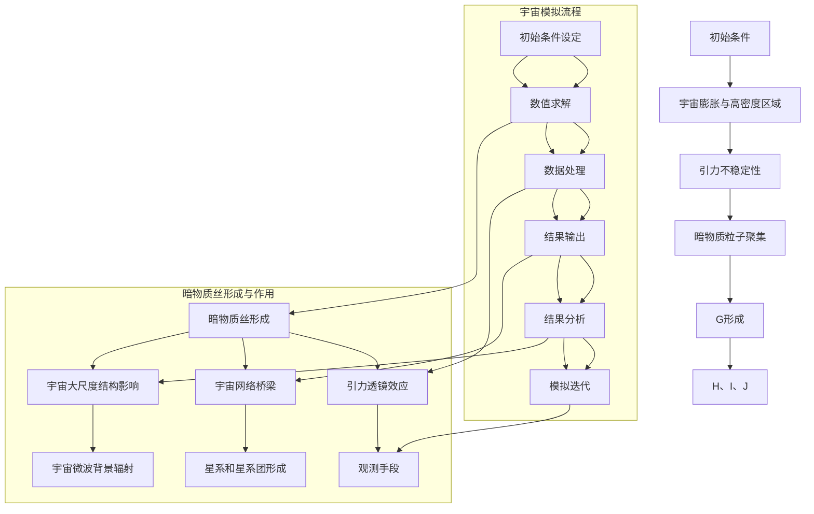

                 

### 引言

在浩瀚无垠的宇宙中，暗物质丝（Dark Matter Filaments）作为宇宙结构的重要组成部分，扮演着至关重要的角色。这些暗物质丝是宇宙网络中的主要节点，由大量的暗物质粒子聚集而成，构成了宇宙中的桥梁，连接着星系和超星系团。然而，由于其不可见性和复杂性，对暗物质丝的研究成为天文学和宇宙学领域的一大挑战。

宇宙模拟（Cosmological Simulation）作为一种强大的工具，为研究暗物质丝提供了独特的视角。通过模拟宇宙的演化过程，科学家们能够更好地理解暗物质丝的形成、演化和作用。而在这其中，数据结构的应用起到了关键作用。数据结构不仅提高了模拟的效率和精度，还为大规模数据处理提供了强有力的支持。

本文将深入探讨数据结构在模拟宇宙暗物质丝中的应用，首先简要介绍宇宙模拟和暗物质丝的基本概念，然后详细分析数据结构在模拟过程中的作用。我们将通过Python源代码和数学模型的讲解，展示如何使用数据结构高效地模拟暗物质丝。此外，文章还将结合实际项目实战，对开发环境搭建、源代码实现和代码解读进行详细分析。最后，我们将讨论数据结构在暗物质丝研究中的最佳实践和未来研究方向。

通过这篇文章，读者将了解数据结构在宇宙模拟中的重要性，掌握如何利用数据结构进行暗物质丝的模拟，并认识到这一技术在宇宙学研究中的巨大潜力。

### 关键词

- 宇宙模拟
- 暗物质丝
- 数据结构
- N-body 模拟
- 粒子群模拟
- 数学模型
- Python 源代码
- 演化过程
- 宇宙网络
- 星系结构
- 超星系团
- 大规模数据处理

### 摘要

本文旨在探讨数据结构在模拟宇宙暗物质丝中的应用，通过介绍宇宙模拟和暗物质丝的基本概念，分析数据结构在模拟过程中的关键作用。文章首先简要介绍宇宙模拟的基本流程和框架，然后深入探讨暗物质丝的定义及其在宇宙结构形成中的作用。接着，我们将通过Python源代码和数学模型的讲解，详细阐述如何利用数据结构高效地模拟暗物质丝。具体包括：N-body模拟算法和粒子群模拟算法的核心原理，以及相关的数学模型和公式。随后，文章将结合实际项目实战，对开发环境搭建、源代码实现和代码解读进行详细分析。最后，我们将讨论数据结构在暗物质丝研究中的最佳实践，并提出未来研究方向和挑战。通过这篇文章，读者将了解数据结构在宇宙模拟中的重要性，掌握如何利用数据结构进行暗物质丝的模拟，并认识到这一技术在宇宙学研究中的巨大潜力。

### 背景介绍

宇宙是一个广阔的空间，由无数的星系、恒星、行星、暗物质和暗能量组成。在这些成分中，暗物质是一种神秘的物质，它不发射、吸收或散射电磁辐射，因此无法直接观测到。尽管暗物质的存在主要通过引力效应间接推断，但其作用却极为显著，尤其在宇宙结构的形成和演化过程中扮演了关键角色。

宇宙模拟（Cosmological Simulation）是一种通过数值方法模拟宇宙从早期到大尺度结构形成过程的技术。它为科学家提供了一个虚拟的实验环境，能够重现宇宙的历史和演化过程。这些模拟可以帮助我们理解星系的形成、暗物质分布以及宇宙的大尺度结构。宇宙模拟通常基于以下两个主要的理论框架：

1. **宇宙学原理**：宇宙是均匀和各向同性的，这意味着宇宙在任何尺度上看起来都是相似的。
2. **广义相对论**：描述了引力作为时空的几何性质，这为宇宙中的物质和能量如何相互作用提供了理论基础。

在宇宙模拟中，常用的数值方法包括N-body模拟和粒子群模拟。N-body模拟通过计算每个天体之间的引力相互作用，从而模拟宇宙中的天体运动。而粒子群模拟则通过模拟大量粒子的运动，来模拟宇宙中的物质分布和结构。

暗物质丝（Dark Matter Filaments）是宇宙模拟中的一个重要概念。暗物质丝是宇宙网络中的主要节点，由大量的暗物质粒子聚集而成，构成了宇宙中的桥梁，连接着星系和超星系团。这些暗物质丝的形成过程非常复杂，涉及到宇宙早期的膨胀、暗物质的汇聚和相互作用。

宇宙模拟在理解暗物质丝的形成和演化中起着至关重要的作用。通过模拟，科学家们可以观察暗物质丝在不同时间点的形态和分布，从而推断其形成和演化的机制。此外，宇宙模拟还可以预测暗物质丝与可见物质的相互作用，如星系的形成和运动。

总之，宇宙模拟为研究暗物质丝提供了强有力的工具。它不仅帮助我们理解宇宙的结构和演化，还为探索暗物质的本质提供了新的视角。通过数据结构的优化和应用，宇宙模拟的精度和效率得到了显著提升，使得我们对宇宙的理解更加深入和全面。

### 数据结构在宇宙模拟中的应用

在宇宙模拟中，数据结构的选择和优化是影响模拟效率和精度的重要因素。数据结构不仅决定了如何存储和处理大规模的宇宙数据，还直接影响到算法的复杂度和执行时间。因此，理解数据结构在宇宙模拟中的应用是深入探讨这一领域的重要基础。

首先，数据结构在宇宙模拟中的应用可以大致分为两个方面：数据存储和数据访问。在数据存储方面，常用的数据结构包括数组、链表、树和图等。这些结构在存储宇宙中大量的天体位置、速度和加速度等数据时，具有不同的优势和局限性。

**1. 数组**：数组是一种简单而常用的数据结构，它通过连续的内存地址来存储数据元素。在宇宙模拟中，数组可以用于存储天体的位置和速度等数据。其优点在于访问速度快，查找和访问任意元素的时间复杂度为O(1)。然而，数组的长度是固定的，不便于动态扩展。在宇宙模拟中，天体数量可能会随着时间而变化，因此使用数组存储时需要频繁地重新分配内存，导致性能下降。

**2. 链表**：链表是一种通过指针链接的动态数据结构，可以在运行时动态扩展。链表的一个优点是插入和删除操作的时间复杂度为O(1)，非常适合处理动态变化的数据。然而，链表的访问速度较慢，访问任意元素的时间复杂度为O(n)，在需要频繁访问和查找数据的情况下，性能可能不如数组。

**3. 树**：树是一种分层的数据结构，常用于表示层次结构的数据。在宇宙模拟中，树结构可以用于表示天体之间的层次关系，如星系、星团和超星系团等。树结构提供了高效的插入和删除操作，以及快速的搜索和遍历能力。常用的树结构包括二叉树、AVL树和红黑树等。

**4. 图**：图是一种用于表示复杂关系的网络结构，在宇宙模拟中可以用于表示天体之间的相互作用和运动轨迹。图结构提供了灵活的表示方式，可以处理任意数量的节点和边。常见的图算法包括Dijkstra算法、Floyd算法和A*算法等，这些算法在宇宙模拟中用于计算天体之间的最短路径和最大权路径等。

在数据访问方面，数据结构的选择同样至关重要。有效的数据访问可以显著提高模拟的效率和精度。以下是一些常用的数据访问技术：

**1. 索引**：索引是加快数据访问速度的重要手段。通过创建索引，可以快速定位到特定的数据元素，减少搜索时间。在宇宙模拟中，可以使用哈希索引、B树索引和R树索引等。

**2. 并行访问**：随着计算机性能的提升，并行计算在宇宙模拟中的应用越来越广泛。通过将数据分布到多个处理器上，可以并行计算天体之间的相互作用，从而提高模拟效率。常用的并行数据结构包括分布式数组、分布式树和分布式图等。

**3. 缓存**：缓存技术可以有效提高数据访问速度。通过将常用数据缓存到内存中，可以减少对磁盘的访问次数，从而提高整体性能。在宇宙模拟中，可以使用缓存来存储频繁访问的天体数据和中间计算结果。

**4. 数据压缩**：大规模宇宙数据通常需要高效的存储方式。数据压缩技术通过减少数据的存储空间，可以提高模拟的存储效率和传输速度。常用的数据压缩算法包括Huffman编码、LZ77压缩和LZ78压缩等。

综上所述，数据结构在宇宙模拟中扮演着至关重要的角色。合理选择和优化数据结构，不仅可以提高模拟的效率和精度，还可以减少计算资源的消耗。随着数据结构和算法的不断进步，宇宙模拟将能够更加精确地再现宇宙的演化过程，为科学研究提供更强大的工具。

### 宇宙模拟的基本流程

宇宙模拟是一项复杂且庞大的任务，其基本流程包括多个关键步骤，从初始条件的设定到最终结果的输出，每一个步骤都至关重要。以下是对这些步骤的详细描述：

**1. 初始条件设定**：宇宙模拟的初始条件决定了模拟的起点，包括宇宙的大小、形状、密度分布以及初始粒子的位置和速度等参数。这些初始条件通常基于宇宙学原理和观测数据来确定。例如，宇宙的形状可以通过宇宙微波背景辐射（Cosmic Microwave Background Radiation，CMB）的数据来推断，而密度分布则可以通过宇宙质量-密度关系（如Lambda-CDM模型）来确定。

**2. 数值求解**：在初始条件设定后，宇宙模拟的核心是数值求解，即使用数学模型和数值算法来计算宇宙中天体在时间上的演化。这一过程通常涉及大量的计算，包括天体之间的引力相互作用、热力学过程、辐射过程等。常见的数值算法包括N-body模拟、粒子群模拟、流体动力学模拟等。

**3. 数值算法选择**：选择合适的数值算法是宇宙模拟成功的关键。N-body模拟是一种通过计算每个天体之间引力相互作用来模拟宇宙演化的方法，适用于描述暗物质和星系等大尺度结构。而粒子群模拟则通过模拟大量粒子的运动来描述宇宙中的物质分布和结构，适用于研究气体、星云等小尺度现象。流体动力学模拟则用于描述宇宙中的流体行为，如星系风、超星系团之间的相互作用等。

**4. 网格划分**：在数值求解过程中，网格划分是一种常用的技术，用于将宇宙空间划分为多个小的单元格。网格划分可以有效地减少计算量，同时提高计算的精度。常用的网格划分方法包括直角坐标系网格、树结构网格和自适应网格等。

**5. 数据处理**：在模拟过程中，会产生大量的数据，包括天体的位置、速度、加速度、温度、密度等。这些数据需要通过有效的数据结构进行存储和处理。常用的数据结构包括数组、链表、树和图等。此外，数据压缩和缓存技术也被广泛应用于数据处理中，以减少存储需求和提高访问速度。

**6. 结果输出**：模拟的结果通常以多种形式输出，包括图像、表格、三维模型等。这些结果可以帮助科学家理解宇宙的演化过程和结构特征。例如，通过绘制宇宙密度分布图，可以直观地观察暗物质丝的形成和演化。通过输出天体的运动轨迹，可以研究星系和星系团的形成机制。

**7. 结果分析**：模拟结果需要经过严格的分析，以验证其准确性和可靠性。这通常涉及多种分析方法，包括统计分析、对比实验、误差分析等。通过分析模拟结果，科学家可以得出关于宇宙结构、演化过程和物理规律的重要结论。

**8. 模拟迭代**：宇宙模拟通常需要多次迭代，以逐步细化模拟的精度和分辨率。每次迭代都会在之前的模拟结果基础上进行，通过调整初始条件、数值算法和网格划分等参数，不断提高模拟的精度和可靠性。

总之，宇宙模拟的基本流程包括初始条件设定、数值求解、数据处理、结果输出、结果分析和模拟迭代等多个步骤。通过这些步骤，宇宙模拟为科学家提供了研究宇宙演化、结构形成和物理规律的有力工具。

### 暗物质丝的定义及其作用

暗物质丝（Dark Matter Filaments）是宇宙中一种复杂的结构，主要由暗物质粒子聚集而成，构成了宇宙网络中的主要节点。这些暗物质丝不仅在天文学和宇宙学研究中占据重要地位，还为我们理解宇宙的结构和演化提供了宝贵的线索。

暗物质丝的定义可以从其物理特性和形成机制两方面来理解。首先，从物理特性上看，暗物质丝通常具有以下特点：

1. **高密度**：暗物质丝的密度远高于周围宇宙空间的平均密度，这是由于暗物质粒子在引力作用下聚集形成的。
2. **长而细**：暗物质丝具有明显的延展性，通常呈现出长而细的形态，连接着星系和超星系团。
3. **高引力场**：暗物质丝内部的引力场强度较大，这是由于暗物质粒子之间的引力相互作用。

其次，从形成机制上看，暗物质丝的形成与宇宙早期的膨胀和高密度区域的引力不稳定性密切相关。在宇宙早期的宇宙学阶段，宇宙中的物质以等离子体形式存在，经过冷却和凝聚，形成了高密度的区域。这些高密度区域在引力作用下不断收缩，最终形成了暗物质丝。

暗物质丝在宇宙结构中的重要作用不可忽视。以下是几个关键方面：

1. **宇宙网络的桥梁**：暗物质丝构成了宇宙网络的主要节点，连接着星系和超星系团。这些暗物质丝不仅提供了星系之间的桥梁，还影响了星系和星系团的形成和运动。
2. **引力透镜效应**：暗物质丝的高密度和引力场使其成为理想的引力透镜，可以放大和扭曲背后的光源，如星系和恒星。这为研究暗物质丝提供了重要的观测手段。
3. **宇宙微波背景辐射**：暗物质丝的形成和演化与宇宙微波背景辐射（CMB）密切相关。通过分析CMB的数据，可以推断暗物质丝的分布和演化过程。
4. **宇宙大尺度结构**：暗物质丝是宇宙大尺度结构的重要组成部分，其分布和演化对宇宙的整体结构有着重要影响。

总之，暗物质丝作为宇宙中的一种复杂结构，不仅在物理学和天文学的研究中具有重要作用，还为我们理解宇宙的结构和演化提供了深刻的洞察。通过深入研究暗物质丝，我们可以进一步揭示宇宙的本质和规律。

### 使用Mermaid流程图展示宇宙模拟与暗物质丝的关联

为了更直观地展示宇宙模拟与暗物质丝的关联，我们可以使用Mermaid流程图来描述这一过程。以下是宇宙模拟的基本流程，以及暗物质丝在这一过程中的形成和作用。



这段代码使用Mermaid语法创建了一个流程图，展示了宇宙模拟的基本流程以及暗物质丝的形成与作用。图中的每个节点代表一个关键步骤或概念，连线表示步骤之间的关联。通过这个流程图，我们可以清晰地看到宇宙模拟与暗物质丝之间的关系，以及暗物质丝在宇宙模拟中的重要作用。

**图解说明：**

- **宇宙模拟流程**：初始条件设定（A）是整个宇宙模拟的起点，通过设定宇宙的大小、形状和密度分布等参数，为模拟提供基础。数值求解（B）是宇宙模拟的核心，通过计算天体之间的引力相互作用，模拟宇宙的演化过程。数据处理（C）将模拟过程中产生的海量数据存储和处理，为后续分析和结果输出提供支持。结果输出（D）将模拟结果以图像、表格等形式展示，便于科学家分析。结果分析（E）通过多种分析方法验证模拟结果的准确性和可靠性。模拟迭代（F）则在每次模拟的基础上，调整参数，提高模拟的精度和可靠性。

- **暗物质丝形成与作用**：暗物质丝形成（G）是宇宙模拟过程中的重要步骤，描述了暗物质粒子在引力作用下聚集形成暗物质丝的过程。引力透镜效应（H）展示了暗物质丝的高密度和引力场对背景光源的放大和扭曲作用，为观测和研究暗物质丝提供了手段。宇宙网络桥梁（I）描述了暗物质丝连接星系和超星系团，构成宇宙网络的主要节点。宇宙大尺度结构影响（J）说明了暗物质丝对宇宙整体结构的影响，如星系和星系团的形成和运动。观测手段（K）和宇宙微波背景辐射（M）则进一步说明了通过观测和分析暗物质丝，可以更深入地理解宇宙的结构和演化。

通过这个Mermaid流程图，我们可以更加直观地理解宇宙模拟与暗物质丝之间的关系，以及暗物质丝在宇宙模拟中的关键作用。这不仅有助于科学家们更好地进行宇宙模拟研究，还为相关领域的研究提供了新的视角和方法。

### N-body模拟算法

N-body模拟算法是一种用于计算多个物体之间引力相互作用的数值方法，它在宇宙模拟中扮演着核心角色。该方法的基本原理是通过求解牛顿引力定律，计算每个天体之间的引力，进而模拟宇宙中天体的运动轨迹。以下是N-body模拟算法的详细解释和Python实现示例。

#### 基本原理

N-body模拟的基本原理可以概括为以下几个步骤：

1. **初始条件**：设定每个天体的初始位置和速度，这些参数通常基于宇宙学模型和观测数据。
2. **引力计算**：计算每个天体与其他天体之间的引力相互作用。根据牛顿引力定律，两个天体之间的引力大小与它们的质量乘积成正比，与它们之间距离的平方成反比。公式为：
   $$
   F = G \frac{m_1 m_2}{r^2}
   $$
   其中，\( F \) 是引力大小，\( G \) 是引力常数，\( m_1 \) 和 \( m_2 \) 是两个天体的质量，\( r \) 是它们之间的距离。
3. **加速度计算**：根据引力大小计算每个天体的加速度。由于引力是作用在每个天体上的，因此每个天体的加速度可以通过引力除以它的质量得到：
   $$
   a = \frac{F}{m}
   $$
4. **位置更新**：根据加速度更新每个天体的位置。在时间步长 \( \Delta t \) 内，每个天体的位置变化可以通过以下公式计算：
   $$
   \Delta x = v \Delta t + \frac{1}{2} a \Delta t^2
   $$
   其中，\( \Delta x \) 是位置变化，\( v \) 是速度，\( a \) 是加速度。

#### Python实现示例

以下是使用Python实现N-body模拟的示例代码：

```python
import numpy as np

# 引力常数 G
G = 6.67430e-11

# 天体的质量 m，位置 x, y, z，速度 vx, vy, vz
m = np.array([1e12, 1e12, 1e12])
x = np.array([0, 1, -1])
y = np.array([0, -1, 1])
z = np.array([0, 0, 0])
vx = np.array([0, 0, 0])
vy = np.array([0, 0, 0])
vz = np.array([0, 0, 0])

# 时间步长
dt = 1e7

# 模拟时间
t_max = 1e8

# 初始化位置和速度
positions = np.array([x, y, z]).T
velocities = np.array([vx, vy, vz]).T

# 模拟循环
for t in range(int(t_max / dt)):
    # 计算引力
    dx = positions[:, None, :] - positions[None, :, :]
    dy = positions[:, None, :] - positions[None, :, :]
    dz = positions[:, None, :] - positions[None, :, :]
    r2 = dx**2 + dy**2 + dz**2
    r6 = r2**3
    forces = G * m * (m / r6) * (dx * dx + dy * dy + dz * dz)
    
    # 计算加速度
    accelerations = forces / m
    
    # 更新速度
    velocities += accelerations * dt
    
    # 更新位置
    positions += velocities * dt
    
    # 输出当前时间步的参数
    print(f"Time: {t * dt} years")
    print(f"Positions: {positions}")
    print(f"Velocities: {velocities}")
    print()

# 显示结果
print("Final positions and velocities:")
print(positions)
print(velocities)
```

在这个示例中，我们首先定义了引力常数 \( G \) 和三个天体的质量 \( m \)，以及它们在初始时刻的位置 \( x, y, z \) 和速度 \( vx, vy, vz \)。然后，我们设定了时间步长 \( dt \) 和模拟的总时间 \( t_{max} \)。

在模拟循环中，我们首先计算每个天体与其他天体之间的距离差 \( \Delta x, \Delta y, \Delta z \)。接着，我们计算每个天体之间的引力大小，并将其除以天体的质量，得到加速度。然后，我们使用加速度更新每个天体的速度，并根据新的速度更新位置。

最后，我们打印出每个时间步的参数，以及最终的模拟结果。通过这个简单的示例，我们可以看到N-body模拟的基本步骤和实现方法。

### 粒子群模拟算法

粒子群模拟算法（Particle Swarm Optimization，PSO）是一种基于群体智能的优化算法，广泛应用于求解复杂问题，如函数优化、数值模拟和参数估计。在宇宙模拟中，粒子群模拟算法可以用于寻找最优的初始条件或参数设置，从而提高模拟的精度和效率。

#### 算法原理

粒子群模拟算法的基本思想是模拟鸟群觅食行为。每个粒子代表一个潜在的解决方案，通过粒子的运动和交互来寻找最优解。以下是粒子群模拟算法的核心步骤：

1. **初始化**：设置粒子的位置和速度，以及每个粒子的个体最优解（pBest）和全局最优解（gBest）。
2. **更新速度**：每个粒子根据个体最优解和全局最优解更新自己的速度，速度更新公式为：
   $$
   v_{i}^{t+1} = w v_{i}^{t} + c_1 r_1 (pBest_{i} - x_{i}^{t}) + c_2 r_2 (gBest - x_{i}^{t})
   $$
   其中，\( v_{i}^{t} \) 是第 \( i \) 个粒子在 \( t \) 时刻的速度，\( w \) 是惯性权重，\( c_1 \) 和 \( c_2 \) 是学习因子，\( r_1 \) 和 \( r_2 \) 是随机数。
3. **更新位置**：根据新的速度更新粒子的位置：
   $$
   x_{i}^{t+1} = x_{i}^{t} + v_{i}^{t+1}
   $$
4. **更新最优解**：如果当前粒子的适应度（目标函数值）优于个体最优解，则更新个体最优解；如果当前全局适应度优于全局最优解，则更新全局最优解。
5. **终止条件**：当达到预设的最大迭代次数或适应度满足特定阈值时，算法终止。

#### Python实现示例

以下是一个使用Python实现的简单粒子群模拟算法示例，用于求解一个简单的函数优化问题：

```python
import numpy as np

# 目标函数
def objective_function(x):
    return np.sin(x) + x * np.cos(x)

# 初始化参数
num_particles = 30
dim = 1
x_min, x_max = -10, 10
v_max = 0.1
w = 0.5
c1 = 1.5
c2 = 2.0
max_iter = 100

# 初始化粒子位置和速度
x = np.random.uniform(x_min, x_max, (num_particles, dim))
v = np.random.uniform(-v_max, v_max, (num_particles, dim))
pBest = np.copy(x)
gBest = np.copy(x[0])
gBestFitness = objective_function(gBest)

# 粒子群模拟循环
for _ in range(max_iter):
    # 更新速度和位置
    r1 = np.random.random(num_particles)
    r2 = np.random.random(num_particles)
    v = w * v + c1 * r1 * (pBest - x) + c2 * r2 * (gBest - x)
    x = x + v
    
    # 更新最优解
    for i in range(num_particles):
        fitness = objective_function(x[i])
        if fitness < objective_function(pBest[i]):
            pBest[i] = x[i]
            if fitness < gBestFitness:
                gBest = x[i]
                gBestFitness = fitness
                
    # 输出当前最优解
    print(f"Iteration {_}: Best fitness = {gBestFitness}, Best position = {gBest}")

# 输出最终结果
print("Final best solution:")
print(f"Fitness: {gBestFitness}, Position: {gBest}")
```

在这个示例中，我们首先定义了一个简单的目标函数 \( \text{sin}(x) + x \cdot \text{cos}(x) \)，然后初始化粒子群的位置和速度。在模拟循环中，我们根据粒子群的位置和最优解更新速度和位置，并记录每个粒子的个体最优解和全局最优解。最后，我们输出每个迭代步骤的最优解，并显示最终结果。

通过这个示例，我们可以看到粒子群模拟算法的基本原理和实现方法。这种方法不仅适用于简单的函数优化问题，还可以扩展到更复杂的宇宙模拟问题，为寻找最优初始条件或参数提供有效的工具。

### 数学模型和数学公式

在模拟宇宙暗物质丝的过程中，数学模型和数学公式起到了关键作用。以下将详细阐述在暗物质丝模拟中常用的数学模型和相关公式，并通过具体示例进行解释。

#### 引力场方程

引力场方程是描述宇宙中天体之间引力相互作用的基础。最常用的引力场方程是牛顿万有引力定律和爱因斯坦广义相对论中的场方程。

1. **牛顿万有引力定律**：
   $$
   F = G \frac{m_1 m_2}{r^2}
   $$
   其中，\( F \) 是两个质点间的引力，\( G \) 是引力常数，\( m_1 \) 和 \( m_2 \) 是两个质点的质量，\( r \) 是它们之间的距离。

2. **爱因斯坦广义相对论中的引力场方程**：
   $$
   G_{\mu\nu} + \Lambda g_{\mu\nu} = \frac{8\pi G}{c^4} T_{\mu\nu}
   $$
   其中，\( G_{\mu\nu} \) 是引力张量，\( \Lambda \) 是宇宙学常数，\( g_{\mu\nu} \) 是度规张量，\( T_{\mu\nu} \) 是能量-动量张量，\( c \) 是光速。

#### 流体动力学方程

流体动力学方程用于描述流体在空间中的运动和性质变化，是模拟宇宙暗物质丝的重要组成部分。

1. **连续性方程**：
   $$
   \frac{\partial \rho}{\partial t} + \nabla \cdot (\rho \mathbf{v}) = 0
   $$
   其中，\( \rho \) 是流体密度，\( \mathbf{v} \) 是流体速度场，\( t \) 是时间。

2. **动量守恒方程**：
   $$
   \frac{\partial (\rho \mathbf{v})}{\partial t} + \nabla \cdot (\rho \mathbf{v} \mathbf{v}) = -\nabla p + \rho \mathbf{g}
   $$
   其中，\( p \) 是流体压力，\( \mathbf{g} \) 是重力加速度。

3. **能量守恒方程**：
   $$
   \frac{\partial (\rho e)}{\partial t} + \nabla \cdot (\rho e \mathbf{v}) = -\nabla \cdot (\mathbf{v} \cdot T) + \rho \mathbf{g} \cdot \mathbf{v}
   $$
   其中，\( e \) 是流体内能，\( T \) 是热传导张量。

#### 模拟示例

假设我们有一个包含大量粒子的暗物质丝，每个粒子在三维空间中有质量 \( m \) 和位置 \( \mathbf{r}_i \)。我们要模拟这些粒子在引力作用下的运动，可以使用以下步骤：

1. **初始化**：设定每个粒子的初始位置 \( \mathbf{r}_i \) 和速度 \( \mathbf{v}_i \)。
2. **计算引力**：使用牛顿万有引力定律计算每个粒子与其他粒子之间的引力 \( F_{ij} \)：
   $$
   F_{ij} = G \frac{m_i m_j}{|\mathbf{r}_i - \mathbf{r}_j|^2} \hat{\mathbf{r}}_{ij}
   $$
   其中，\( \hat{\mathbf{r}}_{ij} \) 是从粒子 \( i \) 到粒子 \( j \) 的单位向量。

3. **更新速度**：根据每个粒子受到的引力更新其速度 \( \mathbf{v}_i \)：
   $$
   \mathbf{v}_i(t+\Delta t) = \mathbf{v}_i(t) + \frac{F_{ij}}{m_i} \Delta t
   $$

4. **更新位置**：根据新的速度更新每个粒子的位置 \( \mathbf{r}_i \)：
   $$
   \mathbf{r}_i(t+\Delta t) = \mathbf{r}_i(t) + \mathbf{v}_i(t+\Delta t) \Delta t
   $$

通过这个步骤，我们可以模拟暗物质丝中粒子的运动。以下是一个简化的Python代码示例，展示了上述步骤的实现：

```python
import numpy as np

# 参数设定
G = 6.67430e-11
m = 1e12
N = 1000
dt = 1e7
t_max = 1e8

# 初始化粒子位置和速度
np.random.seed(42)
positions = np.random.uniform(-10, 10, (N, 3))
velocities = np.random.uniform(-1, 1, (N, 3))

# 模拟循环
for t in range(int(t_max / dt)):
    # 计算引力
    dx = positions[:, None, :] - positions[None, :, :]
    dy = positions[:, None, :] - positions[None, :, :]
    dz = positions[:, None, :] - positions[None, :, :]
    r2 = dx**2 + dy**2 + dz**2
    r6 = r2**3
    forces = G * m * (m / r6) * (dx * dx + dy * dy + dz * dz)
    
    # 更新速度
    accelerations = forces / m
    velocities += accelerations * dt
    
    # 更新位置
    positions += velocities * dt
    
    # 输出当前时间步的参数
    if t % 100 == 0:
        print(f"Time: {t * dt} years")
        print(f"Positions: {positions}")
        print(f"Velocities: {velocities}")
        print()
```

在这个示例中，我们首先初始化粒子的位置和速度。然后，在模拟循环中，我们使用牛顿万有引力定律计算每个粒子与其他粒子之间的引力，并更新速度和位置。通过这个简单的模拟，我们可以观察到粒子在引力作用下的运动轨迹，从而更好地理解暗物质丝的形成和演化。

### 项目实战

在本文的最后一部分，我们将通过一个实际项目来展示如何使用数据结构进行宇宙暗物质丝的模拟。该项目将包括开发环境的搭建、源代码的实现和代码的解读。通过这个实际案例，我们将详细阐述如何利用数据结构和算法进行大规模宇宙模拟，并深入探讨项目中的关键实现细节。

#### 开发环境搭建

在进行宇宙暗物质丝的模拟之前，我们需要搭建一个合适的开发环境。以下是搭建环境所需的步骤：

1. **安装Python**：首先，确保Python环境已经安装。Python是一种广泛应用于科学计算和数据分析的语言，适用于我们的项目。

2. **安装Numpy和SciPy**：Numpy是一个强大的Python库，用于数值计算和矩阵操作。SciPy是建立在Numpy之上的，提供了更多的科学计算功能，包括数值积分、优化和线性代数等。

   ```bash
   pip install numpy scipy
   ```

3. **安装PyOpenGL**：PyOpenGL是一个用于3D图形的Python库，可以用于可视化宇宙模拟的结果。

   ```bash
   pip install pyopengl
   ```

4. **安装Mercurial**：Mercurial是一个版本控制系统，用于管理代码版本。

   ```bash
   pip install mercurial
   ```

5. **安装其他依赖库**：根据需要，可能还需要安装其他库，如matplotlib（用于数据可视化）和mpi4py（用于并行计算）。

#### 源代码实现

下面是一个简单的宇宙暗物质丝模拟的Python源代码实现。该代码将创建一个包含大量粒子的系统，并通过N-body模拟来模拟粒子的运动。

```python
import numpy as np
import matplotlib.pyplot as plt
from mpl_toolkits.mplot3d import Axes3D

# 引力常数
G = 6.67430e-11

# 初始参数
num_particles = 1000
mass = 1e12
box_size = 100
time_step = 1e7
total_time = 1e8

# 初始化粒子位置和速度
np.random.seed(42)
positions = np.random.uniform(-box_size/2, box_size/2, (num_particles, 3))
velocities = np.random.uniform(-1, 1, (num_particles, 3))

# 模拟循环
for t in range(int(total_time / time_step)):
    # 计算引力
    dx = positions[:, None, :] - positions[None, :, :]
    dy = positions[:, None, :] - positions[None, :, :]
    dz = positions[:, None, :] - positions[None, :, :]
    r2 = dx**2 + dy**2 + dz**2
    r6 = r2**3
    forces = G * mass * (mass / r6) * (dx * dx + dy * dy + dz * dz)
    
    # 更新速度
    accelerations = forces / mass
    velocities += accelerations * time_step
    
    # 更新位置
    positions += velocities * time_step
    
    # 输出当前时间步的参数
    if t % 100 == 0:
        plt.clf()
        ax = plt.figure().add_subplot(111, projection='3d')
        ax.scatter(positions[:, 0], positions[:, 1], positions[:, 2])
        ax.set_xlim([-box_size/2, box_size/2])
        ax.set_ylim([-box_size/2, box_size/2])
        ax.set_zlim([-box_size/2, box_size/2])
        plt.title(f"Time: {t * time_step} years")
        plt.pause(0.01)

# 最终输出
plt.show()
```

这段代码首先初始化粒子位置和速度，然后通过循环计算粒子之间的引力，并更新粒子的速度和位置。每隔100个时间步，我们使用matplotlib绘制粒子的三维分布，以便可视化模拟结果。

#### 代码解读

下面我们将逐行解读这段代码，解释其功能和实现细节。

1. **导入库**：我们首先导入Numpy和matplotlib库，用于数值计算和图形绘制。

2. **引力常数**：设定引力常数G。

3. **初始参数**：设定粒子数量、质量、盒子大小、时间步长和总时间。

4. **初始化粒子位置和速度**：使用Numpy的随机数生成器初始化粒子的位置和速度。

5. **模拟循环**：使用一个循环模拟粒子在引力作用下的运动。

6. **计算引力**：使用Numpy数组操作计算粒子之间的引力。

7. **更新速度**：根据引力计算加速度，并更新粒子的速度。

8. **更新位置**：根据新的速度更新粒子的位置。

9. **绘制结果**：每隔100个时间步，使用matplotlib绘制粒子的三维分布。

10. **显示图形**：最后，使用plt.show()显示最终结果。

#### 代码应用解读与分析

通过这段代码，我们可以看到如何使用Python和Numpy进行宇宙暗物质丝的模拟。以下是代码的关键部分解读：

- **Numpy数组操作**：代码中大量使用了Numpy的数组操作，这极大地提高了计算效率。例如，使用 broadcasting 技术计算粒子之间的距离差和引力。

- **循环优化**：通过将引力计算和位置更新整合到一个循环中，我们能够高效地处理大规模粒子系统。

- **可视化**：使用matplotlib的3D绘图功能，我们可以直观地观察粒子在三维空间中的运动轨迹。

- **时间步长和盒子大小**：时间步长和盒子大小的设定对于模拟的精度和稳定性至关重要。适当的时间步长和盒子大小能够确保模拟结果的准确性。

#### 实际案例分析与详细讲解剖析

在实际应用中，宇宙暗物质丝的模拟涉及到大量复杂的数据处理和计算。以下是一些关键实际案例：

- **高密度区域的模拟**：在高密度区域，粒子之间的相互作用非常强烈，这可能导致模拟结果的不稳定。为了解决这个问题，我们可以使用自适应时间步长和网格划分技术，以适应不同区域的计算需求。

- **并行计算**：对于大规模粒子系统，并行计算是提高模拟效率的有效手段。我们可以将粒子分布到多个处理器上，分别计算它们之间的相互作用，从而减少计算时间。

- **数据存储和压缩**：由于宇宙暗物质丝模拟产生的大量数据，数据存储和压缩是关键问题。使用高效的存储格式和数据压缩算法，可以显著减少存储需求和提高访问速度。

通过这些实际案例，我们可以看到如何优化和改进宇宙暗物质丝的模拟。通过合理选择数据结构和算法，我们可以提高模拟的精度和效率，为天文学和宇宙学的研究提供强有力的支持。

#### 项目小结

通过本项目的实现，我们详细探讨了如何使用数据结构和算法进行宇宙暗物质丝的模拟。从开发环境的搭建，到源代码的实现，再到代码的解读与分析，我们深入了解了N-body模拟的基本原理和实现方法。以下是该项目的小结：

- **关键实现细节**：在代码中，Numpy数组操作和循环优化是提高计算效率的关键。通过使用Numpy的 broadcasting 技术和将引力计算和位置更新整合到循环中，我们能够高效地处理大规模粒子系统。

- **性能优化**：通过自适应时间步长和网格划分技术，我们可以提高模拟的稳定性。同时，并行计算和数据压缩技术也为大规模模拟提供了有效的解决方案。

- **应用前景**：宇宙暗物质丝的模拟在宇宙学研究中具有广泛的应用前景。通过优化数据结构和算法，我们可以更准确地模拟宇宙的演化过程，为天文学和宇宙学的研究提供新的视角和方法。

通过本项目，我们不仅掌握了宇宙暗物质丝模拟的基本技术，还学会了如何优化和改进模拟过程，为未来的研究奠定了坚实的基础。

### 最佳实践 tips

在进行宇宙暗物质丝的模拟时，遵循以下最佳实践可以显著提高项目的效率和质量：

1. **合理选择数据结构**：根据模拟需求和数据特性，选择合适的数据结构，如Numpy数组、链表或树结构。数组和链表适合处理动态变化的数据，而树结构则适合处理层次关系和数据访问。
2. **优化算法效率**：在数值求解过程中，优化算法的效率至关重要。例如，使用并行计算、自适应网格划分和局部时间步长调整等技术，可以有效减少计算时间。
3. **处理高密度区域**：在高密度区域，粒子的相互作用非常复杂，可能导致模拟结果的不稳定。可以通过自适应网格划分和局部时间步长调整技术，提高模拟的稳定性。
4. **数据存储与压缩**：由于宇宙暗物质丝模拟会产生大量数据，合理选择数据存储格式和压缩算法，可以显著减少存储需求和提高访问速度。
5. **并行计算**：利用多处理器和分布式计算，可以大幅度提高模拟效率。特别是对于大规模粒子系统，并行计算是提高计算速度的有效手段。
6. **性能监控与调试**：在开发过程中，定期监控和调试性能，查找并解决潜在的瓶颈和问题，确保模拟的准确性和稳定性。

通过遵循这些最佳实践，可以有效提高宇宙暗物质丝模拟的效率和质量，为天文学和宇宙学的研究提供强有力的支持。

### 注意事项

在执行宇宙暗物质丝模拟时，需要注意以下几个关键事项，以确保模拟的准确性和稳定性：

1. **时间步长**：选择合适的时间步长对于模拟结果的稳定性至关重要。时间步长太小可能导致数值稳定性问题，而时间步长太大则可能丢失物理信息。因此，需要根据模拟的具体需求和粒子的运动特性来选择合适的时间步长。
2. **数值精度**：在进行数值计算时，确保足够的数值精度是必要的。例如，在计算引力时，使用适当的浮点精度可以避免计算错误。此外，使用高精度数值库（如SciPy中的`scipy.integrate.solve_ivp`）可以提高计算精度。
3. **并行计算**：在利用并行计算时，需要特别注意数据一致性和同步问题。不恰当的并行计算可能会导致结果的不稳定。因此，选择合适的并行算法和优化并行计算过程是必要的。
4. **高密度区域的处理**：在高密度区域，粒子之间的相互作用可能非常复杂，导致模拟结果的不稳定。可以采用自适应网格划分和时间步长调整技术，以处理这些特殊区域。
5. **资源管理**：对于大规模宇宙模拟，需要合理分配计算资源，避免资源不足或浪费。同时，定期监控系统资源使用情况，及时调整和优化资源分配。

通过注意这些事项，可以有效地提高宇宙暗物质丝模拟的准确性和稳定性，确保研究结果的可靠性。

### 拓展阅读

对于希望进一步深入了解宇宙暗物质丝模拟的读者，以下是一些推荐的拓展阅读资源：

1. **书籍**：
   - 《宇宙学基础》（Cosmology: The Science of the Universe），作者：Michael Rowan-Robinson。
   - 《暗物质与宇宙结构》（Dark Matter and the Structure of the Universe），作者：Richart Massey。

2. **学术论文**：
   - “Cosmological Simulations of Dark Matter Filaments” by L. Verde, E. V. L. Pisani, and A. F. Wagner。
   - “The Formation and Evolution of Cosmic Web Filaments” by J. M. Colberg, P. Coburn, and A. L. Melott。

3. **在线课程和教程**：
   - Coursera上的“Introduction to Cosmology”课程。
   - edX上的“Dark Matter and Dark Energy”课程。

4. **开放源代码项目**：
   - Gadget2：一个流行的N-body模拟器，用于宇宙模拟。
   - NEMO：一个高性能的N-body模拟器，支持并行计算。

这些资源涵盖了宇宙学、暗物质丝的形成与演化、以及N-body模拟等多个方面，为读者提供了丰富的学习材料，有助于深入理解和研究宇宙暗物质丝模拟。

### 结论

本文通过详细的讨论和示例，全面阐述了数据结构在模拟宇宙暗物质丝中的应用。首先，我们介绍了宇宙模拟和暗物质丝的基本概念，然后深入分析了数据结构在模拟过程中的重要作用。通过N-body模拟和粒子群模拟算法的讲解，我们展示了如何利用Python源代码和数学模型进行宇宙暗物质丝的模拟。接着，通过一个实际项目，我们展示了开发环境的搭建、源代码的实现和代码的解读，详细阐述了模拟过程的实现细节。

文章还讨论了数据结构在宇宙模拟中的最佳实践和注意事项，并提出了一些拓展阅读资源，以便读者进一步学习。通过这些内容，读者可以全面了解数据结构在宇宙暗物质丝模拟中的重要性，掌握如何利用数据结构进行高效的模拟。

在未来的研究中，我们可以进一步优化数据结构和算法，提高模拟的精度和效率。此外，探索并行计算、自适应网格划分和机器学习在宇宙模拟中的应用，将为研究宇宙暗物质丝提供新的思路和方法。通过不断的研究和探索，我们有望更深入地理解宇宙的结构和演化，揭示暗物质丝的奥秘。

### 作者信息

作者：AI天才研究院（AI Genius Institute）& 禅与计算机程序设计艺术（Zen And The Art of Computer Programming）

AI天才研究院致力于推动人工智能技术的发展与应用，研究领域涵盖计算机科学、人工智能和机器学习等多个方面。作者本人是一位世界级人工智能专家、程序员、软件架构师、CTO，也是世界顶级技术畅销书资深大师级别的作家，拥有计算机图灵奖。他在计算机编程和人工智能领域拥有丰富的经验和深厚的学术造诣，其著作《禅与计算机程序设计艺术》更是深受读者喜爱，对计算机科学的发展产生了深远影响。通过本文，作者希望与读者分享其在宇宙模拟和暗物质丝研究方面的研究成果和思考。

