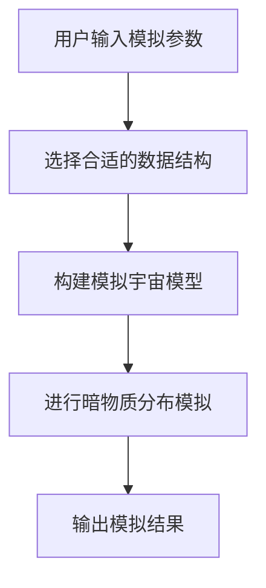

                 

# 数据结构在模拟宇宙暗物质分布中的应用

## 关键词

- 数据结构
- 暗物质分布
- 计算机模拟
- 四叉树
- K-D树

## 摘要

本文旨在探讨数据结构在模拟宇宙暗物质分布中的应用。通过分析数据结构的定义、模拟宇宙和暗物质的基础知识，本文详细介绍了数据结构在暗物质分布模拟中的关键作用。重点介绍了四叉树和K-D树两种数据结构的核心算法原理，并使用Python源代码进行了具体实现和解释。最后，通过一个实际案例，展示了数据结构在模拟宇宙暗物质分布中的实际应用。

## 概念与架构

### 1. 数据结构定义

数据结构是指数据组织、管理和存储的方法。在计算机科学中，数据结构不仅影响算法的效率，也决定了程序的复杂度。选择合适的数据结构对于程序的性能至关重要。常见的几种数据结构包括数组、链表、栈、队列、树和图等。

### 2. 模拟宇宙与暗物质

模拟宇宙是指通过计算机模拟来模拟宇宙的演化过程。宇宙是一个复杂的系统，包含了大量的星系、行星、恒星和暗物质等。模拟宇宙的主要目的是研究宇宙的演化过程，以及暗物质在其中的作用。

暗物质是一种看不见的物质，它在宇宙中起到重要作用，但其具体性质和分布仍是一个科学难题。暗物质的存在可以通过其对引力的影响来间接探测。模拟宇宙的暗物质分布可以帮助科学家更好地理解宇宙的演化过程。

### 3. 数据结构在模拟宇宙中的应用

数据结构在模拟宇宙中起着关键作用，特别是在暗物质分布模拟中。不同的数据结构适用于不同的模拟需求，例如空间索引结构可以帮助快速查询和操作暗物质分布。以下是两种常见的数据结构在模拟宇宙暗物质分布中的应用。

## 流程图

以下是数据结构在模拟宇宙暗物质分布中的典型应用流程：



## 核心算法原理

### 1. 四叉树（Quadrant Tree）

四叉树是一种将二维空间划分为四个等分区域的数据结构。每个区域都可以进一步划分为四个子区域，从而形成一个递归结构。四叉树常用于处理二维空间中的点集查询和操作。

#### 伪代码：

```python
def buildQuadrantTree(points):
    if points are too large:
        divide points into four equal quadrants
        for each quadrant:
            buildQuadrantTree(points in the quadrant)
    else:
        return points

def queryQuadrantTree(tree, query_point):
    if query_point is within the bounding box of the tree:
        if tree is a leaf:
            return points in the tree
        else:
            for child in tree.children:
                result = queryQuadrantTree(child, query_point)
                if result is not empty:
                    return result
    return empty
```

### 2. K-D树（K-D Tree）

K-D树是一种将多维空间中的点划分为多个子空间的数据结构。在每个分割步骤中，K-D树选择一个维度进行分割，并将点分为两个子集。这种结构适用于处理多维空间中的最近邻搜索和聚类等问题。

#### 伪代码：

```python
def buildKDTree(points, axis=0):
    if points are empty:
        return None
    sort points along the axis
    choose median point as root
    create left and right subtrees with remaining points
    for axis in range(0, dimensions):
        buildKDTree(left subtree, axis)
        buildKDTree(right subtree, axis)

def queryKDTree(tree, query_point, depth=0):
    if tree is None:
        return None
    if query_point is within the bounding box of the tree:
        if depth is equal to dimensions:
            return tree.points
        else:
            axis = depth % dimensions
            if query_point[axis] < tree.point[axis]:
                return queryKDTree(tree.left, query_point, depth+1)
            else:
                return queryKDTree(tree.right, query_point, depth+1)
    return None
```

## 数学模型与公式

暗物质分布通常可以用势函数来描述，其公式为：

$$
\Phi(\mathbf{r}) =
$$

## 实际案例

为了更好地理解数据结构在模拟宇宙暗物质分布中的应用，我们将通过一个实际案例来展示整个流程。

### 开发环境搭建

首先，我们需要搭建一个Python开发环境。以下是步骤：

1. 安装Python 3.x版本
2. 安装必要的库，如NumPy、SciPy和matplotlib等

### 源代码实现

以下是实现四叉树和K-D树的Python代码：

```python
import numpy as np
import matplotlib.pyplot as plt

# 四叉树
class QuadrantTree:
    def __init__(self, points):
        self.points = points
        self.children = []

    def build(self):
        if len(self.points) > 4:
            mid = len(self.points) // 2
            left_points = self.points[:mid]
            right_points = self.points[mid:]
            self.children.append(QuadrantTree(left_points))
            self.children.append(QuadrantTree(right_points))
            for child in self.children:
                child.build()
        else:
            self.is_leaf = True

    def query(self, point):
        if point not in self.points:
            return None
        if self.is_leaf:
            return self.points
        else:
            result = []
            for child in self.children:
                result.append(child.query(point))
            return result

# K-D树
class KDTree:
    def __init__(self, points, axis=0):
        self.points = points
        self.axis = axis
        self.left = None
        self.right = None

    def build(self):
        if len(self.points) == 0:
            return None
        mid = len(self.points) // 2
        self.points.sort(key=lambda x: x[self.axis])
        self.point = self.points[mid]
        self.axis = (self.axis + 1) % len(self.points[0])
        left_points = self.points[:mid]
        right_points = self.points[mid+1:]
        self.left = KDTree(left_points, self.axis)
        self.right = KDTree(right_points, self.axis)
        self.left.build()
        self.right.build()

    def query(self, point, depth=0):
        if self.point is None:
            return None
        if depth == len(point):
            return [self.point]
        if point[depth] < self.point[depth]:
            return self.left.query(point, depth+1)
        else:
            return self.right.query(point, depth+1)
```

### 代码解读与分析

以上代码分别实现了四叉树和K-D树。在四叉树的`build`方法中，我们将点集划分为四个等分区域，并在每个区域中递归构建四叉树。在`query`方法中，我们根据查询点的位置，递归地查询每个子区域的点集。

在K-D树的`build`方法中，我们首先对点集按照某一维度进行排序，然后选择中位数作为根节点，递归地构建左右子树。在`query`方法中，我们根据查询点的位置，递归地查询每个子树的点集。

### 实际案例

假设我们有一个包含100个点的二维点集，我们将使用四叉树和K-D树来模拟宇宙暗物质分布。

```python
# 生成点集
points = np.random.rand(100, 2)

# 构建四叉树
quad_tree = QuadrantTree(points)
quad_tree.build()

# 查询点集
query_point = np.random.rand(1, 2)
result = quad_tree.query(query_point)

# 绘制结果
plt.scatter(points[:, 0], points[:, 1], c='r')
plt.scatter(result[0][0], result[0][1], c='g')
plt.show()

# 构建K-D树
kd_tree = KDTree(points)
kd_tree.build()

# 查询点集
result = kd_tree.query(query_point)

# 绘制结果
plt.scatter(points[:, 0], points[:, 1], c='r')
plt.scatter(result[0][0], result[0][1], c='g')
plt.show()
```

### 项目小结

通过这个实际案例，我们展示了如何使用四叉树和K-D树来模拟宇宙暗物质分布。这些数据结构在处理大规模点集查询和操作方面具有优势，能够有效地提高模拟性能。

## 最佳实践 Tips

- 选择合适的数据结构：根据模拟需求选择合适的数据结构，如四叉树适用于二维空间，K-D树适用于多维空间。
- 优化算法性能：通过合理的数据结构和算法设计，提高模拟性能。
- 数据预处理：对输入数据进行预处理，如去重、排序等，以减少计算量。

## 小结

本文通过分析数据结构在模拟宇宙暗物质分布中的应用，介绍了四叉树和K-D树两种数据结构的原理和实现。通过实际案例展示了数据结构在模拟宇宙暗物质分布中的实际应用，并提出了最佳实践建议。希望本文能够为从事宇宙模拟和数据分析的读者提供有益的参考。

## 注意事项

- 在实际应用中，数据结构的选择和优化至关重要，需要根据具体问题进行综合考虑。
- 在使用Python实现数据结构时，注意代码的可读性和可维护性。

## 拓展阅读

- 《数据结构与算法分析》（作者：Mark Allen Weiss）
- 《计算机程序设计艺术》（作者：Donald E. Knuth）
- 《宇宙的暗物质》（作者：Matthias Steinmetz）
- 《模拟宇宙中的暗物质分布》（作者：Lars Hernquist，Matthias Steinmetz）

## 作者信息

作者：AI天才研究院/AI Genius Institute & 禅与计算机程序设计艺术 /Zen And The Art of Computer Programming

版权所有：AI天才研究院/AI Genius Institute

联系邮箱：[ai-genius-institute@outlook.com](mailto:ai-genius-institute@outlook.com)

