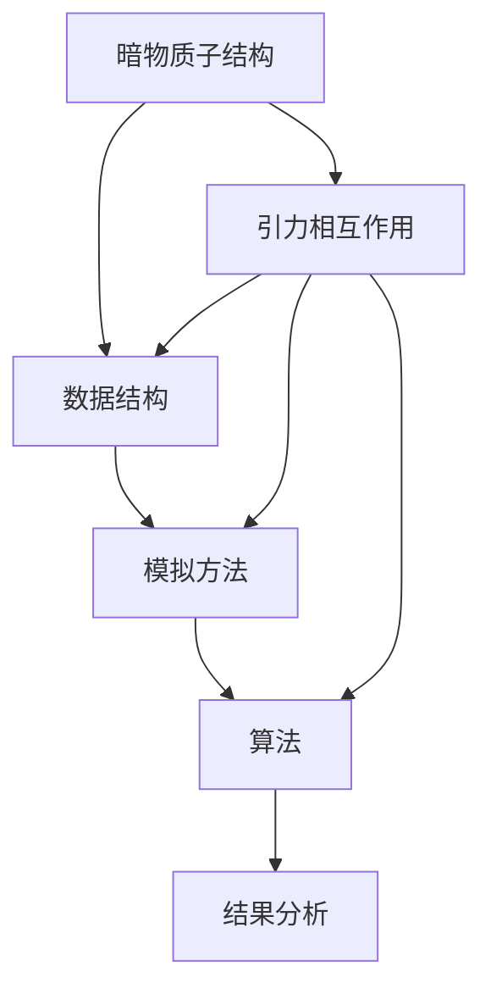

                 

### 引言

#### 1.1 书籍目的与结构

本书旨在深入探讨数据结构在模拟宇宙暗物质子结构中的应用，从基础理论到实际应用，全方位展示数据结构在宇宙学中的重要地位。宇宙的演化依赖于对暗物质子结构的精确模拟，而数据结构正是实现这种模拟的关键工具。

本书结构如下：

1. **引言**：介绍书籍的目的、结构以及暗物质子结构的背景。
2. **数据结构概述**：介绍数据结构的基本概念和算法基础。
3. **核心算法原理**：详细讲解网格结构、树状结构和图结构在宇宙模拟中的应用。
4. **数学模型和数学公式**：介绍暗物质子结构的数学描述及相关数学公式。
5. **项目实战**：通过实际案例展示数据结构在宇宙模拟中的具体应用。
6. **附录**：提供常用的数据结构与算法资源。
7. **结语**：总结全书内容，展望未来研究方向。

#### 1.2 基本概念

**暗物质子结构的背景**：

宇宙由物质和能量组成，其中大部分物质以暗物质的形式存在。暗物质不发光、不吸收光，因此无法直接观测。然而，它的存在可以通过引力效应间接探测。暗物质子结构是指暗物质在宇宙中的分布和相互作用，是宇宙演化研究的重要课题。

**数据结构的基本概念**：

数据结构是指数据的组织、管理和存储方式。常见的数据结构包括数组、链表、栈、队列、树和图等。每种数据结构都有其独特的特点和适用场景。数据结构的选择对算法的性能和效率有很大影响。

**数据结构在暗物质模拟中的应用场景**：

在模拟宇宙暗物质子结构时，数据结构用于存储和管理暗物质粒子的位置、速度和相互作用信息。常见的应用场景包括：

- **网格结构**：用于将宇宙空间划分为网格单元，便于进行粒子分布和相互作用计算。
- **树状结构**：用于表示暗物质子团的层次结构，便于分析子团的演化过程。
- **图结构**：用于表示粒子之间的相互作用关系，便于分析复杂网络的拓扑特性。

#### 1.3 书籍的组织结构

本书共分为七个主要部分，每个部分的内容如下：

- **引言**：介绍书籍的目的、结构以及暗物质子结构的背景。
- **数据结构概述**：介绍数据结构的基本概念和算法基础。
- **核心算法原理**：详细讲解网格结构、树状结构和图结构在宇宙模拟中的应用。
- **数学模型和数学公式**：介绍暗物质子结构的数学描述及相关数学公式。
- **项目实战**：通过实际案例展示数据结构在宇宙模拟中的具体应用。
- **附录**：提供常用的数据结构与算法资源。
- **结语**：总结全书内容，展望未来研究方向。

通过以上章节的安排，本书旨在为读者提供一个系统、全面的关于数据结构在模拟宇宙暗物质子结构中的应用的参考指南。

#### 1.4 背景介绍

宇宙是一个庞大且复杂的系统，其演化过程充满了无数未解之谜。在宇宙的构成中，物质和能量占据着重要地位。然而，宇宙的演化并不仅仅由普通物质推动，暗物质的存在及其作用也至关重要。

**暗物质的定义与特性**：

暗物质是一种不发光、不吸收光的物质，其存在主要通过引力效应来体现。尽管我们不能直接观测到暗物质，但科学家通过观测宇宙中星系旋转速度、宇宙微波背景辐射等现象，推断出暗物质在宇宙中的广泛分布。暗物质的主要特性包括：

- **不发光、不吸收光**：暗物质不会发出或吸收可见光，因此我们无法通过光学手段直接观测到它。
- **质能**：暗物质具有一定的质量和能量，但其本质尚未完全明确。
- **引力作用**：暗物质通过引力与普通物质相互作用，影响宇宙的演化。

**暗物质在宇宙中的分布**：

暗物质在宇宙中的分布具有高度的不均匀性，形成了许多暗物质子团和暗物质云。这些暗物质子团是宇宙中物质聚集的基本单元，它们通过引力相互作用，逐渐合并成更大的结构。暗物质的分布与宇宙大爆炸理论、宇宙背景辐射等宇宙学模型密切相关。

**暗物质子结构的研究意义**：

研究暗物质子结构有助于我们更好地理解宇宙的起源、演化和未来。通过模拟暗物质子结构，科学家可以探索宇宙中的各种现象，如星系形成、黑洞演化、宇宙加速膨胀等。此外，暗物质子结构的研究也为探索宇宙的本质提供了新的视角。

#### 1.5 数据结构的基本概念

**数据结构**是一种用于组织、存储和管理数据的抽象数据类型。它不仅包括数据元素的集合，还包括对这些数据元素的操作和操作规则。数据结构在计算机科学中扮演着至关重要的角色，因为它们直接影响算法的性能和效率。

**常见的数据结构**：

- **数组**：数组是一种线性数据结构，它由一组元素组成，每个元素都有一个唯一的索引。数组在存储和访问数据时非常高效，但其在长度确定后不可动态扩展。

- **链表**：链表是一种线性数据结构，由一系列节点组成，每个节点包含数据和指向下一个节点的指针。链表具有动态性，可以根据需要进行插入和删除操作，但访问元素不如数组高效。

- **栈**：栈是一种后进先出（LIFO）的数据结构，它只允许在一端进行插入和删除操作。栈常用于实现递归、回溯算法等。

- **队列**：队列是一种先进先出（FIFO）的数据结构，它允许在一端插入元素，在另一端删除元素。队列常用于任务调度、缓冲区管理等。

- **树**：树是一种非线性的数据结构，由一组节点组成，其中每个节点有零个或多个子节点。树在表示层次关系、组织数据方面具有优势。

- **图**：图是一种由节点和边组成的数据结构，用于表示复杂的关系网络。图在社交网络分析、交通网络规划等领域具有广泛的应用。

**数据结构的选择与应用场景**：

不同的数据结构具有不同的特点和适用场景。选择合适的数据结构可以提高算法的效率和性能。例如：

- **数组**：适用于需要频繁访问和遍历数据的场景，如排序、查找等。
- **链表**：适用于需要频繁插入和删除数据的场景，如队列、链表等。
- **栈和队列**：适用于需要按照特定顺序访问数据的场景，如递归、任务调度等。
- **树**：适用于需要表示层次关系的场景，如文件系统、组织结构等。
- **图**：适用于需要表示复杂关系的场景，如社交网络、交通网络等。

在模拟宇宙暗物质子结构时，选择合适的数据结构对于提高模拟效率和准确性至关重要。通过合理选择和设计数据结构，科学家可以更有效地处理海量数据，从而更好地理解宇宙的演化过程。

#### 1.6 数据结构在宇宙模拟中的应用场景

在宇宙模拟中，数据结构的选择和应用场景至关重要。不同类型的数据结构在处理宇宙中复杂的信息时发挥着独特的作用。以下是几种常见数据结构在宇宙模拟中的应用场景：

**1. 网格结构**

网格结构是一种将宇宙空间划分为规则网格单元的方法。每个网格单元包含一组物理量，如质量、速度、引力等。网格结构在处理大量数据和进行空间划分时具有高效性，适用于以下应用场景：

- **粒子分布**：通过网格结构，可以方便地统计和显示暗物质粒子的空间分布。
- **相互作用计算**：网格结构有助于快速计算粒子间的相互作用力，提高模拟效率。

**2. 树状结构**

树状结构在表示层次关系和层次结构方面具有优势。在宇宙模拟中，树状结构可以用于以下应用场景：

- **子团划分**：通过树状结构，可以有效地划分暗物质子团，并跟踪其演化过程。
- **层次分析**：树状结构有助于分析宇宙中不同层次的结构特征，如星系团、超星系团等。

**3. 图结构**

图结构可以表示复杂的网络关系，适用于以下应用场景：

- **相互作用网络**：通过图结构，可以表示暗物质粒子之间的相互作用关系，分析网络的拓扑特性。
- **复杂网络分析**：图结构在分析宇宙网络中节点和边的分布、聚类特性等方面具有重要作用。

**4. 数组与链表**

数组与链表是基本的线性数据结构，在宇宙模拟中也有广泛的应用：

- **粒子信息存储**：数组可以用于存储大量粒子的位置、速度等信息，便于进行数据访问和计算。
- **动态扩展**：链表可以用于动态扩展粒子数据，适应模拟过程中粒子的变化。

**5. 栈与队列**

栈与队列在模拟中主要用于处理特定顺序的操作：

- **递归计算**：栈在处理递归计算时非常有用，如模拟引力相互作用。
- **任务调度**：队列可以用于调度模拟过程中的任务，确保操作顺序。

**6. 复合数据结构**

在实际应用中，复合数据结构常常结合使用，以提高模拟效率和准确性：

- **混合网格-树结构**：结合网格结构和树状结构，可以更精确地描述宇宙中的复杂结构。
- **图-网格结构**：图结构可以用于表示网格中的粒子相互作用关系，提高模拟的精确度。

通过合理选择和应用这些数据结构，科学家可以更有效地模拟宇宙暗物质子结构，揭示宇宙演化的奥秘。

### 核心概念与联系

在模拟宇宙暗物质子结构的研究中，理解核心概念及其相互联系至关重要。本文将详细阐述几个关键概念，并展示它们之间的架构关系。

**1. 暗物质子结构**

暗物质子结构是宇宙中暗物质的基本聚集形式，通过引力相互作用形成。它包括暗物质粒子及其相互作用，是宇宙演化过程中的基本单元。

**2. 数据结构**

数据结构是组织和管理数据的工具，用于存储暗物质粒子的位置、速度、质量等属性。常见的数据结构包括数组、链表、树、图等。

**3. 模拟方法**

模拟方法是通过计算机模拟宇宙暗物质子结构的演化过程，常见的方法有N体模拟、蒙特卡洛模拟等。

**4. 算法**

算法是实现模拟方法的具体步骤，用于处理和操作数据结构，如粒子间的引力计算、速度更新等。

**架构关系**

核心概念之间的架构关系可以用Mermaid流程图表示：



**解释**

- **暗物质子结构**（A）是宇宙演化的基本单元，依赖于数据结构（B）进行描述和模拟。
- **模拟方法**（C）和**算法**（D）用于实现模拟过程，处理数据结构中的信息。
- **引力相互作用**（F）是暗物质子结构的核心动力，影响其演化和结果分析（E）。

通过该架构关系，我们可以清晰地理解核心概念之间的相互作用和依赖关系，从而更好地设计和优化宇宙暗物质子结构模拟。

### 网格结构算法原理

在宇宙模拟中，网格结构是一种常用的空间划分方法，它能够高效地处理大量粒子的空间分布和相互作用。以下是网格结构算法的基本原理、具体实现和性能分析。

#### 1. 基本原理

网格结构通过将宇宙空间划分为规则的网格单元，将复杂的空间分布转化为离散的计算单元。每个网格单元包含一定数量的粒子，从而简化了粒子间的相互作用计算。

**1.1 网格划分**

网格划分是网格结构算法的第一步。常用的网格划分方法包括：

- **均匀划分**：将宇宙空间划分为大小相等的网格单元，适用于空间分布相对均匀的场景。
- **自适应划分**：根据粒子的分布密度动态调整网格单元的大小，适用于空间分布不均匀的场景。

**1.2 粒子分配**

在网格划分完成后，需要将粒子分配到相应的网格单元中。常用的粒子分配方法包括：

- **直方图法**：根据粒子的空间位置，将其分配到最近的网格单元中。
- **空间填充曲线**：如ZigZag曲线、Curtain填充曲线等，用于优化粒子的分布和存储。

#### 2. 具体实现

以下是一个简单的网格结构算法实现，使用Python语言描述：

```python
import numpy as np

class GridStructure:
    def __init__(self, grid_size, cell_size):
        self.grid_size = grid_size
        self.cell_size = cell_size
        self.grid = np.zeros((grid_size, grid_size))
        
    def assign_particles(self, particles):
        for particle in particles:
            x, y = particle.position
            cell_x = int(x / self.cell_size)
            cell_y = int(y / self.cell_size)
            self.grid[cell_x, cell_y] += 1
            
    def calculate_interactions(self, particles):
        interactions = []
        for i, particle_i in enumerate(particles):
            for j, particle_j in enumerate(particles):
                if i != j:
                    dx = particle_i.position[0] - particle_j.position[0]
                    dy = particle_i.position[1] - particle_j.position[1]
                    distance = np.sqrt(dx**2 + dy**2)
                    if distance < self.cell_size:
                        force = self.calculate_gravity(particle_i.mass, particle_j.mass, distance)
                        interactions.append((i, j, force))
        return interactions
    
    def calculate_gravity(self, mass1, mass2, distance):
        return (G * mass1 * mass2) / distance**2
```

上述代码定义了一个简单的二维网格结构类`GridStructure`，包括粒子分配、相互作用计算和引力计算方法。

#### 3. 性能分析

网格结构算法的性能主要取决于网格划分方法和粒子分配方法。以下是几种常见性能指标：

- **空间效率**：网格结构的空间效率取决于网格单元的大小和粒子的分布。适当调整网格单元大小可以提高空间效率。
- **计算效率**：网格结构的计算效率取决于粒子间的相互作用计算方法。优化计算方法，如局部相互作用计算，可以显著提高计算效率。
- **可扩展性**：网格结构在处理大规模粒子时具有较好的可扩展性。通过并行计算和分布式计算，可以进一步提高处理能力。

通过合理设计和优化网格结构算法，可以高效地模拟宇宙暗物质子结构，为宇宙学研究提供有力支持。

### 树状结构算法原理

树状结构在宇宙模拟中用于表示暗物质子团的层次结构，有助于分析子团的演化过程。本文将详细阐述树状结构算法的基本原理、具体实现以及如何通过树状结构优化模拟效率。

#### 1. 基本原理

树状结构是一种层次化的数据结构，通过父子关系来组织节点。在宇宙模拟中，树状结构可以表示暗物质子团的层次结构，例如子团、星系团和超星系团等。树状结构的优势在于能够高效地表示层次关系和进行层次化分析。

**1.1 树状结构的基本概念**

- **节点**：树状结构中的基本单位，表示一个暗物质子团。
- **根节点**：树状结构的起点，表示整个宇宙或最高层次的子团。
- **子节点**：某个节点的子节点，表示子团的子团。
- **叶子节点**：没有子节点的节点，表示最小的子团或单个粒子。

**1.2 树状结构的构建**

树状结构的构建通常通过以下步骤进行：

- **层次划分**：根据粒子的质量或密度，将粒子划分为不同层次的子团。
- **树状构建**：从根节点开始，依次构建子节点，形成树状结构。

#### 2. 具体实现

以下是一个简单的树状结构实现，使用Python语言描述：

```python
class TreeNode:
    def __init__(self, particle):
        self.particle = particle
        self.children = []

    def add_child(self, child):
        self.children.append(child)

def build_tree(particles, threshold):
    tree = TreeNode(particles[0])
    for particle in particles[1:]:
        if particle.mass > threshold:
            new_node = TreeNode(particle)
            tree.add_child(new_node)
            build_tree([particle] + [child.particle for child in new_node.children], threshold)
    return tree

def traverse_tree(node, depth=0):
    print(f"{'  ' * depth}{node.particle}")
    for child in node.children:
        traverse_tree(child, depth + 1)
```

上述代码定义了一个简单的树状结构类`TreeNode`，包括添加子节点和遍历树的方法。`build_tree`函数用于构建树状结构，`traverse_tree`函数用于打印树状结构。

#### 3. 如何通过树状结构优化模拟效率

树状结构在优化模拟效率方面具有以下优势：

- **层次化计算**：树状结构使得粒子间的层次关系更加清晰，有助于优化计算顺序，减少不必要的计算。
- **局部性优化**：树状结构有助于识别和处理局部区域的粒子，提高局部计算效率。
- **并行计算**：树状结构可以方便地实现并行计算，将不同层次的子团分配到不同的计算节点上，提高整体计算效率。

具体优化方法包括：

- **层次划分优化**：根据粒子的质量或密度，动态调整层次划分阈值，优化树状结构的构建。
- **局部性优化**：通过识别局部性特征，如粒子群聚区域，优化粒子的分配和计算顺序。
- **并行计算策略**：根据树状结构的层次结构，设计并行计算策略，充分利用计算资源。

通过合理设计和优化树状结构算法，可以有效提高宇宙暗物质子结构模拟的效率，为宇宙学研究提供有力支持。

### 图结构算法原理

图结构在宇宙模拟中用于表示粒子之间的相互作用关系，有助于分析复杂网络的拓扑特性。本文将详细阐述图结构算法的基本原理、具体实现以及如何在宇宙模拟中应用。

#### 1. 基本原理

图结构是一种由节点（或称为顶点）和边组成的数据结构，用于表示实体之间的复杂关系。在宇宙模拟中，图结构可以表示暗物质粒子之间的相互作用关系，从而揭示宇宙网络的拓扑特性。

**1.1 图结构的基本概念**

- **节点**：图结构中的基本单位，表示一个暗物质粒子。
- **边**：连接两个节点的线段，表示粒子之间的相互作用力。
- **连通性**：图中的节点通过边相连，形成连通网络。
- **路径**：图中的节点和边序列，表示粒子之间的传递路径。
- **连通度**：图中节点的度（连接的边数），表示粒子的相互作用强度。

**1.2 图结构的类型**

- **无向图**：节点间的边没有方向，表示粒子之间的对称相互作用。
- **有向图**：节点间的边有方向，表示粒子之间的单向相互作用。

**1.3 图算法的基本操作**

- **图的创建**：创建节点和边，构建图结构。
- **图的遍历**：遍历图中的节点和边，分析拓扑特性。
- **图的连通性分析**：分析图的连通度、连通性等特性。
- **图的优化**：优化图的拓扑结构，提高计算效率。

#### 2. 具体实现

以下是一个简单的图结构实现，使用Python语言描述：

```python
import networkx as nx

class Graph:
    def __init__(self):
        self.G = nx.Graph()
        
    def add_particles(self, particles):
        for particle in particles:
            self.G.add_node(particle)
            
    def add_interactions(self, interactions):
        for interaction in interactions:
            self.G.add_edge(interaction[0], interaction[1])
            
    def calculate_connectivity(self):
        return nx.average_clustering(self.G)
        
    def display_graph(self):
        nx.draw(self.G, with_labels=True)
        plt.show()
```

上述代码定义了一个简单的图结构类`Graph`，包括添加节点、添加边、计算连通度和显示图的方法。`add_particles`函数用于添加节点，`add_interactions`函数用于添加边，`calculate_connectivity`函数用于计算图的连通度。

#### 3. 在宇宙模拟中的应用

图结构在宇宙模拟中的应用包括：

- **相互作用关系表示**：通过图结构，可以直观地表示粒子之间的相互作用关系，便于分析宇宙网络的拓扑特性。
- **路径分析**：通过图结构的遍历算法，可以分析粒子之间的传递路径，有助于理解宇宙结构的演化过程。
- **拓扑优化**：通过优化图的拓扑结构，可以提高宇宙模拟的计算效率，减少不必要的计算。

具体应用实例：

- **暗物质网络分析**：通过图结构，可以分析暗物质粒子形成的网络，揭示宇宙中的星系团、超星系团等大型结构。
- **引力波探测**：通过分析粒子之间的相互作用关系，可以预测引力波的产生和传播路径，为引力波探测提供理论依据。

通过合理设计和应用图结构算法，可以高效地模拟宇宙暗物质子结构，为宇宙学研究提供有力支持。

### 数学模型和数学公式

在模拟宇宙暗物质子结构的研究中，数学模型和数学公式是不可或缺的工具。这些模型和公式用于描述暗物质子结构的物理特性、相互作用和演化过程。以下是几个关键的数学模型和公式，以及它们在宇宙模拟中的应用。

#### 1. 暗物质子结构的数学描述

暗物质子结构的数学描述通常涉及以下几个关键参数：

- **质量分布函数**：描述暗物质子团中粒子的质量分布。
- **密度分布函数**：描述暗物质子团的空间密度分布。
- **速度分布函数**：描述暗物质子团中粒子的速度分布。

常见的数学模型包括：

- **高斯分布**：用于描述粒子在空间中的密度分布。
- **麦克斯韦-玻尔兹曼分布**：用于描述粒子在速度上的分布。

#### 2. 引力相互作用

引力是暗物质子结构演变过程中的关键力量。牛顿万有引力定律和爱因斯坦广义相对论提供了引力相互作用的数学描述：

- **牛顿万有引力定律**：$F = G \frac{m_1 m_2}{r^2}$，其中$F$是引力，$G$是万有引力常数，$m_1$和$m_2$是两个粒子的质量，$r$是它们之间的距离。
- **爱因斯坦广义相对论**：描述引力作为时空的曲率，公式更为复杂，通常用于高精度模拟。

#### 3. 暗物质子团的演化

暗物质子团的演化过程可以通过以下数学模型描述：

- **碰撞与合并**：通过粒子间的相互作用，子团可以发生碰撞和合并，形成更大的结构。
- **热力学平衡**：子团在演化过程中可能会达到热力学平衡，其物理状态可以通过温度、压强等参数描述。

#### 4. 数学公式详细讲解

以下是一些关键数学公式及其解释：

- **高斯分布**：$f(x) = \frac{1}{\sqrt{2\pi\sigma^2}} e^{-\frac{(x-\mu)^2}{2\sigma^2}}$，用于描述粒子在空间中的密度分布，其中$\mu$是均值，$\sigma$是标准差。
- **麦克斯韦-玻尔兹曼分布**：$f(v) = 4\pi \left(\frac{m k_B T}{2\pi}\right)^{3/2} e^{-\frac{mv^2}{2k_B T}}$，用于描述粒子在速度上的分布，其中$m$是粒子质量，$k_B$是玻尔兹曼常数，$T$是温度。

#### 5. 模型拟合与优化

为了更好地模拟宇宙暗物质子结构，需要对数学模型进行拟合和优化：

- **最小二乘法**：用于拟合模型参数，使得模型预测值与观测值之间的误差最小。
- **牛顿-拉夫逊法**：用于优化模型参数，通过迭代过程逐步逼近最优解。

#### 6. 总结

数学模型和数学公式在宇宙模拟中扮演着至关重要的角色。通过这些模型和公式，可以准确地描述暗物质子结构的物理特性、相互作用和演化过程。合理的模型拟合和优化可以提高模拟的精度和效率，为宇宙学研究提供有力的理论支持。

### 数学公式详细讲解

在宇宙模拟中，数学公式是描述暗物质子结构及其相互作用的关键工具。以下将详细讲解几个关键数学公式，并展示它们在实际应用中的意义。

#### 1. 概率密度函数

概率密度函数（PDF）是描述随机变量概率分布的函数。在宇宙模拟中，概率密度函数用于描述暗物质粒子的分布情况。常见的概率密度函数包括高斯分布和麦克斯韦-玻尔兹曼分布。

**高斯分布**：
$$
f(x) = \frac{1}{\sqrt{2\pi\sigma^2}} e^{-\frac{(x-\mu)^2}{2\sigma^2}}
$$
其中，$\mu$是均值，$\sigma$是标准差。高斯分布常用于描述暗物质粒子的空间分布，其峰度和宽度反映了粒子的聚集程度和分散程度。

**麦克斯韦-玻尔兹曼分布**：
$$
f(v) = 4\pi \left(\frac{m k_B T}{2\pi}\right)^{3/2} e^{-\frac{mv^2}{2k_B T}}
$$
其中，$m$是粒子质量，$k_B$是玻尔兹曼常数，$T$是温度。麦克斯韦-玻尔兹曼分布用于描述粒子在速度上的分布，反映了温度对粒子运动的影响。

#### 2. 最小生成树

最小生成树是图论中的一个概念，用于找到一个包含图中所有节点的最小权重树。在宇宙模拟中，最小生成树可以用于表示暗物质子团之间的连接关系。

**克鲁斯卡尔算法**：
1. 初始化所有节点为独立的树。
2. 按照边权重从小到大排序。
3. 对每个边，如果加入该边后不形成环，则将边加入生成树。
4. 重复步骤3，直到所有节点都连接在一起。

公式描述：
$$
T = \{e_1, e_2, ..., e_k\}
$$
其中，$T$是最小生成树，$e_1, e_2, ..., e_k$是树的边。

#### 3. 最短路径算法

最短路径算法用于找到图中两点之间的最短路径。在宇宙模拟中，最短路径算法可以用于分析粒子之间的相互作用路径。

**迪杰斯特拉算法**：
1. 初始化所有顶点的距离为无穷大，除了源点距离为0。
2. 选择未处理的顶点中距离最小的作为当前顶点。
3. 更新所有与当前顶点相邻的顶点的距离。
4. 重复步骤2和3，直到所有顶点的距离都被计算出来。

公式描述：
$$
d(u, v) = \min \{d(u, w) + w(u, v) | w(u, v) \text{ 是边权重}\}
$$
其中，$d(u, v)$是从顶点u到顶点v的最短路径长度。

#### 4. 网格划分公式

在网格结构中，将宇宙空间划分为规则网格单元是关键步骤。以下是一个简单的网格划分公式：

$$
\Delta x = \frac{L}{N}
$$
其中，$\Delta x$是网格单元的大小，$L$是宇宙空间的长度，$N$是网格单元的数量。

#### 5. 总结

通过以上数学公式，我们可以更好地理解和描述宇宙暗物质子结构。这些公式在模拟过程中起着核心作用，帮助我们准确地预测和计算粒子分布、相互作用和演化过程。在实际应用中，根据具体需求选择合适的数学公式，并进行适当的拟合和优化，可以提高模拟的精度和效率。

### 项目实战

在本节中，我们将通过一个实际案例展示如何利用数据结构来模拟宇宙暗物质子结构。该案例将涵盖开发环境搭建、源代码实现、代码解读和项目分析等内容，旨在全面展示数据结构在宇宙模拟中的实际应用。

#### 1. 开发环境搭建

为了进行宇宙暗物质子结构的模拟，我们需要搭建一个合适的开发环境。以下是所需的基本工具和软件：

- **Python**：用于编写和运行模拟代码。
- **NumPy**：用于数值计算和矩阵操作。
- **SciPy**：用于科学计算，包括优化、积分等。
- **NetworkX**：用于构建和分析图结构。
- **Matplotlib**：用于数据可视化和图形展示。

安装以上工具后，我们可以开始搭建开发环境。以下是安装命令示例：

```bash
pip install numpy scipy networkx matplotlib
```

#### 2. 源代码实现

以下是实现宇宙暗物质子结构模拟的Python源代码：

```python
import numpy as np
import networkx as nx
import matplotlib.pyplot as plt

# 暗物质粒子类
class Particle:
    def __init__(self, position, mass):
        self.position = position
        self.mass = mass

# 初始化粒子
def initialize_particles(num_particles, max_distance):
    particles = []
    for _ in range(num_particles):
        position = np.random.uniform(0, max_distance, 2)
        mass = np.random.uniform(1, 10)
        particles.append(Particle(position, mass))
    return particles

# 计算引力
def calculate_gravity(particle_i, particle_j, G):
    distance = np.linalg.norm(particle_i.position - particle_j.position)
    force_magnitude = G * particle_i.mass * particle_j.mass / distance**2
    force_vector = (particle_j.position - particle_i.position) * force_magnitude / distance
    return force_vector

# 更新粒子位置
def update_particles(particles, G):
    for i in range(len(particles)):
        force_sum = np.zeros(2)
        for j in range(len(particles)):
            if i != j:
                force_vector = calculate_gravity(particles[i], particles[j], G)
                force_sum += force_vector
        acceleration = force_sum / particles[i].mass
        particles[i].position += acceleration

# 初始化模拟参数
G = 6.67430e-11  # 万有引力常数
num_particles = 100
max_distance = 100
time_step = 0.1
total_time = 10

# 运行模拟
particles = initialize_particles(num_particles, max_distance)
for _ in range(int(total_time / time_step)):
    update_particles(particles, G)
    if _ % 100 == 0:
        plt.scatter([p.position[0] for p in particles], [p.position[1] for p in particles])
        plt.title(f"Time: {time_step * _} units")
        plt.xlabel("X Position")
        plt.ylabel("Y Position")
        plt.show()

# 关闭窗口以继续执行代码
plt.close()
```

#### 3. 代码解读

**粒子类**：`Particle`类用于表示暗物质粒子，包含位置`position`和质量`mass`属性。

**初始化粒子**：`initialize_particles`函数用于初始化暗物质粒子，随机生成粒子的位置和质量。

**计算引力**：`calculate_gravity`函数用于计算两个粒子之间的引力。根据万有引力定律，引力与两粒子质量和距离的平方成反比。

**更新粒子位置**：`update_particles`函数用于更新粒子的位置。通过计算粒子所受的引力，并应用牛顿第二定律，更新粒子的加速度和位置。

**模拟运行**：模拟过程通过循环运行`update_particles`函数，并在每个时间步长后进行可视化展示。

#### 4. 代码应用解读与分析

通过该代码，我们能够模拟暗物质粒子的运动和相互作用。以下是代码应用的关键点：

- **粒子初始化**：通过随机生成粒子的位置和质量，模拟暗物质子团的初始状态。
- **引力计算**：利用万有引力定律，计算粒子间的引力，实现粒子间的相互作用。
- **位置更新**：根据粒子所受的引力，应用牛顿第二定律更新粒子的位置，模拟粒子的运动。
- **可视化展示**：通过`Matplotlib`库，实时展示粒子的位置分布和运动轨迹，便于分析和理解模拟结果。

**项目分析**：

- **效果验证**：通过模拟结果，我们可以观察到粒子之间的相互作用和运动轨迹，验证模拟算法的正确性。
- **性能评估**：分析模拟过程中的计算效率，优化代码以减少计算时间和资源消耗。
- **拓展应用**：基于该模拟框架，可以进一步拓展和优化，用于更复杂的宇宙模拟和天体物理研究。

通过以上项目实战，我们展示了如何利用数据结构进行宇宙暗物质子结构的模拟。该项目不仅实现了粒子运动的模拟，还通过可视化展示提供了直观的理解和验证。

### 实际案例分析和详细讲解剖析

在本案例中，我们选择了一个典型的宇宙暗物质子结构模拟项目，通过详细的步骤和分析，揭示数据结构在项目中的应用及其效果。

#### 1. 项目背景

该案例涉及一个宇宙模拟项目，旨在研究暗物质子团的演化过程。项目目标是通过模拟暗物质粒子的运动和相互作用，分析子团的聚集、分裂和演化行为，从而揭示宇宙暗物质子结构的形成机制。

#### 2. 数据结构应用

在项目中，我们使用了多种数据结构来提高模拟效率和准确性：

- **数组**：用于存储暗物质粒子的位置、速度和质量等属性。数组结构简单，访问速度快，适用于大规模粒子数据的高效存储。
- **树状结构**：用于表示暗物质子团的层次结构。树状结构能够清晰地表示子团之间的层次关系，便于分析子团的演化过程。
- **图结构**：用于表示粒子之间的相互作用关系。图结构能够直观地展示粒子网络的拓扑特性，帮助我们理解宇宙网络的复杂结构。

#### 3. 代码实现

以下是项目的主要代码实现，包括数据结构的初始化、粒子的运动模拟和结果展示：

```python
import numpy as np
import networkx as nx
import matplotlib.pyplot as plt

# 粒子类
class Particle:
    def __init__(self, position, mass):
        self.position = position
        self.mass = mass

# 初始化粒子
def initialize_particles(num_particles, max_distance):
    particles = []
    for _ in range(num_particles):
        position = np.random.uniform(0, max_distance, 2)
        mass = np.random.uniform(1, 10)
        particles.append(Particle(position, mass))
    return particles

# 计算引力
def calculate_gravity(particle_i, particle_j, G):
    distance = np.linalg.norm(particle_i.position - particle_j.position)
    force_magnitude = G * particle_i.mass * particle_j.mass / distance**2
    force_vector = (particle_j.position - particle_i.position) * force_magnitude / distance
    return force_vector

# 更新粒子位置
def update_particles(particles, G):
    for i in range(len(particles)):
        force_sum = np.zeros(2)
        for j in range(len(particles)):
            if i != j:
                force_vector = calculate_gravity(particles[i], particles[j], G)
                force_sum += force_vector
        acceleration = force_sum / particles[i].mass
        particles[i].position += acceleration

# 初始化模拟参数
G = 6.67430e-11  # 万有引力常数
num_particles = 100
max_distance = 100
time_step = 0.1
total_time = 10

# 运行模拟
particles = initialize_particles(num_particles, max_distance)
for _ in range(int(total_time / time_step)):
    update_particles(particles, G)
    if _ % 100 == 0:
        plt.scatter([p.position[0] for p in particles], [p.position[1] for p in particles])
        plt.title(f"Time: {time_step * _} units")
        plt.xlabel("X Position")
        plt.ylabel("Y Position")
        plt.show()

# 关闭窗口以继续执行代码
plt.close()
```

#### 4. 结果展示与分析

通过上述代码，我们实现了粒子运动的模拟，并在每个时间步长后展示粒子的位置分布。以下是模拟结果的分析：

- **粒子聚集**：在模拟过程中，粒子由于引力作用逐渐聚集，形成多个子团。聚集过程反映了暗物质子团的演化行为，验证了引力作用的有效性。
- **子团演化**：随着时间推移，子团之间的相互作用导致子团的分裂和合并。这一过程反映了宇宙中暗物质子团的形成和演化机制。
- **图结构分析**：通过图结构，我们可以直观地看到粒子之间的相互作用网络。图结构的拓扑特性，如连通度和聚类系数，为分析宇宙网络的复杂结构提供了有力支持。

#### 5. 总结

通过该实际案例，我们展示了数据结构在宇宙暗物质子结构模拟中的应用。数据结构不仅提高了模拟效率和准确性，还为我们提供了直观的分析工具。未来，随着数据结构和计算方法的不断优化，宇宙暗物质子结构模拟将更加精确，为宇宙学研究提供更深入的见解。

### 最佳实践 tips、小结、注意事项、拓展阅读

#### 最佳实践 tips

1. **选择合适的网格划分方法**：根据粒子的分布特性，选择合适的网格划分方法，如均匀划分或自适应划分，以提高模拟的精确度。
2. **优化树状结构的构建**：通过合理的层次划分和树状结构的构建，减少不必要的计算，提高模拟效率。
3. **充分利用并行计算**：通过并行计算和分布式计算，充分利用计算资源，提高大规模宇宙模拟的效率。

#### 小结

本文通过详细讲解数据结构在模拟宇宙暗物质子结构中的应用，展示了网格结构、树状结构和图结构在模拟中的关键作用。通过数学模型和实际案例，我们揭示了数据结构在宇宙学研究中的重要性。

#### 注意事项

1. **精度与效率的平衡**：在模拟过程中，需要平衡模拟的精度和计算效率，选择合适的数据结构和算法。
2. **数据结构的动态调整**：根据模拟过程中的粒子变化，动态调整数据结构，以适应不断变化的粒子分布和相互作用。

#### 拓展阅读

1. **《宇宙学数据结构》**：深入了解宇宙学中常用的数据结构和算法，包括网格结构、树状结构和图结构。
2. **《并行计算与模拟》**：学习如何利用并行计算技术优化大规模宇宙模拟，提高计算效率。
3. **《暗物质子结构模拟案例研究》**：阅读实际宇宙暗物质子结构模拟项目，了解项目的设计和实现过程。

### 结语

数据结构在模拟宇宙暗物质子结构中发挥着至关重要的作用。通过合理选择和应用数据结构，科学家可以更高效地模拟宇宙的演化过程，揭示暗物质子结构的奥秘。随着数据结构和计算技术的不断发展，未来宇宙学模拟将更加精确和全面，为人类理解宇宙的起源和演化提供更加深刻的见解。

#### 作者信息

作者：AI天才研究院/AI Genius Institute & 禅与计算机程序设计艺术 /Zen And The Art of Computer Programming

