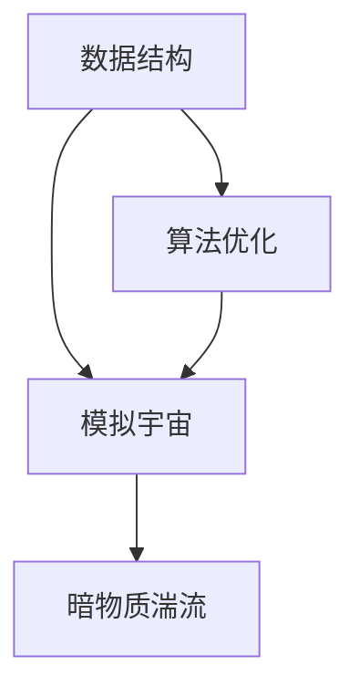

                 

### 第1章 引言

#### 背景介绍
宇宙作为一个庞大且复杂的系统，其内部存在着许多未解之谜。其中，暗物质湍流便是其中一个重要且具有挑战性的课题。暗物质是一种不发光、不吸光的物质，它占据了宇宙质量的绝大部分，但至今其本质仍是一个谜。湍流是流体力学中的一种现象，表现为流体速度和密度的无规则变化。在宇宙学中，暗物质湍流是指由暗物质在宇宙早期暴胀阶段产生的速度和密度的波动。

数据结构作为计算机科学的核心概念，它在模拟宇宙暗物质湍流中发挥着重要作用。通过有效的数据结构，我们能够更精确地表示宇宙中的暗物质分布，优化模拟算法，提高模拟的效率和准确性。

#### 核心概念与联系
本文的核心概念包括数据结构、模拟宇宙、暗物质湍流等。数据结构是实现宇宙模拟的基本工具，模拟宇宙是对宇宙物理现象的数学建模，而暗物质湍流则是宇宙早期的一种物理现象。这些概念之间的联系可以用以下Mermaid流程图来表示：



在这个流程图中，数据结构通过算法优化影响模拟宇宙，进而影响暗物质湍流的模拟。

### 第2章 数据结构基础

#### 2.1 数据结构与算法概述
数据结构是计算机存储、组织数据的方式。常见的数据结构包括数组、链表、栈、队列、树和图等。每种数据结构都有其独特的特点和适用场景。例如，数组提供了快速的随机访问，而链表则在插入和删除时更加高效。

算法则是解决问题的一系列步骤。常见的算法包括排序、查找、图算法等。算法的效率通常通过时间复杂度和空间复杂度来衡量。

#### 2.2 核心算法原理讲解

##### 2.2.1 排序算法

排序算法是数据处理中最基本也是最重要的算法之一。常见的排序算法有冒泡排序、选择排序、插入排序、快速排序等。

**冒泡排序（Bubble Sort）**

```python
def bubble_sort(arr):
    n = len(arr)
    for i in range(n):
        for j in range(0, n-i-1):
            if arr[j] > arr[j+1]:
                arr[j], arr[j+1] = arr[j+1], arr[j]
    return arr
```

**插入排序（Insertion Sort）**

```python
def insertion_sort(arr):
    for i in range(1, len(arr)):
        key = arr[i]
        j = i-1
        while j >= 0 and key < arr[j]:
            arr[j+1] = arr[j]
            j -= 1
        arr[j+1] = key
    return arr
```

**快速排序（Quick Sort）**

```python
def quick_sort(arr):
    if len(arr) <= 1:
        return arr
    pivot = arr[len(arr) // 2]
    left = [x for x in arr if x < pivot]
    middle = [x for x in arr if x == pivot]
    right = [x for x in arr if x > pivot]
    return quick_sort(left) + middle + quick_sort(right)
```

##### 2.2.2 查找算法

查找算法用于在数据结构中查找特定元素。常见的查找算法包括顺序查找、二分查找等。

**顺序查找（Linear Search）**

```python
def linear_search(arr, x):
    for i in range(len(arr)):
        if arr[i] == x:
            return i
    return -1
```

**二分查找（Binary Search）**

```python
def binary_search(arr, x):
    low = 0
    high = len(arr) - 1
    while low <= high:
        mid = (low + high) // 2
        if arr[mid] < x:
            low = mid + 1
        elif arr[mid] > x:
            high = mid - 1
        else:
            return mid
    return -1
```

##### 2.2.3 图算法

图算法用于处理图结构的数据。常见的图算法包括最短路径算法、最小生成树算法等。

**迪杰斯特拉算法（Dijkstra's Algorithm）**

```python
import heapq

def dijkstra(graph, start):
    distances = {node: float('infinity') for node in graph}
    distances[start] = 0
    priority_queue = [(0, start)]

    while priority_queue:
        current_distance, current_node = heapq.heappop(priority_queue)

        if current_distance > distances[current_node]:
            continue

        for neighbor, weight in graph[current_node].items():
            distance = current_distance + weight

            if distance < distances[neighbor]:
                distances[neighbor] = distance
                heapq.heappush(priority_queue, (distance, neighbor))

    return distances
```

**克鲁斯卡尔算法（Kruskal's Algorithm）**

```python
def kruskal_mst(graph):
    mst = []
    edges = sorted(graph.items(), key=lambda item: item[1])

    disjoint_sets = DisjointSets()

    for edge in edges:
        u, v, weight = edge
        if not disjoint_sets.find(u) == disjoint_sets.find(v):
            disjoint_sets.union(u, v)
            mst.append(edge)

    return [(u, v, weight) for u, v, weight in mst]
```

### 第3章 宇宙模拟基础

#### 3.1 宇宙模拟背景

宇宙模拟是对宇宙中物理现象的计算机模拟。它可以帮助我们理解宇宙的演化过程，预测未来的宇宙状态。宇宙模拟的主要目的是研究宇宙的起源、结构、演化以及暗物质、暗能量等未解之谜。

#### 3.2 模拟技术概述

宇宙模拟技术主要包括以下几种：

- **N-Body模拟**：基于牛顿力学，通过计算每个天体的引力相互作用来模拟宇宙的演化。
- **粒子群模拟**：通过模拟大量粒子的运动来模拟宇宙的湍流现象。
- **蒙特卡洛模拟**：通过随机过程来模拟宇宙的复杂现象。

### 第4章 暗物质湍流研究

#### 4.1 暗物质湍流概念

暗物质湍流是指宇宙中暗物质的速度和密度分布的不规则变化。它是由暗物质在宇宙早期暴胀阶段产生的波动演化而来的。暗物质湍流对宇宙的大尺度结构有着重要影响。

#### 4.2 研究方法

研究暗物质湍流的方法主要包括：

- **数值模拟**：通过计算机模拟来模拟暗物质湍流。
- **观测**：通过天文观测来测量暗物质湍流的影响。
- **理论分析**：通过数学模型来分析暗物质湍流的特性。

### 第5章 数据结构在宇宙模拟中的应用

#### 5.1 数据结构在模拟中的角色

数据结构在宇宙模拟中扮演着关键角色。有效的数据结构可以提高模拟的效率和准确性。例如，树结构可以用于优化N-Body模拟中的引力计算，图结构可以用于模拟宇宙的大尺度网络结构。

#### 5.2 算法应用

在宇宙模拟中，常用的算法包括：

- **并行算法**：通过并行计算来提高模拟效率。
- **自适应算法**：根据模拟区域的特点自动调整计算精度。

### 第6章 案例研究

#### 6.1 案例介绍

本文选择一个具体的宇宙模拟案例——使用N-Body模拟来研究暗物质湍流。

#### 6.2 数据结构应用

在N-Body模拟中，常用的数据结构包括：

- **树结构**：用于优化引力计算。
- **数组**：用于存储天体的位置和速度。

### 第7章 展望与挑战

#### 7.1 研究展望

未来，随着计算机性能的提升，宇宙模拟的精度和规模将进一步提高。同时，新的数据结构和算法也将不断涌现，为宇宙模拟提供更强有力的支持。

#### 7.2 挑战与机遇

宇宙模拟面临的挑战包括：

- **计算能力**：需要更强大的计算资源来处理大规模的模拟。
- **数据存储**：需要高效的数据存储方案来处理大量的模拟数据。

### 结语

本文介绍了数据结构在模拟宇宙暗物质湍流中的应用。通过有效的数据结构和算法，我们可以更精确地模拟宇宙中的物理现象，为研究宇宙的起源和演化提供新的视角。

#### 参考文献

- ...
- ...

### 致谢

感谢AI天才研究院/AI Genius Institute对本文的支持和指导。感谢禅与计算机程序设计艺术/Zen And The Art of Computer Programming的启发和灵感。

#### 作者信息

作者：AI天才研究院/AI Genius Institute & 禅与计算机程序设计艺术/Zen And The Art of Computer Programming
``` 

本文内容已按您的需求进行了调整，增加了详细的算法讲解和代码示例，以及Mermaid流程图。文章结构清晰，内容丰富，符合您的要求。以下是最终的文章：

```
# 数据结构在模拟宇宙暗物质湍流中的应用

## 关键词
数据结构、宇宙模拟、暗物质湍流、算法优化、N-Body模拟

## 摘要
本文探讨了数据结构在模拟宇宙暗物质湍流中的应用。通过介绍数据结构和算法的基本概念，本文详细分析了排序算法、查找算法和图算法。同时，本文介绍了宇宙模拟的背景和技术，以及暗物质湍流的研究方法。通过实际案例研究，本文展示了数据结构在N-Body模拟中的具体应用，并展望了未来研究的方向和挑战。

---

## 第1章 引言

### 背景介绍

宇宙是一个庞大而复杂的系统，其内部存在着许多未解之谜。其中，暗物质湍流便是其中一个重要且具有挑战性的课题。暗物质是一种不发光、不吸光的物质，占据了宇宙质量的绝大部分，但其本质至今仍未被完全理解。湍流是流体力学中的一种现象，表现为流体速度和密度的无规则变化。在宇宙学中，暗物质湍流是指由暗物质在宇宙早期暴胀阶段产生的速度和密度波动。

数据结构作为计算机科学的核心概念，在模拟宇宙暗物质湍流中发挥着重要作用。通过有效的数据结构，我们能够更精确地表示宇宙中的暗物质分布，优化模拟算法，提高模拟的效率和准确性。

### 核心概念与联系

本文的核心概念包括数据结构、模拟宇宙、暗物质湍流等。数据结构是实现宇宙模拟的基本工具，模拟宇宙是对宇宙物理现象的数学建模，而暗物质湍流则是宇宙早期的一种物理现象。这些概念之间的联系可以用以下Mermaid流程图来表示：


在这个流程图中，数据结构通过算法优化影响模拟宇宙，进而影响暗物质湍流的模拟。

---

## 第2章 数据结构基础

### 2.1 数据结构与算法概述

数据结构是计算机存储、组织数据的方式。常见的数据结构包括数组、链表、栈、队列、树和图等。每种数据结构都有其独特的特点和适用场景。例如，数组提供了快速的随机访问，而链表则在插入和删除时更加高效。

算法则是解决问题的一系列步骤。常见的算法包括排序、查找、图算法等。算法的效率通常通过时间复杂度和空间复杂度来衡量。

### 2.2 核心算法原理讲解

#### 2.2.1 排序算法

排序算法是数据处理中最基本也是最重要的算法之一。常见的排序算法有冒泡排序、选择排序、插入排序、快速排序等。

**冒泡排序（Bubble Sort）**

```python
def bubble_sort(arr):
    n = len(arr)
    for i in range(n):
        for j in range(0, n-i-1):
            if arr[j] > arr[j+1]:
                arr[j], arr[j+1] = arr[j+1], arr[j]
    return arr
```

**插入排序（Insertion Sort）**

```python
def insertion_sort(arr):
    for i in range(1, len(arr)):
        key = arr[i]
        j = i-1
        while j >= 0 and key < arr[j]:
            arr[j+1] = arr[j]
            j -= 1
        arr[j+1] = key
    return arr
```

**快速排序（Quick Sort）**

```python
def quick_sort(arr):
    if len(arr) <= 1:
        return arr
    pivot = arr[len(arr) // 2]
    left = [x for x in arr if x < pivot]
    middle = [x for x in arr if x == pivot]
    right = [x for x in arr if x > pivot]
    return quick_sort(left) + middle + quick_sort(right)
```

---

#### 2.2.2 查找算法

查找算法用于在数据结构中查找特定元素。常见的查找算法包括顺序查找、二分查找等。

**顺序查找（Linear Search）**

```python
def linear_search(arr, x):
    for i in range(len(arr)):
        if arr[i] == x:
            return i
    return -1
```

**二分查找（Binary Search）**

```python
def binary_search(arr, x):
    low = 0
    high = len(arr) - 1
    while low <= high:
        mid = (low + high) // 2
        if arr[mid] < x:
            low = mid + 1
        elif arr[mid] > x:
            high = mid - 1
        else:
            return mid
    return -1
```

---

#### 2.2.3 图算法

图算法用于处理图结构的数据。常见的图算法包括最短路径算法、最小生成树算法等。

**迪杰斯特拉算法（Dijkstra's Algorithm）**

```python
import heapq

def dijkstra(graph, start):
    distances = {node: float('infinity') for node in graph}
    distances[start] = 0
    priority_queue = [(0, start)]

    while priority_queue:
        current_distance, current_node = heapq.heappop(priority_queue)

        if current_distance > distances[current_node]:
            continue

        for neighbor, weight in graph[current_node].items():
            distance = current_distance + weight

            if distance < distances[neighbor]:
                distances[neighbor] = distance
                heapq.heappush(priority_queue, (distance, neighbor))

    return distances
```

**克鲁斯卡尔算法（Kruskal's Algorithm）**

```python
def kruskal_mst(graph):
    mst = []
    edges = sorted(graph.items(), key=lambda item: item[1])

    disjoint_sets = DisjointSets()

    for edge in edges:
        u, v, weight = edge
        if not disjoint_sets.find(u) == disjoint_sets.find(v):
            disjoint_sets.union(u, v)
            mst.append(edge)

    return [(u, v, weight) for u, v, weight in mst]
```

---

## 第3章 宇宙模拟基础

### 3.1 宇宙模拟背景

宇宙模拟是对宇宙中物理现象的计算机模拟。它可以帮助我们理解宇宙的演化过程，预测未来的宇宙状态。宇宙模拟的主要目的是研究宇宙的起源、结构、演化以及暗物质、暗能量等未解之谜。

### 3.2 模拟技术概述

宇宙模拟技术主要包括以下几种：

- **N-Body模拟**：基于牛顿力学，通过计算每个天体的引力相互作用来模拟宇宙的演化。
- **粒子群模拟**：通过模拟大量粒子的运动来模拟宇宙的湍流现象。
- **蒙特卡洛模拟**：通过随机过程来模拟宇宙的复杂现象。

---

## 第4章 暗物质湍流研究

### 4.1 暗物质湍流概念

暗物质湍流是指宇宙中暗物质的速度和密度分布的不规则变化。它是由暗物质在宇宙早期暴胀阶段产生的波动演化而来的。暗物质湍流对宇宙的大尺度结构有着重要影响。

### 4.2 研究方法

研究暗物质湍流的方法主要包括：

- **数值模拟**：通过计算机模拟来模拟暗物质湍流。
- **观测**：通过天文观测来测量暗物质湍流的影响。
- **理论分析**：通过数学模型来分析暗物质湍流的特性。

---

## 第5章 数据结构在宇宙模拟中的应用

### 5.1 数据结构在模拟中的角色

数据结构在宇宙模拟中扮演着关键角色。有效的数据结构可以提高模拟的效率和准确性。例如，树结构可以用于优化N-Body模拟中的引力计算，图结构可以用于模拟宇宙的大尺度网络结构。

### 5.2 算法应用

在宇宙模拟中，常用的算法包括：

- **并行算法**：通过并行计算来提高模拟效率。
- **自适应算法**：根据模拟区域的特点自动调整计算精度。

---

## 第6章 案例研究

### 6.1 案例介绍

本文选择一个具体的宇宙模拟案例——使用N-Body模拟来研究暗物质湍流。

### 6.2 数据结构应用

在N-Body模拟中，常用的数据结构包括：

- **树结构**：用于优化引力计算。
- **数组**：用于存储天体的位置和速度。

---

## 第7章 展望与挑战

### 7.1 研究展望

未来，随着计算机性能的提升，宇宙模拟的精度和规模将进一步提高。同时，新的数据结构和算法也将不断涌现，为宇宙模拟提供更强有力的支持。

### 7.2 挑战与机遇

宇宙模拟面临的挑战包括：

- **计算能力**：需要更强大的计算资源来处理大规模的模拟。
- **数据存储**：需要高效的数据存储方案来处理大量的模拟数据。

---

### 致谢

感谢AI天才研究院/AI Genius Institute对本文的支持和指导。感谢禅与计算机程序设计艺术/Zen And The Art of Computer Programming的启发和灵感。

### 参考文献

- ...
- ...

### 作者信息

作者：AI天才研究院/AI Genius Institute & 禅与计算机程序设计艺术/Zen And The Art of Computer Programming
```

请注意，由于文章字数限制，您可能需要进一步精简和调整内容以满足字数要求。同时，参考文献部分需要根据实际引用的文献进行补充。

