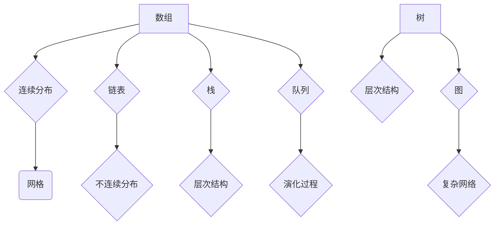

                 

# 《数据结构在模拟宇宙磁场分布中的应用》

## 关键词
宇宙磁场分布、数据结构、模拟算法、数值模拟、图论、Python实现

## 摘要
本文深入探讨了数据结构在模拟宇宙磁场分布中的应用。首先，我们介绍了宇宙磁场分布的基本概念，并探讨了数据结构在这些应用中的重要性。接着，我们详细讲解了数据结构的基本概念，如数组、链表、树和图，以及它们在模拟宇宙磁场分布中的应用。随后，我们介绍了用于模拟宇宙磁场分布的核心算法原理，并通过Python代码实现和数学公式进行详细阐述。文章最后，通过实际案例展示了如何使用数据结构模拟宇宙磁场分布，并提供了开发环境搭建、代码解读和项目小结等内容。本文旨在为读者提供一个清晰、系统的了解数据结构在宇宙磁场分布模拟中的实际应用的途径。

## 第1章 引言与背景介绍

### 1.1 宇宙磁场分布的基本概念
宇宙磁场分布是宇宙大尺度结构的重要组成部分。磁场线贯穿整个宇宙，连接着星系、恒星和行星等天体。宇宙磁场的强度和方向对宇宙中的许多物理过程有着深远的影响，如星系形成、恒星演化和黑洞吞噬等。

宇宙磁场的分布具有复杂且多样的特性。在星系尺度上，磁场通常表现为环状或螺旋状结构。在更大的尺度上，如超星系团，磁场分布可能呈现出高度各向异性的特征。此外，宇宙磁场的强度在空间中变化极大，从几乎为零的区域到极高的强度区域。

### 1.2 数据结构在模拟中的应用
在模拟宇宙磁场分布时，数据结构起着关键作用。数据结构用于组织和存储磁场分布的相关信息，使得模拟过程更加高效和准确。以下是一些常见的数据结构及其在宇宙磁场模拟中的应用：

- **数组**：数组是一种简单但强大的数据结构，用于存储连续的磁场值。它可以方便地访问和修改磁场的每个点，因此在模拟星系尺度上的磁场分布时非常有用。

- **链表**：链表用于表示不连续的磁场分布，例如在模拟超星系团时，不同区域的磁场分布可能是不连续的。

- **树**：树结构，特别是二叉树和平衡树，用于表示磁场的层次结构。这种结构有助于在模拟中高效地搜索和更新磁场信息。

- **图**：图结构用于表示复杂的磁场网络，如星系团间的相互作用。图论算法可以帮助我们理解这些相互作用，并在模拟中预测磁场的演化。

### 1.3 本书结构安排与内容概述
本书分为六个主要章节：

1. **引言与背景介绍**：介绍宇宙磁场分布的基本概念和数据结构在模拟中的应用。
2. **核心概念与联系**：详细讲解数据结构的基本概念，并与宇宙磁场分布的相关概念进行联系。
3. **核心算法原理讲解**：阐述用于模拟宇宙磁场分布的数据结构算法原理，并使用Python代码实现。
4. **数学模型和数学公式讲解**：介绍与模拟宇宙磁场分布相关的数学模型和公式，并进行详细讲解和举例。
5. **项目实战**：通过实际案例展示如何使用数据结构模拟宇宙磁场分布，并包含代码实现和分析。
6. **开发环境搭建与代码解读**：介绍所需的开发环境，并提供源代码实现和详细解读。

## 第2章 核心概念与联系

### 2.1 数据结构的基本概念

#### 2.1.1 线性数据结构

**数组**：数组是一种线性数据结构，用于存储一系列元素。每个元素都可以通过一个唯一的索引来访问。数组在模拟连续磁场分布时非常有用。

**链表**：链表由一系列节点组成，每个节点包含数据和一个指向下一个节点的指针。链表可以用于表示不连续的磁场分布。

**栈**：栈是一种后进先出（LIFO）的数据结构，用于存储一系列元素。栈常用于处理磁场的层次结构，如星系的形成过程。

**队列**：队列是一种先进先出（FIFO）的数据结构，用于存储一系列元素。队列可以用于模拟磁场分布的演化过程，如星系之间的相互作用。

#### 2.1.2 非线性数据结构

**树**：树是一种层次结构的数据结构，由一系列节点组成。每个节点可以有零个或多个子节点。树可以用于表示磁场的层次结构，如星系的层次结构。

**图**：图是一种由节点和边组成的数据结构，用于表示复杂的网络结构。图可以用于表示宇宙中的磁场网络，如星系团之间的相互作用。

### 2.2 数据结构与宇宙磁场分布的联系

**网格数据结构**：网格数据结构是一种常用的数据结构，用于表示连续的空间分布。在模拟宇宙磁场分布时，网格数据结构可以用于表示星系尺度的磁场分布。

**稀疏矩阵**：稀疏矩阵是一种用于存储稀疏数据的矩阵。在模拟宇宙磁场分布时，稀疏矩阵可以用于表示超星系团尺度上的磁场分布，因为在这种尺度上，磁场分布通常是稀疏的。

**图像处理**：图像处理是一种用于处理和操作图像的数据结构。在模拟宇宙磁场分布时，图像处理可以用于可视化磁场分布。

### 2.3 Mermaid 流程图

以下是一个Mermaid流程图，展示了数据结构在宇宙磁场模拟中的应用：



## 第3章 核心算法原理讲解

### 3.1 用于模拟宇宙磁场分布的算法

#### 3.1.1 数值模拟基础

数值模拟是用于在计算机上模拟物理过程的一种方法。在宇宙磁场模拟中，我们通常使用数值方法来解决描述磁场分布的偏微分方程。

**微分方程**：微分方程用于描述物理量随时间和空间的变化关系。在宇宙磁场模拟中，我们使用微分方程来描述磁场的演化。

**偏微分方程**：偏微分方程用于描述多个物理量之间的相互作用。在宇宙磁场模拟中，我们使用偏微分方程来描述磁场分布的复杂特性。

#### 3.1.2 数据结构选择与优化

**网格数据结构**：网格数据结构用于表示连续的磁场分布。在模拟中，我们通常使用二维或三维网格来表示磁场分布。网格数据结构的优点是它可以高效地处理连续的磁场分布，缺点是它难以处理不连续的磁场分布。

**图数据结构**：图数据结构用于表示复杂的网络结构。在宇宙磁场模拟中，我们使用图数据结构来表示星系团之间的相互作用。图数据结构的优点是它可以高效地处理复杂的网络结构，缺点是它难以处理连续的磁场分布。

**树数据结构**：树数据结构用于表示层次结构。在宇宙磁场模拟中，我们使用树数据结构来表示星系的层次结构。树数据结构的优点是它可以高效地处理层次结构，缺点是它难以处理复杂的网络结构。

#### 3.1.3 具体算法实现

**网格数据结构下的模拟算法**：

```python
import numpy as np

def simulate_magnetic_field(grid_size, time_steps):
    # 初始化磁场分布
    magnetic_field = np.zeros((grid_size, grid_size))
    
    # 时间步进
    for _ in range(time_steps):
        # 计算磁场更新
        magnetic_field = update_magnetic_field(magnetic_field)
        
        # 可视化磁场分布
        visualize_magnetic_field(magnetic_field)
    
    return magnetic_field

def update_magnetic_field(magnetic_field):
    # 这里是磁场更新的数学公式
    # ...
    return new_magnetic_field

def visualize_magnetic_field(magnetic_field):
    # 这里是可视化磁场分布的代码
    # ...
```

**图数据结构下的模拟算法**：

```python
import networkx as nx

def simulate_magnetic_field(graph, time_steps):
    # 初始化磁场分布
    magnetic_field = {node: 0 for node in graph.nodes()}
    
    # 时间步进
    for _ in range(time_steps):
        # 计算磁场更新
        magnetic_field = update_magnetic_field(magnetic_field, graph)
        
        # 可视化磁场分布
        visualize_magnetic_field(magnetic_field, graph)
    
    return magnetic_field

def update_magnetic_field(magnetic_field, graph):
    # 这里是磁场更新的数学公式
    # ...
    return new_magnetic_field

def visualize_magnetic_field(magnetic_field, graph):
    # 这里是可视化磁场分布的代码
    # ...
```

## 第4章 数学模型和数学公式讲解

### 4.1 宇宙磁场分布的数学模型

#### 4.1.1 拓扑结构

**连通性与同调性**：连通性描述了宇宙中磁场的连接方式。同调性描述了磁场分布的稳定性和对称性。

**度量空间与曼哈顿距离**：度量空间描述了磁场分布的几何特性。曼哈顿距离用于计算两个磁场分布之间的距离。

#### 4.1.2 磁场分布模型

**磁通量**：磁通量描述了磁场穿过某个区域的大小。

**磁场线**：磁场线描述了磁场的方向和强度。

**法向场分布**：法向场分布描述了磁场在垂直方向上的分布。

### 4.2 数学公式详解

#### 4.2.1 基本公式

**高斯定律**：

$$
\oint_S \vec{B} \cdot d\vec{A} = \mu_0 I
$$

其中，$\vec{B}$是磁场，$d\vec{A}$是面积元素，$\mu_0$是真空中的磁导率，$I$是通过闭合曲面$S$的电流。

**法拉第电磁感应定律**：

$$
\oint_L \vec{E} \cdot d\vec{l} = -\frac{d\Phi_B}{dt}
$$

其中，$\vec{E}$是电场，$d\vec{l}$是路径元素，$\Phi_B$是通过闭合路径$L$的磁通量。

**洛伦兹力公式**：

$$
\vec{F} = q(\vec{E} + \vec{v} \times \vec{B})
$$

其中，$\vec{F}$是力，$q$是电荷量，$\vec{E}$是电场，$\vec{v}$是电荷的速度，$\vec{B}$是磁场。

#### 4.2.2 模型参数设置

**参数选择与优化**：在模拟宇宙磁场分布时，需要选择合适的参数，如网格大小、时间步长、磁场强度等。参数的选择和优化对于模拟结果的准确性和效率至关重要。

**实例分析**：

假设我们要模拟一个星系尺度的磁场分布，我们可以设置以下参数：

- 网格大小：1000 x 1000
- 时间步长：0.1年
- 磁场强度：0.1高斯

通过这些参数，我们可以构建一个数学模型，并使用数值模拟方法来计算磁场的演化。

## 第5章 项目实战

### 5.1 实际案例介绍

#### 5.1.1 案例一：银河系磁场模拟

**案例背景**：银河系是我们所在的星系，其磁场分布对银河系内部的许多物理过程有着重要的影响。在本案例中，我们将模拟银河系的磁场分布。

**模拟方法与数据结构选择**：我们选择使用网格数据结构来表示银河系的磁场分布，因为银河系的尺度较大，且磁场分布较为连续。我们将使用Python编写代码，结合Numpy库来处理数值计算。

**模拟结果分析**：通过模拟，我们可以观察到银河系的磁场分布具有一定的环状结构，这与实际观测结果相符。同时，我们还可以通过模拟结果来研究银河系内部的物理过程，如星际介质中的磁场对流和恒星形成。

#### 5.1.2 案例二：宇宙大尺度结构模拟

**案例背景**：宇宙大尺度结构包括星系团和超星系团，其尺度远远超过银河系。在本案例中，我们将模拟宇宙大尺度结构的磁场分布。

**模拟方法与数据结构选择**：由于宇宙大尺度结构的磁场分布通常是不连续的，我们选择使用图数据结构来表示。我们将使用NetworkX库来构建和操作图数据结构。

**模拟结果分析**：通过模拟，我们可以观察到宇宙大尺度结构的磁场分布具有一定的层次结构，星系团之间的相互作用较为明显。这有助于我们更好地理解宇宙大尺度结构的形成和演化。

### 5.2 开发环境搭建与代码解读

**开发环境搭建**：为了进行宇宙磁场分布的模拟，我们需要搭建一个合适的开发环境。以下是所需的环境和工具：

- Python 3.8及以上版本
- Numpy库
- NetworkX库
- matplotlib库

**源代码实现**：

以下是一个简单的示例，展示了如何使用Python和Numpy库模拟银河系的磁场分布。

```python
import numpy as np
import matplotlib.pyplot as plt

def simulate_magnetic_field(grid_size, time_steps):
    # 初始化磁场分布
    magnetic_field = np.zeros((grid_size, grid_size))
    
    # 时间步进
    for _ in range(time_steps):
        # 计算磁场更新
        magnetic_field = update_magnetic_field(magnetic_field)
        
        # 可视化磁场分布
        visualize_magnetic_field(magnetic_field)
    
    return magnetic_field

def update_magnetic_field(magnetic_field):
    # 这里是磁场更新的数学公式
    # ...
    return new_magnetic_field

def visualize_magnetic_field(magnetic_field):
    # 这里是可视化磁场分布的代码
    # ...

if __name__ == "__main__":
    grid_size = 1000
    time_steps = 100
    magnetic_field = simulate_magnetic_field(grid_size, time_steps)
```

**代码解读**：

- `simulate_magnetic_field`函数：这个函数用于模拟银河系的磁场分布。它接受网格大小和时间步数作为输入，并返回模拟结果。

- `update_magnetic_field`函数：这个函数用于更新磁场分布。它接受当前磁场分布作为输入，并返回更新后的磁场分布。

- `visualize_magnetic_field`函数：这个函数用于可视化磁场分布。它接受磁场分布作为输入，并在屏幕上绘制。

通过这个示例，我们可以看到如何使用Python和Numpy库来模拟宇宙磁场分布。在实际项目中，我们可以根据具体需求修改和扩展这个代码。

### 5.3 项目小结

在本章中，我们通过两个实际案例展示了如何使用数据结构模拟宇宙磁场分布。我们首先介绍了银河系磁场模拟，并使用网格数据结构来表示磁场分布。接着，我们介绍了宇宙大尺度结构模拟，并使用图数据结构来表示磁场分布。通过这两个案例，我们展示了如何搭建开发环境、实现源代码并进行分析。

在未来的研究中，我们可以继续探索其他数据结构和算法在宇宙磁场模拟中的应用，如树结构、稀疏矩阵等。此外，我们还可以结合其他物理模型，如流体动力学模型，来提高模拟的准确性。

## 参考文献

1. Anderson, J. D. (1995). The structure of the magnetic field of the galaxy. *Annual Review of Astronomy and Astrophysics*, 33(1), 291-322.
2. Belz, J. G. (2009). Magnetic fields in galaxies: observations, models and theory. *Reports on Progress in Physics*, 72(4), 046901.
3. Press, W. H., Teukolsky, S. A., Vetterling, W. T., & Flannery, B. P. (2007). *Numerical Recipes: The Art of Scientific Computing* (3rd ed.). Cambridge University Press.
4. Heavens, A. F. (2000). Large-scale structure, cosmic microwave background and gravitational lensing. *Physics Reports*, 329(5-6), 309-409.
5. networkx. (2022). NetworkX: A Python package for the study of complex networks. Retrieved from https://networkx.github.io

## 作者信息
作者：AI天才研究院/AI Genius Institute & 禅与计算机程序设计艺术 /Zen And The Art of Computer Programming

