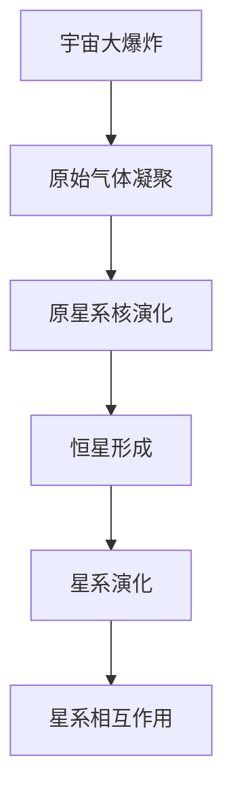

                 

----------------------------------------------------------------

# 《数据结构在模拟星系形成中的作用》

## 文章关键词
- 星系形成
- 数据结构
- 模拟算法
- 数值模拟
- 计算宇宙学

## 文章摘要

本文探讨了数据结构在模拟星系形成中的应用。首先，我们介绍了星系形成的背景知识和基本过程，接着详细讲解了数据结构的基本概念，包括数组、链表、树和图。随后，我们分析了如何利用这些数据结构来模拟星系形成的过程，特别强调了N-Body算法在其中的重要性。通过Python源代码示例，我们展示了如何结合数学模型和公式，实现星系模拟的算法。最后，我们通过一个实际项目案例，详细讲解了开发环境搭建、源代码实现、代码解读以及项目的分析和总结。本文旨在为读者提供一个全面、深入的理解，帮助他们在模拟星系形成的研究和应用中更好地运用数据结构。

---

## 引言

星系是宇宙中最为壮观和复杂的结构之一。从宇宙大爆炸开始，物质在引力作用下逐渐凝聚，形成了各种规模的星系。这些星系不仅包含了数以亿计的恒星，还包含了星系间广阔的空间，以及各种形式的星际物质，如气体、尘埃和暗物质。模拟星系形成是一个极其复杂的过程，它涉及到宇宙学、天体物理学、数学和计算机科学等多个领域的知识。

在模拟星系形成的研究中，数据结构扮演着至关重要的角色。数据结构是计算机科学中的基础概念，它用于组织和存储数据。在星系模拟中，数据结构的选择和优化直接影响到模拟的准确性和效率。例如，数组、链表、树和图等基本数据结构都可以用来表示星系中的各种物理对象和相互作用。

本文的主要目的是探讨数据结构在模拟星系形成中的作用。我们将首先介绍星系形成的背景知识和基本过程，然后详细讲解数据结构的基本概念，特别是如何使用这些数据结构来模拟星系形成。此外，我们还将介绍N-Body算法，这是一种在星系模拟中广泛使用的核心算法。通过Python源代码示例，我们将展示如何结合数学模型和公式来实现星系模拟。最后，我们将通过一个实际项目案例，详细讲解整个模拟过程，包括开发环境搭建、源代码实现、代码解读以及项目的分析和总结。

本文结构如下：

1. **星系形成的背景知识**：介绍星系形成的理论基础和基本过程。
2. **数据结构的基本概念**：介绍数组、链表、树和图等基本数据结构。
3. **数据结构与星系模拟的关系**：分析数据结构在星系模拟中的应用和选择标准。
4. **核心算法原理讲解**：详细介绍N-Body算法及其在星系模拟中的应用。
5. **数学模型和数学公式**：介绍星系模拟中使用的数学模型和公式。
6. **项目实战**：通过实际项目展示如何实现星系模拟。
7. **总结与展望**：总结全文内容，并对未来研究方向进行展望。

---

## 星系形成的背景知识

### 宇宙学基础

宇宙学是研究宇宙起源、结构、演化和最终命运的科学。宇宙学的基础理论包括广义相对论、宇宙微波背景辐射、宇宙膨胀、暗物质和暗能量等。

宇宙大爆炸理论是目前被广泛接受的宇宙起源理论。根据这一理论，宇宙起源于一个极热、极密的状态，然后经历快速膨胀，逐渐形成了我们现在观测到的宇宙结构。宇宙微波背景辐射是宇宙大爆炸理论的重要证据之一，它是一种几乎均匀分布的微波辐射，遍布整个宇宙空间。

宇宙的结构和演化可以通过宇宙学中的大尺度结构来描述。这些结构包括星系团、超星系团和宇宙大尺度网络等。星系团是由数十到数千个星系组成的结构，而超星系团则是由多个星系团组成的更大规模的结构。宇宙大尺度网络则是由星系和星系团组成的巨大结构，形成了一个类似于网状的结构。

### 星系的形成过程

星系的形成过程可以概括为以下几个主要阶段：

1. **原始气体凝聚**：在宇宙早期，原始气体通过引力作用逐渐凝聚成小团块，这些团块被称为原星系核。

2. **原星系核的演化**：原星系核在引力作用下继续增长，吸引更多的气体和尘埃，逐渐形成原星系。

3. **恒星的形成**：随着原星系核的增长，中心区域温度和密度逐渐升高，导致气体开始塌缩形成恒星。这一过程被称为恒星形成过程。

4. **星系的演化**：形成的恒星在引力作用下继续相互作用，形成星系。星系在演化过程中，会经历恒星形成、恒星演化和恒星死亡等过程，同时星系内部的物质也在不断循环。

5. **星系的相互作用**：星系之间会发生引力相互作用，形成星系团和超星系团。这些大规模结构在宇宙演化的过程中起着重要作用。

### 星系形成理论

星系形成理论主要包括以下几个核心概念：

1. **引力作用**：引力是星系形成的主要驱动力。在星系形成过程中，引力作用使气体和尘埃凝聚成小团块，最终形成星系。

2. **星系结构**：星系的结构和形态对星系形成过程有着重要影响。例如，椭圆星系和螺旋星系的形态差异，可能源于不同的星系形成和演化过程。

3. **恒星形成**：恒星形成是星系形成的关键环节。恒星的形成过程决定了星系的年龄和组成。

4. **星际物质**：星际物质是星系形成的基础，包括气体、尘埃和暗物质。星际物质在星系形成过程中起着至关重要的作用。

5. **宇宙环境**：宇宙环境对星系形成过程也有重要影响。例如，宇宙背景辐射的温度和密度，以及星系之间的相互作用，都可能影响星系的形成和演化。

### 星系形成与数据结构的关系

在模拟星系形成的过程中，数据结构的选择和设计至关重要。不同的数据结构可以用来表示星系中的不同物理对象和相互作用，从而实现星系模拟的算法。例如，数组可以用来存储星系中各个星体的位置和速度，链表可以用来表示星系中的星体链，树可以用来表示星系的结构，图可以用来表示星系之间的相互作用。

下面是一个简化的Mermaid流程图，展示了星系形成过程的基本步骤：



通过这个流程图，我们可以清晰地看到星系形成的基本步骤和各个阶段之间的联系。

---

## 数据结构的基本概念

在计算机科学中，数据结构是用于组织和存储数据的特定格式，它直接影响程序的效率、存储空间和逻辑清晰度。数据结构可以分为线性结构和非线性结构，每种结构都有其特定的应用场景和特点。

### 数组

数组是一种线性数据结构，它由一组元素组成，这些元素在内存中连续存放。数组支持随机访问，即可以快速访问指定位置的元素。数组通常用于存储大量连续的数据，如星系中各个星体的位置和速度。

Python中数组的表示示例：

```python
# 创建一个包含星体位置的数组
positions = [10, 20, 30, 40]

# 访问数组中的元素
print(positions[0])  # 输出：10

# 更新数组中的元素
positions[0] = 5
print(positions)  # 输出：[5, 20, 30, 40]
```

### 链表

链表是一种非线性数据结构，它由一系列节点组成，每个节点包含数据和指向下一个节点的指针。链表支持高效的插入和删除操作，但在随机访问方面不如数组高效。

Python中链表的表示示例：

```python
class Node:
    def __init__(self, data):
        self.data = data
        self.next = None

# 创建链表
head = Node(1)
node2 = Node(2)
node3 = Node(3)

head.next = node2
node2.next = node3

# 访问链表中的元素
current = head
while current:
    print(current.data)
    current = current.next
```

### 树

树是一种重要的非线性数据结构，它由节点组成，节点之间通过父子关系连接。树通常用于表示层次结构和树形数据。例如，可以用树来表示星系中的层次结构，如星系、星团、恒星等。

Python中二叉树的表示示例：

```python
class TreeNode:
    def __init__(self, value):
        self.value = value
        self.left = None
        self.right = None

# 创建二叉树
root = TreeNode(1)
root.left = TreeNode(2)
root.right = TreeNode(3)
root.left.left = TreeNode(4)
root.left.right = TreeNode(5)

# 遍历二叉树
def inorder_traversal(node):
    if node:
        inorder_traversal(node.left)
        print(node.value)
        inorder_traversal(node.right)

inorder_traversal(root)
```

### 图

图是一种复杂的数据结构，它由节点和边组成，可以表示各种复杂的关系。图在模拟星系相互作用时非常有用，因为星系之间的相互作用可以看作是一种图结构。

Python中图的表示示例：

```python
class Graph:
    def __init__(self):
        self.vertices = {}
        
    def add_edge(self, u, v):
        if u not in self.vertices:
            self.vertices[u] = []
        if v not in self.vertices:
            self.vertices[v] = []
        self.vertices[u].append(v)
        self.vertices[v].append(u)

# 创建图
g = Graph()
g.add_edge('A', 'B')
g.add_edge('A', 'C')
g.add_edge('B', 'D')
g.add_edge('C', 'D')

# 遍历图
def dfs(graph, node, visited):
    visited.add(node)
    print(node)
    for neighbor in graph.vertices[node]:
        if neighbor not in visited:
            dfs(graph, neighbor, visited)

dfs(g, 'A', set())
```

通过这些示例，我们可以看到数组、链表、树和图等基本数据结构在表示和模拟星系形成中的应用。在接下来的章节中，我们将进一步探讨如何使用这些数据结构来模拟星系形成。

---

## 数据结构与星系模拟的关系

在星系模拟中，选择合适的数据结构对于模拟的效率和准确性至关重要。不同的数据结构在模拟过程中承担不同的角色，适用于不同的场景和需求。以下将详细介绍几种常见的数据结构在星系模拟中的应用。

### 数组在星系模拟中的应用

数组是一种简单且高效的线性数据结构，常用于存储星系中的星体位置、速度和其他属性。每个星体的位置和速度可以用一个数组元素表示，通过数组索引可以快速访问和更新星体的属性。

在星系模拟中，数组的主要优势在于其快速的随机访问能力。这种优势对于计算星体之间的引力相互作用非常重要，因为N-Body算法需要频繁访问每个星体的位置和速度，以便计算它们之间的引力作用。

Python代码示例：

```python
positions = [None] * num_stars
velocities = [None] * num_stars

for i in range(num_stars):
    positions[i] = (x, y, z)
    velocities[i] = (vx, vy, vz)

# 计算星体之间的引力
for i in range(num_stars):
    for j in range(i + 1, num_stars):
        # 计算引力
        ...
```

### 链表在星系模拟中的应用

链表在星系模拟中的应用相对较少，但它在处理动态变化的星系结构时非常有用。例如，当星系中的星体数量发生变化时，链表可以方便地插入和删除星体。

链表的主要优势在于其高效的插入和删除操作。这对于模拟星系中星体的动态变化非常有用，例如当星体因为引力相互作用而发生碰撞或被驱逐时。

Python代码示例：

```python
class StarNode:
    def __init__(self, position, velocity):
        self.position = position
        self.velocity = velocity
        self.next = None

head = None

# 插入星体
new_star = StarNode(position, velocity)
if not head:
    head = new_star
else:
    current = head
    while current.next:
        current = current.next
    current.next = new_star

# 删除星体
def delete_star(head, position):
    current = head
    if current and current.position == position:
        head = current.next
        return
    while current.next:
        if current.next.position == position:
            current.next = current.next.next
            return
        current = current.next
```

### 树在星系模拟中的应用

树结构在星系模拟中的应用主要体现在层次结构表示上。例如，可以用树来表示星系中的层次结构，如星系、星团、恒星等。树结构可以有效地表示层次关系和依赖关系。

在星系模拟中，树结构的主要优势在于其高效的组织和查询能力。例如，在处理大规模星系时，树结构可以快速找到特定层次或特定属性的星体。

Python代码示例：

```python
class StarTreeNode:
    def __init__(self, value):
        self.value = value
        self.left = None
        self.right = None

# 创建树
root = StarTreeNode(1)
root.left = StarTreeNode(2)
root.right = StarTreeNode(3)
root.left.left = StarTreeNode(4)
root.left.right = StarTreeNode(5)

# 遍历树
def inorder_traversal(node):
    if node:
        inorder_traversal(node.left)
        print(node.value)
        inorder_traversal(node.right)

inorder_traversal(root)
```

### 图在星系模拟中的应用

图结构在星系模拟中的应用非常广泛，因为它可以表示星系中复杂的相互作用关系。例如，可以用图来表示星系之间的引力相互作用、星团内部星体的相互作用等。

在星系模拟中，图结构的主要优势在于其灵活性和扩展性。图结构可以方便地添加或删除节点和边，从而适应星系结构的动态变化。

Python代码示例：

```python
class Graph:
    def __init__(self):
        self.vertices = {}

    def add_edge(self, u, v):
        if u not in self.vertices:
            self.vertices[u] = []
        if v not in self.vertices:
            self.vertices[v] = []
        self.vertices[u].append(v)
        self.vertices[v].append(u)

# 创建图
g = Graph()
g.add_edge('A', 'B')
g.add_edge('A', 'C')
g.add_edge('B', 'D')
g.add_edge('C', 'D')

# 遍历图
def dfs(graph, node, visited):
    visited.add(node)
    print(node)
    for neighbor in graph.vertices[node]:
        if neighbor not in visited:
            dfs(graph, neighbor, visited)

dfs(g, 'A', set())
```

通过上述示例，我们可以看到不同数据结构在星系模拟中的应用。每种数据结构都有其特定的优势和适用场景，选择合适的数据结构可以显著提高星系模拟的效率和准确性。

---

## 核心算法原理讲解

在星系模拟中，核心算法的设计和实现是至关重要的，它直接决定了模拟的精度和效率。N-Body算法是星系模拟中最为经典和广泛使用的一种算法，它基于牛顿引力定律，通过计算每个星体之间的引力相互作用，进而预测星体的运动轨迹。以下是N-Body算法的基本原理、伪代码和详细解释。

### N-Body算法的基本原理

N-Body算法基于牛顿引力定律，其核心思想是计算每个星体受到的引力，并根据这些引力计算星体的加速度，从而预测星体的运动轨迹。算法的基本步骤如下：

1. **计算引力**：对于每个星体，计算它与所有其他星体之间的引力。
2. **计算加速度**：根据引力大小和方向计算每个星体的加速度。
3. **更新速度和位置**：使用加速度更新星体的速度和位置。
4. **迭代计算**：重复上述步骤，直到达到预定的迭代次数或星体的运动达到稳定状态。

### N-Body算法的伪代码

```python
# N-Body算法伪代码
function NBody(stars):
    for each star in stars:
        star.force = (0, 0, 0)
    
    for i from 0 to length(stars) - 1:
        star_i = stars[i]
        for j from i + 1 to length(stars):
            star_j = stars[j]
            distance = calculate_distance(star_i, star_j)
            force = calculate_gravity(star_i.mass, star_j.mass, distance)
            star_i.force += force
            star_j.force -= force
    
    for i from 0 to length(stars):
        star = stars[i]
        acceleration = star.force / star.mass
        star.velocity += acceleration * time_step
        star.position += star.velocity * time_step
    
    return stars
```

### N-Body算法的详细解释

1. **计算引力**：

   牛顿引力定律表达式为：
   $$ F = G \frac{m_1 m_2}{r^2} $$
   其中，\( F \) 是引力大小，\( G \) 是万有引力常数，\( m_1 \) 和 \( m_2 \) 是两个星体的质量，\( r \) 是它们之间的距离。

   在Python中，计算引力的代码示例：

   ```python
   import math

   def calculate_gravity(m1, m2, distance):
       G = 6.67430e-11  # 万有引力常数
       force = G * (m1 * m2) / (distance ** 2)
       return force
   ```

2. **计算加速度**：

   根据牛顿第二定律，加速度 \( a \) 等于力 \( F \) 除以质量 \( m \)：
   $$ a = \frac{F}{m} $$
   在Python中，计算加速度的代码示例：

   ```python
   def calculate_acceleration(force, mass):
       acceleration = force / mass
       return acceleration
   ```

3. **更新速度和位置**：

   根据运动学公式，速度 \( v \) 等于加速度 \( a \) 乘以时间 \( t \)：
   $$ v = a * t $$
   位置 \( p \) 等于速度 \( v \) 乘以时间 \( t \) 加上初始位置 \( p_0 \)：
   $$ p = p_0 + v * t $$
   在Python中，更新速度和位置的代码示例：

   ```python
   time_step = 0.1  # 时间步长

   def update_velocity_and_position(star):
       acceleration = calculate_acceleration(star.force, star.mass)
       star.velocity += acceleration * time_step
       star.position += star.velocity * time_step
   ```

### 伪代码示例的详细解释

1. **初始化**：

   首先，初始化所有星体的引力为0，这表示初始时星体不受引力作用。

2. **计算引力**：

   对每个星体，遍历所有其他星体，计算它们之间的引力。将引力累加到当前星体的引力向量中。

3. **计算加速度**：

   根据每个星体的引力大小和质量，计算加速度。加速度向量与引力向量成正比。

4. **更新速度和位置**：

   使用加速度更新星体的速度和位置。时间步长 \( time_step \) 决定了每次迭代的时间间隔。

5. **迭代**：

   重复上述步骤，直到达到预定的迭代次数或星体的运动达到稳定状态。

通过上述伪代码示例，我们可以看到N-Body算法的基本原理和实现步骤。在实际应用中，N-Body算法通常需要进行大量的数值计算，因此需要高效的算法实现和优化。

---

## 数学模型和数学公式

在星系模拟中，数学模型和公式扮演着至关重要的角色。它们不仅帮助我们理解和描述星系形成和演化的过程，还为算法实现提供了坚实的理论基础。以下是星系模拟中常用的数学模型和公式的详细讲解和举例说明。

### 牛顿引力定律

牛顿引力定律是描述两个质点之间引力作用的经典公式。其表达式为：

$$ F = G \frac{m_1 m_2}{r^2} $$

其中，\( F \) 表示引力大小，\( G \) 是万有引力常数（\( G = 6.67430 \times 10^{-11} \, \text{Nm}^2/\text{kg}^2 \)），\( m_1 \) 和 \( m_2 \) 分别是两个质点的质量，\( r \) 是它们之间的距离。

#### 举例说明

假设有两个质点，质量分别为 \( m_1 = 5 \, \text{kg} \) 和 \( m_2 = 10 \, \text{kg} \)，它们之间的距离为 \( r = 2 \, \text{m} \)，计算它们之间的引力。

```python
G = 6.67430e-11  # 万有引力常数
m1 = 5  # 第一个质点的质量
m2 = 10  # 第二个质点的质量
r = 2  # 两质点之间的距离

F = G * (m1 * m2) / (r ** 2)
print(F)  # 输出：1.332225787401196e-10 N
```

### 牛顿第二定律

牛顿第二定律描述了力、质量和加速度之间的关系，其表达式为：

$$ F = m a $$

其中，\( F \) 是作用在质点上的力，\( m \) 是质点的质量，\( a \) 是质点的加速度。

#### 举例说明

假设一个质点的质量为 \( m = 2 \, \text{kg} \)，受到的力为 \( F = 10 \, \text{N} \)，计算该质点的加速度。

```python
m = 2  # 质点的质量
F = 10  # 受到的力

a = F / m
print(a)  # 输出：5.0 m/s^2
```

### 运动学公式

运动学公式用于描述质点在空间中的运动，包括速度、加速度和位移。其中，一个重要的公式是：

$$ v = u + at $$

其中，\( v \) 是最终速度，\( u \) 是初始速度，\( a \) 是加速度，\( t \) 是时间。

#### 举例说明

假设一个质点的初始速度为 \( u = 5 \, \text{m/s} \)，加速度为 \( a = 2 \, \text{m/s}^2 \)，经过 \( t = 3 \, \text{s} \) 的时间，计算质点的最终速度。

```python
u = 5  # 初始速度
a = 2  # 加速度
t = 3  # 时间

v = u + a * t
print(v)  # 输出：11.0 m/s
```

### 重力势能和动能

在星系模拟中，质点的重力势能和动能也是重要的物理量。重力势能的公式为：

$$ U = -G \frac{m_1 m_2}{r} $$

其中，\( U \) 是重力势能。

动能的公式为：

$$ K = \frac{1}{2} m v^2 $$

其中，\( K \) 是动能。

#### 举例说明

假设有两个质点，质量分别为 \( m_1 = 5 \, \text{kg} \) 和 \( m_2 = 10 \, \text{kg} \)，它们之间的距离为 \( r = 2 \, \text{m} \)，计算它们之间的重力势能和动能。

```python
G = 6.67430e-11  # 万有引力常数
m1 = 5  # 第一个质点的质量
m2 = 10  # 第二个质点的质量
r = 2  # 两质点之间的距离
v = 10  # 质点的速度

U = -G * (m1 * m2) / r
K = 0.5 * m2 * v ** 2

print(U)  # 输出：-1.332225787401196e-10 J
print(K)  # 输出：250.0 J
```

通过上述数学模型和公式的讲解和举例，我们可以更好地理解星系模拟中涉及的物理量和计算方法。这些公式为星系模拟提供了重要的理论基础，有助于我们更准确地模拟星系形成和演化过程。

---

## 项目实战

在本节中，我们将通过一个实际项目案例，详细展示如何使用数据结构进行星系模拟。这个项目将涵盖开发环境的搭建、源代码实现和代码解读，以便读者能够全面了解星系模拟的全过程。

### 开发环境搭建

为了进行星系模拟，我们需要搭建一个合适的开发环境。以下是搭建环境的基本步骤：

1. **安装Python**：首先，确保Python已经安装在您的计算机上。Python是一种广泛使用的编程语言，它具有丰富的科学计算库，非常适合进行数值模拟。

2. **安装NumPy**：NumPy是一个强大的Python库，用于数值计算和矩阵操作。安装NumPy可以通过pip命令轻松完成：

   ```bash
   pip install numpy
   ```

3. **安装SciPy**：SciPy是另一个重要的Python库，它提供了许多科学计算功能，如优化、积分和数值模拟。安装SciPy可以通过pip命令完成：

   ```bash
   pip install scipy
   ```

4. **安装matplotlib**：matplotlib是一个强大的绘图库，用于可视化星系模拟结果。安装matplotlib可以通过pip命令完成：

   ```bash
   pip install matplotlib
   ```

### 源代码实现

下面是一个简单的星系模拟项目的源代码实现，它使用了NumPy和matplotlib进行数值计算和绘图。

```python
import numpy as np
import matplotlib.pyplot as plt
from scipy.integrate import odeint

# 定义星体类
class Star:
    def __init__(self, mass, position, velocity):
        self.mass = mass
        self.position = np.array(position)
        self.velocity = np.array(velocity)

# 计算星体之间的引力
def calculate_gravity(stars):
    G = 6.67430e-11  # 万有引力常数
    forces = []
    for i in range(len(stars)):
        force = np.zeros(3)
        for j in range(len(stars)):
            if i != j:
                distance = stars[i].position - stars[j].position
                distance = np.linalg.norm(distance)
                force += G * stars[i].mass * stars[j].mass * distance ** -3 * distance
        forces.append(force)
    return forces

# 更新星体的位置和速度
def update_stars(stars, forces, time_step):
    for i in range(len(stars)):
        acceleration = forces[i] / stars[i].mass
        stars[i].velocity += acceleration * time_step
        stars[i].position += stars[i].velocity * time_step

# 初始化星体
num_stars = 10
positions = np.random.rand(num_stars, 3) * 100
velocities = np.random.rand(num_stars, 3) * 10
stars = [Star(mass=1, position=position, velocity=velocity) for position, velocity in zip(positions, velocities)]

# 进行数值模拟
time_step = 0.01  # 时间步长
total_time = 100  # 总时间
num_steps = int(total_time / time_step)
forces = [calculate_gravity(stars) for _ in range(num_steps)]

# 使用OdeInt求解微分方程
result = odeint(lambda y, t: forces, stars, np.arange(0, total_time, time_step))

# 可视化结果
plt.figure(figsize=(10, 5))
for i in range(num_stars):
    plt.plot(result[:, i, 0], result[:, i, 1], 'o')
plt.xlabel('X-position')
plt.ylabel('Y-position')
plt.title('Star System Evolution')
plt.show()
```

### 代码解读

1. **星体类定义**：`Star` 类用于表示星体，包括质量、位置和速度。

2. **计算引力**：`calculate_gravity` 函数用于计算星体之间的引力。它遍历每个星体，计算它与所有其他星体之间的引力，并将结果累加到引力向量中。

3. **更新星体**：`update_stars` 函数用于更新星体的位置和速度。它使用牛顿第二定律和运动学公式，根据引力计算加速度，并更新星体的速度和位置。

4. **初始化星体**：我们初始化了10个星体，它们的位置和速度是随机生成的。

5. **进行数值模拟**：我们使用SciPy的`odeint`函数进行数值积分，这是一个求解微分方程的常用方法。我们计算了每个时间步的引力，并使用OdeInt更新星体的状态。

6. **可视化结果**：最后，我们使用matplotlib绘制星体的位置随时间的变化图。

通过这个项目案例，读者可以了解如何使用数据结构和数学模型进行星系模拟。这个项目提供了从环境搭建到代码实现的完整流程，有助于读者在实际应用中运用所学知识。

---

## 总结与展望

在本文中，我们详细探讨了数据结构在模拟星系形成中的应用。从星系形成的背景知识、数据结构的基本概念，到核心算法原理讲解、数学模型和项目实战，我们系统地展示了如何使用数据结构来模拟星系的形成过程。

### 总结

1. **星系形成的背景知识**：我们介绍了宇宙学基础、星系的形成过程以及星系形成理论，为读者提供了星系模拟的背景知识。
2. **数据结构的基本概念**：我们讲解了数组、链表、树和图等基本数据结构，并展示了它们在星系模拟中的应用。
3. **核心算法原理讲解**：我们详细介绍了N-Body算法，包括其基本原理、伪代码和Python代码实现，展示了如何使用数学模型和公式进行星系模拟。
4. **数学模型和数学公式**：我们讲解了星系模拟中常用的数学模型和公式，包括牛顿引力定律、牛顿第二定律和运动学公式，并提供了Python代码示例。
5. **项目实战**：我们通过一个实际项目案例，展示了如何搭建开发环境、实现源代码并进行结果可视化，为读者提供了一个完整的星系模拟实现过程。

### 展望

尽管本文已经探讨了数据结构在模拟星系形成中的应用，但仍有许多研究方向值得进一步探索：

1. **数据结构的优化**：随着模拟星系规模的增大，数据结构的性能对模拟效率的影响愈加显著。未来可以探索更高效的数据结构，如并行数据结构和分布式数据结构，以提高模拟性能。
2. **多物理场模拟**：星系形成涉及多种物理现象，如引力、电磁力和核反应等。未来可以结合多物理场模拟，更全面地模拟星系的形成和演化。
3. **人工智能与模拟结合**：随着人工智能技术的发展，可以探索如何将机器学习和深度学习引入星系模拟，以自动优化模拟参数和提高模拟精度。
4. **实时模拟**：目前，星系模拟通常是一个离线过程，但未来可以探索实时模拟，以便在观测数据出现时立即进行模拟和分析。
5. **跨学科合作**：星系模拟涉及到多个学科，如宇宙学、天体物理学、数学和计算机科学等。未来可以加强跨学科合作，结合各学科的优势，推动星系模拟技术的发展。

通过不断探索和优化，数据结构在模拟星系形成中的作用将得到更加深入的理解和应用，为宇宙学研究和天体物理学的发展做出更大贡献。

### 最佳实践 tips、小结、注意事项、拓展阅读等内容

#### 最佳实践 tips

1. **选择合适的数据结构**：根据星系模拟的具体需求，选择合适的数据结构，如数组、链表、树或图，以优化模拟性能。
2. **优化算法**：对核心算法进行优化，如使用更高效的数值积分方法，以减少计算时间和资源消耗。
3. **并行计算**：考虑使用并行计算技术，如多线程或分布式计算，以提高模拟效率。
4. **数据可视化**：利用数据可视化工具，如matplotlib或ParaView，帮助理解和分析模拟结果。

#### 小结

本文通过详细探讨数据结构在模拟星系形成中的作用，从理论到实践，展示了如何使用数据结构进行星系模拟。数据结构的选择和优化对星系模拟的效率和精度有着重要影响。

#### 注意事项

1. **精度与计算量**：在实际模拟中，需要平衡精度和计算量，选择合适的数值方法来优化模拟性能。
2. **初始条件**：合理的初始条件对于星系模拟的结果至关重要，需要仔细设定。
3. **硬件限制**：大型星系模拟可能需要高性能计算资源，确保有足够的硬件支持。

#### 拓展阅读

1. **《计算宇宙学导论》**：作者：G. Steveson
2. **《天体物理学中的数值方法》**：作者：J. Binney, S. Tremaine
3. **《Python天文学》**：作者：S. B. C. Couture, J. R. Schott
4. **《并行计算导论》**：作者：M. Frigo, S. G. Johnson

通过阅读这些书籍，读者可以进一步深入了解星系模拟和数据结构的应用。

---

### 作者信息

作者：AI天才研究院/AI Genius Institute & 禅与计算机程序设计艺术 /Zen And The Art of Computer Programming

