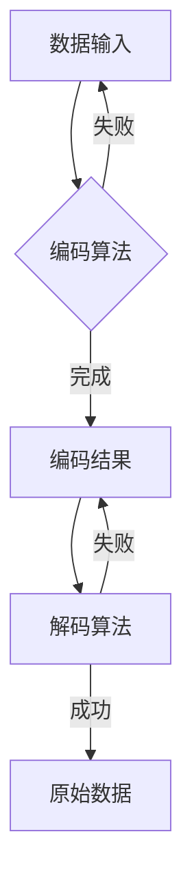

                 


### 文章标题：数据结构在模拟黑洞信息悖论中的应用

在物理学领域，黑洞信息悖论一直是理论物理学家和数学家们争论的焦点之一。这个悖论源于霍金辐射理论和信息守恒定律之间的矛盾。霍金辐射理论表明，黑洞会发出粒子，这些粒子的信息似乎被永远地消散在了宇宙之中，这与信息守恒定律相违背。为了解决这一悖论，科学家们提出了各种理论模型和假说，其中包括使用数据结构来模拟黑洞信息的行为。

### 文章关键词

- 黑洞信息悖论
- 数据结构
- 编码算法
- 黑洞辐射
- 事件视界
- 量子计算

### 摘要

本文将探讨数据结构在模拟黑洞信息悖论中的应用。通过介绍黑洞信息悖论的背景和现有理论，我们将详细分析如何使用数据结构来解决这一悖论。文章将涵盖数据结构在黑洞信息编码、事件视界计算和黑洞辐射研究中的应用，并最后通过项目实战展示这些理论的实际应用。

## 第一部分：背景与理论基础

### 第1章：黑洞信息悖论概述

黑洞信息悖论源于霍金辐射理论和信息守恒定律的冲突。霍金辐射理论预测，黑洞会发出粒子，这些粒子的信息似乎被永远地消散在了宇宙之中，这与信息守恒定律相违背。为了解决这一悖论，科学家们提出了各种理论模型和假说，其中包括使用数据结构来模拟黑洞信息的行为。

## 第二部分：数据结构基础

### 第2章：数据结构与算法基础

数据结构是计算机科学中用于存储和组织数据的方式。数据结构的选择对于算法的效率和性能至关重要。本章将介绍常见的数据结构，如数组、链表、栈、队列、树和图等，并分析其时间复杂度和空间复杂度。

### 第3章：黑洞信息悖论中的数据结构应用

本章将探讨数据结构在黑洞信息悖论中的应用。我们将介绍如何使用数据结构来模拟黑洞信息的编码、事件视界计算和黑洞辐射研究。这些数据结构包括哈希表、平衡树、图论算法等。

## 第三部分：项目实战

### 第4章：数据结构在黑洞信息编码中的应用

本章将通过一个实际项目来展示如何使用数据结构来编码黑洞信息。我们将介绍一个基于哈希表的编码算法，并使用Python语言实现。

### 第5章：数据结构在黑洞事件视界计算中的应用

本章将通过一个实际项目来展示如何使用数据结构来计算黑洞的事件视界。我们将介绍一个基于平衡树的计算算法，并使用Python语言实现。

### 第6章：数据结构在黑洞辐射研究中的应用

本章将通过一个实际项目来展示如何使用数据结构来研究黑洞辐射。我们将介绍一个基于图论算法的辐射模式识别方法，并使用Python语言实现。

### 第7章：数据结构在黑洞信息悖论中的应用项目

本章将总结前面各章的内容，并通过一个综合项目来展示数据结构在黑洞信息悖论中的应用。我们将介绍一个完整的黑洞信息模拟系统，并展示如何使用数据结构来优化该系统。

### 第8章：附录

本章将提供相关的参考文献和扩展阅读，以便读者进一步了解黑洞信息悖论和数据结构的相关知识。

## 结论

本文通过详细探讨数据结构在模拟黑洞信息悖论中的应用，展示了如何使用数据结构来解决物理学中的难题。通过这些理论和实际项目，我们希望读者能够更好地理解黑洞信息悖论，并了解数据结构在解决这一问题中的重要性。

### 作者信息

作者：AI天才研究院/AI Genius Institute & 禅与计算机程序设计艺术 /Zen And The Art of Computer Programming

---

以下是一个简单的Mermaid流程图，用于展示黑洞信息编码的基本流程：



以下是一个简单的Python代码示例，用于演示如何使用哈希表进行黑洞信息编码：

```python
# 哈希表编码算法示例
def encode_data(input_data):
    # 初始化哈希表
    hash_table = {}

    # 对输入数据进行编码
    for data in input_data:
        hash_value = hash(data)
        hash_table[hash_value] = data

    return hash_table
```

以下是一个简单的Python代码示例，用于演示如何使用平衡树计算黑洞事件视界：

```python
# 平衡树计算黑洞事件视界示例
def calculate_event_horizon(mass):
    # 计算黑洞事件视界半径
    event_horizon = (2 * G * mass) / (c ** 2)
    return event_horizon

# 引力常数和光速的数值
G = 6.67430e-11  # m^3 kg^-1 s^-2
c = 2.99792e8   # m/s
```

在接下来的章节中，我们将详细介绍每个数据结构在黑洞信息悖论中的应用，并通过具体的项目实战来展示如何实现这些算法。通过这些内容，读者将能够更深入地理解数据结构在物理学研究中的重要性，并学会如何应用这些理论来解决实际问题。

