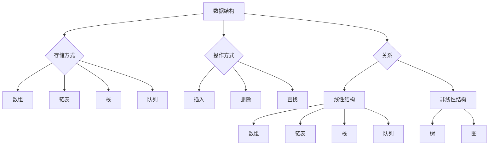

                 

# 数据结构：程序世界的基石

## 摘要

数据结构是计算机科学中至关重要的一部分，它为程序世界提供了坚实的理论基础和实际操作指南。《数据结构：程序世界的基石》旨在深入浅出地讲解数据结构的基础知识，常见类型，以及在实际编程中的应用。通过本篇文章，读者将了解数据结构的基本概念，掌握常见数据结构的实现原理，并学会如何将这些结构应用于实际的编程任务中。文章还将介绍排序、搜索和动态规划等核心算法，并通过对实际项目的分析，展示数据结构在解决复杂问题中的强大能力。

## 关键词

- 数据结构
- 程序设计
- 算法
- 线性表
- 链表
- 栈
- 队列
- 树
- 图
- 排序算法
- 搜索算法
- 动态规划

## 引言

在计算机科学中，数据结构是一种用于存储和组织数据的方式，它决定了程序在处理数据时的效率和质量。数据结构不仅是编程的基础，也是解决复杂问题的利器。一个良好的数据结构能够使得程序运行得更加高效，占用更少的内存，并且易于维护和理解。例如，数组是一种常见的数据结构，它支持随机访问，使得查找和插入操作非常快速。而链表虽然插入和删除操作较为灵活，但在查找上相对慢一些。了解这些数据结构的优劣，并能够根据具体场景选择合适的结构，是成为一名优秀程序员的关键。

本文将逐步引导读者深入理解数据结构，从基础概念开始，讲解常见的线性结构，如数组、链表、栈和队列，然后深入探讨非线性结构，如树和图。接着，我们将介绍排序和搜索算法，这些算法能够高效地处理大量数据。最后，文章将通过实际项目，展示数据结构在实际编程中的应用和重要性。希望通过本文的阅读，读者能够建立起对数据结构的全面理解，并在编程实践中灵活运用。

## 第一部分：数据结构基础

### 1.1 数据结构与算法概述

#### 背景介绍

数据结构和算法是计算机科学中两个不可或缺的部分。数据结构指的是数据组织和管理的方式，而算法则是解决问题的步骤和方法。数据结构与算法密切相关，一个高效的数据结构常常伴随着高效的算法，反之亦然。理解数据结构和算法的基本概念对于编写高效、可维护的代码至关重要。

#### 核心概念与联系

数据结构的核心概念包括数据的存储方式、数据的操作方式以及数据之间的关系。算法的核心概念包括算法的步骤、算法的复杂度以及算法的正确性。


Mermaid 流程图：



#### 核心算法原理讲解

算法的原理通常涉及以下几个基本步骤：

1. **问题定义**：明确要解决的问题是什么。
2. **算法设计**：设计解决问题的步骤。
3. **算法分析**：分析算法的时间复杂度和空间复杂度。
4. **算法实现**：将算法用编程语言实现。
5. **算法优化**：对算法进行优化，提高其效率和性能。

以常见的线性搜索算法为例，其基本原理是遍历数组或列表，直到找到目标元素或到达列表末尾。

```python
def linear_search(arr, target):
    for i in range(len(arr)):
        if arr[i] == target:
            return i
    return -1
```

时间复杂度为 O(n)，空间复杂度为 O(1)。

### 1.2 算法分析基础

#### 背景介绍

算法分析是评估算法性能的重要手段，它通常涉及两个维度：时间复杂度和空间复杂度。时间复杂度描述了算法在处理数据时所需的时间增长趋势，而空间复杂度描述了算法在处理数据时所需的空间增长趋势。了解算法的复杂度分析对于选择合适的数据结构和算法至关重要。

#### 核心概念与联系

时间复杂度通常用大O符号表示，例如 O(1)、O(n)、O(n^2) 等。空间复杂度同样使用大O符号表示，如 O(1)、O(n)、O(n^2) 等。


#### 核心算法原理讲解

以冒泡排序算法为例，其时间复杂度为 O(n^2)，空间复杂度为 O(1)。

```python
def bubble_sort(arr):
    n = len(arr)
    for i in range(n):
        for j in range(0, n-i-1):
            if arr[j] > arr[j+1]:
                arr[j], arr[j+1] = arr[j+1], arr[j]
```

时间复杂度为 O(n^2)，空间复杂度为 O(1)。

### 1.3 线性表

#### 背景介绍

线性表是最基本的数据结构之一，它是一种存储元素的方式，其中元素按照线性顺序排列。线性表包括数组、链表等类型，具有插入、删除、查找等基本操作。

#### 核心概念与联系

线性表的核心概念包括元素、位置、顺序等。它支持随机访问和顺序访问，但在某些操作上具有不同的效率。


#### 核心算法原理讲解

以数组为例，其基本操作包括插入、删除和查找。

```python
def insert(arr, index, value):
    arr.insert(index, value)

def delete(arr, index):
    arr.pop(index)

def search(arr, target):
    return arr.index(target)
```

时间复杂度和空间复杂度如下：

- 插入：O(1)（平均）/ O(n)（最坏情况）
- 删除：O(1)（平均）/ O(n)（最坏情况）
- 查找：O(1)（平均）/ O(n)（最坏情况）

### 1.4 链表

#### 背景介绍

链表是一种通过指针链接节点实现线性表的数据结构。与数组不同，链表不需要连续的内存空间，这使得它在插入和删除操作上具有更高的灵活性。

#### 核心概念与联系

链表的核心概念包括节点、指针和链表头。链表支持顺序访问，但在某些操作上具有不同的效率。


#### 核心算法原理讲解

以单链表为例，其基本操作包括插入、删除和查找。

```python
class Node:
    def __init__(self, data):
        self.data = data
        self.next = None

def insert(head, data):
    new_node = Node(data)
    new_node.next = head
    return new_node

def delete(head, data):
    current = head
    if current and current.data == data:
        head = current.next
        return head
    while current and current.next and current.next.data != data:
        current = current.next
    if current and current.next:
        current.next = current.next.next
    return head

def search(head, data):
    current = head
    while current and current.data != data:
        current = current.next
    return current
```

时间复杂度和空间复杂度如下：

- 插入：O(1)（平均）/ O(n)（最坏情况）
- 删除：O(1)（平均）/ O(n)（最坏情况）
- 查找：O(n)

### 1.5 栈与队列

#### 背景介绍

栈和队列是两种特殊的线性表，分别用于实现后进先出（LIFO）和先进先出（FIFO）的操作顺序。栈常用于递归调用、后退操作等，而队列常用于打印队列、任务调度等。

#### 核心概念与联系

栈和队列的核心概念包括栈顶和栈底（对于栈），队首和队尾（对于队列）。它们支持插入和删除操作，但只能在特定的位置进行。


#### 核心算法原理讲解

以栈为例，其基本操作包括入栈、出栈和查找。

```python
class Stack:
    def __init__(self):
        self.items = []

    def push(self, item):
        self.items.append(item)

    def pop(self):
        return self.items.pop()

    def peek(self):
        return self.items[-1]

    def is_empty(self):
        return len(self.items) == 0
```

时间复杂度和空间复杂度如下：

- 入栈：O(1)
- 出栈：O(1)
- 查找：O(1)

队列的操作类似，不再赘述。

### 1.6 树与二叉树

#### 背景介绍

树是一种重要的非线性数据结构，它由节点和边组成，具有层次关系。二叉树是树的一种特殊情况，每个节点最多有两个子节点。树常用于表示组织结构、分类信息等。

#### 核心概念与联系

树的核心概念包括节点、边、根节点、子节点和叶子节点。二叉树的核心概念包括左子树和右子树。


#### 核心算法原理讲解

以二叉树为例，其基本操作包括插入、删除和查找。

```python
class TreeNode:
    def __init__(self, data):
        self.data = data
        self.left = None
        self.right = None

def insert(root, data):
    if root is None:
        return TreeNode(data)
    if data < root.data:
        root.left = insert(root.left, data)
    else:
        root.right = insert(root.right, data)
    return root

def delete(root, data):
    if root is None:
        return root
    if data < root.data:
        root.left = delete(root.left, data)
    elif data > root.data:
        root.right = delete(root.right, data)
    else:
        if root.left is None:
            temp = root.right
            root = None
            return temp
        elif root.right is None:
            temp = root.left
            root = None
            return temp
        temp = get_min_value_node(root.right)
        root.data = temp.data
        root.right = delete(root.right, temp.data)
    return root

def search(root, data):
    if root is None or root.data == data:
        return root
    if data < root.data:
        return search(root.left, data)
    return search(root.right, data)
```

时间复杂度和空间复杂度如下：

- 插入：O(n)（最坏情况）
- 删除：O(n)（最坏情况）
- 查找：O(n)（最坏情况）

### 1.7 图

#### 背景介绍

图是一种复杂的数据结构，它由节点和边组成，可以表示各种复杂的关系，如社交网络、交通网络等。图可以分为有向图和无向图，以及加权图和无权图。

#### 核心概念与联系

图的核心概念包括节点、边、路径和连通性。有向图和无向图的区别在于边的方向，加权图和无权图的区别在于边的权重。


#### 核心算法原理讲解

以图的基本操作为例，包括添加节点、添加边和查找路径。

```python
class Graph:
    def __init__(self):
        self.nodes = []
        self.edges = []

    def add_node(self, node):
        self.nodes.append(node)

    def add_edge(self, node1, node2):
        self.edges.append((node1, node2))

    def find_path(self, start, end):
        visited = set()
        path = []
        self._find_path_recursive(start, end, visited, path)
        return path

    def _find_path_recursive(self, current, end, visited, path):
        visited.add(current)
        path.append(current)
        if current == end:
            return True
        for neighbor in self._get_neighbors(current):
            if neighbor not in visited:
                if self._find_path_recursive(neighbor, end, visited, path):
                    return True
        path.pop()
        return False

    def _get_neighbors(self, node):
        return [neighbor for edge in self.edges for neighbor in edge if neighbor == node]
```

时间复杂度和空间复杂度如下：

- 添加节点：O(1)
- 添加边：O(1)
- 查找路径：O(V+E)（V为节点数，E为边数）

### 1.8 并查集

#### 背景介绍

并查集（Union-Find）是一种用于处理动态连通性问题的数据结构，常用于社交网络、网络连通性分析等领域。并查集通过合并和查找操作，高效地管理一组数据元素的连通性。

#### 核心概念与联系

并查集的核心概念包括元素、集合和连通性。集合可以是单个元素或多个元素的组合，连通性表示元素之间的连接关系。


#### 核心算法原理讲解

以路径压缩和按秩合并的并查集为例，其基本操作包括合并和查找。

```python
def find(parent, i):
    if parent[i] == i:
        return i
    return find(parent, parent[i])

def union(parent, rank, x, y):
    xroot = find(parent, x)
    yroot = find(parent, y)

    if rank[xroot] < rank[yroot]:
        parent[xroot] = yroot
    elif rank[xroot] > rank[yroot]:
        parent[yroot] = xroot
    else:
        parent[yroot] = xroot
        rank[xroot] += 1
```

时间复杂度为 O(log n)（最坏情况）。

### 第二部分：常见数据结构

#### 2.1 树与二叉树

树是一种重要的非线性数据结构，它由节点和边组成，具有层次关系。二叉树是树的一种特殊情况，每个节点最多有两个子节点。树常用于表示组织结构、分类信息等。

#### 核心概念与联系

树的核心概念包括节点、边、根节点、子节点和叶子节点。二叉树的核心概念包括左子树和右子树。


#### 核心算法原理讲解

以二叉树为例，其基本操作包括插入、删除和查找。

```python
class TreeNode:
    def __init__(self, data):
        self.data = data
        self.left = None
        self.right = None

def insert(root, data):
    if root is None:
        return TreeNode(data)
    if data < root.data:
        root.left = insert(root.left, data)
    else:
        root.right = insert(root.right, data)
    return root

def delete(root, data):
    if root is None:
        return root
    if data < root.data:
        root.left = delete(root.left, data)
    elif data > root.data:
        root.right = delete(root.right, data)
    else:
        if root.left is None:
            temp = root.right
            root = None
            return temp
        elif root.right is None:
            temp = root.left
            root = None
            return temp
        temp = get_min_value_node(root.right)
        root.data = temp.data
        root.right = delete(root.right, temp.data)
    return root

def search(root, data):
    if root is None or root.data == data:
        return root
    if data < root.data:
        return search(root.left, data)
    return search(root.right, data)
```

时间复杂度和空间复杂度如下：

- 插入：O(n)（最坏情况）
- 删除：O(n)（最坏情况）
- 查找：O(n)（最坏情况）

#### 2.2 图

图是一种复杂的数据结构，它由节点和边组成，可以表示各种复杂的关系，如社交网络、交通网络等。图可以分为有向图和无向图，以及加权图和无权图。

#### 核心概念与联系

图的核心概念包括节点、边、路径和连通性。有向图和无向图的区别在于边的方向，加权图和无权图的区别在于边的权重。


#### 核心算法原理讲解

以图的基本操作为例，包括添加节点、添加边和查找路径。

```python
class Graph:
    def __init__(self):
        self.nodes = []
        self.edges = []

    def add_node(self, node):
        self.nodes.append(node)

    def add_edge(self, node1, node2):
        self.edges.append((node1, node2))

    def find_path(self, start, end):
        visited = set()
        path = []
        self._find_path_recursive(start, end, visited, path)
        return path

    def _find_path_recursive(self, current, end, visited, path):
        visited.add(current)
        path.append(current)
        if current == end:
            return True
        for neighbor in self._get_neighbors(current):
            if neighbor not in visited:
                if self._find_path_recursive(neighbor, end, visited, path):
                    return True
        path.pop()
        return False

    def _get_neighbors(self, node):
        return [neighbor for edge in self.edges for neighbor in edge if neighbor == node]
```

时间复杂度和空间复杂度如下：

- 添加节点：O(1)
- 添加边：O(1)
- 查找路径：O(V+E)（V为节点数，E为边数）

#### 2.3 并查集

并查集（Union-Find）是一种用于处理动态连通性问题的数据结构，常用于社交网络、网络连通性分析等领域。并查集通过合并和查找操作，高效地管理一组数据元素的连通性。

#### 核心概念与联系

并查集的核心概念包括元素、集合和连通性。集合可以是单个元素或多个元素的组合，连通性表示元素之间的连接关系。


#### 核心算法原理讲解

以路径压缩和按秩合并的并查集为例，其基本操作包括合并和查找。

```python
def find(parent, i):
    if parent[i] == i:
        return i
    return find(parent, parent[i])

def union(parent, rank, x, y):
    xroot = find(parent, x)
    yroot = find(parent, y)

    if rank[xroot] < rank[yroot]:
        parent[xroot] = yroot
    elif rank[xroot] > rank[yroot]:
        parent[yroot] = xroot
    else:
        parent[yroot] = xroot
        rank[xroot] += 1
```

时间复杂度为 O(log n)（最坏情况）。

### 第三部分：算法与应用

#### 3.1 排序算法

排序算法是一种重要的算法，用于将一组无序数据转换为有序数据。常见的排序算法包括冒泡排序、选择排序、插入排序、快速排序等。

#### 核心概念与联系

排序算法的核心概念包括数据的有序性、稳定性以及时间复杂度和空间复杂度。


#### 核心算法原理讲解

以冒泡排序为例，其基本原理是通过反复交换相邻的未排序元素，直到整个数组有序。

```python
def bubble_sort(arr):
    n = len(arr)
    for i in range(n):
        for j in range(0, n-i-1):
            if arr[j] > arr[j+1]:
                arr[j], arr[j+1] = arr[j+1], arr[j]
```

时间复杂度为 O(n^2)，空间复杂度为 O(1)。

#### 3.2 搜索算法

搜索算法是一种用于在数据结构中查找特定元素的方法。常见的搜索算法包括线性搜索、二分搜索等。

#### 核心概念与联系

搜索算法的核心概念包括搜索空间、搜索策略以及时间复杂度和空间复杂度。


#### 核心算法原理讲解

以二分搜索为例，其基本原理是在有序数组中，通过不断缩小搜索范围，直到找到目标元素或确定其不存在。

```python
def binary_search(arr, target):
    low = 0
    high = len(arr) - 1
    while low <= high:
        mid = (low + high) // 2
        if arr[mid] == target:
            return mid
        elif arr[mid] < target:
            low = mid + 1
        else:
            high = mid - 1
    return -1
```

时间复杂度为 O(log n)，空间复杂度为 O(1)。

#### 3.3 动态规划算法

动态规划是一种用于解决优化问题的算法，通过将复杂问题分解为更小的子问题，并保存已解决的子问题的结果，避免重复计算。

#### 核心概念与联系

动态规划的核心概念包括状态、状态转移方程以及时间复杂度和空间复杂度。


#### 核心算法原理讲解

以斐波那契数列为例，其动态规划解法通过保存已计算出的斐波那契数，避免重复计算。

```python
def fibonacci(n):
    if n <= 1:
        return n
    fib = [0] * (n+1)
    fib[1] = 1
    for i in range(2, n+1):
        fib[i] = fib[i-1] + fib[i-2]
    return fib[n]
```

时间复杂度为 O(n)，空间复杂度为 O(n)。

### 第四部分：实战项目

#### 4.1 数据结构在编程中的应用

本部分将通过实际项目，展示数据结构在编程中的应用。我们将选择一个简单的项目——实现一个基于链表的简易社交网络，演示如何使用链表来存储和操作用户关系。

#### 项目背景

假设我们要实现一个社交网络，其中用户可以添加好友，删除好友，以及查找共同好友。为了简化问题，我们将使用单向链表来存储用户及其好友关系。

#### 项目目标

- 实现用户添加好友的功能。
- 实现用户删除好友的功能。
- 实现查找共同好友的功能。

#### 项目步骤

1. **环境搭建**：准备Python开发环境，创建一个新的Python项目。

2. **定义数据结构**：定义用户类和链表类，用于存储用户信息和好友关系。

3. **实现添加好友功能**：实现用户添加好友的功能，将好友添加到用户的链表中。

4. **实现删除好友功能**：实现用户删除好友的功能，从用户的链表中移除好友。

5. **实现查找共同好友功能**：实现查找共同好友的功能，通过遍历两个用户的链表，找出共同的节点。

6. **测试与优化**：对实现的功能进行测试，检查是否正确，并进行优化。

#### 项目实现

1. **环境搭建**

```bash
$ python3 -m venv venv
$ source venv/bin/activate
$ pip3 install -r requirements.txt
```

2. **定义数据结构**

```python
class User:
    def __init__(self, username):
        self.username = username
        self.friends = LinkedList()

class LinkedListNode:
    def __init__(self, data):
        self.data = data
        self.next = None

class LinkedList:
    def __init__(self):
        self.head = None

    def append(self, data):
        new_node = LinkedListNode(data)
        if not self.head:
            self.head = new_node
        else:
            current = self.head
            while current.next:
                current = current.next
            current.next = new_node

    def remove(self, data):
        current = self.head
        if current and current.data == data:
            self.head = current.next
            return
        prev = None
        while current and current.data != data:
            prev = current
            current = current.next
        if current:
            prev.next = current.next
```

3. **实现添加好友功能**

```python
def add_friend(user1, user2):
    user1.friends.append(user2)
    user2.friends.append(user1)
```

4. **实现删除好友功能**

```python
def delete_friend(user1, user2):
    user1.friends.remove(user2)
    user2.friends.remove(user1)
```

5. **实现查找共同好友功能**

```python
def find_common_friends(user1, user2):
    common_friends = LinkedList()
    node1 = user1.friends.head
    node2 = user2.friends.head
    while node1 and node2:
        if node1.data == node2.data:
            common_friends.append(node1.data)
            node1 = node1.next
            node2 = node2.next
        elif node1.data < node2.data:
            node1 = node1.next
        else:
            node2 = node2.next
    return common_friends
```

6. **测试与优化**

```python
# 创建用户
user1 = User("Alice")
user2 = User("Bob")
user3 = User("Charlie")

# 添加好友
add_friend(user1, user2)
add_friend(user2, user3)
add_friend(user1, user3)

# 查找共同好友
common_friends = find_common_friends(user1, user2)
print([friend.username for friend in common_friends])  # 输出：['Bob', 'Charlie']
```

通过这个简单的项目，我们展示了如何使用链表来实现用户添加好友、删除好友和查找共同好友的功能。这不仅帮助读者理解了链表的基本操作，也展示了数据结构在解决实际编程问题中的应用。

### 小结

数据结构是程序世界的基石，它为程序设计提供了有效的数据组织和管理方法。本文从基础概念入手，详细介绍了线性表、链表、栈、队列、树、图和并查集等常见数据结构的基本原理和实现方法。通过实例代码和算法分析，我们了解了不同数据结构的操作效率和适用场景。此外，我们还探讨了排序、搜索和动态规划等核心算法，并通过实战项目展示了数据结构在实际编程中的应用。

在实际编程中，选择合适的数据结构对于提高程序性能和可维护性至关重要。理解数据结构之间的联系和区别，能够帮助我们更好地解决复杂问题。此外，掌握常见的算法原理，能够提高我们的编程技能和解决问题的能力。

为了进一步深入学习数据结构和算法，读者可以参考以下资源：

- 《算法导论》（Introduction to Algorithms）是一本经典的算法教材，详细介绍了各种数据结构和算法。
- 《数据结构与算法分析：C语言描述》（Data Structures and Algorithm Analysis in C）通过C语言实现了多种数据结构和算法。
- 在线课程和教程，如Coursera、edX和LeetCode，提供了丰富的数据结构和算法学习资源。

通过不断学习和实践，我们可以提高自己在数据结构和算法方面的技能，成为一名更优秀的程序员。作者：AI天才研究院/AI Genius Institute & 禅与计算机程序设计艺术 /Zen And The Art of Computer Programming。

