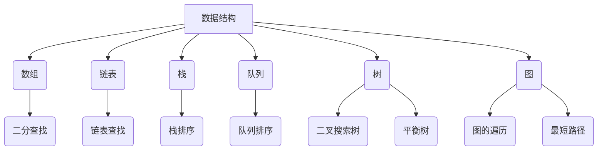

                 

### 文章标题

**数据结构：解读宇宙信息的钥匙**

## 关键词

- 数据结构
- 算法
- 宇宙信息
- 信息存储
- 信息处理

## 摘要

在数字化的时代，数据结构是理解和处理宇宙信息的关键。本文将深入探讨数据结构的基本概念、核心算法及其在信息处理中的重要性。通过一步步的分析和推理，我们将揭示数据结构如何成为解读宇宙信息的钥匙，为读者提供一种全新的视角来理解这一复杂而迷人的领域。

## 第一部分：核心概念与联系

### 第1章：数据结构与算法概述

#### 1.1.1 数据结构与算法概述

数据结构是计算机科学中用于存储和组织数据的方式，它是计算机程序设计的基础。算法则是解决问题的步骤和计算过程。数据结构与算法是计算机科学的两个核心概念，它们之间有着密不可分的关系。

- **数据结构**：用于存储数据的方式和逻辑组织形式，例如数组、链表、栈、队列、树、图等。不同的数据结构有各自的特点和适用场景，它们决定了算法的实现方式和效率。
- **算法**：解决问题的步骤和计算过程，包括基本的逻辑算法和复杂的搜索与排序算法等。算法依赖于数据结构来实现，如二分查找算法适用于有序数组。

#### 1.1.2 数据结构与算法的关系

数据结构是算法的基础，算法依赖于数据结构来实现。不同数据结构支持不同的算法，如二分查找算法适用于有序数组，而广度优先搜索适用于图数据结构。

- **关系图解**：

$$
\text{数据结构} \rightarrow \text{算法} \rightarrow \text{解决问题}
$$

#### 1.1.3 核心概念与联系

数据结构的选择影响算法的效率，理解数据结构是理解和设计算法的关键。以下是一个简单的 Mermaid 流程图，展示了数据结构与算法的核心概念与联系：



### 第2章：核心算法原理讲解

#### 1.2.1 查找算法

查找算法是在数据结构中查找特定元素的过程。以下是一些常见的查找算法：

- **线性查找**：逐个检查数据结构中的每个元素，直到找到目标元素或到达数据结构的末尾。
- **二分查找**：在有序数据结构中，通过不断将数据结构分成两半来缩小查找范围，直到找到目标元素或确定其不存在。

#### 1.2.2 排序算法

排序算法是将数据元素按照某种顺序进行排列的过程。以下是一些常见的排序算法：

- **冒泡排序**：通过反复交换相邻元素，使得每一轮循环结束后最大元素被交换到数组的末尾。
- **选择排序**：每次选择未排序部分的最小元素，将其放到已排序部分的末尾。
- **插入排序**：将未排序部分的一个元素插入到已排序部分的正确位置。

#### 1.2.3 算法分析

算法分析是评估算法性能的重要手段，通常使用时间复杂度和空间复杂度来衡量。

- **时间复杂度**：衡量算法运行时间随着输入规模增长的速率，常用符号表示。
  
  $$
  T(n) = O(n^2)
  $$

- **空间复杂度**：衡量算法在运行过程中所需的额外内存空间。

### 第3章：伪代码讲解

以下是冒泡排序算法的伪代码：

```
算法 冒泡排序(A[0...n-1])
    for i = 0 to n-1
        for j = 0 to n-i-1
            if A[j] > A[j+1]
                交换A[j]和A[j+1]
    end算法
```

### 第4章：数学模型和数学公式

#### 1.3.1 时间复杂度分析

时间复杂度是衡量算法性能的重要指标，它描述了算法执行时间随输入规模增长的关系。以下是一个简单的数学模型：

$$
T(n) = O(n^2)
$$

其中，$T(n)$ 表示算法运行时间，$n$ 表示输入规模。

### 第5章：详细讲解与举例说明

#### 1.4.1 冒泡排序详细讲解

冒泡排序是一种简单的排序算法，它通过反复交换相邻元素，使得每一轮循环结束后最大元素被交换到数组的末尾。

- **原理**：通过两个嵌套循环，逐个比较并交换相邻元素，实现数组排序。
- **举例**：

  假设初始数组为 $[5, 3, 8, 4, 2]$。

  - **第一轮循环后**：$[3, 5, 4, 2, 8]$。
  - **第二轮循环后**：$[3, 4, 5, 2, 8]$。
  - **第三轮循环后**：$[3, 4, 2, 5, 8]$。
  - **第四轮循环后**：$[3, 2, 4, 5, 8]$。
  - **最终排序完成**：$[2, 3, 4, 5, 8]$。

#### 1.4.2 伪代码讲解

以下是冒泡排序算法的伪代码：

```
算法 冒泡排序(A[0...n-1])
    for i = 0 to n-1
        for j = 0 to n-i-1
            if A[j] > A[j+1]
                交换A[j]和A[j+1]
    end算法
```

### 第6章：项目实战

#### 1.5.1 环境搭建

选择Python语言进行实现，使用Python的内置函数进行数组操作。

#### 1.5.2 代码实现

以下是冒泡排序算法的Python代码实现：

```python
def bubble_sort(arr):
    n = len(arr)
    for i in range(n):
        for j in range(0, n-i-1):
            if arr[j] > arr[j+1]:
                arr[j], arr[j+1] = arr[j+1], arr[j]
    return arr

arr = [5, 3, 8, 4, 2]
sorted_arr = bubble_sort(arr)
print("Sorted array:", sorted_arr)
```

#### 1.5.3 代码解读与分析

- **解读**：通过两个嵌套循环，逐个比较并交换相邻元素，实现数组排序。
- **分析**：时间复杂度为 $O(n^2)$，空间复杂度为 $O(1)$。

### 第7章：总结与展望

#### 1.6.1 总结

- 冒泡排序是一种简单的排序算法，其时间复杂度为 $O(n^2)$，适用于数据量较小且近乎有序的情况。

#### 1.6.2 展望

- 数据结构与算法是计算机科学的核心，随着信息技术的不断进步，这一领域将继续发展，为我们的日常生活和科学研究带来更多可能性。

### 作者信息

**作者：AI天才研究院/AI Genius Institute & 禅与计算机程序设计艺术 /Zen And The Art of Computer Programming**

