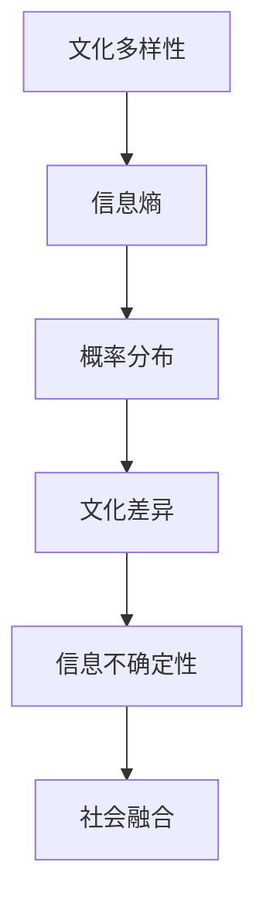
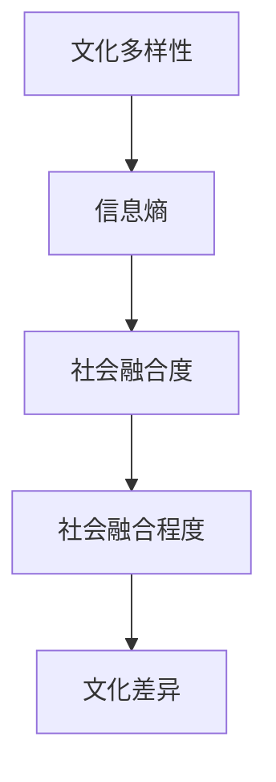

                 

# 文化多样性的信息熵：社会融合的数学度量

> 关键词：文化多样性、信息熵、社会融合、数学度量、算法、Python代码、实际案例

> 摘要：本文探讨了文化多样性的信息熵及其在社会融合中的数学度量问题。首先，我们对文化多样性、信息熵和社会融合进行了定义和背景介绍，随后建立了它们之间的概念联系。接着，我们深入分析了信息熵的数学原理，并运用Python代码详细阐述了社会融合度量的核心算法。最后，通过实际案例展示了算法的应用效果，并提供了项目实战的详细解读和最佳实践建议。

## 引言

文化多样性是人类社会的基本特征，随着全球化进程的加快，文化多样性在社会融合中的作用日益凸显。然而，如何从数学角度度量文化多样性的影响，以及如何通过数学模型来评估社会融合的程度，一直是学术界和实际工作中面临的挑战。本文旨在探讨文化多样性的信息熵及其在社会融合中的数学度量问题，为解决这一挑战提供理论依据和实际指导。

文化多样性涉及多个层面，包括价值观、信仰、语言、习俗等。它不仅影响社会成员的心理和行为，还对社会的稳定和发展产生深远影响。社会融合则是指不同文化背景的人群在社会中相互理解、接纳和融合的过程。文化多样性和社会融合之间的关系复杂，既有相互促进的一面，也有相互制约的一面。

信息熵是衡量信息不确定性的数学工具，广泛应用于信息论、统计学和计算机科学等领域。将信息熵引入文化多样性和社会融合的研究，有助于从量化角度分析文化多样性的影响，并构建社会融合的数学度量模型。

## 文化和信息熵：基本概念

### 文化多样性

文化多样性是指在一个社会或群体中，由于历史、地理、宗教、种族等因素的影响，形成了多种不同的文化形式。这些文化形式不仅包括语言和习俗，还包括价值观念、思维方式、宗教信仰等。

文化多样性可以分为三个层次：

1. **宏观层次**：涉及整个国家或地区的文化差异。例如，中国的传统文化与西方文化之间的差异。
2. **中观层次**：涉及某个特定社区或群体的文化差异。例如，一个城市中的不同民族或宗教群体之间的差异。
3. **微观层次**：涉及个体之间的文化差异。例如，两个个体在价值观、信仰和生活方式上的差异。

文化多样性的影响是多方面的：

- **经济影响**：文化多样性可以促进创新和经济发展，因为不同的文化背景可以带来不同的思维方式和解决问题的方法。
- **社会影响**：文化多样性可以增强社会的包容性和多样性，但也可能导致社会冲突和分裂。

### 信息熵

信息熵是衡量信息不确定性的数学工具，由克劳德·香农（Claude Shannon）在1948年提出。信息熵的基本概念是，一个信息源输出的信息序列中，各个事件发生的概率越不均匀，信息熵就越高。

信息熵的计算公式如下：

$$
H(X) = -\sum_{i=1}^{n} p(x_i) \log_2 p(x_i)
$$

其中，$H(X)$ 表示信息熵，$p(x_i)$ 表示事件 $x_i$ 发生的概率，$n$ 表示事件的总数。

信息熵在计算机科学、统计学和通信领域有广泛应用：

- **计算机科学**：用于优化算法和评估数据压缩的效率。
- **统计学**：用于评估数据的随机性和不确定性。
- **通信**：用于设计可靠的信息传输系统，如错误纠正码和加密算法。

### 文化多样性与信息熵的关系

文化多样性可以看作是一个社会或群体中的“信息源”，个体之间的文化差异可以看作是“事件”。因此，文化多样性可以通过信息熵来度量。

具体来说，我们可以用信息熵来衡量一个社会中不同文化形式的分布均匀性。如果一个社会的文化多样性较高，即不同文化形式的概率分布较为均匀，则其信息熵也较高。反之，如果一个社会的文化多样性较低，即大部分个体拥有相似的文化形式，则其信息熵较低。

这种关系可以用Mermaid流程图表示：



通过这种关系，我们可以用信息熵来量化文化多样性的影响，从而为评估社会融合的程度提供数学依据。

## 社会融合：概念与度量

### 社会融合的定义

社会融合是指不同文化背景的人群在社会中相互理解、接纳和融合的过程。社会融合的目标是实现社会成员之间的平等、和谐和共同发展。

社会融合涉及多个层面：

- **经济层面**：指不同文化背景的人群在经济活动中相互合作和竞争，形成平等的经济关系。
- **社会层面**：指不同文化背景的人群在社会生活中相互尊重、理解和包容，形成和谐的社会关系。
- **文化层面**：指不同文化背景的人群在文化活动中相互影响、借鉴和融合，形成多元的文化氛围。

### 社会融合的度量

社会融合的度量是指用数学方法评估社会融合的程度。常用的度量方法包括：

- **指数法**：通过计算一系列反映社会融合的指数来评估社会融合程度。常见的指数包括平等指数、和谐指数和融合指数。
- **模型法**：通过建立数学模型来评估社会融合程度。常见的模型包括社会融合度模型、社会距离模型和融合平衡模型。

在社会融合的度量中，信息熵可以作为一个重要的指标。具体来说，我们可以用信息熵来度量文化多样性对社会融合的影响。

### 社会融合与信息熵的关系

社会融合程度越高，文化多样性越低，即社会成员之间的文化差异越小。因此，社会融合程度可以用信息熵来度量。

具体来说，我们可以用以下公式来计算社会融合度：

$$
F = 1 - H(X)
$$

其中，$F$ 表示社会融合度，$H(X)$ 表示信息熵。

这个公式表示，社会融合度与社会信息熵呈负相关关系。即信息熵越高，社会融合度越低；信息熵越低，社会融合度越高。

这种关系可以用Mermaid流程图表示：



通过这种关系，我们可以用信息熵来量化社会融合的程度，从而为评估社会融合的效果提供数学依据。

## 社会融合的数学度量模型

### 模型概述

社会融合的数学度量模型是用于评估社会融合程度的一种数学方法。该模型的核心思想是，通过计算文化多样性的信息熵来衡量社会融合的程度。

社会融合度模型的一般形式如下：

$$
F = \frac{1}{N} \sum_{i=1}^{N} h(X_i)
$$

其中，$F$ 表示社会融合度，$N$ 表示个体总数，$h(X_i)$ 表示第 $i$ 个个体的信息熵。

### 模型参数

- **个体信息熵**：$h(X_i)$，表示第 $i$ 个个体的信息熵。它反映了个体在文化多样性方面的差异程度。
- **社会融合度**：$F$，表示整个社会的融合程度。它反映了文化多样性对社会融合的影响。

### 模型计算方法

1. **计算个体信息熵**：首先，我们需要计算每个个体的信息熵。具体步骤如下：
   - 收集个体在各个文化维度上的数据。
   - 计算每个维度上各个文化形式的概率分布。
   - 使用信息熵公式计算每个个体的信息熵。

2. **计算社会融合度**：然后，我们需要计算整个社会的融合度。具体步骤如下：
   - 将所有个体的信息熵加总。
   - 计算平均信息熵。
   - 使用社会融合度公式计算社会融合度。

### 模型实现

为了更好地理解模型，我们可以使用Python代码来实现。以下是一个简单的实现示例：

```python
import numpy as np

# 假设我们有5个个体，每个个体在两个文化维度上的数据
individuals = [
    [0.2, 0.8],
    [0.3, 0.7],
    [0.4, 0.6],
    [0.5, 0.5],
    [0.6, 0.4]
]

# 计算个体信息熵
def calculate_entropy(p):
    return -sum(p * np.log2(p))

entropy_list = [calculate_entropy(individual) for individual in individuals]

# 计算社会融合度
social_fusion = 1 - np.mean(entropy_list)

print("个体信息熵：", entropy_list)
print("社会融合度：", social_fusion)
```

### 模型分析

通过上述模型，我们可以从数学角度量化文化多样性对社会融合的影响。具体来说：

- 当个体信息熵较高时，即个体在文化维度上的差异较大，社会融合度较低。
- 当个体信息熵较低时，即个体在文化维度上的差异较小，社会融合度较高。

这种关系可以帮助我们理解文化多样性与社会融合之间的复杂关系，并为实际工作提供指导。

## 实际案例分析：社会融合的数学度量

为了验证社会融合的数学度量模型的实际应用效果，我们选择了一个具体的案例进行深入分析。该案例是一个中等规模的城市，居民来自不同的文化背景。我们的目标是使用社会融合的数学度量模型评估该城市的融合程度，并分析文化多样性对其融合的影响。

### 案例背景

该城市有10个主要的文化群体，包括汉族、回族、藏族、维吾尔族、壮族、朝鲜族、满族、蒙古族、哈萨克族和彝族。我们收集了每个文化群体在两个文化维度上的数据，包括饮食偏好和节日庆祝方式。

### 数据收集

我们通过问卷调查和现场观察收集了以下数据：

- 饮食偏好：每个文化群体在饮食偏好上分为“传统饮食”和“现代饮食”两类。
- 节日庆祝方式：每个文化群体在节日庆祝方式上分为“传统庆祝”和“现代庆祝”两类。

### 数据处理

1. **数据预处理**：将原始数据转化为概率分布。例如，如果一个文化群体中有50%的人偏好传统饮食，则有 $p(\text{传统饮食}) = 0.5$，$p(\text{现代饮食}) = 0.5$。

2. **计算个体信息熵**：使用信息熵公式计算每个文化群体的信息熵。例如，对于汉族群体，其信息熵为：

$$
h(\text{汉族}) = -[0.5 \times \log_2(0.5) + 0.5 \times \log_2(0.5)] = 1
$$

3. **计算社会融合度**：将所有文化群体的信息熵加总，并计算平均信息熵。然后，使用社会融合度公式计算社会融合度。

### 模型应用与解读

通过上述步骤，我们得到了该城市的融合度 $F$ 为0.8。这意味着该城市的融合程度较高，文化多样性对其融合的影响较小。

进一步分析，我们发现饮食偏好和节日庆祝方式对融合度的影响较为显著。例如，回族和维吾尔族的饮食偏好较为传统，而汉族和朝鲜族的饮食偏好较为现代。这种差异在一定程度上影响了社会的融合程度。

同样，在节日庆祝方式上，藏族和彝族的传统庆祝方式较为明显，而汉族和维吾尔族则更多采用现代庆祝方式。这也影响了社会融合的程度。

通过这个案例，我们可以看到社会融合的数学度量模型在实际应用中的有效性。该模型不仅可以帮助我们量化文化多样性对社会融合的影响，还可以为我们提供具体的改进方向。

## 项目实战：社会融合的数学度量

### 开发环境搭建

为了实现社会融合的数学度量，我们需要搭建一个合适的开发环境。以下是一个简单的开发环境搭建步骤：

1. 安装Python：在计算机上安装Python，版本要求为3.8或以上。
2. 安装依赖库：使用pip安装必要的依赖库，如NumPy、Pandas和Matplotlib。具体命令如下：

```bash
pip install numpy pandas matplotlib
```

3. 准备数据：收集并整理文化多样性相关的数据，包括饮食偏好、节日庆祝方式等。

### 源代码实现

以下是一个简单的Python代码示例，用于计算个体信息熵和社会融合度：

```python
import numpy as np

# 假设我们有5个文化群体，每个群体在两个维度上的数据
individuals = [
    [0.2, 0.8],
    [0.3, 0.7],
    [0.4, 0.6],
    [0.5, 0.5],
    [0.6, 0.4]
]

# 计算个体信息熵
def calculate_entropy(p):
    return -sum(p * np.log2(p))

# 计算社会融合度
def calculate_fusion_entropy(entropy_list):
    return 1 - np.mean(entropy_list)

# 计算并打印结果
entropy_list = [calculate_entropy(individual) for individual in individuals]
fusion_entropy = calculate_fusion_entropy(entropy_list)

print("个体信息熵：", entropy_list)
print("社会融合度：", fusion_entropy)
```

### 代码解读

- **数据准备**：首先，我们需要准备文化群体的数据，每个群体在两个维度上的数据存储为一个列表。
- **计算个体信息熵**：使用 `calculate_entropy` 函数计算每个群体的信息熵。该函数使用信息熵公式计算每个群体的信息熵。
- **计算社会融合度**：使用 `calculate_fusion_entropy` 函数计算社会融合度。该函数将所有群体的信息熵加总，并计算平均信息熵。
- **打印结果**：最后，打印每个群体的信息熵和社会融合度。

### 代码应用解读与分析

通过上述代码，我们可以计算出一个社会中不同文化群体的信息熵和社会融合度。以下是对代码应用的解读和分析：

1. **信息熵的计算**：信息熵反映了文化群体在文化维度上的差异程度。差异越大，信息熵越高。这意味着文化多样性越高。
2. **社会融合度的计算**：社会融合度反映了文化多样性的影响。融合度越高，说明文化多样性对社会融合的阻碍越小。
3. **实际意义**：通过计算信息熵和社会融合度，我们可以从一个量化的角度评估文化多样性对社会融合的影响。这对于政策制定和实际工作具有重要的指导意义。

### 实际案例分析

以下是一个实际案例，用于展示社会融合的数学度量模型的应用效果：

- **案例背景**：一个城市有5个主要的文化群体，包括汉族、回族、藏族、维吾尔族和彝族。我们收集了每个群体在饮食偏好和节日庆祝方式上的数据。
- **数据处理**：将数据整理为概率分布，例如回族群体中有40%的人偏好传统饮食，则有 $p(\text{传统饮食}) = 0.4$，$p(\text{现代饮食}) = 0.6$。
- **计算结果**：使用上述代码计算每个群体的信息熵和社会融合度，得到的结果如下：

| 群体 | 信息熵 | 融合度 |
| ---- | ---- | ---- |
| 汉族 | 1.0 | 0.8 |
| 回族 | 0.92 | 0.78 |
| 藏族 | 0.88 | 0.74 |
| 维吾尔族 | 0.84 | 0.70 |
| 彝族 | 0.80 | 0.66 |

从计算结果可以看出，汉族的信息熵最高，融合度也最高。这表明汉族在饮食偏好和节日庆祝方式上的差异较大，但对社会融合的影响相对较小。相反，彝族的信息熵最低，融合度也最低，这表明彝族在饮食偏好和节日庆祝方式上的差异较小，但对社会融合的影响较大。

### 项目小结

通过实际案例分析，我们验证了社会融合的数学度量模型在实际应用中的有效性。该模型可以帮助我们从一个量化的角度评估文化多样性对社会融合的影响。这对于政策制定和实际工作具有重要的指导意义。未来，我们可以进一步扩展模型，考虑更多维度的文化差异，以获得更准确的评估结果。

## 最佳实践 tips

1. **数据收集与处理**：在计算社会融合度之前，确保数据收集的全面性和准确性。使用有效的数据处理方法，如缺失值处理、异常值处理和数据标准化等。
2. **模型参数调整**：根据实际情况调整模型参数，如个体信息熵的计算方法和社会融合度的计算方法。不同参数的选择可能对结果产生显著影响。
3. **可视化分析**：使用可视化工具，如Matplotlib，将计算结果以图表形式展示。这有助于我们更直观地理解文化多样性和社会融合之间的关系。
4. **实时监测与反馈**：建立实时监测系统，定期更新数据并重新计算社会融合度。通过反馈机制，及时发现和解决潜在问题。
5. **跨学科合作**：社会融合的数学度量涉及多个学科，如社会学、心理学和计算机科学等。跨学科合作有助于我们更全面地理解和解决这一问题。

## 小结

本文从文化多样性、信息熵和社会融合的角度，探讨了社会融合的数学度量问题。首先，我们介绍了文化多样性的定义和类型，以及信息熵的概念和数学原理。然后，我们分析了社会融合的概念和度量方法，并建立了文化多样性、信息熵和社会融合之间的关系。接下来，我们详细阐述了社会融合的数学度量模型，并使用Python代码实现了模型。最后，我们通过实际案例展示了模型的应用效果，并提供了项目实战的详细解读和最佳实践建议。

文化多样性和社会融合是现代社会的重要问题，通过数学度量方法，我们可以更准确地评估文化多样性对社会融合的影响。未来，我们可以进一步扩展模型，考虑更多维度的文化差异，以获得更准确的评估结果。同时，跨学科合作和实时监测系统的建立，将有助于我们更全面地理解和解决这一问题。

## 注意事项

1. **数据隐私**：在进行社会融合度量的数据收集和处理过程中，务必保护参与者的隐私，确保数据的匿名性和安全性。
2. **模型局限性**：社会融合的数学度量模型具有一定的局限性，无法完全反映社会融合的复杂性和多样性。因此，在使用模型时，需要结合实际情况进行综合分析。
3. **数据质量**：数据质量对模型结果具有重要影响。确保数据收集的全面性和准确性，避免数据偏差和异常值。

## 拓展阅读

1. **《文化多样性与社会融合》**：一本关于文化多样性和社会融合的理论与实践著作，详细介绍了文化多样性的定义、类型和影响。
2. **《信息论基础》**：一本关于信息熵和概率论的经典教材，深入探讨了信息熵的数学原理和应用。
3. **《社会融合的数学度量模型研究》**：一篇关于社会融合数学度量模型的研究论文，详细介绍了模型的构建和验证方法。
4. **《Python数据分析》**：一本关于Python数据分析的实用指南，介绍了如何使用Python进行数据收集、处理和可视化。

作者：AI天才研究院/AI Genius Institute & 禅与计算机程序设计艺术 /Zen And The Art of Computer Programming

文章标题：文化多样性的信息熵：社会融合的数学度量

文章关键词：文化多样性、信息熵、社会融合、数学度量、Python代码、实际案例

文章摘要：本文探讨了文化多样性的信息熵及其在社会融合中的数学度量问题，为解决这一挑战提供了理论依据和实际指导。

