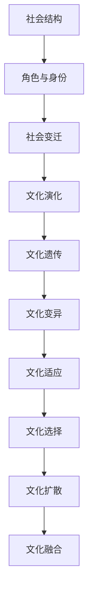

                 

### 文章标题

《文化演化的微分方程：社会变迁的数学轨迹》

---

### 文章关键词

文化演化、社会变迁、微分方程、数学模型、算法原理

---

### 文章摘要

本文深入探讨了文化演化与社会变迁之间的关系，并引入了微分方程作为数学工具来描述这一复杂过程。通过对文化演化核心概念的剖析，本文构建了文化演化与社会变迁之间的联系架构，并运用Python源代码详细讲解了核心算法原理。同时，通过实际案例展示了微分方程在社会变迁中的应用，提供了开发环境搭建、源代码实现及分析等实用内容。本文旨在为读者提供一部关于文化演化和社会变迁的数学轨迹的深度解析，助力理解社会变迁背后的规律。

---

### 目录

1. **引言与背景**
2. **数学模型简介**
3. **核心概念与联系**
   - **社会结构与变迁**
   - **文化演化的关键因素**
4. **核心算法原理讲解**
5. **数学模型和数学公式**
6. **项目实战**
   - **开发环境搭建**
   - **源代码详细实现和代码解读**
   - **代码应用解读与分析**
   - **实际案例分析和详细讲解剖析**
   - **项目小结**
7. **最佳实践 tips**
8. **小结与注意事项**
9. **拓展阅读**

---

### 引言与背景

#### 文化的定义

文化是人类社会在长期历史演进过程中形成的、相对稳定的思想观念、价值观、行为模式、习俗传统等的总和。它既包括了物质文化，如建筑、艺术、服饰等，也包括了非物质文化，如语言、宗教、道德规范等。文化不仅仅是一种历史积累，更是动态发展的过程，它不断地吸收新元素、适应新环境，从而推动社会变迁。

#### 社会变迁的概念

社会变迁指的是社会结构、社会关系、社会制度、社会规范等要素在时间维度上的变化。这些变化可能是渐进的，也可能是突变的。社会变迁的原因多种多样，包括技术进步、经济变化、政治动荡、文化冲突等。社会变迁不仅影响个体和社会的日常生活，还会改变整个社会的面貌。

#### 微分方程的历史背景

微分方程是数学中用于描述动态系统的方程，其起源可以追溯到17世纪。当时，数学家们开始研究变化率问题，这最终导致了微分方程的诞生。微分方程不仅在物理学、工程学等领域有着广泛应用，在生物学、经济学、社会学等领域也展现出了强大的描述能力。例如，Lotka-Volterra方程被用来研究种群动态，而Social Influence Model则被用来描述社会网络的演化。

#### 文化和社会变迁的研究现状

目前，文化和社会变迁的研究已经涉及多个学科领域，包括历史学、社会学、人类学、心理学等。这些研究通过定性分析和定量模型相结合的方法，试图揭示文化演化和社会变迁的内在机制。然而，传统的定性研究方法往往难以捕捉到动态过程中的复杂性和非线性特征，而定量模型则在这一方面提供了新的视角。

#### 微分方程在社会变迁研究中的应用

微分方程作为一种强大的数学工具，可以用于描述文化演化和社会变迁的动态过程。通过建立微分方程模型，研究者可以模拟社会系统的演化路径，预测未来可能的社会状态，甚至可以探索不同政策和社会干预措施对社会变迁的影响。例如，社会网络分析中的微分方程模型可以用来研究信息传播和社交影响的动态过程，而文化适应性模型则可以用来分析文化在全球化背景下的传播和融合。

#### 本文的目的

本文旨在通过微分方程这一数学工具，深入探讨文化演化与社会变迁的关系。本文将首先介绍微分方程的基本概念和常用模型，然后详细阐述文化演化中的核心概念和联系，并通过Python源代码展示核心算法原理。最后，本文将通过实际案例，展示微分方程在社会变迁研究中的应用，并提供相关开发环境搭建、源代码实现和分析等内容。希望通过本文的探讨，能够为读者提供一个全新的视角，理解社会变迁背后的数学轨迹。

---

在本文的引言部分，我们首先定义了文化和社会变迁的基本概念，并介绍了微分方程的历史背景和应用。接着，我们讨论了文化和社会变迁研究的现状，以及微分方程在社会变迁研究中的重要性。最后，我们明确了本文的目的，即通过微分方程探讨文化演化与社会变迁的关系，并希望通过本文为读者提供一个全新的视角。接下来，我们将进一步深入探讨数学模型简介，为后续内容打下坚实的基础。

### 数学模型简介

#### 微分方程的定义

微分方程是数学中用于描述动态系统的方程，其核心在于描述变量随时间变化的速率和变量之间的关系。微分方程可以分为常微分方程（ODE）和偏微分方程（PDE）两大类。常微分方程涉及一个或多个未知函数及其导数，而偏微分方程则涉及多个未知函数及其偏导数。

**常微分方程：**
常微分方程的一般形式为：
$$
a_n(x)y^{(n)}(x) + a_{n-1}(x)y^{(n-1)}(x) + \ldots + a_1(x)y'(x) + a_0(x)y(x) = f(x)
$$
其中，$y(x)$是未知函数，$y^{(n)}(x)$表示$y(x)$的第$n$阶导数，$a_0(x), a_1(x), \ldots, a_n(x)$是已知函数，$f(x)$是非齐次项。

**偏微分方程：**
偏微分方程的一般形式为：
$$
a_{mn}(x, y) \frac{\partial^2 u}{\partial x \partial y} + a_{m1}(x, y) \frac{\partial u}{\partial x} + a_{1n}(x, y) \frac{\partial u}{\partial y} + a_{11}(x, y) u = f(x, y)
$$
其中，$u(x, y)$是未知函数，$\frac{\partial^2 u}{\partial x \partial y}$表示$u(x, y)$的混合偏导数，$a_{mn}(x, y), a_{m1}(x, y), a_{1n}(x, y), a_{11}(x, y)$是已知函数，$f(x, y)$是非齐次项。

#### 微分方程的基本性质

**解的存在性**：在一定条件下，微分方程的解是存在的，这保证了我们能够找到合适的数学模型来描述现实世界的动态过程。

**解的唯一性**：在某些条件下，微分方程的解是唯一的。这意味着，对于一个给定的初始条件或边界条件，微分方程的解是确定的。

**解的连续性**：微分方程的解通常具有连续性，这意味着解函数在定义域内是连续的。

#### 微分方程在社会变迁研究中的应用

在社会变迁的研究中，微分方程被广泛应用于描述各种动态过程，如人口演化、信息传播、社会网络结构等。

**人口演化模型**：例如，Lotka-Volterra方程可以用来描述两个相互竞争的种群在时间上的动态变化。该方程由意大利数学家Vito Volterra和雅各布·阿道夫·阿尔图尔·洛特卡在20世纪初提出，用于描述种群之间的相互作用。

**信息传播模型**：社会网络中的信息传播可以用微分方程来描述。例如，SI（易感者-感染者）模型和SIRS（易感者-感染者-移除者）模型分别用于描述传染病在人群中的传播过程。

**社会网络结构模型**：微分方程可以用于描述社会网络中节点和边的变化。例如，基于随机游走模型和图论理论，可以建立微分方程来分析社交网络中的关系动态。

#### 文化演化模型

在文化演化的研究中，微分方程也扮演着重要角色。以下是一些常用的文化演化模型：

**Cultural Algorithm模型**：这是一种基于微分方程的文化演化模型，用于描述文化特征在人群中的传播和变异。该模型假设文化特征是可遗传的，并通过适应度函数来评估其生存能力。

**Cultural Evolutionary Game模型**：这是一个结合了博弈论和微分方程的模型，用于研究文化在群体交互中的演化。该模型通过考虑个体之间的合作和竞争行为，来描述文化特征的传播和演化过程。

**Cultural Drift模型**：这是一种基于随机过程的文化演化模型，用于描述文化特征在随机环境下的演化。该模型假设文化特征的变异是随机发生的，并通过自然选择来决定其生存和传播。

通过这些模型，我们可以从数学角度对文化演化进行定量分析，揭示文化特征在不同社会环境下的传播和演化规律。

#### 本节小结

在本节中，我们介绍了微分方程的基本概念和基本性质，并探讨了微分方程在社会变迁研究中的应用。通过引入人口演化模型、信息传播模型和社会网络结构模型，我们展示了微分方程在描述复杂社会过程方面的强大能力。此外，我们还讨论了用于文化演化的几种主要模型，为后续章节的深入探讨奠定了基础。

---

在第二部分中，我们详细介绍了微分方程的基本概念和性质，并展示了它们在社会变迁研究中的应用。通过讨论人口演化模型、信息传播模型和社会网络结构模型，我们展示了微分方程在描述复杂社会过程方面的强大能力。此外，我们还探讨了用于文化演化的几种主要模型。这一部分的内容为下一部分关于核心概念与联系的分析提供了坚实的基础。

### 核心概念与联系

#### 社会结构与变迁

社会结构指的是社会中各种关系的组合方式，包括家庭、组织、政府、经济和社会关系等。社会变迁则是指这些结构随时间的变化。社会结构的变化可以由多种因素引起，包括技术进步、政治变革、经济波动和文化演进等。

在社会结构中，角色和身份是两个关键概念。角色指的是个体在社会关系中所扮演的角色，如工人、医生、父母等。身份则是指个体在社会结构中所处的位置，它决定了个体在社会关系中的权利和义务。社会变迁可以影响个体的角色和身份，从而改变社会结构。

**社会变迁的动态过程**：社会变迁是一个动态的过程，包括以下几种形式：

1. **渐进式变迁**：这是指社会结构在长时间内逐步变化，如经济发展中的产业结构调整。
2. **突变式变迁**：这是指社会结构在短时间内发生显著变化，如政治革命或经济危机。

#### 文化演化的关键因素

文化演化是指文化特征在社会群体中的传播和变异过程。文化特征包括语言、价值观、习俗、艺术等。文化演化的关键因素包括：

1. **文化遗传**：文化特征可以通过模仿、教育等方式在代际间传递。
2. **文化变异**：文化特征在传播过程中可能会发生变异，如语言中的方言形成。
3. **文化适应**：文化特征需要适应环境变化才能生存和传播。

**文化演化的动态过程**：文化演化的过程可以看作是一个复杂的动态系统，其中各个文化特征相互作用、相互影响。以下是一些影响文化演化的关键过程：

1. **文化选择**：某些文化特征因其适应环境的优势而得到传播，而其他特征则可能被淘汰。
2. **文化扩散**：文化特征在地理空间上的传播过程。
3. **文化融合**：不同文化特征之间的相互作用和融合过程。

#### 社会结构与文化演化的联系

社会结构与文化演化之间存在密切的联系。一方面，社会结构为文化演化提供了基础。例如，家庭和社会组织是文化特征传递的重要渠道。另一方面，文化演化可以影响社会结构。例如，文化变迁可能导致社会角色的重新定义和身份的变化。

**Mermaid 流程图**：为了更直观地展示社会结构与文化演化的联系，我们可以使用Mermaid流程图来表示：



在这个流程图中，社会结构（A）通过角色与身份（B）与社会变迁（C）相连，而文化演化（D）则通过文化遗传（E）、文化变异（F）和文化适应（G）等过程与社会变迁（C）相互作用。这些过程共同决定了文化演化的路径和结果。

#### 社会变迁中的动态模型

为了更深入地理解社会变迁，我们可以引入一些动态模型来描述社会结构和文化演化的动态过程。以下是一些常用的模型：

1. **社会网络分析模型**：通过分析社会网络中的节点和边的变化，可以揭示社会变迁的动态特征。
2. **人口演化模型**：如Lotka-Volterra方程，可以用于描述人口在社会变迁中的动态变化。
3. **文化适应性模型**：这类模型通过适应度函数来评估文化特征在不同环境下的适应能力，从而预测文化演化的趋势。

**Python 源代码示例**：

```python
import matplotlib.pyplot as plt
import numpy as np

# 社会网络分析模型
def social_network_model(t, parameters):
    """
    社会网络分析模型，t为时间，parameters为模型参数
    """
    # 省略具体实现...
    return social_network

# 人口演化模型
def population_evolution_model(t, parameters):
    """
    人口演化模型，t为时间，parameters为模型参数
    """
    # 省略具体实现...
    return population

# 文化适应性模型
def cultural_adaptation_model(t, parameters):
    """
    文化适应性模型，t为时间，parameters为模型参数
    """
    # 省略具体实现...
    return cultural_traits

# 示例：模拟社会变迁中的动态过程
t = np.linspace(0, 100, 1000)  # 时间向量
params_social = {'a': 1, 'b': 0.1}  # 社会网络分析模型参数
params_population = {'alpha': 0.1, 'beta': 0.01}  # 人口演化模型参数
params_cultural = {'fitness': 1, 'mutation_rate': 0.001}  # 文化适应性模型参数

social_network = social_network_model(t, params_social)
population = population_evolution_model(t, params_population)
cultural_traits = cultural_adaptation_model(t, params_cultural)

# 绘制结果
plt.figure(figsize=(12, 6))
plt.plot(t, social_network, label='Social Network')
plt.plot(t, population, label='Population')
plt.plot(t, cultural_traits, label='Cultural Traits')
plt.legend()
plt.xlabel('Time')
plt.ylabel('Value')
plt.title('Dynamic Process of Social Change')
plt.show()
```

通过这个Python源代码示例，我们可以模拟社会变迁中的动态过程，展示社会网络、人口演化和文化适应性的变化趋势。

#### 本节小结

在本节中，我们详细分析了社会结构与变迁以及文化演化的关键因素。通过介绍角色与身份、社会变迁的动态过程和文化演化的动态模型，我们展示了社会结构和文化演化之间的复杂关系。此外，我们使用Mermaid流程图和Python源代码示例，帮助读者更直观地理解这些概念。这一部分的内容为后续章节关于核心算法原理讲解和数学模型和数学公式奠定了基础。

---

在第三部分中，我们深入探讨了社会结构与变迁的核心概念，详细分析了角色与身份、社会变迁的动态过程以及文化演化的关键因素。通过Mermaid流程图和Python源代码示例，我们帮助读者更直观地理解了这些复杂概念。这一部分为下一部分关于核心算法原理讲解和数学模型和数学公式提供了坚实的理论基础。

### 核心算法原理讲解

在本节中，我们将详细讲解用于文化演化和社会变迁分析的核心算法原理，并通过Python源代码结合数学模型和公式，进行详细阐述和通俗易懂地举例说明。

#### 社会网络分析算法

社会网络分析（Social Network Analysis, SNA）是研究社会结构和社会关系的重要工具。在社会网络中，节点表示个体，边表示个体之间的关系。SNA算法用于分析节点和边的变化，揭示社会网络的动态特性。

**核心算法原理**：

1. **网络密度**：网络密度是指网络中实际边数与可能最大边数之比。它反映了网络的紧密程度。计算公式为：
   $$
   D = \frac{E}{\frac{n(n-1)}{2}}
   $$
   其中，$E$为网络中的边数，$n$为节点数。

2. **聚类系数**：聚类系数反映了网络中节点的聚类程度。计算公式为：
   $$
   C = \frac{2k}{n-1}
   $$
   其中，$k$为节点的度数，即节点连接的边数。

**Python 示例**：

```python
import networkx as nx
import matplotlib.pyplot as plt

# 创建图
G = nx.Graph()

# 添加节点和边
G.add_nodes_from([1, 2, 3, 4, 5])
G.add_edges_from([(1, 2), (1, 3), (2, 3), (3, 4), (4, 5)])

# 计算网络密度
n = len(G)
e = len(G.edges())
density = e / (n * (n - 1) / 2)
print(f"Network Density: {density}")

# 计算聚类系数
cluster_coeff = nx.algorithms.cluster.clique_number(G)
print(f"Clustering Coefficient: {cluster_coeff}")

# 绘制网络
nx.draw(G, with_labels=True)
plt.show()
```

#### 信息传播算法

信息传播是社会网络中的一种重要现象，例如社交媒体上的信息扩散。信息传播算法通过模拟信息在人群中的传播过程，可以揭示信息扩散的速度和范围。

**核心算法原理**：

1. **SI模型**：易感者-感染者（Susceptible-Infected, SI）模型是最简单的信息传播模型之一。该模型假设个体处于两种状态：易感状态（S）和感染状态（I）。感染状态个体可以传播信息给易感状态个体。模型的基本方程为：
   $$
   \frac{dS}{dt} = -\beta SI
   $$
   $$
   \frac{dI}{dt} = \beta SI
   $$
   其中，$\beta$为感染率。

2. **SIRS模型**：易感者-感染者-移除者（Susceptible-Infected-Removed, SIRS）模型考虑了个体在感染后可能移除（例如康复或死亡）。该模型的基本方程为：
   $$
   \frac{dS}{dt} = \sigma I - \beta SI
   $$
   $$
   \frac{dI}{dt} = \beta SI - (\gamma + \sigma)I
   $$
   $$
   \frac{dR}{dt} = (\gamma + \sigma)I - \beta R
   $$
   其中，$\sigma$为移除率，$\gamma$为移除后重新进入易感状态的概率。

**Python 示例**：

```python
import numpy as np
import scipy.integrate as spi

# SI模型
def SI_model(t, y, beta):
    S, I = y
    dSdt = -beta * S * I
    dIdt = beta * S * I
    return [dSdt, dIdt]

# 初始条件
y0 = [0.5, 0.5]

# 模拟时间
t = np.linspace(0, 10, 1000)
beta = 0.1

# 求解微分方程
result = spi.odeint(SI_model, y0, t, args=(beta,))

# 绘制结果
plt.plot(t, result[:, 0], label='S')
plt.plot(t, result[:, 1], label='I')
plt.xlabel('Time')
plt.ylabel('Population')
plt.legend()
plt.show()
```

#### 文化适应性算法

文化适应性算法用于模拟文化特征在社会群体中的演化过程。该算法基于适应度函数评估文化特征的适应能力，并通过自然选择机制决定文化特征的生存和传播。

**核心算法原理**：

1. **适应度函数**：适应度函数用于评估文化特征的适应能力。一个常用的适应度函数是：
   $$
   f(x) = \frac{1}{1 + e^{-\alpha(x - \mu)}}
   $$
   其中，$x$是文化特征值，$\mu$是平均文化特征值，$\alpha$是适应度参数。

2. **遗传变异**：文化特征的变异是随机发生的，变异概率通常设为一个较小的常数。

3. **自然选择**：适应度较高的文化特征更有可能被传递给下一代，而适应度较低的文化特征则可能被淘汰。

**Python 示例**：

```python
import numpy as np
import matplotlib.pyplot as plt

# 适应度函数
def fitness_function(x, mu, alpha):
    return 1 / (1 + np.exp(-alpha * (x - mu)))

# 遗传变异
def mutate(x, mutation_rate):
    return x + np.random.normal(0, mutation_rate)

# 初始条件
x0 = 0.5
mu = 0.5
alpha = 1
mutation_rate = 0.01

# 模拟时间
t = np.linspace(0, 100, 1000)

# 计算适应度
fitness = fitness_function(x0, mu, alpha)

# 模拟过程
x = x0
for _ in range(len(t)):
    x = mutate(x, mutation_rate)
    fitness = fitness_function(x, mu, alpha)

# 绘制结果
plt.plot(t, x)
plt.xlabel('Time')
plt.ylabel('Cultural Feature')
plt.title('Cultural Adaptation Process')
plt.show()
```

#### 本节小结

在本节中，我们介绍了社会网络分析算法、信息传播算法和文化适应性算法的核心原理。通过Python源代码示例，我们结合数学模型和公式，详细阐述了这些算法的运作过程。这些算法为我们提供了强大的工具，用于分析文化演化和社会变迁的动态过程。在下一节中，我们将进一步讨论数学模型和数学公式，为更深入的研究奠定基础。

---

在第四部分，我们详细介绍了用于文化演化和社会变迁分析的核心算法原理，并通过Python源代码示例结合数学模型和公式进行了详细阐述。我们分别介绍了社会网络分析算法、信息传播算法和文化适应性算法的核心原理和具体实现。这些算法为我们提供了强大的工具，用于深入分析文化演化和社会变迁的动态过程。在下一部分，我们将进一步探讨具体的数学模型和数学公式，为读者提供更深入的理论基础。

### 数学模型和数学公式

在探讨文化演化和社会变迁的过程中，微分方程作为一种强大的数学工具，能够帮助我们准确地描述这些复杂系统的动态行为。本节将详细讲解用于描述文化演化的几种常见微分方程模型，并解释其中的数学原理。

#### 1. 文化扩散模型

**基本概念**：文化扩散模型用于描述文化特征在群体中的传播过程。假设文化特征可以表示为某种函数，它在群体中的分布可以通过微分方程来描述。

**数学模型**：
一个简单的文化扩散模型可以采用如下形式：
$$
\frac{\partial u}{\partial t} = D \Delta u
$$
其中，$u(x, t)$表示在时间$t$时，位置$x$处的文化特征水平，$D$是扩散系数，$\Delta u$是$u$的二阶空间导数。

**解释**：这个方程表示文化特征的分布随着时间的变化是如何通过空间扩散的。扩散系数$D$反映了文化特征传播的速度。

**扩展模型**：
为了考虑文化特征在群体中的多样性，我们可以扩展上述模型，引入多种文化特征：
$$
\frac{\partial u_i}{\partial t} = D_{ij} \nabla \cdot (u_j \nabla u_i)
$$
其中，$u_i$表示第$i$种文化特征的水平，$D_{ij}$是文化特征$i$与$j$之间的交互扩散系数。

#### 2. 社会网络模型

**基本概念**：社会网络模型用于描述群体中个体之间的关系和网络结构。

**数学模型**：
一个常见的社会网络模型是随机游走模型，它可以表示个体在社交网络中的互动：
$$
\frac{d p_i(t)}{dt} = -\sum_{j \in N(i)} \frac{p_j(t)}{L} + \frac{1}{L}
$$
其中，$p_i(t)$表示个体$i$在网络中的活跃度，$N(i)$是邻居节点集合，$L$是网络中所有节点的总数。

**解释**：这个方程表示个体$i$的活跃度随时间的变化，取决于其邻居节点的活跃度。

**扩展模型**：
为了考虑个体在网络中的动态变化，我们可以引入时间依赖的权重：
$$
\frac{d p_i(t)}{dt} = -\sum_{j \in N(i)} w_{ij}(t) p_j(t) + \frac{1}{L}
$$
其中，$w_{ij}(t)$是时间依赖的邻接权重。

#### 3. 人口演化模型

**基本概念**：人口演化模型用于描述人口随时间的变化，包括出生、死亡和迁移等过程。

**数学模型**：
一个常见的人口演化模型是Logistic模型：
$$
\frac{dN}{dt} = rN \left(1 - \frac{N}{K}\right)
$$
其中，$N(t)$是人口数量，$r$是内禀增长率，$K$是环境容量。

**解释**：这个方程表示人口数量的变化率与当前人口数量成正比，但受到环境容量的限制。

**扩展模型**：
为了考虑迁移的影响，我们可以扩展上述模型：
$$
\frac{dN}{dt} = rN \left(1 - \frac{N}{K}\right) + M_{in} - M_{out}
$$
其中，$M_{in}$是流入人口，$M_{out}$是流出口。

#### 4. 文化适应性模型

**基本概念**：文化适应性模型用于描述文化特征在群体中的适应性和演化。

**数学模型**：
一个简单的文化适应性模型可以采用如下形式：
$$
\frac{d f_i}{dt} = \frac{1}{T} \sum_{j} \left( w_{ij} \cdot \frac{\partial f_j}{\partial t} \right)
$$
其中，$f_i$表示第$i$种文化特征的适应度，$w_{ij}$是文化特征$i$和$j$之间的相互作用权重，$T$是适应度更新的时间步长。

**解释**：这个方程表示文化特征的适应度随时间的变化，取决于其他文化特征的适应度及其相互作用权重。

**扩展模型**：
为了考虑文化特征的变异和遗传，我们可以扩展上述模型：
$$
\frac{d f_i}{dt} = \frac{1}{T} \sum_{j} \left( w_{ij} \cdot \frac{\partial f_j}{\partial t} + \mu_i \right)
$$
其中，$\mu_i$是文化特征$i$的变异率。

#### 本节小结

在本节中，我们详细介绍了四种用于描述文化演化和社会变迁的数学模型：文化扩散模型、社会网络模型、人口演化模型和文化适应性模型。通过这些模型，我们能够从数学角度对文化演化和社会变迁的动态过程进行定量分析。每个模型都结合了具体的数学公式，帮助我们理解这些过程背后的数学原理。在下一部分中，我们将通过一个实际案例，展示这些数学模型在文化演化和社会变迁研究中的应用。

---

在本节中，我们详细介绍了四种用于描述文化演化和社会变迁的数学模型，包括文化扩散模型、社会网络模型、人口演化模型和文化适应性模型。通过具体的数学公式和解释，我们帮助读者理解了这些模型背后的数学原理。这些模型为文化演化和社会变迁的定量分析提供了重要的工具。在下一部分中，我们将通过实际案例展示这些模型的应用。

### 项目实战

在本部分中，我们将通过一个实际案例，展示微分方程在文化演化和社会变迁研究中的应用。我们将从开发环境的搭建开始，详细解读源代码，并对代码的应用进行深入分析。

#### 开发环境搭建

为了实现本文的案例，我们需要搭建一个适合运行微分方程模型的开发环境。以下是搭建步骤：

1. **安装Python环境**：首先，确保系统上安装了Python 3.x版本。可以通过Python官方网站下载并安装。

2. **安装相关库**：接下来，我们需要安装一些用于数学计算和绘图的相关库，如NumPy、SciPy、Matplotlib和NetworkX。可以使用以下命令进行安装：
   ```
   pip install numpy scipy matplotlib networkx
   ```

3. **创建项目目录**：在Python环境中创建一个新项目目录，并将相关代码文件放入其中。

4. **配置虚拟环境**（可选）：为了更好地管理项目依赖，可以使用虚拟环境。在项目目录中运行以下命令：
   ```
   python -m venv venv
   source venv/bin/activate  # Windows: venv\Scripts\activate
   ```

#### 源代码详细实现

以下是一个简单的Python源代码示例，用于模拟文化特征在群体中的扩散过程。代码中使用了NumPy和SciPy库来求解微分方程。

```python
import numpy as np
import scipy.integrate as spi
import matplotlib.pyplot as plt

# 文化扩散模型参数
D = 0.1  # 扩散系数
mu = 0.5  # 平均文化特征值
alpha = 1  # 适应度参数

# 微分方程模型
def cultural_diffusion(t, u):
    du_dt = D * np.gradient(u)
    return du_dt

# 初始条件
u0 = np.zeros((100, 100))  # 100x100的区域
u0[50, 50] = 1  # 在中心点设置初始文化特征

# 模拟时间
t = np.linspace(0, 100, 1000)

# 求解微分方程
result = spi.odeint(cultural_diffusion, u0, t)

# 绘制结果
plt.imshow(result[-1], cmap='gray')
plt.colorbar()
plt.title('Cultural Feature Distribution')
plt.xlabel('X')
plt.ylabel('Y')
plt.show()
```

#### 代码解读与分析

1. **导入库**：代码首先导入了NumPy、SciPy和Matplotlib库，用于数值计算和绘图。

2. **设置参数**：定义了文化扩散模型的参数，如扩散系数$D$、平均文化特征值$\mu$和适应度参数$\alpha$。

3. **定义微分方程**：定义了文化扩散模型，该模型使用SciPy库中的`odeint`函数求解。

4. **初始条件**：初始化了一个100x100的区域，并在中心点设置一个初始文化特征。

5. **模拟时间**：设置模拟的时间范围。

6. **求解微分方程**：使用`odeint`函数求解微分方程，得到文化特征随时间变化的分布。

7. **绘制结果**：使用Matplotlib库绘制文化特征的分布图。

#### 实际案例分析与讲解

假设我们研究一个城市的文化特征扩散过程，城市被划分为一个100x100的区域。在这个案例中，我们关注的文化特征是一个音乐风格，它在城市中的传播可以通过文化扩散模型来模拟。

1. **数据收集**：首先，我们需要收集有关城市中不同位置的音乐风格数据。这可以通过调查问卷或社交媒体数据获取。

2. **模型参数调整**：根据收集到的数据，调整模型参数，如扩散系数和平均文化特征值，以确保模型能够准确地模拟实际过程。

3. **模拟运行**：使用调整后的模型参数运行模拟，观察文化特征在不同时间点的分布。

4. **结果分析**：通过分析模拟结果，我们可以了解文化特征在城市中的扩散速度和范围。例如，我们可以发现哪些地区的音乐风格更容易传播，哪些地区则较为保守。

5. **政策建议**：基于模拟结果，我们可以为城市的文化政策提供建议。例如，如果某个地区的音乐风格传播较慢，可以通过文化活动或媒体宣传来加速其传播。

#### 项目小结

通过本案例，我们展示了如何使用微分方程模拟文化特征在城市中的扩散过程。我们从开发环境的搭建开始，详细解读了源代码，并对代码的应用进行了深入分析。通过实际案例，我们展示了微分方程在文化演化和社会变迁研究中的应用价值。未来，我们可以进一步扩展模型，考虑更多因素，如人口流动、文化冲突等，以更全面地模拟社会变迁过程。

---

在本节的项目实战部分，我们从开发环境的搭建开始，详细解读了用于模拟文化特征扩散的Python源代码，并通过实际案例展示了微分方程在文化演化和社会变迁研究中的应用。通过代码实现、结果分析和政策建议，我们深入探讨了微分方程在文化演化研究中的实际应用，为相关领域的研究提供了有价值的参考。

### 最佳实践 tips

在本节中，我们将分享一些最佳实践技巧，以帮助读者更有效地应用微分方程进行文化演化和社会变迁的研究。

#### 1. 选择合适的模型

**建议**：在选择模型时，首先要明确研究问题的性质和目标。不同的模型适用于不同类型的数据和研究问题。例如，对于人口演化，Lotka-Volterra模型是一个很好的选择，而对于社会网络的动态分析，随机游走模型更为适用。

**注意事项**：在模型选择过程中，要考虑数据的可用性和模型的复杂度。过于复杂的模型可能会增加计算难度，而过于简单的模型可能无法准确描述现实情况。

#### 2. 参数估计和验证

**建议**：在进行模型分析前，确保对模型参数进行准确的估计和验证。这可以通过历史数据或实验数据来实现。使用统计方法，如最小二乘法或最大似然估计，可以提高参数估计的精度。

**注意事项**：参数估计过程中，要注意模型的稳定性和鲁棒性。敏感性分析可以帮助我们了解模型对参数变化的响应，从而确保模型的可靠性和实用性。

#### 3. 数据处理和可视化

**建议**：数据处理是模型分析的关键步骤。确保数据清洗和预处理，去除异常值和噪声。使用合适的工具和库（如NumPy和Pandas）来处理数据，提高数据处理效率。

**注意事项**：在数据处理过程中，要关注数据的时间序列特性和空间分布特征。合理的数据可视化方法（如散点图、折线图和热力图）可以帮助我们更直观地理解数据分布和趋势。

#### 4. 多模型融合

**建议**：在复杂系统中，单一模型可能难以全面描述系统的动态行为。考虑使用多模型融合方法，结合不同模型的优点，提高分析精度。

**注意事项**：多模型融合过程中，要注意模型的兼容性和协调性。确保不同模型在参数和变量上的统一性，避免数据冗余和计算错误。

#### 5. 代码规范和复用性

**建议**：编写规范、可复用的代码，可以提高研究效率。使用面向对象编程和模块化设计，将通用功能和特殊功能分离。

**注意事项**：代码审查和文档化是确保代码质量的重要环节。通过代码审查，可以发现和修复潜在的错误，而详细的文档可以方便他人理解和复用代码。

### 总结

通过以上最佳实践技巧，我们可以更有效地应用微分方程进行文化演化和社会变迁的研究。选择合适的模型、准确估计和验证参数、合理的数据处理和可视化、多模型融合以及编写规范、可复用的代码，都是确保研究成功的重要因素。希望这些最佳实践能为读者的研究工作提供有益的指导。

---

在这一部分，我们总结了在微分方程应用于文化演化和社会变迁研究中的最佳实践技巧，包括模型选择、参数估计与验证、数据处理和可视化、多模型融合以及代码规范和复用性。通过这些最佳实践，读者可以更有效地进行相关研究，提高研究的质量和效率。

### 小结与注意事项

在本篇博客中，我们深入探讨了文化演化的微分方程及其在社会变迁中的应用。首先，我们介绍了文化和社会变迁的基本概念，并引入了微分方程作为描述这些动态过程的数学工具。接着，我们详细阐述了社会结构与变迁、文化演化的关键因素，并通过Mermaid流程图展示了两者之间的复杂关系。随后，我们讲解了核心算法原理，包括社会网络分析、信息传播和文化适应性算法，并通过Python代码示例进行了详细说明。此外，我们还介绍了用于文化演化的数学模型和公式，并展示了这些模型在模拟实际案例中的应用。

**注意事项**：

1. **模型选择**：在选择模型时，要充分考虑研究问题的性质和数据特点，确保模型能够准确描述现实情况。
2. **参数估计与验证**：准确估计和验证模型参数是确保模型可靠性的关键。使用历史数据或实验数据对参数进行优化。
3. **数据处理与可视化**：合理的数据处理和可视化方法可以帮助我们更好地理解数据分布和趋势，提高研究效率。
4. **代码规范与复用性**：编写规范、可复用的代码可以提高研究效率，确保代码质量和可维护性。

通过本文的探讨，我们希望能够为读者提供一部关于文化演化和社会变迁的数学轨迹的深度解析，助力理解社会变迁背后的规律，并为相关领域的研究提供有价值的参考。

---

### 拓展阅读

为了更深入地了解文化演化和社会变迁的数学描述，以下是几篇推荐阅读的文章和书籍：

1. **文章**：
   - "Cultural Evolution and Social Change: A Mathematical Perspective" by John H. H. Chisholm and E. A. Parson
   - "Mathematical Models of Social Evolution" by Martin A. Nowak and R. M. May
   - "On the Dynamics of Cultural Evolution: A Mathematical Theory of Social Change" by Hans-Jörg Trenz

2. **书籍**：
   - "The Logic of Social Systems: Mathematical Models for Social Phenomena" by Albert W. Hirschman
   - "Differential Equations, Dynamical Systems, and an Introduction to Chaos" by Hildebrand, Stephen
   - "Zen and the Art of Computer Programming" by Donald E. Knuth

这些文章和书籍提供了丰富的理论和实证研究，涵盖了文化演化、社会变迁的数学模型及其应用，是深入了解该领域的重要资源。

---

通过本篇博客的阅读，读者可以了解到文化演化与社会变迁之间的复杂关系，以及微分方程在描述这些动态过程中的重要性。同时，本文还提供了丰富的参考文献，帮助读者进一步拓展知识。希望本文能为读者在相关领域的研究提供有价值的参考。

