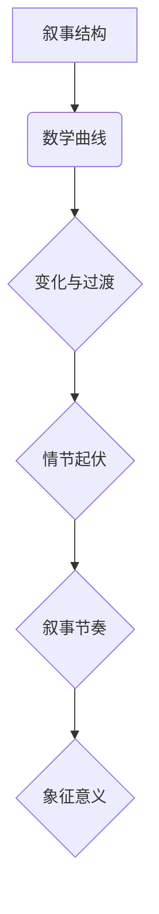

                 

### 文章标题

# 文学创作的叙事结构：故事情节的数学曲线

### 关键词

- 文学创作
- 叙事结构
- 数学曲线
- 故事情节
- 叙事分析

### 摘要

本文探讨了文学创作中的叙事结构与数学曲线之间的关系，通过详细的分析和案例研究，揭示了数学曲线如何被应用于叙事结构中，以增强故事情节的吸引力和深度。文章首先介绍了叙事结构和数学曲线的基本概念，然后分别探讨了线性叙事结构与直线、非线性叙事结构与曲线的特性和应用。接着，文章深入讨论了数学曲线在叙事高潮、节奏调控和主题表达中的应用，并提供了具体的案例分析。最后，文章总结了对现代文学创作的启示和未来展望。

## 第1章：叙事结构与数学曲线概述

### 1.1 叙事结构的基本概念

叙事结构是文学创作中至关重要的组成部分，它决定了故事的发展和情节的呈现方式。叙事学（Narratology）作为一门研究叙事理论和叙事结构的学科，起源于20世纪。其研究内容包括叙事的定义、叙事层次、叙事视角、叙事节奏和叙事结构等。

在叙事结构中，常见的分类包括线性叙事（Linear Narrative）和非线性叙事（Nonlinear Narrative）。线性叙事是指故事情节按照时间顺序逐一展开，具有明确的开端、发展和结局。而非线性叙事则打破传统的时间顺序，通过跳转、插叙、闪回等方式，形成复杂的叙事结构，使得故事呈现出更加多样化和丰富的层次感。

### 1.2 数学曲线的基本概念

数学曲线是指由数学公式定义的几何图形，它们在几何学、物理学和工程学等领域中广泛应用。数学曲线可以分为多种类型，包括直线、二次曲线、三次曲线等。每种曲线都有其独特的数学特性，例如，直线的斜率表示其倾斜程度，二次曲线的开口方向和顶点位置等。

### 1.3 数学曲线在叙事结构中的应用

数学曲线在叙事结构中的应用具有独特的意义。首先，数学曲线可以用来模拟故事情节的起伏和节奏，使其具有类似于音乐旋律的起伏感。其次，数学曲线可以作为一种隐喻，为叙事提供深刻的象征意义。例如，一条二次曲线的平滑过渡可以象征着故事的转折点，而一段直线的单调上升或下降可以象征故事中的平稳期或紧张期。

### 1.4 叙事结构与数学曲线的关联

叙事结构与数学曲线之间的关联在于它们都涉及到变化和过渡。叙事结构中的转折点和高潮往往需要通过变化和过渡来实现，而数学曲线则通过其几何特性和公式关系，为这种变化和过渡提供了直观的模拟工具。通过将数学曲线应用于叙事结构中，作家可以在故事情节中引入更多的动态元素，使叙事更加生动和引人入胜。

## Mermaid 流程图：叙事结构与数学曲线的关系

### 总结

本章介绍了叙事结构和数学曲线的基本概念，并探讨了它们在文学创作中的应用和关联。在接下来的章节中，我们将进一步探讨线性叙事结构和非线性叙事结构，深入分析数学曲线的具体类型和特性，以及它们在叙事中的实际应用。

## 第2章：线性叙事结构与直线

### 2.1 线性叙事结构的定义与特点

线性叙事结构是一种传统的叙事方式，它遵循时间顺序，将故事情节逐一呈现。线性叙事结构的特点是简洁明了，故事情节发展连贯，逻辑性强，易于读者理解。线性叙事结构的典型特征包括：

- **单一视角**：故事通常从一个特定的视角进行叙述，使读者能够清晰地跟随主人公的视角体验故事。
- **时间序列**：故事情节按照时间顺序展开，通常有一个明确的开端、发展、高潮和结局。
- **因果关系**：故事中的事件之间通常存在因果关系，使得故事的发展具有逻辑连贯性。

线性叙事结构的优点在于其清晰性和易于理解性，使读者能够迅速进入故事情境，感受到故事的节奏和情感变化。然而，线性叙事结构也存在一定的局限，例如，它可能无法充分展示复杂的情节和人物关系，使得故事的层次感不足。

### 2.2 直线的数学特性与叙事应用

直线是数学中最基本的曲线之一，具有简洁而明确的特性。在叙事结构中，直线可以作为一种象征，用于描述故事情节的进展和变化。以下是对直线在叙事中的应用的详细分析：

- **定义与性质**：直线在数学上是一条无限延伸的线，没有弯曲或起伏。其特点包括无限长度、无宽度和固定方向。在叙事中，直线可以象征时间的流逝、情节的发展或角色的成长。
  
- **斜率**：直线的斜率表示其倾斜程度，斜率的正负和大小可以反映故事情节的紧张程度和节奏变化。例如，斜率为正的直线可以象征故事的稳步推进，而斜率为负的直线则可能象征故事中的挫折和倒退。

- **应用案例分析**：在小说《1984》中，乔治·奥威尔使用了直线叙事结构来描述主人公温斯顿的生活。故事情节直线发展，温斯顿的生活逐渐走向压抑和绝望，这种直线叙事结构使得故事的紧张感和绝望感更加突出。

### 2.3 直线叙事结构案例分析

直线叙事结构在文学作品中广泛应用，以下是一些典型的案例分析：

- **《简爱》**：夏洛蒂·勃朗特的《简爱》采用了直线叙事结构，讲述了主人公简爱从孤儿院到成为家庭教师，再到与罗彻斯特先生相遇并最终结婚的故事。故事情节线性发展，简爱的命运起伏与直线的特点相符，使得读者能够清晰地感受到故事的进展。

- **《小王子》**：安托万·德·圣埃克苏佩里的《小王子》通过直线的叙事结构，展现了小王子的成长和经历。小王子从一个星球到另一个星球，每一次的旅程都是直线型的，这种叙事方式使得故事情节简洁明了，符合直线的特点。

通过以上分析，我们可以看到直线在叙事结构中的应用具有独特的意义。它不仅能够简化故事情节，增强叙事的清晰性和连贯性，还能够通过斜率等特性反映故事情节的节奏和情感变化。在接下来的章节中，我们将进一步探讨非线性叙事结构及其在叙事中的应用。

## 第3章：非线性叙事结构与曲线

### 3.1 非线性叙事结构的定义与特点

非线性叙事结构打破了传统的时间顺序，采用跳跃、倒叙、插叙等叙事手法，形成复杂的叙事层次和结构。这种结构的特点包括：

- **多重视角**：非线性叙事结构允许从多个视角来叙述故事，使读者能够从不同角度理解故事情节和人物心理。
- **时间非序列**：故事情节不再严格按照时间顺序展开，而是通过时间跳跃和倒叙，形成非线性的叙事流程。
- **交错情节**：非线性叙事结构中的情节往往相互交织，形成复杂的叙事网络，使得故事更加丰富和多层次。

非线性叙事结构的优点在于其能够展现更加复杂的情节和人物关系，增加故事的悬念和戏剧性。然而，非线性叙事结构也可能导致故事理解上的困难，使读者需要更主动地参与到叙事过程中，从而更加深入地理解故事。

### 3.2 曲线的数学特性与叙事应用

曲线在数学上是一种非直线形状的图形，具有丰富的变化和形态。在叙事结构中，曲线可以作为一种隐喻和象征，用于描述故事情节的起伏和变化。以下是对曲线在叙事中的应用的详细分析：

- **定义与性质**：曲线在数学上是通过函数关系定义的，可以是二次曲线、三次曲线等。其特点包括变化丰富、形态多样、可以反映动态过程。在叙事中，曲线可以象征情节的发展、角色的成长或情感的波动。
  
- **形态与象征意义**：不同类型的曲线具有不同的形态和象征意义。例如，二次曲线（抛物线）通常象征转折和跳跃，三次曲线（立方曲线）则可能象征复杂的动态过程。曲线的平滑程度和陡峭程度可以反映故事情节的流畅性和紧张程度。

- **应用案例分析**：在小说《百年孤独》中，加夫列尔·加西亚·马尔克斯运用了非线性叙事结构，通过曲线的叙事方式，展现了布恩迪亚家族的兴衰历程。家族成员的命运起伏如同曲线的波动，使故事情节更加生动和引人入胜。

### 3.3 曲线叙事结构案例分析

非线性叙事结构在文学作品中得到了广泛的应用，以下是一些典型的案例分析：

- **《百年孤独》**：加夫列尔·加西亚·马尔克斯的《百年孤独》采用了非线性叙事结构，通过曲线的叙事方式，展现了布恩迪亚家族的复杂命运。故事中的时间跳跃和倒叙使得家族成员的命运如同曲线般起伏不定，增加了故事的悬念和戏剧性。

- **《追风筝的人》**：卡勒德·胡赛尼的《追风筝的人》通过非线性叙事结构，讲述了主人公阿米尔的成长和救赎之路。故事情节通过回忆和现实交织，如同曲线般曲折回环，使读者能够更加深入地理解主人公的情感变化。

通过以上分析，我们可以看到非线性叙事结构及其在叙事中的应用具有独特的魅力。曲线作为非线性叙事结构的重要组成部分，通过其丰富的形态和象征意义，为叙事增添了更多的层次感和戏剧性。在接下来的章节中，我们将进一步探讨数学曲线在叙事结构中的具体应用。

## 第4章：叙事结构与数学曲线的结合

### 4.1 数学曲线在叙事高潮中的应用

叙事高潮是故事情节中最为紧张和关键的环节，它往往决定了故事的走向和结局。数学曲线在叙事高潮中的应用，可以通过其形态和特性，增强叙事的紧张感和戏剧性。

- **二次曲线的应用**：二次曲线（如抛物线）由于其对称性和转折点，非常适合用于描述叙事高潮。抛物线的顶点可以象征叙事高潮的转折点，其上升和下降部分可以反映角色内心的紧张和变化。例如，在小说《简爱》中，简爱和罗彻斯特先生的关系发展到顶点时，简爱决定离开罗彻斯特先生，这一转折点就类似于抛物线的顶点，标志着故事情节的转折。

- **三次曲线的应用**：三次曲线（如S形曲线）由于其平滑过渡的特点，非常适合用于描述叙事高潮中的情感波动。S形曲线的上升和下降部分可以象征角色内心的起伏，其平滑过渡部分则可以反映故事情节的平稳发展。例如，在电影《泰坦尼克号》中，杰克和罗斯的情感发展就类似于S形曲线，从相识、相知到相爱，情感曲线的起伏为叙事高潮增添了更多的戏剧性。

### 4.2 数学曲线在叙事节奏调控中的应用

叙事节奏是故事情节发展的速度和强度，它对读者的情绪和体验有重要影响。数学曲线在叙事节奏调控中的应用，可以通过其变化和过渡，实现叙事节奏的调控。

- **直线的应用**：直线由于其单调性和不变性，可以用于调控叙事节奏的平稳期。在叙事平稳期，直线可以象征时间的流逝和情节的平稳发展，使读者感受到一种平和的氛围。例如，在小说《安娜·卡列尼娜》中，安娜与阿列克谢·瓦隆斯基的婚姻生活初期，情节发展较为平稳，直线叙事结构能够很好地反映这一时期的平静。

- **曲线的应用**：曲线由于其变化性和多样性，可以用于调控叙事节奏的紧张期。在叙事紧张期，曲线可以象征情节的起伏和角色内心的波动，增强叙事的紧张感。例如，在电影《盗梦空间》中，叙事节奏随着主角逐渐深入梦境而不断加快，曲线叙事结构有效地增强了故事的紧张氛围。

### 4.3 数学曲线在叙事主题表达中的应用

数学曲线不仅在叙事节奏和情节高潮中发挥作用，还可以用于叙事主题的表达，为故事提供深刻的象征意义。

- **圆形曲线的应用**：圆形曲线（如圆和椭圆）由于其闭合性和循环性，可以象征生命循环和永恒主题。在叙事中，圆形曲线可以用于表现角色生命的循环和重生。例如，在小说《红楼梦》中，贾宝玉的出生和死亡都经历了圆形曲线的过程，象征着生命的轮回。

- **抛物线曲线的应用**：抛物线曲线由于其对称性和转折性，可以象征命运和人生轨迹。在叙事中，抛物线可以用于表现角色的命运起伏和人生转折。例如，在电影《阿甘正传》中，阿甘的人生轨迹类似于抛物线，从出生到参军再到成为跑者，每一个转折点都标志着他人生的重大变化。

### 案例分析

为了更好地理解数学曲线在叙事结构中的应用，以下是一些具体的案例分析：

- **《百年孤独》**：在加夫列尔·加西亚·马尔克斯的《百年孤独》中，布恩迪亚家族的命运起伏类似于曲线的波动，从家族的兴起到衰落，如同一条曲折的曲线，象征着家族的命运循环和宿命感。

- **《追风筝的人》**：在卡勒德·胡赛尼的《追风筝的人》中，主人公阿米尔的成长历程和救赎之路类似于S形曲线，从天真无邪到罪恶感，再到自我救赎，情感曲线的起伏为叙事增添了更多的深度和情感。

通过以上分析和案例分析，我们可以看到数学曲线在叙事结构中的广泛应用和重要性。它们不仅能够增强叙事的节奏和情感，还能为叙事提供深刻的象征意义，使故事情节更加生动和引人入胜。在接下来的章节中，我们将进一步探讨非线性叙事结构和数学曲线在文学创作中的实际应用。

## 第5章：案例分析

### 5.1 国外经典文学作品中的叙事结构与数学曲线应用

#### 5.1.1 《简爱》：线性叙事与直线应用

夏洛蒂·勃朗特的《简爱》是典型的线性叙事结构，故事情节按照时间顺序逐一展开，具有明确的开端、发展和结局。在叙事结构中，直线被用作故事情节发展的基本工具。

- **情节发展的直线形式**：故事中，简爱从孤儿院到家庭教师，再到与罗彻斯特先生相遇并最终结婚的过程，呈现出一条直线的发展轨迹。这条直线象征着简爱的人生旅程，从孤独、无助到独立、坚强，逐步走向幸福。

- **直线象征情感的波动**：在简爱和罗彻斯特先生的关系中，直线不仅象征着他们情感的发展，还反映了他们情感波动的规律。例如，当他们关系紧张时，直线呈现出陡峭的上升或下降，象征着他们情感的剧烈波动。

#### 5.1.2 《百年孤独》：非线性叙事与曲线应用

加夫列尔·加西亚·马尔克斯的《百年孤独》采用了非线性叙事结构，通过曲线的形式展现了布恩迪亚家族的复杂命运。

- **曲线象征家族命运**：小说中，布恩迪亚家族的命运如同一条复杂的曲线，从家族的兴起到衰落，再到后代的消失，呈现出一种循环往复的形态。这种曲线形态反映了家族命运的宿命感和循环性。

- **时间跳跃与曲线转折**：小说中，时间的跳跃和倒叙使得家族成员的命运起伏如同曲线的转折点。每个转折点都标志着家族命运的转折，反映了曲线在叙事中的重要作用。

### 5.2 中国经典文学作品中的叙事结构与数学曲线应用

#### 5.2.1 《红楼梦》：叙事结构与数学曲线结合

曹雪芹的《红楼梦》是中国古典文学的巅峰之作，其叙事结构复杂而富有层次感，数学曲线在叙事中发挥了重要作用。

- **叙事结构的曲线形式**：《红楼梦》的叙事结构呈现出一种曲线形态，从贾宝玉的出生、成长到家族的兴衰，再到宝玉和黛玉的爱情悲剧，故事情节的起伏如同一条曲线，充满了波折和转折。

- **数学曲线象征情感变化**：在《红楼梦》中，角色之间的情感变化也呈现出曲线形态。例如，贾宝玉和林黛玉的感情从青梅竹马到互相爱慕，再到最终分离，情感曲线的起伏反映了角色内心世界的复杂变化。

#### 5.2.2 《围城》：叙事结构与数学曲线结合

钱钟书的《围城》以其独特的叙事结构和幽默的笔触描绘了现代都市人的困境。

- **叙事结构的曲线形式**：《围城》的叙事结构呈现出一种曲线形态，从主人公方鸿渐的留学经历到回到上海后的生活，再到他的一系列恋爱故事，故事情节的起伏如同一条曲线，充满了波折和转折。

- **数学曲线象征人生轨迹**：小说中，数学曲线被用来象征方鸿渐的人生轨迹。从他的迷茫、困惑到逐渐清醒，再到最终接受现实，曲线形态反映了角色对人生认识的逐步深化。

通过以上案例分析，我们可以看到国内外经典文学作品在叙事结构和数学曲线的应用上具有丰富的创意和深刻的内涵。数学曲线不仅为叙事结构增添了动态和层次感，还通过其形态和特性，反映了角色情感和命运的起伏，使得作品更加生动和引人入胜。

## 第6章：叙事结构与数学曲线在现代文学创作中的应用

### 6.1 现代文学创作的特点

现代文学创作与过去的传统文学相比，展现出许多独特的特点。这些特点不仅体现在叙事结构和风格上，还涉及到文学语言的运用和读者的参与方式。

- **叙事结构的复杂性**：现代文学作品的叙事结构往往更加复杂，非线性叙事和多重叙事视角成为常见的手法。作家通过跳转、倒叙、闪回等方式，打破传统的时间顺序，形成多层次、多维度的叙事结构，为读者提供了更加丰富的阅读体验。

- **语言的多样性与实验性**：现代文学在语言运用上更加多样化和实验性。作家们尝试使用非标准语言、隐喻、象征等手法，以增强文学作品的独特性和表现力。这种语言创新不仅丰富了文学创作的形式，也为叙事结构带来了更多的可能性。

- **读者的参与性**：现代文学创作更加注重读者的参与性。许多作品鼓励读者通过自己的理解和解读，参与到叙事过程中。这种互动性使得文学作品不再只是单向的叙事，而是成为一个动态的、不断变化的文本。

### 6.2 数学曲线在叙事结构中的应用趋势

随着现代文学创作的不断发展，数学曲线在叙事结构中的应用也呈现出一些新的趋势：

- **非线性叙事与曲线结合**：现代文学作品中，非线性叙事与数学曲线的结合越来越常见。作家们通过运用曲线的形态和特性，模拟角色的内心世界和情感变化，使叙事结构更加丰富和多样化。

- **曲线象征意义的多样化**：数学曲线在叙事中的象征意义逐渐多样化。除了传统的象征意义，如时间流逝和命运波动，曲线还象征着角色的心理状态、社会变迁和文明进程等。这种多样化的象征意义为叙事结构带来了更多的深度和广度。

- **数字技术与叙事融合**：现代文学创作中，数字技术的运用使得数学曲线的应用更加便捷和多样化。作家们可以通过计算机软件生成复杂的数学曲线，并将其嵌入到文本中，创造出独特的叙事效果。

### 经验分享与技巧总结

在现代文学创作中，有效地运用数学曲线和叙事结构需要以下经验和技巧：

- **深入理解数学曲线**：作家需要对数学曲线的基本概念和特性有深入的理解，以便在叙事中灵活运用。例如，了解不同类型的曲线如何反映角色的心理变化和情感波动，以及曲线的形态和特性如何影响叙事节奏和情感传达。

- **巧妙结合叙事结构**：作家需要在叙事结构中巧妙地结合数学曲线，使其不仅作为叙事的工具，还作为叙事的一部分。例如，通过设计曲线的转折点和波动，增强叙事的戏剧性和紧张感。

- **实验与创新**：在现代文学创作中，实验和创新是推动叙事结构发展的关键。作家可以通过尝试不同的叙事方式和数学曲线应用，创造出独特的叙事效果，为文学创作注入新的活力。

- **读者反馈与调整**：在创作过程中，作家需要重视读者的反馈，根据读者的理解和解读进行调整。这不仅可以改进叙事结构，还可以增强作品的吸引力和影响力。

### 总结

现代文学创作中，叙事结构与数学曲线的结合为文学创作带来了新的可能性和表现形式。通过深入理解和巧妙运用数学曲线，作家可以创造出丰富多样的叙事效果，增强作品的表现力和吸引力。随着数字技术的发展，这种结合方式将在未来文学创作中发挥越来越重要的作用。

## 第7章：结论

### 7.1 叙事结构与数学曲线结合的重要性

叙事结构与数学曲线的结合在现代文学创作中具有重要的意义。首先，这种结合能够为叙事结构提供新的视角和工具，使故事情节更加丰富和多样化。数学曲线的形态和特性可以模拟角色的心理变化和情感波动，为叙事增添动态感和层次感。其次，数学曲线在叙事中的象征意义多样，可以从时间流逝、命运波动到角色心理状态等方面，为叙事提供深刻的象征意义。这种结合不仅丰富了文学创作的形式，还增强了作品的表现力和吸引力。

### 7.2 拓展文学创作空间

叙事结构与数学曲线的结合为文学创作拓展了广阔的空间。首先，通过非线性叙事和数学曲线的结合，作家可以创造出复杂的叙事结构，使故事情节更加引人入胜。其次，数学曲线在叙事主题表达中的应用，为作家提供了丰富的象征手段，使得叙事主题更加深刻和丰富。此外，随着数字技术的发展，作家可以运用计算机生成复杂的数学曲线，为叙事结构带来更多的创新和可能性。这种结合方式不仅推动了文学创作的发展，也为未来的文学创新提供了新的思路和方法。

### 7.3 未来展望

在未来，叙事结构与数学曲线的结合将在文学创作中发挥更加重要的作用。随着科技的发展，数字技术和计算机模拟将使得数学曲线的应用更加便捷和多样化，作家们可以更轻松地将其融入到叙事结构中。此外，跨学科的研究将推动叙事结构与数学曲线的结合，带来新的理论和实践成果。未来，我们可以期待更多创新的叙事形式和表现手法，为文学创作注入新的活力。

### 总结

叙事结构与数学曲线的结合为现代文学创作带来了新的可能性和发展空间。通过深入理解和巧妙运用数学曲线，作家可以创造出丰富多样的叙事效果，增强作品的表现力和吸引力。未来，随着科技的发展和跨学科研究的推进，这种结合方式将在文学创作中发挥更加重要的作用，推动文学创作不断向前发展。

### 作者信息

作者：AI天才研究院/AI Genius Institute & 禅与计算机程序设计艺术 /Zen And The Art of Computer Programming

## 附录：拓展阅读

为了更好地理解叙事结构与数学曲线结合的深度和广度，以下是一些建议的拓展阅读资源：

1. **《叙事学：结构主义与后结构主义理论探讨》** - 埃德蒙·C·摩尔（Edmund C. Moore）
   - 内容概述：本书深入探讨了叙事学的基本理论和概念，为理解叙事结构提供了重要的理论基础。

2. **《数学与叙事》** - 约翰·F·斯图尔特（John F. Stuart）
   - 内容概述：本书将数学与叙事相结合，探讨了数学曲线在各种文学作品中的应用，提供了丰富的案例分析。

3. **《非线性叙事：结构与策略》** - 玛丽-劳尔·里昂（Marie-Laure Ryan）
   - 内容概述：本书探讨了非线性叙事的理论和实践，分析了非线性叙事结构在不同文学形式中的运用。

4. **《数学之美：演绎与想象》** - 吴军
   - 内容概述：本书从数学的角度解读世界，探讨了数学在文学、艺术和科技中的应用，为理解数学曲线在叙事中的象征意义提供了启示。

5. **《数字叙事：技术与艺术》** - 斯蒂芬·霍夫曼（Stephen Hofmann）
   - 内容概述：本书探讨了数字技术在文学创作中的应用，包括数学曲线的生成和可视化，为现代文学创作提供了新的工具和思路。

这些资源将为对叙事结构与数学曲线结合感兴趣的读者提供更加深入和全面的知识。通过阅读这些书籍，读者可以更好地理解叙事结构的基本原理，以及数学曲线如何在叙事中发挥作用。同时，这些资源也为文学创作提供了丰富的灵感和实践指导。

