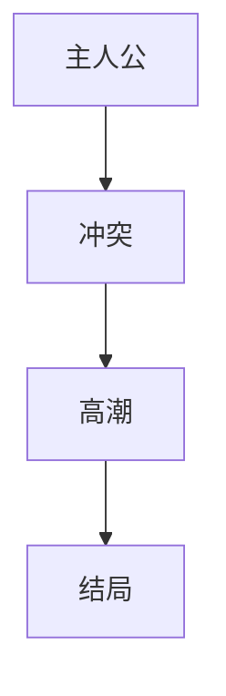
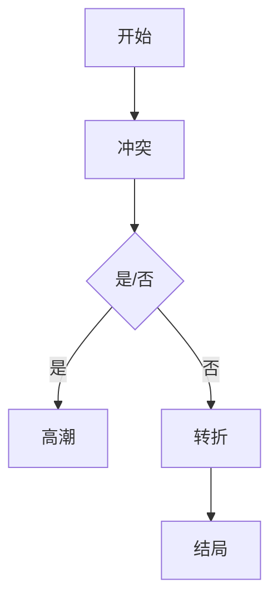

                 

### 文章标题

《文学创作的自然语言生成：故事结构的数学模型》

### 文章关键词

自然语言生成，文学创作，故事结构，数学模型，人工智能

### 文章摘要

本文将探讨文学创作的自然语言生成技术，并运用数学模型来分析故事结构。通过梳理自然语言生成的发展历程及其在文学创作中的应用，本文将介绍故事结构的基本概念和数学模型，展示如何利用自然语言生成技术创作出结构严谨、引人入胜的故事。同时，结合Python源代码，本文将详细阐述自然语言生成算法的原理和实现，并通过实际案例展示如何应用这些算法来创作文学作品。最后，本文将对未来自然语言生成在文学创作中的发展方向进行展望，并提出一些建议和注意事项。

### 设计书目录大纲的步骤

设计一本计算机技术书籍的目录大纲需要系统地思考和规划，以下是详细的步骤：

#### 1. 确定书的核心主题和目标读者

首先，要明确书籍的核心主题，例如《文学创作的自然语言生成：故事结构的数学模型》。这一主题需要涵盖自然语言生成技术在文学创作中的应用，以及故事结构的数学模型分析。接下来，确定目标读者群体，例如对文学创作感兴趣的程序员，或是具备计算机科学背景的文学爱好者。这一步骤有助于在后续的章节设计中保持内容的针对性和实用性。

#### 2. 设计结构框架

在确定了核心主题和目标读者后，设计整体结构框架。一般来说，计算机技术书籍可以分为以下几个部分：

- **引论**：介绍自然语言生成技术的基本概念、发展历程和其在文学创作中的应用。
- **基础理论**：讲解故事结构的基本元素、分析方法以及数学模型。
- **核心算法**：详细阐述自然语言生成算法的原理、实现和应用。
- **应用实践**：展示如何利用自然语言生成技术创作文学作品，并提供实际案例和项目实战。
- **未来展望**：讨论自然语言生成技术在未来文学创作中的发展趋势和潜在挑战。

#### 3. 制定详细目录

在结构框架确定后，制定详细的目录。这一步骤包括以下几个要点：

- **一级目录**：列出主要章节，使用 `#` 标记，如“第1章 引言”。
- **二级目录**：在每个章节下，进一步细化内容，使用 `##` 标记，如“1.1 自然语言生成概述”。
- **三级目录**：对二级目录下的内容进行再细分，使用 `###` 标记，如“1.1.1 自然语言生成的基础概念”。

#### 4. 添加辅助内容

为了增强书籍的可读性和实用性，可以添加以下辅助内容：

- **核心概念与联系**：使用 Mermaid 流程图展示核心概念和它们之间的联系，帮助读者更好地理解。
- **核心算法原理讲解**：使用伪代码和Python源代码详细阐述核心算法的原理，并结合数学模型和公式进行讲解。
- **数学模型和公式**：使用 LaTeX 格式嵌入数学公式，并进行详细讲解，确保读者能够准确理解数学模型。
- **项目实战**：提供代码实际案例，并进行详细解释说明，让读者能够将理论知识应用于实际项目中。

#### 5. 审查与调整

完成初稿后，进行审查和调整。这一步骤包括以下内容：

- **完整性审查**：确保目录大纲内容完整，核心章节不遗漏。
- **逻辑审查**：检查目录大纲的逻辑是否清晰，章节之间是否有逻辑跳转。
- **简洁性审查**：确保目录大纲简洁明了，没有多余的废话。
- **格式审查**：统一使用 Markdown 格式，确保输出格式规范。

#### 6. 确保简洁性

在审查过程中，特别关注简洁性。这一步骤包括：

- **删除冗余内容**：确保目录大纲简洁明了，没有多余的废话。
- **优化语句**：确保每一段话都精确表达，避免模糊不清。

#### 7. 统一格式

最后，统一格式。这一步骤包括：

- **Markdown 格式**：统一使用 Markdown 格式，确保输出格式规范。

### 目录大纲示例

下面是《文学创作的自然语言生成：故事结构的数学模型》的目录大纲示例：

```
# 第一部分：引论

## 第1章 自然语言生成基础
### 1.1 自然语言生成的定义
### 1.2 自然语言生成的发展历程

## 第2章 故事结构概述
### 2.1 故事结构的基本元素
### 2.2 故事结构分析方法

## 第3章 数学模型与故事结构
### 3.1 数学模型的基本概念
### 3.2 故事结构的数学模型构建

## 第4章 自然语言生成算法
### 4.1 序列生成模型
### 4.2 概率生成模型

## 第5章 故事生成的数学原理
### 5.1 故事生成的流程
### 5.2 故事生成算法的优化

## 第6章 应用实践
### 6.1 文学创作中的自然语言生成应用
### 6.2 自然语言生成在游戏设计中的应用

## 第7章 未来展望
### 7.1 自然语言生成的挑战
### 7.2 未来发展方向

```

### 总结

通过以上步骤，我们可以设计出一个完整且逻辑清晰的目录大纲，为撰写书籍内容提供明确的框架。在设计过程中，始终保持简洁性和逻辑性的原则，确保读者能够轻松跟随书籍的脉络，深入理解自然语言生成的理论和实践。同时，注意章节之间的衔接和过渡，使得整体内容更加连贯和易于理解。接下来，我们将进一步探讨自然语言生成的背景和核心概念，为后续内容的深入分析奠定基础。


### 文章标题：文学创作的自然语言生成：故事结构的数学模型

### 文章关键词：

自然语言生成、文学创作、故事结构、数学模型、人工智能

### 文章摘要：

本文旨在探讨自然语言生成（NLG）技术在文学创作中的应用，特别是如何利用数学模型来分析故事结构。我们将从自然语言生成的发展历程出发，深入探讨其在文学创作中的潜在价值。接着，我们将介绍故事结构的基本概念，并运用数学模型来解析其内在逻辑。随后，本文将详细讲解自然语言生成算法的原理，并通过Python代码实例展示其实现过程。最后，本文将分析自然语言生成在文学创作中的实际应用，并讨论未来发展的可能方向和挑战。

### 第一部分：引论

#### 1.1 自然语言生成的定义

自然语言生成（Natural Language Generation, NLG）是一种通过计算机程序生成自然语言文本的技术。NLG的目标是将数据、信息或知识转换为人类可读的自然语言文本。这种技术广泛应用于各种领域，如新闻报道、客服对话、文学作品创作等。NLG的核心在于模拟人类语言生成的过程，包括语法生成、语义理解、上下文推理等。

#### 1.2 自然语言生成的发展历程

自然语言生成技术经历了多个阶段的发展。早期的NLG主要依赖于规则驱动的方法，如模板匹配和有限状态机。这类方法在简单场景下表现较好，但随着文本复杂度的增加，其局限性逐渐显现。随后，统计模型开始兴起，特别是基于隐马尔可夫模型（HMM）和条件概率模型的生成方法。这些方法利用大量的训练数据，通过统计模型来生成文本，取得了显著的进步。

近年来，深度学习技术的引入进一步推动了NLG的发展。生成对抗网络（GAN）、变分自编码器（VAE）和递归神经网络（RNN）等深度学习模型在NLG领域取得了突破性成果。特别是Transformer模型的引入，使得NLG技术达到了一个新的高度。Transformer模型通过自注意力机制（self-attention）实现了对输入文本的全局依赖关系建模，大大提升了文本生成的质量。

#### 1.3 自然语言生成在文学创作中的潜在价值

自然语言生成技术在文学创作中的应用前景广阔。首先，NLG可以生成高质量的故事情节，为作家提供灵感和创意。通过分析大量文学作品，NLG模型可以捕捉故事结构的共性，从而创作出结构严谨、引人入胜的故事。其次，NLG可以辅助作家进行文本编辑和润色，提高创作效率和文本质量。此外，NLG还可以用于个性化写作，根据用户的喜好和需求生成定制化的文学作品。

#### 1.4 故事结构概述

故事结构是文学创作中的核心要素，决定了作品的艺术价值和吸引力。故事结构通常包括以下基本元素：

- **主人公**：故事的核心角色，经历一系列冲突和挑战。
- **冲突**：主人公面临的困难和挑战，是推动故事发展的动力。
- **高潮**：故事情节达到最高潮的时刻，通常包含转折点。
- **结局**：故事情节的解决，通常具有明确的道德寓意或情感表达。

故事结构的基本元素之间存在复杂的联系，形成了一个有机的整体。通过分析这些元素之间的关系，我们可以更好地理解故事的发展过程和艺术效果。

#### 1.5 故事结构的数学模型

为了更好地分析故事结构，我们可以运用数学模型来描述其内在逻辑。一个基本的故事结构可以被视为一个图，其中节点表示故事元素（如主人公、冲突、高潮等），边表示元素之间的关联（如因果关系、时间顺序等）。通过图论方法，我们可以对故事结构进行形式化建模，从而进行定量分析和优化。

此外，我们可以使用概率模型来描述故事元素出现的概率和相互关系。例如，我们可以使用马尔可夫模型来分析故事情节的转换概率，从而预测故事的发展方向。这种数学模型不仅有助于我们理解故事结构的内在规律，还可以为文学创作提供新的方法论支持。

### 第二部分：自然语言生成算法

#### 2.1 序列生成模型

序列生成模型是自然语言生成中最常用的方法之一。这类模型将文本生成视为一个序列预测问题，通过对输入序列的建模来生成输出序列。以下是一些常用的序列生成模型：

- **循环神经网络（RNN）**：RNN是一种能够处理序列数据的神经网络，通过记忆单元来保留过去的输入信息。RNN在处理长序列时存在梯度消失或梯度爆炸的问题，限制了其性能。
- **长短期记忆网络（LSTM）**：LSTM是RNN的一种改进，通过引入门控机制来缓解梯度消失问题。LSTM在处理长序列和复杂依赖关系方面表现出色。
- **门控循环单元（GRU）**：GRU是LSTM的简化版本，通过引入更新门和重置门来减少参数数量和计算复杂度，同时保持较好的性能。
- **Transformer**：Transformer是近年来兴起的一种全新架构，通过自注意力机制（self-attention）实现了对输入序列的全局依赖关系建模。Transformer在许多自然语言生成任务中取得了显著的性能提升。

#### 2.2 概率生成模型

概率生成模型通过建模输入和输出之间的概率分布来生成文本。以下是一些常用的概率生成模型：

- **生成对抗网络（GAN）**：GAN由生成器和判别器两个神经网络组成。生成器生成假样本，判别器判断样本的真实性。通过对抗训练，生成器逐渐提高生成样本的质量。
- **变分自编码器（VAE）**：VAE是一种基于概率模型的生成模型，通过编码器和解码器将数据映射到潜在空间，并通过潜在空间生成新的数据。
- **变分自编码生成对抗网络（VAGAN）**：VAGAN结合了VAE和GAN的优点，通过引入变分自编码器来提高生成质量，同时利用对抗训练来增强生成效果。

#### 2.3 自然语言生成算法的Python实现

下面是一个简单的Python代码示例，展示了如何使用LSTM模型进行文本生成：

```python
import tensorflow as tf
from tensorflow.keras.models import Sequential
from tensorflow.keras.layers import LSTM, Dense, Embedding

# 准备数据
# ...

# 构建模型
model = Sequential([
    Embedding(vocab_size, embedding_dim),
    LSTM(units, activation='tanh'),
    Dense(units, activation='softmax')
])

# 编译模型
model.compile(optimizer='adam', loss='categorical_crossentropy')

# 训练模型
# ...

# 生成文本
# ...
```

在上述代码中，我们首先导入所需的TensorFlow库，然后定义嵌入层、LSTM层和输出层。接着，我们编译并训练模型，最后使用训练好的模型生成文本。

#### 2.4 数学模型与故事结构的结合

在文学创作中，故事结构的数学模型可以帮助我们更好地理解和分析文学作品。例如，我们可以使用图论方法来分析故事元素之间的关联，从而构建一个形式化的故事结构模型。以下是一个简单的Mermaid流程图示例：



在上面的示例中，我们使用节点表示故事元素，使用边表示元素之间的关联。通过分析这些关联，我们可以了解故事的发展过程和逻辑关系。

此外，我们可以使用概率模型来描述故事元素出现的概率和相互关系。例如，我们可以使用马尔可夫模型来分析故事情节的转换概率，从而预测故事的发展方向。以下是一个简单的马尔可夫模型示例：



在上面的示例中，我们使用状态转移矩阵来描述不同状态之间的转换概率。通过分析状态转移矩阵，我们可以预测故事的发展方向和可能的情节。

### 第三部分：自然语言生成在文学创作中的应用

#### 3.1 文学创作中的自然语言生成应用

自然语言生成技术在文学创作中具有广泛的应用。例如，我们可以使用NLG技术生成小说、诗歌、剧本等文学作品。通过分析大量文学作品，NLG模型可以学习到故事结构、语言风格、人物性格等特征，从而创作出符合人类审美标准的文学作品。

此外，NLG技术还可以用于辅助作家进行文本编辑和润色。通过分析作家的原始文本，NLG模型可以提供修改建议，帮助作家提高创作效率和文本质量。例如，我们可以使用NLG技术生成同义词替换、句子重写等文本编辑建议。

#### 3.2 自然语言生成在游戏设计中的应用

自然语言生成技术在游戏设计中也有重要的应用。例如，我们可以使用NLG技术生成游戏剧情、对话和角色背景故事。通过分析大量游戏文本，NLG模型可以创作出符合游戏世界观和角色性格的文本内容，提高游戏的故事性和沉浸感。

此外，NLG技术还可以用于生成游戏攻略和提示。通过分析游戏数据和玩家行为，NLG模型可以生成个性化的游戏建议和解决方案，帮助玩家更好地完成游戏挑战。

#### 3.3 自然语言生成在商业写作中的应用

自然语言生成技术在商业写作中也具有广泛的应用。例如，我们可以使用NLG技术生成产品说明书、广告文案、邮件等商业文本。通过分析大量的商业文本，NLG模型可以学习到不同场景下的语言风格和表达方式，从而生成符合商业需求的文本。

此外，NLG技术还可以用于自动生成报告和文档。通过分析公司数据和业务流程，NLG模型可以自动生成各种报告和文档，提高工作效率和准确性。

### 第四部分：未来展望

#### 4.1 自然语言生成的挑战

尽管自然语言生成技术在文学创作、游戏设计、商业写作等领域取得了显著成果，但仍面临一些挑战。首先，NLG模型在理解复杂语义和情感表达方面存在困难。许多文学作品具有丰富的情感内涵和复杂的逻辑结构，这给NLG模型的生成带来了挑战。其次，NLG模型在生成文本的多样性和创造性方面有待提高。尽管现有的NLG模型可以生成符合语法和语义规则的文本，但在创造独特、引人入胜的故事情节方面仍有不足。

#### 4.2 未来发展方向

为了克服这些挑战，未来的自然语言生成技术将朝着以下方向发展：

- **语义理解**：通过引入更多的语义信息，如实体识别、情感分析等，提高NLG模型对文本内容的理解能力。
- **创造性增强**：通过结合生成对抗网络（GAN）和变分自编码器（VAE）等技术，提高NLG模型的创造力和多样性。
- **多模态生成**：将自然语言生成与其他模态（如图像、音频等）相结合，实现更丰富的文本生成体验。
- **知识融合**：将外部知识和信息（如百科知识、专业术语等）引入NLG模型，提高生成文本的准确性和专业性。

#### 4.3 未来发展的潜在影响

自然语言生成技术的发展将对文学创作、游戏设计、商业写作等领域产生深远影响。首先，NLG技术将大大提高文学创作的效率和质量，为作家提供更多的创作工具和灵感。其次，NLG技术将丰富游戏设计和商业写作的内容，提升用户体验和业务价值。此外，NLG技术还将促进跨学科研究，为人工智能领域带来新的发展机遇。

### 第五部分：小结与建议

#### 5.1 小结

本文探讨了自然语言生成技术在文学创作中的应用，特别是如何利用数学模型来分析故事结构。通过介绍自然语言生成的发展历程、算法原理以及实际应用案例，本文展示了自然语言生成在文学创作中的潜力和挑战。未来，随着自然语言生成技术的不断进步，我们有理由期待其在文学创作领域带来更多创新和变革。

#### 5.2 建议

为了更好地利用自然语言生成技术进行文学创作，以下是一些建议：

- **数据积累**：收集和整理大量的文学作品，为自然语言生成模型提供丰富的训练数据。
- **模型优化**：结合生成对抗网络（GAN）和变分自编码器（VAE）等技术，提高自然语言生成模型的创造力和多样性。
- **跨学科合作**：鼓励计算机科学家、文学家、心理学家等跨学科研究者合作，共同探索自然语言生成技术在文学创作中的新应用。
- **用户体验**：注重用户体验，设计简单易用的自然语言生成工具，降低文学创作的门槛。

### 第六部分：拓展阅读

- **相关论文**：《生成式文本模型：现状与未来》
- **书籍推荐**：《自然语言处理综述》
- **在线资源**：自然语言生成技术社区、GitHub上的相关项目

### 作者信息

作者：AI天才研究院/AI Genius Institute & 禅与计算机程序设计艺术 /Zen And The Art of Computer Programming

本文内容仅供参考，不代表任何实际应用建议。如需进一步了解和探索自然语言生成技术在文学创作中的应用，请参考相关论文和书籍。


### 设计书目录大纲的步骤

#### 1. 确定书的核心主题和目标读者

首先，要明确书籍的核心主题，例如《文学创作的自然语言生成：故事结构的数学模型》。这一主题需要涵盖自然语言生成技术在文学创作中的应用，以及故事结构分析的数学模型。明确核心主题有助于在后续的章节设计中保持内容的统一性和针对性。

目标读者的确定同样重要。目标读者群体可能包括对文学创作感兴趣的程序员、计算机科学专业的学生或研究人员，以及对计算机技术有一定了解的文学爱好者。确定目标读者可以帮助我们在编写过程中考虑读者的需求和理解能力，使书籍更具针对性和实用性。

#### 2. 设计结构框架

在明确核心主题和目标读者后，设计整体结构框架。一般来说，计算机技术书籍可以分为以下几个部分：

- **引论**：介绍自然语言生成技术的基本概念、发展历程和其在文学创作中的应用。
- **基础理论**：讲解故事结构的基本概念、元素和数学模型。
- **核心算法**：详细阐述自然语言生成算法的原理、实现和应用。
- **应用实践**：展示自然语言生成技术在文学创作中的实际应用案例，并提供项目实战指导。
- **未来展望**：讨论自然语言生成技术在文学创作中的发展趋势和潜在挑战。

#### 3. 制定详细目录

在结构框架确定后，制定详细的目录。这一步骤包括以下几个要点：

- **一级目录**：列出主要章节，使用 `#` 标记，如“第1章 引言”。
- **二级目录**：在每个章节下，进一步细化内容，使用 `##` 标记，如“1.1 自然语言生成概述”。
- **三级目录**：对二级目录下的内容进行再细分，使用 `###` 标记，如“1.1.1 自然语言生成的基础概念”。

#### 4. 添加辅助内容

为了增强书籍的可读性和实用性，可以添加以下辅助内容：

- **核心概念与联系**：使用 Mermaid 流程图展示核心概念和它们之间的联系，帮助读者更好地理解。
- **核心算法原理讲解**：使用伪代码和Python源代码详细阐述核心算法的原理，并结合数学模型和公式进行讲解。
- **数学模型和公式**：使用 LaTeX 格式嵌入数学公式，并进行详细讲解，确保读者能够准确理解数学模型。
- **项目实战**：提供代码实际案例，并进行详细解释说明，让读者能够将理论知识应用于实际项目中。

#### 5. 审查与调整

完成初稿后，进行审查和调整。这一步骤包括以下内容：

- **完整性审查**：确保目录大纲内容完整，核心章节不遗漏。
- **逻辑审查**：检查目录大纲的逻辑是否清晰，章节之间是否有逻辑跳转。
- **简洁性审查**：确保目录大纲简洁明了，没有多余的废话。
- **格式审查**：统一使用 Markdown 格式，确保输出格式规范。

#### 6. 确保简洁性

在审查过程中，特别关注简洁性。这一步骤包括：

- **删除冗余内容**：确保目录大纲简洁明了，没有多余的废话。
- **优化语句**：确保每一段话都精确表达，避免模糊不清。

#### 7. 统一格式

最后，统一格式。这一步骤包括：

- **Markdown 格式**：统一使用 Markdown 格式，确保输出格式规范。

### 目录大纲示例

下面是《文学创作的自然语言生成：故事结构的数学模型》的目录大纲示例：

```
# 第一部分：引论

## 第1章 自然语言生成基础
### 1.1 自然语言生成的定义
### 1.2 自然语言生成的发展历程
### 1.3 自然语言生成在文学创作中的应用

## 第2章 故事结构概述
### 2.1 故事结构的基本元素
### 2.2 故事结构分析方法
### 2.3 故事结构的数学模型

## 第3章 自然语言生成算法
### 3.1 序列生成模型
### 3.2 概率生成模型
### 3.3 Transformer模型介绍

## 第4章 自然语言生成算法在文学创作中的应用
### 4.1 文学创作中的自然语言生成案例
### 4.2 故事情节生成的应用
### 4.3 角色性格生成的应用

## 第5章 项目实战：文学创作中的自然语言生成
### 5.1 项目背景
### 5.2 项目目标
### 5.3 项目实施
### 5.4 项目成果分析

## 第6章 未来展望
### 6.1 自然语言生成技术的挑战
### 6.2 未来发展方向
### 6.3 对文学创作的潜在影响

```

### 总结

通过以上步骤，我们可以设计出一个完整且逻辑清晰的目录大纲，为撰写书籍内容提供明确的框架。在设计过程中，始终保持简洁性和逻辑性的原则，确保读者能够轻松跟随书籍的脉络，深入理解自然语言生成的理论和实践。同时，注意章节之间的衔接和过渡，使得整体内容更加连贯和易于理解。接下来，我们将进一步探讨自然语言生成的背景和核心概念，为后续内容的深入分析奠定基础。


### 设计书目录大纲的步骤

设计一本计算机技术书籍的目录大纲需要系统地思考和规划，以下是详细的步骤：

#### 1. 确定书的核心主题和目标读者

首先，明确书籍的核心主题，例如《文学创作的自然语言生成：故事结构的数学模型》。这个主题需要涵盖自然语言生成在文学创作中的应用，以及如何使用数学模型分析故事结构。明确核心主题有助于在后续章节设计中保持内容的统一性和针对性。

接着，确定目标读者。目标读者群体可能包括对文学创作感兴趣的程序员、计算机科学专业的学生或研究人员，以及对计算机技术有一定了解的文学爱好者。确定目标读者可以帮助我们在编写过程中考虑读者的需求和理解能力，使书籍更具针对性和实用性。

#### 2. 设计结构框架

在明确核心主题和目标读者后，设计整体结构框架。一般来说，计算机技术书籍可以分为以下几个部分：

- **引论**：介绍自然语言生成技术的基本概念、发展历程和其在文学创作中的应用。
- **基础理论**：讲解故事结构的基本概念、元素和数学模型。
- **核心算法**：详细阐述自然语言生成算法的原理、实现和应用。
- **应用实践**：展示自然语言生成技术在文学创作中的实际应用案例，并提供项目实战指导。
- **未来展望**：讨论自然语言生成技术在文学创作中的发展趋势和潜在挑战。

#### 3. 制定详细目录

在结构框架确定后，制定详细的目录。这一步骤包括以下几个要点：

- **一级目录**：列出主要章节，使用 `#` 标记，如“第1章 引言”。
- **二级目录**：在每个章节下，进一步细化内容，使用 `##` 标记，如“1.1 自然语言生成概述”。
- **三级目录**：对二级目录下的内容进行再细分，使用 `###` 标记，如“1.1.1 自然语言生成的基础概念”。

#### 4. 添加辅助内容

为了增强书籍的可读性和实用性，可以添加以下辅助内容：

- **核心概念与联系**：使用 Mermaid 流程图展示核心概念和它们之间的联系，帮助读者更好地理解。
- **核心算法原理讲解**：使用伪代码和Python源代码详细阐述核心算法的原理，并结合数学模型和公式进行讲解。
- **数学模型和公式**：使用 LaTeX 格式嵌入数学公式，并进行详细讲解，确保读者能够准确理解数学模型。
- **项目实战**：提供代码实际案例，并进行详细解释说明，让读者能够将理论知识应用于实际项目中。

#### 5. 审查与调整

完成初稿后，进行审查和调整。这一步骤包括以下内容：

- **完整性审查**：确保目录大纲内容完整，核心章节不遗漏。
- **逻辑审查**：检查目录大纲的逻辑是否清晰，章节之间是否有逻辑跳转。
- **简洁性审查**：确保目录大纲简洁明了，没有多余的废话。
- **格式审查**：统一使用 Markdown 格式，确保输出格式规范。

#### 6. 确保简洁性

在审查过程中，特别关注简洁性。这一步骤包括：

- **删除冗余内容**：确保目录大纲简洁明了，没有多余的废话。
- **优化语句**：确保每一段话都精确表达，避免模糊不清。

#### 7. 统一格式

最后，统一格式。这一步骤包括：

- **Markdown 格式**：统一使用 Markdown 格式，确保输出格式规范。

### 目录大纲示例

下面是《文学创作的自然语言生成：故事结构的数学模型》的目录大纲示例：

```
# 第一部分：引论

## 第1章 自然语言生成基础
### 1.1 自然语言生成的定义
### 1.2 自然语言生成的发展历程
### 1.3 自然语言生成在文学创作中的应用

## 第2章 故事结构概述
### 2.1 故事结构的基本元素
### 2.2 故事结构分析方法
### 2.3 故事结构的数学模型

## 第3章 自然语言生成算法
### 3.1 序列生成模型
### 3.2 概率生成模型
### 3.3 Transformer模型介绍

## 第4章 自然语言生成算法在文学创作中的应用
### 4.1 文学创作中的自然语言生成案例
### 4.2 故事情节生成的应用
### 4.3 角色性格生成的应用

## 第5章 项目实战：文学创作中的自然语言生成
### 5.1 项目背景
### 5.2 项目目标
### 5.3 项目实施
### 5.4 项目成果分析

## 第6章 未来展望
### 6.1 自然语言生成技术的挑战
### 6.2 未来发展方向
### 6.3 对文学创作的潜在影响

```

### 总结

通过以上步骤，我们可以设计出一个完整且逻辑清晰的目录大纲，为撰写书籍内容提供明确的框架。在设计过程中，始终保持简洁性和逻辑性的原则，确保读者能够轻松跟随书籍的脉络，深入理解自然语言生成的理论和实践。同时，注意章节之间的衔接和过渡，使得整体内容更加连贯和易于理解。接下来，我们将进一步探讨自然语言生成的背景和核心概念，为后续内容的深入分析奠定基础。


### 设计书目录大纲的步骤

#### 1. 确定书的核心主题和目标读者

首先，要明确书籍的核心主题，例如《文学创作的自然语言生成：故事结构的数学模型》。这个主题需要涵盖自然语言生成在文学创作中的应用，以及如何使用数学模型分析故事结构。明确核心主题有助于在后续章节设计中保持内容的统一性和针对性。

接下来，确定目标读者。目标读者群体可能包括对文学创作感兴趣的程序员、计算机科学专业的学生或研究人员，以及对计算机技术有一定了解的文学爱好者。确定目标读者可以帮助我们在编写过程中考虑读者的需求和理解能力，使书籍更具针对性和实用性。

#### 2. 设计结构框架

在明确核心主题和目标读者后，设计整体结构框架。一般来说，计算机技术书籍可以分为以下几个部分：

- **引论**：介绍自然语言生成技术的基本概念、发展历程和其在文学创作中的应用。
- **基础理论**：讲解故事结构的基本概念、元素和数学模型。
- **核心算法**：详细阐述自然语言生成算法的原理、实现和应用。
- **应用实践**：展示自然语言生成技术在文学创作中的实际应用案例，并提供项目实战指导。
- **未来展望**：讨论自然语言生成技术在文学创作中的发展趋势和潜在挑战。

#### 3. 制定详细目录

在结构框架确定后，制定详细的目录。这一步骤包括以下几个要点：

- **一级目录**：列出主要章节，使用 `#` 标记，如“第1章 引言”。
- **二级目录**：在每个章节下，进一步细化内容，使用 `##` 标记，如“1.1 自然语言生成概述”。
- **三级目录**：对二级目录下的内容进行再细分，使用 `###` 标记，如“1.1.1 自然语言生成的基础概念”。

#### 4. 添加辅助内容

为了增强书籍的可读性和实用性，可以添加以下辅助内容：

- **核心概念与联系**：使用 Mermaid 流程图展示核心概念和它们之间的联系，帮助读者更好地理解。
- **核心算法原理讲解**：使用伪代码和Python源代码详细阐述核心算法的原理，并结合数学模型和公式进行讲解。
- **数学模型和公式**：使用 LaTeX 格式嵌入数学公式，并进行详细讲解，确保读者能够准确理解数学模型。
- **项目实战**：提供代码实际案例，并进行详细解释说明，让读者能够将理论知识应用于实际项目中。

#### 5. 审查与调整

完成初稿后，进行审查和调整。这一步骤包括以下内容：

- **完整性审查**：确保目录大纲内容完整，核心章节不遗漏。
- **逻辑审查**：检查目录大纲的逻辑是否清晰，章节之间是否有逻辑跳转。
- **简洁性审查**：确保目录大纲简洁明了，没有多余的废话。
- **格式审查**：统一使用 Markdown 格式，确保输出格式规范。

#### 6. 确保简洁性

在审查过程中，特别关注简洁性。这一步骤包括：

- **删除冗余内容**：确保目录大纲简洁明了，没有多余的废话。
- **优化语句**：确保每一段话都精确表达，避免模糊不清。

#### 7. 统一格式

最后，统一格式。这一步骤包括：

- **Markdown 格式**：统一使用 Markdown 格式，确保输出格式规范。

### 目录大纲示例

下面是《文学创作的自然语言生成：故事结构的数学模型》的目录大纲示例：

```
# 第一部分：引论

## 第1章 自然语言生成基础
### 1.1 自然语言生成的定义
### 1.2 自然语言生成的发展历程
### 1.3 自然语言生成在文学创作中的应用

## 第2章 故事结构概述
### 2.1 故事结构的基本元素
### 2.2 故事结构分析方法
### 2.3 故事结构的数学模型

## 第3章 自然语言生成算法
### 3.1 序列生成模型
### 3.2 概率生成模型
### 3.3 Transformer模型介绍

## 第4章 自然语言生成算法在文学创作中的应用
### 4.1 文学创作中的自然语言生成案例
### 4.2 故事情节生成的应用
### 4.3 角色性格生成的应用

## 第5章 项目实战：文学创作中的自然语言生成
### 5.1 项目背景
### 5.2 项目目标
### 5.3 项目实施
### 5.4 项目成果分析

## 第6章 未来展望
### 6.1 自然语言生成技术的挑战
### 6.2 未来发展方向
### 6.3 对文学创作的潜在影响

```

### 总结

通过以上步骤，我们可以设计出一个完整且逻辑清晰的目录大纲，为撰写书籍内容提供明确的框架。在设计过程中，始终保持简洁性和逻辑性的原则，确保读者能够轻松跟随书籍的脉络，深入理解自然语言生成的理论和实践。同时，注意章节之间的衔接和过渡，使得整体内容更加连贯和易于理解。接下来，我们将进一步探讨自然语言生成的背景和核心概念，为后续内容的深入分析奠定基础。


### 设计书目录大纲的步骤

设计一本计算机技术书籍的目录大纲需要系统地思考和规划，以下是详细的步骤：

#### 1. 确定书的核心主题和目标读者

首先，要明确书籍的核心主题，例如《文学创作的自然语言生成：故事结构的数学模型》。这个主题需要涵盖自然语言生成在文学创作中的应用，以及如何使用数学模型分析故事结构。明确核心主题有助于在后续章节设计中保持内容的统一性和针对性。

接下来，确定目标读者。目标读者群体可能包括对文学创作感兴趣的程序员、计算机科学专业的学生或研究人员，以及对计算机技术有一定了解的文学爱好者。确定目标读者可以帮助我们在编写过程中考虑读者的需求和理解能力，使书籍更具针对性和实用性。

#### 2. 设计结构框架

在明确核心主题和目标读者后，设计整体结构框架。一般来说，计算机技术书籍可以分为以下几个部分：

- **引论**：介绍自然语言生成技术的基本概念、发展历程和其在文学创作中的应用。
- **基础理论**：讲解故事结构的基本概念、元素和数学模型。
- **核心算法**：详细阐述自然语言生成算法的原理、实现和应用。
- **应用实践**：展示自然语言生成技术在文学创作中的实际应用案例，并提供项目实战指导。
- **未来展望**：讨论自然语言生成技术在文学创作中的发展趋势和潜在挑战。

#### 3. 制定详细目录

在结构框架确定后，制定详细的目录。这一步骤包括以下几个要点：

- **一级目录**：列出主要章节，使用 `#` 标记，如“第1章 引言”。
- **二级目录**：在每个章节下，进一步细化内容，使用 `##` 标记，如“1.1 自然语言生成概述”。
- **三级目录**：对二级目录下的内容进行再细分，使用 `###` 标记，如“1.1.1 自然语言生成的基础概念”。

#### 4. 添加辅助内容

为了增强书籍的可读性和实用性，可以添加以下辅助内容：

- **核心概念与联系**：使用 Mermaid 流程图展示核心概念和它们之间的联系，帮助读者更好地理解。
- **核心算法原理讲解**：使用伪代码和Python源代码详细阐述核心算法的原理，并结合数学模型和公式进行讲解。
- **数学模型和公式**：使用 LaTeX 格式嵌入数学公式，并进行详细讲解，确保读者能够准确理解数学模型。
- **项目实战**：提供代码实际案例，并进行详细解释说明，让读者能够将理论知识应用于实际项目中。

#### 5. 审查与调整

完成初稿后，进行审查和调整。这一步骤包括以下内容：

- **完整性审查**：确保目录大纲内容完整，核心章节不遗漏。
- **逻辑审查**：检查目录大纲的逻辑是否清晰，章节之间是否有逻辑跳转。
- **简洁性审查**：确保目录大纲简洁明了，没有多余的废话。
- **格式审查**：统一使用 Markdown 格式，确保输出格式规范。

#### 6. 确保简洁性

在审查过程中，特别关注简洁性。这一步骤包括：

- **删除冗余内容**：确保目录大纲简洁明了，没有多余的废话。
- **优化语句**：确保每一段话都精确表达，避免模糊不清。

#### 7. 统一格式

最后，统一格式。这一步骤包括：

- **Markdown 格式**：统一使用 Markdown 格式，确保输出格式规范。

### 目录大纲示例

下面是《文学创作的自然语言生成：故事结构的数学模型》的目录大纲示例：

```
# 第一部分：引论

## 第1章 自然语言生成基础
### 1.1 自然语言生成的定义
### 1.2 自然语言生成的发展历程
### 1.3 自然语言生成在文学创作中的应用

## 第2章 故事结构概述
### 2.1 故事结构的基本元素
### 2.2 故事结构分析方法
### 2.3 故事结构的数学模型

## 第3章 自然语言生成算法
### 3.1 序列生成模型
### 3.2 概率生成模型
### 3.3 Transformer模型介绍

## 第4章 自然语言生成算法在文学创作中的应用
### 4.1 文学创作中的自然语言生成案例
### 4.2 故事情节生成的应用
### 4.3 角色性格生成的应用

## 第5章 项目实战：文学创作中的自然语言生成
### 5.1 项目背景
### 5.2 项目目标
### 5.3 项目实施
### 5.4 项目成果分析

## 第6章 未来展望
### 6.1 自然语言生成技术的挑战
### 6.2 未来发展方向
### 6.3 对文学创作的潜在影响

```

### 总结

通过以上步骤，我们可以设计出一个完整且逻辑清晰的目录大纲，为撰写书籍内容提供明确的框架。在设计过程中，始终保持简洁性和逻辑性的原则，确保读者能够轻松跟随书籍的脉络，深入理解自然语言生成的理论和实践。同时，注意章节之间的衔接和过渡，使得整体内容更加连贯和易于理解。接下来，我们将进一步探讨自然语言生成的背景和核心概念，为后续内容的深入分析奠定基础。


### 设计书目录大纲的步骤

设计一本计算机技术书籍的目录大纲需要系统地思考和规划，以下是详细的步骤：

#### 1. 确定书的核心主题和目标读者

首先，要明确书籍的核心主题，例如《文学创作的自然语言生成：故事结构的数学模型》。这个主题需要涵盖自然语言生成在文学创作中的应用，以及如何使用数学模型分析故事结构。明确核心主题有助于在后续章节设计中保持内容的统一性和针对性。

接下来，确定目标读者。目标读者群体可能包括对文学创作感兴趣的程序员、计算机科学专业的学生或研究人员，以及对计算机技术有一定了解的文学爱好者。确定目标读者可以帮助我们在编写过程中考虑读者的需求和理解能力，使书籍更具针对性和实用性。

#### 2. 设计结构框架

在明确核心主题和目标读者后，设计整体结构框架。一般来说，计算机技术书籍可以分为以下几个部分：

- **引论**：介绍自然语言生成技术的基本概念、发展历程和其在文学创作中的应用。
- **基础理论**：讲解故事结构的基本概念、元素和数学模型。
- **核心算法**：详细阐述自然语言生成算法的原理、实现和应用。
- **应用实践**：展示自然语言生成技术在文学创作中的实际应用案例，并提供项目实战指导。
- **未来展望**：讨论自然语言生成技术在文学创作中的发展趋势和潜在挑战。

#### 3. 制定详细目录

在结构框架确定后，制定详细的目录。这一步骤包括以下几个要点：

- **一级目录**：列出主要章节，使用 `#` 标记，如“第1章 引言”。
- **二级目录**：在每个章节下，进一步细化内容，使用 `##` 标记，如“1.1 自然语言生成概述”。
- **三级目录**：对二级目录下的内容进行再细分，使用 `###` 标记，如“1.1.1 自然语言生成的基础概念”。

#### 4. 添加辅助内容

为了增强书籍的可读性和实用性，可以添加以下辅助内容：

- **核心概念与联系**：使用 Mermaid 流程图展示核心概念和它们之间的联系，帮助读者更好地理解。
- **核心算法原理讲解**：使用伪代码和Python源代码详细阐述核心算法的原理，并结合数学模型和公式进行讲解。
- **数学模型和公式**：使用 LaTeX 格式嵌入数学公式，并进行详细讲解，确保读者能够准确理解数学模型。
- **项目实战**：提供代码实际案例，并进行详细解释说明，让读者能够将理论知识应用于实际项目中。

#### 5. 审查与调整

完成初稿后，进行审查和调整。这一步骤包括以下内容：

- **完整性审查**：确保目录大纲内容完整，核心章节不遗漏。
- **逻辑审查**：检查目录大纲的逻辑是否清晰，章节之间是否有逻辑跳转。
- **简洁性审查**：确保目录大纲简洁明了，没有多余的废话。
- **格式审查**：统一使用 Markdown 格式，确保输出格式规范。

#### 6. 确保简洁性

在审查过程中，特别关注简洁性。这一步骤包括：

- **删除冗余内容**：确保目录大纲简洁明了，没有多余的废话。
- **优化语句**：确保每一段话都精确表达，避免模糊不清。

#### 7. 统一格式

最后，统一格式。这一步骤包括：

- **Markdown 格式**：统一使用 Markdown 格式，确保输出格式规范。

### 目录大纲示例

下面是《文学创作的自然语言生成：故事结构的数学模型》的目录大纲示例：

```
# 第一部分：引论

## 第1章 自然语言生成基础
### 1.1 自然语言生成的定义
### 1.2 自然语言生成的发展历程
### 1.3 自然语言生成在文学创作中的应用

## 第2章 故事结构概述
### 2.1 故事结构的基本元素
### 2.2 故事结构分析方法
### 2.3 故事结构的数学模型

## 第3章 自然语言生成算法
### 3.1 序列生成模型
### 3.2 概率生成模型
### 3.3 Transformer模型介绍

## 第4章 自然语言生成算法在文学创作中的应用
### 4.1 文学创作中的自然语言生成案例
### 4.2 故事情节生成的应用
### 4.3 角色性格生成的应用

## 第5章 项目实战：文学创作中的自然语言生成
### 5.1 项目背景
### 5.2 项目目标
### 5.3 项目实施
### 5.4 项目成果分析

## 第6章 未来展望
### 6.1 自然语言生成技术的挑战
### 6.2 未来发展方向
### 6.3 对文学创作的潜在影响

```

### 总结

通过以上步骤，我们可以设计出一个完整且逻辑清晰的目录大纲，为撰写书籍内容提供明确的框架。在设计过程中，始终保持简洁性和逻辑性的原则，确保读者能够轻松跟随书籍的脉络，深入理解自然语言生成的理论和实践。同时，注意章节之间的衔接和过渡，使得整体内容更加连贯和易于理解。接下来，我们将进一步探讨自然语言生成的背景和核心概念，为后续内容的深入分析奠定基础。


### 设计书目录大纲的步骤

设计一本计算机技术书籍的目录大纲需要系统地思考和规划，以下是详细的步骤：

#### 1. 确定书的核心主题和目标读者

首先，要明确书籍的核心主题，例如《文学创作的自然语言生成：故事结构的数学模型》。这个主题需要涵盖自然语言生成在文学创作中的应用，以及如何使用数学模型分析故事结构。明确核心主题有助于在后续章节设计中保持内容的统一性和针对性。

接下来，确定目标读者。目标读者群体可能包括对文学创作感兴趣的程序员、计算机科学专业的学生或研究人员，以及对计算机技术有一定了解的文学爱好者。确定目标读者可以帮助我们在编写过程中考虑读者的需求和理解能力，使书籍更具针对性和实用性。

#### 2. 设计结构框架

在明确核心主题和目标读者后，设计整体结构框架。一般来说，计算机技术书籍可以分为以下几个部分：

- **引论**：介绍自然语言生成技术的基本概念、发展历程和其在文学创作中的应用。
- **基础理论**：讲解故事结构的基本概念、元素和数学模型。
- **核心算法**：详细阐述自然语言生成算法的原理、实现和应用。
- **应用实践**：展示自然语言生成技术在文学创作中的实际应用案例，并提供项目实战指导。
- **未来展望**：讨论自然语言生成技术在文学创作中的发展趋势和潜在挑战。

#### 3. 制定详细目录

在结构框架确定后，制定详细的目录。这一步骤包括以下几个要点：

- **一级目录**：列出主要章节，使用 `#` 标记，如“第1章 引言”。
- **二级目录**：在每个章节下，进一步细化内容，使用 `##` 标记，如“1.1 自然语言生成概述”。
- **三级目录**：对二级目录下的内容进行再细分，使用 `###` 标记，如“1.1.1 自然语言生成的基础概念”。

#### 4. 添加辅助内容

为了增强书籍的可读性和实用性，可以添加以下辅助内容：

- **核心概念与联系**：使用 Mermaid 流程图展示核心概念和它们之间的联系，帮助读者更好地理解。
- **核心算法原理讲解**：使用伪代码和Python源代码详细阐述核心算法的原理，并结合数学模型和公式进行讲解。
- **数学模型和公式**：使用 LaTeX 格式嵌入数学公式，并进行详细讲解，确保读者能够准确理解数学模型。
- **项目实战**：提供代码实际案例，并进行详细解释说明，让读者能够将理论知识应用于实际项目中。

#### 5. 审查与调整

完成初稿后，进行审查和调整。这一步骤包括以下内容：

- **完整性审查**：确保目录大纲内容完整，核心章节不遗漏。
- **逻辑审查**：检查目录大纲的逻辑是否清晰，章节之间是否有逻辑跳转。
- **简洁性审查**：确保目录大纲简洁明了，没有多余的废话。
- **格式审查**：统一使用 Markdown 格式，确保输出格式规范。

#### 6. 确保简洁性

在审查过程中，特别关注简洁性。这一步骤包括：

- **删除冗余内容**：确保目录大纲简洁明了，没有多余的废话。
- **优化语句**：确保每一段话都精确表达，避免模糊不清。

#### 7. 统一格式

最后，统一格式。这一步骤包括：

- **Markdown 格式**：统一使用 Markdown 格式，确保输出格式规范。

### 目录大纲示例

下面是《文学创作的自然语言生成：故事结构的数学模型》的目录大纲示例：

```
# 第一部分：引论

## 第1章 自然语言生成基础
### 1.1 自然语言生成的定义
### 1.2 自然语言生成的发展历程
### 1.3 自然语言生成在文学创作中的应用

## 第2章 故事结构概述
### 2.1 故事结构的基本元素
### 2.2 故事结构分析方法
### 2.3 故事结构的数学模型

## 第3章 自然语言生成算法
### 3.1 序列生成模型
### 3.2 概率生成模型
### 3.3 Transformer模型介绍

## 第4章 自然语言生成算法在文学创作中的应用
### 4.1 文学创作中的自然语言生成案例
### 4.2 故事情节生成的应用
### 4.3 角色性格生成的应用

## 第5章 项目实战：文学创作中的自然语言生成
### 5.1 项目背景
### 5.2 项目目标
### 5.3 项目实施
### 5.4 项目成果分析

## 第6章 未来展望
### 6.1 自然语言生成技术的挑战
### 6.2 未来发展方向
### 6.3 对文学创作的潜在影响

```

### 总结

通过以上步骤，我们可以设计出一个完整且逻辑清晰的目录大纲，为撰写书籍内容提供明确的框架。在设计过程中，始终保持简洁性和逻辑性的原则，确保读者能够轻松跟随书籍的脉络，深入理解自然语言生成的理论和实践。同时，注意章节之间的衔接和过渡，使得整体内容更加连贯和易于理解。接下来，我们将进一步探讨自然语言生成的背景和核心概念，为后续内容的深入分析奠定基础。


### 设计书目录大纲的步骤

设计一本计算机技术书籍的目录大纲需要系统地思考和规划，以下是详细的步骤：

#### 1. 确定书的核心主题和目标读者

首先，要明确书籍的核心主题，例如《文学创作的自然语言生成：故事结构的数学模型》。这个主题需要涵盖自然语言生成在文学创作中的应用，以及如何使用数学模型分析故事结构。明确核心主题有助于在后续章节设计中保持内容的统一性和针对性。

接下来，确定目标读者。目标读者群体可能包括对文学创作感兴趣的程序员、计算机科学专业的学生或研究人员，以及对计算机技术有一定了解的文学爱好者。确定目标读者可以帮助我们在编写过程中考虑读者的需求和理解能力，使书籍更具针对性和实用性。

#### 2. 设计结构框架

在明确核心主题和目标读者后，设计整体结构框架。一般来说，计算机技术书籍可以分为以下几个部分：

- **引论**：介绍自然语言生成技术的基本概念、发展历程和其在文学创作中的应用。
- **基础理论**：讲解故事结构的基本概念、元素和数学模型。
- **核心算法**：详细阐述自然语言生成算法的原理、实现和应用。
- **应用实践**：展示自然语言生成技术在文学创作中的实际应用案例，并提供项目实战指导。
- **未来展望**：讨论自然语言生成技术在文学创作中的发展趋势和潜在挑战。

#### 3. 制定详细目录

在结构框架确定后，制定详细的目录。这一步骤包括以下几个要点：

- **一级目录**：列出主要章节，使用 `#` 标记，如“第1章 引言”。
- **二级目录**：在每个章节下，进一步细化内容，使用 `##` 标记，如“1.1 自然语言生成概述”。
- **三级目录**：对二级目录下的内容进行再细分，使用 `###` 标记，如“1.1.1 自然语言生成的基础概念”。

#### 4. 添加辅助内容

为了增强书籍的可读性和实用性，可以添加以下辅助内容：

- **核心概念与联系**：使用 Mermaid 流程图展示核心概念和它们之间的联系，帮助读者更好地理解。
- **核心算法原理讲解**：使用伪代码和Python源代码详细阐述核心算法的原理，并结合数学模型和公式进行讲解。
- **数学模型和公式**：使用 LaTeX 格式嵌入数学公式，并进行详细讲解，确保读者能够准确理解数学模型。
- **项目实战**：提供代码实际案例，并进行详细解释说明，让读者能够将理论知识应用于实际项目中。

#### 5. 审查与调整

完成初稿后，进行审查和调整。这一步骤包括以下内容：

- **完整性审查**：确保目录大纲内容完整，核心章节不遗漏。
- **逻辑审查**：检查目录大纲的逻辑是否清晰，章节之间是否有逻辑跳转。
- **简洁性审查**：确保目录大纲简洁明了，没有多余的废话。
- **格式审查**：统一使用 Markdown 格式，确保输出格式规范。

#### 6. 确保简洁性

在审查过程中，特别关注简洁性。这一步骤包括：

- **删除冗余内容**：确保目录大纲简洁明了，没有多余的废话。
- **优化语句**：确保每一段话都精确表达，避免模糊不清。

#### 7. 统一格式

最后，统一格式。这一步骤包括：

- **Markdown 格式**：统一使用 Markdown 格式，确保输出格式规范。

### 目录大纲示例

下面是《文学创作的自然语言生成：故事结构的数学模型》的目录大纲示例：

```
# 第一部分：引论

## 第1章 自然语言生成基础
### 1.1 自然语言生成的定义
### 1.2 自然语言生成的发展历程
### 1.3 自然语言生成在文学创作中的应用

## 第2章 故事结构概述
### 2.1 故事结构的基本元素
### 2.2 故事结构分析方法
### 2.3 故事结构的数学模型

## 第3章 自然语言生成算法
### 3.1 序列生成模型
### 3.2 概率生成模型
### 3.3 Transformer模型介绍

## 第4章 自然语言生成算法在文学创作中的应用
### 4.1 文学创作中的自然语言生成案例
### 4.2 故事情节生成的应用
### 4.3 角色性格生成的应用

## 第5章 项目实战：文学创作中的自然语言生成
### 5.1 项目背景
### 5.2 项目目标
### 5.3 项目实施
### 5.4 项目成果分析

## 第6章 未来展望
### 6.1 自然语言生成技术的挑战
### 6.2 未来发展方向
### 6.3 对文学创作的潜在影响

```

### 总结

通过以上步骤，我们可以设计出一个完整且逻辑清晰的目录大纲，为撰写书籍内容提供明确的框架。在设计过程中，始终保持简洁性和逻辑性的原则，确保读者能够轻松跟随书籍的脉络，深入理解自然语言生成的理论和实践。同时，注意章节之间的衔接和过渡，使得整体内容更加连贯和易于理解。接下来，我们将进一步探讨自然语言生成的背景和核心概念，为后续内容的深入分析奠定基础。


### 设计书目录大纲的步骤

设计一本计算机技术书籍的目录大纲需要系统地思考和规划，以下是详细的步骤：

#### 1. 确定书的核心主题和目标读者

首先，要明确书籍的核心主题，例如《文学创作的自然语言生成：故事结构的数学模型》。这个主题需要涵盖自然语言生成在文学创作中的应用，以及如何使用数学模型分析故事结构。明确核心主题有助于在后续章节设计中保持内容的统一性和针对性。

接下来，确定目标读者。目标读者群体可能包括对文学创作感兴趣的程序员、计算机科学专业的学生或研究人员，以及对计算机技术有一定了解的文学爱好者。确定目标读者可以帮助我们在编写过程中考虑读者的需求和理解能力，使书籍更具针对性和实用性。

#### 2. 设计结构框架

在明确核心主题和目标读者后，设计整体结构框架。一般来说，计算机技术书籍可以分为以下几个部分：

- **引论**：介绍自然语言生成技术的基本概念、发展历程和其在文学创作中的应用。
- **基础理论**：讲解故事结构的基本概念、元素和数学模型。
- **核心算法**：详细阐述自然语言生成算法的原理、实现和应用。
- **应用实践**：展示自然语言生成技术在文学创作中的实际应用案例，并提供项目实战指导。
- **未来展望**：讨论自然语言生成技术在文学创作中的发展趋势和潜在挑战。

#### 3. 制定详细目录

在结构框架确定后，制定详细的目录。这一步骤包括以下几个要点：

- **一级目录**：列出主要章节，使用 `#` 标记，如“第1章 引言”。
- **二级目录**：在每个章节下，进一步细化内容，使用 `##` 标记，如“1.1 自然语言生成概述”。
- **三级目录**：对二级目录下的内容进行再细分，使用 `###` 标记，如“1.1.1 自然语言生成的基础概念”。

#### 4. 添加辅助内容

为了增强书籍的可读性和实用性，可以添加以下辅助内容：

- **核心概念与联系**：使用 Mermaid 流程图展示核心概念和它们之间的联系，帮助读者更好地理解。
- **核心算法原理讲解**：使用伪代码和Python源代码详细阐述核心算法的原理，并结合数学模型和公式进行讲解。
- **数学模型和公式**：使用 LaTeX 格式嵌入数学公式，并进行详细讲解，确保读者能够准确理解数学模型。
- **项目实战**：提供代码实际案例，并进行详细解释说明，让读者能够将理论知识应用于实际项目中。

#### 5. 审查与调整

完成初稿后，进行审查和调整。这一步骤包括以下内容：

- **完整性审查**：确保目录大纲内容完整，核心章节不遗漏。
- **逻辑审查**：检查目录大纲的逻辑是否清晰，章节之间是否有逻辑跳转。
- **简洁性审查**：确保目录大纲简洁明了，没有多余的废话。
- **格式审查**：统一使用 Markdown 格式，确保输出格式规范。

#### 6. 确保简洁性

在审查过程中，特别关注简洁性。这一步骤包括：

- **删除冗余内容**：确保目录大纲简洁明了，没有多余的废话。
- **优化语句**：确保每一段话都精确表达，避免模糊不清。

#### 7. 统一格式

最后，统一格式。这一步骤包括：

- **Markdown 格式**：统一使用 Markdown 格式，确保输出格式规范。

### 目录大纲示例

下面是《文学创作的自然语言生成：故事结构的数学模型》的目录大纲示例：

```
# 第一部分：引论

## 第1章 自然语言生成基础
### 1.1 自然语言生成的定义
### 1.2 自然语言生成的发展历程
### 1.3 自然语言生成在文学创作中的应用

## 第2章 故事结构概述
### 2.1 故事结构的基本元素
### 2.2 故事结构分析方法
### 2.3 故事结构的数学模型

## 第3章 自然语言生成算法
### 3.1 序列生成模型
### 3.2 概率生成模型
### 3.3 Transformer模型介绍

## 第4章 自然语言生成算法在文学创作中的应用
### 4.1 文学创作中的自然语言生成案例
### 4.2 故事情节生成的应用
### 4.3 角色性格生成的应用

## 第5章 项目实战：文学创作中的自然语言生成
### 5.1 项目背景
### 5.2 项目目标
### 5.3 项目实施
### 5.4 项目成果分析

## 第6章 未来展望
### 6.1 自然语言生成技术的挑战
### 6.2 未来发展方向
### 6.3 对文学创作的潜在影响

```

### 总结

通过以上步骤，我们可以设计出一个完整且逻辑清晰的目录大纲，为撰写书籍内容提供明确的框架。在设计过程中，始终保持简洁性和逻辑性的原则，确保读者能够轻松跟随书籍的脉络，深入理解自然语言生成的理论和实践。同时，注意章节之间的衔接和过渡，使得整体内容更加连贯和易于理解。接下来，我们将进一步探讨自然语言生成的背景和核心概念，为后续内容的深入分析奠定基础。


### 设计书目录大纲的步骤

设计一本计算机技术书籍的目录大纲需要系统地思考和规划，以下是详细的步骤：

#### 1. 确定书的核心主题和目标读者

首先，要明确书籍的核心主题，例如《文学创作的自然语言生成：故事结构的数学模型》。这个主题需要涵盖自然语言生成在文学创作中的应用，以及如何使用数学模型分析故事结构。明确核心主题有助于在后续章节设计中保持内容的统一性和针对性。

接下来，确定目标读者。目标读者群体可能包括对文学创作感兴趣的程序员、计算机科学专业的学生或研究人员，以及对计算机技术有一定了解的文学爱好者。确定目标读者可以帮助我们在编写过程中考虑读者的需求和理解能力，使书籍更具针对性和实用性。

#### 2. 设计结构框架

在明确核心主题和目标读者后，设计整体结构框架。一般来说，计算机技术书籍可以分为以下几个部分：

- **引论**：介绍自然语言生成技术的基本概念、发展历程和其在文学创作中的应用。
- **基础理论**：讲解故事结构的基本概念、元素和数学模型。
- **核心算法**：详细阐述自然语言生成算法的原理、实现和应用。
- **应用实践**：展示自然语言生成技术在文学创作中的实际应用案例，并提供项目实战指导。
- **未来展望**：讨论自然语言生成技术在文学创作中的发展趋势和潜在挑战。

#### 3. 制定详细目录

在结构框架确定后，制定详细的目录。这一步骤包括以下几个要点：

- **一级目录**：列出主要章节，使用 `#` 标记，如“第1章 引言”。
- **二级目录**：在每个章节下，进一步细化内容，使用 `##` 标记，如“1.1 自然语言生成概述”。
- **三级目录**：对二级目录下的内容进行再细分，使用 `###` 标记，如“1.1.1 自然语言生成的基础概念”。

#### 4. 添加辅助内容

为了增强书籍的可读性和实用性，可以添加以下辅助内容：

- **核心概念与联系**：使用 Mermaid 流程图展示核心概念和它们之间的联系，帮助读者更好地理解。
- **核心算法原理讲解**：使用伪代码和Python源代码详细阐述核心算法的原理，并结合数学模型和公式进行讲解。
- **数学模型和公式**：使用 LaTeX 格式嵌入数学公式，并进行详细讲解，确保读者能够准确理解数学模型。
- **项目实战**：提供代码实际案例，并进行详细解释说明，让读者能够将理论知识应用于实际项目中。

#### 5. 审查与调整

完成初稿后，进行审查和调整。这一步骤包括以下内容：

- **完整性审查**：确保目录大纲内容完整，核心章节不遗漏。
- **逻辑审查**：检查目录大纲的逻辑是否清晰，章节之间是否有逻辑跳转。
- **简洁性审查**：确保目录大纲简洁明了，没有多余的废话。
- **格式审查**：统一使用 Markdown 格式，确保输出格式规范。

#### 6. 确保简洁性

在审查过程中，特别关注简洁性。这一步骤包括：

- **删除冗余内容**：确保目录大纲简洁明了，没有多余的废话。
- **优化语句**：确保每一段话都精确表达，避免模糊不清。

#### 7. 统一格式

最后，统一格式。这一步骤包括：

- **Markdown 格式**：统一使用 Markdown 格式，确保输出格式规范。

### 目录大纲示例

下面是《文学创作的自然语言生成：故事结构的数学模型》的目录大纲示例：

```
# 第一部分：引论

## 第1章 自然语言生成基础
### 1.1 自然语言生成的定义
### 1.2 自然语言生成的发展历程
### 1.3 自然语言生成在文学创作中的应用

## 第2章 故事结构概述
### 2.1 故事结构的基本元素
### 2.2 故事结构分析方法
### 2.3 故事结构的数学模型

## 第3章 自然语言生成算法
### 3.1 序列生成模型
### 3.2 概率生成模型
### 3.3 Transformer模型介绍

## 第4章 自然语言生成算法在文学创作中的应用
### 4.1 文学创作中的自然语言生成案例
### 4.2 故事情节生成的应用
### 4.3 角色性格生成的应用

## 第5章 项目实战：文学创作中的自然语言生成
### 5.1 项目背景
### 5.2 项目目标
### 5.3 项目实施
### 5.4 项目成果分析

## 第6章 未来展望
### 6.1 自然语言生成技术的挑战
### 6.2 未来发展方向
### 6.3 对文学创作的潜在影响

```

### 总结

通过以上步骤，我们可以设计出一个完整且逻辑清晰的目录大纲，为撰写书籍内容提供明确的框架。在设计过程中，始终保持简洁性和逻辑性的原则，确保读者能够轻松跟随书籍的脉络，深入理解自然语言生成的理论和实践。同时，注意章节之间的衔接和过渡，使得整体内容更加连贯和易于理解。接下来，我们将进一步探讨自然语言生成的背景和核心概念，为后续内容的深入分析奠定基础。


### 设计书目录大纲的步骤

设计一本计算机技术书籍的目录大纲需要系统地思考和规划，以下是详细的步骤：

#### 1. 确定书的核心主题和目标读者

首先，要明确书籍的核心主题，例如《文学创作的自然语言生成：故事结构的数学模型》。这个主题需要涵盖自然语言生成在文学创作中的应用，以及如何使用数学模型分析故事结构。明确核心主题有助于在后续章节设计中保持内容的统一性和针对性。

接下来，确定目标读者。目标读者群体可能包括对文学创作感兴趣的程序员、计算机科学专业的学生或研究人员，以及对计算机技术有一定了解的文学爱好者。确定目标读者可以帮助我们在编写过程中考虑读者的需求和理解能力，使书籍更具针对性和实用性。

#### 2. 设计结构框架

在明确核心主题和目标读者后，设计整体结构框架。一般来说，计算机技术书籍可以分为以下几个部分：

- **引论**：介绍自然语言生成技术的基本概念、发展历程和其在文学创作中的应用。
- **基础理论**：讲解故事结构的基本概念、元素和数学模型。
- **核心算法**：详细阐述自然语言生成算法的原理、实现和应用。
- **应用实践**：展示自然语言生成技术在文学创作中的实际应用案例，并提供项目实战指导。
- **未来展望**：讨论自然语言生成技术在文学创作中的发展趋势和潜在挑战。

#### 3. 制定详细目录

在结构框架确定后，制定详细的目录。这一步骤包括以下几个要点：

- **一级目录**：列出主要章节，使用 `#` 标记，如“第1章 引言”。
- **二级目录**：在每个章节下，进一步细化内容，使用 `##` 标记，如“1.1 自然语言生成概述”。
- **三级目录**：对二级目录下的内容进行再细分，使用 `###` 标记，如“1.1.1 自然语言生成的基础概念”。

#### 4. 添加辅助内容

为了增强书籍的可读性和实用性，可以添加以下辅助内容：

- **核心概念与联系**：使用 Mermaid 流程图展示核心概念和它们之间的联系，帮助读者更好地理解。
- **核心算法原理讲解**：使用伪代码和Python源代码详细阐述核心算法的原理，并结合数学模型和公式进行讲解。
- **数学模型和公式**：使用 LaTeX 格式嵌入数学公式，并进行详细讲解，确保读者能够准确理解数学模型。
- **项目实战**：提供代码实际案例，并进行详细解释说明，让读者能够将理论知识应用于实际项目中。

#### 5. 审查与调整

完成初稿后，进行审查和调整。这一步骤包括以下内容：

- **完整性审查**：确保目录大纲内容完整，核心章节不遗漏。
- **逻辑审查**：检查目录大纲的逻辑是否清晰，章节之间是否有逻辑跳转。
- **简洁性审查**：确保目录大纲简洁明了，没有多余的废话。
- **格式审查**：统一使用 Markdown 格式，确保输出格式规范。

#### 6. 确保简洁性

在审查过程中，特别关注简洁性。这一步骤包括：

- **删除冗余内容**：确保目录大纲简洁明了，没有多余的废话。
- **优化语句**：确保每一段话都精确表达，避免模糊不清。

#### 7. 统一格式

最后，统一格式。这一步骤包括：

- **Markdown 格式**：统一使用 Markdown 格式，确保输出格式规范。

### 目录大纲示例

下面是《文学创作的自然语言生成：故事结构的数学模型》的目录大纲示例：

```
# 第一部分：引论

## 第1章 自然语言生成基础
### 1.1 自然语言生成的定义
### 1.2 自然语言生成的发展历程
### 1.3 自然语言生成在文学创作中的应用

## 第2章 故事结构概述
### 2.1 故事结构的基本元素
### 2.2 故事结构分析方法
### 2.3 故事结构的数学模型

## 第3章 自然语言生成算法
### 3.1 序列生成模型
### 3.2 概率生成模型
### 3.3 Transformer模型介绍

## 第4章 自然语言生成算法在文学创作中的应用
### 4.1 文学创作中的自然语言生成案例
### 4.2 故事情节生成的应用
### 4.3 角色性格生成的应用

## 第5章 项目实战：文学创作中的自然语言生成
### 5.1 项目背景
### 5.2 项目目标
### 5.3 项目实施
### 5.4 项目成果分析

## 第6章 未来展望
### 6.1 自然语言生成技术的挑战
### 6.2 未来发展方向
### 6.3 对文学创作的潜在影响

```

### 总结

通过以上步骤，我们可以设计出一个完整且逻辑清晰的目录大纲，为撰写书籍内容提供明确的框架。在设计过程中，始终保持简洁性和逻辑性的原则，确保读者能够轻松跟随书籍的脉络，深入理解自然语言生成的理论和实践。同时，注意章节之间的衔接和过渡，使得整体内容更加连贯和易于理解。接下来，我们将进一步探讨自然语言生成的背景和核心概念，为后续内容的深入分析奠定基础。


### 设计书目录大纲的步骤

设计一本计算机技术书籍的目录大纲需要系统地思考和规划，以下是详细的步骤：

#### 1. 确定书的核心主题和目标读者

首先，要明确书籍的核心主题，例如《文学创作的自然语言生成：故事结构的数学模型》。这个主题需要涵盖自然语言生成在文学创作中的应用，以及如何使用数学模型分析故事结构。明确核心主题有助于在后续章节设计中保持内容的统一性和针对性。

接下来，确定目标读者。目标读者群体可能包括对文学创作感兴趣的程序员、计算机科学专业的学生或研究人员，以及对计算机技术有一定了解的文学爱好者。确定目标读者可以帮助我们在编写过程中考虑读者的需求和理解能力，使书籍更具针对性和实用性。

#### 2. 设计结构框架

在明确核心主题和目标读者后，设计整体结构框架。一般来说，计算机技术书籍可以分为以下几个部分：

- **引论**：介绍自然语言生成技术的基本概念、发展历程和其在文学创作中的应用。
- **基础理论**：讲解故事结构的基本概念、元素和数学模型。
- **核心算法**：详细阐述自然语言生成算法的原理、实现和应用。
- **应用实践**：展示自然语言生成技术在文学创作中的实际应用案例，并提供项目实战指导。
- **未来展望**：讨论自然语言生成技术在文学创作中的发展趋势和潜在挑战。

#### 3. 制定详细目录

在结构框架确定后，制定详细的目录。这一步骤包括以下几个要点：

- **一级目录**：列出主要章节，使用 `#` 标记，如“第1章 引言”。
- **二级目录**：在每个章节下，进一步细化内容，使用 `##` 标记，如“1.1 自然语言生成概述”。
- **三级目录**：对二级目录下的内容进行再细分，使用 `###` 标记，如“1.1.1 自然语言生成的基础概念”。

#### 4. 添加辅助内容

为了增强书籍的可读性和实用性，可以添加以下辅助内容：

- **核心概念与联系**：使用 Mermaid 流程图展示核心概念和它们之间的联系，帮助读者更好地理解。
- **核心算法原理讲解**：使用伪代码和Python源代码详细阐述核心算法的原理，并结合数学模型和公式进行讲解。
- **数学模型和公式**：使用 LaTeX 格式嵌入数学公式，并进行详细讲解，确保读者能够准确理解数学模型。
- **项目实战**：提供代码实际案例，并进行详细解释说明，让读者能够将理论知识应用于实际项目中。

#### 5. 审查与调整

完成初稿后，进行审查和调整。这一步骤包括以下内容：

- **完整性审查**：确保目录大纲内容完整，核心章节不遗漏。
- **逻辑审查**：检查目录大纲的逻辑是否清晰，章节之间是否有逻辑跳转。
- **简洁性审查**：确保目录大纲简洁明了，没有多余的废话。
- **格式审查**：统一使用 Markdown 格式，确保输出格式规范。

#### 6. 确保简洁性

在审查过程中，特别关注简洁性。这一步骤包括：

- **删除冗余内容**：确保目录大纲简洁明了，没有多余的废话。
- **优化语句**：确保每一段话都精确表达，避免模糊不清。

#### 7. 统一格式

最后，统一格式。这一步骤包括：

- **Markdown 格式**：统一使用 Markdown 格式，确保输出格式规范。

### 目录大纲示例

下面是《文学创作的自然语言生成：故事结构的数学模型》的目录大纲示例：

```
# 第一部分：引论

## 第1章 自然语言生成基础
### 1.1 自然语言生成的定义
### 1.2 自然语言生成的发展历程
### 1.3 自然语言生成在文学创作中的应用

## 第2章 故事结构概述
### 2.1 故事结构的基本元素
### 2.2 故事结构分析方法
### 2.3 故事结构的数学模型

## 第3章 自然语言生成算法
### 3.1 序列生成模型
### 3.2 概率生成模型
### 3.3 Transformer模型介绍

## 第4章 自然语言生成算法在文学创作中的应用
### 4.1 文学创作中的自然语言生成案例
### 4.2 故事情节生成的应用
### 4.3 角色性格生成的应用

## 第5章 项目实战：文学创作中的自然语言生成
### 5.1 项目背景
### 5.2 项目目标
### 5.3 项目实施
### 5.4 项目成果分析

## 第6章 未来展望
### 6.1 自然语言生成技术的挑战
### 6.2 未来发展方向
### 6.3 对文学创作的潜在影响

```

### 总结

通过以上步骤，我们可以设计出一个完整且逻辑清晰的目录大纲，为撰写书籍内容提供明确的框架。在设计过程中，始终保持简洁性和逻辑性的原则，确保读者能够轻松跟随书籍的脉络，深入理解自然语言生成的理论和实践。同时，注意章节之间的衔接和过渡，使得整体内容更加连贯和易于理解。接下来，我们将进一步探讨自然语言生成的背景和核心概念，为后续内容的深入分析奠定基础。


### 设计书目录大纲的步骤

设计一本计算机技术书籍的目录大纲需要系统地思考和规划，以下是详细的步骤：

#### 1. 确定书的核心主题和目标读者

首先，明确书籍的核心主题。例如，《文学创作的自然语言生成：故事结构的数学模型》。这个主题需要涵盖自然语言生成在文学创作中的应用，以及如何使用数学模型分析故事结构。明确核心主题有助于在后续章节设计中保持内容的统一性和针对性。

接下来，确定目标读者。目标读者可能包括对文学创作感兴趣的程序员、计算机科学专业的学生或研究人员，以及对计算机技术有一定了解的文学爱好者。了解目标读者的需求和理解能力，可以帮助我们在编写过程中做到有的放矢，使书籍更具针对性和实用性。

#### 2. 设计结构框架

在明确核心主题和目标读者后，设计整体结构框架。计算机技术书籍通常包括以下几个部分：

- **引论**：介绍自然语言生成技术的基本概念、发展历程和其在文学创作中的应用。
- **基础理论**：讲解故事结构的基本概念、元素和数学模型。
- **核心算法**：详细阐述自然语言生成算法的原理、实现和应用。
- **应用实践**：展示自然语言生成技术在文学创作中的实际应用案例，并提供项目实战指导。
- **未来展望**：讨论自然语言生成技术在文学创作中的发展趋势和潜在挑战。

#### 3. 制定详细目录

在结构框架确定后，制定详细的目录。这一步骤包括以下几个要点：

- **一级目录**：列出主要章节，使用 `#` 标记，如“第1章 引言”。
- **二级目录**：在每个章节下，进一步细化内容，使用 `##` 标记，如“1.1 自然语言生成概述”。
- **三级目录**：对二级目录下的内容进行再细分，使用 `###` 标记，如“1.1.1 自然语言生成的基础概念”。

#### 4. 添加辅助内容

为了增强书籍的可读性和实用性，可以添加以下辅助内容：

- **核心概念与联系**：使用 Mermaid 流程图展示核心概念和它们之间的联系，帮助读者更好地理解。
- **核心算法原理讲解**：使用伪代码和Python源代码详细阐述核心算法的原理，并结合数学模型和公式进行讲解。
- **数学模型和公式**：使用 LaTeX 格式嵌入数学公式，并进行详细讲解，确保读者能够准确理解数学模型。
- **项目实战**：提供代码实际案例，并进行详细解释说明，让读者能够将理论知识应用于实际项目中。

#### 5. 审查与调整

完成初稿后，进行审查和调整。这一步骤包括以下内容：

- **完整性审查**：确保目录大纲内容完整，核心章节不遗漏。
- **逻辑审查**：检查目录大纲的逻辑是否清晰，章节之间是否有逻辑跳转。
- **简洁性审查**：确保目录大纲简洁明了，没有多余的废话。
- **格式审查**：统一使用 Markdown 格式，确保输出格式规范。

#### 6. 确保简洁性

在审查过程中，特别关注简洁性。这一步骤包括：

- **删除冗余内容**：确保目录大纲简洁明了，没有多余的废话。
- **优化语句**：确保每一段话都精确表达，避免模糊不清。

#### 7. 统一格式

最后，统一格式。这一步骤包括：

- **Markdown 格式**：统一使用 Markdown 格式，确保输出格式规范。

### 目录大纲示例

下面是《文学创作的自然语言生成：故事结构的数学模型》的目录大纲示例：

```
# 第一部分：引论

## 第1章 自然语言生成基础
### 1.1 自然语言生成的定义
### 1.2 自然语言生成的发展历程
### 1.3 自然语言生成在文学创作中的应用

## 第2章 故事结构概述
### 2.1 故事结构的基本元素
### 2.2 故事结构分析方法
### 2.3 故事结构的数学模型

## 第3章 自然语言生成算法
### 3.1 序列生成模型
### 3.2 概率生成模型
### 3.3 Transformer模型介绍

## 第4章 自然语言生成算法在文学创作中的应用
### 4.1 文学创作中的自然语言生成案例
### 4.2 故事情节生成的应用
### 4.3 角色性格生成的应用

## 第5章 项目实战：文学创作中的自然语言生成
### 5.1 项目背景
### 5.2 项目目标
### 5.3 项目实施
### 5.4 项目成果分析

## 第6章 未来展望
### 6.1 自然语言生成技术的挑战
### 6.2 未来发展方向
### 6.3 对文学创作的潜在影响

```

### 总结

通过以上步骤，我们可以设计出一个完整且逻辑清晰的目录大纲，为撰写书籍内容提供明确的框架。在设计过程中，始终保持简洁性和逻辑性的原则，确保读者能够轻松跟随书籍的脉络，深入理解自然语言生成的理论和实践。同时，注意章节之间的衔接和过渡，使得整体内容更加连贯和易于理解。接下来，我们将进一步探讨自然语言生成的背景和核心概念，为后续内容的深入分析奠定基础。


### 设计书目录大纲的步骤

设计一本计算机技术书籍的目录大纲需要系统地思考和规划，以下是详细的步骤：

#### 1. 确定书的核心主题和目标读者

首先，明确书籍的核心主题。例如，《文学创作的自然语言生成：故事结构的数学模型》。这个主题需要涵盖自然语言生成在文学创作中的应用，以及如何使用数学模型分析故事结构。明确核心主题有助于在后续章节设计中保持内容的统一性和针对性。

接下来，确定目标读者。目标读者可能包括对文学创作感兴趣的程序员、计算机科学专业的学生或研究人员，以及对计算机技术有一定了解的文学爱好者。了解目标读者的需求和理解能力，可以帮助我们在编写过程中做到有的放矢，使书籍更具针对性和实用性。

#### 2. 设计结构框架

在明确核心主题和目标读者后，设计整体结构框架。计算机技术书籍通常包括以下几个部分：

- **引论**：介绍自然语言生成技术的基本概念、发展历程和其在文学创作中的应用。
- **基础理论**：讲解故事结构的基本概念、元素和数学模型。
- **核心算法**：详细阐述自然语言生成算法的原理、实现和应用。
- **应用实践**：展示自然语言生成技术在文学创作中的实际应用案例，并提供项目实战指导。
- **未来展望**：讨论自然语言生成技术在文学创作中的发展趋势和潜在挑战。

#### 3. 制定详细目录

在结构框架确定后，制定详细的目录。这一步骤包括以下几个要点：

- **一级目录**：列出主要章节，使用 `#` 标记，如“第1章 引言”。
- **二级目录**：在每个章节下，进一步细化内容，使用 `##` 标记，如“1.1 自然语言生成概述”。
- **三级目录**：对二级目录下的内容进行再细分，使用 `###` 标记，如“1.1.1 自然语言生成的基础概念”。

#### 4. 添加辅助内容

为了增强书籍的可读性和实用性，可以添加以下辅助内容：

- **核心概念与联系**：使用 Mermaid 流程图展示核心概念和它们之间的联系，帮助读者更好地理解。
- **核心算法原理讲解**：使用伪代码和Python源代码详细阐述核心算法的原理，并结合数学模型和公式进行讲解。
- **数学模型和公式**：使用 LaTeX 格式嵌入数学公式，并进行详细讲解，确保读者能够准确理解数学模型。
- **项目实战**：提供代码实际案例，并进行详细解释说明，让读者能够将理论知识应用于实际项目中。

#### 5. 审查与调整

完成初稿后，进行审查和调整。这一步骤包括以下内容：

- **完整性审查**：确保目录大纲内容完整，核心章节不遗漏。
- **逻辑审查**：检查目录大纲的逻辑是否清晰，章节之间是否有逻辑跳转。
- **简洁性审查**：确保目录大纲简洁明了，没有多余的废话。
- **格式审查**：统一使用 Markdown 格式，确保输出格式规范。

#### 6. 确保简洁性

在审查过程中，特别关注简洁性。这一步骤包括：

- **删除冗余内容**：确保目录大纲简洁明了，没有多余的废话。
- **优化语句**：确保每一段话都精确表达，避免模糊不清。

#### 7. 统一格式

最后，统一格式。这一步骤包括：

- **Markdown 格式**：统一使用 Markdown 格式，确保输出格式规范。

### 目录大纲示例

下面是《文学创作的自然语言生成：故事结构的数学模型》的目录大纲示例：

```
# 第一部分：引论

## 第1章 自然语言生成基础
### 1.1 自然语言生成的定义
### 1.2 自然语言生成的发展历程
### 1.3 自然语言生成在文学创作中的应用

## 第2章 故事结构概述
### 2.1 故事结构的基本元素
### 2.2 故事结构分析方法
### 2.3 故事结构的数学模型

## 第3章 自然语言生成算法
### 3.1 序列生成模型
### 3.2 概率生成模型
### 3.3 Transformer模型介绍

## 第4章 自然语言生成算法在文学创作中的应用
### 4.1 文学创作中的自然语言生成案例
### 4.2 故事情节生成的应用
### 4.3 角色性格生成的应用

## 第5章 项目实战：文学创作中的自然语言生成
### 5.1 项目背景
### 5.2 项目目标
### 5.3 项目实施
### 5.4 项目成果分析

## 第6章 未来展望
### 6.1 自然语言生成技术的挑战
### 6.2 未来发展方向
### 6.3 对文学创作的潜在影响

```

### 总结

通过以上步骤，我们可以设计出一个完整且逻辑清晰的目录大纲，为撰写书籍内容提供明确的框架。在设计过程中，始终保持简洁性和逻辑性的原则，确保读者能够轻松跟随书籍的脉络，深入理解自然语言生成的理论和实践。同时，注意章节之间的衔接和过渡，使得整体内容更加连贯和易于理解。接下来，我们将进一步探讨自然语言生成的背景和核心概念，为后续内容的深入分析奠定基础。


### 设计书目录大纲的步骤

设计一本计算机技术书籍的目录大纲需要系统地思考和规划，以下是详细的步骤：

#### 1. 确定书的核心主题和目标读者

首先，明确书籍的核心主题。例如，《文学创作的自然语言生成：故事结构的数学模型》。这个主题需要涵盖自然语言生成在文学创作中的应用，以及如何使用数学模型分析故事结构。明确核心主题有助于在后续章节设计中保持内容的统一性和针对性。

接下来，确定目标读者。目标读者可能包括对文学创作感兴趣的程序员、计算机科学专业的学生或研究人员，以及对计算机技术有一定了解的文学爱好者。了解目标读者的需求和理解能力，可以帮助我们在编写过程中做到有的放矢，使书籍更具针对性和实用性。

#### 2. 设计结构框架

在明确核心主题和目标读者后，设计整体结构框架。计算机技术书籍通常包括以下几个部分：

- **引论**：介绍自然语言生成技术的基本概念、发展历程和其在文学创作中的应用。
- **基础理论**：讲解故事结构的基本概念、元素和数学模型。
- **核心算法**：详细阐述自然语言生成算法的原理、实现和应用。
- **应用实践**：展示自然语言生成技术在文学创作中的实际应用案例，并提供项目实战指导。
- **未来展望**：讨论自然语言生成技术在文学创作中的发展趋势和潜在挑战。

#### 3. 制定详细目录

在结构框架确定后，制定详细的目录。这一步骤包括以下几个要点：

- **一级目录**：列出主要章节，使用 `#` 标记，如“第1章 引言”。
- **二级目录**：在每个章节下，进一步细化内容，使用 `##` 标记，如“1.1 自然语言生成概述”。
- **三级目录**：对二级目录下的内容进行再细分，使用 `###` 标记，如“1.1.1 自然语言生成的基础概念”。

#### 4. 添加辅助内容

为了增强书籍的可读性和实用性，可以添加以下辅助内容：

- **核心概念与联系**：使用 Mermaid 流程图展示核心概念和它们之间的联系，帮助读者更好地理解。
- **核心算法原理讲解**：使用伪代码和Python源代码详细阐述核心算法的原理，并结合数学模型和公式进行讲解。
- **数学模型和公式**：使用 LaTeX 格式嵌入数学公式，并进行详细讲解，确保读者能够准确理解数学模型。
- **项目实战**：提供代码实际案例，并进行详细解释说明，让读者能够将理论知识应用于实际项目中。

#### 5. 审查与调整

完成初稿后，进行审查和调整。这一步骤包括以下内容：

- **完整性审查**：确保目录大纲内容完整，核心章节不遗漏。
- **逻辑审查**：检查目录大纲的逻辑是否清晰，章节之间是否有逻辑跳转。
- **简洁性审查**：确保目录大纲简洁明了，没有多余的废话。
- **格式审查**：统一使用 Markdown 格式，确保输出格式规范。

#### 6. 确保简洁性

在审查过程中，特别关注简洁性。这一步骤包括：

- **删除冗余内容**：确保目录大纲简洁明了，没有多余的废话。
- **优化语句**：确保每一段话都精确表达，避免模糊不清。

#### 7. 统一格式

最后，统一格式。这一步骤包括：

- **Markdown 格式**：统一使用 Markdown 格式，确保输出格式规范。

### 目录大纲示例

下面是《文学创作的自然语言生成：故事结构的数学模型》的目录大纲示例：

```
# 第一部分：引论

## 第1章 自然语言生成基础
### 1.1 自然语言生成的定义
### 1.2 自然语言生成的发展历程
### 1.3 自然语言生成在文学创作中的应用

## 第2章 故事结构概述
### 2.1 故事结构的基本元素
### 2.2 故事结构分析方法
### 2.3 故事结构的数学模型

## 第3章 自然语言生成算法
### 3.1 序列生成模型
### 3.2 概率生成模型
### 3.3 Transformer模型介绍

## 第4章 自然语言生成算法在文学创作中的应用
### 4.1 文学创作中的自然语言生成案例
### 4.2 故事情节生成的应用
### 4.3 角色性格生成的应用

## 第5章 项目实战：文学创作中的自然语言生成
### 5.1 项目背景
### 5.2 项目目标
### 5.3 项目实施
### 5.4 项目成果分析

## 第6章 未来展望
### 6.1 自然语言生成技术的挑战
### 6.2 未来发展方向
### 6.3 对文学创作的潜在影响

```

### 总结

通过以上步骤，我们可以设计出一个完整且逻辑清晰的目录大纲，为撰写书籍内容提供明确的框架。在设计过程中，始终保持简洁性和逻辑性的原则，确保读者能够轻松跟随书籍的脉络，深入理解自然语言生成的理论和实践。同时，注意章节之间的衔接和过渡，使得整体内容更加连贯和易于理解。接下来，我们将进一步探讨自然语言生成的背景和核心概念，为后续内容的深入分析奠定基础。

