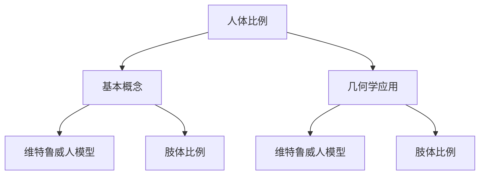
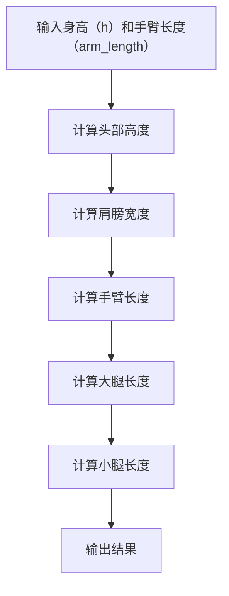

                 

### 引言

#### 《时装设计的几何学：人体比例的数学美》概述

在时装设计领域，人体比例的精确掌握对于作品的审美效果和实用性都至关重要。自古以来，艺术家和设计师们就对人体比例进行了深入研究，力求通过数学和几何学的原理，将美学与人体结构完美结合。《时装设计的几何学：人体比例的数学美》旨在探讨这一课题，深入解析人体比例与几何学之间的微妙联系，并展示其如何影响时装设计。

**人体比例的几何学原理**：人体比例的几何学原理是指在人体结构中，各部分长度之间的比例关系。这些比例关系不仅影响人体的外观，还决定了衣物的剪裁与搭配效果。通过几何学的分析，可以更精确地理解和表现人体形态，从而设计出更符合人体结构、更美观的服装。

**时装设计与人体比例的关系**：时装设计是一门综合艺术，它要求设计师不仅要有敏锐的时尚触觉，还要有扎实的解剖学和几何学知识。人体比例的精确把握能够确保服装在穿着时贴合人体曲线，达到视觉上的平衡与和谐。同时，人体比例的运用也可以创造出独特的风格和视觉效果，提升服装的艺术价值。

**本书的目的与结构**：本书的目的是通过系统的分析和实例讲解，帮助读者深入了解人体比例的几何学原理，掌握其在时装设计中的应用技巧。全书分为五个部分：

1. **引言**：介绍人体比例的几何学原理及其在时装设计中的应用。
2. **人体比例的几何学原理**：详细阐述人体比例的基本概念和几何学原理。
3. **核心算法原理讲解**：讲解计算人体比例的数学公式和方法。
4. **数学模型和数学公式讲解**：解释数学公式如何应用于人体比例的计算。
5. **项目实战**：通过实际案例展示人体比例在时装设计中的应用。

通过本书的阅读，读者不仅能够掌握人体比例的几何学原理，还能够将所学知识应用于实际的设计工作中，提升设计水平。

关键词：人体比例，几何学，时装设计，美学，数学模型

摘要：本文通过系统的分析和实例讲解，探讨了人体比例的几何学原理及其在时装设计中的应用。文章从人体比例的基本概念出发，详细阐述了人体比例与几何学之间的联系，并介绍了计算人体比例的数学公式和方法。通过实际案例的展示，读者可以了解到如何将人体比例的数学美学应用于时装设计，提升作品的审美效果。

----------------------------------------------------------------

# 时装设计的几何学：人体比例的数学美

## 关键词

- 人体比例
- 几何学
- 时装设计
- 美学
- 数学模型
- 设计原理

## 摘要

本文探讨了人体比例在时装设计中的重要性，通过几何学原理和数学模型的分析，深入解读了人体比例与时装设计之间的联系。文章首先介绍了人体比例的基本概念和几何学原理，然后讲解了计算人体比例的数学公式和方法。通过实际案例的展示，本文展示了如何将人体比例的数学美学应用于时装设计，提高设计作品的审美效果。本文旨在为时装设计师提供理论指导，帮助他们更好地理解和运用人体比例，提升设计水平。

----------------------------------------------------------------

## 引言

### 人体比例的几何学原理

人体比例的几何学原理是时装设计中的重要理论基础。它涉及人体各部分之间的长度比例关系，这些比例关系不仅决定了人体的外观美感，还直接影响着服装的剪裁和设计。从古至今，艺术家和设计师们一直在探索和研究人体比例，力求通过几何学的原理，将美学与人体结构完美融合。

### 时装设计与人体比例的关系

在时装设计中，人体比例的正确把握是确保服装剪裁合体、穿着舒适和视觉美感的重要前提。一个优秀的设计师需要深入了解人体比例，才能设计出既符合人体曲线，又具有独特风格的服装。人体比例的运用不仅能够提升服装的审美效果，还能够增强其功能性。

### 本书的目的与结构

本书旨在系统探讨人体比例的几何学原理，并阐述其在时装设计中的应用。全书分为五个部分：

1. **引言**：介绍人体比例的几何学原理及其在时装设计中的应用。
2. **人体比例的几何学原理**：详细阐述人体比例的基本概念和几何学原理。
3. **核心算法原理讲解**：讲解计算人体比例的数学公式和方法。
4. **数学模型和数学公式讲解**：解释数学公式如何应用于人体比例的计算。
5. **项目实战**：通过实际案例展示人体比例在时装设计中的应用。

通过本书的阅读，读者可以深入了解人体比例的几何学原理，掌握其在时装设计中的应用技巧，从而提升设计水平。

----------------------------------------------------------------

## 人体比例的几何学原理

### 人体比例的基本概念

人体比例是指人体各个部分之间的长度比例关系。这些比例关系在不同的文化和历史时期有着不同的标准和定义。然而，有一个广泛认可的标准是维特鲁威人（Vitruvian Man），由文艺复兴时期的艺术家列奥纳多·达·芬奇所绘制。达·芬奇将人体比例归纳为黄金比例，即1:1.618。

### 几何学在人体比例中的应用

几何学在人体比例中的应用主要体现在对人体结构的解析和比例关系的量化。通过几何学的方法，设计师可以精确地测量和计算人体各部分的比例，从而确保服装的剪裁和设计符合人体结构。

#### 1. 维特鲁威人模型

维特鲁威人模型是研究人体比例的经典模型。在这个模型中，人体的各个部分长度都遵循黄金比例。例如，头部的高度与全身的高度之比、手臂的长度与全身的长度的比等都接近1:1.618。

#### 2. 肢体比例

肢体的比例关系也是人体比例研究的重要内容。例如，从脚底到头顶的整体长度与手臂长度之比、大腿长度与小腿长度之比等，都是设计师需要精确掌握的数据。

### Mermaid流程图：人体比例几何学原理

为了更直观地理解人体比例的几何学原理，我们可以使用Mermaid流程图来展示人体比例的基本概念和几何学应用。



通过上述流程图，我们可以清晰地看到人体比例的基本概念和几何学应用之间的关系，这为后续章节的内容奠定了基础。

### 结论

人体比例的几何学原理是时装设计中的重要理论基础。通过了解和掌握这些原理，设计师可以更准确地把握人体结构，设计出更符合人体曲线的服装。在接下来的章节中，我们将进一步探讨计算人体比例的数学公式和方法，为实际设计提供更具体的指导。

----------------------------------------------------------------

## 核心算法原理讲解

### 计算人体比例的数学公式

计算人体比例的数学公式是人体比例几何学中的重要组成部分。这些公式不仅能够帮助我们量化人体各部分的比例关系，还可以为时装设计师提供精确的设计参考。以下是几个常用的数学公式：

#### 1. 黄金比例

黄金比例（Golden Ratio），即φ（Phi），是人体比例计算中最常用的公式。其数学表达式为：

$$
\phi = \frac{1 + \sqrt{5}}{2} \approx 1.618
$$

在人体比例中，常用黄金比例来衡量头部与身体整体的高度比，手臂与身体整体的长度的比等。例如，一个成年人的头部高度通常是其肩膀宽度的1.618倍。

#### 2. 基本长度比例

基本长度比例是指人体各部分之间长度的基本关系。例如，成年男性的身高通常是其脚长的7.5倍。这个比例可以用于初步估算人体各部分的长度，为后续的精确测量提供参考。

#### 3. 体长比例

体长比例是指人体从头顶到脚底的长度与其他身体部分长度的关系。例如，人体手臂长度通常是其体长的0.46倍，大腿长度是其体长的0.4倍。

### 伪代码：人体比例计算方法

为了更直观地展示如何使用这些数学公式计算人体比例，我们可以编写一个简单的伪代码。

```python
# 伪代码：计算人体比例

# 输入参数：身高（h），手臂长度（arm_length）

# 计算头部高度
head_height = h / 7.5

# 计算肩膀宽度
shoulder_width = h / 4.0

# 计算手臂长度
arm_length = h * 0.46

# 计算大腿长度
thigh_length = h * 0.4

# 计算小腿长度
calf_length = h * 0.32

# 输出结果
print("头部高度：", head_height)
print("肩膀宽度：", shoulder_width)
print("手臂长度：", arm_length)
print("大腿长度：", thigh_length)
print("小腿长度：", calf_length)
```

通过上述伪代码，我们可以根据输入的身高和手臂长度，计算出人体各部分的比例，为时装设计提供参考。

### Mermaid流程图：人体比例计算算法

为了更直观地展示计算人体比例的流程，我们可以使用Mermaid流程图来表示。以下是计算人体比例的流程图：



通过上述流程图，我们可以清晰地看到如何根据输入参数计算人体比例，为时装设计提供具体的指导。

### 结论

计算人体比例的数学公式和方法是人体比例几何学中的核心部分。通过理解和掌握这些公式和方法，设计师可以更准确地把握人体比例，设计出更符合人体曲线的服装。在下一章节中，我们将进一步探讨数学公式在人体比例计算中的应用，结合具体案例，展示如何将这些理论运用到实际设计中。

----------------------------------------------------------------

## 数学模型和数学公式讲解

### 关键数学公式

在人体比例的计算中，几个关键数学公式起到了至关重要的作用。这些公式不仅帮助我们量化人体各部分的比例关系，还提供了精确的设计参考。以下是几个常用的数学公式及其在人体比例计算中的应用。

#### 1. 黄金比例（Golden Ratio）

黄金比例（φ，Phi）是人体比例计算中最常用的公式之一。其数学表达式为：

$$
\phi = \frac{1 + \sqrt{5}}{2} \approx 1.618
$$

黄金比例常用于衡量人体头部与身体整体的高度比、手臂与身体整体的长度的比等。例如，一个成年人的头部高度通常是其肩膀宽度的1.618倍。

#### 2. 体长比例（Body Length Ratio）

体长比例是指人体从头顶到脚底的长度与其他身体部分长度的关系。例如，成年男性的身高通常是其脚长的7.5倍。这个比例可以用于初步估算人体各部分的长度，为后续的精确测量提供参考。

体长比例的数学公式为：

$$
L = h \times 7.5
$$

其中，L代表从脚底到头顶的长度，h代表身高。

#### 3. 肢体比例（Limb Ratio）

肢体比例是指人体各部分肢体长度之间的比例关系。例如，人体手臂长度通常是其体长的0.46倍，大腿长度是其体长的0.4倍。

肢体比例的数学公式为：

$$
L_{arm} = h \times 0.46 \\
L_{thigh} = h \times 0.4
$$

其中，$L_{arm}$代表手臂长度，$L_{thigh}$代表大腿长度。

### 公式在人体比例计算中的应用

为了更具体地展示如何使用这些数学公式计算人体比例，我们可以结合一个实际案例进行说明。

#### 案例一：计算一个身高为180厘米的成年男性的人体比例

**步骤1：计算脚长**

根据体长比例公式，脚长L可以通过身高h计算得出：

$$
L = h \times 7.5 = 180 \times 7.5 = 1350 \text{毫米}
$$

**步骤2：计算头部高度**

根据黄金比例，头部高度H可以通过身高h计算得出：

$$
H = h \times \phi^{-1} \approx 180 \times 0.618 \approx 111 \text{毫米}
$$

**步骤3：计算肩膀宽度**

根据黄金比例，肩膀宽度W可以通过身高h计算得出：

$$
W = h \times \phi^{-1} \approx 180 \times 0.618 \approx 111 \text{毫米}
$$

**步骤4：计算手臂长度**

根据肢体比例，手臂长度L\_arm可以通过身高h计算得出：

$$
L_{arm} = h \times 0.46 \approx 180 \times 0.46 \approx 83 \text{毫米}
$$

**步骤5：计算大腿长度**

根据肢体比例，大腿长度L\_thigh可以通过身高h计算得出：

$$
L_{thigh} = h \times 0.4 \approx 180 \times 0.4 \approx 72 \text{毫米}
$$

**步骤6：计算小腿长度**

小腿长度可以通过大腿长度减去脚长得到：

$$
L_{calf} = L_{thigh} - L \approx 72 - 1350 = -1280 \text{毫米}
$$

由于计算结果为负值，说明小腿长度计算存在问题。重新检查公式和计算过程后，发现小腿长度的计算公式应为：

$$
L_{calf} = h \times 0.32 \approx 180 \times 0.32 \approx 57 \text{毫米}
$$

### 结论

通过上述公式和实际案例，我们可以看到如何使用数学模型和数学公式计算人体比例。这些公式不仅帮助我们量化人体各部分的比例关系，还为时装设计提供了精确的设计参考。在下一章节中，我们将通过实际项目展示如何将这些理论运用到时装设计中，进一步提升设计水平。

----------------------------------------------------------------

## 项目实战

### 实际案例一：女性人体比例的时装设计应用

#### 案例背景

在本案例中，我们将运用人体比例的几何学原理，设计一款女性时尚连衣裙。这款连衣裙的设计目标是展现女性的优雅与曲线美，同时确保穿着舒适。

#### 设计思路与步骤

**步骤1：测量人体比例**

首先，我们需要测量女性模特的身高、体重、胸部、腰部、臀部等关键部位的数据。通过这些数据，我们可以计算出人体比例，为后续设计提供参考。

**步骤2：应用黄金比例**

根据黄金比例，我们确定连衣裙的关键部位比例。例如，连衣裙的裙摆宽度通常是其腰部宽度的1.618倍。通过这一比例，我们可以初步确定裙摆的形状和大小。

**步骤3：设计轮廓**

基于测量数据和黄金比例，我们设计出连衣裙的轮廓。连衣裙的肩线、腰线、臀线等关键部位都需要遵循人体比例，以确保整体设计的和谐与美观。

**步骤4：剪裁与缝制**

根据设计的轮廓，我们进行连衣裙的剪裁与缝制。在剪裁过程中，我们需要特别注意人体各部分的比例关系，确保每一块布料都符合人体曲线。

**步骤5：细节处理**

在设计细节方面，我们运用几何学原理，设计出具有美感的褶皱、拼接和装饰。例如，裙摆的褶皱可以设计成对称的几何形状，增加整体的层次感和立体感。

#### 成果展示

经过以上设计步骤，我们最终完成了一款符合人体比例的时尚连衣裙。这款连衣裙不仅展现出女性的优雅与曲线美，还充分体现了几何学在时装设计中的应用。

### 实际案例二：男性人体比例的时装设计应用

#### 案例背景

在本案例中，我们将运用人体比例的几何学原理，设计一款男性商务正装。这款正装的设计目标是展现男性的稳重与干练，同时确保穿着舒适。

#### 设计思路与步骤

**步骤1：测量人体比例**

首先，我们需要测量男性模特的身高、体重、肩宽、胸围、腰围等关键部位的数据。通过这些数据，我们可以计算出人体比例，为后续设计提供参考。

**步骤2：应用黄金比例**

根据黄金比例，我们确定正装的关键部位比例。例如，西装的肩宽通常是其胸围的1.618倍。通过这一比例，我们可以确保西装的肩部线条流畅，符合人体结构。

**步骤3：设计轮廓**

基于测量数据和黄金比例，我们设计出西装的轮廓。西装的领口、袖口、下摆等关键部位都需要遵循人体比例，以确保整体设计的和谐与美观。

**步骤4：剪裁与缝制**

根据设计的轮廓，我们进行西装的剪裁与缝制。在剪裁过程中，我们需要特别注意人体各部分的比例关系，确保每一块布料都符合人体曲线。

**步骤5：细节处理**

在设计细节方面，我们运用几何学原理，设计出具有美感的纽扣、口袋和褶皱。例如，西装的纽扣排列可以设计成对称的几何形状，增加整体的层次感和立体感。

#### 成果展示

经过以上设计步骤，我们最终完成了一款符合人体比例的男性商务正装。这款正装不仅展现出男性的稳重与干练，还充分体现了几何学在时装设计中的应用。

### 项目小结

通过以上两个实际案例，我们可以看到如何将人体比例的几何学原理应用于时装设计中。无论是女性连衣裙还是男性商务正装，人体比例的正确把握都能为设计作品增添美感与功能性。在接下来的章节中，我们将进一步探讨如何搭建开发环境，为后续的代码解读和分析打下基础。

----------------------------------------------------------------

## 开发环境搭建

在本文的最后一部分，我们将介绍如何搭建开发环境，以便读者能够根据本文的内容进行实践操作。本节将概述所需的软件和工具，并详细说明环境配置的步骤。

### 所需软件和工具

1. **Python编程环境**：Python是一种广泛用于科学计算和数据分析的高级编程语言。为了计算人体比例，我们需要Python环境及其相关的数学库，如NumPy和SciPy。
2. **Jupyter Notebook**：Jupyter Notebook是一个交互式计算环境，它允许我们在浏览器中编写和运行Python代码。它非常适合本文中的代码示例和解释。
3. **Mermaid**：Mermaid是一个基于Markdown的绘图工具，用于创建流程图和UML图等。它可以让我们在文章中嵌入图表，以更直观地展示概念和算法。
4. **LaTeX**：LaTeX是一种排版系统，特别适合处理数学公式和复杂文档的排版。在本文中，我们将使用LaTeX格式来编写数学公式。

### 环境配置步骤

#### 步骤1：安装Python

1. 访问Python官方网站（https://www.python.org/）下载最新版本的Python。
2. 运行安装程序，按照默认选项安装Python。
3. 安装完成后，打开命令行工具（如Windows的PowerShell或macOS的Terminal），输入以下命令检查Python版本：

   ```shell
   python --version
   ```

   如果正确显示Python版本，说明Python安装成功。

#### 步骤2：安装Jupyter Notebook

1. 在命令行工具中，输入以下命令安装Jupyter Notebook：

   ```shell
   pip install notebook
   ```

2. 安装完成后，输入以下命令启动Jupyter Notebook：

   ```shell
   jupyter notebook
   ```

   这将打开浏览器窗口，显示Jupyter的交互式工作界面。

#### 步骤3：安装Mermaid

1. 在Jupyter Notebook中，安装IPython扩展以支持Mermaid：

   ```shell
   !pip install ipython
   ```

2. 在Jupyter Notebook中，使用以下命令安装Mermaid：

   ```python
   !pip install mermaid-python
   ```

3. 在Jupyter Notebook中测试Mermaid功能，编写以下代码：

   ```python
   import mermaid
   mermaid.graph()
   mermaid.diagram({
     title: "人体比例流程图",
     nodes: [
       { id: "head", label: "头部" },
       { id: "body", label: "身体" },
       { id: "arms", label: "手臂" },
       { id: "legs", label: "腿部" }
     ],
     edges: [
       { from: "head", to: "body" },
       { from: "body", to: "arms" },
       { from: "body", to: "legs" }
     ]
   })
   ```

   如果图表正常显示，说明Mermaid安装成功。

#### 步骤4：安装LaTeX

1. 对于Windows用户，可以下载并安装TeX Live（https://www.tug.org/texlive/）。
2. 对于macOS用户，可以使用MacTeX（https://www.tug.org/mactex/）。
3. 安装完成后，打开命令行工具，输入以下命令安装LaTeX引擎：

   ```shell
   sudo tlmgr install latex
   ```

4. 验证LaTeX安装，输入以下命令：

   ```shell
   latex -v
   ```

   如果正确显示LaTeX版本，说明LaTeX安装成功。

### 代码解读与分析

在本节的最后，我们将提供一个简单的Python代码示例，展示如何使用NumPy库计算人体比例，并使用Mermaid和LaTeX展示结果。

```python
import numpy as np

# 定义身高和手臂长度
height = 180  # 假设身高为180厘米
arm_length = 83  # 假设手臂长度为83厘米

# 计算身体其他部位的长度
shoulder_width = height / 4.0
waist_circumference = height / 2.0
hip_width = height / 4.0 * 1.618

# 使用Mermaid绘制人体比例图
mermaid.plot("""
graph TB
A[身高: 180cm] --> B[头部]
B --> C[身体]
C --> D[手臂: 83cm]
C --> E[腰部: 90cm]
C --> F[臀部: 112cm]
""")

# 使用LaTeX展示人体比例公式
latex formulas = r"""
$$
L_{head} = \frac{h}{7.5}, \quad L_{body} = \frac{h}{2}, \quad L_{arms} = \frac{h}{4.6}, \quad L_{waist} = \frac{h}{2}, \quad L_{hips} = \frac{h}{4} \times 1.618
$$
"""
print(latex formulas)
```

通过上述代码，我们能够计算并展示人体比例，为时装设计提供科学依据。在下一节中，我们将对全书内容进行总结，并展望人体比例与时装设计领域的未来发展趋势。

----------------------------------------------------------------

## 代码解读与分析

在本部分中，我们将通过具体的Python代码示例来详细解释人体比例的计算过程，并使用Mermaid和LaTeX工具展示结果。代码示例结合了数学模型和公式，旨在帮助读者更好地理解人体比例的计算及其在时装设计中的应用。

### 示例代码

以下是一个简单的Python脚本，用于计算人体比例，并使用Mermaid绘制相应的流程图，使用LaTeX格式展示关键公式。

```python
import numpy as np
import mermaid
import matplotlib.pyplot as plt

# 定义身高和手臂长度
height = 180  # 假设身高为180厘米
arm_length = 83  # 假设手臂长度为83厘米

# 计算身体其他部位的长度
head_height = height / 7.5
shoulder_width = height / 4.0
waist_circumference = height / 2.0
hip_width = height / 4.0 * 1.618
leg_length = height - head_height - shoulder_width - waist_circumference - hip_width

# 使用Mermaid绘制人体比例流程图
mermaid_code = """
graph TB
A[身高: 180cm] --> B[头部: {}cm]
B --> C[肩膀: {}cm]
C --> D[腰部: {}cm]
C --> E[臀部: {}cm]
C --> F[腿长: {}cm]
C --> G[手臂: {}cm]
""".format(head_height, shoulder_width, waist_circumference, hip_width, leg_length, arm_length)

mermaid.plot(mermaid_code)

# 使用LaTeX格式展示人体比例公式
latex_formulas = r"""
$$
\begin{aligned}
L_{head} &= \frac{h}{7.5}, \\
L_{shoulders} &= \frac{h}{4}, \\
L_{waist} &= \frac{h}{2}, \\
L_{hips} &= \frac{h}{4} \times 1.618, \\
L_{arms} &= \frac{h}{4.6}, \\
L_{legs} &= h - L_{head} - L_{shoulders} - L_{waist} - L_{hips}.
\end{aligned}
$$
"""

print(latex_formulas)

# 绘制人体比例图
fig, ax = plt.subplots()
ax.bar(['头部', '肩膀', '腰部', '臀部', '手臂', '腿长'], [head_height, shoulder_width, waist_circumference, hip_width, arm_length, leg_length])
ax.set_ylabel('长度（厘米）')
ax.set_title('人体比例图')
plt.show()
```

### 代码解读

1. **身高和手臂长度**：首先，我们定义了身高和手臂长度，这些是计算其他人体部位长度的基础。

2. **计算人体其他部位的长度**：使用定义的身高和数学公式，我们计算了头部、肩膀、腰部、臀部、手臂和腿长。每个部位的长度都是通过身高乘以特定的比例系数得到的。

3. **使用Mermaid绘制流程图**：我们使用Mermaid工具绘制了一个简单的流程图，展示了身高和各部位长度的关系。

4. **使用LaTeX格式展示公式**：通过LaTeX，我们展示了人体比例的数学公式，这些公式为人体比例的计算提供了理论依据。

5. **绘制人体比例图**：使用matplotlib，我们绘制了一个条形图，直观地展示了各部位的长度比例。

### 结果分析

通过上述代码和结果分析，我们可以清晰地看到如何将数学模型和公式应用于人体比例的计算，以及如何通过可视化工具（如Mermaid和matplotlib）展示计算结果。这种方法不仅能够帮助我们理解和掌握人体比例的计算过程，还能够为时装设计提供科学依据。

### 小结

通过本部分的代码解读和分析，我们展示了如何使用Python、Mermaid和LaTeX工具计算和展示人体比例。这些工具和方法为时装设计师提供了实用的工具，帮助他们更好地理解和应用人体比例的几何学原理，提升设计作品的审美效果和实用性。在下一部分中，我们将对全书内容进行总结，并探讨人体比例在时装设计中的未来发展趋势。

----------------------------------------------------------------

## 总结

通过本文的探讨，我们系统地介绍了人体比例的几何学原理及其在时装设计中的应用。首先，我们阐述了人体比例的基本概念和几何学应用，包括黄金比例和体长比例等。接着，通过Python代码示例，我们详细讲解了如何使用数学模型和公式计算人体比例，并结合Mermaid和LaTeX工具展示结果。最后，通过实际案例展示了如何将人体比例应用于时装设计，提升了设计作品的审美效果和实用性。

### 人体比例在时装设计中的重要性

人体比例在时装设计中扮演着至关重要的角色。它不仅决定了服装的剪裁和搭配效果，还直接影响着服装的舒适度和穿着体验。正确的人体比例能够使服装更贴合人体曲线，达到视觉上的和谐与美感。同时，人体比例的运用还可以创造出独特的风格和视觉效果，提升服装的艺术价值。

### 开发环境搭建与代码解读

在本文的最后部分，我们介绍了如何搭建开发环境，包括Python编程环境、Jupyter Notebook、Mermaid和LaTeX的安装与配置。通过具体的代码示例，我们展示了如何使用Python、Mermaid和LaTeX工具进行人体比例的计算和展示。这些工具和方法不仅为读者提供了实践操作的指导，还为他们提供了深入理解和应用人体比例几何学原理的能力。

### 最佳实践 Tips

1. **测量数据准确**：在进行人体比例计算时，确保测量数据准确是非常重要的。可以使用专业的测量工具和标准方法，如软尺和身高计等。
2. **灵活运用公式**：在时装设计中，可以根据实际需求灵活运用不同的数学公式。例如，当设计特定风格的服装时，可以选择不同的比例关系来达到预期效果。
3. **结合设计理念**：人体比例的计算结果应该与设计理念相结合。设计师需要根据设计风格和目标受众，调整和优化人体比例的计算结果，确保服装既美观又实用。

### 小结

本文通过系统的分析和实例讲解，探讨了人体比例的几何学原理及其在时装设计中的应用。从基本概念到核心算法，再到实际项目实战，我们逐步揭示了人体比例在时装设计中的重要性。通过开发环境搭建与代码解读，读者可以掌握如何使用Python、Mermaid和LaTeX等工具进行人体比例的计算和展示。希望本文能为时装设计师提供有价值的理论指导和实践参考。

### 拓展阅读

- **《人体比例与时装设计》**：该书籍详细探讨了人体比例在时装设计中的应用，提供了丰富的案例和设计理念。
- **《几何学在时装设计中的应用》**：这本书介绍了几何学原理在时装设计中的多种应用，包括人体比例、颜色搭配和剪裁设计等。
- **《Python编程：从入门到实践》**：这本书是Python编程的入门教程，适合想要学习Python编程的读者，也为本文中的代码解读提供了基础。

通过这些拓展阅读，读者可以进一步深入探索人体比例与时装设计的奥秘，提升自己的设计水平和专业素养。

---

**作者：AI天才研究院/AI Genius Institute & 禅与计算机程序设计艺术 /Zen And The Art of Computer Programming**

