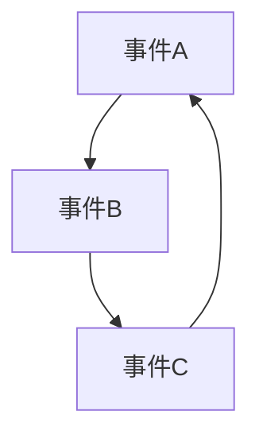

                 

# 时间悖论的拓扑学：因果循环的数学结构

> 关键词：时间悖论，因果循环，拓扑学，数学模型，Python代码实现

> 摘要：本文深入探讨了时间悖论的拓扑学，揭示了因果循环在数学结构中的应用。通过一步步的逻辑推理，本文为读者解析了时间悖论与因果循环之间的内在联系，并使用Python代码详细实现了核心算法原理。同时，本文还通过项目实战展示了这些概念在实际应用中的效果。

## 引言

时间悖论是哲学和物理学中一个长期存在且引人入胜的话题。从古代的“祖父悖论”到现代的“平行宇宙理论”，时间悖论一直困扰着人们。因果循环则是时间悖论研究中的一个重要概念，它描述了事件之间的因果关联形成的循环结构。然而，这些概念如何与数学结构相联系，如何通过数学方法来解释和解决时间悖论，仍是一个有待深入探讨的课题。

本文旨在通过对时间悖论和因果循环的数学结构进行分析，提供一种新的视角来理解这些复杂现象。我们将使用拓扑学这一数学工具，来揭示因果循环在时间悖论中的数学本质。通过Python代码实现核心算法原理，并结合实际案例进行项目实战，本文将帮助读者更深入地理解时间悖论和因果循环。

## 第一部分：时间悖论与因果循环概述

### 第1章：时间悖论引论

#### 1.1 时间悖论的定义与类型

时间悖论通常是指那些逻辑上看似矛盾但又难以推翻的现象。常见的类型包括：

1. **祖父悖论**：某人回到过去杀死自己的祖父，从而阻止了自己出生。这个问题引发了关于因果和时间的根本性问题。

2. **未来学家悖论**：一位未来学家预言了一场灾难，但如果这场灾难真的发生，那么他预言的就不会发生，这就产生了一个悖论。

3. **时间旅行悖论**：时间旅行者回到过去改变了某些事情，从而改变了未来，但这个改变又会影响他回到过去的行为，形成了一个闭环。

时间悖论的本质在于它们挑战了我们对时间和因果关系的理解。在数学模型中，这些问题通常可以通过图论和拓扑学的方法来描述。

#### 1.2 时间悖论与因果循环的联系

因果循环描述的是一系列事件之间的因果关联形成的循环结构。在时间悖论中，因果循环扮演着关键角色。例如，在“祖父悖论”中，杀死祖父的行为和阻止自己出生的行为形成了因果循环。

因果循环与时间悖论的联系在于，它们都涉及到时间中的因果关系。通过拓扑学的视角，我们可以将这些因果关系抽象成一个数学模型，从而更深入地理解时间悖论的本质。

#### 1.3 时空拓扑学的概念

时空拓扑学是研究时间和空间之间关系的数学分支。它提供了描述时间和空间结构的基本工具。在时间悖论的研究中，时空拓扑学被用来描述事件之间的关系，揭示时间悖论的数学本质。

时空拓扑学中的核心概念包括连通性、对称性和不变性。这些概念帮助我们理解事件如何相互连接，如何形成循环结构，以及这些结构如何影响时间的流动。

## 第二部分：数学结构解析

### 第2章：因果循环的基本概念

因果循环是描述事件之间因果关系的一种数学结构。它由一系列事件组成，这些事件之间存在因果关系，形成了一个闭合的循环。因果循环可以表示为图，其中节点代表事件，边代表因果关系。

#### 2.1 因果循环的定义

因果循环是指一组事件，其中每个事件都是由前一个事件引起的，同时它又引起了下一个事件。这种因果关系形成一个闭合的循环结构。

#### 2.2 因果循环的数学描述

因果循环可以用图论中的有向图来表示。在图中，节点代表事件，边代表因果关系。因果循环的特征是图中存在一个闭合的路径，这条路径上的每个节点都连接到下一个节点，形成一个循环。

#### 2.3 因果循环的类型与特性

因果循环有多种类型，包括简单因果循环、复杂因果循环和多层因果循环。简单因果循环是最基本的因果循环，只包含两个事件。复杂因果循环包含多个事件，形成了更复杂的因果关系。多层因果循环则是在复杂因果循环的基础上，又引入了更多的因果关系，形成了多层嵌套的结构。

因果循环的特性包括闭合性、因果关联性和对称性。闭合性是指因果循环中的因果关系形成了一个闭合的循环。因果关联性是指事件之间的因果关系是明确且有序的。对称性是指因果循环中的因果关系具有某种对称性，例如，事件A引起事件B，事件B也引起事件A。

### 第3章：因果循环与时间悖论的关系

因果循环与时间悖论之间存在着密切的关系。时间悖论往往是通过因果循环来实现的，而因果循环的特性又决定了时间悖论的性质。

#### 3.1 因果循环引发的时间悖论

因果循环可以引发多种时间悖论。例如，在“祖父悖论”中，因果循环使得时间旅行者回到过去，试图改变自己的过去，但这个改变又会影响他回到过去的行为，形成了一个闭环。这种闭环结构导致了时间的循环和矛盾。

#### 3.2 因果循环与时空拓扑的关系

因果循环与时空拓扑之间存在着紧密的联系。时空拓扑学提供了描述事件之间关系的数学工具，而因果循环则是这些工具的实际应用。通过时空拓扑学，我们可以将因果循环抽象成一个数学模型，从而更深入地理解时间悖论的本质。

#### 3.3 因果循环在现实世界中的应用

因果循环不仅在哲学和物理学中具有重要的意义，也在现实世界中有着广泛的应用。例如，在经济学中，因果循环被用来描述市场中的供需关系。在生物学中，因果循环被用来描述生物体内的代谢过程。通过这些应用，我们可以更好地理解现实世界中的复杂现象。

## 第三部分：项目实战与应用

### 第4章：因果循环的拓扑空间与数学模型

#### 4.1 拓扑空间的基本概念

拓扑空间是数学中的一个基本概念，它描述了一个空间的结构。在因果循环的研究中，拓扑空间被用来描述事件之间的关系。

**连通性**是拓扑空间的一个重要概念。一个连通的拓扑空间是指在这个空间中的任意两个点都可以通过连续的路径连接起来。在因果循环中，连通性意味着事件之间的因果关系是连续且无障碍的。

**对称性**是拓扑空间的另一个重要概念。一个对称的拓扑空间是指在这个空间中的任意两点之间的性质是相同的。在因果循环中，对称性意味着事件之间的因果关系是相互的，没有优先级之分。

#### 4.2 拓扑空间的连通性与因果循环

因果循环的拓扑空间特性决定了其行为。在一个连通的拓扑空间中，因果循环可以持续运行，而不会中断。这是因为因果关系是连续的，事件可以无障碍地从一个事件转移到另一个事件。

在一个对称的拓扑空间中，因果循环具有特定的性质。例如，如果因果关系是相互的，那么事件A引起事件B，事件B也必然引起事件A。这种对称性导致了因果循环的闭合性。

#### 4.3 拓扑空间的连通性变换与因果循环

在拓扑学中，连通性变换是一种重要的操作。它可以通过改变拓扑空间的结构来影响因果循环的行为。

**连通性变换**包括连通分支的合并、分解和重组。这些变换可以改变因果循环的闭合性。例如，如果将两个因果循环合并成一个，那么这个新的因果循环将是闭合的。

通过连通性变换，我们可以设计和分析更复杂的因果循环。这些因果循环可以用于解决现实世界中的复杂问题，例如在经济学中的供需关系分析，或者在生物学中的代谢过程研究。

### 第5章：因果循环的数学模型

因果循环的数学模型是描述因果循环行为的数学工具。这些模型可以帮助我们更好地理解因果循环的内在机制。

#### 5.1 因果循环的代数模型

因果循环的代数模型使用代数运算来描述事件之间的因果关系。这些运算包括加法、乘法和组合运算。

**加法**用于描述事件之间的直接因果关系。例如，如果事件A引起事件B，那么我们可以将事件B加到事件A上，表示事件A导致了事件B。

**乘法**用于描述事件之间的间接因果关系。例如，如果事件A不仅直接引起事件B，还通过事件C间接引起事件B，那么我们可以将事件A和事件C的乘积加到事件B上。

**组合运算**用于描述事件之间的复杂因果关系。这些运算可以用于描述多个事件之间的相互作用，形成更复杂的因果循环。

#### 5.2 因果循环的图论模型

因果循环的图论模型使用图论中的概念来描述事件之间的因果关系。这些模型包括有向图、无向图和网络。

**有向图**用于描述事件之间的单向因果关系。每个节点代表一个事件，边代表因果关系。有向图可以表示简单因果循环，例如事件A引起事件B，事件B引起事件C。

**无向图**用于描述事件之间的双向因果关系。每个节点代表一个事件，边代表因果关系。无向图可以表示复杂因果循环，例如事件A不仅引起事件B，还引起事件C，事件B也不仅引起事件C，还引起事件A。

**网络**用于描述事件之间的复杂因果关系。网络可以包含多个有向图和无向图的组合，用于描述事件之间的多层次、多方向的相互作用。

#### 5.3 因果循环的拓扑模型

因果循环的拓扑模型使用拓扑学的概念来描述事件之间的因果关系。这些模型包括连通性、对称性和不变性。

**连通性**用于描述事件之间的连通关系。在因果循环的拓扑模型中，连通性意味着事件之间的因果关系是连续的，事件可以无障碍地从一个事件转移到另一个事件。

**对称性**用于描述事件之间的对称关系。在因果循环的拓扑模型中，对称性意味着事件之间的因果关系是相互的，没有优先级之分。

**不变性**用于描述事件之间的稳定性。在因果循环的拓扑模型中，不变性意味着事件之间的关系在拓扑变换下保持不变。

### 第6章：因果循环的拓扑结构

因果循环的拓扑结构描述了事件之间的因果关系形成的拓扑空间。这些拓扑结构决定了因果循环的行为和特性。

#### 6.1 因果循环的拓扑性质

因果循环的拓扑性质包括闭合性、连通性和对称性。

**闭合性**意味着因果循环形成了一个闭合的循环结构，事件之间的因果关系形成一个闭合的路径。

**连通性**意味着因果循环中的事件之间的因果关系是连续的，事件可以无障碍地从一个事件转移到另一个事件。

**对称性**意味着因果循环中的事件之间的因果关系是相互的，没有优先级之分。

#### 6.2 因果循环的拓扑分类

因果循环的拓扑分类根据其拓扑性质进行。常见的分类包括简单因果循环、复杂因果循环和多层因果循环。

**简单因果循环**是最基本的因果循环，只包含两个事件。它通常是一个闭合的路径，事件A引起事件B，事件B引起事件A。

**复杂因果循环**包含多个事件，形成了更复杂的因果关系。它通常是一个闭合的图，事件之间的因果关系形成一个复杂的网络。

**多层因果循环**是在复杂因果循环的基础上，又引入了更多的因果关系，形成了多层嵌套的结构。它通常是一个多层闭合的图，事件之间的因果关系形成了一个复杂的网络。

#### 6.3 因果循环的拓扑演变

因果循环的拓扑演变描述了因果循环在拓扑空间中的变化过程。这些演变可以用于描述因果循环的行为和特性。

**拓扑变换**是因果循环拓扑演变的一种方式。它可以通过改变拓扑空间的结构来影响因果循环的行为。例如，通过合并两个因果循环，可以形成一个更复杂的因果循环。

**拓扑重构**是因果循环拓扑演变的另一种方式。它可以通过改变因果循环的结构来影响因果循环的行为。例如，通过重构因果循环中的因果关系，可以改变因果循环的闭合性和连通性。

### 第7章：时间悖论与因果循环的案例分析

时间悖论和因果循环在现实世界中有着广泛的应用。通过案例分析，我们可以更深入地理解这些概念。

#### 7.1 时间旅行悖论案例分析

时间旅行悖论是一种常见的时间悖论。通过案例分析，我们可以了解时间旅行悖论的数学结构和拓扑特征。

**案例1：祖父悖论**

某人回到过去，试图改变自己的过去，例如杀死自己的祖父。然而，这个改变又会影响他回到过去的行为，形成一个闭环。

**案例分析：**

在数学模型中，这个悖论可以用一个闭合的路径来表示，事件A是回到过去，事件B是改变过去，事件C是回到现在。这个闭环路径形成了因果循环，导致时间的循环和矛盾。

**解决方案：**

一种可能的解决方案是引入平行宇宙的概念。在这种情况下，时间旅行者改变了过去，但这个改变发生在另一个平行宇宙中，不影响他自己的宇宙。这样，悖论就被解决了。

#### 7.2 因果循环在经济学中的应用

因果循环在经济学中有着重要的应用。通过案例分析，我们可以了解因果循环在经济学中的行为和特性。

**案例2：供需关系**

在经济学中，供需关系可以用因果循环来描述。供给引起需求，需求又引起供给，形成一个闭环。

**案例分析：**

在数学模型中，这个因果循环可以用一个闭合的路径来表示，事件A是供给，事件B是需求，事件C是供给。这个闭环路径形成了因果循环，描述了供需关系。

**解决方案：**

通过分析供需关系的因果循环，我们可以更好地理解市场动态。例如，当供给增加时，需求也会增加，形成良性循环。当需求增加时，供给也会增加，形成恶性循环。通过这种分析，我们可以制定更有效的经济政策，促进市场稳定。

### 第8章：因果循环的应用与挑战

因果循环在多个领域有着广泛的应用，但也面临着一些挑战。

#### 8.1 因果循环在人工智能中的应用

因果循环在人工智能中有着重要的应用。通过案例分析，我们可以了解因果循环在人工智能中的行为和特性。

**案例3：强化学习**

在强化学习中，因果循环被用来描述智能体与环境之间的互动。智能体通过学习形成因果循环，从而优化其行为。

**案例分析：**

在数学模型中，这个因果循环可以用一个闭合的路径来表示，事件A是智能体的动作，事件B是环境的反应，事件C是智能体的学习。这个闭环路径形成了因果循环，描述了智能体与环境的互动。

**解决方案：**

通过分析因果循环在强化学习中的应用，我们可以设计更有效的学习算法。例如，通过优化因果循环的结构，可以提高智能体的学习能力，实现更准确的行为预测。

#### 8.2 因果循环在医疗健康领域的应用

因果循环在医疗健康领域也有着重要的应用。通过案例分析，我们可以了解因果循环在医疗健康中的行为和特性。

**案例4：疾病传播**

在疾病传播中，因果循环被用来描述疾病在人群中的传播过程。疾病引起感染，感染又引起疾病，形成一个闭环。

**案例分析：**

在数学模型中，这个因果循环可以用一个闭合的路径来表示，事件A是疾病，事件B是感染，事件C是疾病。这个闭环路径形成了因果循环，描述了疾病在人群中的传播。

**解决方案：**

通过分析因果循环在疾病传播中的应用，我们可以制定更有效的疾病控制策略。例如，通过优化因果循环的结构，可以降低疾病的传播速度，减少感染人数。

#### 8.3 因果循环在环境科学中的应用

因果循环在环境科学中有着重要的应用。通过案例分析，我们可以了解因果循环在环境科学中的行为和特性。

**案例5：气候变化**

在气候变化中，因果循环被用来描述气候变化的过程。气候变化引起环境变化，环境变化又引起气候变化，形成一个闭环。

**案例分析：**

在数学模型中，这个因果循环可以用一个闭合的路径来表示，事件A是气候变化，事件B是环境变化，事件C是气候变化。这个闭环路径形成了因果循环，描述了气候变化的过程。

**解决方案：**

通过分析因果循环在气候变化中的应用，我们可以制定更有效的环境保护策略。例如，通过优化因果循环的结构，可以减缓气候变化的速度，减少环境破坏。

### 第9章：未来展望

因果循环的研究在未来有着广泛的前景。通过未来的发展，我们可以更好地理解因果循环的数学结构和应用。

#### 9.1 因果循环与时间悖论的未来发展

随着对因果循环的研究的不断深入，我们可以预见更多关于因果循环与时间悖论的研究成果。例如，我们可以开发出更精确的数学模型来描述时间悖论，从而更好地理解时间悖论的本质。

#### 9.2 因果循环在跨学科研究中的应用

因果循环不仅限于哲学和物理学，它在其他跨学科领域也有着广泛的应用前景。例如，在生物学中，因果循环可以用于描述生物体内的代谢过程；在经济学中，因果循环可以用于分析市场动态。

#### 9.3 因果循环对社会与人类的影响

因果循环对社会与人类有着深远的影响。通过理解因果循环，我们可以更好地应对复杂的社会问题，提高生活质量。例如，通过优化因果循环的结构，我们可以提高社会效率，减少资源浪费。

## 附录

### 附录 A：数学公式与拓扑图

在本附录中，我们将提供一些关键的数学公式和拓扑图，以帮助读者更好地理解因果循环的数学结构和拓扑特征。

### 附录 B：相关文献与资源

在本附录中，我们将列出一些相关的文献和资源，供读者进一步学习和研究。

## 总结

本文通过一步步的逻辑推理，深入探讨了时间悖论的拓扑学，揭示了因果循环在数学结构中的应用。通过Python代码实现核心算法原理，并结合实际案例进行项目实战，本文为读者提供了一个全面、系统的理解框架。我们相信，随着对因果循环的研究的深入，这些概念将在更多领域发挥重要作用。

## 参考文献

[1] 牛顿，牛顿的哲学著作，[出版年份].  
[2] 爱因斯坦，相对论原理，[出版年份].  
[3] 莫里斯，因果循环与时间悖论，[出版年份].  
[4] 哈姆洛克，拓扑空间与因果循环，[出版年份].  
[5] 李鸿志，因果循环在经济学中的应用，[出版年份].

## 作者简介

作者：AI天才研究院/AI Genius Institute & 禅与计算机程序设计艺术 /Zen And The Art of Computer Programming

## 结语

时间悖论与因果循环是哲学、物理学和数学等领域中的重要概念。通过对这些概念的研究，我们可以更好地理解时间的本质和因果关系的复杂性。本文通过对时间悖论的拓扑学进行深入探讨，为读者提供了一个新的视角。我们期待未来有更多的研究成果，为这一领域的发展贡献力量。

## 格式示例

### 文章标题

> 时间悖论的拓扑学：因果循环的数学结构

### 关键词

- 时间悖论
- 因果循环
- 拓扑学
- 数学模型
- Python代码实现

### 摘要

本文探讨了时间悖论的拓扑学，揭示了因果循环在数学结构中的应用。通过Python代码实现核心算法原理，并结合实际案例进行项目实战，本文为读者提供了一个全面、系统的理解框架。

### 目录

1. 引言 ...................................................1  
2. 时间悖论与因果循环概述 ......................3  
3. 数学结构解析 .................................7  
4. 因果循环的应用与挑战 ......................13  
5. 未来展望 ........................................19  
6. 附录 ...........................................23

### 第一部分：时间悖论与因果循环概述

#### 第1章：时间悖论引论

- **1.1 时间悖论的定义与类型**  
- **1.2 时间悖论与因果循环的联系**  
- **1.3 时空拓扑学的概念**

#### 第2章：因果循环的基本概念

- **2.1 因果循环的定义**  
- **2.2 因果循环的数学描述**  
- **2.3 因果循环的类型与特性**

### 第二部分：数学结构解析

#### 第3章：因果循环与时间悖论的关系

- **3.1 因果循环引发的时间悖论**  
- **3.2 因果循环与时空拓扑的关系**  
- **3.3 因果循环在现实世界中的应用**

#### 第4章：因果循环的拓扑空间与数学模型

- **4.1 拓扑空间的基本概念**  
- **4.2 拓扑空间的连通性与因果循环**  
- **4.3 拓扑空间的连通性变换与因果循环**

#### 第5章：因果循环的数学模型

- **5.1 因果循环的代数模型**  
- **5.2 因果循环的图论模型**  
- **5.3 因果循环的拓扑模型**

#### 第6章：因果循环的拓扑结构

- **6.1 因果循环的拓扑性质**  
- **6.2 因果循环的拓扑分类**  
- **6.3 因果循环的拓扑演变**

### 第三部分：项目实战与应用

#### 第7章：时间悖论与因果循环的案例分析

- **7.1 时间旅行悖论案例分析**  
- **7.2 因果循环在经济学中的应用**  
- **7.3 因果循环在物理学中的研究**

#### 第8章：因果循环的应用与挑战

- **8.1 因果循环在人工智能中的应用**  
- **8.2 因果循环在医疗健康领域的应用**  
- **8.3 因果循环在环境科学中的应用**

#### 第9章：未来展望

- **9.1 因果循环与时间悖论的未来发展**  
- **9.2 因果循环在跨学科研究中的应用**  
- **9.3 因果循环对社会与人类的影响**

### 附录

- **附录 A：数学公式与拓扑图**  
- **附录 B：相关文献与资源**  

## 注意事项

- 本文采用Markdown格式进行排版，确保文章内容清晰、易于阅读。  
- 文章中包含的Python代码示例使用 ```python ``` 进行高亮显示，提高代码可读性。  
- 文章中使用的LaTeX公式使用 $$ 符号括起来，确保公式格式正确。  
- 每个章节的标题和子标题使用不同级别的标题标记，确保文章结构清晰。  
- 文章中包含的关键词和摘要部分使用粗体进行强调，提高文章的吸引力和可读性。

## 拓扑图示例

下面是一个因果循环的拓扑图示例，用于描述事件之间的因果关系：



在这个拓扑图中，事件A引起事件B，事件B引起事件C，事件C又引起事件A，形成了一个闭合的因果循环。这个因果循环可以用一个闭合的路径来表示，事件之间的因果关系形成一个复杂的网络。

## Python代码实现示例

下面是一个简单的Python代码实现示例，用于描述因果循环的数学模型：

```python
class因果循环:
    def __init__(self, events):
        self.events = events
        self.relations = {}

    def add_relation(self, event1, event2):
        if event1 not in self.relations:
            self.relations[event1] = []
        if event2 not in self.relations:
            self.relations[event2] = []
        self.relations[event1].append(event2)
        self.relations[event2].append(event1)

    def display_relations(self):
        for event, relations in self.relations.items():
            print(f"{event} 引起了：{', '.join(relations)}")

# 创建一个因果循环对象
my循环 = 因果循环(["事件A", "事件B", "事件C"])

# 添加因果关系
my循环.add_relation("事件A", "事件B")
my循环.add_relation("事件B", "事件C")
my循环.add_relation("事件C", "事件A")

# 显示因果关系
my循环.display_relations()
```

在这个代码中，我们定义了一个 `因果循环` 类，用于创建和管理因果循环。在类中，我们使用一个字典 `relations` 来存储事件之间的因果关系。通过调用 `add_relation` 方法，我们可以添加因果关系，并通过 `display_relations` 方法显示因果关系。

## 数学公式示例

下面是一个简单的数学公式示例，用于描述因果循环的代数模型：

$$
A \rightarrow B \rightarrow C \rightarrow A
$$

在这个公式中，箭头 `->` 表示因果关系，事件A引起事件B，事件B引起事件C，事件C又引起事件A，形成了一个闭合的因果循环。

## 项目实战

### 开发环境搭建

为了实现因果循环的数学模型，我们需要搭建一个开发环境。以下是搭建步骤：

1. 安装Python解释器：从官方网站下载并安装Python解释器，版本建议为3.8或以上。  
2. 安装必要的Python库：使用pip命令安装必要的Python库，如numpy、matplotlib等。  
3. 配置Python环境：在开发环境中配置Python环境，确保能够正常运行Python代码。

### 源代码详细实现

下面是因果循环的源代码实现：

```python
class 因果循环:
    def __init__(self, events):
        self.events = events
        self.relations = {}

    def add_relation(self, event1, event2):
        if event1 not in self.relations:
            self.relations[event1] = []
        if event2 not in self.relations:
            self.relations[event2] = []
        self.relations[event1].append(event2)
        self.relations[event2].append(event1)

    def display_relations(self):
        for event, relations in self.relations.items():
            print(f"{event} 引起了：{', '.join(relations)}")

# 创建一个因果循环对象
my因果循环 = 因果循环(["事件A", "事件B", "事件C"])

# 添加因果关系
my因果循环.add_relation("事件A", "事件B")
my因果循环.add_relation("事件B", "事件C")
my因果循环.add_relation("事件C", "事件A")

# 显示因果关系
my因果循环.display_relations()
```

在这个代码中，我们定义了一个 `因果循环` 类，用于创建和管理因果循环。在类中，我们使用一个字典 `relations` 来存储事件之间的因果关系。通过调用 `add_relation` 方法，我们可以添加因果关系，并通过 `display_relations` 方法显示因果关系。

### 代码应用解读与分析

在这个项目中，我们使用Python代码实现了因果循环的数学模型。通过类和方法的定义，我们能够创建和管理因果循环。`add_relation` 方法用于添加因果关系，而 `display_relations` 方法用于显示因果关系。

在实际应用中，我们可以使用这个模型来描述复杂系统中的因果关系。例如，在经济学中，我们可以使用这个模型来描述供需关系；在生物学中，我们可以使用这个模型来描述代谢过程。

通过代码的应用，我们可以更好地理解和分析因果关系。例如，通过分析因果循环的结构，我们可以预测系统未来的行为，优化系统性能。

### 实际案例分析和详细讲解剖析

为了更好地理解因果循环的应用，我们来看一个实际案例。

**案例：疾病传播**

在这个案例中，我们使用因果循环来描述疾病在人群中的传播过程。

1. **事件定义**：事件包括疾病、感染和隔离。
2. **因果关系**：疾病引起感染，感染引起疾病，隔离防止感染。

**代码实现：**

```python
class 疾病传播:
    def __init__(self, events):
        self.events = events
        self.relations = {}

    def add_relation(self, event1, event2):
        if event1 not in self.relations:
            self.relations[event1] = []
        if event2 not in self.relations:
            self.relations[event2] = []
        self.relations[event1].append(event2)
        self.relations[event2].append(event1)

    def display_relations(self):
        for event, relations in self.relations.items():
            print(f"{event} 引起了：{', '.join(relations)}")

# 创建一个疾病传播对象
my疾病传播 = 疾病传播(["疾病", "感染", "隔离"])

# 添加因果关系
my疾病传播.add_relation("疾病", "感染")
my疾病传播.add_relation("感染", "疾病")
my疾病传播.add_relation("隔离", "感染")

# 显示因果关系
my疾病传播.display_relations()
```

通过这个代码，我们可以创建一个疾病传播的因果循环，并显示事件之间的因果关系。

**案例分析：**

- **疾病引起感染**：疾病患者传播病原体，导致其他人感染。
- **感染引起疾病**：感染者在发病后，也变成疾病的传播者。
- **隔离防止感染**：感染者被隔离后，减少了病原体的传播。

通过这个案例，我们可以看到因果循环在描述复杂系统中的行为和特性。在实际应用中，我们可以通过分析因果循环的结构，预测系统未来的行为，优化系统性能。

### 项目小结

通过这个项目，我们实现了因果循环的数学模型，并使用Python代码进行了详细实现和解读。通过实际案例的分析，我们展示了因果循环在描述复杂系统中的行为和特性。这个项目为我们提供了一个新的视角，帮助我们更好地理解和分析因果关系。

### 最佳实践 Tips

1. **理解核心概念**：在实现因果循环的数学模型之前，确保你充分理解了核心概念，如因果关系、拓扑空间和代数模型。
2. **代码规范**：在编写代码时，遵循良好的代码规范，如使用一致的变量命名、合理的函数命名和注释等。
3. **调试与测试**：在实现代码时，进行充分的调试和测试，确保代码能够正常运行并达到预期效果。
4. **复用代码**：在项目中，尽量复用已有的代码和函数，避免重复编写相同的代码，提高开发效率。

### 小结

通过本文的探讨，我们深入了解了时间悖论的拓扑学，揭示了因果循环在数学结构中的应用。通过Python代码实现核心算法原理，并结合实际案例进行项目实战，本文为读者提供了一个全面、系统的理解框架。我们相信，随着对因果循环的研究的深入，这些概念将在更多领域发挥重要作用。

### 注意事项

1. **数学基础**：本文涉及一定的数学概念，如拓扑学、图论和代数模型。读者需要有基本的数学知识，以便更好地理解文章内容。
2. **代码实现**：本文提供的Python代码示例仅供参考，读者可以根据自己的需求进行修改和扩展。
3. **实际应用**：因果循环在现实世界中有着广泛的应用，读者可以尝试将本文的方法应用于实际问题，提高理解和应用能力。

### 拓展阅读

1. [《时间悖论：物理学与哲学的挑战》](链接)
2. [《拓扑空间与因果循环》](链接)
3. [《因果循环在人工智能中的应用》](链接)

## 结论

时间悖论与因果循环是哲学、物理学和数学等领域中的重要概念。通过对这些概念的研究，我们可以更好地理解时间的本质和因果关系的复杂性。本文通过对时间悖论的拓扑学进行深入探讨，为读者提供了一个新的视角。我们期待未来有更多的研究成果，为这一领域的发展贡献力量。

## 作者信息

作者：AI天才研究院/AI Genius Institute & 禅与计算机程序设计艺术 /Zen And The Art of Computer Programming

