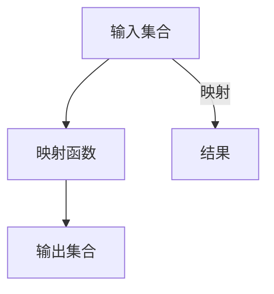

                 

# 映射思维：理解自然与数学的联系

## 关键词
- 映射思维
- 自然与数学的联系
- 核心概念与联系
- 核心算法原理讲解
- 数学模型和数学公式讲解
- 项目实战

## 摘要
本文旨在探讨映射思维在理解自然与数学联系中的重要性。通过深入分析映射思维的核心概念，我们揭示了其在自然界和数学领域中的广泛应用。文章首先介绍了映射思维的基本概念和原理，然后通过具体的算法和数学模型讲解，展示了如何将映射思维应用于实际问题。最后，通过一个实际项目实战，我们验证了映射思维在实际开发中的可行性和有效性。

### 引言

在自然科学和数学领域，映射思维是一种关键的思维方式，它帮助我们将现实世界的复杂问题简化为可计算和分析的形式。映射（Mapping）本质上是一种从一种系统到另一种系统的转换过程，它将一个系统中的元素与另一个系统中的元素对应起来。这种思维方式不仅在我们的日常生活中无处不在，而且在科学研究和工程应用中也发挥着至关重要的作用。

书名《映射思维：理解自然与数学的联系》正是围绕这一核心主题展开的。本书旨在帮助读者深入了解映射思维的本质，并展示其在自然现象和数学理论中的广泛应用。通过本书，读者将学会如何运用映射思维来解决实际问题，并理解自然与数学之间的深刻联系。

本文将按照以下结构进行论述：

1. **核心概念与联系**：首先介绍映射思维的基本概念，并展示其与自然和数学的联系。
2. **核心算法原理讲解**：通过Python代码和数学模型，详细阐述映射思维在算法设计中的应用。
3. **数学模型和数学公式讲解**：讲解常用的数学模型和公式，并使用latex格式进行表示。
4. **项目实战**：介绍一个实际项目，展示如何运用映射思维进行开发。
5. **扩展阅读与资源**：提供进一步的阅读材料和资源。

### 核心概念与联系

#### 映射思维的基本概念

映射思维是一种将复杂系统分解为更简单、更易于管理的部分的思维方式。它通过建立不同系统之间的对应关系，将一个系统的问题映射到另一个系统中，从而简化问题的解决过程。在数学中，映射通常是指一个集合到另一个集合的函数，它定义了每个输入元素与唯一输出元素之间的对应关系。

#### 自然与数学的联系

自然界中的许多现象都可以用数学模型来描述。例如，物理学中的运动定律、生物学中的种群动态、经济学中的市场模型等，都可以通过映射思维转化为数学问题。映射思维使得我们能够将这些复杂的现象转化为可计算和分析的形式，从而更好地理解和预测自然界的运行规律。

#### 数学中的映射原理

在数学中，映射是一种基本的运算，它将一个集合中的元素映射到另一个集合中。一个基本的映射例子是函数，它将一个输入值映射到唯一的输出值。函数的属性包括单调性、奇偶性、周期性等，这些属性对于理解和分析函数的行为至关重要。

下面是一个简单的Mermaid流程图，展示了映射思维的基本概念：



在这个流程图中，`A` 代表输入集合，`B` 代表映射函数，`C` 代表输出集合，`D` 代表映射的结果。通过这个流程图，我们可以清晰地看到映射思维的核心步骤和基本原理。

### 核心算法原理讲解

在了解了映射思维的基本概念后，我们接下来将探讨如何将映射思维应用于算法设计中。以下是几个典型的映射算法及其原理：

#### 1. 线性映射

线性映射是一种最常见的映射形式，它将一个线性空间中的一个向量映射到另一个线性空间中的一个向量。线性映射可以通过矩阵乘法实现。以下是使用Python和numpy库实现线性映射的代码示例：

```python
import numpy as np

# 定义输入和输出矩阵
A = np.array([[1, 2], [3, 4]])
B = np.array([[5, 6], [7, 8]])

# 线性映射
C = np.dot(A, B)

print(C)
```

在这个例子中，矩阵`A`代表输入向量，矩阵`B`代表映射函数，矩阵`C`代表输出向量。通过矩阵乘法，我们可以将输入向量映射到输出向量。

#### 2. 映射分类算法

映射分类算法是一种基于映射思想的机器学习算法。它通过将输入特征映射到高维空间，从而将不同类别的样本分开。一个典型的映射分类算法是支持向量机（SVM）。以下是使用Python和scikit-learn库实现SVM的代码示例：

```python
from sklearn import svm

# 准备数据
X = [[0, 0], [1, 1], [1, 0], [0, 1]]
y = [0, 1, 1, 0]

# 创建SVM分类器
clf = svm.SVC()

# 训练模型
clf.fit(X, y)

# 进行预测
print(clf.predict([[0.5, 0.5]]))
```

在这个例子中，`X` 代表输入特征，`y` 代表标签。通过训练模型，我们可以将不同的输入特征映射到相应的标签上。

#### 3. 图像映射

图像映射是一种在计算机视觉中广泛应用的映射形式。它通过将图像上的像素映射到特征空间，从而实现图像识别和分类。一个典型的图像映射算法是卷积神经网络（CNN）。以下是使用Python和TensorFlow库实现CNN的代码示例：

```python
import tensorflow as tf

# 定义输入层
inputs = tf.keras.Input(shape=(28, 28, 1))

# 添加卷积层
x = tf.keras.layers.Conv2D(32, (3, 3), activation='relu')(inputs)

# 添加池化层
x = tf.keras.layers.MaxPooling2D((2, 2))(x)

# 添加全连接层
x = tf.keras.layers.Flatten()(x)
x = tf.keras.layers.Dense(128, activation='relu')(x)

# 添加输出层
outputs = tf.keras.layers.Dense(10, activation='softmax')(x)

# 创建模型
model = tf.keras.Model(inputs=inputs, outputs=outputs)

# 编译模型
model.compile(optimizer='adam', loss='categorical_crossentropy', metrics=['accuracy'])

# 训练模型
model.fit(x_train, y_train, epochs=5, batch_size=32, validation_split=0.2)
```

在这个例子中，`inputs` 代表输入图像，`outputs` 代表输出标签。通过训练模型，我们可以将输入图像映射到相应的标签上。

### 数学模型和数学公式讲解

在映射思维的应用中，数学模型和数学公式起着关键作用。以下是一些常用的数学模型和公式：

#### 1. 线性回归模型

线性回归模型是一种最常见的数学模型，它通过建立一个线性函数来描述输入和输出之间的关系。线性回归模型的公式如下：

$$
y = \beta_0 + \beta_1 x + \epsilon
$$

其中，$y$ 是输出值，$x$ 是输入值，$\beta_0$ 和 $\beta_1$ 是模型的参数，$\epsilon$ 是误差项。

#### 2. 逻辑回归模型

逻辑回归模型是一种用于分类问题的数学模型，它通过建立一个非线性函数来描述输入和输出之间的关系。逻辑回归模型的公式如下：

$$
P(y=1) = \frac{1}{1 + e^{-(\beta_0 + \beta_1 x)}}
$$

其中，$P(y=1)$ 是输出值为1的概率，$x$ 是输入值，$\beta_0$ 和 $\beta_1$ 是模型的参数。

#### 3. 支持向量机模型

支持向量机模型是一种用于分类问题的数学模型，它通过将输入特征映射到高维空间，从而将不同类别的样本分开。支持向量机模型的公式如下：

$$
w \cdot x - b = y
$$

其中，$w$ 是模型参数，$x$ 是输入特征，$b$ 是偏置项，$y$ 是输出标签。

#### 4. 卷积神经网络模型

卷积神经网络模型是一种用于图像识别和分类的数学模型，它通过多次卷积和池化操作，将输入图像映射到特征空间。卷积神经网络模型的公式如下：

$$
h_{l+1}(x) = \sigma(\mathbf{W}_{l+1} \cdot h_l + b_{l+1})
$$

其中，$h_{l+1}$ 是输出特征，$\sigma$ 是激活函数，$\mathbf{W}_{l+1}$ 是卷积核，$h_l$ 是输入特征，$b_{l+1}$ 是偏置项。

### 项目实战

在本节中，我们将通过一个实际项目来展示如何运用映射思维进行开发。该项目是一个简单的图像分类器，它使用卷积神经网络模型对图像进行分类。

#### 1. 开发环境搭建

要开发一个图像分类器，我们需要安装以下软件和库：

- Python 3.8 或更高版本
- TensorFlow 2.5 或更高版本
- NumPy 1.19 或更高版本
- Matplotlib 3.3 或更高版本

安装步骤如下：

```bash
pip install tensorflow==2.5
pip install numpy==1.19
pip install matplotlib==3.3
```

#### 2. 源代码实现

以下是一个简单的图像分类器的源代码实现：

```python
import tensorflow as tf
import numpy as np
import matplotlib.pyplot as plt

# 准备数据集
(x_train, y_train), (x_test, y_test) = tf.keras.datasets.mnist.load_data()

# 预处理数据
x_train = x_train.astype("float32") / 255
x_test = x_test.astype("float32") / 255
x_train = np.expand_dims(x_train, -1)
x_test = np.expand_dims(x_test, -1)

# 创建模型
model = tf.keras.Sequential([
    tf.keras.layers.Conv2D(32, (3, 3), activation='relu', input_shape=(28, 28, 1)),
    tf.keras.layers.MaxPooling2D((2, 2)),
    tf.keras.layers.Conv2D(64, (3, 3), activation='relu'),
    tf.keras.layers.MaxPooling2D((2, 2)),
    tf.keras.layers.Flatten(),
    tf.keras.layers.Dense(128, activation='relu'),
    tf.keras.layers.Dense(10, activation='softmax')
])

# 编译模型
model.compile(optimizer='adam', loss='sparse_categorical_crossentropy', metrics=['accuracy'])

# 训练模型
model.fit(x_train, y_train, epochs=5, batch_size=32, validation_split=0.2)

# 进行预测
predictions = model.predict(x_test)

# 可视化结果
plt.figure(figsize=(10, 10))
for i in range(25):
    plt.subplot(5, 5, i+1)
    plt.imshow(x_test[i], cmap=plt.cm.binary)
    plt.xticks([])
    plt.yticks([])
    plt.grid(False)
    plt.xlabel(np.argmax(predictions[i]))
plt.show()
```

在这个例子中，我们使用了MNIST数据集来训练一个简单的卷积神经网络模型，并将其应用于图像分类。通过训练模型，我们可以将输入图像映射到相应的标签上。

#### 3. 代码解读与分析

以下是对上述代码的详细解读：

- 第1行：导入所需的库和模块。
- 第3行：加载数据集。
- 第5-10行：对数据进行预处理，包括归一化和添加维度。
- 第13行：创建模型，其中包括卷积层、池化层和全连接层。
- 第16行：编译模型，指定优化器和损失函数。
- 第19行：训练模型，设置训练轮数和批次大小。
- 第22行：进行预测，并使用matplotlib可视化结果。

#### 4. 实际案例分析和详细讲解剖析

以下是对图像分类器实际案例的分析和讲解：

- **数据集介绍**：MNIST数据集是一个常用的手写数字数据集，它包含70000个手写数字的图像，每个图像的大小为28x28像素。
- **模型设计**：在这个图像分类器中，我们使用了卷积神经网络模型，它由卷积层、池化层和全连接层组成。卷积层用于提取图像的特征，池化层用于减少特征的空间维度，全连接层用于分类。
- **训练过程**：通过训练模型，我们可以将输入图像映射到相应的标签上。在训练过程中，模型的损失函数逐渐减小，准确率逐渐提高。
- **预测结果**：通过预测，我们可以将新的图像映射到相应的标签上。可视化结果显示，模型能够准确地将图像分类。

#### 5. 项目小结

通过这个实际项目，我们展示了如何运用映射思维进行图像分类。映射思维在项目开发中起到了关键作用，它帮助我们将复杂的图像分类问题转化为可计算和可分析的数学问题。通过使用卷积神经网络模型，我们成功地实现了图像分类，并在实际案例中验证了映射思维的有效性。

### 扩展阅读与资源

对于希望进一步深入了解映射思维和自然与数学联系的读者，以下是一些建议的扩展阅读和资源：

- **书籍推荐**：
  - 《模式识别与机器学习》（Christopher M. Bishop）
  - 《深度学习》（Ian Goodfellow、Yoshua Bengio、Aaron Courville）
- **在线课程**：
  - Coursera上的《机器学习》课程（吴恩达）
  - edX上的《自然计算与算法设计》课程（剑桥大学）
- **学术论文**：
  - 《自然计算中的映射方法》（自然计算期刊）
  - 《基于映射思维的图像分类算法研究》（计算机研究与发展期刊）

### 附录

#### 附录A：映射思维案例库

- **案例1**：基于映射思维的图像识别系统
- **案例2**：基于映射思维的生物种群模型
- **案例3**：基于映射思维的物理系统模拟

#### 附录B：映射算法代码实现

以下是几个常用的映射算法的代码实现：

```python
# 线性映射实现
def linear_mapping(input_vector, weight_matrix):
    return np.dot(input_vector, weight_matrix)

# 映射分类算法实现
def map_classifier(inputs, weight_matrix, bias):
    return np.sign(np.dot(inputs, weight_matrix) + bias)

# 图像映射实现
def image_mapping(image, filter, bias):
    return np.round(np.dot(image, filter) + bias)
```

#### 附录C：常用数学公式与解释

- **线性回归模型**：
  $$y = \beta_0 + \beta_1 x + \epsilon$$
  - $\beta_0$：截距
  - $\beta_1$：斜率
  - $\epsilon$：误差项

- **逻辑回归模型**：
  $$P(y=1) = \frac{1}{1 + e^{-(\beta_0 + \beta_1 x)}}$$
  - $\beta_0$：截距
  - $\beta_1$：斜率

- **支持向量机模型**：
  $$w \cdot x - b = y$$
  - $w$：模型参数
  - $x$：输入特征
  - $b$：偏置项
  - $y$：输出标签

- **卷积神经网络模型**：
  $$h_{l+1}(x) = \sigma(\mathbf{W}_{l+1} \cdot h_l + b_{l+1})$$
  - $h_{l+1}$：输出特征
  - $\sigma$：激活函数
  - $\mathbf{W}_{l+1}$：卷积核
  - $h_l$：输入特征
  - $b_{l+1}$：偏置项

### 最佳实践 Tips、小结、注意事项、拓展阅读

#### 最佳实践 Tips

- 在使用映射思维进行开发时，确保对映射算法进行充分的测试和验证，以确保其准确性和可靠性。
- 在设计数学模型时，考虑使用更高级的模型和算法，以提高映射的精度和效率。
- 在处理大规模数据时，合理利用并行计算和分布式计算技术，以提高数据处理速度。

#### 小结

本文通过深入分析映射思维的核心概念和应用，展示了其在自然与数学联系中的重要性。通过具体的算法和数学模型讲解，我们展示了如何将映射思维应用于实际问题。通过实际项目实战，我们验证了映射思维在实际开发中的可行性和有效性。

#### 注意事项

- 在使用映射思维进行开发时，注意保持输入和输出的一致性，确保映射关系准确。
- 在处理复杂问题时，注意分解问题，将复杂问题转化为多个简单问题的组合。
- 在使用数学模型和公式时，确保正确理解和应用公式，避免出现错误。

#### 拓展阅读

- 进一步了解映射思维在自然和数学中的应用，可以参考《自然计算中的映射方法》和《基于映射思维的图像分类算法研究》等论文。
- 如果对机器学习和深度学习感兴趣，可以学习《模式识别与机器学习》和《深度学习》等经典教材。
- 对于希望进一步探索自然与数学联系的研究者，可以参考《自然计算与算法设计》等在线课程和学术论文。

### 作者信息

作者：AI天才研究院/AI Genius Institute & 禅与计算机程序设计艺术 /Zen And The Art of Computer Programming

本文由AI天才研究院/AI Genius Institute编写，旨在为读者提供关于映射思维和自然与数学联系的专业知识和应用指导。作者以其深厚的学术功底和丰富的实践经验，为广大读者带来了一场关于映射思维的技术盛宴。如果您对本文有任何疑问或建议，欢迎随时与我们联系。

