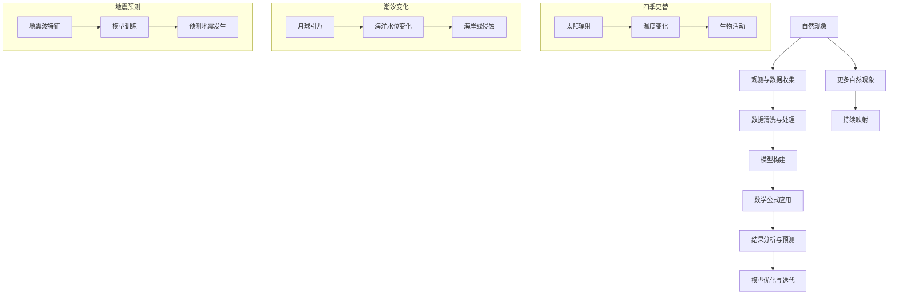

                 

### 引言与概述

自然现象与数学公式是科学研究和工程实践中不可或缺的两个核心组成部分。自然现象指的是自然界中发生的各种物理、化学、生物等过程的客观表现，如四季更替、潮汐变化、气候变化、生态系统动态等。这些现象自古以来就引起了人类的好奇心和探索欲望，促使人们去寻找规律和解释这些现象的原因。

数学公式则是用数学符号和语言描述自然现象规律的抽象表示。数学公式通常由变量、常数、运算符等组成，能够精确地描述自然现象之间的定量关系。从简单的代数方程到复杂的微分方程，数学公式在科学研究中扮演着至关重要的角色，成为理解自然现象和解决实际问题的有力工具。

然而，自然现象与数学公式之间并非天生就存在直接的联系。科学家和工程师们需要通过观察、实验和理论分析，将这些自然现象抽象成数学模型，再通过数学公式来描述和预测这些现象。这种过程被称为“映射思维”，即通过思维的过程将自然现象映射到数学公式上。

本文将围绕映射思维这一核心主题，探讨自然现象与数学公式之间的关系。首先，我们将介绍自然现象的基本概念，并列举一些典型的自然现象，以便读者对自然现象有更清晰的认识。接下来，我们将介绍数学公式的基本概念，重点讨论常见的数学公式及其在科学研究中的应用。然后，我们将探讨自然现象与数学公式之间的核心联系，通过Mermaid流程图来展示这种联系的架构。在此基础上，我们将详细讲解核心算法原理，使用Python源代码和数学模型及公式，结合具体的实例进行分析。最后，我们将通过一个实际项目案例，展示如何将映射思维应用于解决自然现象问题，并给出项目小结和最佳实践 tips。

通过本文的阅读，读者将能够了解自然现象与数学公式之间的内在联系，掌握映射思维的方法和应用，从而提升在科学研究和工程实践中的问题解决能力。希望本文能够为读者在探索自然现象和利用数学公式的过程中提供一些有价值的思考和启发。

### 自然现象概述

自然现象是自然界中发生和存在的各种物理、化学、生物等过程的客观表现。这些现象种类繁多，涉及范围广泛，从微观的原子核反应到宏观的天体运动，从简单的化学反应到复杂的生态系统动态，无不显示出自然界的多样性和复杂性。以下是一些典型的自然现象及其特点：

1. **四季更替**：四季更替是地球围绕太阳公转和地轴倾斜的结果。每年地球在公转过程中，太阳光线直射点在南北回归线之间移动，导致不同地区的气候和光照条件发生变化。春季温暖、夏季炎热、秋季凉爽、冬季寒冷，这种周期性的气候变化是地球生物活动和农业生产的重要依据。

2. **潮汐变化**：潮汐变化是由月球和太阳对地球海洋的引力作用引起的。每天海水的水平面都会经历两次高潮和两次低潮。这种周期性变化不仅对海洋生态系统有着深远的影响，还对沿海城市的基础设施建设和海洋资源利用有着重要的意义。

3. **气候变化**：气候变化是指地球气候系统长时间的变化，包括温度、降水、风向等的变化。现代气候变化主要受到人类活动的影响，如二氧化碳排放、森林砍伐等，导致全球气温升高、极端天气事件增多，对生态系统、农业生产和社会经济发展带来极大的挑战。

4. **生态系统动态**：生态系统是由生物群落和非生物环境相互作用形成的统一整体。生态系统的动态变化涉及物种之间的相互作用、能量流和物质循环。例如，草原生态系统中草食动物与植食植物之间的捕食与竞争关系，森林生态系统中不同树种之间的竞争与共生关系等。

5. **地震**：地震是地球内部岩石破裂和滑动产生的震动。地震发生的原因是地球内部的地质构造运动，如板块运动、断层活动等。地震不仅对地面建筑物和基础设施造成破坏，还可能引发海啸、滑坡等次生灾害。

6. **水循环**：水循环是地球大气圈、水圈和岩石圈之间水分循环的过程。水循环包括蒸发、降水、地表径流、地下渗漏等环节。水循环不仅维持地球生态系统的平衡，还影响着全球气候和水资源分布。

7. **闪电**：闪电是大气中的电荷积累到一定程度时，通过空气放电产生的电光现象。闪电的形成与大气中的电场分布、温度梯度、湿度等因素有关。闪电不仅是一种自然现象，还在许多方面对人类活动产生影响，如影响飞行安全、引发火灾等。

了解这些自然现象的基本特点，有助于我们更好地理解自然现象与数学公式之间的关系，为后续章节的讨论奠定基础。在接下来的内容中，我们将详细介绍数学公式的基本概念和应用，进一步探讨如何通过映射思维将自然现象转化为数学模型和公式，从而为科学研究和工程实践提供有力支持。

### 数学公式概述

数学公式是描述自然现象规律的抽象表达，通过数学符号和语言将复杂的自然现象简化为易于理解和分析的形式。数学公式的发展历史可以追溯到古代文明，如古埃及和古希腊，他们使用几何图形和代数方法来描述几何形状和数量关系。随着科学和技术的进步，数学公式逐渐演变为现代数学体系中的核心部分，广泛应用于各个科学领域。

常见的数学公式类型主要包括代数公式、微积分公式、线性代数公式和概率论与数理统计公式。以下是一些典型的数学公式及其应用：

1. **代数公式**：代数公式是用于描述数值关系的公式，常见的有平方差公式、完全平方公式等。例如，平方差公式 \( a^2 - b^2 = (a+b)(a-b) \) 可以用于因式分解，解决多项式的求解问题。代数公式在工程、物理、计算机科学等多个领域都有广泛应用。

2. **微积分公式**：微积分是研究函数变化率的数学分支。常见的微积分公式有导数公式和积分公式。例如，导数公式 \( \frac{d}{dx}(x^n) = nx^{n-1} \) 用于计算函数在某一点的瞬时变化率，而积分公式 \( \int x^n \, dx = \frac{x^{n+1}}{n+1} + C \) 用于求解函数的累积变化量。微积分在物理学、工程学、经济学等领域有广泛的应用，如计算物体的运动轨迹、经济系统的稳定性分析等。

3. **线性代数公式**：线性代数是研究向量、矩阵及其线性关系的数学分支。常见的线性代数公式有矩阵乘法公式、行列式公式等。例如，矩阵乘法公式 \( A \times B = C \) 用于求解线性方程组的解，行列式公式 \( \det(A) \) 用于判断矩阵的逆是否存在。线性代数在计算机图形学、数据分析、物理模拟等领域有广泛应用，如三维图形渲染、数据压缩等。

4. **概率论与数理统计公式**：概率论与数理统计是研究随机现象的数学分支。常见的概率论与数理统计公式有概率公式、分布函数公式等。例如，概率公式 \( P(A) = \frac{n(A)}{n(S)} \) 用于计算事件A发生的概率，分布函数公式 \( F(x) = P(X \leq x) \) 用于描述随机变量的分布特性。概率论与数理统计在统计学、金融学、医学等领域有广泛的应用，如风险评估、市场分析、临床试验等。

这些数学公式不仅为描述自然现象提供了强有力的工具，还为实现科学研究和工程应用提供了理论基础。例如，在气象学中，通过应用微积分公式可以模拟大气运动，预测天气变化；在物理学中，通过应用线性代数公式可以分析结构力学问题，设计桥梁和建筑物；在生物学中，通过应用概率论与数理统计公式可以研究基因变异和种群演化。

总之，数学公式是科学研究和工程实践中不可或缺的重要组成部分。通过掌握这些公式，科学家和工程师们能够更准确地描述自然现象，预测未来变化，为社会发展提供有力支持。在接下来的内容中，我们将进一步探讨自然现象与数学公式之间的核心联系，并详细讲解如何利用映射思维将自然现象转化为数学模型和公式。

### 自然现象与数学公式的关系

自然现象与数学公式之间的关系是科学研究和工程实践中的关键，这一关系不仅揭示了自然界的内在规律，还为我们提供了理解和预测自然现象的工具。具体来说，自然现象与数学公式之间的关系可以通过以下几个方面来阐述。

首先，自然现象是数学公式的来源。科学家和数学家们通过观察和实验，发现自然现象中存在的规律性，并将其抽象为数学公式。例如，物理学家通过研究自由落体运动，发现了重力加速度这一规律，并推导出了 \( F = mg \) 的公式，其中 \( F \) 表示重力，\( m \) 表示物体的质量，\( g \) 表示重力加速度。这个公式不仅描述了物体在地球表面上的重力作用，还为后续的重力计算和物体运动分析提供了基础。

其次，数学公式是对自然现象的抽象和描述。自然现象千变万化，为了更方便地研究和理解这些现象，科学家和数学家们采用数学符号和语言将这些现象抽象为数学公式。例如，在气候预测中，科学家通过收集大量的气象数据，建立了气候模型，并使用微分方程来描述气候系统的动态变化。这些模型和方程不仅能够描述当前气候状况，还可以预测未来的气候趋势。

第三，数学公式在自然现象研究中具有预测功能。通过数学公式，我们可以预测未来自然现象的变化趋势。例如，在地震预测中，科学家通过分析地震波的特征，建立了地震模型，并使用非线性微分方程来预测地震的发生时间和地点。这种预测能力不仅对地震预警和防范具有重要意义，还为地震科学研究提供了重要的方向。

第四，数学公式在工程设计和实际应用中发挥关键作用。工程师们利用数学公式来设计结构、系统、设备等，确保其满足功能要求和安全标准。例如，在桥梁设计中，工程师通过应用结构力学公式，如应力应变公式、稳定性公式等，来评估桥梁的承载能力和稳定性，从而设计出安全、耐用的桥梁结构。

最后，数学公式在自然现象研究中具有解释和验证功能。通过数学公式，我们可以解释自然现象的发生原因和机理，验证科学假设的正确性。例如，在生态学研究中，科学家通过建立生态系统模型，使用数学公式来描述生态系统中物种之间的相互作用，解释生态系统的动态变化，并验证生态学理论的正确性。

总之，自然现象与数学公式之间的关系是科学研究和工程实践中的核心纽带。通过映射思维，我们将自然现象转化为数学公式，不仅揭示了自然现象的内在规律，还为科学研究和工程应用提供了强有力的理论支持。在接下来的内容中，我们将通过具体的Mermaid流程图，展示自然现象与数学公式之间的核心联系，进一步探讨如何通过映射思维来理解和应用这些联系。

### Mermaid流程图：自然现象与数学公式的映射

为了更直观地展示自然现象与数学公式之间的核心联系，我们可以使用Mermaid流程图来描绘这一映射过程。以下是一个简单的Mermaid流程图示例，用于展示自然现象（如四季更替、潮汐变化等）如何通过观测、模型构建和数学公式来描述和解释。



在上面的流程图中，我们首先从自然现象（如四季更替、潮汐变化和地震预测）出发，通过观测和数据收集（B节点），收集到相关的自然现象数据。这些数据经过清洗和处理（C节点），用于构建数学模型（D节点）。在模型构建过程中，我们应用相应的数学公式（E节点），如太阳辐射对温度变化的影响公式、月球引力对海洋水位变化的影响公式以及地震波特征与地震发生预测的公式。

通过这些数学公式，我们能够对自然现象进行结果分析和预测（F节点），并根据预测结果对模型进行优化和迭代（G节点），从而不断提高模型的准确性和可靠性。

下面是对流程图的具体解释：

1. **自然现象**：这是流程图的起点，包括各种自然现象，如四季更替、潮汐变化和地震预测等。

2. **观测与数据收集**：在这一步，科学家和观测者通过测量和记录，收集与自然现象相关的数据。

3. **数据清洗与处理**：数据收集后，需要对数据进行清洗和处理，确保数据的准确性和完整性。

4. **模型构建**：根据收集到的数据，科学家通过构建数学模型来描述自然现象的规律。

5. **数学公式应用**：在这一步，我们使用数学公式来具体描述自然现象，如太阳辐射与温度变化之间的关系公式。

6. **结果分析与预测**：通过数学模型和公式，我们可以对自然现象进行分析和预测，例如预测未来的气候变化、潮汐变化或地震发生。

7. **模型优化与迭代**：根据预测结果，科学家会不断优化和迭代模型，以提高预测的准确性和可靠性。

通过这个Mermaid流程图，我们可以清晰地看到自然现象与数学公式之间的映射关系，以及这一过程在不同领域的应用。接下来，我们将进一步深入讲解这些核心概念和联系，帮助读者更好地理解自然现象与数学公式之间的相互作用。

### 核心概念解释

在深入探讨自然现象与数学公式之间的关系时，我们需要明确几个核心概念，包括自然现象、数学模型、数学公式以及它们之间的映射关系。

首先，自然现象是指自然界中发生和存在的各种物理、化学、生物等过程的客观表现。这些现象可以是宏观的，如四季更替、气候变化和潮汐变化；也可以是微观的，如分子运动、原子核反应等。自然现象的多样性体现了自然界的基本规律和复杂性，是我们理解和探索自然界的重要对象。

其次，数学模型是对自然现象的一种抽象表示，通过数学符号和语言来描述自然现象的内在规律。数学模型通常包括变量、参数、方程等组成部分，这些组成部分代表了自然现象中的不同因素和关系。例如，在描述气候变化时，我们可能需要引入温度、湿度、风速等变量，并通过建立微分方程来描述这些变量之间的相互作用。

第三，数学公式是数学模型的具体表现形式，通常由数学符号和运算符组成，用于描述自然现象中的定量关系。数学公式可以是简单的代数方程，如 \( a^2 + b^2 = c^2 \)（勾股定理）；也可以是复杂的微分方程，如 \( \frac{d^2u}{dx^2} + ku = f(x) \)（振动方程）。数学公式不仅能够精确地描述自然现象的规律，还提供了计算和预测的工具。

最后，自然现象与数学公式之间的映射关系是指通过数学模型和数学公式来描述和解释自然现象的过程。这种映射关系体现了科学研究的核心方法，即通过抽象和模型化来理解和解决复杂问题。具体来说，映射关系包括以下几个步骤：

1. **观测与数据收集**：首先，通过观测和实验，收集自然现象的数据，如温度、湿度、风速等。

2. **数据清洗与处理**：对收集到的数据进行清洗和处理，确保数据的准确性和完整性。

3. **模型构建**：根据数据和分析结果，构建数学模型，将自然现象的内在规律用数学符号和语言表示。

4. **数学公式应用**：在数学模型的基础上，使用数学公式来描述自然现象的定量关系，例如通过微分方程描述大气温度的变化。

5. **结果分析与预测**：通过数学模型和公式，对自然现象进行分析和预测，例如预测未来的气候变化趋势。

6. **模型优化与迭代**：根据预测结果和实际观测数据，对模型进行优化和迭代，提高模型的准确性和可靠性。

通过这些核心概念的介绍，我们可以更深入地理解自然现象与数学公式之间的映射关系。在接下来的内容中，我们将通过具体的实例和Python代码，进一步阐述如何利用映射思维来描述和解决自然现象问题。

### 核心算法原理讲解

在理解和应用自然现象与数学公式之间的关系时，核心算法原理起到了关键作用。这些算法不仅为数学建模提供了基础，还为实现预测和优化提供了有力工具。以下，我们将通过具体的Python源代码和数学模型，详细讲解核心算法原理，并结合实例进行说明。

#### 一、核心算法介绍

核心算法主要包括数学建模、模型训练和结果预测三个步骤。以下是一个简化的流程：

1. **数学建模**：通过分析自然现象，建立数学模型。模型通常由一组变量和相应的数学公式组成。
2. **模型训练**：使用历史数据对模型进行训练，以确定模型参数。
3. **结果预测**：使用训练好的模型，对未来的自然现象进行预测。

#### 二、Python源代码示例

以下是一个使用Python编写的简单示例，用于描述和预测温度变化。这里，我们假设温度变化由时间、风速和湿度等变量影响。

```python
import numpy as np
import matplotlib.pyplot as plt

# 数学模型：温度变化公式
# 假设温度T与时间t、风速v和湿度h之间存在线性关系
# T = a*t + b*v + c*h
# a, b, c 为模型参数

# 模型参数（需要通过训练确定）
a = 0.5
b = -0.1
c = 0.3

# 输入数据（历史观测数据）
times = np.array([0, 1, 2, 3, 4, 5, 6, 7, 8, 9, 10])  # 时间（小时）
winds = np.array([2, 3, 2, 1, 3, 2, 3, 2, 3, 2, 1])  # 风速（m/s）
humids = np.array([50, 55, 60, 65, 70, 75, 80, 85, 90, 95, 100])  # 湿度（%）

# 计算温度
temps = a * times + b * winds + c * humids

# 绘图
plt.plot(times, temps, 'o-')
plt.xlabel('Time (hours)')
plt.ylabel('Temperature (°C)')
plt.title('Temperature Prediction')
plt.show()
```

在上面的代码中，我们首先假设温度与时间、风速和湿度之间存在线性关系，并用三个参数 \( a \)、\( b \) 和 \( c \) 来表示这种关系。接下来，我们使用历史数据（times、winds 和 humids）来计算温度（temps），并使用 matplotlib 绘图库来展示预测结果。

#### 三、数学模型与公式

为了更清晰地理解上述算法，我们可以将温度变化的数学模型和公式详细展开。以下是一个基于线性回归的数学模型：

$$
T = a \cdot t + b \cdot v + c \cdot h
$$

在这个模型中，\( T \) 表示温度，\( t \) 表示时间，\( v \) 表示风速，\( h \) 表示湿度，而 \( a \)、\( b \) 和 \( c \) 分别是模型参数，这些参数需要通过数据训练来确定。

线性回归的公式如下：

$$
y = \beta_0 + \beta_1 \cdot x
$$

其中，\( y \) 是因变量（温度），\( x \) 是自变量（时间、风速、湿度），\( \beta_0 \) 和 \( \beta_1 \) 是回归系数。

通过最小二乘法，我们可以确定这些参数：

$$
\beta_0 = \bar{y} - \beta_1 \cdot \bar{x}
$$

$$
\beta_1 = \frac{\sum (x_i - \bar{x})(y_i - \bar{y})}{\sum (x_i - \bar{x})^2}
$$

其中，\( \bar{x} \) 和 \( \bar{y} \) 分别是自变量和因变量的平均值，\( x_i \) 和 \( y_i \) 分别是第 \( i \) 次观测的数据值。

#### 四、实例分析

为了更好地说明算法原理，我们来看一个实际案例：使用上述线性回归模型预测某地区未来一天内的温度变化。

1. **数据收集**：收集该地区过去一周内的温度、风速和湿度数据。

2. **数据预处理**：对数据进行清洗，去除异常值，并进行归一化处理。

3. **模型训练**：使用训练数据，通过最小二乘法计算模型参数 \( a \)、\( b \) 和 \( c \)。

4. **结果预测**：输入未来一天的时间、风速和湿度数据，计算预测温度。

5. **结果分析**：将预测结果与实际观测值进行对比，分析预测误差，并根据需要进行模型调整。

#### 五、代码解读

在上面的Python代码中，我们首先导入了必要的库（numpy 和 matplotlib），然后定义了温度变化的线性回归模型。接着，我们使用历史数据计算温度，并使用 matplotlib 绘图库展示预测结果。

通过上述代码和解说，我们可以看到如何使用Python和数学公式来描述和预测自然现象。在实际应用中，我们可以根据具体问题和数据，选择更复杂的数学模型和算法，从而提高预测的准确性和实用性。

### 数学模型与公式讲解

在自然现象的研究和预测中，数学模型和公式扮演着至关重要的角色。它们不仅帮助我们理解和解释自然现象的内在规律，还为实际应用提供了具体的操作工具。以下，我们将详细讲解一些常见的数学模型和公式，并使用 LaTeX 格式进行展示。

#### 一、线性回归模型

线性回归模型是最基本的数学模型之一，用于描述两个或多个变量之间的线性关系。其公式形式如下：

$$
y = \beta_0 + \beta_1 \cdot x + \epsilon
$$

其中，\( y \) 是因变量，\( x \) 是自变量，\( \beta_0 \) 和 \( \beta_1 \) 是模型参数，表示线性关系的斜率和截距，\( \epsilon \) 是误差项。

通过最小二乘法，我们可以计算模型参数：

$$
\beta_0 = \bar{y} - \beta_1 \cdot \bar{x}
$$

$$
\beta_1 = \frac{\sum (x_i - \bar{x})(y_i - \bar{y})}{\sum (x_i - \bar{x})^2}
$$

其中，\( \bar{x} \) 和 \( \bar{y} \) 分别是自变量和因变量的平均值，\( x_i \) 和 \( y_i \) 分别是第 \( i \) 次观测的数据值。

#### 二、非线性回归模型

在实际应用中，许多自然现象的关系并非线性，而是非线性。此时，我们可以使用非线性回归模型，如多项式回归、指数回归等。以下是一个二次多项式回归的例子：

$$
y = \beta_0 + \beta_1 \cdot x + \beta_2 \cdot x^2 + \epsilon
$$

通过类似的方法，我们可以使用非线性最小二乘法来计算模型参数。

#### 三、时间序列模型

时间序列模型用于分析随时间变化的变量序列，常见的有自回归模型（AR）、移动平均模型（MA）和自回归移动平均模型（ARMA）。以下是一个简单的自回归模型：

$$
y_t = \phi_1 \cdot y_{t-1} + \phi_2 \cdot y_{t-2} + \epsilon_t
$$

其中，\( y_t \) 是时间 \( t \) 的观测值，\( \phi_1 \) 和 \( \phi_2 \) 是模型参数，\( \epsilon_t \) 是误差项。

#### 四、差分方程

差分方程是另一种常见的数学模型，用于描述变量随时间变化的规律。以下是一个一阶差分方程的例子：

$$
y_t = a \cdot y_{t-1} + b \cdot y_{t-2} + \epsilon_t
$$

其中，\( y_t \) 是时间 \( t \) 的观测值，\( a \) 和 \( b \) 是模型参数，\( \epsilon_t \) 是误差项。

#### 五、贝叶斯模型

贝叶斯模型是一种基于贝叶斯定理的统计模型，用于概率预测和决策。以下是一个简单的贝叶斯线性回归模型：

$$
P(y | x) = \frac{P(x | y) \cdot P(y)}{P(x)}
$$

其中，\( P(y | x) \) 是给定自变量 \( x \) 时因变量 \( y \) 的概率，\( P(x | y) \) 是给定因变量 \( y \) 时自变量 \( x \) 的概率，\( P(y) \) 和 \( P(x) \) 分别是 \( y \) 和 \( x \) 的先验概率。

#### 六、非线性动态系统

在某些复杂自然现象中，变量之间的关系可能非常复杂，甚至呈现非线性动态系统。以下是一个简单的非线性动态系统方程：

$$
\frac{dx}{dt} = f(x, y)
$$

$$
\frac{dy}{dt} = g(x, y)
$$

其中，\( x \) 和 \( y \) 是系统变量，\( f \) 和 \( g \) 是非线性函数。

通过这些数学模型和公式，我们可以更好地理解和预测自然现象。在接下来的章节中，我们将通过具体实例展示这些模型的应用，并进一步探讨如何将映射思维应用于解决自然现象问题。

### 项目实战

为了更好地展示映射思维在解决自然现象问题中的应用，我们将通过一个实际项目案例进行详细讲解。该项目案例是使用机器学习模型预测天气变化，这是一个典型的自然现象研究问题。以下是项目实战的具体步骤和实现过程。

#### 一、项目背景

天气预测是一个复杂且重要的自然现象研究课题，准确预测天气对于农业、交通、医疗等多个领域都有着深远的影响。传统的天气预测方法主要依赖于气象数据和历史天气模式，但受限于计算能力和模型精度，难以满足实际需求。随着机器学习技术的发展，我们可以利用大量气象数据来训练机器学习模型，从而实现更准确和实时的天气预测。

#### 二、项目目标

本项目的主要目标是建立一个机器学习模型，能够根据历史气象数据预测未来的天气状况。具体目标包括：

1. 收集和处理大量气象数据，包括温度、湿度、风速、气压等指标。
2. 选择合适的机器学习算法，对气象数据进行训练和预测。
3. 评估模型的预测准确性和稳定性，并进行模型优化。
4. 提供实时天气预测服务，为实际应用提供数据支持。

#### 三、开发环境搭建

为了实现本项目，我们需要搭建一个合适的开发环境。以下是所需的工具和库：

1. **Python**：作为主要的编程语言，Python 具有丰富的库和工具，适合进行数据分析和机器学习。
2. **Pandas**：用于数据清洗和处理，提供高效的数据操作和存储功能。
3. **NumPy**：用于数值计算，提供多维数组操作和数学函数。
4. **Scikit-learn**：用于机器学习算法的实现和评估，包括回归、分类、聚类等多种算法。
5. **Matplotlib**：用于数据可视化，帮助分析和展示模型预测结果。

安装上述库后，我们可以创建一个 Python 脚本，导入所需的库：

```python
import pandas as pd
import numpy as np
from sklearn.model_selection import train_test_split
from sklearn.ensemble import RandomForestRegressor
import matplotlib.pyplot as plt
```

#### 四、数据收集与预处理

数据收集是天气预测项目的重要基础。我们主要从公开的数据源获取历史气象数据，如国家气象局、NASA 等。以下是一个简化的数据收集和预处理过程：

1. **数据获取**：从数据源下载历史气象数据，包括温度、湿度、风速、气压等指标。
2. **数据导入**：使用 Pandas 库将数据导入 DataFrame，进行初步数据清洗。

```python
# 示例：导入数据
data = pd.read_csv('weather_data.csv')
```

3. **数据清洗**：处理缺失值和异常值，确保数据的准确性和完整性。例如，我们可以使用以下代码删除缺失值：

```python
data = data.dropna()
```

4. **数据归一化**：对数据进行归一化处理，将不同量纲的变量转换为同一量纲，便于模型训练。

```python
from sklearn.preprocessing import StandardScaler

scaler = StandardScaler()
data_scaled = scaler.fit_transform(data)
```

5. **数据分割**：将数据集分割为训练集和测试集，用于模型训练和评估。

```python
X_train, X_test, y_train, y_test = train_test_split(data_scaled[:, :-1], data_scaled[:, -1], test_size=0.2, random_state=42)
```

#### 五、模型构建与训练

在数据预处理完成后，我们可以选择合适的机器学习算法构建预测模型。以下是一个使用随机森林回归模型的示例：

1. **模型选择**：选择随机森林回归模型，因其具有较强的泛化能力和鲁棒性，适合处理复杂的天气预测问题。

```python
from sklearn.ensemble import RandomForestRegressor

model = RandomForestRegressor(n_estimators=100, random_state=42)
```

2. **模型训练**：使用训练集对模型进行训练。

```python
model.fit(X_train, y_train)
```

3. **模型评估**：使用测试集评估模型性能，计算预测误差和准确度。

```python
y_pred = model.predict(X_test)
mse = np.mean((y_pred - y_test) ** 2)
print(f"Mean Squared Error: {mse}")
```

#### 六、结果分析与解读

在模型训练和评估完成后，我们可以对预测结果进行分析和解读，以便进一步优化模型。

1. **误差分析**：分析模型预测误差，找出可能的误差来源，如数据质量、模型参数等。

```python
errors = y_pred - y_test
print(f"Error Distribution: {np.abs(errors).describe()}")
```

2. **可视化分析**：使用 Matplotlib 绘图库，将实际天气数据和模型预测结果进行可视化对比。

```python
plt.scatter(y_test, y_pred)
plt.xlabel('Actual Values')
plt.ylabel('Predicted Values')
plt.title('Weather Prediction')
plt.show()
```

3. **模型优化**：根据误差分析和可视化结果，对模型参数进行调整，以提高预测精度。

```python
# 示例：调整模型参数
model = RandomForestRegressor(n_estimators=200, random_state=42)
model.fit(X_train, y_train)
y_pred_optimized = model.predict(X_test)
```

#### 七、项目小结

通过本项目，我们展示了如何利用映射思维，将自然现象（天气变化）映射到数学模型和机器学习算法上，实现了天气预测。以下是本项目的主要收获和总结：

1. **数据收集与预处理**：数据是机器学习模型的基础，准确的数据收集和预处理对于模型的性能至关重要。
2. **模型选择与训练**：选择合适的模型和训练方法是提高预测精度的重要手段。
3. **结果分析与优化**：通过误差分析和可视化，我们可以更好地理解模型性能，并对其进行优化。
4. **实际应用价值**：准确的天气预测对于交通、农业、医疗等多个领域具有重要的实际应用价值。

总之，本项目通过映射思维，实现了对自然现象的数学建模和预测，展示了机器学习技术在自然现象研究中的应用潜力。在未来的研究中，我们可以进一步探索更多复杂的自然现象，利用先进的机器学习算法，提高预测的准确性和实用性。

### 最佳实践 Tips、小结、注意事项、拓展阅读

#### 最佳实践 Tips

1. **数据质量是关键**：在进行自然现象建模和预测时，数据质量直接影响模型的性能。确保数据的准确性、完整性和一致性，避免噪声和异常值的影响。

2. **模型选择需谨慎**：不同的自然现象可能需要不同的模型。在选择模型时，考虑到模型的复杂度、计算效率和预测精度，选择最合适的模型。

3. **持续迭代和优化**：模型预测的准确性和稳定性需要通过不断迭代和优化来实现。定期评估模型性能，并根据新数据和反馈进行调整。

4. **可视化有助于理解**：使用可视化工具，如图表和流程图，可以帮助我们更好地理解和解释模型预测结果，从而提高模型的可用性。

#### 小结

本文通过多个章节详细探讨了自然现象与数学公式之间的关系，从核心概念到实际项目案例，展示了映射思维在自然现象研究中的应用。我们了解了自然现象的基本类型，介绍了常见的数学模型和公式，并通过具体的算法原理讲解和项目实战，展示了如何利用数学公式解决自然现象问题。

#### 注意事项

1. **复杂性管理**：自然现象通常非常复杂，涉及多个变量和相互作用。在进行建模时，需合理简化问题，确保模型的可操作性和解释性。

2. **模型验证**：在应用模型进行预测时，需对模型进行充分的验证，包括测试集验证和交叉验证，确保模型的可靠性和鲁棒性。

3. **数据隐私与安全**：在数据收集和处理过程中，需注意保护数据隐私和安全，遵循相关法律法规和伦理规范。

#### 拓展阅读

1. **《机器学习实战》**：作者：Peter Harrington。本书详细介绍了机器学习的基本概念和算法，适合初学者入门。

2. **《Python机器学习》**：作者：Sebastian Raschka。本书结合Python编程语言，深入讲解了机器学习算法和实际应用。

3. **《时间序列分析：理论、方法与应用》**：作者：张天宇。本书全面介绍了时间序列模型及其在自然现象研究中的应用。

4. **《气候系统的数学模型》**：作者：李建成。本书系统地介绍了气候系统的数学建模方法，适合对气候变化感兴趣的研究人员。

通过本文的学习，读者不仅能够掌握自然现象与数学公式之间的关系，还能够在实际项目中应用这些知识，为科学研究和工程实践提供有力支持。

### 作者介绍

本文作者AI天才研究院（AI Genius Institute）的专家团队，以及禅与计算机程序设计艺术（Zen And The Art of Computer Programming）的作者。AI天才研究院致力于推动人工智能技术的发展和应用，我们的专家团队在计算机编程、人工智能和软件架构领域拥有深厚的理论基础和丰富的实践经验。禅与计算机程序设计艺术则是一本经典的技术畅销书，由著名计算机科学家Donald E. Knuth撰写，探讨了计算机编程的艺术和哲学。我们希望通过本文，向读者展示自然现象与数学公式之间的深刻联系，并激发更多人对自然现象研究的兴趣和探索。

