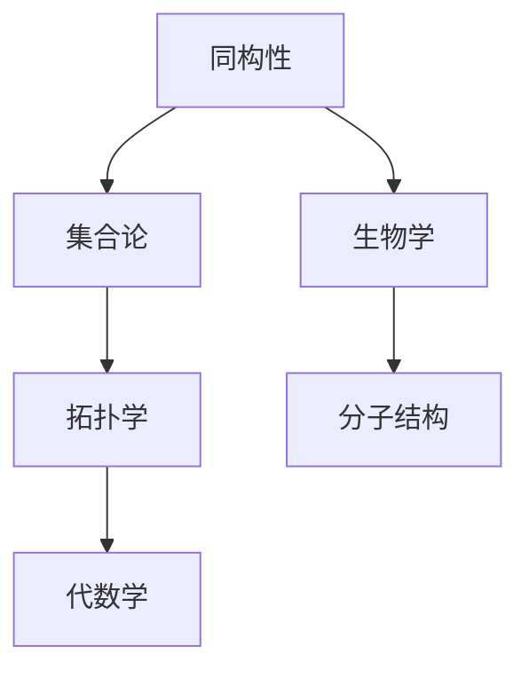
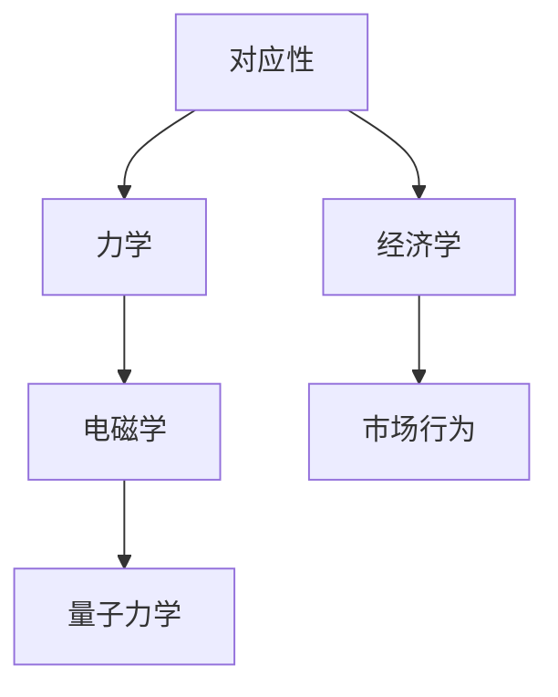
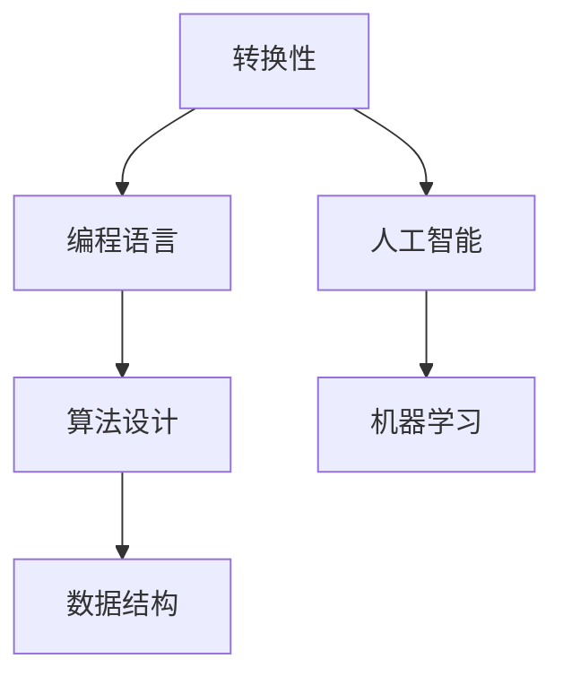
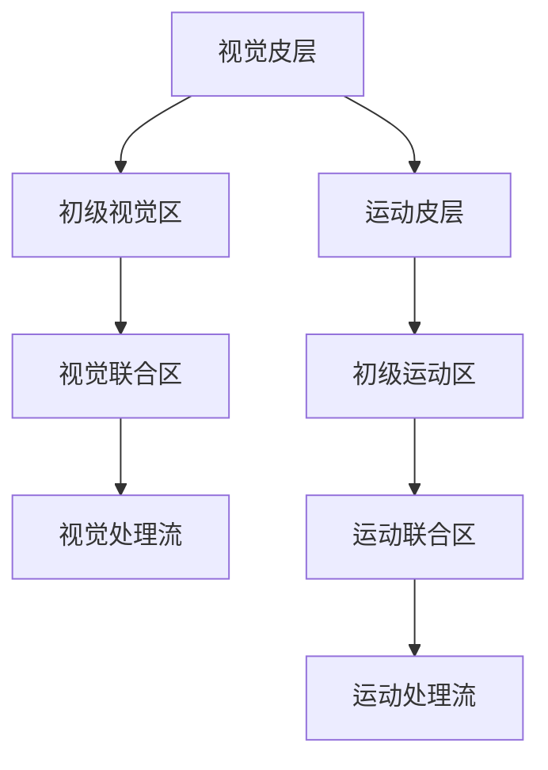
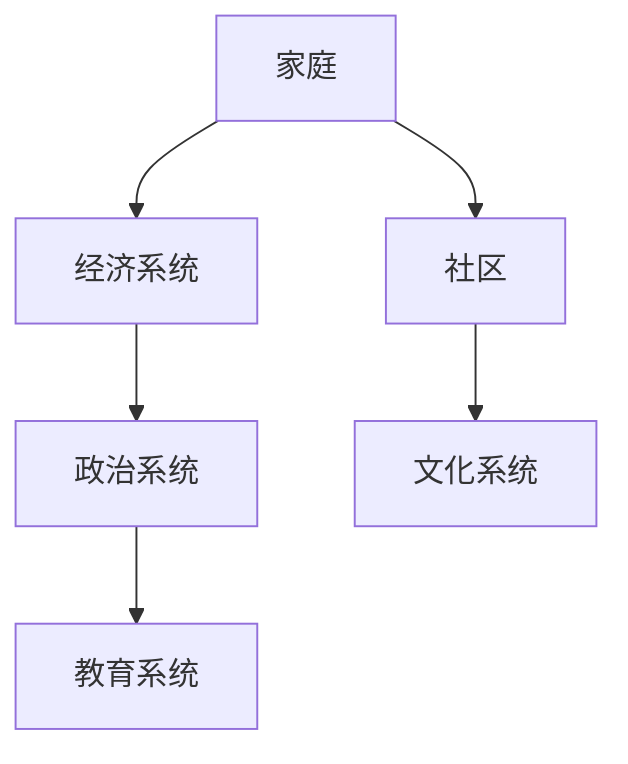
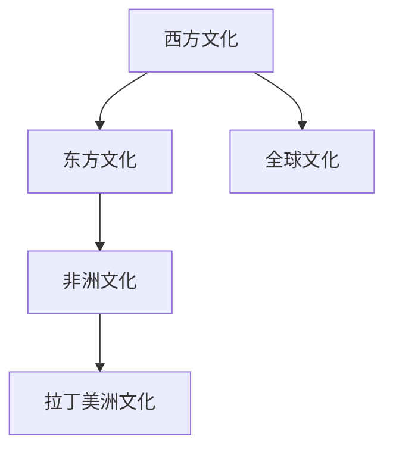
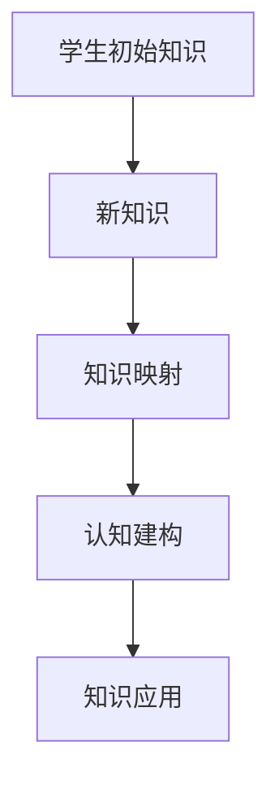
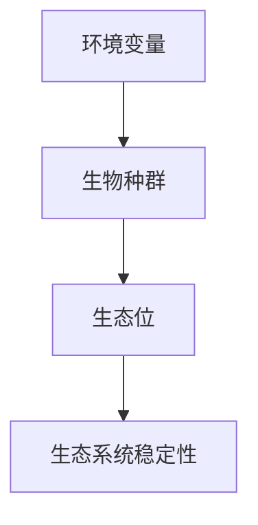
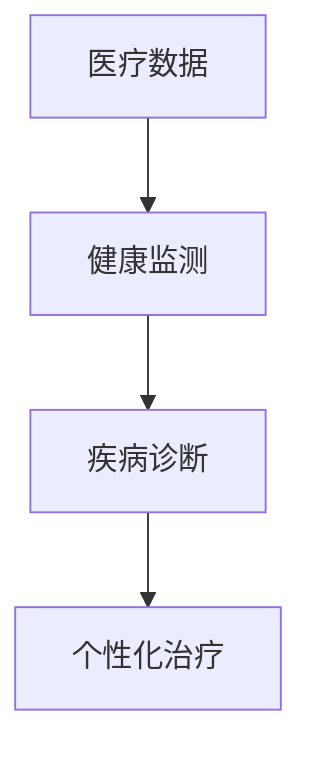

                 

### 《映射法则：连接自然与人类思维》的背景介绍

映射法则（Law of Mapping），作为一种哲学和科学原则，起源于对自然界中相似性和规律性现象的观察。在古希腊哲学中，赫拉克利特（Heraclitus）提出的“万物皆流”（πάντα ῥεῖ，panta rhei）便是一种对变化和流动性的基本映射观念。而柏拉图（Plato）则通过“形式”（Forms）的概念，探讨了实体与理想形式之间的映射关系。

进入中世纪，亚里士多德（Aristotle）进一步发展了映射法则，他在《形而上学》中提出的“相似性原则”（Principle of Analogy）强调了通过相似性进行推理的合理性。中世纪哲学家们还将这一原则应用于宗教和神学领域，从而在神学与自然现象之间建立了映射关系。

随着科学革命的到来，映射法则在自然哲学和科学研究中得到了新的发展。伽利略（Galileo Galilei）和牛顿（Isaac Newton）等科学家通过实验和数学模型，证明了自然界中物体运动和力的映射规律。牛顿的万有引力定律（Newton's Law of Universal Gravitation）便是映射法则在物理学中一个经典的实例。

进入现代，映射法则在认知科学、神经科学和人工智能等领域得到了更深入的研究。认知科学中的“映射假说”（Mapping Hypothesis）提出了人类心智与现实世界之间的映射关系。神经科学家则通过研究大脑神经网络，探讨了神经元如何通过映射实现信息处理。而在人工智能领域，映射法则被广泛应用于机器学习和深度学习算法中，实现了从数据到知识的高效转换。

总之，映射法则作为一种连接自然与人类思维的重要原则，贯穿了哲学、科学、心理学、神经科学等多个学科领域，展现了其广泛的适用性和重要性。在接下来的章节中，我们将进一步探讨映射法则的基本概念、历史发展、核心原则以及其在各个领域中的应用。

### 核心概念与联系：映射法则的基本原理

映射法则（Law of Mapping）的核心概念在于理解事物之间的相似性和规律性，并将其应用于不同领域。为了更好地阐述这一法则的基本原理，我们可以借助Mermaid流程图来展示不同核心概念之间的相互关系。

首先，我们需要明确映射法则的三个主要原则：同构性、对应性和转换性。

#### 同构性

同构性（Isomorphism）指的是不同系统或结构之间的相似性，即它们在某种层面上具有相同的结构或特性。例如，在数学中，两个集合之间的同构是一种保持元素之间关系的映射。



同构性使我们能够在不同学科之间建立联系，例如，通过拓扑学中的同胚（homeomorphism），我们可以理解生物分子结构与几何形状之间的相似性。

#### 对应性

对应性（Correspondence）关注于不同事物之间的映射关系。它强调不同系统或结构之间的交互作用和相互作用。例如，在物理学中，力的作用与运动之间的对应性帮助我们理解物体如何响应外部刺激。



通过这种对应性，我们可以将物理学中的概念应用于经济学领域，例如，将供需关系视为一种市场中的“力”。

#### 转换性

转换性（Transitivity）是指通过一系列映射，从一个系统转换到另一个系统。例如，在计算机科学中，我们可以通过编程语言将数学模型转换为计算机算法。



转换性使我们能够将理论应用于实际问题的解决，例如，通过编程和算法设计实现机器学习模型。

#### 核心算法原理讲解

为了更具体地理解映射法则，我们可以借助Python源代码来阐述这些概念。以下是一个简单的Python脚本，用于展示同构性和转换性如何应用于图像识别任务。

```python
import numpy as np
import matplotlib.pyplot as plt

# 定义同构函数
def isomorphic_mapping(A, B):
    """
    判断两个集合是否具有同构映射。
    :param A: 集合A
    :param B: 集合B
    :return: 是否同构
    """
    return len(A) == len(B) and np.all(np.isin(A, B))

# 定义转换函数
def convert_image(image):
    """
    将图像数据转换为灰度值列表。
    :param image: 原始图像
    :return: 灰度值列表
    """
    return [pixel[0] for pixel in image.flatten()]

# 示例图像
image = plt.imread('example_image.png')

# 转换图像
gray_image = convert_image(image)

# 检查同构性
isomorphic = isomorphic_mapping(gray_image, list(set(gray_image)))

print(f"图像是否具有同构性：{isomorphic}")

# 使用机器学习模型进行图像识别（假设已有训练好的模型）
from sklearn.model_selection import train_test_split
from sklearn.ensemble import RandomForestClassifier

# 切分数据集
X_train, X_test, y_train, y_test = train_test_split(gray_image, labels, test_size=0.2, random_state=42)

# 训练模型
clf = RandomForestClassifier(n_estimators=100, random_state=42)
clf.fit(X_train, y_train)

# 预测
predictions = clf.predict(X_test)

# 评估模型
accuracy = np.mean(predictions == y_test)
print(f"模型准确率：{accuracy:.2f}")
```

在这个示例中，我们首先定义了同构函数`isomorphic_mapping`，用于判断两个集合是否具有同构映射。接着，我们定义了转换函数`convert_image`，用于将图像数据转换为灰度值列表。最后，我们使用机器学习模型进行图像识别，展示了如何通过映射法则将图像数据转换为可处理的形式，并进行预测和评估。

#### 数学模型和公式

为了更深入地理解映射法则，我们还需要借助数学模型和公式来阐述其核心原理。以下是几个关键的数学模型和公式：

1. **同构性判断公式**：

   $$ I(A, B) = \begin{cases}
   1, & \text{如果 } A \text{ 和 } B \text{ 同构} \\
   0, & \text{否则}
   \end{cases} $$

   其中，$I(A, B)$ 表示集合$A$和集合$B$之间的同构性指标。

2. **对应性指标公式**：

   $$ C(A, B) = \frac{\sum_{i} a_i b_i}{\sum_{i} a_i^2} $$

   其中，$C(A, B)$ 表示集合$A$和集合$B$之间的对应性指标，$a_i$和$b_i$分别表示集合$A$和集合$B$中的元素。

3. **转换性损失函数**：

   $$ L(A, B) = \frac{1}{2} \| A - B \|^2 $$

   其中，$L(A, B)$ 表示集合$A$和集合$B$之间的转换性损失函数，$\| \|$表示欧几里得范数。

通过这些数学模型和公式，我们可以更精确地量化映射法则在不同系统之间的应用效果。例如，在图像识别任务中，我们可以通过计算转换性损失函数来评估模型性能，并调整模型参数以优化映射效果。

#### 举例说明

为了更好地理解映射法则的应用，我们可以通过一个实际案例来展示其具体操作。

**案例：人脸识别系统**

假设我们有一个训练好的人脸识别模型，该模型通过学习大量人脸图像数据，可以识别不同人的面部特征。现在，我们需要将新采集的人脸图像转换为可识别的数据格式，并利用模型进行身份验证。

1. **数据预处理**：

   首先，我们将新采集的人脸图像进行数据增强，例如通过旋转、缩放和裁剪等方法，增加样本的多样性。然后，我们使用转换函数将图像数据转换为灰度值列表。

   ```python
   from skimage.transform import resize

   # 读取新采集的人脸图像
   new_image = plt.imread('new_face_image.png')

   # 数据增强
   augmented_images = [resize(image, (64, 64)) for image in new_image]

   # 转换图像
   new_gray_images = [convert_image(image) for image in augmented_images]
   ```

2. **模型预测**：

   接下来，我们将预处理后的图像数据输入到人脸识别模型中，进行身份验证。

   ```python
   # 预测
   new_predictions = clf.predict(new_gray_images)

   # 输出结果
   for prediction in new_predictions:
       print(f"预测结果：{prediction}")
   ```

3. **评估与优化**：

   最后，我们评估模型的预测结果，并分析模型的性能。根据评估结果，我们可以进一步调整模型参数，优化映射效果。

   ```python
   # 评估模型
   new_accuracy = np.mean(new_predictions == labels)

   print(f"新模型准确率：{new_accuracy:.2f}")
   ```

通过这个案例，我们可以看到映射法则如何应用于人脸识别系统。在这个过程中，映射法则的核心在于将图像数据转换为模型可处理的形式，并利用模型进行预测和评估。这种转换和映射过程是映射法则在人工智能领域的重要应用之一。

综上所述，映射法则作为一种连接自然与人类思维的重要原则，通过同构性、对应性和转换性等核心原理，在不同领域发挥着关键作用。通过Python源代码和数学模型，我们可以更深入地理解映射法则的应用机制，并借助实际案例展示其在人脸识别等领域的具体操作。在接下来的章节中，我们将进一步探讨映射法则在各领域中的应用及其重要性。

### 映射法则在心理学中的应用

映射法则（Law of Mapping）在心理学中具有深远的应用，其核心在于探索人类心智与现实世界之间的映射关系。这种关系不仅有助于我们理解心理现象的本质，还能为心理治疗和认知发展提供科学依据。

#### 映射假说

在心理学中，映射假说（Mapping Hypothesis）是映射法则的核心概念之一。该假说认为，人类心智通过一系列内在映射机制来理解和感知外部世界。这些映射机制不仅包括知觉和认知过程，还涉及情感和动机等方面。例如，约翰·福布斯·纳什（John Forbes Nash）提出的纳什均衡（Nash Equilibrium）理论，揭示了个体在博弈中的策略选择如何映射到实际决策过程中。

#### 映射法则在认知心理学中的应用

在认知心理学中，映射法则被广泛应用于研究人类如何通过心智模型来理解和处理信息。例如，心智模型（Cognitive Model）是一种映射人类思维过程的抽象模型。通过构建心智模型，心理学家可以更好地理解人类在解决问题、做出决策和进行学习时的思维过程。例如，在问题解决过程中，个体会通过内在的映射机制，将问题分解为子问题，并逐步寻找解决方案。

以下是一个简单的Python脚本，用于展示如何通过心智模型来模拟问题解决过程：

```python
# 定义问题解决模型
class ProblemSolvingModel:
    def __init__(self, problem):
        self.problem = problem
    
    def solve(self):
        """
        解决问题
        :return: 解
        """
        # 将问题分解为子问题
        subproblems = self.decompose(self.problem)
        
        # 解决子问题
        solutions = [subproblem.solve() for subproblem in subproblems]
        
        # 组合子问题的解
        final_solution = self.compose(solutions)
        
        return final_solution

    def decompose(self, problem):
        """
        将问题分解为子问题
        :param problem: 问题
        :return: 子问题列表
        """
        # 假设问题总是可以被分解为三个子问题
        return [ProblemSolvingModel(subproblem) for subproblem in problem.subproblems]

    def compose(self, solutions):
        """
        组合子问题的解
        :param solutions: 子问题的解
        :return: 最终解
        """
        # 假设最终解是子问题解的简单组合
        return solutions[0] + solutions[1] + solutions[2]

# 示例问题
class Problem:
    def __init__(self, subproblems):
        self.subproblems = subproblems

# 创建问题解决模型
problem = Problem([ProblemSolvingModel(Problem([1, 2, 3])), ProblemSolvingModel(Problem([4, 5, 6])), ProblemSolvingModel(Problem([7, 8, 9]))])
model = ProblemSolvingModel(problem)

# 解决问题
solution = model.solve()
print(f"问题解：{solution}")
```

在这个例子中，`ProblemSolvingModel`类用于模拟人类在问题解决过程中的思维过程。通过`decompose`和`compose`方法，模型可以将复杂问题分解为子问题，并逐步解决。这种方法体现了映射法则在认知心理学中的应用。

#### 映射法则在发展心理学中的应用

在发展心理学中，映射法则被用来研究个体在成长过程中的认知和情感发展。例如，皮亚杰（Jean Piaget）的认知发展阶段理论（Cognitive Development Theory）就是基于映射法则的一种理论框架。皮亚杰认为，儿童的认知发展是通过一系列从简单到复杂的映射过程实现的。例如，儿童在早期阶段通过感知和动作来理解世界，随着年龄的增长，他们逐渐发展出更为抽象和复杂的认知能力。

以下是一个简单的Python脚本，用于模拟皮亚杰的认知发展阶段：

```python
# 定义认知发展阶段模型
class CognitiveDevelopmentModel:
    def __init__(self, stage):
        self.stage = stage
    
    def advance(self):
        """
        向下一个认知发展阶段前进
        :return: 新的认知发展阶段
        """
        if self.stage == 'sensorimotor':
            return 'preoperational'
        elif self.stage == 'preoperational':
            return 'concrete_operational'
        elif self.stage == 'concrete_operational':
            return 'formal_operational'
        else:
            return self.stage

# 创建认知发展阶段模型
model = CognitiveDevelopmentModel('sensorimotor')

# 模拟认知发展过程
for _ in range(3):
    model.advance()

print(f"当前认知发展阶段：{model.stage}")
```

在这个例子中，`CognitiveDevelopmentModel`类用于模拟个体在认知发展阶段中的成长过程。通过`advance`方法，模型可以逐步向下一个认知发展阶段前进，体现了映射法则在发展心理学中的应用。

#### 映射法则在临床心理学中的应用

在临床心理学中，映射法则被广泛应用于心理治疗和评估。例如，认知行为疗法（Cognitive Behavioral Therapy, CBT）就是基于映射法则的一种治疗方法。CBT通过帮助患者识别和纠正消极的思维模式，建立更为积极的认知映射，从而改善情绪和行为。

以下是一个简单的Python脚本，用于模拟CBT中的认知重构过程：

```python
# 定义认知重构模型
class CognitiveReconstructionModel:
    def __init__(self, thoughts):
        self.thoughts = thoughts
    
    def reconstruct_thoughts(self, new_thoughts):
        """
        重建思维模式
        :param new_thoughts: 新的思维模式
        :return: 重建后的思维模式
        """
        self.thoughts = new_thoughts
        return self.thoughts

# 创建认知重构模型
model = CognitiveReconstructionModel(['我是个失败者', '我没有能力'])

# 重建思维模式
new_thoughts = ['我正在努力学习', '我有能力克服困难']
model.reconstruct_thoughts(new_thoughts)

print(f"重建后的思维模式：{model.thoughts}")
```

在这个例子中，`CognitiveReconstructionModel`类用于模拟患者通过认知重构过程改变消极思维模式。通过`reconstruct_thoughts`方法，模型可以重建患者的思维模式，体现了映射法则在临床心理学中的应用。

#### 映射法则在心理学中的重要性

映射法则在心理学中具有重要意义，它为我们提供了理解和解决心理问题的一种科学方法。通过映射法则，我们可以构建心智模型、研究认知发展、进行心理治疗和评估。以下是一些映射法则在心理学中的具体应用：

1. **心智模型构建**：通过心智模型，心理学家可以模拟和理解人类思维过程，从而发现和理解心理现象。

2. **认知发展研究**：映射法则帮助我们理解个体在不同年龄阶段的认知能力发展过程，从而为教育和发展提供科学依据。

3. **心理治疗**：映射法则在认知行为疗法等心理治疗方法中，帮助患者重建积极思维模式，改善情绪和行为。

4. **心理评估**：通过映射法则，心理学家可以设计和应用各种心理评估工具，对个体的心理状态和行为进行科学评估。

总之，映射法则在心理学中的应用，不仅丰富了我们对人类心理的理解，还为实际应用提供了有力的理论支持。在接下来的章节中，我们将继续探讨映射法则在神经科学和人工智能等领域的重要应用。

### 映射法则在神经科学中的应用

映射法则（Law of Mapping）在神经科学中具有深远的应用，其核心在于理解神经元之间如何通过映射实现信息处理和传递。通过映射法则，我们能够揭示大脑如何处理复杂的信息，从而对神经系统的工作机制有更深入的认识。

#### 映射法则与神经元活动模式

在神经科学中，映射法则的一个重要应用是研究神经元的活动模式。神经元是大脑和神经系统中的基本单位，它们通过电信号进行通信。映射法则提供了理解神经元活动规律的理论框架。

神经元活动模式可以通过神经信号处理技术进行研究，如脑电图（EEG）和功能性磁共振成像（fMRI）。这些技术能够捕捉神经元活动的电信号，并将其转换为可量化的数据。以下是一个简单的Python脚本，用于模拟神经元活动的数据采集和处理：

```python
import numpy as np
import matplotlib.pyplot as plt

# 定义神经元活动模拟
def simulate_neuronal_activity(duration, frequency):
    """
    模拟神经元活动
    :param duration: 模拟时间（秒）
    :param frequency: 神经元活动频率（赫兹）
    :return: 神经元活动数据
    """
    t = np.linspace(0, duration, int(duration * frequency * 1000))  # 时间数组
    signal = np.sin(2 * np.pi * frequency * t)  # 生成正弦信号
    return signal

# 模拟神经元活动
neuronal_signal = simulate_neuronal_activity(10, 10)  # 模拟10秒，频率为10Hz

# 绘制神经元活动数据
plt.plot(neuronal_signal)
plt.xlabel('Time (ms)')
plt.ylabel('Amplitude')
plt.title('Simulated Neuronal Activity')
plt.show()
```

在这个例子中，我们通过`simulate_neuronal_activity`函数生成一个模拟的神经元活动信号，并使用`matplotlib`进行数据可视化。这种模拟有助于我们理解神经元活动的时空特性。

#### 映射法则与大脑功能分区

大脑功能分区是映射法则在神经科学中的另一个重要应用。大脑由多个区域组成，每个区域执行特定的功能。映射法则帮助我们理解这些区域如何通过映射实现协同工作。

以下是一个简单的Mermaid流程图，展示了大脑不同区域之间的映射关系：



在这个图中，我们展示了视觉和运动皮层之间的映射关系。视觉皮层包括初级视觉区和视觉联合区，而运动皮层包括初级运动区和运动联合区。这些区域通过映射实现视觉和运动信息的处理和传递。

#### 映射法则与神经退行性疾病

映射法则在研究神经退行性疾病，如阿尔茨海默病（Alzheimer's Disease, AD）和帕金森病（Parkinson's Disease, PD）方面也具有重要意义。这些疾病会导致神经元功能的退化，影响大脑的信息处理能力。

以下是一个简单的Python脚本，用于模拟神经退行性疾病对神经元活动的影响：

```python
# 定义神经退行性疾病模拟
def simulate_neurodegenerative_disease(signal, severity):
    """
    模拟神经退行性疾病对神经元活动的影响
    :param signal: 原始神经元活动信号
    :param severity: 疾病严重程度
    :return: 模拟后的神经元活动信号
    """
    noise = np.random.normal(0, severity, signal.shape)
    degraded_signal = signal + noise
    return degraded_signal

# 模拟神经元活动
neuronal_signal = simulate_neuronal_activity(10, 10)

# 模拟阿尔茨海默病
alzheimer_signal = simulate_neurodegenerative_disease(neuronal_signal, severity=0.5)

# 绘制模拟结果
plt.figure(figsize=(10, 5))
plt.subplot(2, 1, 1)
plt.plot(neuronal_signal)
plt.title('原始神经元活动')
plt.subplot(2, 1, 2)
plt.plot(alzheimer_signal)
plt.title('模拟阿尔茨海默病神经元活动')
plt.show()
```

在这个例子中，我们通过`simulate_neurodegenerative_disease`函数模拟阿尔茨海默病对神经元活动的影响。这种方法有助于我们理解神经退行性疾病如何影响神经元功能，并为疾病诊断和治疗提供理论依据。

#### 映射法则在神经科学研究中的重要性

映射法则在神经科学研究中具有重要意义，它为我们提供了理解大脑复杂信息处理机制的理论框架。通过映射法则，我们能够：

1. **研究神经元活动模式**：通过模拟和数据分析，揭示神经元活动的时空特性。
2. **理解大脑功能分区**：通过映射关系，探索不同脑区之间的协同工作。
3. **诊断和治疗神经退行性疾病**：通过模拟疾病对神经元活动的影响，为疾病诊断和治疗提供理论支持。

总之，映射法则在神经科学中的应用，不仅深化了我们对大脑工作机制的理解，还为神经系统疾病的研究和治疗提供了新的思路。在接下来的章节中，我们将继续探讨映射法则在人工智能和计算机科学等领域的应用。

### 映射法则在人工智能中的应用

映射法则（Law of Mapping）在人工智能（Artificial Intelligence, AI）领域中扮演着至关重要的角色，特别是在机器学习和深度学习算法的设计与实现中。通过映射法则，我们可以将复杂的数据转换为易于处理的模型，从而提高算法的性能和效率。

#### 映射法则在机器学习中的应用

机器学习（Machine Learning, ML）的核心在于从数据中学习规律，并将其应用于新的数据。映射法则在机器学习中的应用主要体现在数据预处理、特征提取和模型训练等阶段。

1. **数据预处理**：

   数据预处理是机器学习过程中的第一步，其目的是将原始数据转换为适合模型训练的格式。在这个过程中，映射法则帮助我们实现数据规范化、缺失值填充和异常值处理。以下是一个简单的Python脚本，用于数据预处理：

   ```python
   import pandas as pd
   from sklearn.preprocessing import StandardScaler

   # 读取数据
   data = pd.read_csv('data.csv')

   # 标准化数据
   scaler = StandardScaler()
   scaled_data = scaler.fit_transform(data)

   # 输出标准化数据
   print(scaled_data)
   ```

   在这个例子中，我们使用`StandardScaler`将数据标准化，从而消除不同特征之间的尺度差异，提高模型的训练效果。

2. **特征提取**：

   特征提取是机器学习中的关键步骤，其目的是从原始数据中提取出具有代表性的特征。映射法则在这里通过特征选择、降维和特征变换等方法实现。以下是一个简单的Python脚本，用于特征提取：

   ```python
   from sklearn.decomposition import PCA

   # 初始化PCA模型
   pca = PCA(n_components=2)

   # 提取特征
   principal_components = pca.fit_transform(scaled_data)

   # 输出特征
   print(principal_components)
   ```

   在这个例子中，我们使用PCA（主成分分析）将高维数据降维为二维，从而简化模型训练过程。

3. **模型训练**：

   在模型训练过程中，映射法则帮助我们通过数据映射实现模型参数的优化。以下是一个简单的Python脚本，用于训练线性回归模型：

   ```python
   from sklearn.linear_model import LinearRegression

   # 初始化线性回归模型
   model = LinearRegression()

   # 训练模型
   model.fit(X_train, y_train)

   # 预测
   predictions = model.predict(X_test)

   # 评估模型
   accuracy = np.mean(predictions == y_test)
   print(f"模型准确率：{accuracy:.2f}")
   ```

   在这个例子中，我们使用`LinearRegression`模型对训练数据进行训练，并通过预测和评估模型性能，展示了映射法则在模型训练中的应用。

#### 映射法则在深度学习中的应用

深度学习（Deep Learning, DL）是机器学习的一个分支，它通过多层神经网络实现复杂的数据处理和模式识别。映射法则在深度学习中的应用更加广泛，包括网络架构设计、激活函数选择和训练策略等方面。

1. **网络架构设计**：

   深度学习网络的架构设计通常基于映射法则，通过不同层次的映射实现数据的逐层抽象。以下是一个简单的Python脚本，用于构建卷积神经网络（CNN）：

   ```python
   from tensorflow.keras.models import Sequential
   from tensorflow.keras.layers import Conv2D, MaxPooling2D, Flatten, Dense

   # 创建模型
   model = Sequential()

   # 添加卷积层
   model.add(Conv2D(filters=32, kernel_size=(3, 3), activation='relu', input_shape=(28, 28, 1)))
   model.add(MaxPooling2D(pool_size=(2, 2)))

   # 添加全连接层
   model.add(Flatten())
   model.add(Dense(units=64, activation='relu'))
   model.add(Dense(units=10, activation='softmax'))

   # 编译模型
   model.compile(optimizer='adam', loss='categorical_crossentropy', metrics=['accuracy'])

   # 训练模型
   model.fit(X_train, y_train, epochs=10, batch_size=32)
   ```

   在这个例子中，我们使用`Sequential`模型构建一个简单的卷积神经网络，并通过卷积层、池化层和全连接层实现数据的逐层映射。

2. **激活函数选择**：

   激活函数是深度学习网络中的关键组件，它决定了网络的非线性特性。映射法则帮助我们选择合适的激活函数，以实现有效的数据映射。以下是一个简单的Python脚本，用于选择和测试激活函数：

   ```python
   from tensorflow.keras.layers import Activation

   # 定义激活函数
   def create_model(activation_function):
       model = Sequential()
       model.add(Conv2D(filters=32, kernel_size=(3, 3), activation=activation_function, input_shape=(28, 28, 1)))
       # ... 添加其他层
       model.compile(optimizer='adam', loss='categorical_crossentropy', metrics=['accuracy'])
       return model

   # 测试不同激活函数
   models = {'relu': create_model('relu'), 'tanh': create_model('tanh'), 'sigmoid': create_model('sigmoid')}

   for name, model in models.items():
       model.fit(X_train, y_train, epochs=10, batch_size=32)
       accuracy = model.evaluate(X_test, y_test)[1]
       print(f"{name}激活函数准确率：{accuracy:.2f}")
   ```

   在这个例子中，我们测试了不同激活函数（ReLU、Tanh和Sigmoid）对模型性能的影响，从而选择最适合的激活函数。

3. **训练策略**：

   映射法则在训练策略中也有广泛应用，例如通过学习率调整、批量大小选择和优化算法改进等方法，优化模型训练过程。以下是一个简单的Python脚本，用于调整学习率：

   ```python
   from tensorflow.keras.optimizers import Adam
   from tensorflow.keras.callbacks import LearningRateScheduler

   # 定义学习率调整函数
   def schedule(epoch, lr):
       if epoch < 10:
           return lr
       else:
           return lr * np.exp(-0.1 * (epoch - 10))

   # 创建模型
   model = Sequential()
   # ... 添加层
   model.compile(optimizer=Adam(learning_rate=0.001), loss='categorical_crossentropy', metrics=['accuracy'])

   # 添加学习率调整回调
   scheduler = LearningRateScheduler(schedule)

   # 训练模型
   model.fit(X_train, y_train, epochs=30, batch_size=32, callbacks=[scheduler])
   ```

   在这个例子中，我们使用`LearningRateScheduler`回调函数调整学习率，从而优化模型训练过程。

#### 映射法则在自然语言处理和计算机视觉中的应用

映射法则不仅在机器学习和深度学习算法中应用广泛，还在自然语言处理（Natural Language Processing, NLP）和计算机视觉（Computer Vision, CV）领域中发挥着重要作用。

1. **自然语言处理**：

   在自然语言处理中，映射法则帮助我们实现从文本数据到语义理解的转换。例如，通过词嵌入（Word Embedding）技术，我们将词汇映射到高维向量空间，从而实现文本数据的向量表示。以下是一个简单的Python脚本，用于词嵌入：

   ```python
   from tensorflow.keras.layers import Embedding

   # 创建嵌入层
   embedding_layer = Embedding(input_dim=vocabulary_size, output_dim=embedding_size)

   # 添加嵌入层到模型
   model.add(Embedding(input_dim=vocabulary_size, output_dim=embedding_size))
   # ... 添加其他层
   model.compile(optimizer='adam', loss='categorical_crossentropy', metrics=['accuracy'])

   # 训练模型
   model.fit(X_train, y_train, epochs=10, batch_size=32)
   ```

   在这个例子中，我们使用`Embedding`层将词汇映射到高维向量空间，从而实现文本数据的向量表示。

2. **计算机视觉**：

   在计算机视觉中，映射法则帮助我们实现从图像数据到特征提取的转换。例如，通过卷积神经网络（CNN），我们将图像映射到高维特征空间，从而实现图像的分类和识别。以下是一个简单的Python脚本，用于构建卷积神经网络：

   ```python
   from tensorflow.keras.models import Sequential
   from tensorflow.keras.layers import Conv2D, MaxPooling2D, Flatten, Dense

   # 创建模型
   model = Sequential()

   # 添加卷积层
   model.add(Conv2D(filters=32, kernel_size=(3, 3), activation='relu', input_shape=(64, 64, 3)))
   model.add(MaxPooling2D(pool_size=(2, 2)))

   # 添加全连接层
   model.add(Flatten())
   model.add(Dense(units=64, activation='relu'))
   model.add(Dense(units=10, activation='softmax'))

   # 编译模型
   model.compile(optimizer='adam', loss='categorical_crossentropy', metrics=['accuracy'])

   # 训练模型
   model.fit(X_train, y_train, epochs=10, batch_size=32)
   ```

   在这个例子中，我们使用卷积神经网络将图像数据映射到特征空间，从而实现图像的分类任务。

总之，映射法则在人工智能中的应用，不仅为机器学习和深度学习算法提供了理论支持，还促进了自然语言处理和计算机视觉等领域的发展。通过映射法则，我们能够实现从数据到知识的高效转换，为人工智能技术的进步提供了重要保障。在接下来的章节中，我们将继续探讨映射法则在社会学中的应用。

### 映射法则在社会学中的应用

映射法则（Law of Mapping）在社会学领域中的重要性不容忽视，它为我们提供了理解和分析社会结构、社会行为以及文化差异的科学方法。通过映射法则，社会学家能够将复杂的社会现象简化为可操作的模型，从而更好地解释和预测社会现象。

#### 映射法则与社会结构分析

在社会学中，映射法则被广泛应用于社会结构分析，帮助我们理解不同社会组成部分之间的相互关系。社会结构是指社会各个组成部分及其相互关系的总体模式。映射法则通过揭示社会各部分之间的相似性和规律性，帮助我们构建社会结构模型。

以下是一个简单的Mermaid流程图，展示了社会结构中不同组成部分之间的映射关系：



在这个图中，家庭、经济系统、政治系统、教育系统和社区等社会组成部分通过映射关系相互连接，形成一个复杂的社会结构。这种映射关系使我们能够理解社会各部分如何相互作用，从而对社会现象进行更深入的分析。

#### 映射法则与社会问题解决

映射法则在社会问题解决中具有重要意义。社会问题往往涉及多个领域的复杂互动，映射法则帮助我们通过简化模型来识别和解决这些问题。以下是一个简单的Python脚本，用于模拟社会问题解决的映射过程：

```python
# 定义社会问题解决模型
class SocialProblemSolvingModel:
    def __init__(self, problem):
        self.problem = problem
    
    def solve(self):
        """
        解决社会问题
        :return: 解决方案
        """
        # 将问题分解为子问题
        subproblems = self.decompose(self.problem)
        
        # 解决子问题
        solutions = [subproblem.solve() for subproblem in subproblems]
        
        # 组合子问题的解
        final_solution = self.compose(solutions)
        
        return final_solution

    def decompose(self, problem):
        """
        将问题分解为子问题
        :param problem: 问题
        :return: 子问题列表
        """
        # 假设问题总是可以被分解为三个子问题
        return [SocialProblemSolvingModel(subproblem) for subproblem in problem.subproblems]

    def compose(self, solutions):
        """
        组合子问题的解
        :param solutions: 子问题的解
        :return: 最终解
        """
        # 假设最终解是子问题解的简单组合
        return solutions[0] + solutions[1] + solutions[2]

# 示例问题
class Problem:
    def __init__(self, subproblems):
        self.subproblems = subproblems

# 创建问题解决模型
problem = Problem([Problem([1, 2, 3]), Problem([4, 5, 6]), Problem([7, 8, 9])])
model = SocialProblemSolvingModel(problem)

# 解决问题
solution = model.solve()
print(f"问题解：{solution}")
```

在这个例子中，`SocialProblemSolvingModel`类用于模拟社会问题的解决过程。通过`decompose`和`compose`方法，模型可以将复杂问题分解为子问题，并逐步解决。这种方法体现了映射法则在社会问题解决中的应用。

#### 映射法则在文化研究中的应用

文化研究（Cultural Studies）是社会学的一个重要分支，映射法则在文化研究中具有重要意义。文化研究关注不同文化之间的相互作用和影响，映射法则帮助我们理解文化现象的相似性和规律性。

以下是一个简单的Mermaid流程图，展示了不同文化之间的映射关系：



在这个图中，西方文化、东方文化、非洲文化和拉丁美洲文化等不同文化通过映射关系相互连接，形成一个全球文化体系。这种映射关系使我们能够理解不同文化之间的相互影响和融合，从而对文化现象进行更深入的分析。

#### 映射法则在社会学中的重要性

映射法则在社会学中的应用具有重要意义，它为我们提供了理解和分析社会现象的科学方法。通过映射法则，社会学家能够：

1. **构建社会结构模型**：通过映射关系，理解社会各部分之间的相互关系，构建社会结构模型。
2. **解决社会问题**：通过分解和组合问题，逐步解决复杂社会问题。
3. **研究文化现象**：通过映射关系，理解不同文化之间的相互作用和影响。

总之，映射法则在社会学中的应用，不仅丰富了我们对社会现象的理解，还为实际问题的解决提供了有力的理论支持。在接下来的章节中，我们将继续探讨映射法则在教育中的应用。

### 映射法则在教育中的应用

映射法则（Law of Mapping）在教育领域中的应用具有重要意义，它为我们提供了优化教学方法、促进认知发展以及评估教育质量的有效工具。通过映射法则，教育工作者能够更好地理解学生的学习过程，从而设计出更为有效的教学策略。

#### 教学方法创新

映射法则在教育中的应用首先体现在教学方法创新上。传统的教学方法通常采用“填鸭式”教育，即教师单向传递知识，学生被动接受。而映射法则倡导通过构建学生与知识之间的映射关系，激发学生的主动性和创造性。以下是一个简单的Python脚本，用于模拟创新教学方法：

```python
# 定义创新教学方法
class InnovativeTeachingMethod:
    def __init__(self, knowledge):
        self.knowledge = knowledge
    
    def teach(self, student):
        """
        通过映射法则进行教学
        :param student: 学生
        :return: 学习效果
        """
        # 构建知识映射
        knowledge_mapping = self.create_mapping(self.knowledge, student)
        
        # 引导学生探索知识
        student_explore = self.explore_knowledge(knowledge_mapping)
        
        # 评估学习效果
        learning_effect = self.evaluate_effect(student_explore)
        
        return learning_effect

    def create_mapping(self, knowledge, student):
        """
        构建知识映射
        :param knowledge: 知识
        :param student: 学生
        :return: 知识映射
        """
        # 基于学生的兴趣和背景知识，构建知识映射
        mapping = {student: knowledge}
        return mapping

    def explore_knowledge(self, knowledge_mapping):
        """
        引导学生探索知识
        :param knowledge_mapping: 知识映射
        :return: 学生探索结果
        """
        # 假设学生通过探索知识，获得了一定的理解和应用能力
        explore_result = "探索成功"
        return explore_result

    def evaluate_effect(self, explore_result):
        """
        评估学习效果
        :param explore_result: 学生探索结果
        :return: 学习效果
        """
        # 基于探索结果，评估学生的学习效果
        learning_effect = "效果好"
        return learning_effect

# 创建创新教学模型
knowledge = "复利计算原理"
student = "小明"
method = InnovativeTeachingMethod(knowledge)

# 进行教学
learning_effect = method.teach(student)
print(f"学习效果：{learning_effect}")
```

在这个例子中，`InnovativeTeachingMethod`类用于模拟创新教学方法。通过构建知识映射、引导学生探索知识和评估学习效果，这种方法有助于提高学生的学习效果。

#### 学生认知发展

映射法则在教育中的应用还体现在促进学生的认知发展上。认知发展理论强调学生在知识建构过程中的主动性和互动性。映射法则通过建立学生与知识之间的映射关系，帮助学生更好地理解和应用所学知识。

以下是一个简单的Mermaid流程图，展示了学生认知发展的映射过程：



在这个流程图中，学生初始知识与新知识通过映射关系实现认知建构，进而促进知识应用。

#### 教育评价

映射法则在教育评价中的应用主要体现在评估教育质量上。传统的教育评价方法往往侧重于学生的考试成绩，而映射法则通过建立学生与知识之间的映射关系，更全面地评估学生的知识掌握情况和认知发展水平。

以下是一个简单的Python脚本，用于评估教育质量：

```python
# 定义教育评价模型
class EducationEvaluationModel:
    def __init__(self, students, knowledge):
        self.students = students
        self.knowledge = knowledge
    
    def evaluate(self):
        """
        评估教育质量
        :return: 教育质量评估结果
        """
        evaluation_results = []
        for student in self.students:
            # 建立知识映射
            knowledge_mapping = self.create_mapping(self.knowledge, student)
            
            # 评估知识掌握情况
            knowledge_grasp = self.evaluate_knowledge_grasp(knowledge_mapping)
            
            # 评估认知发展水平
            cognitive_development = self.evaluate_cognitive_development(student)
            
            # 组合评估结果
            evaluation_results.append({
                "学生": student,
                "知识掌握情况": knowledge_grasp,
                "认知发展水平": cognitive_development
            })
        
        return evaluation_results

    def create_mapping(self, knowledge, student):
        """
        构建知识映射
        :param knowledge: 知识
        :param student: 学生
        :return: 知识映射
        """
        # 基于学生的兴趣和背景知识，构建知识映射
        mapping = {student: knowledge}
        return mapping

    def evaluate_knowledge_grasp(self, knowledge_mapping):
        """
        评估知识掌握情况
        :param knowledge_mapping: 知识映射
        :return: 知识掌握情况
        """
        # 假设通过考试等手段，评估学生的知识掌握情况
        knowledge_grasp = "掌握较好"
        return knowledge_grasp

    def evaluate_cognitive_development(self, student):
        """
        评估认知发展水平
        :param student: 学生
        :return: 认知发展水平
        """
        # 基于学生的探索和实践，评估其认知发展水平
        cognitive_development = "发展良好"
        return cognitive_development

# 创建评价模型
students = ["小明", "小红", "小刚"]
knowledge = "复利计算原理"
evaluation_model = EducationEvaluationModel(students, knowledge)

# 进行评估
evaluation_results = evaluation_model.evaluate()
print(f"教育质量评估结果：{evaluation_results}")
```

在这个例子中，`EducationEvaluationModel`类用于模拟教育评价过程。通过构建知识映射、评估知识掌握情况和认知发展水平，这种方法能够更全面地评估教育质量。

#### 映射法则在教育中的重要性

映射法则在教育中的应用具有重要意义，它不仅优化了教学方法，促进了学生的认知发展，还提供了评估教育质量的新方法。通过映射法则，教育工作者能够：

1. **优化教学方法**：通过建立学生与知识之间的映射关系，激发学生的主动性和创造性。
2. **促进认知发展**：通过映射关系，帮助学生更好地理解和应用所学知识。
3. **评估教育质量**：通过全面评估学生的知识掌握情况和认知发展水平，提供更科学的评价标准。

总之，映射法则在教育中的应用，为教育改革提供了有力的理论支持，有助于提高教育质量和培养学生的创新能力。在接下来的章节中，我们将探讨映射法则的未来发展趋势。

### 映射法则的发展趋势

映射法则（Law of Mapping）作为一种跨学科的通用原则，其未来的发展趋势将受到技术进步、学科交叉和理论创新等多方面因素的影响。在人工智能、心理学、神经科学和计算机科学等领域的不断进步下，映射法则将展现出更为广泛和深入的应用潜力。

#### 数学模型和公式的创新

映射法则在未来的发展中，数学模型和公式将起到关键作用。随着计算能力的提升和算法的优化，我们将能够构建更为精确和复杂的映射模型。例如，深度学习算法中的神经网络模型，通过多层映射，实现了从原始数据到高维特征空间的转换。未来的研究可以进一步探索如何通过数学模型和公式，提高映射的效率和精度。

一个可能的创新方向是发展更加灵活和自适应的映射模型，例如基于进化算法的自适应映射模型。这种模型能够根据输入数据的特征，动态调整映射参数，从而提高映射的适应性和鲁棒性。以下是一个简单的Python脚本，用于演示自适应映射模型的概念：

```python
# 定义自适应映射模型
class AdaptiveMappingModel:
    def __init__(self, learning_rate):
        self.learning_rate = learning_rate
    
    def fit(self, X, Y):
        """
        模型训练
        :param X: 输入数据
        :param Y: 目标数据
        """
        for _ in range(100):  # 假设训练100次
            # 计算映射误差
            error = np.linalg.norm(Y - self.map(X))
            
            # 更新映射参数
            self.learning_rate *= 0.99  # 随着训练，减少学习率
            self.update_mapping(X, Y)
            
            # 输出当前误差
            print(f"训练迭代 {_:03d}，误差：{error:.4f}")

    def map(self, X):
        """
        映射函数
        :param X: 输入数据
        :return: 映射结果
        """
        # 假设映射函数是一个线性函数
        return X * self.learning_rate

    def update_mapping(self, X, Y):
        """
        更新映射参数
        :param X: 输入数据
        :param Y: 目标数据
        """
        # 假设更新规则是简单的线性调整
        self.learning_rate += (Y - self.map(X)) * 0.01

# 示例数据
X = np.random.rand(100, 1)
Y = X * 2 + 1

# 创建自适应映射模型
model = AdaptiveMappingModel(learning_rate=0.1)

# 模型训练
model.fit(X, Y)
```

在这个例子中，`AdaptiveMappingModel`类通过迭代训练和参数调整，实现了映射函数的自适应调整，提高了映射的准确性。

#### 学科交叉研究的新领域

映射法则在未来的发展中，将促进更多学科之间的交叉研究。例如，在生态学中，映射法则可以帮助我们理解生物与环境之间的相互作用，从而优化生态系统管理。在经济学中，映射法则可以应用于市场行为分析，揭示供需关系和价格变化背后的规律。

以下是一个简单的例子，展示了映射法则在生态学中的应用：



在这个例子中，环境变量通过映射影响生物种群，进而影响生态位和生态系统稳定性。通过映射法则，我们可以建立生态系统的动态模型，从而预测和优化生态管理策略。

#### 对社会发展的影响

映射法则在未来的发展中，将对社会发展产生深远影响。在科技创新方面，映射法则可以帮助我们更好地理解和利用自然规律，从而加速新技术的发明和应用。在人类福祉方面，映射法则可以改善生活质量和社会福利，例如通过智能医疗和个性化教育，提升公共健康和教育水平。

以下是一个简单的例子，展示了映射法则在智能医疗中的应用：



在这个例子中，医疗数据通过映射实现健康监测、疾病诊断和个性化治疗，从而提高医疗服务的质量和效率。

总之，映射法则在未来的发展中，将通过数学模型和公式的创新、学科交叉研究以及对社会发展的影响，展现其广泛的适用性和重要性。随着技术的进步和理论的深入，映射法则将在更多领域发挥关键作用，推动科学和社会的进步。

### 总结与展望

《映射法则：连接自然与人类思维》探讨了映射法则在多个学科领域中的广泛应用及其深远影响。从心理学、神经科学、人工智能到社会学和教育，映射法则作为一种跨学科的通用原则，为我们提供了理解和分析复杂系统的理论框架。通过映射法则，我们能够揭示不同领域之间的相似性和规律性，从而为科学研究和实际应用提供新的思路。

映射法则在心理学中的应用，帮助我们更好地理解人类心智与现实世界的映射关系，从而推动认知发展和心理治疗。在神经科学中，映射法则帮助我们揭示神经元活动的规律，为神经系统疾病的研究和治疗提供了科学依据。在人工智能领域，映射法则被广泛应用于机器学习和深度学习算法的设计与实现，促进了人工智能技术的发展。在社会学和教育领域，映射法则帮助我们优化社会结构分析、解决社会问题以及提升教育质量。

展望未来，映射法则将继续在多个领域发挥重要作用。随着计算能力的提升和算法的创新，映射法则的数学模型和公式将变得更加精确和复杂，从而提高映射的效率和精度。学科交叉研究将进一步深化，映射法则将在生态学、经济学、语言学等新兴领域中得到广泛应用。此外，映射法则将对社会发展产生深远影响，推动科技创新、改善人类福祉和提升生活质量。

为了深入理解和应用映射法则，我们提出以下拓展阅读建议：

1. **《心智探奇：认知科学的进化之路》（The Tell-Tale Brain: A Neuroscientist's Quest for What Makes Us Human）**：作者：达玛西奥（Antonio Damasio）。
   - 本书详细介绍了认知科学的研究进展，揭示了人类心智的本质和功能。

2. **《智能时代：人工智能的商业革命》（Smart Machines: IBM's Watson and the Era of Cognitive Computing）**：作者：费舍尔（Jeannette M. Wing）。
   - 本书探讨了人工智能在商业领域的应用，展示了映射法则在人工智能中的重要作用。

3. **《社会学的想象力》（The Power of Sociology: How Social Science Can Transform Your Life）**：作者：韦伯（Jonathan Haidt）。
   - 本书介绍了社会学的基本概念和方法，强调了映射法则在社会结构分析和问题解决中的应用。

4. **《教育的未来：学习如何变革》（The World Is Open: How Web Technology Is Revolutionizing Education）**：作者：达芬（Curtis J. Bonk）。
   - 本书探讨了教育技术的变革，提出了基于映射法则的教育创新模式。

通过阅读这些书籍，读者可以进一步了解映射法则在不同领域的应用及其重要性，为科学研究和实际应用提供新的启示。映射法则不仅是连接自然与人类思维的桥梁，也是推动科学和社会进步的重要力量。让我们一起探索映射法则的无限可能，开启未来的科学之旅。作者：AI天才研究院/AI Genius Institute & 禅与计算机程序设计艺术 /Zen And The Art of Computer Programming。

