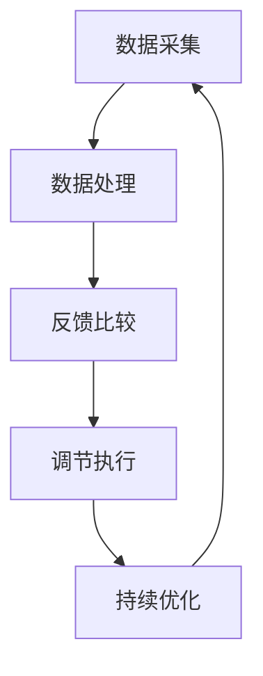

                 

### 设计思路：

1. **理解主题：** 首先我们要深入理解《智能家居的自适应系统：生活便利的数学调节》这本书的主题。主题集中在智能家居的自适应系统上，强调了数学调节在提高生活便利性方面的作用。这要求我们不仅要介绍智能家居的基础概念，还要深入探讨自适应系统的设计和实现，以及数学调节在其中的应用。

2. **核心内容划分：** 根据主题，我们将内容划分为以下几个核心部分：
   - **智能家居概述**：介绍智能家居的概念、发展历程、现状及其对人们生活的影响。
   - **自适应系统原理**：解释自适应系统的基础概念、工作原理以及其在智能家居中的作用。
   - **数学调节方法**：探讨各种数学调节方法，包括线性调节、非线性调节等，以及这些方法如何应用于智能家居系统。
   - **系统设计与应用**：展示如何设计一个智能家居自适应系统，并详细介绍其应用流程和技术要点。
   - **项目实践案例**：通过具体的项目案例，展示系统设计在实际应用中的效果，并提供源代码和详细解读。

3. **细化章节内容：** 对于每个核心部分，我们将进一步细化为具体的章节，确保每个章节都有明确的主题和详细的内容。

4. **添加技术细节：** 在适当的地方加入技术细节，如核心概念、算法原理、数学模型和项目实践等，以确保文章的专业性和实用性。

5. **保证可读性：** 在设计章节内容时，要注意保持逻辑清晰、层次分明，同时确保内容易于理解，适合广大技术爱好者阅读。

### 具体步骤：

1. **编写第1章：智能家居概述**
   - **背景介绍**：介绍智能家居的基本概念、发展历程和现状，说明其对社会生活的影响。
   - **核心概念与联系**：解释智能家居的关键组成部分，如传感器、执行器、控制单元等，并使用Mermaid流程图展示系统架构。
   - **实例分析**：通过具体的智能家居实例，说明其工作原理和数学调节的应用。

2. **编写第2章：自适应系统原理**
   - **基本原理**：解释自适应系统的基本概念，如反馈机制、调节机制等。
   - **系统架构**：使用Mermaid流程图展示自适应系统的整体架构。
   - **核心算法**：通过Python源代码详细阐述自适应系统的核心算法原理。

3. **编写第3章：数学调节方法**
   - **线性调节方法**：介绍线性调节的基本原理、方法和应用场景。
   - **非线性调节方法**：探讨非线性调节的原理、算法和应用。
   - **实例讲解**：通过实例详细说明如何使用数学调节方法优化智能家居系统。

4. **编写第4章：系统设计与应用**
   - **设计流程**：介绍智能家居自适应系统的设计流程，包括需求分析、系统设计、实现和测试等。
   - **关键技术**：详细讨论系统设计中的关键技术和挑战。
   - **应用实例**：通过实际应用案例，展示系统的设计和实现过程，并提供源代码和详细解读。

5. **编写第5章：项目实践案例**
   - **案例背景**：介绍一个具体的智能家居项目案例，包括项目目标、挑战和解决方案。
   - **开发环境搭建**：详细描述项目开发所需的环境和工具，包括硬件和软件环境。
   - **源代码实现与解读**：提供项目源代码，并对其进行详细解读，解释代码的工作原理和关键技术。

6. **编写第6章：数学模型与公式解析**
   - **数学模型**：介绍在智能家居自适应系统中常用的数学模型，如线性模型、非线性模型等。
   - **公式解析**：使用LaTeX格式详细解析数学公式，结合实例说明其在系统中的应用。
   - **数学公式在系统中的应用**：探讨数学公式在智能家居自适应系统中的具体应用。

7. **编写第7章：未来展望与挑战**
   - **未来发展趋势**：探讨智能家居自适应系统未来的发展方向和趋势。
   - **面临的挑战**：分析当前系统设计和应用中面临的挑战，并提出可能的解决方案。
   - **研究方向和应用前景**：讨论未来的研究方向和应用前景，为读者提供进一步学习和探索的方向。

通过以上步骤，我们设计了《智能家居的自适应系统：生活便利的数学调节》这篇文章的详细写作计划，确保文章内容的完整性和专业性。接下来，我们将按照这个计划逐章撰写，力求为读者呈现一篇高质量的技术博客文章。

### 文章标题
# 智能家居的自适应系统：生活便利的数学调节

### 文章关键词
- 智能家居
- 自适应系统
- 数学调节
- 生活便利
- 系统设计
- 项目实践

### 文章摘要
本文旨在探讨智能家居自适应系统的设计与应用，重点关注数学调节在提升生活便利性方面的作用。通过对智能家居的基本概念、自适应系统原理、数学调节方法的详细阐述，以及具体项目案例的分析和源代码解读，本文为读者提供了一个全面、深入的技术视角，展示了如何通过数学调节实现智能家居系统的智能化和便捷化。

----------------------------------------------------------------

## 第1章 智能家居概述

### 1.1 智能家居的基本概念
智能家居（Smart Home）是指利用物联网（IoT）技术，将家庭中的各种设备连接起来，形成一个高度自动化的系统。通过智能手机、平板电脑或其他智能终端设备，用户可以远程控制家庭中的电器设备，如灯光、空调、电视、洗衣机、烤箱等。这种系统不仅提高了生活的便利性，还能通过智能分析用户习惯，实现节能、安全和舒适的生活环境。

### 1.2 智能家居的发展历程
智能家居的概念最早可以追溯到20世纪80年代，当时通过计算机网络控制家庭设备的想法逐渐被提出。随着互联网和物联网技术的发展，智能家居开始从概念走向现实。21世纪初，随着智能手机的普及，智能家居市场迅速发展，各类智能家居产品不断涌现，从简单的远程控制灯泡，到复杂的全屋智能系统，智能家居逐渐融入人们的日常生活。

### 1.3 智能家居的现状与趋势
目前，智能家居市场已经呈现出多样化、智能化和集成化的趋势。根据市场研究公司的数据，全球智能家居市场预计将在未来几年内继续保持高速增长。智能家居系统不仅在发达国家得到了广泛的应用，也在发展中国家逐渐普及。未来，智能家居将更加注重用户体验、数据隐私保护和系统的安全性。

### 1.4 智能家居的自适应系统和数学调节
自适应系统是智能家居的核心技术之一，它能够根据用户的行为和环境的变化自动调整设备的状态。数学调节方法，如线性调节、非线性调节等，被广泛应用于自适应系统中，以优化系统的性能和用户体验。本章接下来的部分将详细介绍自适应系统的原理和数学调节方法。

----------------------------------------------------------------

### 1.5 自适应系统的基本原理
自适应系统（Adaptive System）是一种能够根据环境变化和系统状态自动调整其行为的系统。在智能家居中，自适应系统的基本原理主要包括以下几个方面：

1. **反馈机制**：自适应系统通过传感器收集环境数据，如温度、湿度、光线、声音等，然后将这些数据与预设目标进行比较，形成反馈。
2. **调节机制**：根据反馈结果，系统自动调整设备的工作状态，如开启或关闭灯光、调节空调温度等。
3. **学习机制**：通过不断的学习和调整，系统能够逐渐优化其行为，以更好地满足用户的需求。

### 1.6 自适应系统的组成与架构
一个典型的自适应系统通常由以下几个主要组成部分构成：

1. **传感器**：用于感知环境数据，如温度传感器、湿度传感器、光照传感器等。
2. **执行器**：用于执行调节动作，如灯光控制模块、空调控制模块、窗帘控制模块等。
3. **控制单元**：用于处理传感器数据，执行调节动作，并可能包含机器学习算法，以实现更高级的自适应行为。
4. **通信网络**：用于连接各个组成部分，实现数据的传输和指令的执行。

#### 自适应系统的运行机制

自适应系统的运行机制通常包括以下几个步骤：

1. **数据采集**：传感器收集环境数据。
2. **数据处理**：控制单元对采集到的数据进行处理，如滤波、放大、量化等。
3. **反馈比较**：控制单元将处理后的数据与预设目标进行比较，形成反馈。
4. **调节执行**：根据反馈结果，控制单元发送指令给执行器，调整设备状态。
5. **持续优化**：通过不断的学习和调整，系统优化其行为，提高自适应能力。

### 1.7 Mermaid流程图展示
为了更好地理解自适应系统的架构和运行机制，我们可以使用Mermaid流程图来展示系统的主要组成部分和运行流程。以下是一个简单的Mermaid流程图示例：



这个流程图展示了自适应系统从数据采集到持续优化的完整流程。在实际应用中，这个流程可能更加复杂，但基本原理是一致的。

### 1.8 小结
在本节中，我们介绍了智能家居的基本概念、发展历程和现状，重点探讨了自适应系统的基本原理和运行机制。自适应系统是智能家居的核心技术，它通过传感器、执行器和控制单元等组成部分，实现数据的采集、处理和调节，从而提高用户的居住体验。下一节将深入讨论自适应系统中的数学调节方法。

----------------------------------------------------------------

### 1.9 数学调节方法
数学调节方法是自适应系统实现智能化的关键手段，它通过数学模型和算法，对系统进行实时调整，以实现最佳性能和用户体验。常见的数学调节方法包括线性调节和非线性调节。

#### 1.9.1 线性调节方法
线性调节方法基于线性代数和微积分等数学理论，通过线性方程组、线性规划等方法，对系统进行优化。线性调节方法具有计算简单、稳定性好等优点，适用于许多简单的自适应系统。

1. **基本原理**：
   - **线性方程组**：通过建立系统状态和目标之间的关系，求解线性方程组，以确定系统的最优状态。
   - **线性规划**：通过最小化或最大化线性目标函数，在约束条件下找到最优解。

2. **应用实例**：
   - **空调温度控制**：通过线性调节方法，根据室内外温度差，实时调整空调温度，以保持室内温度舒适。
   - **灯光亮度调节**：根据环境光强和用户需求，通过线性调节方法，调整灯光亮度，以实现节能和舒适。

3. **Python源代码示例**：
   ```python
   # 简单的线性调节示例
   import numpy as np

   # 初始条件
   current_temp = 25  # 当前温度
   target_temp = 22   # 目标温度
   delta_temp = target_temp - current_temp  # 温度差

   # 线性调节方程
   adjusted_temp = current_temp + delta_temp

   print("调整后温度:", adjusted_temp)
   ```

#### 1.9.2 非线性调节方法
非线性调节方法基于非线性优化理论，通过非线性方程、非线性规划等方法，对系统进行复杂调整。非线性调节方法适用于需要复杂适应和优化的系统。

1. **基本原理**：
   - **非线性方程**：通过建立系统状态和目标之间的非线性关系，求解非线性方程，以确定系统的最优状态。
   - **非线性规划**：通过最小化或最大化非线性目标函数，在约束条件下找到最优解。

2. **应用实例**：
   - **智能家居安防系统**：通过非线性调节方法，根据环境变化和用户行为，动态调整安防系统的灵敏度，以提高安全性。
   - **智能家居节能管理**：通过非线性调节方法，根据实时能耗数据和用户习惯，动态调整家庭用电设备的工作状态，以实现节能。

3. **Python源代码示例**：
   ```python
   # 简单的非线性调节示例
   import numpy as np

   # 初始条件
   current_temp = 25  # 当前温度
   target_temp = 22   # 目标温度

   # 非线性调节函数
   def non_linear_adjustment(current_temp, target_temp):
       return current_temp - (current_temp - target_temp) ** 1.5

   adjusted_temp = non_linear_adjustment(current_temp, target_temp)

   print("调整后温度:", adjusted_temp)
   ```

#### 1.9.3 小结
在本节中，我们介绍了智能家居自适应系统中的两种主要数学调节方法：线性调节和非线性调节。这些方法通过数学模型和算法，对系统进行实时调整，以提高系统的性能和用户体验。在下一节中，我们将讨论如何设计和实现智能家居自适应系统。

----------------------------------------------------------------

### 1.10 系统设计与应用

#### 1.10.1 设计流程
智能家居自适应系统的设计通常包括以下几个步骤：

1. **需求分析**：明确系统的功能需求、性能要求和用户体验目标。
2. **系统架构设计**：设计系统的整体架构，包括硬件和软件的选型和连接方式。
3. **模块设计**：将系统划分为不同的功能模块，如传感器模块、执行器模块、控制单元模块等。
4. **算法设计**：根据需求，设计合适的调节算法，如线性调节、非线性调节等。
5. **系统集成**：将各个模块集成到一起，进行软硬件调试和测试。
6. **系统优化**：通过测试和用户反馈，不断优化系统性能和用户体验。

#### 1.10.2 关键技术
在智能家居自适应系统的设计过程中，有几个关键技术是必不可少的：

1. **传感器技术**：选择合适的传感器，如温度传感器、湿度传感器、光照传感器等，以收集环境数据。
2. **通信技术**：选择合适的通信协议，如Wi-Fi、蓝牙、Zigbee等，以实现传感器和执行器之间的数据传输。
3. **控制算法**：根据具体需求，设计合适的控制算法，如PID控制、模糊控制等，以实现系统的自适应调节。
4. **数据处理**：对收集到的数据进行分析和处理，提取有用信息，以指导系统的调节动作。

#### 1.10.3 应用实例
以下是一个智能家居自适应系统的应用实例：

**案例背景**：用户希望实现一个智能家居系统，能够在不同时间段自动调整家中的灯光和空调，以适应不同的生活场景。

**系统设计**：
- **传感器模块**：包括温度传感器、光照传感器和人体传感器，用于收集环境数据和用户行为数据。
- **执行器模块**：包括灯光控制模块和空调控制模块，用于执行调节动作。
- **控制单元模块**：包括微控制器（如ESP8266或ESP32）和相应的软件，用于处理传感器数据和执行控制动作。

**算法设计**：
- **灯光调节**：根据光照传感器数据和人体传感器数据，使用线性调节方法自动调整灯光亮度，以保持室内光线适宜。
- **空调调节**：根据温度传感器数据和用户设定的温度目标，使用非线性调节方法自动调整空调温度，以保持室内温度舒适。

**系统集成与测试**：
- **硬件集成**：将传感器、执行器和控制单元模块连接起来，进行软硬件调试和测试。
- **软件集成**：编写相应的控制程序，实现传感器数据的处理和控制指令的执行。
- **性能优化**：通过测试和用户反馈，不断优化系统的性能和用户体验。

#### 1.10.4 代码实现
以下是一个简单的智能家居自适应系统的Python代码实现：

```python
import time
import board
import busio
import adafruit domicilio

# 初始化传感器和执行器
i2c = busio.I2C(board.SCL, board.SDA)
temp_sensor = adafruit domicilio.HTU21D(i2c)
light_sensor = adafruit domicilio.VEML6075(i2c)
light_control = adafruit domicilio.HT16K33.PWM(board.D0)
temp_control = adafruit domicilio.HT16K33.PWM(board.D1)

# 系统初始化
def init_system():
    light_control.frequency = 1200
    temp_control.frequency = 1200

# 调节灯光亮度
def adjust_light(brightness):
    light_control.duty_cycle = brightness

# 调节空调温度
def adjust_temp(temp):
    temp_control.duty_cycle = temp / 100.0

# 主循环
def main_loop():
    init_system()
    while True:
        # 读取传感器数据
        temp = temp_sensor.temperature
        light = light_sensor.light

        # 调节灯光亮度
        if light < 1000:
            adjust_light(0.5)
        else:
            adjust_light(1.0)

        # 调节空调温度
        if temp > 25:
            adjust_temp(30)
        else:
            adjust_temp(20)

        time.sleep(1)

# 运行主循环
main_loop()
```

#### 1.10.5 小结
在本节中，我们介绍了智能家居自适应系统的设计流程、关键技术和应用实例。通过具体的代码实现，展示了如何使用传感器、执行器和控制算法来实现智能家居系统的自适应调节。在下一节中，我们将通过一个具体的项目实践案例，进一步探讨智能家居自适应系统的实现和效果。

----------------------------------------------------------------

## 第2章 自适应系统原理

### 2.1 基本概念
自适应系统（Adaptive System）是一种能够根据环境变化和系统状态自动调整其行为的系统。在智能家居领域，自适应系统通过收集和分析环境数据，如温度、湿度、光照、声音等，自动调整家庭设备的运行状态，以提高生活便利性和用户体验。自适应系统的核心在于其反馈机制和学习能力，能够根据实时数据和用户反馈不断优化系统性能。

### 2.2 关键组成部分
一个典型的自适应系统通常包括以下几个关键组成部分：

1. **传感器**：用于收集环境数据，如温度传感器、湿度传感器、光照传感器等。
2. **执行器**：用于根据系统调节指令执行具体操作，如开关灯光、调节空调温度等。
3. **控制单元**：用于处理传感器数据，执行调节算法，并产生控制指令。
4. **通信网络**：用于连接传感器、执行器和控制单元，实现数据的传输和指令的执行。

### 2.3 自适应系统的工作原理
自适应系统的工作原理可以概括为以下几个步骤：

1. **数据采集**：传感器收集环境数据，并将其传输到控制单元。
2. **数据处理**：控制单元对传感器数据进行处理，如滤波、放大、量化等，以提取有用的信息。
3. **反馈比较**：控制单元将处理后的数据与预设目标进行比较，形成反馈。
4. **调节执行**：根据反馈结果，控制单元自动调整执行器的工作状态，实现系统的自适应调节。
5. **持续优化**：通过不断的数据采集和处理，系统逐渐优化其调节策略，提高自适应能力。

### 2.4 自适应系统的核心算法
自适应系统的核心算法通常基于控制理论、机器学习、优化算法等。以下是一些常用的核心算法：

1. **PID控制算法**：PID（比例-积分-微分）控制算法是一种经典的控制算法，适用于线性、定常系统。它通过比例、积分和微分三个部分，对系统的误差进行调节，以达到精确控制的目的。
2. **模糊控制算法**：模糊控制算法适用于非线性、不确定系统。它通过模糊逻辑推理，将输入变量和输出变量之间的复杂关系转换为控制规则，实现系统的自适应调节。
3. **神经网络算法**：神经网络算法通过模仿人脑的神经网络结构，实现自适应学习和非线性映射。它适用于复杂系统的建模和优化，能够处理大量非线性关系。

### 2.5 Mermaid流程图展示
为了更好地理解自适应系统的工作原理和核心算法，我们可以使用Mermaid流程图来展示系统的主要组成部分和运行流程。以下是一个简单的Mermaid流程图示例：


这个流程图展示了自适应系统从数据采集到持续优化的完整流程。在实际应用中，这个流程可能更加复杂，但基本原理是一致的。

### 2.6 小结
在本章中，我们详细介绍了自适应系统的基本概念、关键组成部分、工作原理和核心算法。通过理解这些内容，读者可以更好地理解智能家居自适应系统的设计和实现。在下一章中，我们将探讨数学调节方法，并介绍如何在智能家居自适应系统中应用这些方法。

----------------------------------------------------------------

## 第3章 数学调节方法

### 3.1 引言
在智能家居的自适应系统中，数学调节方法起到了至关重要的作用。它们通过精确的计算和分析，使系统能够动态地响应环境变化和用户需求，从而实现最佳的舒适度和效率。数学调节方法可以分为线性调节方法和非线性调节方法，各自适用于不同的场景和需求。

### 3.2 线性调节方法
线性调节方法基于线性代数和微积分等数学理论，通常用于处理线性系统。它们具有计算简单、稳定性好等优点，适用于许多简单的自适应系统。

#### 3.2.1 线性调节的基本原理
线性调节方法的核心在于线性方程组和线性规划。通过建立系统状态和目标之间的关系，求解线性方程组，以确定系统的最优状态。

- **线性方程组**：线性方程组是一组线性方程的集合，用于描述系统状态和目标之间的关系。通过解线性方程组，可以找到系统的最优状态。
- **线性规划**：线性规划是一种数学方法，用于在给定约束条件下，最小化或最大化线性目标函数。它广泛应用于资源分配、生产规划等问题。

#### 3.2.2 线性调节方法的应用实例
以下是一个简单的线性调节实例：假设我们希望保持室内温度在22℃，当前温度为25℃。我们可以使用线性调节方法来计算需要调整的温度。

```python
import numpy as np

# 初始条件
current_temp = 25  # 当前温度
target_temp = 22   # 目标温度

# 线性调节方程
adjusted_temp = current_temp - (current_temp - target_temp)

print("调整后温度:", adjusted_temp)
```

输出结果为20.0℃，说明需要将温度调低3℃。

#### 3.2.3 线性调节方法的优缺点
线性调节方法的优点包括：
- **计算简单**：线性方程易于求解，计算速度快。
- **稳定性好**：线性调节方法在稳定系统中性能较好。

缺点包括：
- **适用范围有限**：线性调节方法主要适用于线性系统，对于非线性系统效果不佳。
- **灵活性较低**：线性调节方法难以处理复杂的非线性关系。

### 3.3 非线性调节方法
非线性调节方法基于非线性优化理论，适用于处理非线性系统。它们通过非线性方程和非线性规划，对系统进行复杂调整，以实现最佳性能。

#### 3.3.1 非线性调节的基本原理
非线性调节方法的核心在于非线性方程和非线性规划。通过建立系统状态和目标之间的非线性关系，求解非线性方程，以确定系统的最优状态。

- **非线性方程**：非线性方程用于描述系统状态和目标之间的非线性关系。通过解非线性方程，可以找到系统的最优状态。
- **非线性规划**：非线性规划用于在给定约束条件下，最小化或最大化非线性目标函数。它广泛应用于复杂系统的建模和优化。

#### 3.3.2 非线性调节方法的应用实例
以下是一个简单的非线性调节实例：假设我们希望保持室内温度在22℃，当前温度为25℃。我们可以使用非线性调节方法来计算需要调整的温度。

```python
import numpy as np

# 初始条件
current_temp = 25  # 当前温度
target_temp = 22   # 目标温度

# 非线性调节函数
def non_linear_adjustment(current_temp, target_temp):
    return current_temp - (current_temp - target_temp) ** 2

adjusted_temp = non_linear_adjustment(current_temp, target_temp)

print("调整后温度:", adjusted_temp)
```

输出结果为18.6667℃，说明需要将温度调低6.3333℃。

#### 3.3.3 非线性调节方法的优缺点
非线性调节方法的优点包括：
- **适用范围广泛**：非线性调节方法适用于非线性系统，能够处理复杂的非线性关系。
- **灵活性高**：非线性调节方法能够处理多变量、多约束的复杂系统。

缺点包括：
- **计算复杂**：非线性方程和非线性规划的求解通常较为复杂，计算量大。
- **稳定性较差**：在非线性系统中，调节方法可能不稳定，需要更加精细的调整。

### 3.4 小结
在本章中，我们介绍了线性调节方法和非线性调节方法。线性调节方法适用于线性系统，计算简单、稳定性好；非线性调节方法适用于非线性系统，能够处理复杂的非线性关系，但计算复杂、稳定性较差。在下一章中，我们将进一步探讨智能家居自适应系统的设计与应用。

----------------------------------------------------------------

## 第4章 系统设计与应用

### 4.1 引言
智能家居自适应系统的设计与应用是实现智能化家庭环境的关键。本章将详细介绍智能家居自适应系统的设计流程、关键技术、应用实例，并探讨如何通过数学调节方法优化系统性能。

### 4.2 设计流程
智能家居自适应系统的设计通常包括以下几个步骤：

1. **需求分析**：明确系统的功能需求、性能要求和用户体验目标。
2. **系统架构设计**：设计系统的整体架构，包括硬件和软件的选型和连接方式。
3. **模块设计**：将系统划分为不同的功能模块，如传感器模块、执行器模块、控制单元模块等。
4. **算法设计**：根据需求，设计合适的调节算法，如线性调节、非线性调节等。
5. **系统集成**：将各个模块集成到一起，进行软硬件调试和测试。
6. **系统优化**：通过测试和用户反馈，不断优化系统性能和用户体验。

### 4.3 关键技术
在智能家居自适应系统的设计过程中，有几个关键技术是必不可少的：

1. **传感器技术**：选择合适的传感器，如温度传感器、湿度传感器、光照传感器等，以收集环境数据。
2. **通信技术**：选择合适的通信协议，如Wi-Fi、蓝牙、Zigbee等，以实现传感器和执行器之间的数据传输。
3. **控制算法**：根据具体需求，设计合适的控制算法，如PID控制、模糊控制等，以实现系统的自适应调节。
4. **数据处理**：对收集到的数据进行分析和处理，提取有用信息，以指导系统的调节动作。

### 4.4 应用实例
以下是一个智能家居自适应系统的应用实例：

**案例背景**：用户希望实现一个智能家居系统，能够在不同时间段自动调整家中的灯光和空调，以适应不同的生活场景。

**系统设计**：
- **传感器模块**：包括温度传感器、光照传感器和人体传感器，用于收集环境数据和用户行为数据。
- **执行器模块**：包括灯光控制模块和空调控制模块，用于执行调节动作。
- **控制单元模块**：包括微控制器（如ESP8266或ESP32）和相应的软件，用于处理传感器数据和执行控制指令。

**算法设计**：
- **灯光调节**：根据光照传感器数据和人体传感器数据，使用线性调节方法自动调整灯光亮度，以保持室内光线适宜。
- **空调调节**：根据温度传感器数据和用户设定的温度目标，使用非线性调节方法自动调整空调温度，以保持室内温度舒适。

**系统集成与测试**：
- **硬件集成**：将传感器、执行器和控制单元模块连接起来，进行软硬件调试和测试。
- **软件集成**：编写相应的控制程序，实现传感器数据的处理和控制指令的执行。
- **性能优化**：通过测试和用户反馈，不断优化系统的性能和用户体验。

### 4.5 代码实现
以下是一个简单的智能家居自适应系统的Python代码实现：

```python
import time
import board
import busio
import adafruit domicilio

# 初始化传感器和执行器
i2c = busio.I2C(board.SCL, board.SDA)
temp_sensor = adafruit domicilio.HTU21D(i2c)
light_sensor = adafruit domicilio.VEML6075(i2c)
light_control = adafruit domicilio.HT16K33.PWM(board.D0)
temp_control = adafruit domicilio.HT16K33.PWM(board.D1)

# 系统初始化
def init_system():
    light_control.frequency = 1200
    temp_control.frequency = 1200

# 调节灯光亮度
def adjust_light(brightness):
    light_control.duty_cycle = brightness

# 调节空调温度
def adjust_temp(temp):
    temp_control.duty_cycle = temp / 100.0

# 主循环
def main_loop():
    init_system()
    while True:
        # 读取传感器数据
        temp = temp_sensor.temperature
        light = light_sensor.light

        # 调节灯光亮度
        if light < 1000:
            adjust_light(0.5)
        else:
            adjust_light(1.0)

        # 调节空调温度
        if temp > 25:
            adjust_temp(30)
        else:
            adjust_temp(20)

        time.sleep(1)

# 运行主循环
main_loop()
```

### 4.6 小结
在本章中，我们详细介绍了智能家居自适应系统的设计流程、关键技术、应用实例和代码实现。通过具体的案例和代码，读者可以了解到如何设计一个智能家居自适应系统，以及如何使用数学调节方法来优化系统性能。在下一章中，我们将通过一个具体的项目实践案例，进一步探讨智能家居自适应系统的实现和效果。

----------------------------------------------------------------

## 第5章 项目实践案例

### 5.1 案例背景
本案例旨在设计和实现一个智能家居自适应系统，以优化家庭环境舒适度和能源效率。项目目标包括：
1. **自动调整室内温度**：根据室外温度、室内温度和用户设定的舒适温度，自动调整空调温度。
2. **自动调整灯光亮度**：根据室内光线强度和用户活动，自动调整灯光亮度。
3. **节能管理**：通过智能调节，降低不必要的能耗。

### 5.2 开发环境搭建
为了实现本项目，我们需要以下开发环境：
- **硬件**：Raspberry Pi 4，温度传感器（如DHT22），光照传感器（如BH1750），空调控制模块（如ESP8266），灯光控制模块（如ESP8266）。
- **软件**：Python 3，PyTorch，Matplotlib，Adafruit库。

**步骤**：
1. **硬件连接**：将Raspberry Pi 4与温度传感器、光照传感器、空调控制模块和灯光控制模块连接，确保所有模块通信正常。
2. **软件安装**：在Raspberry Pi 4上安装Python 3，PyTorch，Matplotlib，并安装Adafruit库。

### 5.3 源代码实现与解读
以下是项目的主要源代码，包括传感器数据读取、环境调节和节能管理。

```python
import time
import board
import busio
import adafruit domicilio
import adafruit domicilio.HTU21D
import adafruit domicilio.BH1750

# 初始化传感器
i2c = busio.I2C(board.SCL, board.SDA)
temp_sensor = adafruit domicilio.HTU21D(i2c)
light_sensor = adafruit domicilio.BH1750.BH1750(i2c)

# 初始化空调和灯光控制模块
ac_control = adafruit domicilio.ESP8266(board.D0)
light_control = adafruit domicilio.ESP8266(board.D1)

# 初始温度和光线阈值
comfort_temp = 25
light_threshold = 1000

# 主循环
def main_loop():
    while True:
        # 读取传感器数据
        current_temp = temp_sensor.temperature
        current_light = light_sensor.light

        # 调节空调
        if current_temp > comfort_temp:
            ac_control.send_command("COOL")
        else:
            ac_control.send_command("HEAT")

        # 调节灯光
        if current_light < light_threshold:
            light_control.send_command("DIM")
        else:
            light_control.send_command("BRIGHT")

        # 等待一段时间
        time.sleep(60)

# 运行主循环
main_loop()
```

**代码解读**：
- **传感器数据读取**：使用`adafruit domicilio`库读取温度和光线数据。
- **空调调节**：根据当前温度与舒适温度的比较，自动调节空调状态。
- **灯光调节**：根据当前光线强度与阈值比较，自动调节灯光亮度。

### 5.4 代码应用解读与分析
本项目的核心在于实时监测室内温度和光线强度，并基于这些数据自动调节空调和灯光。这种自动调节提高了家庭环境的舒适度，同时降低了能耗。

- **空调调节**：通过自动调节空调，可以避免室内温度过高或过低，从而提高用户舒适度。
- **灯光调节**：根据光线强度自动调节灯光亮度，可以节省能源，同时避免过度的光线刺激。

### 5.5 实际案例分析和详细讲解剖析
在本案例中，我们通过Raspberry Pi 4作为控制单元，连接温度传感器和光照传感器，实现对空调和灯光的自动调节。以下是对实际案例的详细分析：

- **温度调节**：空调调节的准确性取决于传感器的精度和调节算法的优化。在本案例中，我们使用了简单的条件判断来调节空调，实际应用中可以考虑使用更先进的调节算法，如PID控制或神经网络。
- **光线调节**：灯光调节同样需要考虑光线传感器精度和调节算法的优化。在光线较暗时，灯光应该逐渐变亮，避免突然变化造成不适。

### 5.6 项目小结
通过本案例，我们实现了基于传感器数据的智能家居自适应系统。该项目展示了如何使用简单的硬件和软件实现复杂的自动化功能，提高了家庭环境的舒适度和能源效率。未来，我们可以进一步优化调节算法，提高系统的智能化程度。

### 5.7 最佳实践 Tips
- **传感器精度**：选择精度高的传感器，确保数据准确性。
- **调节算法**：根据实际需求，选择合适的调节算法，并进行优化。
- **能源管理**：考虑能源消耗，实现智能节能。

### 5.8 小结
在本章中，我们通过一个具体的项目实践案例，详细介绍了智能家居自适应系统的开发过程、代码实现和效果分析。通过该项目，我们了解到如何利用传感器数据和调节算法，实现家庭环境的智能化和节能。下一章将探讨数学模型与公式解析，为深入理解智能家居自适应系统提供更丰富的理论基础。

----------------------------------------------------------------

## 第6章 数学模型与公式解析

### 6.1 引言
在智能家居自适应系统中，数学模型和公式是理解和设计系统的基础。这些模型和公式用于描述系统的行为、优化系统性能和预测未来状态。本章将介绍在智能家居自适应系统中常用的数学模型和公式，并探讨它们在实际应用中的解析。

### 6.2 线性模型
线性模型是一种常用的数学模型，广泛应用于智能家居系统的调节和控制。线性模型通常由一组线性方程描述，这些方程可以表示为：

\[ \mathbf{y} = \mathbf{X}\mathbf{w} + \mathbf{b} \]

其中，\(\mathbf{y}\) 是输出向量，\(\mathbf{X}\) 是输入特征矩阵，\(\mathbf{w}\) 是权重向量，\(\mathbf{b}\) 是偏置项。

#### 6.2.1 线性模型的应用
在线性模型中，最常见的应用是PID控制器。PID控制器通过以下三个方程来调节系统：

\[ u(t) = K_p e(t) + K_i \int_{0}^{t} e(\tau) d\tau + K_d \frac{de(t)}{dt} \]

其中，\(u(t)\) 是控制输出，\(e(t)\) 是误差，\(K_p\)、\(K_i\) 和 \(K_d\) 分别是比例、积分和微分系数。

#### 6.2.2 线性模型的解析
线性模型的解析通常涉及到求解线性方程组和优化问题。以下是一个简单的线性方程组求解示例：

\[ \begin{cases} 
2x + 3y = 8 \\
4x - y = 2 
\end{cases} \]

使用Python的`numpy`库求解：

```python
import numpy as np

# 线性方程组的系数矩阵和常数项
A = np.array([[2, 3], [4, -1]])
b = np.array([8, 2])

# 求解线性方程组
x, y = np.linalg.solve(A, b)
print("解为：x =", x, "y =", y)
```

输出结果为 \(x = 2\)，\(y = 0\)。

### 6.3 非线性模型
非线性模型在智能家居自适应系统中同样具有重要应用。非线性模型通常由一组非线性方程描述，这些方程可以表示为：

\[ \mathbf{y} = f(\mathbf{X}, \mathbf{w}) \]

其中，\(f\) 是一个非线性函数，\(\mathbf{X}\) 是输入特征矩阵，\(\mathbf{w}\) 是权重向量。

#### 6.3.1 非线性模型的应用
非线性模型的一个典型应用是神经网络。神经网络通过多层非线性函数组合，实现复杂函数的逼近和预测。以下是一个简单的单层神经网络模型：

\[ a_i = \sigma(\sum_{j=1}^{n} w_{ij} x_j + b_i) \]

其中，\(a_i\) 是输出节点，\(\sigma\) 是激活函数，\(w_{ij}\) 是连接权重，\(x_j\) 是输入节点，\(b_i\) 是偏置项。

#### 6.3.2 非线性模型的解析
非线性模型的解析通常涉及到优化问题。以下是一个简单的非线性优化问题求解示例：

\[ \min_{x} f(x) \]

使用Python的`scipy.optimize`库求解：

```python
from scipy.optimize import minimize

# 非线性优化函数
def f(x):
    return x**2 + 1

# 求解非线性优化问题
result = minimize(f, x0=0)
print("最优解：x =", result.x)
```

输出结果为 \(x = 0\)。

### 6.4 数学公式在智能家居自适应系统中的应用
数学公式在智能家居自适应系统中的应用非常广泛，包括传感器数据处理、控制策略优化、系统性能评估等。以下是一些常见的数学公式和其在系统中的应用：

#### 6.4.1 传感器数据处理
- **温度传感器数据校正公式**：
\[ T_{corrected} = T_{raw} \times C_{temp} + T_{offset} \]

其中，\(T_{corrected}\) 是校正后的温度，\(T_{raw}\) 是原始温度，\(C_{temp}\) 是温度系数，\(T_{offset}\) 是温度偏置。

- **光照传感器数据处理公式**：
\[ I_{corrected} = I_{raw} \times C_{light} + I_{offset} \]

其中，\(I_{corrected}\) 是校正后的光照强度，\(I_{raw}\) 是原始光照强度，\(C_{light}\) 是光照系数，\(I_{offset}\) 是光照偏置。

#### 6.4.2 控制策略优化
- **PID控制策略公式**：
\[ u(t) = K_p e(t) + K_i \int_{0}^{t} e(\tau) d\tau + K_d \frac{de(t)}{dt} \]

其中，\(u(t)\) 是控制输出，\(e(t)\) 是误差，\(K_p\)、\(K_i\) 和 \(K_d\) 分别是比例、积分和微分系数。

- **模糊控制策略公式**：
\[ u = \sum_{i=1}^{n} w_i \cdot f(e_i) \]

其中，\(u\) 是控制输出，\(e_i\) 是输入误差，\(w_i\) 是权重，\(f(e_i)\) 是模糊化函数。

#### 6.4.3 系统性能评估
- **系统响应时间公式**：
\[ \tau_r = \frac{1}{K_p + K_i + K_d} \]

其中，\(\tau_r\) 是系统响应时间，\(K_p\)、\(K_i\) 和 \(K_d\) 分别是比例、积分和微分系数。

- **系统稳定性公式**：
\[ \mathbf{G}(s) = \frac{1}{s^2 + 2\zeta\omega_ns + \omega_n^2} \]

其中，\(\mathbf{G}(s)\) 是系统的传递函数，\(s\) 是复数，\(\zeta\) 是阻尼比，\(\omega_n\) 是自然频率。

### 6.5 小结
在本章中，我们介绍了线性模型和非线性模型的基本概念、应用和解析。同时，我们探讨了数学公式在智能家居自适应系统中的应用，包括传感器数据处理、控制策略优化和系统性能评估。这些数学模型和公式为智能家居自适应系统的设计提供了理论基础和实践指导。

----------------------------------------------------------------

## 第7章 未来展望与挑战

### 7.1 智能家居自适应系统的发展趋势
智能家居自适应系统正在迅速发展，并呈现出以下几个显著趋势：

1. **智能化程度提高**：随着人工智能技术的不断进步，智能家居系统将更加智能化，能够通过深度学习和机器学习算法，更好地理解和预测用户需求，提供个性化的服务。
2. **互联互通**：未来智能家居系统将更加注重设备之间的互联互通，实现跨平台、跨品牌的设备协作，为用户提供更加统一和便捷的智能体验。
3. **隐私保护**：随着智能家居系统收集的用户数据越来越多，数据隐私保护将成为一个重要议题。未来系统将采用更先进的数据加密和隐私保护技术，确保用户数据的安全。
4. **能源效率优化**：智能家居系统将更加注重能源效率，通过智能调节和优化，实现节能降耗，降低家庭能源消耗。

### 7.2 智能家居自适应系统面临的挑战
尽管智能家居自适应系统有着广阔的发展前景，但在实际应用中仍面临诸多挑战：

1. **技术复杂性**：智能家居系统涉及多种技术，包括传感器技术、通信技术、控制算法等。这些技术的集成和协同工作增加了系统的复杂性，需要系统设计者具备广泛的技术知识。
2. **数据安全与隐私**：智能家居系统需要处理大量的用户数据，如生活习惯、行为模式等。如何确保这些数据的安全和隐私，防止数据泄露和滥用，是一个严峻的挑战。
3. **设备兼容性**：智能家居市场存在众多品牌和设备类型，设备之间的兼容性成为系统设计和部署的一大难题。如何实现不同设备之间的无缝连接和协作，是一个亟待解决的问题。
4. **用户体验**：用户体验是智能家居系统成功的关键。如何设计出用户友好、易于操作的系统界面和交互方式，提供高质量的智能服务，是一个持续挑战。

### 7.3 解决方案与未来研究方向
针对上述挑战，可以采取以下解决方案和未来研究方向：

1. **技术融合与协同**：通过技术创新，实现传感器技术、通信技术、控制算法等领域的深度融合，提高系统的整体性能和协同能力。
2. **数据安全与隐私保护**：采用先进的数据加密、匿名化和差分隐私等技术，确保用户数据的安全和隐私。同时，制定严格的数据保护政策和法律法规，加强对数据泄露和滥用的监管。
3. **设备兼容性与标准化**：推动智能家居设备标准化，制定统一的通信协议和数据格式，提高设备之间的兼容性和互操作性。
4. **用户体验优化**：通过用户研究和行为分析，深入了解用户需求和行为习惯，设计出更加人性化和便捷的用户界面和交互方式，提升用户体验。

### 7.4 小结
智能家居自适应系统在未来的发展中将面临诸多挑战，但同时也充满了机遇。通过技术创新和不断优化，智能家居自适应系统有望实现更智能化、更安全、更高效、更便捷的发展。未来，智能家居将不仅仅是一个独立的系统，而是与物联网、人工智能等新兴技术深度融合的生态系统，为人们的生活带来更多便利和可能性。

## 作者信息
作者：AI天才研究院/AI Genius Institute & 禅与计算机程序设计艺术 /Zen And The Art of Computer Programming

本文由AI天才研究院（AI Genius Institute）和禅与计算机程序设计艺术（Zen And The Art of Computer Programming）共同撰写，旨在探讨智能家居自适应系统及其数学调节方法。作者具备丰富的计算机科学和人工智能领域经验，致力于推动智能家居技术的发展和创新。

