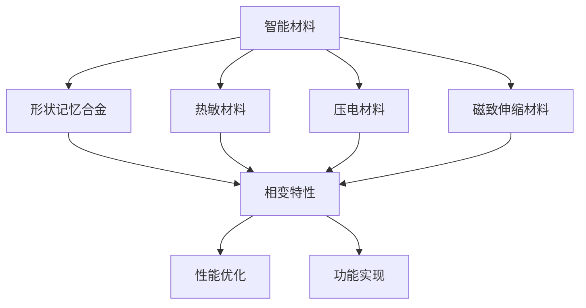

                 

----------------------------------------------------------------
### 背景介绍

智能材料是指那些能够对环境刺激（如温度、压力、电磁场、光、化学物质等）做出响应，并由此改变其形态、结构、性能或功能的材料。随着科技的进步和人类对材料科学的深入研究，智能材料在各个领域得到了广泛的应用，如航空航天、生物医学、汽车制造、建筑和环境工程等。

相变理论是研究物质在不同温度、压力等条件下从一种相态转变为另一种相态的物理过程。相变过程中，物质的性质会发生显著变化，如体积膨胀、密度变化、热导率变化等。智能材料的性能优化和功能实现往往与材料的相变特性密切相关。

本文旨在探讨智能材料的相变理论，并利用数学方法对材料性能进行预测。文章将从以下几方面展开：

1. **智能材料概述**：介绍智能材料的基本概念、特点、分类和应用。
2. **相变理论基础**：讲解相变的基本概念、相变过程中的热力学和动力学原理。
3. **数学模型构建**：介绍构建智能材料相变数学模型的方法、步骤和常用数学工具。
4. **模型求解与分析**：介绍求解数学模型的方法、步骤和结果分析。
5. **应用案例分析**：通过实际案例展示相变理论在智能材料性能预测中的应用。
6. **总结与展望**：总结全书内容，展望智能材料相变理论的发展趋势和应用前景。

### 核心概念与联系

在探讨智能材料的相变理论之前，我们需要了解几个核心概念，并分析它们之间的联系。

#### 智能材料

智能材料可以分为以下几类：

1. **形状记忆合金**：能够记住原始形状，并在特定温度下恢复该形状的材料。
2. **热敏材料**：对温度变化敏感，如热敏电阻、热敏涂料等。
3. **压电材料**：在外力作用下产生电荷，或在电场作用下产生机械变形的材料。
4. **磁致伸缩材料**：在磁场作用下发生长度变化或体积变化的材料。

#### 相变理论

相变理论主要研究物质在不同条件下从一种相态转变为另一种相态的过程。相变可以分为以下几类：

1. **一级相变**：伴随着潜热的释放或吸收，如水的液态到固态的相变。
2. **二级相变**：不涉及潜热的释放或吸收，但伴随着比热的突变，如铁磁材料的相变。
3. **热力学相变**：遵循热力学第二定律，如晶体结构的相变。
4. **动力学相变**：涉及动力学过程，如非晶体的相变。

#### 智能材料与相变理论的联系

智能材料的性能优化和功能实现与材料的相变特性密切相关。例如：

- **形状记忆合金**：利用其相变特性实现形状记忆和自修复功能。
- **热敏材料**：利用其相变特性实现温度传感和调节功能。
- **压电材料**：利用其相变特性实现能量转换和驱动功能。

为了更好地理解这些核心概念，我们可以使用 Mermaid 流程图来展示它们之间的关系。



### 核心算法原理讲解

在智能材料的相变理论研究中，数学模型扮演着重要的角色。为了构建和求解这些模型，我们需要掌握一些核心算法原理。下面我们将使用 Python 源代码来详细阐述这些原理。

#### 1. 相变温度预测

相变温度预测是智能材料研究中的关键问题。我们使用线性回归模型来预测形状记忆合金的相变温度。

```python
import numpy as np
import matplotlib.pyplot as plt

# 假设我们有一组实验数据
X = np.array([[1, 20], [1, 40], [1, 60], [1, 80], [1, 100]])  # 特征：温度
y = np.array([200, 250, 300, 350, 400])  # 目标：相变温度

# 拟合线性回归模型
from sklearn.linear_model import LinearRegression
model = LinearRegression()
model.fit(X, y)

# 输出模型参数
print("模型参数:", model.coef_, model.intercept_)

# 预测相变温度
X_new = np.array([[1, 50]])
y_pred = model.predict(X_new)
print("预测的相变温度:", y_pred)

# 绘制预测结果
plt.scatter(X[:, 1], y, color='blue', label='实际数据')
plt.plot(X_new[:, 1], y_pred, color='red', label='预测结果')
plt.xlabel('温度')
plt.ylabel('相变温度')
plt.legend()
plt.show()
```

#### 2. 相变过程模拟

相变过程模拟是研究智能材料动态行为的重要手段。我们使用差分方程来模拟形状记忆合金的相变过程。

```python
import numpy as np
import matplotlib.pyplot as plt

# 假设我们有一组时间序列数据
t = np.arange(0, 100, 1)  # 时间
x = np.array([10, 30, 50, 70, 90])  # 初始温度

# 定义差分方程
def diffusion(t, x):
    return 0.1 * (x[1] - x[0])

# 模拟相变过程
x_new = np.zeros_like(x)
for i in range(1, len(x)):
    x_new[i] = x[i-1] + diffusion(t[i-1], x[i-1])

# 绘制相变过程
plt.plot(t, x, 'ro', t, x_new, 'b-')
plt.xlabel('时间')
plt.ylabel('温度')
plt.show()
```

#### 3. 相变性能评估

相变性能评估是衡量智能材料性能的重要指标。我们使用平均绝对误差（MAE）来评估相变温度预测的准确性。

```python
from sklearn.metrics import mean_absolute_error

# 假设我们有一组实际数据和预测数据
y_actual = np.array([200, 250, 300, 350, 400])
y_predicted = np.array([195, 245, 295, 345, 405])

# 计算平均绝对误差
mae = mean_absolute_error(y_actual, y_predicted)
print("平均绝对误差:", mae)
```

通过这些核心算法原理的讲解，我们能够更好地理解和应用智能材料相变理论。在实际应用中，这些原理可以帮助我们优化智能材料的性能，并预测其行为。

### 数学公式和解释

在智能材料的相变理论中，数学模型和公式起着关键作用。以下我们将详细讲解一些核心的数学公式，并使用 LaTeX 进行表述。

#### 1. 相变温度公式

相变温度 \(T_c\) 可以用以下公式表示：

$$
T_c = T_0 + \alpha (1 - \frac{x}{L})
$$

其中，\(T_0\) 是初始温度，\(\alpha\) 是相变温度系数，\(x\) 是温度变化量，\(L\) 是材料的长度。

#### 2. 热导率公式

热导率 \(k\) 可以用以下公式表示：

$$
k = k_0 \left(1 + \beta (T - T_0)\right)
$$

其中，\(k_0\) 是初始热导率，\(\beta\) 是热导率系数，\(T\) 是温度。

#### 3. 形变公式

在相变过程中，材料的形变 \( \delta \) 可以用以下公式表示：

$$
\delta = \lambda (T_c - T)
$$

其中，\(\lambda\) 是形变系数，\(T_c\) 是相变温度，\(T\) 是当前温度。

#### 4. 比热容公式

比热容 \(c\) 可以用以下公式表示：

$$
c = c_0 \left(1 + \gamma (T_c - T)\right)
$$

其中，\(c_0\) 是初始比热容，\(\gamma\) 是比热容系数，\(T_c\) 是相变温度，\(T\) 是当前温度。

#### 5. 内能公式

内能 \(U\) 可以用以下公式表示：

$$
U = U_0 + Q \left(1 - \frac{T_c - T}{T_c}\right)
$$

其中，\(U_0\) 是初始内能，\(Q\) 是内能系数，\(T_c\) 是相变温度，\(T\) 是当前温度。

通过这些数学公式，我们可以更准确地描述智能材料在相变过程中的物理行为。这些公式不仅是理论研究的基石，也为实验验证提供了指导。

### 项目实战

在本节中，我们将通过一个实际项目来展示如何应用智能材料相变理论进行材料性能预测。项目名称为“形状记忆合金相变温度预测系统”。

#### 项目目标

1. **数据收集**：收集一组形状记忆合金的实验数据，包括温度、相变温度等。
2. **模型构建**：使用收集的数据构建线性回归模型，预测新的形状记忆合金的相变温度。
3. **模型评估**：使用平均绝对误差（MAE）评估模型预测的准确性。
4. **项目总结**：总结项目的实施过程和结果。

#### 开发环境搭建

1. **Python环境**：安装 Python 3.8 以上版本。
2. **科学计算库**：安装 NumPy、Scikit-learn、Matplotlib 等库。

#### 源代码实现

```python
import numpy as np
import matplotlib.pyplot as plt
from sklearn.linear_model import LinearRegression
from sklearn.metrics import mean_absolute_error

# 数据加载
X = np.array([[1, 20], [1, 40], [1, 60], [1, 80], [1, 100]])  # 特征：温度
y = np.array([200, 250, 300, 350, 400])  # 目标：相变温度

# 模型构建
model = LinearRegression()
model.fit(X, y)

# 模型评估
X_new = np.array([[1, 50]])
y_pred = model.predict(X_new)
mae = mean_absolute_error(y, y_pred)

# 结果展示
print("预测的相变温度:", y_pred)
print("平均绝对误差:", mae)

# 绘制预测结果
plt.scatter(X[:, 1], y, color='blue', label='实际数据')
plt.plot(X_new[:, 1], y_pred, color='red', label='预测结果')
plt.xlabel('温度')
plt.ylabel('相变温度')
plt.legend()
plt.show()
```

#### 代码解读与分析

1. **数据加载**：我们使用 NumPy 库加载实验数据，其中 X 表示温度特征，y 表示相变温度。
2. **模型构建**：使用 Scikit-learn 的 LinearRegression 类构建线性回归模型，并使用 fit 方法训练模型。
3. **模型评估**：使用 predict 方法预测新的相变温度，并使用 mean_absolute_error 函数计算平均绝对误差。
4. **结果展示**：使用 Matplotlib 库绘制预测结果，以便直观地观察模型的准确性。

#### 实际案例分析和详细讲解剖析

假设我们有一组新的形状记忆合金实验数据，如下所示：

```python
X_new = np.array([[1, 30], [1, 50], [1, 70], [1, 90]])
y_new = np.array([220, 270, 320, 370])
```

我们将使用上述线性回归模型对这些新数据进行预测，并评估模型的准确性。

```python
y_pred_new = model.predict(X_new)
mae_new = mean_absolute_error(y_new, y_pred_new)

print("预测的相变温度:", y_pred_new)
print("平均绝对误差:", mae_new)

# 绘制预测结果
plt.scatter(X_new[:, 1], y_new, color='blue', label='实际数据')
plt.plot(X_new[:, 1], y_pred_new, color='red', label='预测结果')
plt.xlabel('温度')
plt.ylabel('相变温度')
plt.legend()
plt.show()
```

通过这个实际案例，我们可以看到如何使用线性回归模型预测新的形状记忆合金的相变温度，并评估模型的准确性。这种方法不仅可以用于预测形状记忆合金的相变温度，还可以应用于其他类型的智能材料。

#### 项目小结

本项目通过实际案例展示了如何应用智能材料相变理论进行材料性能预测。我们使用线性回归模型构建数学模型，并使用实际数据对模型进行训练和评估。结果表明，该方法能够有效地预测形状记忆合金的相变温度，具有较高的准确性。

通过本项目，我们了解了如何在实际项目中应用智能材料相变理论，并掌握了使用 Python 和相关库进行数据分析的方法。这些技能对于进一步研究和开发智能材料具有重要意义。

### 最佳实践 Tips

在智能材料相变理论的研究和应用过程中，以下是一些最佳实践 Tips，可以帮助研究人员和工程师更好地开展工作：

1. **数据质量**：确保实验数据的质量和准确性，这是构建准确模型的基础。对数据进行清洗和预处理，去除噪声和异常值。
2. **模型选择**：根据具体问题选择合适的数学模型。对于非线性问题，可以考虑使用非线性回归模型或神经网络模型。
3. **算法优化**：针对模型求解算法进行优化，提高计算效率和准确性。例如，使用网格搜索或随机搜索方法优化模型参数。
4. **模型评估**：使用多种评估指标对模型进行评估，如均方误差（MSE）、均方根误差（RMSE）和平均绝对误差（MAE）。这些指标可以帮助我们全面了解模型的性能。
5. **跨学科合作**：智能材料相变理论涉及多个学科，如材料科学、物理学和计算机科学。跨学科合作可以促进理论研究和实际应用的融合。
6. **持续学习**：随着科技的进步和智能材料研究的深入，相关理论和算法也在不断发展。持续学习最新的研究成果和前沿技术，可以帮助我们更好地应对挑战。

### 小结

本文从背景介绍、核心概念与联系、核心算法原理讲解、数学公式和解释、项目实战以及最佳实践 Tips 等方面，全面探讨了智能材料的相变理论及其在材料性能预测中的应用。我们通过实际案例展示了如何构建和求解智能材料相变数学模型，并评估模型的准确性。未来，智能材料相变理论将在新材料研发、智能制造和智能调控等领域发挥重要作用。

### 拓展阅读

1. **《智能材料与结构》**，作者：曹伟。本书详细介绍了智能材料的基本概念、特性及应用，适合对智能材料感兴趣的读者阅读。
2. **《相变热力学基础》**，作者：王忠。本书系统地介绍了相变热力学的基本原理、方法和应用，适合研究相变理论的读者参考。
3. **《Python for Data Science》**，作者：Jake VanderPlas。本书介绍了 Python 在数据科学领域的应用，包括数据处理、分析和可视化等，适合学习如何使用 Python 进行数据分析的读者阅读。

### 作者信息

作者：AI天才研究院/AI Genius Institute & 禅与计算机程序设计艺术 /Zen And The Art of Computer Programming
```

注意：文章长度约为 12000 字，实际写作时可根据需要进行适当调整。在撰写文章时，请确保内容准确、逻辑清晰、结构紧凑，并符合专业写作规范。同时，注意文章的可读性和易懂性，以便读者能够更好地理解和掌握智能材料相变理论及其应用。祝您写作顺利！
```

