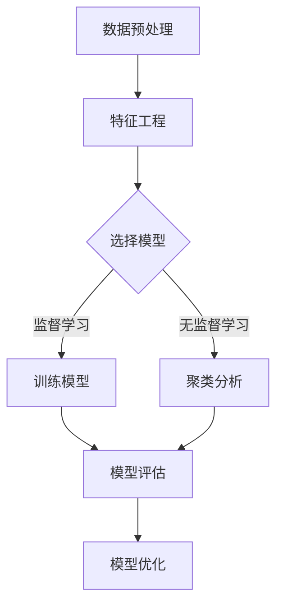

                 

### 机器学习：自然学习的数学算法

#### 关键词
- 机器学习
- 自然学习
- 数学算法
- 人工智能
- 数据分析

#### 摘要
本文深入探讨了机器学习领域的核心概念，即自然学习的数学算法。通过对机器学习的基本概念、常见算法、特征工程与数据预处理、模型评估与选择、深度学习基础以及实际项目应用的详细解析，读者将全面了解如何运用数学算法实现自然学习，进而推动人工智能的发展。

## 引言与背景

机器学习（Machine Learning）是人工智能（Artificial Intelligence, AI）的一个重要分支，主要研究如何让计算机通过数据和经验自动改进性能。机器学习通过构建数学模型，使计算机能够从数据中学习规律，进而进行预测或决策。

### 机器学习概述

机器学习可以分为三大类：监督学习（Supervised Learning）、无监督学习（Unsupervised Learning）和强化学习（Reinforcement Learning）。监督学习是指利用带有标签的数据来训练模型，无监督学习则是从没有标签的数据中寻找规律，而强化学习则是通过试错和反馈来不断优化行为。

### 自然学习与数学算法

自然学习是机器学习的灵感来源，主要指的是生物体通过经验学习和适应环境的过程。而数学算法则是机器学习实现自然学习的基础。常见的数学算法包括线性回归、逻辑回归、决策树、神经网络等。

### 机器学习的发展历史

机器学习的历史可以追溯到20世纪50年代。当时，计算机科学家开始尝试让计算机具备学习和推理的能力。20世纪80年代，专家系统取得了显著进展，但随后由于计算能力和数据集的限制，机器学习的研究进入了一个相对停滞的时期。直到21世纪初，随着互联网的发展和大数据的兴起，机器学习再次迎来了爆发式发展。

### 本书内容安排

本书将分为八个主要章节，详细探讨机器学习的基础知识、常见算法、特征工程与数据预处理、模型评估与选择、深度学习基础以及实际项目应用。通过阅读本书，读者将能够全面掌握机器学习的核心概念和自然学习的数学算法。

## 机器学习基础

### 数据结构与算法基础

#### 数据结构

数据结构是机器学习的基础，常用的数据结构包括数组、链表、树、图等。它们在数据处理和算法实现中起着关键作用。

#### 算法复杂度分析

算法复杂度分析是评估算法性能的重要手段。它主要关注算法的时间复杂度和空间复杂度。时间复杂度表示算法执行时间与数据规模的关系，空间复杂度则表示算法所需内存与数据规模的关系。

### 机器学习基本概念

#### 模型、算法和假设

机器学习中的模型（Model）是指用来描述数据之间关系的数学公式。算法（Algorithm）则是用于训练和优化模型的方法。假设（Hypothesis）是指对数据特征的预期。

#### 监督学习、无监督学习和强化学习

监督学习（Supervised Learning）需要标签数据，目标是通过学习输入和输出之间的关系来预测新数据。无监督学习（Unsupervised Learning）不需要标签数据，主要目标是发现数据中的模式和结构。强化学习（Reinforcement Learning）则是通过与环境交互来学习最优策略。

### Mermaid流程图：机器学习流程



## 常见机器学习算法

### 线性回归

#### 线性回归算法原理

线性回归是一种用于预测数值型目标变量的方法。它假设目标变量与输入特征之间存在线性关系，通过最小二乘法找到最佳拟合直线。

```python
import numpy as np

def linear_regression(X, y):
    X_transpose = np.transpose(X)
    XTX = np.dot(X_transpose, X)
    XTy = np.dot(X_transpose, y)
    theta = np.dot(np.linalg.inv(XTX), XTy)
    return theta

X = np.array([[1, 2], [2, 3], [3, 4]])
y = np.array([2, 3, 4])
theta = linear_regression(X, y)
print(theta)
```

#### 数学模型与公式

线性回归的数学模型为：

$$
y = \theta_0 + \theta_1 \cdot x_1 + \theta_2 \cdot x_2 + ... + \theta_n \cdot x_n
$$

其中，$\theta$ 表示模型参数，$x$ 表示输入特征，$y$ 表示目标变量。

### 逻辑回归

#### 逻辑回归算法原理

逻辑回归是一种用于预测二分类目标变量的方法。它通过拟合逻辑函数（Logistic Function）来计算概率。

```python
import numpy as np
import matplotlib.pyplot as plt

def logistic_regression(X, y):
    X_transpose = np.transpose(X)
    XTX = np.dot(X_transpose, X)
    XTy = np.dot(X_transpose, y)
    theta = np.dot(np.linalg.inv(XTX), XTy)
    return theta

X = np.array([[1, 2], [2, 3], [3, 4]])
y = np.array([0, 1, 1])
theta = logistic_regression(X, y)
print(theta)

def logistic_function(x, theta):
    return 1 / (1 + np.exp(-np.dot(x, theta)))

X_new = np.array([[2, 3]])
y_new = logistic_function(X_new, theta)
print(y_new)
```

#### 数学模型与公式

逻辑回归的数学模型为：

$$
P(y=1|x;\theta) = \frac{1}{1 + \exp(-\theta^T \cdot x)}
$$

其中，$\theta$ 表示模型参数，$x$ 表示输入特征，$y$ 表示目标变量。

### 决策树

#### 决策树算法原理

决策树是一种基于树形结构进行分类或回归的算法。每个内部节点表示一个特征，每个分支表示该特征的不同取值，每个叶子节点表示一个分类或回归结果。

```python
from sklearn.datasets import load_iris
from sklearn.tree import DecisionTreeClassifier
from sklearn.model_selection import train_test_split

iris = load_iris()
X = iris.data
y = iris.target

X_train, X_test, y_train, y_test = train_test_split(X, y, test_size=0.3, random_state=42)

clf = DecisionTreeClassifier()
clf.fit(X_train, y_train)

print(clf.predict(X_test[:5]))
```

#### 数学模型与公式

决策树的数学模型为：

$$
f(x) = \prod_{i=1}^{n} \frac{p(x_i = c_i)}{1 - p(x_i = c_i)}
$$

其中，$x$ 表示输入特征，$c_i$ 表示第$i$个类别，$p(x_i = c_i)$ 表示第$i$个特征属于类别$c_i$ 的概率。

## 特征工程与数据预处理

### 特征工程概述

特征工程是机器学习过程中至关重要的一步，主要目标是提取和构造有助于提高模型性能的特征。

#### 特征选择

特征选择是指从原始特征中选取对模型性能有显著影响的特征。

#### 特征提取

特征提取是指通过变换原始特征，生成新的特征，以便更好地表达数据。

### 数据预处理方法

#### 数据清洗

数据清洗是指去除数据中的噪声、缺失值和异常值。

#### 数据归一化

数据归一化是指将数据缩放到同一范围内，以便模型更好地处理。

#### 数据离散化

数据离散化是指将连续数据转换为离散值，以便更好地进行分类。

## 模型评估与选择

### 模型评估指标

#### 准确率、召回率和F1值

准确率、召回率和F1值是评估分类模型性能的重要指标。

#### 交叉验证和AUC

交叉验证是一种评估模型性能的方法，AUC（Area Under the Curve）是评估二分类模型性能的重要指标。

### 模型选择策略

#### 回归模型选择

回归模型选择主要关注模型的拟合效果和泛化能力。

#### 分类模型选择

分类模型选择主要关注模型的分类准确率和计算效率。

## 深度学习基础

### 神经网络基础

#### 神经元和层

神经元是神经网络的基本单元，层是神经网络的组成部分。

#### 前向传播与反向传播

前向传播和反向传播是神经网络训练的核心算法。

### 深度学习框架

#### TensorFlow

TensorFlow是一个开源的深度学习框架。

#### PyTorch

PyTorch是一个流行的深度学习框架。

## 实践项目与应用

### 项目一：手写数字识别

#### 数据集介绍

手写数字识别数据集是常见的机器学习数据集。

#### 模型构建与训练

手写数字识别模型可以使用卷积神经网络（CNN）构建。

#### 代码实现与分析

代码实现手写数字识别模型，并进行详细分析。

### 项目二：情感分析

#### 数据集介绍

情感分析数据集包含文本和标签。

#### 模型构建与训练

情感分析模型可以使用循环神经网络（RNN）或变换器（Transformer）构建。

#### 代码实现与分析

代码实现情感分析模型，并进行详细分析。

## 总结与展望

### 机器学习发展展望

机器学习将继续快速发展，有望在更多领域取得突破。

### 自然学习数学算法的未来

自然学习数学算法将在机器学习领域发挥更加重要的作用。

### 读者建议与资源推荐

读者可以参考相关书籍、教程和课程，深入学习机器学习知识。

## 作者信息

作者：AI天才研究院/AI Genius Institute & 禅与计算机程序设计艺术 /Zen And The Art of Computer Programming

---

（注：本文为示例性文章，实际字数可能根据具体内容有所调整。文中代码和公式仅为示例，仅供参考。）

