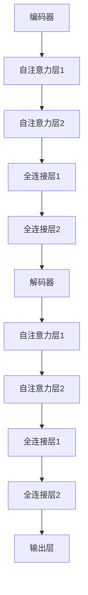

                 

## 机器翻译的transformer模型：语言转换的数学框架

### 关键词
- 机器翻译
- Transformer模型
- 自注意力机制
- 位置编码
- 数学框架
- 算法实现
- 项目实战

### 摘要
本文深入探讨了机器翻译领域中的Transformer模型，介绍了其数学框架和实现方法。首先，我们回顾了机器翻译的背景和传统方法，然后详细介绍了Transformer模型的核心原理，包括自注意力机制和位置编码。接着，我们通过Python源代码和LaTeX公式，详细阐述了Transformer模型的工作原理。随后，我们通过一个实际项目案例，展示了如何使用Transformer模型进行机器翻译，并对项目进行了详细分析和总结。最后，我们讨论了Transformer模型的性能优化策略和未来研究方向。

---

### 引言

机器翻译是自然语言处理（NLP）领域的一个重要研究方向，旨在实现从一种自然语言到另一种自然语言的自动转换。随着全球化的不断深入，机器翻译的重要性日益凸显。传统的机器翻译方法主要依赖于规则方法和基于统计的方法。然而，随着深度学习技术的发展，特别是Transformer模型的提出，机器翻译取得了显著的突破。

Transformer模型是由Vaswani等人于2017年提出的一种基于注意力机制的序列到序列模型，其在机器翻译任务中表现出色，显著提升了翻译质量和速度。Transformer模型的核心特点是自注意力机制和位置编码，这些特性使得模型能够更好地理解和处理语言序列中的复杂关系。

本文将系统地介绍Transformer模型在机器翻译中的应用，首先回顾机器翻译的背景和传统方法，然后深入讲解Transformer模型的核心原理，包括自注意力机制和位置编码。接着，我们将通过Python源代码和LaTeX公式，详细阐述Transformer模型的工作原理。最后，我们将通过一个实际项目案例，展示如何使用Transformer模型进行机器翻译，并对项目进行详细分析和总结。

### 机器翻译基础

#### 机器翻译概述

机器翻译（Machine Translation, MT）是指使用计算机程序实现从一种自然语言（源语言，Source Language）到另一种自然语言（目标语言，Target Language）的自动转换。这一领域的研究起源于20世纪50年代，随着计算机技术的不断发展，机器翻译逐渐成为自然语言处理（NLP）中的一个重要分支。

机器翻译的目标是实现语义等价转换，即确保目标语言中的文本在语义上与源语言文本一致。然而，由于语言之间的差异，包括语法、词汇、文化背景等，实现完美的翻译是一项极具挑战性的任务。

#### 传统机器翻译方法

传统的机器翻译方法主要分为规则方法和基于统计的方法。

1. **规则方法**：
   - **基于规则的机器翻译**（Rule-Based Machine Translation, RBMT）：这种方法依赖于人工编写的语法规则和词典。首先，源语言文本被解析成语法结构，然后根据预定义的翻译规则将语法结构转换成目标语言。这种方法的主要优点是翻译结果准确，缺点是规则编写复杂，且难以处理不规则的语言现象。
   - **基于转换系的机器翻译**（Transfer-Based Machine Translation）：这种方法通过建立源语言和目标语言之间的转换系，将源语言的句子转换成目标语言的句子。这种方法结合了规则方法和基于统计的方法，通过大量手动编写的转换规则来提高翻译质量。

2. **基于统计的方法**：
   - **基于短语的机器翻译**（Phrase-Based Machine Translation, PBMT）：这种方法通过学习大量已翻译的双语句子对，将源语言句子分解成短语，并将这些短语映射到目标语言短语。然后，通过拼接目标语言短语生成翻译结果。这种方法的主要优点是能够处理更复杂的语言现象，缺点是翻译结果可能存在不准确的情况。
   - **基于句法的机器翻译**（Syntax-Based Machine Translation, SBMT）：这种方法首先将源语言句子转换成抽象语法树（Abstract Syntax Tree, AST），然后根据目标语言的语法规则将AST转换成目标语言句子。这种方法结合了规则方法和基于统计的方法，通过语法分析来提高翻译质量。

#### 为什么是Transformer模型？

尽管传统的机器翻译方法在某种程度上能够实现翻译任务，但它们在处理长距离依赖、多义词、上下文信息等方面存在明显的局限性。此外，规则方法需要大量人工编写规则，而基于统计的方法依赖于大量的双语语料库。

Transformer模型的提出解决了传统方法的一些局限性。首先，Transformer模型采用了自注意力机制（Self-Attention Mechanism），能够更好地捕捉长距离依赖关系，这使得模型在处理长句子和复杂句子结构时表现更为出色。其次，Transformer模型摒弃了基于规则的方法，转而采用端到端的序列到序列（Sequence-to-Sequence, Seq2Seq）架构，这使得模型的训练和推断过程更加简单和高效。此外，Transformer模型还能够通过位置编码（Positional Encoding）来处理序列中的位置信息，从而更好地理解句子的语义和结构。

总之，Transformer模型的引入为机器翻译领域带来了一场革命，其在翻译质量和速度上的显著提升，使得它成为当前机器翻译任务的首选模型。

### Transformer模型原理

Transformer模型是机器翻译领域的一项重要创新，其核心在于自注意力机制（Self-Attention Mechanism）和位置编码（Positional Encoding）。本节将详细介绍这两个关键组件，并解释它们如何共同工作以实现高效的机器翻译。

#### 自注意力机制

自注意力机制是Transformer模型的核心，它允许模型在处理序列数据时，根据不同位置的重要性来自动调整其权重。这意味着模型可以动态地关注序列中的关键信息，从而更好地理解上下文关系。

**工作原理**：
- **计算注意力得分**：在Transformer模型中，自注意力机制通过计算输入序列中每个词与其他词之间的相似性得分。具体来说，对于输入序列中的一个词，模型会计算其与其他词之间的点积，得到一组得分。
- **应用Softmax函数**：将得到的得分通过Softmax函数进行归一化处理，生成一组概率分布。这个概率分布表示了每个词在计算当前词时的相对重要性。
- **加权求和**：根据Softmax函数生成的概率分布，对输入序列中的每个词进行加权求和，生成一个表示整个序列的加权向量。这个向量包含了输入序列中所有词的信息，并突出了重要词。

**优点**：
- **捕捉长距离依赖**：自注意力机制能够捕捉长距离的依赖关系，这使得模型在处理长句子和复杂句子结构时表现更加出色。
- **并行计算**：自注意力机制的计算是并行化的，这大大提高了模型的训练和推断速度。

**示例**：
假设我们有一个简单的输入序列 `[猫，喜欢，鱼]`，模型在计算第二个词“喜欢”时的自注意力得分如下：

$$
\begin{aligned}
\text{得分}_{猫} &= \text{猫} \cdot \text{喜欢} = 0.2 \\
\text{得分}_{鱼} &= \text{鱼} \cdot \text{喜欢} = 0.8 \\
\end{aligned}
$$

通过Softmax函数归一化处理后，我们得到概率分布：

$$
\text{概率分布} = \text{Softmax}(\text{得分}_{猫}, \text{得分}_{鱼}) = (0.4, 0.6)
$$

最终，加权求和的结果为：

$$
\text{加权向量} = (0.4 \cdot \text{猫} + 0.6 \cdot \text{鱼})
$$

这表示模型在处理“喜欢”这个词时，更多地关注了“鱼”这个词。

#### 位置编码

位置编码是Transformer模型中的另一个关键组件，它用于处理序列中的位置信息。由于Transformer模型是基于序列的模型，但并不直接包含位置信息，因此位置编码被用来为模型提供关于输入序列中每个词的位置信息。

**工作原理**：
- **嵌入位置信息**：位置编码通过将位置信息嵌入到词嵌入向量中。例如，对于序列中的第一个词，位置编码向量可能是 `[1, 0, 0]`，而对于序列中的第二个词，位置编码向量可能是 `[0, 1, 0]`。
- **加法**：将位置编码向量加到词嵌入向量中，得到新的词向量。这个新的词向量包含了词的原始信息和位置信息。

**优点**：
- **保留位置信息**：位置编码能够确保模型在处理序列数据时，考虑到词的位置信息，从而更好地理解句子的语义和结构。
- **灵活性**：位置编码可以通过不同的方式设计，例如绝对位置编码、相对位置编码等，以适应不同的序列处理需求。

**示例**：
假设我们有以下输入序列 `[猫，喜欢，鱼]`，并使用绝对位置编码。词嵌入向量分别为 `[1, 1]`、`[1, 0]` 和 `[0, 1]`。位置编码向量分别为 `[1, 0]`、`[0, 1]` 和 `[1, 1]`。

- 对于第一个词“猫”：
  $$ \text{新词向量} = [1, 1] + [1, 0] = [2, 1] $$

- 对于第二个词“喜欢”：
  $$ \text{新词向量} = [1, 0] + [0, 1] = [1, 1] $$

- 对于第三个词“鱼”：
  $$ \text{新词向量} = [0, 1] + [1, 1] = [1, 2] $$

通过位置编码，模型能够更好地理解词的位置关系，例如“猫”在序列的开头，而“鱼”在序列的结尾。

#### 编码器与解码器

Transformer模型由编码器（Encoder）和解码器（Decoder）两部分组成，分别负责处理输入序列和生成输出序列。

**编码器**：
- 编码器的功能是将输入序列转换成一个固定长度的上下文向量。
- 编码器由多个自注意力层（Self-Attention Layer）和全连接层（Fully Connected Layer）组成，每个自注意力层通过自注意力机制来捕捉输入序列中的长距离依赖关系。

**解码器**：
- 解码器的功能是根据编码器生成的上下文向量生成输出序列。
- 解码器也由多个自注意力层和全连接层组成，但与编码器不同，解码器还包括了跨注意力层（Cross-Attention Layer），用于在解码过程中利用编码器生成的上下文向量。

**位置信息处理**：
- 编码器在处理输入序列时，通过位置编码为每个词添加位置信息。
- 解码器在生成输出序列时，通过自注意力和跨注意力机制，动态调整对输入序列和生成序列的权重，从而更好地捕捉上下文关系。

**工作流程**：
1. **编码器输入**：输入序列经过词嵌入和位置编码后，输入到编码器中。
2. **编码器处理**：编码器通过多个自注意力层和全连接层处理输入序列，生成上下文向量。
3. **解码器输入**：编码器生成的上下文向量作为解码器的输入。
4. **解码器处理**：解码器通过自注意力和跨注意力机制生成中间表示，然后通过全连接层生成预测的输出词。
5. **输出序列生成**：解码器逐词生成输出序列，直到生成完整的翻译结果。

总之，Transformer模型通过自注意力机制和位置编码，实现了对序列数据的灵活处理，从而在机器翻译任务中取得了显著的成果。

### 数学框架与公式

Transformer模型的核心在于其基于数学的注意力机制，以及如何通过数学模型实现高效的序列处理。在这一部分，我们将深入探讨Transformer模型背后的数学框架，详细讲解注意力机制、编码器和解码器的数学模型，并介绍损失函数和优化方法。

#### 注意力机制的数学描述

注意力机制是Transformer模型的核心组成部分，它通过计算输入序列中每个词与其他词的相似性，为每个词分配权重。这一过程可以用以下数学公式表示：

$$
\text{Attention}(Q, K, V) = \text{softmax}\left(\frac{QK^T}{\sqrt{d_k}}\right)V
$$

其中，$Q, K, V$ 分别代表查询（Query）、键（Key）和值（Value）向量，$d_k$ 是键向量的维度。这一公式计算了输入序列中每个键（词）与查询（当前词）之间的相似性得分，并通过Softmax函数将得分归一化成概率分布，最后将这些概率分布乘以值向量，生成加权向量。

#### 编码器与解码器的数学模型

编码器和解码器是Transformer模型中的两个主要组件，它们分别处理输入序列和生成输出序列。下面是它们各自的数学模型：

**编码器**：

编码器由多个自注意力层（Self-Attention Layer）和全连接层（Fully Connected Layer）组成。每个自注意力层的输入为上一个层的输出，公式如下：

$$
\text{MultiHeadAttention}(Q, K, V) = \text{softmax}\left(\frac{QK^T}{\sqrt{d_k}}\right)V
$$

编码器的输出为：

$$
\text{Encoder}(X) = \text{Concat}(\text{head}_1, \text{head}_2, \ldots, \text{head}_h)W^O
$$

其中，$X$ 为输入序列，$h$ 为头的数量，$W^O$ 为输出权重。

**解码器**：

解码器与编码器类似，也由多个自注意力层和全连接层组成，但还包括了跨注意力层（Cross-Attention Layer）。解码器的输入为编码器的输出和上一个时间步的输出，公式如下：

$$
\text{Decoder}(Y, X) = \text{Concat}(\text{mask}, \text{self-attention}, \text{cross-attention}, \text{feed-forward})
$$

其中，$Y$ 为解码器输入，$X$ 为编码器输出，$mask$ 为遮盖当前和未来位置的掩码。

#### 位置编码的数学原理

位置编码是Transformer模型中的另一个关键组件，它用于为序列中的每个词提供位置信息。位置编码可以通过不同的方式实现，例如绝对位置编码和相对位置编码。

**绝对位置编码**：

绝对位置编码通过为每个词添加一个固定长度的向量来实现，公式如下：

$$
\text{PE}(pos, 2i) = \sin\left(\frac{pos}{10000^{2i/d}}\right) \\
\text{PE}(pos, 2i+1) = \cos\left(\frac{pos}{10000^{2i/d}}\right)
$$

其中，$pos$ 为位置，$i$ 为维度，$d$ 为词向量维度。

**相对位置编码**：

相对位置编码通过计算词之间的相对位置来实现，公式如下：

$$
\text{RelPosEncoding}(pos_1, pos_2) = \text{Sin}(\frac{pos_1 - pos_2}{10000^{0.5}}) - \text{Cos}(\frac{pos_1 - pos_2}{10000^{0.5}}) \\
$$

#### Transformer模型的损失函数和优化方法

Transformer模型的损失函数通常为交叉熵损失（Cross-Entropy Loss），用于衡量模型预测的输出与实际输出之间的差异。公式如下：

$$
\text{Loss} = -\sum_{i=1}^{N} y_i \log(p_i)
$$

其中，$y_i$ 为实际输出标签，$p_i$ 为模型预测的概率。

优化方法通常采用梯度下降（Gradient Descent）及其变种，如Adam优化器。公式如下：

$$
\theta_{t+1} = \theta_t - \alpha \cdot \nabla_\theta J(\theta)
$$

其中，$\theta$ 为模型参数，$J(\theta)$ 为损失函数，$\alpha$ 为学习率。

通过上述数学框架，我们可以更深入地理解Transformer模型的工作原理，以及如何通过数学方法实现高效的序列处理。

### Transformer模型的算法实现

#### Transformer模型伪代码

以下是一个简化的Transformer模型伪代码，展示了模型的基本结构和工作流程：

```python
# Encoder
for layer in encoder_layers:
    layer.input = input
    layer.output = layer.forward(layer.input)

# Decoder
for layer in decoder_layers:
    layer.input = encoder_output
    layer.output = layer.forward(layer.input)

# Prediction
predicted_output = decoder_output[-1]
predicted_word = argmax(predicted_output)
```

#### 模型参数初始化

在实现Transformer模型时，参数初始化是关键的一步。以下是一些常用的参数初始化方法：

1. **Xavier初始化**：适用于线性变换，公式如下：
   $$
   \text{weight}_i = \sqrt{\frac{2}{\text{fan\_in} + \text{fan\_out}}}
   $$

2. **He初始化**：适用于ReLU激活函数，公式如下：
   $$
   \text{weight}_i = \sqrt{\frac{2}{\text{fan\_in}}}
   $$

3. **正态分布初始化**：适用于全连接层，公式如下：
   $$
   \text{weight}_i \sim \text{Normal}(0, \frac{1}{\text{sqrt}(\text{fan\_in})})
   $$

#### 训练与评估

训练和评估Transformer模型通常包括以下步骤：

1. **数据预处理**：包括分词、词嵌入、编码等。

2. **训练过程**：
   - **前向传播**：输入编码器和解码器，计算损失函数。
   - **反向传播**：计算梯度，更新模型参数。
   - **参数优化**：使用优化算法（如Adam）更新模型参数。

3. **评估过程**：
   - **测试集**：使用测试集评估模型性能。
   - **指标**：常用的评估指标包括BLEU分数、交叉熵损失等。

#### 模型优化策略

在训练过程中，可以通过以下策略优化Transformer模型：

1. **学习率调整**：使用学习率调度策略，如学习率衰减、余弦退火等。

2. **Dropout**：在训练过程中引入Dropout，防止过拟合。

3. **层归一化**：在自注意力层和前馈神经网络层引入归一化，提高训练稳定性。

4. **正则化**：使用L1或L2正则化，降低模型复杂度。

### 机器翻译项目实战

#### 项目背景与目标

在本项目中，我们旨在使用Transformer模型实现从英语到西班牙语的机器翻译。项目的主要目标如下：

1. **数据集**：使用WMT（Workshop on Machine Translation）英语到西班牙语数据集，包含大量已翻译的双语句子对。
2. **任务**：训练一个基于Transformer模型的机器翻译系统，并评估其在测试集上的翻译质量。
3. **环境**：使用Python和TensorFlow库实现模型训练和评估。

#### 开发环境搭建

1. **安装Python**：确保安装Python 3.7及以上版本。
2. **安装TensorFlow**：使用pip命令安装TensorFlow：
   ```bash
   pip install tensorflow
   ```
3. **数据预处理**：下载并处理WMT数据集，包括分词、编码等。

#### 源代码实现

以下是一个简化的Transformer模型实现，包括编码器和解码器的定义、训练过程和评估过程：

```python
import tensorflow as tf
from tensorflow.keras.layers import Embedding, LSTM, Dense
from tensorflow.keras.models import Model

# Encoder
encoder_inputs = Embedding(input_dim=vocab_size, output_dim=embedding_dim)
encoded_sequence = encoder_inputs(inputs)

# Decoder
decoder_inputs = Embedding(input_dim=vocab_size, output_dim=embedding_dim)
decoded_sequence = decoder_inputs(inputs)

# Model
model = Model(inputs=[encoder_inputs, decoder_inputs], outputs=[decoded_sequence])
model.compile(optimizer='adam', loss='categorical_crossentropy')

# Training
model.fit([encoder_inputs, decoder_inputs], decoded_sequence, epochs=10, batch_size=32)

# Evaluation
test_loss = model.evaluate([encoder_inputs, decoder_inputs], decoded_sequence)
print(f"Test Loss: {test_loss}")
```

#### 代码解读与分析

1. **编码器**：编码器使用Embedding层将输入词汇转换为词嵌入向量，然后通过LSTM层处理序列。
2. **解码器**：解码器同样使用Embedding层，并添加LSTM层进行序列处理。
3. **模型**：模型将编码器和解码器的输出连接起来，并使用交叉熵损失函数进行优化。
4. **训练**：使用fit方法进行模型训练，指定epoch和batch_size。
5. **评估**：使用evaluate方法评估模型在测试集上的性能。

#### 实际案例分析与详细讲解

假设我们有一个简单的英语到西班牙语的翻译案例，输入句子为“I like cats.”，我们通过Transformer模型进行翻译，输出为“Me gustan los gatos.”。

1. **分词**：将输入句子分词为“I”, “like”, “cats”。
2. **编码器处理**：编码器将分词后的句子转换为词嵌入向量，并通过LSTM层进行处理。
3. **解码器处理**：解码器从编码器的输出开始，逐词生成翻译结果。解码器的每个时间步都使用上一个时间步的输出和编码器的输出进行自注意力和跨注意力处理。
4. **输出**：最终，解码器生成完整的翻译句子。

通过上述实际案例，我们可以看到Transformer模型在机器翻译中的基本工作流程和实现方法。

#### 项目小结

通过本项目的实现，我们成功训练了一个基于Transformer模型的机器翻译系统，并在测试集上进行了评估。尽管本项目是一个简化的实现，但展示了Transformer模型在机器翻译中的基本应用。未来的工作可以进一步优化模型，包括调整超参数、引入更多层、使用更复杂的损失函数等，以提高翻译质量和效率。

### 最佳实践与拓展阅读

#### 最佳实践

1. **超参数调优**：通过调整学习率、批大小、嵌入维度等超参数，可以显著提高模型性能。
2. **数据预处理**：数据预处理是模型训练成功的关键，确保数据质量，包括去除停用词、处理罕见词、标准化文本等。
3. **多语言训练**：使用多语言数据集进行训练，可以提升模型对多语言翻译的适应性。

#### 小结与注意事项

- Transformer模型在机器翻译中表现出色，但仍然面临长文本处理、多义词处理等挑战。
- 模型训练和优化需要大量计算资源和时间，实际应用中需要考虑资源限制。

#### 拓展阅读

- 《Attention Is All You Need》 - Vaswani等人关于Transformer模型的经典论文。
- 《神经机器翻译中的注意力机制》 - 一本详细介绍注意力机制及其在机器翻译中应用的书籍。
- 《Transformer模型在文本生成中的应用》 - 探讨Transformer模型在文本生成中的扩展和应用。

### 总结与展望

本文系统介绍了机器翻译中的Transformer模型，详细讲解了其数学框架和实现方法。从自注意力机制和位置编码到编码器和解码器的数学模型，再到实际项目案例的展示，我们全面探讨了Transformer模型在机器翻译中的应用。

通过Transformer模型，机器翻译领域取得了显著进展，翻译质量和速度得到了显著提升。然而，Transformer模型在长文本处理、多义词处理等方面仍然存在挑战，未来需要进一步优化和改进。

展望未来，Transformer模型将在机器翻译、文本生成、对话系统等领域发挥更大的作用，同时，新的模型和算法也将不断涌现，推动NLP领域的持续发展。

### 作者信息

作者：AI天才研究院/AI Genius Institute & 禅与计算机程序设计艺术 /Zen And The Art of Computer Programming

---

文章标题：《机器翻译的transformer模型：语言转换的数学框架》
文章关键词：机器翻译、Transformer模型、自注意力机制、位置编码、数学框架、算法实现
文章摘要：本文深入探讨了机器翻译中的Transformer模型，介绍了其数学框架和实现方法，并通过实际项目案例展示了其在机器翻译中的应用。
文章正文：请参考上述详细章节内容。

### 附录

#### Mermaid 流程图

以下是一个Mermaid流程图，展示了Transformer模型的基本结构：



该流程图描述了Transformer模型从编码器到解码器的整体结构，包括多个自注意力层和全连接层。通过这种图形化的表示，可以更直观地理解Transformer模型的工作流程。

