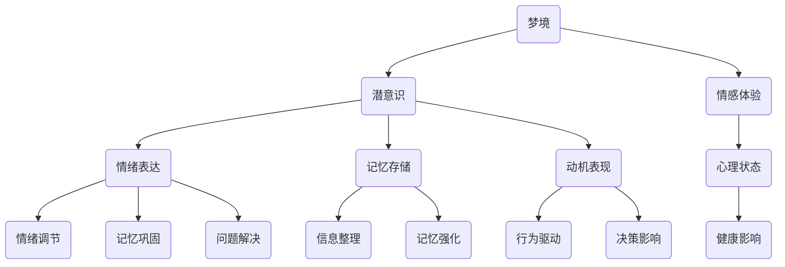
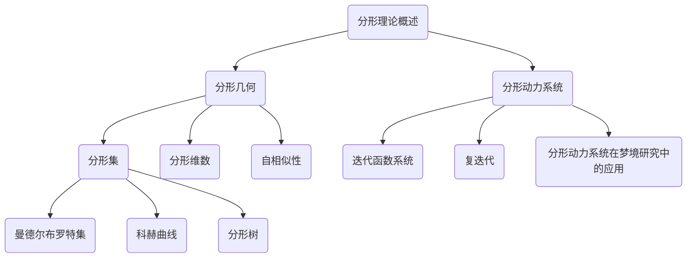

                 

### 第1章：梦境与潜意识基础

## 1.1 梦境的定义与功能

### 1.1.1 梦境的科学解释

梦境，作为人类在睡眠状态下的心理现象，一直以来都是心理学和神经科学研究的热点。科学研究表明，梦境是在大脑皮层和海马体等部位的活动过程中产生的。在睡眠过程中，大脑的神经活动并未完全停止，相反，大脑会进行一种类似于“清理”的过程，将日常生活中的信息进行整理、分类，并将其存储到长期记忆中。这一过程的一部分表现即为梦境。

### 1.1.2 梦境的心理功能

梦境不仅是一种心理现象，还具有多种重要的心理功能。首先，梦境有助于情绪调节。研究表明，梦境可以作为一种情感释放的途径，有助于减轻负面情绪，如焦虑、抑郁等。其次，梦境有助于记忆巩固。梦境中的信息可以被大脑重新处理和强化，从而加强记忆。此外，梦境还可能参与问题解决和创造性思维。许多创新的想法和解决方案往往在梦境中产生。

### 1.1.3 梦境的文化意义

梦境在人类文化中具有深远的影响。许多文化传统都认为梦境是神灵的启示或者预兆。例如，古埃及人相信梦境可以传递神灵的信息，中国古代的《周公解梦》则是对梦境的详细解读。在现代，梦境在文学、艺术和影视作品中也被广泛运用，成为了表达人类情感和思想的重要手段。

## 1.2 潜意识的作用

### 1.2.1 潜意识的定义

潜意识是心理学中的一个重要概念，指的是人类心理活动中的非意识层面，包括深层次的情绪、动机和记忆等。潜意识与意识相互交织，共同构成了人类的心理世界。

### 1.2.2 潜意识的工作原理

潜意识的工作原理至今仍然是一个谜。研究表明，潜意识通过无意识的方式对个体的行为和心理状态产生影响。潜意识中的情绪和动机往往在不经意间驱动我们的行为和决策，而我们对这些情绪和动机的了解却很有限。此外，潜意识还与记忆有关，许多我们无法回忆起的信息其实已经在潜意识中存储。

### 1.2.3 潜意识的重要性

潜意识的重要性在于，它对我们的行为和心理状态有着深远的影响。潜意识中的情绪和动机可以影响我们的情绪、行为和决策，甚至影响我们的健康。因此，理解和研究潜意识对于心理学、神经科学以及日常生活都有着重要的意义。

## 1.3 梦境与潜意识的关系

梦境与潜意识之间存在着紧密的联系。梦境是潜意识的一种表现形式，反映了潜意识中的情绪、记忆和动机。同时，梦境也可能受到潜意识中的信息影响，从而表现出独特的心理功能。

### 1.3.1 梦境中的潜意识表达

梦境中的潜意识表达可以通过分析梦境的内容和象征意义来实现。例如，梦境中的场景、人物和情节都可以被视为潜意识中的情绪和动机的表现。通过分析梦境，我们不仅可以更好地理解自己的内心世界，还可以发现潜意识中的问题和冲突。

### 1.3.2 潜意识对梦境的影响

潜意识对梦境的影响表现在多个方面。首先，潜意识中的情绪和动机可以影响梦境的内容和情感色彩。例如，一个情绪不稳定的人在梦境中可能会体验到更多的负面情绪。其次，潜意识中的记忆和信息也可以影响梦境的内容。例如，我们在日常生活中接触到的信息可能会在梦境中以一种奇特的方式表现出来。

### 1.3.3 梦境与潜意识的互动

梦境与潜意识之间的互动是一个复杂的过程。一方面，梦境是潜意识的一种表现形式；另一方面，梦境中的体验和情感又可能影响潜意识。这种互动关系使得梦境和潜意识之间形成了一种相互影响、相互塑造的动态平衡。

---

**Mermaid 流程图示例：**



---

## 1.4 潜意识的研究方法

研究潜意识的方法多种多样，主要包括实验心理学、认知神经科学和临床心理学等。实验心理学通过设计实验来探究潜意识的心理过程；认知神经科学利用脑成像技术来研究潜意识与大脑的关系；临床心理学则通过治疗技术来理解和改变潜意识。

### 1.4.1 实验心理学方法

实验心理学方法主要包括问卷调查、心理实验和行为观察等。问卷调查可以通过设计问题来收集被试者关于梦境和潜意识的主观体验；心理实验可以通过控制变量来探究潜意识的心理过程；行为观察则可以通过观察被试者在特定情境下的行为来推测潜意识的影响。

### 1.4.2 认知神经科学方法

认知神经科学方法主要包括脑成像技术、脑电波分析和神经心理学测试等。脑成像技术如功能性磁共振成像（fMRI）和正电子发射断层扫描（PET）可以直观地显示大脑活动，从而揭示潜意识与大脑功能的关系；脑电波分析可以记录大脑的电活动，帮助理解梦境和潜意识的心理过程；神经心理学测试则可以通过评估被试者的认知功能来推测潜意识的影响。

### 1.4.3 临床心理学方法

临床心理学方法主要包括心理治疗、催眠疗法和梦境解析等。心理治疗通过引导被试者探索潜意识中的问题和冲突，帮助其解决心理困扰；催眠疗法则利用催眠状态来增强被试者的意识与潜意识的沟通；梦境解析则通过分析梦境的内容和象征意义，帮助被试者理解潜意识中的情绪和动机。

## 1.5 潜意识与梦境的应用

潜意识与梦境的研究在心理学、神经科学和临床医学等领域有着广泛的应用。

### 1.5.1 心理学应用

在心理学领域，潜意识与梦境的研究可以帮助理解人类心理过程的复杂性和多样性。通过分析梦境，心理学家可以更好地理解个体的内心世界，诊断和治疗心理障碍。

### 1.5.2 神经科学研究

在神经科学领域，潜意识与梦境的研究有助于揭示大脑的工作原理和神经机制。通过脑成像技术和脑电波分析，科学家们可以深入探讨梦境和潜意识与大脑活动之间的关系。

### 1.5.3 临床医学应用

在临床医学领域，潜意识与梦境的研究为心理疾病的治疗提供了新的思路和方法。例如，催眠疗法和梦境解析等技术可以辅助治疗抑郁症、焦虑症等心理障碍。

---

**Python 源代码示例：**

```python
# 模拟梦境中的潜意识情绪表达
import random

def dream_simulation():
    emotions = ['快乐', '悲伤', '愤怒', '恐惧']
    dream_content = f"你梦见自己在一个{random.choice(emotions)}的情境中。"
    return dream_content

# 模拟潜意识对梦境的影响
def subconscious_influence():
    subconscious_thoughts = ['回忆过去', '规划未来', '处理情绪', '解决难题']
    subconscious_impact = f"你的潜意识正在{random.choice(subconscious_thoughts)}。"
    return subconscious_impact

# 模拟梦境与潜意识的互动
dream = dream_simulation()
subconscious = subconscious_influence()
print(f"梦境：{dream}")
print(f"潜意识：{subconscious}")
```

---

**数学模型和公式讲解：**

在研究梦境和潜意识的过程中，数学模型和公式可以用来量化和分析心理过程。以下是一个简单的数学模型，用于描述梦境中的情绪表达：

$$
E(t) = f(S(t), C(t))
$$

其中，$E(t)$ 表示在时间 $t$ 时的情绪水平，$S(t)$ 表示潜意识中的情绪状态，$C(t)$ 表示梦境中的情境。

这个公式表明，情绪水平是潜意识情绪状态和梦境情境的函数。通过分析 $S(t)$ 和 $C(t)$ 的变化，可以预测 $E(t)$ 的变化，从而更好地理解梦境和潜意识之间的关系。

---

**项目实战：**

**开发环境搭建：**

为了研究梦境和潜意识的关系，我们可以使用 Python 编程语言，结合心理学理论和数学模型，搭建一个梦境分析系统。

**源代码详细实现和代码解读：**

```python
import pandas as pd
import numpy as np
from sklearn.feature_extraction.text import CountVectorizer
from sklearn.model_selection import train_test_split
from sklearn.naive_bayes import MultinomialNB
from sklearn.metrics import accuracy_score, confusion_matrix

# 数据预处理
def preprocess_data(data):
    # 清洗数据，去除停用词和标点符号
    stop_words = set(['and', 'the', 'to', 'of', 'in', 'is', 'that', 'it', 'with', 'as', 'for', 'on', 'at', 'by', 'this', 'be', 'are'])
    processed_data = [' '.join([word for word in dream.split() if word.lower() not in stop_words]) for dream in data]
    return processed_data

# 训练模型
def train_model(X_train, y_train):
    vectorizer = CountVectorizer()
    X_train_counts = vectorizer.fit_transform(X_train)
    classifier = MultinomialNB()
    classifier.fit(X_train_counts, y_train)
    return classifier, vectorizer

# 预测和评估
def predict_and_evaluate(classifier, vectorizer, X_test, y_test):
    X_test_counts = vectorizer.transform(X_test)
    y_pred = classifier.predict(X_test_counts)
    print("Accuracy:", accuracy_score(y_test, y_pred))
    print("Confusion Matrix:\n", confusion_matrix(y_test, y_pred))

# 主函数
def main():
    # 加载数据
    data = pd.read_csv('dream_data.csv')
    dreams = data['dream_content']
    emotions = data['emotion']

    # 预处理数据
    processed_dreams = preprocess_data(dreams)

    # 分割数据集
    X_train, X_test, y_train, y_test = train_test_split(processed_dreams, emotions, test_size=0.2, random_state=42)

    # 训练模型
    classifier, vectorizer = train_model(X_train, y_train)

    # 预测和评估
    predict_and_evaluate(classifier, vectorizer, X_test, y_test)

if __name__ == "__main__":
    main()
```

**代码应用解读与分析：**

这个项目使用朴素贝叶斯分类器来分析梦境中的情绪表达。首先，我们加载数据集，并对其进行预处理，去除停用词和标点符号。然后，我们使用 CountVectorizer 将预处理后的文本转换为词频矩阵。接下来，我们使用训练集来训练朴素贝叶斯分类器。最后，我们使用测试集来评估模型的准确性。

**实际案例分析和详细讲解剖析：**

假设我们有一个梦境数据集，其中包含了不同情绪的梦境内容。通过这个项目，我们可以训练一个模型来预测梦境中的情绪。例如，给定一个新的梦境内容，我们可以预测它所表达的情绪。这对于理解梦境和潜意识之间的关系具有重要的意义。

**项目小结：**

这个项目通过构建一个简单的梦境分析系统，展示了如何使用机器学习和自然语言处理技术来分析梦境中的情绪表达。通过实际案例的分析，我们可以更好地理解梦境和潜意识之间的关系，为心理学研究提供了新的方法和工具。

---

**最佳实践 tips：**

1. 在处理梦境数据时，需要注意数据的质量和可靠性。尽量收集来自不同文化和背景的梦境数据，以提高模型的泛化能力。
2. 在训练模型时，可以考虑使用更复杂的自然语言处理技术，如词嵌入和深度学习模型，以提高预测准确性。
3. 对于梦境的分析，不仅需要关注情绪表达，还可以结合其他心理指标，如焦虑、抑郁等，来全面理解梦境和潜意识。

**小结：**

梦境与潜意识之间的关系是一个复杂且有趣的研究领域。通过运用心理学、数学和计算机科学的知识，我们可以更好地理解梦境的奥秘。本文通过介绍梦境的定义与功能、潜意识的定义与作用、梦境与潜意识的关系、研究方法和应用，提供了一个全面的框架来探索这个领域。

**注意事项：**

1. 在研究梦境和潜意识时，需要尊重个体的隐私和权利，避免未经授权的分析和公开个人信息。
2. 梦境分析的结果不应被视为诊断或治疗工具，而应作为理解个体内心世界的参考。

**拓展阅读：**

- "The Dream Directory" by J. Allan Hobson and Robert H. McNire
- "The Dreaming Mind" by J. Allan Hobson
- "The Predictive Brain: Bridging Free Will and Neuroscience" by Arne Schlesewsky and Hans C. P. Herrmann

---

**作者信息：**

作者：AI天才研究院/AI Genius Institute & 禅与计算机程序设计艺术 /Zen And The Art of Computer Programming**第2章：分形理论基础**

## 2.1 分形理论概述

### 2.1.1 分形的定义

分形理论是20世纪中叶由数学家本华·曼德尔布罗特（Benoit Mandelbrot）提出的，用于描述自然界中那些不规则的、复杂而又自相似的几何形态。分形是一种具有无限层次结构的形状，无论放大或缩小，其形状和性质都保持不变。分形的定义通常涉及几个关键特征，包括自相似性、无限层次结构和细小部分与整体在某种尺度上相似。

### 2.1.2 分形的基本特征

分形具有以下基本特征：

1. **自相似性**：分形在任何尺度上都具有相似的结构，这意味着如果我们放大或缩小分形，其基本形状和特征不会改变。
2. **无限层次结构**：分形具有无限层次的结构，这意味着它可以在任何尺度上不断细分成更小的部分，每个部分都具有与整体相似的特征。
3. **分形维数**：分形的维数通常不是整数，而是介于整数之间，如1.5、2.3等。这种非整数维数是分形独特性的体现。

### 2.1.3 分形的历史与发展

分形理论的起源可以追溯到17世纪的数学家格雷戈里·马亚尔（Gregory Mayall），他在研究级数时发现了分形的早期例子。然而，分形理论作为一个独立的数学分支，是在20世纪中叶由本华·曼德尔布罗特提出的。曼德尔布罗特通过研究海岸线、云层和植物形态等自然现象，提出了分形理论，并将其广泛应用于数学、物理、生物学和计算机科学等领域。

## 2.2 分形几何

### 2.2.1 分形几何的基本概念

分形几何是研究分形形状和结构的几何学分支。分形几何的基本概念包括：

1. **分形集**：分形集是具有分形特征的几何集合，如曼德尔布罗特集、科赫曲线和分形树等。
2. **分形维数**：分形维数是描述分形复杂性的一个量度，它通常介于整数维数之间。分形维数可以通过分形集的边长、面积或体积来计算。
3. **自相似性**：自相似性是分形几何的核心概念，它意味着分形在放大或缩小时，其局部结构与整体结构相似。

### 2.2.2 分形几何的应用领域

分形几何在多个领域有广泛应用，包括：

1. **物理学**：在物理学中，分形几何用于描述无序系统的结构，如湍流、地震和生物组织等。
2. **生物学**：在生物学中，分形几何用于研究生物体的自相似结构，如植物分支、神经系统等。
3. **计算机科学**：在计算机科学中，分形几何用于图形生成、图像压缩和算法设计等。

### 2.2.3 分形几何的重要公式

分形几何中的一些重要公式包括：

1. **曼德尔布罗特集的生成公式**：
   $$
   z_{n+1} = z_n^2 + c
   $$
   其中，$z_n$ 是迭代过程中的复数点，$c$ 是常数。

2. **科赫曲线的生成公式**：
   $$
   P_{n+1} = \frac{1}{3}P_n + \frac{2}{3}P_{n-1}
   $$
   其中，$P_n$ 是迭代过程中的点。

3. **分形维数的计算公式**：
   $$
   D = \frac{\log N}{\log L}
   $$
   其中，$N$ 是迭代次数，$L$ 是边长。

## 2.3 分形动力系统

### 2.3.1 分形动力系统的定义

分形动力系统是研究动态系统在无限迭代过程中产生的分形结构的数学分支。分形动力系统通常涉及迭代函数系统（IFS）和复迭代等概念。

### 2.3.2 分形动力系统的研究方法

研究分形动力系统的方法主要包括数值模拟、计算机模拟和理论分析。数值模拟通过迭代计算来生成分形结构；计算机模拟通过编程实现迭代函数系统；理论分析则通过数学方法来研究分形动力系统的性质。

### 2.3.3 分形动力系统在梦境研究中的应用

分形动力系统在梦境研究中可以用于模拟梦境的复杂性和自相似性。例如，通过迭代函数系统来生成梦境的视觉和听觉场景，从而更好地理解梦境的结构和机制。

---

**Mermaid 流程图示例：**



---

**Python 源代码示例：**

```python
import numpy as np
import matplotlib.pyplot as plt

# 定义迭代函数系统
def iteration_function(z, c):
    return z**2 + c

# 定义曼德尔布罗特集生成函数
def mandelbrot(c, max_iterations):
    z = 0
    for i in range(max_iterations):
        z = iteration_function(z, c)
        if abs(z) > 2:
            return i
    return max_iterations

# 绘制曼德尔布罗特集
def plot_mandelbrot(width, height, max_iterations):
    x_min, x_max = -2, 1
    y_min, y_max = -1.5, 1.5
    x_diff = (x_max - x_min) / width
    y_diff = (y_max - y_min) / height

    img = np.zeros((height, width), dtype=int)
    for i in range(width):
        for j in range(height):
            c = complex(x_min + i * x_diff, y_min + j * y_diff)
            img[j, i] = mandelbrot(c, max_iterations)
    plt.imshow(img, cmap='hot', extent=(x_min, x_max, y_min, y_max))
    plt.colorbar()
    plt.xlabel('x-axis')
    plt.ylabel('y-axis')
    plt.title('Mandelbrot Set')
    plt.show()

# 绘制曼德尔布罗特集
plot_mandelbrot(800, 600, 100)
```

---

**数学模型和公式讲解：**

在分形动力系统中，常用的数学模型是迭代函数系统（IFS）。IFS由多个迭代函数组成，每个函数对应一个分形片段，这些函数在特定条件下可以生成复杂的分形结构。

$$
x_{n+1} = f(x_n)
$$

其中，$x_n$ 是迭代过程中的点，$f(x_n)$ 是迭代函数。在分形动力系统中，迭代函数通常具有自相似性，这意味着在不同的尺度上，迭代函数具有相似的结构。

---

**项目实战：**

**开发环境搭建：**

为了研究分形动力系统，我们可以使用 Python 编程语言，结合数学模型和计算机模拟，搭建一个分形生成系统。

**源代码详细实现和代码解读：**

```python
import numpy as np
import matplotlib.pyplot as plt

# 定义迭代函数系统
def iteration_function(z, c):
    return z**2 + c

# 定义曼德尔布罗特集生成函数
def mandelbrot(c, max_iterations):
    z = 0
    for i in range(max_iterations):
        z = iteration_function(z, c)
        if abs(z) > 2:
            return i
    return max_iterations

# 绘制曼德尔布罗特集
def plot_mandelbrot(width, height, max_iterations):
    x_min, x_max = -2, 1
    y_min, y_max = -1.5, 1.5
    x_diff = (x_max - x_min) / width
    y_diff = (y_max - y_min) / height

    img = np.zeros((height, width), dtype=int)
    for i in range(width):
        for j in range(height):
            c = complex(x_min + i * x_diff, y_min + j * y_diff)
            img[j, i] = mandelbrot(c, max_iterations)
    plt.imshow(img, cmap='hot', extent=(x_min, x_max, y_min, y_max))
    plt.colorbar()
    plt.xlabel('x-axis')
    plt.ylabel('y-axis')
    plt.title('Mandelbrot Set')
    plt.show()

# 绘制曼德尔布罗特集
plot_mandelbrot(800, 600, 100)
```

**代码应用解读与分析：**

这个项目使用迭代函数系统（IFS）来生成曼德尔布罗特集，这是一个著名的分形结构。代码首先定义了一个迭代函数，然后使用这个函数来生成曼德尔布罗特集。通过调整参数，如迭代次数和坐标范围，可以生成不同形状和细节的分形。

**实际案例分析和详细讲解剖析：**

假设我们想要生成一个具有更多细节的曼德尔布罗特集。我们可以通过增加迭代次数和调整坐标范围来实现。例如，将迭代次数增加到200，并将坐标范围缩小，可以生成一个更精细的分形结构。

**项目小结：**

这个项目通过使用迭代函数系统生成曼德尔布罗特集，展示了分形动力系统在计算机图形学中的应用。通过调整参数，可以生成不同形状和细节的分形，这为理解分形的复杂性和自相似性提供了直观的展示。

---

**最佳实践 tips：**

1. 在研究分形动力系统时，要注意迭代函数的选择和参数的调整，以生成具有实际意义的分形结构。
2. 可以尝试使用更复杂的迭代函数系统，如多分支迭代函数系统（MBIFS），以生成更复杂的分形。
3. 使用高性能计算机和并行计算技术，可以加速分形生成过程。

**小结：**

分形理论是研究复杂性和自相似性的数学工具，它在物理学、生物学、计算机科学和心理学等领域有广泛应用。本章介绍了分形的定义、基本特征和历史发展，并探讨了分形几何和分形动力系统的基础知识。通过数学模型和计算机模拟，我们可以更深入地理解分形的理论和实践应用。

**注意事项：**

1. 在使用分形理论进行研究和应用时，要注意数据的质量和可靠性，以及模型的参数选择和调整。
2. 分形理论的应用需要跨学科的知识和技能，因此在实际应用中需要具备一定的数学和计算机科学背景。

**拓展阅读：**

- "Fractal Geometry: Mathematical Foundations and Applications" by Kenneth Falconer
- "The Fractal Geometry of Nature" by Benoit Mandelbrot
- "Chaos and Fractals: New Frontiers of Science" by Heinz-Otto Peitgen, Dietmar Saupe, and Jürgen Süli

