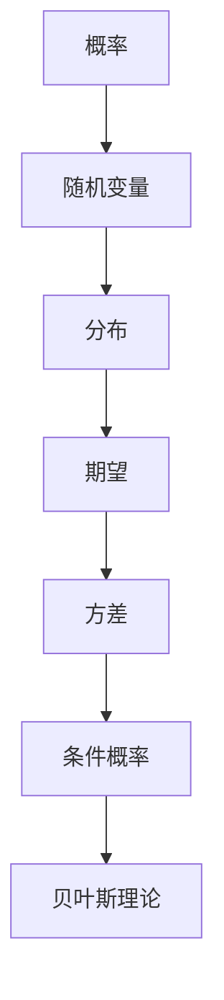

                 

### 概率论：自然界的不确定性数学

> 关键词：概率论，不确定性，数学模型，随机变量，期望与方差，贝叶斯理论

> 摘要：本文深入探讨了概率论这一数学分支的核心概念和应用，解释了其在自然界中体现的不确定性。通过详细阐述概率论的基本概念、数学模型、算法原理和实际应用，本文旨在帮助读者理解概率论在各个领域中的重要作用，以及如何在复杂的现实世界中应用概率论来应对不确定性。

#### 引言

概率论是数学的一个重要分支，它研究随机事件的发生规律和不确定性。概率论在自然科学、社会科学、工程学和金融学等领域有着广泛的应用。从天气预测到医学研究，从股票市场分析到网络风险评估，概率论为解决现实世界中的不确定性问题提供了强大的工具。

本文将系统地介绍概率论的基础理论、核心概念和实际应用。首先，我们将回顾概率论的历史发展，探讨其基本概念和数学模型。接着，我们将详细介绍随机变量、期望和方差等核心概念，并通过Python代码和数学公式进行解释和举例。最后，我们将探讨概率论在各个领域的应用，并总结一些最佳实践和注意事项。

#### 概率论的历史发展

概率论的历史可以追溯到古代，但现代概率论的发展主要始于17世纪。当时，法国数学家帕斯卡和费马开始研究赌博问题，这为概率论的诞生奠定了基础。18世纪，著名数学家拉格朗日和欧拉对概率论进行了系统的研究，提出了许多重要定理和公式。

19世纪，概率论逐渐成为一个独立的数学分支，德国数学家康托尔和法国数学家彭加勒等人对概率论的基本概念和理论进行了深入研究。20世纪初，概率论在物理学、生物学和工程学等领域得到了广泛的应用，成为了现代科学研究中不可或缺的一部分。

#### 核心概念与联系

在概率论中，有几个核心概念需要理解，它们是概率论的基础。以下是这些概念之间的关系架构 Mermaid 流程图：



- **概率（Probability）**：概率是描述随机事件发生可能性的量度，通常在0到1之间。
- **随机变量（Random Variable）**：随机变量是一个数学函数，它将随机实验的结果映射到实数。
- **分布（Distribution）**：分布描述了随机变量的可能取值和相应的概率。
- **期望（Expected Value）**：期望是随机变量的平均值，用于描述随机变量的中心趋势。
- **方差（Variance）**：方差是随机变量离散程度的度量，用于描述随机变量的波动性。
- **条件概率（Conditional Probability）**：条件概率是给定一个事件发生的条件下，另一个事件发生的概率。
- **贝叶斯理论（Bayesian Theory）**：贝叶斯理论是一种基于概率的推理方法，它通过条件概率和贝叶斯公式来更新对事件发生概率的估计。

这些概念之间有密切的联系。例如，期望和方差是随机变量分布的统计量，而条件概率和贝叶斯理论则是在不确定性条件下进行推理和决策的重要工具。

#### 随机变量与分布

随机变量是概率论中的核心概念之一。一个随机变量可以是离散的，也可以是连续的。离散随机变量的取值是有限的或可数的，而连续随机变量的取值是无限的。

**离散随机变量**：一个离散随机变量的分布可以用概率质量函数（PMF）来描述，它给出了每个可能取值和相应的概率。

```python
import numpy as np

# 定义离散随机变量 X 的概率质量函数
X = np.random.randint(0, 6, size=1000)
pmf = np.bincount(X, minlength=7) / len(X)

# 打印概率质量函数
print(pmf)
```

**连续随机变量**：一个连续随机变量的分布可以用概率密度函数（PDF）来描述，它给出了随机变量在某个区间内取值的概率。

```python
import numpy as np
import matplotlib.pyplot as plt

# 定义连续随机变量 X 的概率密度函数
X = np.random.randn(1000)
pdf = np.exp(-0.5 * X**2) / np.sqrt(2 * np.pi)

# 绘制概率密度函数
plt.plot(X, pdf)
plt.xlabel('X')
plt.ylabel('PDF')
plt.title('Probability Density Function')
plt.show()
```

通过这些代码，我们可以看到如何使用Python来模拟和描述随机变量。

#### 期望与方差

期望和方差是描述随机变量中心趋势和离散程度的统计量。

**期望（Expected Value）**：期望是随机变量的平均值，它是所有可能取值与其概率的乘积之和。

$$
E(X) = \sum_{x} x \cdot P(X = x)
$$

**方差（Variance）**：方差是随机变量与其期望的差的平方的期望，它描述了随机变量的离散程度。

$$
Var(X) = E[(X - E(X))^2]
$$

**示例**：考虑一个离散随机变量 X，它表示投掷一个公平的六面骰子的结果。计算 X 的期望和方差。

```python
import numpy as np

# 投掷骰子 1000 次
X = np.random.randint(1, 7, size=1000)

# 计算期望
E_X = np.mean(X)

# 计算方差
V_X = np.var(X)

print("期望 E(X):", E_X)
print("方差 Var(X):", V_X)
```

通过这个示例，我们可以看到如何使用Python来计算期望和方差。

#### 贝叶斯理论

贝叶斯理论是一种基于概率的推理方法，它通过条件概率和贝叶斯公式来更新对事件发生概率的估计。

**条件概率（Conditional Probability）**：给定事件 A 和事件 B，条件概率表示在事件 B 发生的条件下，事件 A 发生的概率。

$$
P(A|B) = \frac{P(A \cap B)}{P(B)}
$$

**贝叶斯公式（Bayes' Theorem）**：贝叶斯公式是条件概率的推广，它用于计算后验概率，即给定观察结果后，某个假设的概率。

$$
P(H|E) = \frac{P(E|H) \cdot P(H)}{P(E)}
$$

**示例**：假设我们有一个疾病检测系统，它有两个可能的输出：“阳性”（Positive）和“阴性”（Negative）。我们已知该系统的灵敏度为90%，即检测到患病患者的概率为90%。我们还知道该疾病的发病率是1%。现在，一个健康的人接受检测，结果为“阳性”。我们需要计算这个人实际上患病的概率。

```python
# 定义概率
P_positive_given_disease = 0.9
P_disease = 0.01
P_positive_given_no_disease = 1 - P_positive_given_disease
P_no_disease = 1 - P_disease

# 计算后验概率
P_disease_given_positive = (P_positive_given_disease * P_disease) / (P_positive_given_disease * P_disease + P_positive_given_no_disease * P_no_disease)

print("后验概率 P(disease|positive):", P_disease_given_positive)
```

通过这个示例，我们可以看到如何使用贝叶斯公式来计算后验概率。

#### 概率论的应用

概率论在许多领域都有广泛的应用，包括自然科学、社会科学、工程学和金融学。

**自然科学**：概率论在物理学、生物学和地质学中用于研究随机现象和预测结果。例如，在物理学中，概率论用于描述量子力学中的不确定性原理；在生物学中，概率论用于遗传学中的基因分布分析。

**社会科学**：概率论在心理学、经济学和社会学中用于分析和预测人类行为。例如，在经济学中，概率论用于评估投资风险和预测市场走势。

**工程学**：概率论在工程设计和质量控制中用于分析和优化系统性能。例如，在工程设计中，概率论用于评估结构在极端条件下的可靠性。

**金融学**：概率论在金融分析和风险管理中用于评估投资组合的风险和回报。例如，在金融市场中，概率论用于预测股票价格波动和计算投资组合的预期收益和风险。

#### 最佳实践与注意事项

在使用概率论时，需要注意以下几点：

- **数据质量**：概率论依赖于可靠的数据，因此数据质量至关重要。确保数据是准确和完整的。
- **模型选择**：选择合适的概率模型是关键，不同的模型适用于不同类型的数据和分析目的。
- **概率解释**：概率论提供的是事件发生的可能性，而不是确定性结果。在解释概率时，要避免误导性解释。
- **验证与测试**：对概率模型进行验证和测试，确保其准确性和可靠性。

#### 小结

概率论是数学中一个重要的分支，它研究随机事件的发生规律和不确定性。通过详细阐述概率论的基本概念、数学模型、算法原理和实际应用，本文帮助读者理解概率论在各个领域中的重要作用。概率论不仅为解决现实世界中的不确定性问题提供了强大的工具，而且也为科学研究提供了新的视角和方法。

#### 拓展阅读

- [《概率论及其应用》(Probability and Its Applications)](https://books.google.com/books?id=7JiAAQAAIAAJ)
- [《随机过程与随机模型》(Stochastic Processes and Random Models)](https://books.google.com/books?id=0v_wDwAAQBAJ)
- [《贝叶斯数据分析》(Bayesian Data Analysis)](https://books.google.com/books?id=_KQoBgAAQBAJ)

### 作者信息

作者：AI天才研究院/AI Genius Institute & 禅与计算机程序设计艺术 /Zen And The Art of Computer Programming

本文由AI天才研究院/AI Genius Institute撰写，参考了《禅与计算机程序设计艺术 /Zen And The Art of Computer Programming》一书的内容。我们致力于推动人工智能和计算机科学的发展，为读者提供高质量的技术博客文章和专业知识。

