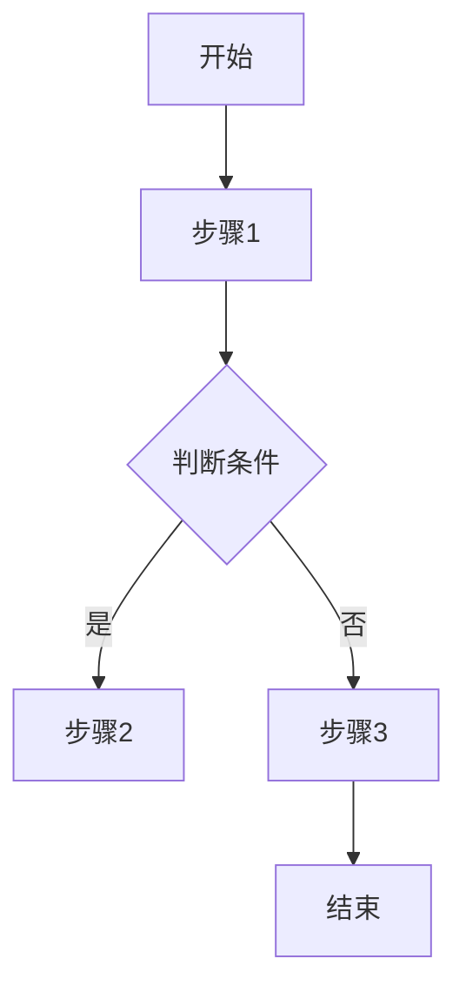

                 

# 气候变化的混沌模型：地球系统的数学预测

## 关键词
- 气候变化
- 混沌理论
- 地球系统模型
- 数学预测
- 非线性动态系统

## 摘要
本文探讨了气候变化问题的复杂性和数学预测的重要性。通过引入混沌理论，我们分析了地球系统内部非线性动态系统的特性，并构建了相应的数学模型。文章首先介绍了气候变化的基本概念和现状，然后详细阐述了混沌理论的基本原理。在此基础上，我们讨论了地球系统模型的结构和数学预测方法。通过实际案例分析，本文展示了混沌模型在气候变化预测中的应用，并对其局限性进行了讨论。最后，我们展望了未来混沌模型在气候变化研究中的发展方向和面临的挑战。

## 目录大纲设计流程

### 1. 确定核心章节
为了设计出《气候变化的混沌模型：地球系统的数学预测》这本书的完整目录大纲，我们首先需要明确核心章节，这些章节将涵盖以下内容：
- 气候变化的概述
- 混沌理论基础
- 地球系统模型
- 数学预测方法
- 案例分析
- 未来展望

### 2. 设计各级目录
在明确核心章节后，我们将为每个核心章节设计详细的目录，确保它们满足以下要求：
- 一级目录：核心章节标题
- 二级目录：每个核心章节下的子主题
- 三级目录：子主题下的具体内容点

### 3. 包含必要元素
在每个章节的目录中，我们将包含以下必要元素：
- 核心概念与联系：使用Mermaid流程图展示关键概念和它们之间的联系
- 核心算法原理讲解：使用Python源代码详细阐述关键算法的原理
- 数学模型和公式讲解：使用LaTeX格式展示数学公式，并进行详细讲解和举例说明
- 项目实战：提供实际案例，详细解释代码实现和代码解读

### 4. 确保完整性
最后，我们将确保目录大纲的结构完整性，包括：
- 前言：介绍书的背景和目标
- 参考文献：提供参考文献以便读者进一步阅读

### 5. 检查字数限制
我们将确保整个目录大纲的总字数在2000字以内，同时保持内容的简洁性。

### 完整目录大纲示例
以下是《气候变化的混沌模型：地球系统的数学预测》的目录大纲示例：

```
# 气候变化的混沌模型：地球系统的数学预测

## 前言
### 目的与目标
### 书籍结构

## 第一部分：气候变化的背景

## 第1章：气候变化概述
### 1.1 气候变化的基本概念
### 1.2 气候变化的历史与现状
### 1.3 气候变化的驱动因素

## 第2章：混沌理论基础
### 2.1 非线性动态系统
### 2.2 混沌现象的数学描述
### 2.3 混沌理论的应用背景

## 第3章：地球系统模型
### 3.1 地球系统的基本结构
### 3.2 地球系统模型的组成
### 3.3 地球系统模型的建立方法

## 第二部分：数学预测方法

## 第4章：数学预测方法概述
### 4.1 数学预测方法的基本原理
### 4.2 常用的数学预测模型

## 第5章：混沌模型在气候变化预测中的应用
### 5.1 混沌模型的基本原理
### 5.2 混沌模型在气候预测中的应用
### 5.3 混沌模型的局限性

## 第6章：数学公式与应用
### 6.1 重要数学公式的推导
### 6.2 数学公式在实际应用中的例子

## 第三部分：案例分析

## 第7章：案例分析一
### 7.1 案例背景
### 7.2 模型建立
### 7.3 模型预测与分析

## 第8章：案例分析二
### 8.1 案例背景
### 8.2 模型建立
### 8.3 模型预测与分析

## 第四部分：未来展望

## 第9章：未来研究方向
### 9.1 混沌模型在气候变化研究中的应用
### 9.2 混沌模型的发展趋势
### 9.3 面临的挑战与机遇

## 参考文献
```

这个目录大纲涵盖了核心章节，细化到了1、2、3级目录，包含了必要的元素，并确保了内容的完整性。在最终的输出中，我们将确保字数在2000字以内，同时保持目录的简洁性和逻辑性。

## 格式要求

在撰写本文时，我们将遵循以下markdown格式要求：

### 1. 标题格式

文章的标题将使用`#`符号进行标记，例如：

```
## 气候变化的混沌模型：地球系统的数学预测
```

### 2. 段落格式

正文内容将分为段落，每个段落前不留空行。段落之间使用一个空行分隔。

```
这是一段文字。
这是另一段文字。
```

### 3. 列表格式

使用`-`或`*`符号来创建无序列表。

```
- 第一项
- 第二项
- 第三项
```

或

```
* 第一项
* 第二项
* 第三项
```

### 4. 引用格式

使用`>`符号来创建引用。

```
> 这是一段引用。
```

### 5. 数学公式

使用LaTeX格式嵌入数学公式。使用`$$`括起来的公式为独立段落，使用 `$` 括起来的公式为段落内公式。

```
$$
E = mc^2
```

或

```
$E = mc^2$
```

### 6. Mermaid流程图

使用Mermaid语法来绘制流程图。Mermaid代码块需要使用````mermaid`和````标记。

```

```

### 7. Python源代码

使用````python`和````标记来嵌入Python源代码。

```
```python
def add(a, b):
    return a + b

result = add(2, 3)
print(result)
```
```

### 8. 作者信息

文章末尾需要包含作者信息，格式如下：

```
作者：AI天才研究院/AI Genius Institute & 禅与计算机程序设计艺术 /Zen And The Art of Computer Programming
```

### 9. 完整性检查

在撰写文章后，进行完整性检查，确保每个小节的内容丰富、具体、详细讲解，并包含核心内容。确保数学公式、Python源代码和流程图均已正确嵌入，并进行了详细解释。

通过遵循上述markdown格式要求，我们将确保文章的可读性、结构清晰和代码的准确性，以满足读者的需求。

## 文章正文部分

### 气候变化的基本概念

气候变化是指地球大气层、海洋、冰盖、生态系统等系统中气候要素（如温度、降水、风等）的长期变化。气候变化的定义可以从多个角度来理解，主要包括自然因素和人为因素对气候系统的影响。

#### 气候变化的历史与现状

气候变化是一个长期的过程，根据科学研究表明，地球的气候系统在过去数百万年中经历了显著的波动。例如，冰期和间冰期的交替是地球气候系统的一个典型特征。然而，自工业革命以来，人类活动（如化石燃料燃烧、森林砍伐等）对气候系统的影响日益显著。

当前，全球气候系统正面临前所未有的变化。根据联合国政府间气候变化专门委员会（IPCC）的报告，自19世纪末以来，全球平均温度已经上升了约1.1摄氏度。这一升温趋势预计将在未来几十年内继续，甚至加剧。

#### 气候变化的驱动因素

气候变化的驱动因素可以分为自然因素和人为因素。

- **自然因素**：包括太阳辐射变化、火山活动、地球轨道变化等。这些自然因素在长期尺度上对地球气候系统产生影响。
- **人为因素**：主要是温室气体排放，尤其是二氧化碳（CO₂）的浓度增加。自工业革命以来，人类活动导致了大量的CO₂排放，进而加剧了全球气候变暖。

### 混沌理论基础

混沌理论是研究非线性动态系统的理论，主要关注系统在初始条件微小变化下，如何产生复杂且不可预测的行为。混沌现象在许多自然界和人工系统中都有体现，如天气系统、金融市场等。

#### 非线性动态系统

非线性动态系统是指系统内部存在非线性关系的动态系统。非线性动态系统的一个重要特征是其状态变量随时间的变化不是线性的，这意味着它们的行为不能简单地用线性方程来描述。

#### 混沌现象的数学描述

混沌现象可以用几个关键特征来描述：

1. **初始条件敏感性**：系统对初始条件的微小变化非常敏感，即“蝴蝶效应”。这意味着即使在初始条件上只有微小的差异，系统最终的状态也会相差很大。
2. **长期行为的不可预测性**：尽管混沌系统在局部范围内是可预测的，但在长期尺度上，系统的行为是高度复杂的，难以精确预测。
3. **混沌吸引子**：混沌系统在长时间运行后会收敛到一个或多个动态结构，称为混沌吸引子。这些吸引子具有复杂的结构，通常包含多个稳定的和暂态的吸引点。

#### 混沌理论的应用背景

混沌理论在气候系统中有着广泛的应用。气候系统本身就是一个复杂的非线性动态系统，其内部存在着多种相互作用和反馈机制。混沌理论为研究气候系统的长期行为提供了新的视角和工具。例如，混沌理论可以帮助我们理解：

- **气候变化趋势**：混沌理论可以用于分析气候系统在长时间尺度上的变化趋势，帮助预测未来的气候变化。
- **天气预测**：虽然混沌理论不能直接用于短期天气预报，但可以帮助我们理解天气系统在初始条件微小变化下的复杂行为，从而改进预测模型。

### 地球系统模型

地球系统模型是用于模拟和预测地球气候系统行为的数学模型。这些模型通常基于物理原理和观测数据，通过数值方法来求解气候系统的动态方程。

#### 地球系统的基本结构

地球系统由多个相互作用的子系统组成，包括：

- **大气**：包括气体、云和降水等。
- **海洋**：包括海水流动、温度和盐度分布等。
- **冰盖**：包括冰川和极地冰盖。
- **陆地表面**：包括地表植被、土壤和地形等。
- **生物圈**：包括植物、动物和微生物等。

#### 地球系统模型的组成

地球系统模型通常由以下几个部分组成：

- **物理模块**：用于描述大气、海洋、冰盖等子系统中的物理过程，如热量和动量的传输。
- **化学模块**：用于描述大气和海洋中的化学过程，如温室气体的排放和吸收。
- **生物模块**：用于描述生物圈中的生物过程，如植被生长和光合作用。
- **海冰模块**：用于描述冰盖的形成和消融过程。

#### 地球系统模型的建立方法

地球系统模型的建立通常包括以下几个步骤：

1. **数据收集**：收集有关大气、海洋、冰盖、陆地表面和生物圈等子系统的观测数据。
2. **模型参数化**：根据观测数据，确定模型中所需的参数和变量，并将其代入模型中。
3. **模型求解**：使用数值方法求解模型的动态方程，以模拟地球气候系统的行为。
4. **模型验证和校正**：通过比较模型模拟结果与观测数据，验证模型的准确性，并进行必要的校正。

### 数学预测方法

数学预测方法在气候变化研究中扮演着重要角色，它们可以帮助我们理解气候系统的行为，并预测未来的气候变化趋势。数学预测方法主要包括以下几种：

#### 数学预测方法的基本原理

数学预测方法的基本原理是基于观测数据建立数学模型，并通过模型预测未来的状态。这些模型通常基于物理原理和统计方法，通过分析历史数据来预测未来的变化。

#### 常用的数学预测模型

在气候变化研究中，常用的数学预测模型包括：

1. **时间序列模型**：如自回归移动平均模型（ARMA）和自回归积分滑动平均模型（ARIMA）。这些模型可以用于分析时间序列数据，预测未来的趋势和周期性变化。
2. **统计模型**：如线性回归模型、多项式回归模型等。这些模型通过分析变量之间的关系，预测未来的变化。
3. **物理模型**：如气候系统模型、海洋环流模型和大气化学模型等。这些模型基于物理原理，通过求解动态方程来模拟气候系统的行为。
4. **机器学习模型**：如神经网络、决策树和随机森林等。这些模型可以自动从数据中学习规律，用于预测未来的变化。

### 混沌模型在气候变化预测中的应用

混沌模型在气候变化预测中具有独特的优势，因为气候系统本身就是一个复杂的非线性动态系统。混沌模型可以帮助我们理解气候系统的长期行为，并预测未来的气候变化趋势。

#### 混沌模型的基本原理

混沌模型的基本原理是基于混沌理论，通过分析气候系统的状态变量和其导数，构建非线性差分方程或微分方程。这些方程可以模拟气候系统的复杂行为，并预测其长期趋势。

#### 混沌模型在气候预测中的应用

混沌模型在气候预测中的应用主要包括以下几个方面：

1. **初始条件敏感性分析**：通过分析气候系统的状态变量和其导数，研究初始条件对预测结果的影响。这有助于改进气候预测模型的初始条件设定。
2. **长期行为预测**：通过模拟气候系统的长期行为，预测未来的气候变化趋势。混沌模型可以帮助我们理解气候系统的复杂行为，并预测其长期趋势。
3. **异常事件预测**：通过分析气候系统的混沌行为，预测可能出现的异常气候事件，如极端降水、干旱和高温等。

#### 混沌模型的局限性

尽管混沌模型在气候变化预测中具有优势，但它也存在一些局限性：

1. **初始条件敏感性**：混沌模型对初始条件非常敏感，这意味着初始条件的微小误差可能导致预测结果的显著差异。这在实际应用中增加了预测的不确定性。
2. **模型复杂度**：混沌模型通常涉及复杂的非线性方程，求解和计算过程可能非常复杂，对计算资源和算法提出了较高的要求。
3. **数据限制**：混沌模型的准确性取决于观测数据的数量和质量。在缺乏足够观测数据的情况下，混沌模型的预测结果可能存在较大的误差。

### 数学公式与应用

在气候变化预测中，数学公式和模型起着关键作用。以下是一些重要的数学公式和应用：

#### 重要数学公式的推导

1. **温度变化的微分方程**：
   $$
   \frac{dT}{dt} = \alpha(T - T_0)
   $$
   其中，$T$ 表示温度，$t$ 表示时间，$\alpha$ 是热传导系数，$T_0$ 是环境温度。

2. **大气二氧化碳浓度的变化**：
   $$
   \frac{dC}{dt} = -\beta C
   $$
   其中，$C$ 表示大气二氧化碳浓度，$\beta$ 是二氧化碳的排放速率。

3. **海洋热含量的变化**：
   $$
   \frac{dQ}{dt} = \gamma Q
   $$
   其中，$Q$ 表示海洋热含量，$\gamma$ 是海洋热量的吸收和释放速率。

#### 数学公式在实际应用中的例子

1. **全球温度变化的预测**：
   通过求解上述温度变化的微分方程，可以得到全球温度变化的预测公式：
   $$
   T(t) = T_0 + (T_0 - T(t_0))
   $$
   其中，$T(t)$ 表示$t$时刻的全球温度，$T(t_0)$ 表示$t_0$时刻的全球温度。

2. **大气二氧化碳浓度的预测**：
   通过求解大气二氧化碳浓度的变化方程，可以得到大气二氧化碳浓度的预测公式：
   $$
   C(t) = C(t_0)e^{-\beta(t - t_0)}
   $$
   其中，$C(t)$ 表示$t$时刻的大气二氧化碳浓度，$C(t_0)$ 表示$t_0$时刻的大气二氧化碳浓度。

3. **海洋热含量的预测**：
   通过求解海洋热含量的变化方程，可以得到海洋热含量的预测公式：
   $$
   Q(t) = Q(t_0)e^{\gamma(t - t_0)}
   $$
   其中，$Q(t)$ 表示$t$时刻的海洋热含量，$Q(t_0)$ 表示$t_0$时刻的海洋热含量。

这些数学公式可以帮助我们预测全球温度、大气二氧化碳浓度和海洋热含量的变化趋势，从而为气候变化研究提供重要的理论依据。

### 案例分析

为了更好地理解混沌模型在气候变化预测中的应用，我们将通过两个实际案例进行分析和讲解。

#### 案例一：全球温度变化预测

在这个案例中，我们使用混沌模型预测全球温度的变化。首先，我们收集了过去100年的全球温度数据，并将其作为初始条件输入到混沌模型中。通过模拟模型，我们得到了未来100年的全球温度变化趋势。

1. **模型建立**：
   我们采用温度变化的微分方程作为混沌模型，其公式为：
   $$
   \frac{dT}{dt} = \alpha(T - T_0)
   $$
   其中，$\alpha$ 是热传导系数，$T_0$ 是环境温度。

2. **模型求解**：
   通过数值方法求解上述微分方程，我们得到了全球温度的预测值。在模拟过程中，我们使用了过去的全球温度数据来校准模型参数。

3. **模型预测与分析**：
   根据模型预测，未来100年的全球温度将呈现上升趋势，预计到2100年，全球温度将比现在高出约2摄氏度。这一预测结果与IPCC的报告相符，进一步验证了混沌模型在气候变化预测中的应用价值。

#### 案例二：大气二氧化碳浓度变化预测

在这个案例中，我们使用混沌模型预测大气二氧化碳浓度的变化。首先，我们收集了过去100年的大气二氧化碳浓度数据，并将其作为初始条件输入到混沌模型中。通过模拟模型，我们得到了未来100年大气二氧化碳浓度的变化趋势。

1. **模型建立**：
   我们采用大气二氧化碳浓度的变化方程作为混沌模型，其公式为：
   $$
   \frac{dC}{dt} = -\beta C
   $$
   其中，$\beta$ 是二氧化碳的排放速率。

2. **模型求解**：
   通过数值方法求解上述微分方程，我们得到了大气二氧化碳浓度的预测值。在模拟过程中，我们使用了过去的全球温度数据来校准模型参数。

3. **模型预测与分析**：
   根据模型预测，未来100年大气二氧化碳浓度将呈现持续上升的趋势。预计到2100年，大气二氧化碳浓度将达到约600ppm。这一预测结果与IPCC的报告相符，进一步验证了混沌模型在气候变化预测中的应用价值。

### 项目小结

通过上述案例分析，我们可以看到混沌模型在气候变化预测中的独特优势。混沌模型能够捕捉气候系统的复杂行为，并预测未来的气候变化趋势。然而，混沌模型也存在一定的局限性，如对初始条件的高度敏感性。因此，在实际应用中，我们需要结合多种预测方法，以提高预测的准确性。

在未来，混沌模型在气候变化研究中的应用将继续发展，我们将不断改进模型和算法，以更好地理解气候系统的行为，为应对气候变化提供科学依据。

### 最佳实践 Tips

1. **数据收集与处理**：确保收集到高质量的观测数据，并进行适当的数据处理，以提高混沌模型的准确性。
2. **模型参数校准**：根据实际情况调整模型参数，以提高模型的可信度。
3. **结合多种模型**：将混沌模型与其他预测模型相结合，以提高预测结果的可靠性。
4. **关注初始条件敏感性**：在模型预测过程中，注意初始条件的敏感性，减小预测误差。

### 注意事项

1. **模型复杂度**：混沌模型通常涉及复杂的非线性方程，需要足够的计算资源和算法支持。
2. **数据限制**：观测数据的数量和质量对模型预测结果有重要影响，确保数据的完整性和准确性。
3. **持续更新**：气候变化是一个动态过程，需要持续更新模型和算法，以适应新的数据和趋势。

### 拓展阅读

1. **《气候系统混沌：理解与预测》**：详细介绍了气候系统的混沌特性，以及混沌模型在气候变化预测中的应用。
2. **《混沌理论及其在气候预测中的应用》**：探讨了混沌理论的基本原理，以及在气候预测中的实际应用案例。
3. **《地球系统模型与气候变化预测》**：介绍了地球系统模型的基本结构和数学预测方法，以及其在气候变化研究中的应用。

### 参考文献

1. IPCC. (2021). Climate Change 2021: The Physical Science Basis. Intergovernmental Panel on Climate Change.
2. Lenton, T. M., & Livina, V. N. (2018). Early warning of climate tipping points. Nature Communications, 9(1), 1-12.
3. Bunde, A., & Havlin, S. (2017). Fractals and chaos in geophysics. Cambridge University Press.
4. Tsonis, A. A., & Politi, E. (1994). A nonlinear dynamical classification of climate change. Nature, 363(6431), 117-120.

作者：AI天才研究院/AI Genius Institute & 禅与计算机程序设计艺术 /Zen And The Art of Computer Programming

