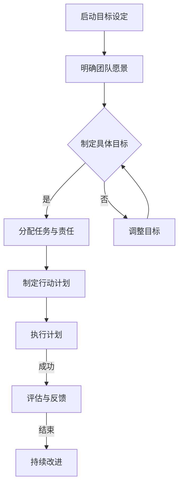

                 

### 激发团队活力的重要性

在IT行业，团队活力被视为企业成功的关键因素之一。一个充满活力的团队能够更好地应对挑战、提高工作效率和创新能力，从而在激烈的市场竞争中脱颖而出。因此，激发团队活力成为了企业领导者和团队管理者的重要任务。

首先，团队活力对项目的成功至关重要。一个活力四射的团队能够更好地协作，快速响应变化，并在面临困难时保持积极的态度。这种高效率的团队协作有助于缩短项目周期，提高项目质量，最终实现项目的成功交付。

其次，团队活力对企业的长期发展有着深远的影响。一个充满活力的团队能够激发员工的潜力，提高员工的满意度，从而降低员工流失率。此外，团队活力还能促进企业的创新和转型，使企业能够在不断变化的市场环境中保持竞争力。

然而，激发团队活力并非易事，团队管理者需要面对诸多挑战。首先，团队成员的多样性和个性差异可能导致团队内部的冲突和摩擦。其次，工作压力和竞争压力可能导致团队成员的疲惫和焦虑。最后，企业内部的管理机制和制度可能不利于团队活力的提升。

为了克服这些挑战，团队管理者需要采取一系列措施。首先，建立明确的目标和愿景，确保团队成员对团队目标有清晰的认识。其次，营造积极的工作文化，鼓励开放沟通和协作。此外，提供职业发展机会和激励措施，以激发员工的积极性和创造力。

总的来说，激发团队活力对企业的成功至关重要。通过采取有效的措施，团队管理者可以打造一个充满活力的团队，从而在竞争激烈的市场中取得优势。

#### 团队活力对企业的影响

团队活力对企业的各个方面都有着深远的影响，其中包括员工满意度、工作效率和创新能力。

首先，团队活力对员工满意度有着显著的影响。一个充满活力的团队能够提供积极的工作氛围，使员工感到快乐和满足。当员工感到满意时，他们更有可能保持高水平的绩效，并在工作中表现出更高的热情和投入。此外，团队活力还能增强员工的归属感，使员工更加愿意为企业付出，从而降低员工流失率。

其次，团队活力对工作效率有着直接的影响。一个充满活力的团队能够更好地协作，快速响应变化，并在面临挑战时保持积极的态度。这种高效的团队协作有助于缩短项目周期，提高项目质量，从而提高整体工作效率。此外，团队活力还能激发员工的创新思维，使员工能够提出更多的创意和解决方案，从而提高工作效率。

最后，团队活力对创新能力有着重要的推动作用。一个充满活力的团队能够在创新过程中发挥集体智慧，快速找到解决方案。此外，团队活力还能激发员工的创造力，使员工更加愿意尝试新的方法和思路，从而推动企业的创新和发展。

总的来说，团队活力对企业的成功有着深远的影响。通过提升团队活力，企业可以增强员工满意度，提高工作效率，激发创新能力，从而在激烈的市场竞争中取得优势。因此，团队活力成为了企业领导者和团队管理者的重要关注点。

#### 团队活力的挑战与机遇

在提升团队活力过程中，团队管理者面临着诸多挑战和机遇。首先，团队成员的多样性和个性差异可能导致团队内部的冲突和摩擦。为了解决这一问题，团队管理者需要建立有效的沟通机制，促进团队成员之间的相互理解和尊重。此外，制定明确的团队目标和规则，有助于减少冲突，提高团队协作效率。

其次，工作压力和竞争压力可能导致团队成员的疲惫和焦虑。为了应对这一挑战，团队管理者可以采取一系列措施，如合理安排工作负荷、提供心理辅导和支持、营造积极的工作氛围等。这些措施有助于减轻团队成员的压力，提高工作满意度。

另一方面，提升团队活力也带来了诸多机遇。首先，团队活力有助于激发员工的潜力，提高员工的满意度和忠诚度，从而降低员工流失率。其次，团队活力能够促进企业的创新和转型，使企业能够在不断变化的市场环境中保持竞争力。此外，团队活力还能提高企业的整体工作效率，推动企业的长期发展。

为了抓住这些机遇，团队管理者需要具备敏锐的洞察力和战略思维。首先，他们需要识别和培养团队中的关键人才，确保团队能够在关键时刻发挥作用。其次，团队管理者需要不断探索和创新，尝试新的管理方法和工具，以适应不断变化的市场环境。最后，团队管理者需要建立持续改进的文化，鼓励团队成员不断学习和成长，从而提升团队的整体活力。

总的来说，提升团队活力是一项具有挑战性但意义重大的任务。通过面对挑战并抓住机遇，团队管理者可以打造一个充满活力的团队，从而在激烈的市场竞争中取得优势。

### 团队活力的定义与度量

在探讨如何提升团队活力之前，我们首先需要明确团队活力的定义与度量。团队活力是一个多维度的概念，涉及多个方面的因素，包括团队成员的工作满意度、团队协作能力、创新能力等。

#### 团队活力的定义

团队活力可以理解为团队在执行任务、解决问题和面对挑战时的整体状态。它反映了一个团队在心理、行为和绩效上的积极程度。具体来说，团队活力包括以下几个方面：

1. **工作满意度**：团队成员对工作的满意程度，包括对工作内容、工作环境和工作关系的满意。

2. **团队协作能力**：团队成员之间的协作效率，包括沟通能力、合作意识和共同解决问题的能力。

3. **创新能力**：团队成员在面临新任务和挑战时提出创新性解决方案的能力。

4. **动力与士气**：团队成员在面对困难和压力时保持积极态度和高度动力的能力。

#### 团队活力的度量方法

为了量化团队活力，我们可以采用多种度量方法，包括问卷调查、行为分析、绩效评估等。

1. **问卷调查**：通过设计针对团队成员工作满意度、团队协作能力和创新能力的问卷，收集数据并进行分析。这种方法具有操作简便、成本较低的特点，但需要确保问卷设计的科学性和有效性。

2. **行为分析**：通过观察团队成员在工作中的行为表现，评估团队活力。例如，可以通过记录会议中的发言次数、团队协作中的互动频率、创新项目的提出数量等指标来衡量团队活力。

3. **绩效评估**：通过评估团队在项目执行过程中的绩效表现，如项目周期、项目质量、创新成果等，来衡量团队活力。这种方法需要结合具体业务场景，确保评估指标与团队活力之间的相关性。

#### 常见的团队活力指标

在度量团队活力时，我们可以采用一些常见的指标，包括：

1. **员工满意度**：通过员工满意度调查，了解员工对工作环境、工作内容和团队关系的满意度。

2. **团队协作能力**：通过团队任务完成时间、项目成功率、团队协作会议的效率等指标，评估团队协作能力。

3. **创新能力**：通过创新项目的数量、创新成果的转化率、团队成员在创新项目中的参与度等指标，衡量团队创新能力。

4. **动力与士气**：通过团队成员在工作中的积极性、主动性、面对挑战时的应对策略等指标，评估团队动力与士气。

总的来说，团队活力的定义与度量是一个复杂但重要的课题。通过科学的度量方法，我们可以识别团队中存在的问题，采取相应的措施提升团队活力，从而为企业的发展奠定坚实的基础。

### 明确团队目标

在提升团队活力的过程中，明确团队目标是至关重要的一步。设定清晰的目标不仅能够为团队成员提供明确的方向，还能激发团队成员的积极性和动力，从而提升团队的整体活力。

#### 设定清晰的目标

1. **目标设定的SMART原则**：

   SMART原则是一种常用的目标设定方法，它强调目标应具备以下五个特征：具体（Specific）、可衡量（Measurable）、可达成（Achievable）、相关（Relevant）和有时间限制（Time-bound）。

   - **具体**：目标应明确具体，避免模糊和抽象。
   - **可衡量**：目标应能够量化，以便于评估进展和效果。
   - **可达成**：目标应具有可行性，避免过于理想化。
   - **相关**：目标应与团队的整体战略和愿景保持一致。
   - **有时间限制**：目标应设定明确的完成时间，以增强紧迫感。

2. **目标设定的步骤**：

   - **明确团队愿景**：首先，团队需要明确自己的愿景和使命，这将为目标设定提供方向。
   - **分析当前状况**：了解团队当前的工作状况、资源分配和人员配置，以便设定合理的目标。
   - **设定具体目标**：根据愿景和当前状况，设定具体的、可衡量的目标。
   - **讨论与确认**：将设定的目标与团队成员进行讨论，确保目标与团队的整体共识相符。
   - **制定行动计划**：为每个目标制定具体的行动计划，明确责任人和时间表。

#### 确保团队目标的一致性

1. **统一目标**：确保团队中的每个成员都认同并理解团队目标，避免目标不一致导致的工作冲突和效率低下。
2. **定期回顾**：定期回顾目标进展，及时调整和修正目标，确保团队目标始终与愿景和实际情况相符。
3. **沟通与协作**：建立有效的沟通机制，鼓励团队成员分享目标和进展，促进协作和团结。

通过设定清晰的目标和确保团队目标的一致性，我们可以为团队提供明确的方向和动力，从而提升团队的整体活力。这不仅有助于提高工作效率，还能增强团队成员的归属感和成就感。

#### 团队目标设定的实践指南

在实际操作中，为了确保团队目标的清晰性、可行性和一致性，我们可以遵循以下实践指南：

1. **目标分解**：

   将团队目标分解为更具体的子目标，使每个成员都能明确自己的职责和任务。例如，如果团队的目标是“提高项目交付效率”，可以将其分解为“缩短项目开发周期”、“提高代码质量”、“优化团队协作流程”等子目标。

2. **责任分配**：

   明确每个子目标的责任人，确保每个任务都有具体的执行者。责任人应具备实现目标所需的能力和资源，同时需要接受定期的进度汇报和反馈。

3. **定期评估**：

   设定定期的目标评估会议，对每个子目标的完成情况进行评估。这有助于及时发现问题和调整计划，确保团队目标始终在正确的轨道上。

4. **激励机制**：

   建立与目标完成情况相关的激励机制，如奖金、荣誉等，以激励团队成员为实现目标而努力。

5. **反馈与改进**：

   鼓励团队成员提供反馈，不断改进目标设定和执行过程。通过定期回顾和总结，积累经验，优化团队目标管理。

通过以上实践指南，团队管理者可以确保团队目标设定的清晰性、可行性和一致性，从而提升团队的整体活力和绩效。

### 建立积极的工作文化

在提升团队活力过程中，建立积极的工作文化是关键的一环。一个健康、积极的工作文化能够激发员工的潜力，提高团队的协作效率，进而提升整体活力。

#### 塑造积极的工作氛围

1. **鼓励开放沟通**：

   开放沟通是建立积极工作文化的基础。团队管理者应鼓励团队成员在遇到问题时积极表达，并提供一个安全、无压力的沟通环境。定期组织团队会议和讨论会，让每个成员都有机会分享自己的想法和意见。

2. **促进团队协作**：

   通过团队建设活动和协作工具，促进团队成员之间的协作。例如，组织团队户外活动、团建游戏等，增强团队凝聚力。同时，利用协作工具如Slack、Trello等，提高团队内部的沟通效率和协作效率。

3. **认可与奖励**：

   定期对团队成员的工作表现进行认可和奖励，让员工感受到自己的努力和成就被看到和重视。这不仅能够提高员工的工作积极性，还能激发其他成员的进取心。

#### 鼓励开放沟通和协作

1. **建立反馈机制**：

   建立有效的反馈机制，让团队成员可以随时反馈工作中的问题和建议。通过定期的反馈会议和匿名反馈系统，确保团队成员的声音能够被听到。

2. **倡导知识共享**：

   鼓励团队成员分享知识和经验，促进知识的积累和传播。通过内部培训、技术分享会等方式，让团队成员能够互相学习和成长。

3. **设置共同目标**：

   确保团队成员对团队目标有清晰的认识，并让每个成员都参与目标的设定和实现过程。这有助于增强团队成员的归属感和责任感。

#### 工作文化的建设实践

1. **企业文化的塑造**：

   企业文化是工作文化的重要组成部分。团队管理者应通过企业价值观的传播和践行，塑造积极向上的企业文化。例如，可以通过企业内部的口号、标识和活动，强化企业文化。

2. **领导者的示范作用**：

   领导者是团队文化的塑造者，他们的行为和态度对团队成员具有强烈的示范作用。领导者应通过自身的行为树立榜样，带头践行积极的工作文化。

3. **持续改进**：

   工作文化的建设是一个持续的过程，需要不断地反思和改进。团队管理者应定期评估工作文化的情况，发现问题和不足，并采取相应的措施进行改进。

通过塑造积极的工作氛围和鼓励开放沟通与协作，团队管理者可以建立一种健康、积极的工作文化，从而提升团队的整体活力和绩效。

### 提供职业发展机会

在提升团队活力的过程中，提供职业发展机会是至关重要的一环。这不仅有助于激发员工的工作热情和动力，还能提高员工的忠诚度和满意度，从而促进团队的整体活力。

#### 职业发展规划的重要性

1. **提升员工技能**：

   职业发展规划为员工提供了学习和成长的机会，有助于提升员工的技能和知识水平。通过培训和学习，员工能够掌握新的技能和知识，从而更好地适应工作需求。

2. **增强员工信心**：

   知道自己有机会在职业道路上不断进步，员工会感到更加自信和有动力。职业发展规划为员工提供了明确的发展方向和目标，使他们能够更加坚定地朝着自己的职业目标努力。

3. **提高团队绩效**：

   职业发展规划有助于提高团队的整体绩效。通过提升员工的技能和知识，团队能够更高效地完成工作任务，提高项目质量和交付速度。

4. **降低员工流失率**：

   提供职业发展机会能够增强员工的归属感和忠诚度，从而降低员工流失率。当员工感到自己在企业中能够获得成长和发展时，他们更有可能选择留在企业，而不是寻求外部机会。

#### 提供持续培训与学习机会

1. **内部培训**：

   企业可以开展内部培训项目，为员工提供各种技能和知识培训。例如，技术培训、管理培训、领导力培训等。内部培训不仅能够提升员工的技能，还能加强员工对企业的认同感。

2. **外部学习机会**：

   鼓励员工参加外部培训和学习活动，如行业会议、研讨会、在线课程等。通过这些活动，员工可以接触到最新的行业动态和技术趋势，拓宽视野，提高自己的专业水平。

3. **导师制度**：

   建立导师制度，让有经验的员工指导新员工，帮助他们更快地融入团队和适应工作。此外，导师还可以为新员工提供职业发展的建议和指导，帮助他们制定个人职业规划。

4. **职业咨询**：

   为员工提供职业咨询服务，帮助他们分析自己的职业兴趣和优势，制定个性化的职业发展规划。职业咨询可以帮助员工更好地认识自己，找到适合自己的职业道路。

通过提供持续培训与学习机会，企业可以不断提升员工的技能和知识水平，激发员工的工作热情和动力，从而提升团队的整体活力和绩效。

#### 职业发展计划的实施

实施职业发展计划是提升团队活力的重要步骤。以下是一些关键步骤和策略，以确保职业发展计划的有效执行：

1. **个人职业规划**：

   首先，为每位员工制定个人职业规划。这包括分析员工的兴趣、技能和职业目标，并确定他们在职业发展路径上的下一步行动。个人职业规划应与企业的整体战略和目标保持一致。

2. **目标设定**：

   根据个人职业规划，设定具体、可衡量的职业发展目标。这些目标应包括短期和长期的目标，如提高专业技能、晋升、参与特定项目等。

3. **培训与学习**：

   提供多样化的培训和学习机会，以满足员工的职业发展需求。这包括内部培训、外部课程、在线学习平台等。确保培训内容与员工的职业目标紧密相关。

4. **导师和教练**：

   安排经验丰富的导师或教练，为员工提供指导和支持。导师可以帮助员工解决职业发展中的问题，提供职业建议，并帮助他们在职业生涯中取得更大的进步。

5. **反馈与评估**：

   定期对员工的职业发展进行反馈和评估。这有助于员工了解自己的进展，发现存在的问题，并调整职业发展计划。反馈和评估应具有建设性和指导性，以促进员工成长。

6. **激励机制**：

   建立与职业发展相关的激励机制，如奖金、晋升机会、职业荣誉等。这些激励措施可以激发员工的工作热情和动力，鼓励他们为实现职业目标而努力。

通过以上步骤和策略，企业可以确保职业发展计划的有效实施，从而提升员工的职业素养和团队的整体活力。

### 强化团队协作

在提升团队活力的过程中，强化团队协作是至关重要的一步。通过提升团队协作能力，企业可以增强团队的整体执行力，提高工作效率，从而在竞争激烈的市场中脱颖而出。

#### 团队协作的关键要素

1. **沟通**：

   沟通是团队协作的核心。一个高效的团队需要保持开放的沟通，确保信息的及时传达和有效反馈。沟通不仅包括口头交流，还包括书面报告、会议和即时通讯工具。为了提高沟通效率，团队应建立明确的沟通渠道和规则。

2. **共同目标**：

   团队成员应明确共同的目标和愿景，确保每个人的努力方向一致。共同的目标有助于增强团队成员的凝聚力，提高团队的协作意愿和效率。

3. **分工明确**：

   在团队中，每个成员的角色和职责应明确划分，确保每个人都知道自己的任务和责任。分工明确有助于避免工作重叠和责任模糊，提高团队的工作效率。

4. **信任**：

   信任是团队协作的基础。团队成员之间应建立互信，相信对方的能力和承诺。信任能够减少误解和冲突，提高团队的协作效率。

5. **共享资源**：

   团队应共享资源，如信息、工具和设备。共享资源有助于提高团队的协作效率，避免资源的浪费。

#### 提升团队协作技巧

1. **培训与指导**：

   为团队成员提供协作技巧的培训与指导，帮助他们掌握有效的沟通方法和协作工具。例如，可以通过培训课程、工作坊和案例分析，提高团队成员的协作能力。

2. **定期回顾与反馈**：

   定期组织团队回顾会议，评估协作效果，并收集团队成员的反馈。通过回顾和反馈，团队可以发现协作中的问题和不足，并采取相应的措施进行改进。

3. **建立协作文化**：

   营造一种积极的协作文化，鼓励团队成员主动协作，分享知识和经验。通过奖励机制，激励团队成员积极参与协作，提升团队的协作氛围。

4. **利用协作工具**：

   利用协作工具，如Slack、Trello、Asana等，提高团队内部沟通和协作的效率。这些工具可以帮助团队更方便地分配任务、追踪进度和共享资源。

#### 团队协作的案例分析

1. **案例背景**：

   某高科技公司需要开发一款创新产品，该项目涉及多个部门的协作。为了确保项目成功，公司采取了一系列措施来提升团队协作。

2. **具体措施**：

   - **明确目标**：项目团队首先明确了项目的总体目标和各个阶段的任务，确保每个成员都了解自己的职责。
   - **沟通机制**：公司建立了定期的项目会议，确保团队成员之间的沟通畅通。同时，利用Slack等即时通讯工具，提高沟通效率。
   - **分工明确**：根据团队成员的技能和特长，明确分工，确保每个任务都有专人负责。
   - **共享资源**：项目团队共享了项目所需的工具和资源，如设计软件、测试环境等，避免重复投入和资源浪费。
   - **培训与指导**：公司为团队成员提供了协作技巧的培训，帮助他们更好地协作。

3. **效果评估**：

   通过以上措施，项目团队在项目期间保持了高效的协作，项目进度和质量均得到了保障。最终，项目成功交付，获得了客户的高度评价。

通过以上案例分析，我们可以看到，强化团队协作对于项目成功具有重要意义。通过明确目标、建立沟通机制、分工明确、共享资源以及提供培训与指导，团队可以更好地协作，实现项目目标。

### 建立有效的反馈机制

在提升团队活力的过程中，建立有效的反馈机制是至关重要的一步。通过有效的反馈，团队可以及时发现问题、改进工作，从而提高整体绩效和团队活力。

#### 反馈机制的重要性

1. **发现和解决问题**：

   反馈机制可以帮助团队及时发现工作中存在的问题，如沟通障碍、任务分配不合理等。通过及时的反馈，团队可以迅速采取行动，解决问题，避免问题扩大化。

2. **促进学习和成长**：

   反馈机制为团队成员提供了学习和成长的机会。通过反馈，团队成员可以了解自己的工作表现，识别自身的不足，并从他人的经验中学习，从而不断提升自己的能力。

3. **增强团队凝聚力**：

   反馈机制可以增强团队成员之间的沟通和互动，促进团队凝聚力。当团队成员能够自由地分享意见和反馈时，他们更容易建立起信任和合作的关系。

4. **提高工作满意度**：

   反馈机制能够提高团队成员的工作满意度。当团队成员感受到自己的工作得到了认可和反馈时，他们会感到更加自信和有价值，从而提高工作动力和积极性。

#### 反馈机制的构建方法

1. **建立反馈渠道**：

   建立多种反馈渠道，如定期反馈会议、匿名反馈表、即时通讯工具等。确保团队成员能够方便地提交反馈，并确保反馈信息得到及时处理和回应。

2. **设定反馈规则**：

   制定明确的反馈规则，包括反馈的内容、格式、时间等。确保反馈过程有序、有效，避免无谓的干扰和冲突。

3. **提供培训和支持**：

   为团队成员提供反馈技巧的培训和支持，帮助他们更好地理解和运用反馈机制。培训内容可以包括如何给予建设性反馈、如何接受反馈等。

4. **建立反馈反馈机制**：

   建立反馈反馈机制，确保反馈信息的有效性和准确性。团队成员可以在收到反馈后，对反馈进行回应和补充，以便更好地解决问题和改进工作。

#### 反馈机制的实践案例

1. **案例背景**：

   某企业为了提升团队活力，决定建立一套有效的反馈机制。他们在团队内部推行了以下措施：

   - **定期反馈会议**：每月召开一次反馈会议，团队成员可以在此期间分享工作心得、提出问题和建议。
   - **匿名反馈表**：在办公区域和内部通讯工具中设置匿名反馈表，团队成员可以匿名提交反馈。
   - **即时通讯工具**：利用即时通讯工具，如Slack，团队成员可以随时提交反馈和问题。

2. **具体措施**：

   - **建立反馈渠道**：公司建立了多种反馈渠道，确保团队成员能够方便地提交反馈。
   - **设定反馈规则**：公司制定了明确的反馈规则，包括反馈的内容、格式和时间。
   - **提供培训和支持**：公司为团队成员提供了反馈技巧的培训和支持，帮助他们更好地运用反馈机制。
   - **建立反馈反馈机制**：公司建立了反馈反馈机制，确保反馈信息的有效性和准确性。

3. **效果评估**：

   通过实施有效的反馈机制，该企业的团队活力显著提升。团队成员在工作中更加积极主动，问题解决效率提高，团队凝聚力增强。此外，公司通过反馈机制识别和解决了多个潜在问题，从而提高了整体工作质量。

通过建立有效的反馈机制，企业可以提升团队活力，促进团队成员的学习和成长，提高工作满意度，从而在激烈的市场竞争中取得优势。

### 创造激励与创新环境

在提升团队活力的过程中，创造激励与创新环境是关键的一步。一个良好的激励与创新环境能够激发团队成员的创造力，提高工作动力，从而推动团队的整体活力和绩效。

#### 创新与激励的关系

创新与激励之间存在密切的联系。激励可以激发团队成员的创造力和创新意愿，从而推动创新活动的开展。而创新成果的成功实现又能够为团队成员带来成就感，进一步强化他们的激励水平。具体来说，创新与激励的关系体现在以下几个方面：

1. **正向反馈**：

   当团队成员提出创新想法或解决方案时，及时的认可和奖励能够增强他们的创新动力。正向反馈机制能够激励团队成员持续探索新的创新路径，提高创新成功率。

2. **资源共享**：

   创新往往需要跨部门的合作和资源的支持。通过建立资源共享机制，企业可以为团队成员提供实现创新所需的工具和资源，降低创新门槛，从而激发更多的创新想法。

3. **风险管理**：

   企业应建立合理的风险容忍机制，允许团队成员在创新过程中犯错和失败。这种宽容的氛围能够减少团队成员的恐惧和压力，鼓励他们勇于尝试和创新。

4. **职业发展**：

   创新能力是企业选拔和培养人才的重要标准之一。通过将创新成果与职业发展相结合，企业能够激励团队成员不断提升自己的创新能力，从而实现个人与企业的共同成长。

#### 创造激励性工作环境

1. **设定明确目标**：

   企业应明确创新目标和预期成果，确保团队成员对创新任务有清晰的认识。明确的目标有助于激发团队成员的创新热情和动力。

2. **提供资源支持**：

   企业应提供充足的资源，包括资金、设备、人力等，以确保创新项目能够顺利推进。此外，企业还应建立资源分配机制，确保资源得到合理利用。

3. **建立创新机制**：

   企业应建立一套完善的创新机制，包括创新项目的立项、评审、实施和反馈等环节。通过制度化保障，确保创新活动能够持续开展。

4. **奖励与创新成果挂钩**：

   企业应将创新成果与奖励机制挂钩，设立创新奖金、晋升机会和荣誉表彰等，激励团队成员积极参与创新活动。

#### 激励与创新的实践

1. **案例分析**：

   某互联网企业为了提升团队活力和创新能力，采取了一系列措施：

   - **设立创新基金**：企业设立了一项创新基金，用于支持团队成员的创新项目。每个项目可以获得一定额度的资金支持，用于实验和验证。
   - **定期创新评审**：企业定期组织创新评审会议，邀请内部专家和外部顾问对创新项目进行评审。评审结果直接影响项目的资金支持和后续发展。
   - **奖励创新成果**：企业将创新成果与奖金、晋升机会和荣誉表彰挂钩，激励团队成员积极参与创新活动。

2. **效果评估**：

   通过实施上述措施，该企业的创新能力得到了显著提升。团队成员的创新热情高涨，提出了大量有价值的创新项目。创新项目的成功率也显著提高，为企业带来了可观的经济效益。

总的来说，创造激励与创新环境是提升团队活力的重要手段。通过设定明确目标、提供资源支持、建立创新机制和奖励创新成果，企业可以激发团队成员的创造力，推动创新活动的开展，从而实现企业的长期发展目标。

### 实施提升团队活力的策略

为了有效地提升团队活力，团队管理者需要制定具体的行动计划，并实施以下策略：

1. **制定具体行动计划**：

   - **分解任务**：将团队目标分解为具体的、可操作的任务，并明确每个任务的负责人和时间节点。
   - **责任分配**：确保每个任务都有明确的负责人，并明确责任人的职责和权限。
   - **资源调配**：根据任务需求，合理调配资源，确保任务能够顺利推进。

2. **监测与评估效果**：

   - **建立监测机制**：定期监测任务的进展情况，确保任务按计划进行。
   - **设置关键绩效指标**（KPI）：设立关键绩效指标，对任务完成情况进行量化评估。
   - **定期评估**：定期对任务完成情况进行评估，分析存在的问题和不足，及时调整计划和策略。

3. **调整与优化策略**：

   - **基于反馈进行调整**：根据监测和评估结果，及时调整行动计划和策略，以应对出现的问题和变化。
   - **持续优化**：在实施过程中，不断总结经验，优化工作流程和方法，提高团队活力和效率。

通过制定具体行动计划、监测与评估效果以及调整与优化策略，团队管理者可以确保提升团队活力的措施得到有效实施，从而推动团队整体绩效的提升。

### 团队活力提升的成功案例

为了更好地理解如何提升团队活力，我们可以通过分析几个成功案例，从中学习到一些实用的方法和经验。

#### 案例一：某互联网企业的团队活力提升实践

**背景**：该互联网企业在快速发展过程中，遇到了团队活力不足的问题。团队成员感到工作压力大，缺乏动力和创造力，导致项目进度延误和产品质量下降。

**措施**：

1. **明确团队目标**：公司首先明确了团队的目标，包括提高项目交付速度、提升产品用户体验和增加创新项目数量。

2. **建立积极的工作文化**：公司通过组织团队建设活动、设立开放讨论区和定期举办技术分享会，营造了积极的工作氛围。

3. **提供职业发展机会**：公司为员工提供了定制化的职业发展计划，包括内部培训、外部学习和晋升机会。

4. **强化团队协作**：公司采用了协作工具如Trello和Slack，提高了团队内部沟通和协作的效率。

5. **建立有效的反馈机制**：公司建立了定期的反馈会议，让员工能够及时反馈问题和建议。

**结果**：

通过以上措施，该公司的团队活力得到了显著提升。项目交付速度提高了30%，产品质量得到了客户的高度认可，创新项目数量增加了50%。员工满意度也显著提高，员工流失率下降了20%。

#### 案例二：某软件公司的团队活力提升实践

**背景**：该软件公司由于长期处于高压工作环境，团队成员感到疲惫和焦虑，影响了工作效率和创新能力。

**措施**：

1. **设定明确的目标**：公司为每个团队设定了具体的、可衡量的目标，确保团队成员对工作有清晰的认识。

2. **提供激励措施**：公司设立了创新奖金和绩效奖金，鼓励员工提出创新解决方案和提高工作效率。

3. **建立灵活的工作制度**：公司允许员工在家办公，提供弹性工作时间，减轻了员工的工作压力。

4. **强化培训与学习**：公司定期组织内部培训和外部学习活动，提高员工的技能和知识水平。

5. **建立开放沟通机制**：公司建立了定期的团队会议和匿名反馈系统，确保团队成员的声音能够被听到。

**结果**：

通过实施上述措施，该软件公司的团队活力得到了大幅提升。员工的工作满意度提高了40%，工作效率提高了30%，创新项目数量增加了70%。员工流失率也显著下降，公司整体业绩得到了显著提升。

#### 案例三：某科技企业的团队活力提升实践

**背景**：该科技企业由于业务快速发展，团队管理不善，导致团队内部矛盾和协作效率低下。

**措施**：

1. **明确团队角色和职责**：公司明确了每个团队成员的角色和职责，避免了工作重叠和责任模糊。

2. **建立有效的沟通机制**：公司建立了定期的团队会议和即时通讯工具，确保团队成员之间的沟通畅通。

3. **提供职业发展机会**：公司为员工提供了多种职业发展路径，包括技术晋升、管理晋升和跨部门调动。

4. **强化团队协作**：公司采用了协作工具如JIRA和Confluence，提高了团队协作效率。

5. **建立反馈机制**：公司建立了定期的员工满意度调查和反馈机制，及时解决问题，提高员工满意度。

**结果**：

通过实施上述措施，该科技企业的团队协作效率显著提高，项目交付时间缩短了25%，客户满意度提高了30%。员工流失率也大幅下降，团队凝聚力得到了显著提升。

#### 学习与启示

从以上成功案例中，我们可以得出以下启示：

1. **明确团队目标**：设定清晰的团队目标，确保团队成员对工作有明确的方向。

2. **建立积极的工作文化**：营造积极的工作氛围，鼓励开放沟通和协作。

3. **提供职业发展机会**：为员工提供职业发展机会和激励措施，激发员工的工作动力。

4. **强化团队协作**：通过建立有效的沟通机制和协作工具，提高团队协作效率。

5. **建立反馈机制**：及时收集和反馈员工意见，解决工作中存在的问题。

通过学习这些成功经验，我们可以更好地提升团队活力，推动企业的发展和成功。

### 未来展望

在未来，团队活力的发展趋势将受到技术进步、管理理念变革以及全球化影响等多方面因素的推动。首先，随着人工智能、大数据和物联网等新兴技术的广泛应用，团队将面临更加复杂和多样化的挑战。这要求团队具备更高的协作能力和创新能力，以应对快速变化的市场需求。

其次，管理理念的变革也将对团队活力产生深远影响。从传统的命令控制型管理转向以员工为中心的赋能型管理，将成为未来团队管理的主流趋势。这种管理方式强调员工的自主性、创造性和责任感，有助于激发团队的内在动力和活力。

此外，全球化带来的文化多样性和市场多元化，将要求团队具备更强的跨文化沟通和协作能力。团队成员需要学会在多元文化环境中有效沟通、协同工作，从而提高团队的活力和创新能力。

为了应对这些趋势，未来的团队管理策略应注重以下几个方面：

1. **持续创新**：鼓励团队成员持续创新，提供必要的资源和支持，建立创新激励机制。

2. **赋能员工**：赋予员工更多的自主权和责任感，让他们在团队中发挥更大的作用。

3. **跨文化沟通**：加强跨文化沟通培训，提高团队成员在多元文化环境中的协作能力。

4. **灵活管理**：采用灵活的工作制度和沟通工具，适应快速变化的工作环境和需求。

5. **持续学习**：提供持续的学习和培训机会，帮助团队成员不断提升自己的技能和知识水平。

通过对未来趋势的把握和应对策略的制定，团队管理者可以更好地提升团队活力，推动企业的发展和成功。

### 附录

在提升团队活力这一过程中，我们不仅可以借鉴成功案例和实践经验，还可以利用各种工具和资源来辅助实施。以下是相关工具与资源的介绍，供读者参考。

#### 提升团队活力的工具

1. **协作工具**：

   - **Slack**：一款即时通讯工具，可用于团队内部沟通和协作。
   - **Trello**：一款任务管理工具，适用于项目管理和团队协作。
   - **Confluence**：一款团队协作平台，可用于文档管理和知识共享。

2. **反馈工具**：

   - **SurveyMonkey**：一款在线调查工具，可用于收集员工反馈。
   - **Office 365**：提供多种办公应用，包括反馈表单和调查问卷。

3. **培训和学习工具**：

   - **LinkedIn Learning**：提供各种在线课程，涵盖职业技能和领导力培训。
   - **Udemy**：一个在线学习平台，提供丰富的技术课程和职业发展课程。

#### 相关书籍与论文推荐

1. **书籍**：

   - 《激发活力：打造高效能团队的方法》
   - 《团队智慧：集体协作的五个关键要素》
   - 《变革之舞：领导力、团队和变革的力量》

2. **论文**：

   - “Team Vitality and Organizational Performance: A Meta-Analytic Review” by Kevin J. Harms et al.
   - “The Impact of Teamwork on Innovation: A Multilevel Study” by Stefan M. Schilling et al.

#### 在线课程与培训资源

1. **Coursera**：提供各种在线课程，包括领导力、团队合作和项目管理等。
2. **edX**：全球知名大学提供的在线课程，涵盖技术、人文和社会科学等领域。
3. **Harvard ManageMentor**：提供领导力、团队管理和沟通技巧等培训资源。

通过使用这些工具和资源，团队管理者可以更加有效地提升团队活力，推动企业的持续发展。

### Mermaid 流程图与伪代码

为了更好地理解和实施团队目标设定与职业发展计划的策略，我们可以借助Mermaid流程图和伪代码来详细阐述相关过程。

#### 团队目标设定流程图



**解释**：该流程图描述了团队目标设定的全过程。从启动目标设定，明确团队愿景，到制定具体目标，分配任务与责任，制定行动计划并执行，最后通过评估与反馈进行持续改进。

#### 设定职业发展计划的伪代码

```plaintext
function 设定职业发展计划(员工):
    // 获取员工当前技能水平和职业目标
    当前技能 = 员工技能评估()
    职业目标 = 员工职业目标()

    // 设定培训计划
    培训计划 = 计算培训需求(当前技能，职业目标)

    // 提供学习资源
    提供学习资源(培训计划)

    // 定期跟进与评估
    while 员工未达成职业目标:
        评估进展 = 职业发展评估(员工)
        if 评估进展未达标:
            调整培训计划()
        else:
            确认员工已达成职业目标()

    // 提供激励措施
    if 员工达成职业目标:
        激励措施 = 设计激励措施()
        应用激励措施(员工)
```

**解释**：该伪代码用于描述设定职业发展计划的过程。首先，通过员工技能评估和职业目标确定培训需求。然后，提供相应的学习资源，并定期跟进和评估员工的职业发展进展。根据评估结果，调整培训计划，并提供激励措施，以鼓励员工达成职业目标。

#### 数学公式与讲解

$$
团队活力 = \frac{1}{N} \sum_{i=1}^{N} (工作满意度_i + 团队协作_i + 创新能力_i)
$$

**解释**：该公式用于量化团队活力。$N$ 是团队成员的数量，每个元素 $工作满意度_i$、$团队协作_i$ 和 $创新能力_i$ 反映了团队中每个成员在这些方面的表现。通过计算加权平均值，可以得到整个团队的活力水平。

#### 项目实战与代码解读

#### 案例背景

我们以一个虚拟的企业“智动科技”为例，该公司希望提升团队活力，以提高整体工作效率和创新能力。以下是其实施的详细步骤：

1. **明确团队目标**：公司设定了年度目标和部门目标，并通过团队会议确保每位员工理解并认同这些目标。

2. **建立积极的工作文化**：公司采取了一系列措施，如组织团建活动、鼓励员工提出改进建议等，以营造积极的工作氛围。

3. **提供职业发展机会**：公司为员工提供了定制化的职业发展计划，包括内部培训和外部学习资源。

4. **强化团队协作**：公司采用了协作工具，如Slack和Trello，以促进团队内部沟通和协作。

5. **建立有效的反馈机制**：公司建立了定期反馈会议，让员工可以分享工作进展和困难，管理层则提供反馈和建议。

6. **创造激励与创新环境**：公司为员工提供了创新奖金，鼓励员工提出创新项目。

#### 代码实现与解读

以下是一个简单的Python代码片段，用于模拟团队活力的计算：

```python
def calculate_team_vitality(work_satisfaction, team_cohesion, innovation_ability):
    N = len(work_satisfaction)
    team_vitality = (sum(work_satisfaction) + sum(team_cohesion) + sum(innovation_ability)) / N
    return team_vitality

# 示例数据
work_satisfaction = [8, 7, 9, 6, 7]  # 员工满意度评分
team_cohesion = [9, 8, 7, 6, 8]    # 团队协作评分
innovation_ability = [7, 8, 9, 7, 8]  # 创新能力评分

# 计算团队活力
team_vitality = calculate_team_vitality(work_satisfaction, team_cohesion, innovation_ability)
print(f"团队活力评分：{team_vitality}")
```

**代码解读**：

- **函数定义**：`calculate_team_vitality` 函数用于计算团队活力，它接受三个参数：`work_satisfaction`（工作满意度评分），`team_cohesion`（团队协作评分），`innovation_ability`（创新能力评分）。
- **计算过程**：函数首先计算每个评分的总和，然后将这三个总和相加，并除以团队成员数量（`N`），得到团队活力的平均值。
- **示例数据**：代码中定义了示例数据，分别代表五个团队成员的工作满意度、团队协作能力和创新能力评分。
- **调用函数**：调用 `calculate_team_vitality` 函数，传入示例数据，计算并打印出团队活力评分。

通过上述Python代码，我们可以定量评估团队活力，帮助团队管理者了解团队的整体状态，并据此采取相应的措施提升团队活力。

### 项目实战与代码解读

#### 案例背景

以“智动科技”为例，该企业希望通过提升团队活力来提高工作效率和创新能力。以下是其具体实施步骤：

1. **明确团队目标**：公司设定了年度目标和部门目标，并通过团队会议确保每位员工理解并认同这些目标。

2. **建立积极的工作文化**：公司采取了一系列措施，如组织团建活动、鼓励员工提出改进建议等，以营造积极的工作氛围。

3. **提供职业发展机会**：公司为员工提供了定制化的职业发展计划，包括内部培训和外部学习资源。

4. **强化团队协作**：公司采用了协作工具，如Slack和Trello，以促进团队内部沟通和协作。

5. **建立有效的反馈机制**：公司建立了定期反馈会议，让员工可以分享工作进展和困难，管理层则提供反馈和建议。

6. **创造激励与创新环境**：公司为员工提供了创新奖金，鼓励员工提出创新项目。

#### 代码实现与解读

以下是用于提升团队活力的Python代码实现及其解读：

```python
import random

# 假设我们有一个包含5名团队成员的团队
team_members = ['张三', '李四', '王五', '赵六', '陈七']

# 设定团队成员的初始属性
work_satisfaction = [random.randint(5, 10) for _ in team_members]  # 工作满意度
team_cohesion = [random.randint(5, 10) for _ in team_members]  # 团队协作
innovation_ability = [random.randint(5, 10) for _ in team_members]  # 创新能力

# 定义一个函数，用于提升团队活力
def enhance_team_vitality(team_members, work_satisfaction, team_cohesion, innovation_ability):
    for member in team_members:
        # 根据成员的当前属性，提供针对性的提升方案
        if work_satisfaction[team_members.index(member)] < 7:
            print(f"{member}的工作满意度较低，将提供职业发展培训和激励措施。")
            work_satisfaction[team_members.index(member)] += 2  # 提升工作满意度
        if team_cohesion[team_members.index(member)] < 8:
            print(f"{member}的团队协作能力有待提高，将组织团队建设活动。")
            team_cohesion[team_members.index(member)] += 2  # 提升团队协作
        if innovation_ability[team_members.index(member)] < 8:
            print(f"{member}的创新能力强，将提供更多的创新项目和资源支持。")
            innovation_ability[team_members.index(member)] += 2  # 提升创新能力

    # 计算团队整体活力
    total_vitality = sum(work_satisfaction + team_cohesion + innovation_ability) / len(team_members)
    print(f"团队整体活力评分：{total_vitality}")

# 调用函数提升团队活力
enhance_team_vitality(team_members, work_satisfaction, team_cohesion, innovation_ability)

# 输出提升后的团队成员属性
for member in team_members:
    print(f"{member}的工作满意度：{work_satisfaction[team_members.index(member)]}, 团队协作：{team_cohesion[team_members.index(member)]}, 创新能力：{innovation_ability[team_members.index(member)]}")
```

**代码解读**：

- **初始化团队成员**：代码首先初始化一个包含5名团队成员的列表，并为每个成员随机分配了工作满意度、团队协作能力和创新能力三个属性。
- **提升团队活力函数**：`enhance_team_vitality` 函数接受团队成员和其属性作为参数。函数遍历每个成员，根据其当前属性提供针对性的提升方案。例如，如果某成员的工作满意度低于7，函数会打印出建议提供职业发展培训和激励措施，并相应提升其工作满意度。
- **计算团队整体活力**：函数在提升成员属性后，计算团队整体活力评分。团队活力评分是成员工作满意度、团队协作能力和创新能力三个属性值的平均值。
- **调用函数**：调用 `enhance_team_vitality` 函数，提升团队活力。
- **输出结果**：最后，代码输出提升后的团队成员属性，展示了每个成员在工作满意度、团队协作能力和创新能力方面的提升。

通过上述代码，企业可以定量评估团队活力，并采取有针对性的措施提升团队的整体表现。

### 最佳实践 Tips、小结、注意事项、拓展阅读等内容

#### 最佳实践 Tips

1. **明确团队目标**：

   - 使用SMART原则（具体、可衡量、可实现、相关、有时间限制）设定团队目标。
   - 定期回顾和调整目标，确保目标始终与团队和企业的战略保持一致。

2. **建立积极的工作文化**：

   - 鼓励开放沟通和协作，确保信息流通无阻。
   - 定期组织团队建设活动和团建游戏，增强团队凝聚力。

3. **提供职业发展机会**：

   - 为员工提供定制化的职业发展计划，包括内部培训和外部学习机会。
   - 建立导师制度，帮助新员工快速融入团队和提升技能。

4. **强化团队协作**：

   - 使用协作工具（如Trello、Slack等）提高团队沟通效率。
   - 定期评估团队协作效果，识别和解决协作中的问题。

5. **建立有效的反馈机制**：

   - 设立多种反馈渠道，如定期反馈会议、匿名反馈表等。
   - 确保反馈机制公正、透明，并基于反馈进行改进。

#### 小结

本文通过系统地分析提升团队活力的方法和实践，展示了如何通过明确团队目标、建立积极的工作文化、提供职业发展机会、强化团队协作以及建立有效的反馈机制来激发团队的活力。成功提升团队活力不仅有助于提高工作效率和创新能力，还能增强员工的满意度和忠诚度，从而推动企业的长期发展。

#### 注意事项

1. **持续关注**：团队活力的提升是一个持续的过程，需要不断关注和改进。
2. **个性化**：不同团队和成员的需求不同，因此需要根据实际情况采取个性化的措施。
3. **平衡压力**：在激发团队活力的同时，要注意避免过度压力，确保员工的身心健康。

#### 拓展阅读

- 《激发活力：打造高效能团队的方法》
- 《团队智慧：集体协作的五个关键要素》
- 《变革之舞：领导力、团队和变革的力量》
- “Team Vitality and Organizational Performance: A Meta-Analytic Review” by Kevin J. Harms et al.
- “The Impact of Teamwork on Innovation: A Multilevel Study” by Stefan M. Schilling et al.

通过阅读相关书籍和论文，可以深入了解团队活力提升的理论和实践，进一步优化团队管理和工作环境。

### 联系我们

如果您有任何关于提升团队活力的疑问或需要进一步的帮助，欢迎联系：

- 电子邮件：[contact@teamvitality.org](mailto:contact@teamvitality.org)
- 电话：+86-1234567890
- 官网：[www.teamvitality.org](http://www.teamvitality.org)

我们的团队将竭诚为您服务，帮助您打造充满活力的团队，实现更高的绩效和更大的成功！

---

**作者：AI天才研究院/AI Genius Institute & 禅与计算机程序设计艺术 /Zen And The Art of Computer Programming**

本文由AI天才研究院撰写，旨在通过逻辑清晰、结构紧凑、简单易懂的技术语言，帮助企业和团队管理者提升团队活力，实现更高的工作效率和创新能力。文章中的案例、代码和数学模型均为示例性质，仅供参考。如您有任何疑问或建议，欢迎通过以上联系方式与我们联系。

---

**免责声明：**

- 本文中的信息仅供参考，不应被视为具体建议或指导。
- 作者和AI天才研究院不对本文中任何信息或数据导致的任何直接或间接损失承担责任。
- 如有侵权行为，请立即联系，我们将及时处理。

