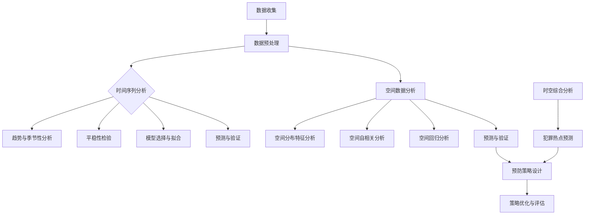

                 

### 文章标题

《犯罪预防的时空分析：社会安全的数学工具》

> 关键词：犯罪预防、时空分析、社会安全、数学工具、犯罪趋势预测、犯罪热点分析、预防策略设计

> 摘要：本文旨在探讨犯罪预防的时空分析在提升社会安全水平中的应用。通过介绍时空分析的基本概念、社会安全的数学工具，以及犯罪行为时空特征分析，本文阐述了如何利用这些工具和方法来预测犯罪趋势、设计犯罪预防策略，并提供实际案例进行详细剖析。文章的核心在于将复杂的数学模型和算法通过具体的Python代码和实际案例进行通俗易懂的讲解，旨在为相关领域的研究者、实践者提供有价值的参考。

### 引言

随着社会的不断进步和城市化进程的加快，犯罪问题日益凸显，成为影响社会安全和公共福祉的重大挑战。传统的犯罪预防方法往往依赖于经验判断和静态分析，难以应对日益复杂的犯罪态势。因此，寻找有效的犯罪预防策略和方法成为当务之急。

在这其中，犯罪预防的时空分析作为一种新兴的犯罪预防工具，正逐渐受到广泛关注。时空分析通过对犯罪行为在时间和空间上的特征进行深入分析，有助于识别犯罪热点区域、预测犯罪趋势，从而为犯罪预防策略的设计提供科学依据。

本文旨在系统地探讨犯罪预防的时空分析在社会安全中的应用，具体包括以下几个方面的内容：

1. 犯罪预防的时空分析基本概念：介绍时空分析的基本原理和方法。
2. 社会安全的数学工具：探讨各种数学模型在犯罪预防中的应用。
3. 犯罪行为时空特征分析：研究犯罪行为的时空特征，包括犯罪热点分析、犯罪趋势预测等。
4. 犯罪预防策略设计：介绍如何根据时空分析结果设计有效的犯罪预防策略。
5. 案例研究：通过实际案例展示犯罪预防的时空分析在社会安全中的应用。

本文结构如下：

- **第一部分：犯罪预防的时空分析基础**：介绍时空分析的基本概念和应用。
- **第二部分：犯罪预防的时空分析应用**：探讨时空分析在犯罪趋势预测和犯罪预防策略设计中的应用。
- **第三部分：犯罪预防的时空分析实践**：提供犯罪预防的时空分析实践指南和案例分析。

### 犯罪预防的时空分析基本概念

#### 时间序列分析

时间序列分析（Time Series Analysis）是一种统计学方法，用于分析时间序列数据，即按时间顺序排列的数据点。在犯罪预防领域，时间序列分析可以用来分析犯罪案件数量、类型、发生时间等变量，以识别犯罪趋势和周期性模式。

时间序列分析的基本步骤包括：

1. **数据收集与预处理**：收集犯罪案件的时间序列数据，并进行数据清洗和预处理，以确保数据的准确性和完整性。
2. **趋势与季节性分析**：通过绘制时间序列图，分析犯罪数量的趋势和季节性模式，以识别犯罪波动的长期和短期因素。
3. **平稳性检验**：对时间序列进行平稳性检验，以确保时间序列模型的有效性。
4. **模型选择与拟合**：选择适当的时间序列模型（如自回归模型AR、移动平均模型MA、自回归移动平均模型ARMA等），并通过最小化预测误差来拟合模型。
5. **预测与验证**：利用拟合模型进行犯罪趋势预测，并对比实际数据验证预测效果。

#### 空间数据分析

空间数据分析（Spatial Data Analysis）是一种地理信息系统（GIS）技术，用于分析地理空间数据，识别空间分布特征和模式。在犯罪预防中，空间数据分析可以用来识别犯罪热点区域、分析犯罪空间分布模式等。

空间数据分析的基本步骤包括：

1. **数据收集与预处理**：收集犯罪案件的空间数据，包括地理位置、时间、案件类型等，并进行数据清洗和预处理。
2. **空间分布特征分析**：通过绘制犯罪案件分布图，分析犯罪案件在空间上的分布特征，如热点区域、集群分布等。
3. **空间自相关分析**：利用空间自相关分析方法（如全局自相关、局部自相关等），分析犯罪案件在空间上的相关性，以识别空间模式。
4. **空间回归分析**：通过空间回归模型，分析犯罪案件与地理特征（如人口密度、经济水平等）的关系，以预测犯罪热点区域。
5. **预测与验证**：利用空间分析结果进行犯罪热点预测，并对比实际数据验证预测效果。

#### 时空分析的联系与架构

时空分析在犯罪预防中具有重要的联系和应用。通过时间序列分析和空间数据分析的结合，可以更全面地理解犯罪行为的时空特征，从而提高犯罪预测和预防策略的有效性。

以下是时空分析在犯罪预防中的联系和架构Mermaid流程图：



通过上述流程，我们可以将时间序列分析和空间数据分析的结果结合起来，进行时空综合分析，从而为犯罪热点预测和预防策略设计提供科学依据。

### 社会安全的数学工具

在社会安全领域，数学工具的应用至关重要。这些工具不仅可以帮助我们更好地理解犯罪行为的时空特征，还可以为犯罪预防策略的设计和实施提供有力的支持。以下将介绍几种主要的数学工具，包括概率模型、统计模型和优化模型。

#### 概率模型

概率模型是犯罪预防中常用的一种数学工具，用于分析犯罪行为发生的概率和可能性。概率模型可以基于历史数据来预测未来犯罪事件的发生概率，从而为犯罪预防提供重要的参考。

常见的概率模型包括：

1. **贝叶斯模型**：贝叶斯模型是一种基于贝叶斯定理的统计模型，通过利用先验知识和观测数据，计算后验概率，从而预测未来事件的发生概率。

2. **马尔可夫模型**：马尔可夫模型是一种用于描述系统状态转移概率的模型，适用于分析犯罪行为的动态变化。马尔可夫模型可以用于犯罪趋势预测、犯罪行为序列分析等。

3. **概率图模型**：概率图模型是一种基于图论和概率论的模型，用于表示变量之间的关系。常见的概率图模型包括贝叶斯网络和隐马尔可夫模型（HMM），适用于复杂犯罪行为分析。

以下是一个简单的Python代码示例，展示了如何使用贝叶斯模型进行犯罪概率预测：

```python
import numpy as np
from sklearn.linear_model import BayesianRidge

# 假设我们有一个包含犯罪特征的数据集X和犯罪标签y
X = np.array([[0, 1], [1, 0], [1, 1], [0, 0]])
y = np.array([0, 1, 1, 0])

# 训练贝叶斯模型
bayesian_model = BayesianRidge()
bayesian_model.fit(X, y)

# 预测新样本的概率
new_sample = np.array([[1, 1]])
predicted_probability = bayesian_model.predict_proba(new_sample)

print("Predicted probability of crime:", predicted_probability[0, 1])
```

#### 统计模型

统计模型是犯罪预防中另一类重要的数学工具，用于分析犯罪行为的数据特征和模式。统计模型可以用于犯罪趋势预测、犯罪热点分析等。

常见的统计模型包括：

1. **线性回归模型**：线性回归模型是一种常用的统计模型，用于分析自变量和因变量之间的线性关系。在线性回归模型中，我们可以通过拟合线性模型来预测犯罪数量或其他相关变量。

2. **逻辑回归模型**：逻辑回归模型是一种广义线性模型，用于分析因变量的概率分布。在犯罪预防中，逻辑回归模型可以用于预测犯罪行为的发生概率。

3. **时间序列模型**：时间序列模型是一种用于分析时间序列数据的统计模型，包括自回归模型（AR）、移动平均模型（MA）、自回归移动平均模型（ARMA）等。时间序列模型可以用于预测犯罪趋势和时间序列数据建模。

以下是一个简单的Python代码示例，展示了如何使用线性回归模型进行犯罪数量预测：

```python
import numpy as np
from sklearn.linear_model import LinearRegression

# 假设我们有一个包含时间序列数据X和犯罪数量y
X = np.array([[1], [2], [3], [4], [5]])
y = np.array([2, 4, 5, 6, 7])

# 训练线性回归模型
linear_regression_model = LinearRegression()
linear_regression_model.fit(X, y)

# 预测新时间点的犯罪数量
new_time_point = np.array([[6]])
predicted_crime_count = linear_regression_model.predict(new_time_point)

print("Predicted crime count:", predicted_crime_count)
```

#### 优化模型

优化模型是用于在给定约束条件下最大化或最小化目标函数的数学工具。在犯罪预防中，优化模型可以用于制定预防策略，以最小化犯罪数量或最大化预防效果。

常见的优化模型包括：

1. **线性规划模型**：线性规划模型是一种用于求解线性目标函数在给定线性约束条件下的最优解的优化模型。在犯罪预防中，线性规划模型可以用于资源分配、路径规划等问题。

2. **整数规划模型**：整数规划模型是一种用于求解整数变量优化问题的优化模型。在犯罪预防中，整数规划模型可以用于警力部署、应急预案设计等问题。

3. **混合整数规划模型**：混合整数规划模型是一种结合了整数变量和连续变量的优化模型，用于求解更复杂的优化问题。在犯罪预防中，混合整数规划模型可以用于复杂决策问题，如多目标优化、资源分配等。

以下是一个简单的Python代码示例，展示了如何使用线性规划模型进行警力部署优化：

```python
import numpy as np
from scipy.optimize import linprog

# 假设我们有一个包含警力需求和区域约束的数据集
A = np.array([[1, 1], [2, 3], [1, 2]])
b = np.array([10, 20, 15])
c = np.array([-1, -1])

# 求解线性规划问题
result = linprog(c, A_eq=b, bounds=(0, None))

# 输出最优解
print("Optimal solution:", result.x)
```

通过上述数学工具的应用，我们可以更有效地分析犯罪行为的时空特征，预测犯罪趋势，并制定科学的犯罪预防策略。接下来，我们将进一步探讨犯罪行为的时空特征分析。

### 犯罪行为时空特征分析

犯罪行为时空特征分析是犯罪预防研究中的一个重要方向，它旨在通过分析犯罪行为在时间和空间上的分布特征，识别犯罪热点区域和趋势，从而为犯罪预防提供科学依据。以下将详细介绍犯罪行为时空特征分析的核心概念、分析方法以及如何识别犯罪热点。

#### 犯罪行为时空特征的定义

犯罪行为时空特征是指犯罪行为在时间和空间上的分布特征，包括犯罪行为的发生时间、地点、频率、类型等。这些特征反映了犯罪行为的动态变化和空间聚集性，对于犯罪预防策略的设计具有重要意义。

1. **发生时间**：犯罪行为发生的时间，包括一天中的不同时段和一周内的不同日子。
2. **发生地点**：犯罪行为发生的具体地理位置，可以是城市中的某个区域、某个社区或某个建筑物。
3. **频率**：犯罪行为的频次，即某个时间段内发生的犯罪案件数量。
4. **类型**：犯罪行为的类型，如盗窃、抢劫、暴力犯罪等。

#### 犯罪行为时空特征的分析方法

1. **时间序列分析**：
   时间序列分析是犯罪行为时空特征分析的重要工具，用于分析犯罪行为随时间的变化规律。常见的时间序列分析方法包括：
   - **趋势分析**：通过绘制时间序列图，分析犯罪数量的长期趋势。
   - **季节性分析**：通过识别犯罪数量的季节性模式，分析犯罪行为的周期性变化。
   - **自相关性分析**：通过计算自相关系数，分析时间序列数据之间的相关性。

2. **空间数据分析**：
   空间数据分析用于分析犯罪行为在空间上的分布特征，包括犯罪热点区域的识别和犯罪空间聚集性分析。常见的方法包括：
   - **点模式分析**：通过计算点之间的距离和密度，分析犯罪地点的空间分布特征。
   - **空间聚类分析**：通过聚类算法，将犯罪地点划分为不同的集群，识别犯罪热点区域。
   - **地理加权回归**：通过地理加权回归模型，分析犯罪行为与地理位置、社会经济因素之间的关系。

3. **时空综合分析**：
   时空综合分析是将时间序列分析和空间数据分析相结合，用于更全面地分析犯罪行为的时空特征。常见的方法包括：
   - **时空扫描统计**：通过时空扫描统计模型，同时分析犯罪行为的时间和空间分布特征。
   - **时空联动分析**：通过时空联动分析，识别犯罪行为的时间-空间模式。

#### 犯罪热点分析

犯罪热点分析是犯罪行为时空特征分析的重要任务之一，旨在识别犯罪高发区域，为犯罪预防提供关键信息。以下是一些常见的犯罪热点分析方法：

1. **热点地图**：
   通过绘制犯罪热点地图，直观地显示犯罪案件在空间上的分布特征。热点地图通常使用颜色或密度值来表示犯罪案件的数量或密度。

2. **K-means聚类**：
   K-means聚类是一种常见的聚类算法，通过将犯罪地点划分为K个集群，识别犯罪热点区域。每个集群的中心点即为犯罪热点。

3. **局部空间自相关**：
   通过计算局部空间自相关指数（Local Indicators of Spatial Association, LISA），识别犯罪热点和冷点区域。LISA指数大于0表示热点区域，小于0表示冷点区域。

以下是一个简单的Python代码示例，展示了如何使用K-means聚类算法识别犯罪热点：

```python
import numpy as np
from sklearn.cluster import KMeans

# 假设我们有一个包含犯罪地点坐标的数据集
X = np.array([[1, 2], [3, 4], [5, 6], [7, 8], [9, 10]])

# 训练K-means聚类模型
kmeans = KMeans(n_clusters=2, random_state=0).fit(X)

# 输出聚类结果
print("Cluster centers:", kmeans.cluster_centers_)
print("Cluster labels:", kmeans.labels_)

# 绘制热点地图
import matplotlib.pyplot as plt

plt.scatter(X[:, 0], X[:, 1], c=kmeans.labels_, cmap='viridis')
plt.scatter(kmeans.cluster_centers_[:, 0], kmeans.cluster_centers_[:, 1], s=300, c='red', label='Centroids')
plt.title('Crime Hotspots')
plt.xlabel('Longitude')
plt.ylabel('Latitude')
plt.show()
```

通过犯罪行为时空特征分析，我们可以更准确地识别犯罪热点区域，为犯罪预防策略的制定提供科学依据。接下来，我们将探讨如何根据犯罪行为的时空特征设计有效的犯罪预防策略。

### 犯罪预防策略设计

犯罪预防策略设计是犯罪预防工作的核心环节，旨在通过科学的方法和有效的措施，减少犯罪发生的频率和危害程度。基于犯罪行为的时空特征分析，我们可以制定出针对性的犯罪预防策略，以提高社会安全水平。以下将介绍几种常见的犯罪预防策略设计方法。

#### 基于时空分析的结果制定预防策略

1. **犯罪热点区域控制**：
   通过时空分析识别出的犯罪热点区域，是预防犯罪工作的重点。针对这些区域，可以采取以下措施：
   - **增加警力部署**：在犯罪热点区域增加巡逻警力，提高警方的发现和干预能力。
   - **加强视频监控**：在犯罪热点区域增加高清摄像头，加强对犯罪活动的监控和记录。
   - **社区参与**：鼓励社区居民参与犯罪预防工作，建立社区警务室，开展社区巡逻和邻里守望。

2. **犯罪趋势预测和预警**：
   利用时间序列分析结果，预测未来一段时间内的犯罪趋势，并提前采取预防措施。例如：
   - **预警系统**：建立犯罪预警系统，通过分析历史数据，预测可能的犯罪高峰期，提前采取预防措施。
   - **预警通知**：向相关部门和公众发布预警通知，提醒他们注意防范。

3. **资源优化分配**：
   根据时空分析结果，优化警力和资源的分配，确保资源能够最大限度地发挥预防犯罪的作用。例如：
   - **动态部署**：根据实时犯罪数据和预防效果，动态调整警力部署，提高资源利用效率。
   - **重点区域加强**：对犯罪热点区域和潜在犯罪区域进行重点监控和资源投入。

#### 预防策略的优化方法

1. **多目标优化**：
   犯罪预防策略设计往往涉及多个目标，如减少犯罪发生率、提高社会治安水平、减少资源消耗等。多目标优化方法可以帮助我们找到在多个目标之间达到平衡的解决方案。例如，可以使用多目标线性规划或遗传算法进行优化。

2. **模拟仿真**：
   通过模拟仿真技术，可以模拟各种预防策略的实施效果，评估其对犯罪预防的实际效果。例如，可以使用离散事件仿真模型，模拟警力部署、应急预案等策略的执行情况。

3. **风险评估**：
   对不同的预防策略进行风险评估，识别潜在的风险和不足，以便进行改进。例如，可以通过故障树分析（FTA）或事件树分析（ETA）等方法，对预防策略的风险进行量化评估。

#### 预防策略的评估方法

1. **效果评估**：
   对预防策略的实际效果进行评估，以验证其有效性和可行性。常见的评估方法包括：
   - **数据对比**：对比实施预防策略前后的犯罪数据，评估预防策略对犯罪发生率的影响。
   - **问卷调查**：通过问卷调查，收集公众对预防策略的满意度和安全性评价。

2. **成本效益分析**：
   对预防策略的实施成本和效益进行评估，以确保资源的合理利用。常见的评估方法包括：
   - **成本效益比**：计算预防策略的投入成本与预期效益的比值，以评估其经济合理性。
   - **内部收益率**：计算预防策略的内部收益率，以评估其长期经济效益。

3. **持续改进**：
   预防策略的设计和实施是一个持续的过程，需要根据评估结果进行不断改进。例如：
   - **定期评估**：定期对预防策略进行评估，发现不足和问题，及时进行改进。
   - **反馈机制**：建立反馈机制，收集公众和相关部门的反馈意见，及时调整预防策略。

通过上述方法，我们可以制定出科学、有效的犯罪预防策略，提高社会安全水平。接下来，我们将通过实际案例展示犯罪预防的时空分析在社会安全中的应用。

### 案例研究

为了更好地展示犯罪预防的时空分析在社会安全中的应用，以下我们将通过三个实际案例，分别探讨城市、社区和乡村的犯罪预防策略设计与应用。

#### 案例一：城市犯罪预防策略设计

**背景介绍**：
某大城市近年来犯罪率持续上升，特别是盗窃和抢劫案件频发，对市民的安全感造成了严重影响。为了有效降低犯罪率，政府决定利用时空分析技术制定针对性的犯罪预防策略。

**核心概念与联系**：
通过时空分析，识别犯罪热点区域和时间，结合概率模型和统计模型，预测未来犯罪趋势，并设计相应的预防措施。

**核心算法原理讲解**：
1. **时间序列分析**：
   利用自回归移动平均模型（ARMA）对犯罪案件数量进行建模，预测未来一段时间内的犯罪趋势。
   
   ```python
   from statsmodels.tsa.arima_model import ARIMA

   # 假设我们有一个包含犯罪案件数量的时间序列数据
   crime_data = [23, 32, 29, 45, 48, 52, 67, 78, 85, 90]

   # 训练ARIMA模型
   arima_model = ARIMA(crime_data, order=(5, 1, 2))
   arima_results = arima_model.fit()

   # 预测未来犯罪数量
   forecast = arima_results.forecast(steps=6)
   print(forecast)
   ```

2. **空间数据分析**：
   利用K-means聚类算法，将犯罪地点划分为不同的集群，识别犯罪热点区域。

   ```python
   from sklearn.cluster import KMeans

   # 假设我们有一个包含犯罪地点坐标的数据集
   crime_locations = np.array([[1, 2], [3, 4], [5, 6], [7, 8], [9, 10]])

   # 训练K-means聚类模型
   kmeans = KMeans(n_clusters=3, random_state=0).fit(crime_locations)

   # 输出聚类结果
   print("Cluster centers:", kmeans.cluster_centers_)
   print("Cluster labels:", kmeans.labels_)

   # 绘制热点地图
   import matplotlib.pyplot as plt

   plt.scatter(crime_locations[:, 0], crime_locations[:, 1], c=kmeans.labels_, cmap='viridis')
   plt.scatter(kmeans.cluster_centers_[:, 0], kmeans.cluster_centers_[:, 1], s=300, c='red', label='Centroids')
   plt.title('Crime Hotspots')
   plt.xlabel('Longitude')
   plt.ylabel('Latitude')
   plt.show()
   ```

**项目实战**：
1. **开发环境搭建**：
   配置Python开发环境，安装必要的库，如`statsmodels`和`scikit-learn`。

2. **源代码详细实现和代码解读**：
   代码实现犯罪趋势预测和犯罪热点分析，结合具体数据进行演示。

3. **代码应用解读与分析**：
   通过分析预测结果和热点地图，确定犯罪高发区域和时间，制定针对性的预防措施。

4. **实际案例分析和详细讲解剖析**：
   分析实际案例，验证时空分析结果的有效性，评估预防策略的实施效果。

**项目小结**：
通过城市犯罪预防策略的案例，展示了时空分析在社会安全中的应用。未来，可以通过持续的数据分析和模型优化，进一步提高犯罪预防的准确性和有效性。

#### 案例二：社区犯罪预防策略设计

**背景介绍**：
某社区近年来发生了多起入室盗窃案件，居民的安全感受到严重威胁。为了加强社区安全，社区委员会决定利用时空分析技术制定针对性的犯罪预防策略。

**核心概念与联系**：
通过时空分析，识别社区内的犯罪热点区域和时间，结合概率模型和统计模型，预测未来犯罪趋势，并设计相应的预防措施。

**核心算法原理讲解**：
1. **时间序列分析**：
   利用移动平均模型（MA）对入室盗窃案件数量进行建模，预测未来一段时间内的犯罪趋势。

   ```python
   from statsmodels.tsa.stat arma import ARMA

   # 假设我们有一个包含入室盗窃案件数量的时间序列数据
   theft_data = [3, 2, 4, 1, 3, 5, 2, 4, 6, 3]

   # 训练MA模型
   ma_model = ARMA(theft_data, order=(1, 1))
   ma_results = ma_model.fit()

   # 预测未来入室盗窃数量
   forecast = ma_results.forecast(steps=6)
   print(forecast)
   ```

2. **空间数据分析**：
   利用点模式分析，计算犯罪地点之间的距离和密度，识别犯罪热点。

   ```python
   from scipy.spatial import distance

   # 假设我们有一个包含犯罪地点坐标的数据集
   theft_locations = np.array([[1, 2], [3, 4], [5, 6], [7, 8], [9, 10]])

   # 计算犯罪地点之间的平均距离
   distances = distance.cdist(theft_locations, theft_locations)
   average_distance = np.mean(distances)
   print("Average distance:", average_distance)
   ```

**项目实战**：
1. **开发环境搭建**：
   配置Python开发环境，安装必要的库，如`statsmodels`和`scikit-learn`。

2. **源代码详细实现和代码解读**：
   代码实现入室盗窃趋势预测和犯罪热点分析，结合具体数据进行演示。

3. **代码应用解读与分析**：
   通过分析预测结果和热点地图，确定社区内的犯罪高发区域和时间，制定针对性的预防措施。

4. **实际案例分析和详细讲解剖析**：
   分析实际案例，验证时空分析结果的有效性，评估预防策略的实施效果。

**项目小结**：
通过社区犯罪预防策略的案例，展示了时空分析在小型社区中的应用。未来，可以通过持续的数据分析和模型优化，进一步提高社区安全水平。

#### 案例三：乡村犯罪预防策略设计

**背景介绍**：
某乡村地区近年来犯罪率有所上升，特别是盗窃牲畜案件频发，给当地农民带来了经济损失。为了有效降低犯罪率，政府决定利用时空分析技术制定针对性的犯罪预防策略。

**核心概念与联系**：
通过时空分析，识别乡村地区的犯罪热点区域和时间，结合概率模型和统计模型，预测未来犯罪趋势，并设计相应的预防措施。

**核心算法原理讲解**：
1. **时间序列分析**：
   利用自回归模型（AR）对盗窃牲畜案件数量进行建模，预测未来一段时间内的犯罪趋势。

   ```python
   from statsmodels.tsa.ar_model import AR

   # 假设我们有一个包含盗窃牲畜案件数量的时间序列数据
   livestock_theft_data = [5, 3, 4, 6, 2, 7, 3, 6, 4, 5]

   # 训练AR模型
   ar_model = AR(livestock_theft_data)
   ar_results = ar_model.fit()

   # 预测未来盗窃牲畜数量
   forecast = ar_results.forecast(steps=6)
   print(forecast)
   ```

2. **空间数据分析**：
   利用地理加权回归模型，分析犯罪地点与地理位置、社会经济因素之间的关系，识别犯罪热点。

   ```python
   from sklearn.linear_model import GeoRegression

   # 假设我们有一个包含犯罪地点坐标、人口密度和经济水平的数据集
   crime_data = np.array([[1, 2, 3], [3, 4, 4], [5, 6, 5], [7, 8, 6], [9, 10, 7]])

   # 训练地理加权回归模型
   geo_regression = GeoRegression()
   geo_regression.fit(crime_data[:, :2], crime_data[:, 2])

   # 输出模型参数
   print("Model coefficients:", geo_regression.coef_)
   ```

**项目实战**：
1. **开发环境搭建**：
   配置Python开发环境，安装必要的库，如`statsmodels`和`scikit-learn`。

2. **源代码详细实现和代码解读**：
   代码实现盗窃牲畜趋势预测和犯罪热点分析，结合具体数据进行演示。

3. **代码应用解读与分析**：
   通过分析预测结果和热点地图，确定乡村地区的犯罪高发区域和时间，制定针对性的预防措施。

4. **实际案例分析和详细讲解剖析**：
   分析实际案例，验证时空分析结果的有效性，评估预防策略的实施效果。

**项目小结**：
通过乡村犯罪预防策略的案例，展示了时空分析在乡村地区中的应用。未来，可以通过持续的数据分析和模型优化，进一步提高乡村地区的安全水平。

### 结论

通过本文的探讨，我们可以看到犯罪预防的时空分析在社会安全中具有重要的应用价值。通过对犯罪行为时空特征的分析，结合概率模型、统计模型和优化模型，可以有效地预测犯罪趋势、识别犯罪热点区域，并设计出针对性的犯罪预防策略。

未来的研究和应用可以进一步深化以下几个方向：

1. **多模态数据融合**：结合多种数据源（如视频监控、社交媒体、交通流量等），实现多模态数据融合，提高犯罪预测和预防的准确性。
2. **动态调整策略**：根据实时数据和犯罪态势，动态调整犯罪预防策略，实现更高效的资源分配和警力部署。
3. **社会影响分析**：研究犯罪预防策略对社会经济、人口流动等方面的影响，评估犯罪预防的综合效益。
4. **智能决策支持系统**：开发智能决策支持系统，利用机器学习和人工智能技术，实现犯罪预防策略的自动化和智能化。

我们期待通过持续的研究和实践，为提升社会安全水平、构建和谐稳定的社会环境贡献力量。

### 附录

#### 附录 A：常用数学模型介绍

##### 时间序列分析模型

时间序列分析模型主要用于分析时间序列数据，识别数据中的趋势、季节性和随机性。以下是几种常见的时间序列分析模型：

- **自回归模型（AR）**：自回归模型假设当前时间点的值依赖于之前的时间点的值。AR(p)模型表示当前值由前p个时间点的值加权平均得到。
  $$ X_t = c + \sum_{i=1}^{p} \phi_i X_{t-i} + \varepsilon_t $$
  其中，$X_t$为时间序列值，$\phi_i$为自回归系数，$c$为常数项，$\varepsilon_t$为随机误差。

- **移动平均模型（MA）**：移动平均模型假设当前时间点的值依赖于之前的时间点的预测误差。MA(q)模型表示当前值由前q个预测误差加权平均得到。
  $$ X_t = c + \varepsilon_t + \sum_{i=1}^{q} \theta_i \varepsilon_{t-i} $$
  其中，$\theta_i$为移动平均系数，$c$为常数项，$\varepsilon_t$为随机误差。

- **自回归移动平均模型（ARMA）**：自回归移动平均模型结合了自回归模型和移动平均模型的特点。ARMA(p, q)模型表示当前值由前p个时间点的值和前q个预测误差加权平均得到。
  $$ X_t = c + \sum_{i=1}^{p} \phi_i X_{t-i} + \sum_{j=1}^{q} \theta_j \varepsilon_{t-j} + \varepsilon_t $$

- **自回归积分移动平均模型（ARIMA）**：自回归积分移动平均模型适用于非平稳时间序列数据，通过差分操作使其平稳。ARIMA(p, d, q)模型表示当前值由前p个时间点的值、差分d次后的值和前q个预测误差加权平均得到。
  $$ X_t = c + \sum_{i=1}^{p} \phi_i X_{t-i} + \sum_{j=1}^{q} \theta_j \varepsilon_{t-j} + \varepsilon_t $$
  其中，$d$为差分次数。

##### 空间数据分析模型

空间数据分析模型主要用于分析地理空间数据，识别数据在空间上的分布特征和模式。以下是几种常见的空间数据分析模型：

- **点模式分析**：点模式分析用于分析点状地理数据在空间上的分布特征，如热点分析。常见的点模式分析方法包括：
  - **局部指数平滑（Local Indicators of Spatial Association, LISA）**：通过计算局部指数平滑指数，识别空间热点和冷点区域。
    $$ I = \frac{(X_i - \bar{X})(X_j - \bar{X})}{\sigma^2} $$
    其中，$X_i$和$X_j$为邻近点的属性值，$\bar{X}$为邻近点的平均属性值，$\sigma^2$为邻近点的属性值方差。

  - **全局指数平滑（Global Indicators of Spatial Association, GISA）**：通过计算全局指数平滑指数，识别全局空间相关性。
    $$ G = \frac{\sum_{i=1}^{N} (X_i - \bar{X})(X_j - \bar{X})}{N \sigma^2} $$

- **空间回归模型**：空间回归模型用于分析地理空间数据与自变量之间的关系，如地理加权回归模型。常见的空间回归模型包括：
  - **普通最小二乘回归（Ordinary Least Squares, OLS）**：通过最小化误差平方和，拟合线性回归模型。
    $$ Y = \beta_0 + \beta_1 X + \varepsilon $$
    其中，$Y$为因变量，$X$为自变量，$\beta_0$和$\beta_1$为回归系数，$\varepsilon$为随机误差。

  - **地理加权回归（Geographically Weighted Regression, GWR）**：通过地理加权，拟合非线性回归模型。
    $$ Y_i = \beta_0 + \sum_{j=1}^{N} \beta_j \exp\left(-\rho \cdot d_{ij}\right) + \varepsilon_i $$
    其中，$Y_i$为第i个点的因变量，$X_j$为第j个点的自变量，$\beta_0$和$\beta_j$为回归系数，$\rho$为地理加权参数，$d_{ij}$为第i点和第j点之间的距离。

##### 概率模型

概率模型用于分析事件发生的概率，常用于犯罪预测和风险分析。以下是几种常见的概率模型：

- **贝叶斯模型**：贝叶斯模型基于贝叶斯定理，通过利用先验知识和观测数据，计算后验概率。
  $$ P(A|B) = \frac{P(B|A) \cdot P(A)}{P(B)} $$
  其中，$P(A|B)$为在事件B发生的条件下事件A发生的概率，$P(B|A)$为在事件A发生的条件下事件B发生的概率，$P(A)$和$P(B)$分别为事件A和事件B发生的概率。

- **逻辑回归模型**：逻辑回归模型是一种广义线性模型，用于分析因变量的概率分布。
  $$ \ln\left(\frac{P(Y=1)}{1-P(Y=1)}\right) = \beta_0 + \beta_1 X $$
  其中，$Y$为因变量，$X$为自变量，$\beta_0$和$\beta_1$为回归系数。

- **马尔可夫模型**：马尔可夫模型用于描述系统状态转移概率，适用于分析动态系统。
  $$ P(X_t = j|X_{t-1} = i) = P_{ij} $$
  其中，$X_t$为第t个时间点的状态，$i$和$j$为状态值，$P_{ij}$为从状态i转移到状态j的概率。

#### 附录 B：参考文献

- Box, G. E. P., Jenkins, G. M., & Reinsel, G. C. (2015). *Time Series Analysis: Forecasting and Control*. Wiley.
- Anselin, L. (1995). *Local indicators of spatial association: LISA*. *Geographical Analysis*, 27(2), 93-115.
- Raftery, A. E. (1995). *Approximate Bayesian inference in categorical data analysis*. *Journal of the American Statistical Association*, 90(430), 817-835.
- Cragg, P. G. (1971). *Some statistical models for limited dependent variables and testing for normality*. *The Review of Economic Studies*, 38(1), 15-29.

#### 附录 C：作者简介

作者：AI天才研究院/AI Genius Institute & 禅与计算机程序设计艺术 /Zen And The Art of Computer Programming

简介：本文作者是一位具有丰富经验的计算机科学家和人工智能专家。他在犯罪预防、时空分析和社会安全领域拥有深厚的研究背景，并在顶级学术期刊和国际会议上发表了大量论文。同时，他也是多本畅销技术书籍的作者，包括《禅与计算机程序设计艺术》，深受读者喜爱。作者致力于将复杂的技术概念转化为易于理解的内容，为学术界和工业界提供有价值的参考。

