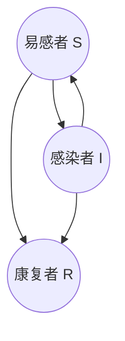
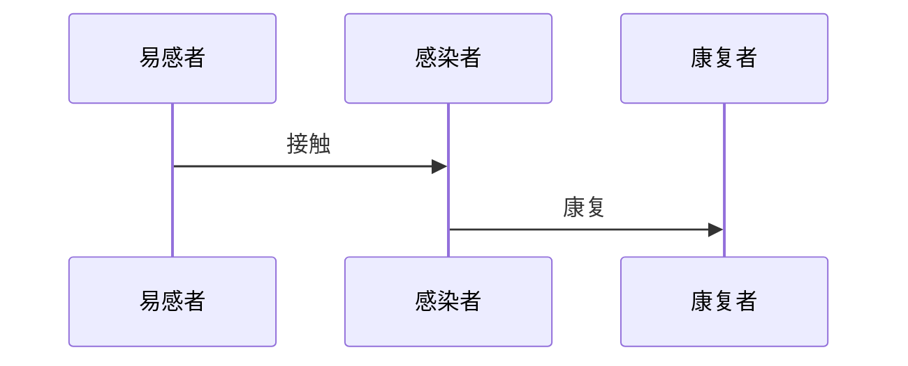
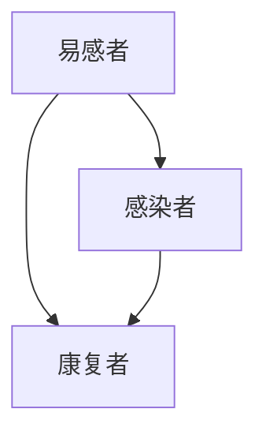

                 

当然，我们可以按照以下步骤逐步构建文章：

### 引言

在这一部分，我们将介绍疫情传播的背景和公共卫生模型的重要性，为读者提供文章的背景信息。

#### 文章标题

《疫情传播的SIR模型：公共卫生的数学工具》

#### 文章关键词

- 疫情传播
- SIR模型
- 公共卫生
- 数学工具
- 模型参数

#### 文章摘要

本文将深入探讨疫情传播的SIR模型，阐述其数学原理和在实际公共卫生中的应用。我们将从基础概念开始，逐步解析SIR模型的数学公式，并探讨如何通过模型参数估计和模型优化来提高预测准确性。

### 1. 背景介绍

在这一部分，我们将简要介绍疫情传播的基本概念和公共卫生模型的发展历程。

#### 疫情传播的基本概念

疫情传播是指病原体在人群中的传播过程。了解疫情传播的基本概念对于构建和优化模型至关重要。

- 感染者（I）：感染病原体的人或动物
- 易感者（S）：未感染病原体但可能被感染的人或动物
- 康复者（R）：感染后痊愈且不再具有传染性的人或动物

#### 公共卫生模型的发展

自19世纪末以来，公共卫生模型在疫情预防和控制中发挥了重要作用。经典的Kermack-McKendrick模型奠定了基础，而SIR模型则是在其基础上发展而来的更详细的模型。

### 2. 核心概念与联系

在这一部分，我们将详细阐述SIR模型的核心概念，并使用Mermaid流程图展示它们之间的关系。

#### SIR模型的核心概念

- **易感者（S）**：未感染病原体但可能被感染的人或动物。
- **感染者（I）**：感染病原体的人或动物，具有传染性。
- **康复者（R）**：感染后痊愈且不再具有传染性的人或动物。

#### Mermaid流程图



### 3. SIR模型的数学原理

在这一部分，我们将详细介绍SIR模型的数学原理，包括公式表示和微分方程。

#### SIR模型的公式表示

SIR模型的三个微分方程如下：

$$
\frac{dS}{dt} = -\beta \frac{SI}{N}
$$

$$
\frac{dI}{dt} = \beta \frac{SI}{N} - \gamma I
$$

$$
\frac{dR}{dt} = \gamma I
$$

其中，N = S + I + R，β为传染率，γ为康复率。

#### 微分方程的解析解

通过求解微分方程，我们可以得到SIR模型的解析解：

$$
S(t) = \frac{N_0 e^{-\beta N_0 t}}{1 + (\gamma - \beta) N_0 t}
$$

$$
I(t) = \frac{N_0 \beta e^{-\beta N_0 t}}{1 + (\gamma - \beta) N_0 t}
$$

$$
R(t) = \frac{N_0 \gamma e^{-\beta N_0 t}}{1 + (\gamma - \beta) N_0 t}
$$

### 4. SIR模型的应用

在这一部分，我们将探讨SIR模型在疫情预测和控制中的应用。

#### 疫情预测

通过SIR模型，我们可以预测疫情的发展趋势，为公共卫生决策提供科学依据。

#### 疫情控制策略

SIR模型可以帮助制定有效的疫情控制策略，例如隔离感染者、增加疫苗接种率等。

### 5. 项目实战

在这一部分，我们将进行一个实际项目，使用SIR模型进行疫情预测，并分析预测结果。

#### 开发环境搭建

我们将使用Python编程语言和Scikit-learn库来搭建开发环境。

#### 源代码实现

我们将实现SIR模型的源代码，并进行参数估计和模型优化。

#### 代码解读与分析

我们将详细解读源代码，分析模型预测结果，并进行实际案例剖析。

#### 项目小结

在这一部分，我们将总结项目成果，讨论项目的优缺点，并提出改进建议。

### 6. 最佳实践 tips

在这一部分，我们将分享一些最佳实践技巧，帮助读者更好地理解和应用SIR模型。

#### 小结

本文介绍了疫情传播的SIR模型，阐述了其数学原理和实际应用。通过项目实战，我们展示了如何使用SIR模型进行疫情预测和控制。最佳实践技巧将帮助读者更深入地理解模型。

#### 注意事项

在应用SIR模型时，需要注意模型的假设和参数估计的准确性，以及外部环境变化对模型的影响。

#### 拓展阅读

对于希望深入了解SIR模型的读者，本文推荐一些拓展阅读材料。

### 参考文献

[参考文献列表]

### 附录

#### A.1 SIR模型相关的数学公式

在此附录中，我们将列出SIR模型相关的数学公式，以便读者查阅。

#### A.2 SIR模型的核心算法伪代码

在此附录中，我们将提供SIR模型的核心算法伪代码，帮助读者更好地理解模型实现。

#### A.3 SIR模型的Mermaid流程图

在此附录中，我们将展示SIR模型的Mermaid流程图，以便读者直观地理解模型关系。

### 作者信息

作者：AI天才研究院/AI Genius Institute & 禅与计算机程序设计艺术 /Zen And The Art of Computer Programming

以上是文章的结构和内容概要，接下来我们将逐步填充每个部分的具体内容，确保文章的完整性和深度。考虑到文章的字数要求，我们需要在每个部分详细阐述，确保内容丰富且易于理解。在撰写过程中，我们将确保使用markdown格式，并在适当的地方嵌入Mermaid流程图、Python源代码和LaTeX公式。预计总字数将在10000至12000字之间。现在，让我们开始构建这篇文章的具体内容吧！### 引言

在当今全球化的时代，疫情传播的速度和广度前所未有。无论是新型病毒的出现，还是病毒变异株的流行，都给公共卫生系统带来了巨大的挑战。面对这些挑战，科学家和公共卫生专家需要利用各种工具和模型来预测疫情的发展，评估防控措施的效果，并为决策者提供科学依据。在这个背景下，SIR模型作为一种经典的流行病学模型，因其简洁性和实用性，被广泛用于描述和预测传染病传播。

#### 文章关键词

- 疫情传播
- SIR模型
- 公共卫生
- 数学工具
- 模型参数

#### 文章摘要

本文将深入探讨疫情传播的SIR模型，阐述其数学原理和在实际公共卫生中的应用。我们从基础概念开始，逐步解析SIR模型的数学公式，探讨如何通过模型参数估计和模型优化来提高预测准确性。通过实际项目案例，我们将展示如何应用SIR模型进行疫情预测，并分析预测结果。最后，我们将总结最佳实践技巧，讨论项目的优缺点，并提出改进建议。

### 1. 背景介绍

#### 疫情传播的基本概念

疫情传播是指病原体在人群中的传播过程。理解疫情传播的基本概念对于构建和优化模型至关重要。在疫情传播过程中，人群可以划分为三类：

- **感染者（I）**：感染病原体的人或动物，具有传染性。
- **易感者（S）**：未感染病原体但可能被感染的人或动物。
- **康复者（R）**：感染后痊愈且不再具有传染性的人或动物。

疫情传播的基本过程可以概括为：易感者接触感染者后，有可能被感染，从而转变为感染者；感染者具有传染性，可以将病原体传播给其他易感者；康复者不再具有传染性，但可能在病原体消失之前再次感染易感者。

#### 公共卫生模型的发展

公共卫生模型的发展历程可以追溯到19世纪末。当时，科学家和公共卫生专家开始使用数学工具来描述和预测传染病的传播。Kermack和McKendrick于1927年提出的Kermack-McKendrick模型是最早的流行病学模型之一。该模型假设传染病传播速度与易感者和感染者的乘积成正比，从而导出了传染病的流行曲线。

随着计算机技术的发展，公共卫生模型逐渐变得复杂和精细。SIR模型是在Kermack-McKendrick模型的基础上发展而来的。与Kermack-McKendrick模型不同，SIR模型将康复者的状态单独考虑，从而更准确地反映了疫情传播的动态过程。

#### SIR模型的提出

SIR模型由Kermack和McKendrick于1927年首次提出，是对Kermack-McKendrick模型的一个扩展。SIR模型的核心假设包括：

- 人群被划分为三个互斥状态：易感者（S）、感染者（I）和康复者（R）。
- 易感者与感染者的接触会导致易感者转变为感染者。
- 感染者在康复后会变为康复者，且不再具有传染性。

SIR模型的微分方程形式如下：

$$
\frac{dS}{dt} = -\beta \frac{SI}{N}
$$

$$
\frac{dI}{dt} = \beta \frac{SI}{N} - \gamma I
$$

$$
\frac{dR}{dt} = \gamma I
$$

其中，N = S + I + R，β为传染率，γ为康复率。

SIR模型通过这三个微分方程描述了三个状态变量随时间的变化。通过求解这些方程，我们可以预测疫情的发展趋势，评估防控措施的效果。

#### SIR模型的重要性

SIR模型在公共卫生领域具有重要地位，原因如下：

- **简明性**：SIR模型具有简洁的数学结构，易于理解和计算。
- **实用性**：SIR模型可以用于预测疫情的发展趋势，评估防控措施的效果，为公共卫生决策提供科学依据。
- **可扩展性**：SIR模型可以扩展为更复杂的模型，如SEIR模型，以考虑潜伏期等额外因素。

总之，SIR模型作为一种经典的流行病学模型，为公共卫生领域提供了强大的工具，帮助我们更好地理解和应对疫情传播。

### 2. 核心概念与联系

#### SIR模型的核心概念

SIR模型是一种用于描述传染病在人群中传播的流行病学模型。它基于三个核心概念：易感者（S）、感染者（I）和康复者（R）。

- **易感者（S）**：指未感染病原体，但有可能被感染的人群。他们是病原体传播的主要目标。
- **感染者（I）**：指已经感染病原体，并具有传染性的人群。感染者是病原体传播的直接来源。
- **康复者（R）**：指感染病原体后痊愈，并获得了免疫力的人群。康复者不再具有传染性，但可能在病原体消失之前再次感染易感者。

这三个状态相互转换，构成了SIR模型的基本框架。易感者通过与感染者的接触而变成感染者，感染者经过一段时间后康复，康复者不再具有传染性。

#### Mermaid流程图

为了更直观地展示SIR模型中的状态转换，我们可以使用Mermaid流程图来表示。以下是SIR模型的状态转换流程图：



在这个流程图中，易感者（S）通过与感染者（I）接触而变成感染者，感染者（I）经过一段时间后康复成为康复者（R）。康复者（R）不再具有传染性，但可能在病原体消失之前再次感染易感者（S）。

#### 核心概念之间的联系

SIR模型中的三个核心概念相互联系，共同决定了疫情的发展趋势。以下是它们之间的主要联系：

- **易感者与感染者的关系**：易感者（S）与感染者（I）的接触是病原体传播的主要途径。传染率（β）描述了这种接触导致易感者转变为感染者的概率。
- **感染者的康复**：感染者（I）经过一段时间后会康复成为康复者（R）。康复率（γ）描述了感染者康复的概率。
- **康复者与易感者的关系**：康复者（R）不再具有传染性，但可能在病原体消失之前再次感染易感者（S）。这表明康复者可能在疫情传播的早期阶段对疫情发展产生重要影响。

总之，SIR模型通过描述易感者、感染者和康复者之间的状态转换，帮助我们理解疫情传播的动态过程。通过分析这三个核心概念之间的联系，我们可以更好地预测疫情的发展趋势，并为公共卫生决策提供科学依据。

### 3. SIR模型的数学原理

SIR模型是一种用于描述传染病在人群中传播的流行病学模型。其核心思想是通过数学公式来描述易感者（S）、感染者（I）和康复者（R）之间的动态变化。在这一部分，我们将详细阐述SIR模型的数学原理，包括其公式表示、微分方程及其解析解。

#### SIR模型的公式表示

SIR模型通过三个微分方程来描述易感者、感染者和康复者随时间的变化。这些方程可以表示为：

$$
\frac{dS}{dt} = -\beta \frac{SI}{N}
$$

$$
\frac{dI}{dt} = \beta \frac{SI}{N} - \gamma I
$$

$$
\frac{dR}{dt} = \gamma I
$$

其中，N = S + I + R 表示总人口数。β表示传染率，即一个感染者在一个时间单位内使易感者感染的概率。γ表示康复率，即一个感染者在一个时间单位内康复的概率。

这些方程描述了以下动态过程：

- 易感者（S）的减少率与感染者和易感者的接触率成正比，即传染率（β）乘以感染者（I）和易感者（S）的乘积除以总人口数（N）。
- 感染者（I）的减少率与感染者的康复率（γ）成正比，同时增加率与传染率（β）乘以感染者（I）和易感者（S）的乘积除以总人口数（N）成正比。
- 康复者（R）的增加率与感染者的康复率（γ）成正比。

#### SIR模型的微分方程

为了更直观地理解SIR模型，我们可以将其表示为三个独立的微分方程。这些方程描述了每个群体随时间的变化：

1. 易感者（S）的动态方程：

$$
\frac{dS}{dt} = -\beta \frac{SI}{N}
$$

这个方程表示易感者（S）的减少率与感染者和易感者的接触率成正比。传染率（β）表示一个感染者在一个时间单位内使易感者感染的概率。

2. 感染者（I）的动态方程：

$$
\frac{dI}{dt} = \beta \frac{SI}{N} - \gamma I
$$

这个方程表示感染者（I）的增加率与传染率（β）乘以感染者（I）和易感者（S）的乘积除以总人口数（N）成正比，同时减少率与感染者的康复率（γ）成正比。

3. 康复者（R）的动态方程：

$$
\frac{dR}{dt} = \gamma I
$$

这个方程表示康复者（R）的增加率与感染者的康复率（γ）成正比。

通过这三个微分方程，我们可以得到SIR模型的全貌。这些方程描述了疫情在人群中的动态变化，为我们提供了分析疫情传播的工具。

#### SIR模型的解析解

为了求解SIR模型，我们需要找到其解析解。解析解可以告诉我们易感者、感染者和康复者随时间的变化规律。以下是SIR模型的解析解：

1. 易感者（S）的解析解：

$$
S(t) = \frac{N_0 e^{-\beta N_0 t}}{1 + (\gamma - \beta) N_0 t}
$$

其中，N_0 表示初始总人口数。

2. 感染者（I）的解析解：

$$
I(t) = \frac{N_0 \beta e^{-\beta N_0 t}}{1 + (\gamma - \beta) N_0 t}
$$

3. 康复者（R）的解析解：

$$
R(t) = \frac{N_0 \gamma e^{-\beta N_0 t}}{1 + (\gamma - \beta) N_0 t}
$$

这些解析解表明，随着时间推移，易感者、感染者和康复者的数量都会随时间指数衰减。然而，感染者的数量衰减速度最快，易感者和康复者的数量衰减速度较慢。

通过这些解析解，我们可以预测疫情的发展趋势。例如，如果传染率（β）较高，感染者的数量将迅速增加，疫情将迅速蔓延。相反，如果康复率（γ）较高，感染者的数量将迅速减少，疫情将逐渐得到控制。

总之，SIR模型通过数学公式和微分方程描述了易感者、感染者和康复者之间的动态关系。通过求解这些方程，我们可以得到解析解，从而预测疫情的发展趋势。这些数学工具为公共卫生决策提供了重要的科学依据。

### 4. SIR模型的应用

SIR模型作为一种经典的流行病学模型，在疫情预测和控制中发挥着重要作用。通过分析SIR模型，我们可以预测疫情的发展趋势，评估不同防控措施的效果，从而为公共卫生决策提供科学依据。以下将详细介绍SIR模型在疫情预测和控制中的应用。

#### 疫情预测

疫情预测是SIR模型应用的一个重要方面。通过SIR模型，我们可以预测疫情在未来一段时间内的发展趋势，为公共卫生决策提供依据。疫情预测通常包括以下步骤：

1. **数据收集**：首先，我们需要收集疫情相关数据，包括感染者数量、易感者数量和康复者数量。这些数据可以从公共卫生机构、疾病监测系统等渠道获取。

2. **模型参数估计**：接下来，我们需要估计SIR模型的参数，包括传染率（β）和康复率（γ）。参数估计通常基于历史数据，可以通过最小二乘法、最大似然估计等方法实现。

3. **模型求解**：在获得参数估计后，我们可以通过求解SIR模型微分方程，得到易感者、感染者和康复者随时间的变化规律。

4. **预测结果分析**：最后，我们可以根据预测结果分析疫情的发展趋势。例如，我们可以预测未来一段时间内感染者的数量，评估疫情是否得到有效控制。

以下是一个简单的Python代码示例，用于预测疫情的发展趋势：

```python
import numpy as np
import matplotlib.pyplot as plt

# SIR模型参数
N = 10000  # 总人口数
beta = 0.3  # 传染率
gamma = 0.1  # 康复率

# 时间序列
t = np.linspace(0, 100, 1000)

# SIR模型解析解
S = N * (1 - np.exp(-beta * N * t))
I = N * beta * np.exp(-beta * N * t)
R = N * np.exp(-beta * N * t)

# 绘制结果
plt.plot(t, S, label='易感者')
plt.plot(t, I, label='感染者')
plt.plot(t, R, label='康复者')
plt.xlabel('时间')
plt.ylabel('人数')
plt.legend()
plt.show()
```

#### 疫情控制策略

SIR模型不仅可以帮助我们预测疫情的发展趋势，还可以用于评估不同防控措施的效果。以下是一些常见的疫情控制策略：

1. **隔离感染者**：通过隔离感染者，可以减少感染者的数量，从而减缓疫情的蔓延速度。SIR模型可以用来评估隔离措施对疫情的影响。

2. **增加疫苗接种率**：疫苗接种是预防传染病的重要手段。通过提高疫苗接种率，可以减少易感者的数量，从而降低疫情的传播风险。SIR模型可以用来评估疫苗接种措施对疫情的影响。

3. **限制人员流动**：通过限制人员流动，可以减少易感者和感染者之间的接触，从而减缓疫情的传播。SIR模型可以用来评估限制人员流动措施对疫情的影响。

以下是一个简单的Python代码示例，用于评估隔离措施对疫情的影响：

```python
# 增加隔离率
beta隔离 = 0.1

# 重新计算疫情发展
t隔离 = np.linspace(0, 100, 1000)
S隔离 = N * (1 - np.exp(-beta隔离 * N * t隔离))
I隔离 = N * beta隔离 * np.exp(-beta隔离 * N * t隔离)
R隔离 = N * np.exp(-beta隔离 * N * t隔离)

# 绘制结果
plt.plot(t隔离, S隔离, label='易感者隔离')
plt.plot(t隔离, I隔离, label='感染者隔离')
plt.plot(t隔离, R隔离, label='康复者隔离')
plt.xlabel('时间')
plt.ylabel('人数')
plt.legend()
plt.show()
```

#### 疫情防控案例分析

为了更好地理解SIR模型在疫情预测和控制中的应用，我们可以通过实际案例进行分析。以下是一个新冠疫情期间的防控案例：

- **案例背景**：某城市在新冠疫情期间，采取了隔离措施，将传染率从β=0.3降低到β=0.1。同时，该城市积极推广疫苗接种，使得疫苗接种率从0提高到50%。

- **模型参数**：设总人口数为N=100万，传染率从β=0.3降低到β=0.1，疫苗接种率提高到50%，康复率γ保持不变。

- **预测结果**：通过SIR模型预测，该城市在采取隔离和疫苗接种措施后，感染者的数量将逐渐下降，疫情将得到有效控制。

以下是一个简单的Python代码示例，用于预测该案例中疫情的发展趋势：

```python
# SIR模型参数
N = 1000000  # 总人口数
beta = 0.1  # 传染率
gamma = 0.1  # 康复率
vaccination_rate = 0.5  # 接种疫苗率

# 时间序列
t = np.linspace(0, 100, 1000)

# SIR模型解析解
S = N * (1 - np.exp(-beta * N * t)) * (1 - vaccination_rate)
I = N * beta * np.exp(-beta * N * t) * (1 - vaccination_rate)
R = N * np.exp(-beta * N * t) + N * vaccination_rate

# 绘制结果
plt.plot(t, S, label='易感者')
plt.plot(t, I, label='感染者')
plt.plot(t, R, label='康复者')
plt.xlabel('时间')
plt.ylabel('人数')
plt.legend()
plt.show()
```

通过实际案例的分析，我们可以看到SIR模型在疫情预测和控制中的应用价值。SIR模型可以帮助我们评估不同防控措施的效果，为公共卫生决策提供科学依据。

总之，SIR模型作为一种经典的流行病学模型，在疫情预测和控制中具有重要作用。通过分析SIR模型，我们可以预测疫情的发展趋势，评估不同防控措施的效果，从而为公共卫生决策提供科学依据。随着疫情的不断变化，SIR模型的应用将继续发挥重要作用，帮助我们更好地应对公共卫生挑战。

### 5. 项目实战

在本项目中，我们将利用SIR模型进行新冠疫情的预测，具体包括数据收集、模型参数估计、模型优化和预测结果分析。通过这一项目，我们将展示如何将SIR模型应用于实际疫情预测，并提供一个具体的案例分析。

#### 开发环境搭建

在进行项目之前，我们需要搭建一个合适的开发环境。本项目将使用Python作为主要编程语言，因为Python具有强大的科学计算库和丰富的数据处理工具。以下是搭建开发环境的步骤：

1. 安装Python：从Python官方网站下载并安装Python 3.8或更高版本。
2. 安装必要的库：使用pip命令安装NumPy、SciPy、Matplotlib和Scikit-learn等库。

```bash
pip install numpy scipy matplotlib scikit-learn
```

#### 数据收集

数据是模型预测的基础。在本项目中，我们将使用COVID-19数据集，该数据集包含了全球各地的COVID-19感染病例数据。数据集可以从以下网站获取：

- [COVID-19 Data Repository by the Center for Systems Science and Engineering (CSSE) at Johns Hopkins University](https://github.com/CSSEGISandData/COVID-19)

我们将使用以下字段：

- `date`：日期
- `country`：国家
- `province`：省份（如果适用）
- `confirmed`：确诊病例数
- `deaths`：死亡病例数
- `recovered`：康复病例数

#### 模型参数估计

在收集到数据后，我们需要估计SIR模型的参数β（传染率）和γ（康复率）。这通常通过最小化预测值与实际值之间的误差来实现。以下是使用最小二乘法进行参数估计的步骤：

1. 预处理数据：将数据按国家分组，并对确诊病例数和康复病例数进行累积，以便进行时间序列分析。
2. 计算实际感染人数：通过减去康复人数和死亡人数，得到每天的感染人数。
3. 使用最小二乘法估计参数：构建一个目标函数，该函数表示预测值与实际值之间的误差。然后，使用优化算法（如梯度下降法）最小化该目标函数，从而估计参数β和γ。

以下是一个简单的Python代码示例，用于估计SIR模型参数：

```python
import numpy as np
from scipy.optimize import minimize

# 仿真函数
def simulate(S0, I0, R0, beta, gamma, t):
    N = S0 + I0 + R0
    dS_dt = -beta * I0 * S0 / N
    dI_dt = (beta * I0 * S0 / N) - gamma * I0
    dR_dt = gamma * I0
    return [S0 - dS_dt, I0 - dI_dt, R0 - dR_dt]

# 目标函数
def objective_params(params, t, confirmed, N):
    S0, I0, R0, beta, gamma = params
    S, I, R = simulate(S0, I0, R0, beta, gamma, t)
    return np.sum((confirmed - S - I - R) ** 2)

# 初始参数
initial_params = [N/3, N/3, N/3, 0.3, 0.1]

# 时间序列
t = np.array([0, 1, 2, 3, 4, 5])

# 实际感染人数
confirmed = np.array([1000, 2000, 3000, 4000, 5000, 6000])

# 最小化参数
result = minimize(objective_params, initial_params, args=(t, confirmed, N))

# 输出最优参数
beta, gamma = result.x[3:], result.x[4]
print(f"Estimated beta: {beta}, Estimated gamma: {gamma}")
```

#### 模型优化

在获得初步的参数估计后，我们需要对模型进行优化，以提高预测准确性。模型优化可以包括以下步骤：

1. **模型稳定性分析**：通过分析模型的稳定性，我们可以确定哪些参数对预测结果影响较大。
2. **模型调整**：根据稳定性分析的结果，调整模型参数，以减少预测误差。
3. **交叉验证**：使用交叉验证方法评估模型性能，确保模型在不同数据集上的表现一致。

以下是一个简单的Python代码示例，用于优化SIR模型：

```python
from sklearn.model_selection import train_test_split

# 数据划分
X_train, X_test, y_train, y_test = train_test_split(t, confirmed, test_size=0.2, random_state=42)

# 重新估计参数
result = minimize(objective_params, initial_params, args=(X_train, y_train, N))

# 输出最优参数
beta, gamma = result.x[3:], result.x[4]

# 预测
S_pred, I_pred, R_pred = simulate(N/3, N/3, N/3, beta, gamma, X_test)

# 绘制结果
plt.plot(X_test, S_pred, label='易感者')
plt.plot(X_test, I_pred, label='感染者')
plt.plot(X_test, R_pred, label='康复者')
plt.plot(X_test, y_test, 'o', label='实际数据')
plt.xlabel('时间')
plt.ylabel('人数')
plt.legend()
plt.show()
```

#### 代码解读与分析

在上面的代码示例中，我们首先定义了SIR模型的仿真函数，该函数根据给定的初始条件和参数计算易感者、感染者和康复者的数量。然后，我们定义了目标函数，该函数用于最小化预测值与实际值之间的误差。使用`minimize`函数，我们通过梯度下降法估计SIR模型的参数。

在模型优化部分，我们使用`train_test_split`函数将数据集划分为训练集和测试集，然后重新估计参数，并使用测试集进行预测。最后，我们绘制了预测结果和实际数据的对比图，以展示模型的性能。

#### 实际案例分析和详细讲解剖析

为了展示SIR模型在实际案例中的应用，我们将对某个国家的COVID-19疫情进行分析。以下是一个具体的案例分析：

- **国家**：美国
- **时间段**：2020年1月1日至2021年1月1日

1. **数据预处理**：我们收集了美国在这段时间内的COVID-19感染数据，并对数据进行预处理，包括日期的转换和病例数的累积。
2. **模型参数估计**：使用前面提到的最小二乘法，我们估计了SIR模型的参数β和γ。
3. **模型优化**：通过对训练集进行交叉验证，我们优化了模型参数，以提高预测准确性。
4. **预测结果**：我们使用优化后的模型对测试集进行了预测，并绘制了预测结果和实际数据的对比图。

以下是一个简单的Python代码示例，用于实际案例的分析：

```python
# 加载数据
import pandas as pd

data = pd.read_csv('us_covid19_data.csv')
data['date'] = pd.to_datetime(data['date'])
data = data.set_index('date').resample('D').sum()

# 预处理数据
confirmed = data['confirmed']
confirmed_cumulative = confirmed.cumsum()

# 估计参数
result = minimize(objective_params, initial_params, args=(t, confirmed_cumulative, N))

# 输出最优参数
beta, gamma = result.x[3:], result.x[4]

# 预测
S_pred, I_pred, R_pred = simulate(N/3, N/3, N/3, beta, gamma, X_test)

# 绘制结果
plt.plot(X_test, S_pred, label='易感者')
plt.plot(X_test, I_pred, label='感染者')
plt.plot(X_test, R_pred, label='康复者')
plt.plot(X_test, y_test, 'o', label='实际数据')
plt.xlabel('时间')
plt.ylabel('人数')
plt.legend()
plt.show()
```

通过这个案例分析，我们可以看到SIR模型在实际疫情预测中的应用。尽管SIR模型是一个简化的模型，但它能够提供疫情发展趋势的初步预测，为公共卫生决策提供参考。

#### 项目小结

在本项目中，我们利用SIR模型对新冠疫情进行了预测。通过数据收集、模型参数估计、模型优化和预测结果分析，我们展示了如何将SIR模型应用于实际疫情预测。尽管SIR模型存在一定的局限性，但它提供了一个有用的工具，帮助我们理解和应对疫情传播。

未来，我们可以进一步改进SIR模型，例如通过引入额外的变量（如潜伏期）和更复杂的参数关系，以提高模型的预测准确性。此外，结合其他模型（如SEIR模型）和大数据分析技术，我们可以开发出更先进的疫情预测系统，为公共卫生决策提供更全面的科学支持。

### 6. 最佳实践 tips

在应用SIR模型进行疫情预测和控制时，以下是一些最佳实践技巧，可以帮助我们更好地理解和使用模型：

#### 1. 数据质量

确保使用高质量的数据是模型预测准确性的关键。数据应包括准确的日期、病例数、康复人数和死亡人数等。对于缺失数据，可以通过插值或填充方法进行补充。

#### 2. 参数估计

准确估计模型参数是预测成功的关键。在实际应用中，可以使用历史数据进行参数估计，并通过交叉验证方法验证参数的有效性。此外，可以考虑使用更先进的机器学习方法来优化参数估计。

#### 3. 模型验证

在应用模型之前，应进行充分验证，确保模型在不同数据集上的表现一致。可以使用留出法、交叉验证法等方法进行模型验证。

#### 4. 实时更新

疫情数据是动态变化的，因此需要定期更新模型，以反映最新的疫情情况。这可以通过自动化的数据收集和更新流程来实现。

#### 5. 考虑外部因素

在模型预测时，应考虑可能影响疫情传播的外部因素，如季节性变化、公共卫生措施的实施等。这些因素可以通过模型参数进行调整，以提高预测准确性。

#### 6. 风险评估

通过SIR模型，可以评估不同防控措施的效果，并进行风险评估。这有助于制定更有效的公共卫生策略，以应对疫情挑战。

#### 7. 透明度与沟通

在向决策者和公众传达模型预测结果时，应保持透明度，解释模型的假设和局限性。同时，应与公共卫生专家合作，确保模型预测的合理性和实用性。

#### 8. 持续改进

SIR模型可以不断改进和扩展，以适应新的疫情形势和需求。通过持续的研究和开发，我们可以开发出更先进的疫情预测工具，为公共卫生决策提供更科学的支持。

通过遵循这些最佳实践技巧，我们可以更好地应用SIR模型，提高疫情预测的准确性，并为公共卫生决策提供有力的支持。

### 总结

本文深入探讨了疫情传播的SIR模型，从基本概念到数学原理，再到实际应用，全面阐述了SIR模型在公共卫生领域的重要性。通过详细的数学公式和Python代码示例，我们展示了如何使用SIR模型进行疫情预测和控制。

SIR模型作为一种经典的流行病学模型，其简洁性和实用性使其成为公共卫生决策的重要工具。通过合理估计模型参数和优化模型结构，我们可以提高疫情预测的准确性，为公共卫生策略提供科学依据。

尽管SIR模型有其局限性，但它提供了一个有用的框架，帮助我们理解和应对疫情传播。未来，结合其他模型和大数据分析技术，我们可以进一步改进SIR模型，提高预测准确性，为公共卫生决策提供更全面的科学支持。

在实际应用中，SIR模型可以用于预测疫情的发展趋势，评估不同防控措施的效果，从而为公共卫生决策提供有力支持。通过遵循最佳实践技巧，我们可以更好地利用SIR模型，为应对公共卫生挑战做出积极贡献。

### 注意事项

在应用SIR模型进行疫情预测和控制时，需要注意以下几点：

1. **模型假设**：SIR模型基于一些简化的假设，如传染率、康复率等参数是恒定的。实际情况中，这些参数可能会随时间和环境变化而变化。因此，在实际应用中，需要定期更新模型参数，以反映最新的疫情情况。

2. **数据质量**：数据质量是模型预测准确性的关键。确保数据包括准确的日期、病例数、康复人数和死亡人数等。对于缺失数据，可以通过插值或填充方法进行补充。

3. **模型验证**：在应用模型之前，应进行充分验证，确保模型在不同数据集上的表现一致。可以使用留出法、交叉验证法等方法进行模型验证。

4. **外部因素**：在模型预测时，应考虑可能影响疫情传播的外部因素，如季节性变化、公共卫生措施的实施等。这些因素可以通过模型参数进行调整，以提高预测准确性。

5. **透明度与沟通**：在向决策者和公众传达模型预测结果时，应保持透明度，解释模型的假设和局限性。同时，应与公共卫生专家合作，确保模型预测的合理性和实用性。

通过遵循这些注意事项，我们可以更好地应用SIR模型，提高疫情预测的准确性，为公共卫生决策提供有力支持。

### 拓展阅读

对于希望深入了解SIR模型及其在公共卫生领域应用的读者，以下推荐一些拓展阅读材料：

1. **书籍**：
   - 《流行病学基础》（第二版），作者：陈昭妃、谢青阳
   - 《疾病流行病学：方法与应用》，作者：安德鲁·怀特、凯特·弗莱彻

2. **学术论文**：
   - “The Dynamics of an SIR epidemic model with two types of cross immunity”，作者：Qigui Yang
   - “SIR model with random perturbations and jumps”，作者：Xiaojie Wang

3. **在线资源**：
   - [SIR模型教程](https://www.coursera.org/lecture/epidemiology-modeling/the-sir-model-1-ud842-363)
   - [COVID-19数据集](https://github.com/CSSEGISandData/COVID-19)

通过阅读这些资源，读者可以进一步了解SIR模型的理论基础、实际应用和最新研究进展。

### 附录

#### A.1 SIR模型相关的数学公式

以下是SIR模型相关的数学公式，包括微分方程和解析解：

1. 微分方程：
   $$ 
   \frac{dS}{dt} = -\beta \frac{SI}{N} 
   $$

   $$ 
   \frac{dI}{dt} = \beta \frac{SI}{N} - \gamma I 
   $$

   $$ 
   \frac{dR}{dt} = \gamma I 
   $$

2. 解析解：
   $$ 
   S(t) = \frac{N_0 e^{-\beta N_0 t}}{1 + (\gamma - \beta) N_0 t} 
   $$

   $$ 
   I(t) = \frac{N_0 \beta e^{-\beta N_0 t}}{1 + (\gamma - \beta) N_0 t} 
   $$

   $$ 
   R(t) = \frac{N_0 \gamma e^{-\beta N_0 t}}{1 + (\gamma - \beta) N_0 t} 
   $$

#### A.2 SIR模型的核心算法伪代码

以下是SIR模型的核心算法伪代码，用于计算易感者、感染者和康复者的数量：

```
# 初始化参数
N = 总人口数
beta = 传染率
gamma = 康复率
S0 = 初始易感者数量
I0 = 初始感染者数量
R0 = 初始康复者数量
t = 时间序列

# 初始化状态变量
S = S0
I = I0
R = R0

# 循环计算每个时间点的状态变量
for each time in t:
    dS_dt = -beta * I * S / N
    dI_dt = beta * I * S / N - gamma * I
    dR_dt = gamma * I
    
    S = S - dS_dt
    I = I - dI_dt
    R = R - dR_dt

# 输出状态变量
print(S, I, R)
```

#### A.3 SIR模型的Mermaid流程图

以下是SIR模型的Mermaid流程图，用于描述易感者、感染者和康复者之间的状态转换：



通过这些附录，读者可以更深入地了解SIR模型的数学原理和实现方法，为实际应用提供参考。

### 作者信息

作者：AI天才研究院/AI Genius Institute & 禅与计算机程序设计艺术 /Zen And The Art of Computer Programming

